## 缩写和符号 （用于附件14，第I卷）

缩写

ACN†Aircraft classification number 

ACR#Aircraft classification rating 

ADP Airside driver permit 

AIP Aeronautical information publication 

APAPI Abbreviated precision approach path indicator 

aprx Approximately 

ARIWS Autonomous runway incursion waming system 

ASDA Accelerate-stop distance available 

ATS Air traffic services 

AT-VASIS Abbreviated T visual approach slope indicator system 

C Degree Celsius 

CBR California bearing ratio 

cd Candela 

CIE Commission Internationale de I'Eclairage 

cm Centimetre 

CRC Cyclic redundancy check 

DME Distance measuring equipment 

E Modulus of elasticity 

FOD Foreign object debris 

ft Foot 

ILS Instrument landing system 

IMC Instrument meteorological conditions 

K Degree Kelvin 

kg Kilogram 

km Kilometre 

km/h Kilometre per hour 

kt Knot 

L Litre 

LCFZ Laser-beam critical flight zone 

LDA Landing distance available 

LFFZ Laser-beam free flight zone 

LSFZ Laser-beam sensitive flight zone 

m Metre 

max Maximum 

MLS Microwave landing system 

mm Millimetre 

mnm Minimum 

MN Meganewton 

Mpa Megapascal 

MSL Mean sea level 

NFZ Normal flight zone 

NM Nautical mile 

NU Not usable 

OCA/H Obstacle clearance altitude/height 

OFZ Obstacle free zone 

OLS Obstacle limitation surface 

OMGWS Outer main gear wheel span 

PAPI Precision approach path indicator 

PCN†Pavement classification number 

PCR Pavement classification rating 

RESA Runway end safety area 

RFF Rescue and firefighting 

RVR Runway visual range 

SMS Safety management system 

TODA Take-off distance available 

TORA Take-off run available 

T-VASIS T visual approach slope indicator system 

VMC Visual meteorological conditions 

VOR Very high frequency omnidirectional radio range 

WHMP Wildlife hazard management programme 

WIP Work in progress 

符号

Degree 

I Equal 

,Minute of arc 

μFriction coeficient 

>Greater than 

<Less than 

%Percentage 

±Plus or minus 

航空器等级号

航空器分类等级

空侧驾驶许可

航行资料汇编

简化精密进近航道指示器

大致

跑道侵入自主警告系统

可用加速停止距离

空中交通服务

简化T式目视进近坡度指示系统

摄氏度

加州承载比

坎德拉（烛光）

国际照明委员会

厘米

循环冗余校验

测距仪

弹性模量

外来物

英尺

仪表着陆系统

仪表气象条件

绝对温度（开尔文）度数

千克

千米

千米/时

海里/时（节）

升

激光束临界飞行区

可用着陆距离

无激光束飞行区

激光束敏感飞行区

米

最大

微波着陆系统

毫米

最小

兆牛（顿）

兆帕（斯卡）

平均海平面

正常飞行区

海里

不能使用

超障高度/超障高

无障碍物区

障碍物限制面

外侧主起落架轮距

精密进近航道指示器

道面等级号

道面分类等级

跑道端安全区

援救与消防

跑道视程

安全管理体系

可用起飞距离

可用起飞滑跑距离

T式目视进近坡度指示系统

目视气象条件

甚高频全向信标

野生动物危害管理方案

正在进行的施工

度

等于

弧度分

摩擦系数

大于

小于

百分比

加或减

## 出版物 （与本附件的规范有关的）

《改进型地面活动引导及控制系统（A-SMGCS）手册》（Doc9830号文件）

《机场设计手册》（Doc9157号文件）

第1部分—跑道

第2部分—滑行道、机坪和等待坪

第3部分—道面

第4部分—目视助航设施

第5部分—电力系统

第6部分—易折性

《航空情报服务手册》（Doc8126号文件）

《飞机性能手册》（Doc10064号文件）

《航空器型号代码》（Doc8643号文件）

《机场规划手册》（Doc9184号文件）第1部分—总体规划第2部分—土地使用与环境管理第3部分—咨询/建设服务指南《机场服务手册》（Doc9137号文件）

第1部分—救援与消防

第2部分—道面表面条件

第3部分—野生动物危害管理

第5部分—残损航空器的搬移

第6部分—障碍物的控制

第7部分—机场应急计划

第8部分—机场运行服务

第9部分—机场维护措施

《空中交通服务规划手册》（Doc9426号文件）

《适航性手册》（Doc9760 号文件）

《航空安保手册》（Doc8973号文件一限制发行）

《航空器噪声管理平衡做法指南》（Doc9829 号文件）

《人的因素培训手册》（Doc9683号文件）

《国际民航组织关于机场和空中航行服务收费的政策》（Doc9082号文件）

《航空器地面除冰/防冰作业手册》（Doc9640 号文件）

《全天候运行手册》（Doc9365号文件）

《场面活动引导及控制系统（SMGCS）手册》（Doc9476号文件）

《机场合格审定手册》（Doc9774号文件）

《激光发射器与飞行安全手册》（Doc9815号文件）

《平行或近似平行仪表跑道同时运行（SOIR）手册》（Doc9643号文件）

《国际民航组织鸟击信息系统（IBIS）手册》（Doc9332号文件）（即将出版）

《空中航行服务程序—机场》(PANS—机场）(Doc 9981号文件）

《空中航行服务程序一航空情报管理》（PANS-AIM）（Doc10066号文件）

《空中航行服务程序—航空器运行》（PANS-OPS）（Doc8168号文件）

第I卷—飞行程序

第Ⅱ卷—目视和仪表飞行程序设计

《空中航行服务程序—空中交通管理》（PANS-ATM）（Doc4444号文件）

《安全管理手册》（Doc9859号文件

《短距起降机场手册》（Doc9150 号文件）

《世界大地测量系统—1984（WGS-84）手册》（Doc9674号文件）

《跑道表面状况的评估、测量和报告》（Cir355号通告）

《新型大飞机对无障碍物区的侵入：运行措施和航空研究》（Cir301号通告）

《新型大飞机对无障碍物区的侵入：碰撞风险模型和航空研究》（Cir345号通告）（即将出版）

## 前言

## 历史背景

机场标准和建议措施是理事会于1951年5月29日依据《国际民用航空公约》（1944年于芝加哥签署）第三十七条的规定首次通过的，并定为公约的附件14。这些标准和建议措施是在机场、航路和地面助航设施专业委员会1947年9月第三次会议和1949年11月第四次会议的建议基础上形成的。

表A列出了随后各次修订的根据，连同所涉及的主要内容清单，以及理事会对该附件和各次修订通过的日期及其生效日期和执行日期。

## 缔约国的行动

通知差异提请各缔约国注意《公约》第三十八条所规定的义务，该义务要求各缔约国将其本国的规章和措施与本附件标准及其任何修订中所载的国际标准之间的任何差异通知本组织。如果通知这种差异对航行安全是重要的，也请各缔约国将这种通知扩大到与本附件及其任何修订中的建议措施之间的任何差异。此外，还请各缔约国将随后可能出现的任何差异或撤销前已通知的任何差异随时通知本组织。本附件的每次修订一经通过，将立即向各缔约国发送一份一项关于通知差异的专门要求。

各国除承担《公约》第三十八条规定的义务外，还请各国注意附件15中关于通过航空情报服务公布其本国的规章和措施与国际民航组织的有关标准和建议措施之间的差异的规定。

情报公布根据本附件规定的标准和建议措施而提供的影响航空器运行的设施、服务和程度，其建立、撤销和改变应根据附件15的规定予以通知和实施。

## 附件各组成部分的地位

附件由以下各部分组成，但并不一定每个附件均具有这些部分；这些部分的地位如下：

## 1 ．组成附件正文的材料

a)标准和建议措施根据《公约》规定由理事会通过。其定义如下：

标准凡有关物理特性、构形、材料、性能、人员或程序的规范，其统一应用被认为对国际航行的安全和正常是必需的，各缔约国将按照《公约》予以遵守；如不可能遵守时，则根据《公约》第三十八条，必须通知理事会。

建议措施凡有关物理特性、构形、材料、性能、人员或程序的规范，其统一应用被认为对国际航行的安全、正常或效率是有利的，各缔约国将力求按照《公约》予以遵守。

b)附录是理事会通过的标准和建议措施的一部分，为了方便起见而单独组成的材料。

c)定义对标准和建议措施中使用的由于在字典中找不到可接受的词义而不能自明其意的术语所做的界定。定义本身并无独立的地位，但构成使用该术语的每一标准和建议措施的一个重要部分，因为术语含义的改变会影响规范的内容。

标准或建议措施的一部分，并与标准或建议措施具有同等地位。

## 2 ．经理事会批准的与标准和建议措施一起出版的材料

a）前言包括根据理事会的行动编写的历史性和解释性材料，其中包括对基于《公约》和通过的决议各国在应用标准和建议措施方面所承担义务的解释。

b）引言由解释性材料组成，列在各部分、章、节的开头以帮助理解正文的应用。

c)注在正文的适当地方所加的注释，用以提供与有关标准和建议措施相关的事实资料或参考资料，但不构成标准和建议措施的一部分。

d）附篇包括对标准和建议措施加以补充，或对实施应用标准和建议措施加以指导的材料。

## 语言文字的选择

本附件以中文、英文、阿拉伯文、法文、俄文和西班牙文六种文字通过。要求每一缔约国从中选择一种文本直接使用或译成本国文字，以便在本国实施和用于《公约》规定的其他用途，并相应地将此通知本组织。

## 编辑上的处理

为了一目了然地表明各条条文的地位，采用了以下做法：“标准”用细正体字（中文译本中用宋体字一译者注）：“建议措施”用细斜体字（中文译本中用楷体字一译者注）并冠以“建议”（黑体）字样以表明其地位：“注”用细斜体字（中文译本中用楷体字一译者注）并冠以“注”字以表明其地位。

在编写各项规范时，采用了以下做法：“标准”使用了关键词“必须/须”，“建议措施”则使用了关键词“应该应”。

本文件中使用的计量单位与《国际民用航空公约》附件5中规定的国际单位制相一致。在附件5中允许使用的非国际单位制的替代单位置于基本单位之后的括号内。当引用两种计量单位时，切不可认为这一对数值是相等的和可以互换的，但可以推定，不论单独使用哪种计量单位均可达到同等的安全水平。

凡援引本文件中有编号和/或有标题的部分时，均包括该部分的所有各分节。

为了保持一份本附件的综合版本，已将最新的各项修订合并纳入新版附件中。在此过程中，已视情对含有特定适用日期的条款做了编辑调整。

表A．附件14第I卷的各次修订

<html><body><table border="1"><tr><td>修订</td><td colspan="2">根据</td><td>通过/批准日期 生效日期</td></tr><tr><td>第一版</td><td></td><td>内容</td><td>执行日期</td></tr><tr><td rowspan="3"></td><td>机场、航路和地面助航设</td><td></td><td>1951.05.29</td></tr><tr><td>施专业会议第三次和第四 次会议</td><td></td><td>1951.11.01</td></tr><tr><td></td><td></td><td>1952.06.01* 1954.06.01</td></tr><tr><td rowspan="3">1-6</td><td rowspan="3">机场、航路和地面助航设 施专业会议第五次会议</td><td>跑道、升降带、净空道、停止道、滑行道和机坪的物理</td><td></td></tr><tr><td>特性；水上机场升降道、掉头区、滑行道和停泊地面的</td><td>1953.05.20</td></tr><tr><td>物理特性；进近区；障碍物的清除和限制；障碍物标志；</td><td>1953.09.01 1954.04.01*</td></tr><tr><td></td><td></td><td>活动区上不能使用部分的标志；备用电源；机场灯标： 跑道标志：停止道标志物：进近、引近和跑道灯光。</td><td>1955.01.01</td></tr><tr><td rowspan="3">7-13</td><td rowspan="3">机场、航路和地面助航设 施专业会议第六次会议</td><td>跑道、升降带、滑行道和机坪的物理特性；进近和起飞</td><td>1958.05.12</td></tr><tr><td>区及面：障碍物的清除和限制：障碍物标志：跑道标志：</td><td>1958.09.01</td></tr><tr><td>停止道标志物；滑行道标志：进近、跑道和滑行道灯光： 盘旋引导灯：救援与消防服务。</td><td>1958.12.01</td></tr><tr><td>14</td><td>通信</td><td>精密进近灯光系统。</td><td></td></tr><tr><td rowspan="3"></td><td rowspan="3"></td><td></td><td>1959.05.07 1959.10.01</td></tr><tr><td></td><td></td></tr><tr><td></td><td>1959.10.01</td></tr><tr><td rowspan="3">15</td><td rowspan="3">垂直间隔专家组</td><td>飞行前高度表校正点。</td><td>1959.05.15</td></tr><tr><td></td><td>1959.10.01</td></tr><tr><td></td><td>1959.10.01</td></tr><tr><td rowspan="3">16</td><td rowspan="3">通信</td><td>灭火剂。</td><td></td></tr><tr><td></td><td>1960.12.02</td></tr><tr><td></td><td>1960.12.02</td></tr><tr><td>17</td><td>通信</td><td></td><td>1960.12.02</td></tr><tr><td rowspan="3"></td><td rowspan="3"></td><td>飞行前高度表校正点。</td><td></td></tr><tr><td></td><td>1960.12.02</td></tr><tr><td>1960.12.02</td><td>1960.12.02</td></tr></table></body></html>

<html><body><table border="1"><tr><td></td><td></td><td></td><td>通过/批准日期 生效日期</td></tr><tr><td>修订</td><td>根据</td><td>内容</td><td>执行日期</td></tr><tr><td rowspan="3">18</td><td rowspan="3">航委会目视助航专家组第 一次会议</td><td rowspan="3">目视进近坡度指示系统。</td><td>1961.06.09</td></tr><tr><td>1961.10.01</td></tr><tr><td>1961.10.01</td></tr><tr><td>19</td><td>机场、航路和地面助航设 施专业会议第七次会议</td><td>跑道、净空道、停止道、滑行道和机坪的物理特性：起 飞和进近区：障碍物的清除和限制：障碍物标志：风向</td><td>1964.03.23 1964.08.01</td></tr><tr><td rowspan="2"></td><td rowspan="2"></td><td>标；着陆方向标；机场灯标：跑道标志；进近灯光系统； 跑道方向指示灯；跑道中线、接地带和滑行道灯光：救 援与消防服务。</td><td>1964.11.01</td></tr><tr><td></td><td></td></tr><tr><td rowspan="3">20</td><td rowspan="3">航委会目视助航专家组第 二次会议</td><td rowspan="3">在Ⅱ类精密进近条件运行使用的目视助航设施。</td><td>1965.12.13</td></tr><tr><td>1966.04.13</td></tr><tr><td>1966.08.25</td></tr><tr><td rowspan="3">21</td><td>第四次航行会议和航委会 目视助航专家组第四次会</td><td>应急灯光系统；跑道入口标志：定距标志：进近灯标； 滑行道中线灯光系统；备用电源：机场灯光和助航标志</td><td>1967.06.28</td></tr><tr><td>议</td><td>的维护；目视助航设施的监控。</td><td>1967.10.28 1968.02.08</td></tr><tr><td>通信和目视助航专家组</td><td></td><td></td></tr><tr><td rowspan="3">22</td><td rowspan="3"></td><td>甚高频全向信标机场校正点标志和标记牌。</td><td>1968.06.28</td></tr><tr><td></td><td>1968.10.28</td></tr><tr><td></td><td>1969.09.18</td></tr><tr><td rowspan="3">23</td><td rowspan="3">第五次航行会议</td><td>公布的距离：道面的强度：机场情况资料：基准代字； 坡度对跑道长度的修正；升降带；滑行道净距；等待坪；</td><td>1969.01.23</td></tr><tr><td>滑行等待位置标志；进近灯光系统；目视进近坡度指示</td><td>1969.05.23</td></tr><tr><td>系统；备用电源；救援与消防服务；减轻鸟害服务。</td><td>1969.09.18</td></tr><tr><td rowspan="3">24</td><td rowspan="3">航委会目视助航专家组第 五次会议及航委会救援与 消防专家组第一次会议</td><td>活动区上不能使用或不可使用部分的标志；接地带标</td><td>1971.03.23</td></tr><tr><td>志：Ⅱ类精密进近跑道等待位置标志和标记牌：T式和</td><td>1971.09.06</td></tr><tr><td>简化T式目视进近坡度指示系统；跑道边线灯光系统； 出口滑行道中线灯光系统；停止排灯和净距排灯；应急 通道：灯的颜色的规范。</td><td>1972.01.06</td></tr><tr><td rowspan="3">25</td><td rowspan="3">航委会目视助航专家组</td><td rowspan="3">对长机身航空器的目视进近坡度引导。</td><td></td></tr><tr><td>1971.05.26</td></tr><tr><td>1971.09.26</td></tr><tr><td rowspan="3">26</td><td rowspan="3">第十七届大会和中东/东南 亚地区航行会议</td><td rowspan="3">机场安保；水上救援运载工具。</td><td>1972.01.06</td></tr><tr><td>1971.12.15</td></tr><tr><td>1972.04.15</td></tr><tr><td rowspan="3">27</td><td rowspan="3">航委会目视助航专家组和</td><td rowspan="3">跑道中线灯的颜色编码：维护服务。</td><td>1972.12.07</td></tr><tr><td></td></tr><tr><td>1972.03.20</td></tr><tr><td rowspan="3"></td><td rowspan="3">中东/东南亚地区航行会议</td><td rowspan="3"></td><td>1972.07.20</td></tr><tr><td>1972.12.07</td></tr><tr><td></td></tr><tr><td>28</td><td>秘书处和航委会目视助航 专家组第六次会议</td><td>地面雪的定义；灯具的易折性：跑道中线标志：滑行道 中线灯光系统；灯的颜色的规范。</td><td>1972.12.11 1973.04.11 1973.08.16</td></tr></table></body></html>

<html><body><table border="1"><thead><tr><td></td><td></td><td></td><td>通过/批准日期 生效日期</td></tr></thead><tbody><tr><td>修订</td><td>根据</td><td>内容</td><td>执行日期</td></tr><tr><td>29</td><td>理事会根据大会A17-10和</td><td>机场安保。</td><td>1973.12.07 1974.04.07</td></tr><tr><td></td><td>A18-10号决议采取的措施</td><td></td><td>1974.05.23</td></tr><tr><td>30</td><td>第八次航行会议和对附件</td><td>跑道道肩和升降带：跑道端安全区：机场基准温度：净</td><td>1976.02.03</td></tr><tr><td></td><td>的编辑修订</td><td>空道；等待坪；滑行道的物理特性；滑行道道肩和滑行</td><td>1976.06.03</td></tr><tr><td></td><td></td><td>带；道面强度：跑道横坡；跑道制动作用：障碍物限制 面；Ⅲ类精密进近跑道灯光系统和标志；滑行道灯光系</td><td>1976.12.30</td></tr><tr><td></td><td></td><td>统；停止排灯；救援与消防服务；残损航空器的搬移。</td><td></td></tr><tr><td>31</td><td>航委会目视助航专家组第</td><td>障碍物限制面；光强控制；嵌入灯温度：滑行道中线灯；</td><td>1976.12.13</td></tr><tr><td></td><td>七次会议和航委会超障专</td><td>机坪泛光灯：目视停靠引导系统：标记牌：目视助航设</td><td>1977.04.13</td></tr><tr><td></td><td>家组第五次会议</td><td>施的维护。</td><td>1977.10.06</td></tr><tr><td>32</td><td>信函和航委会目视助航专</td><td>易折性的定义；在飞机运转区上设备和装置的定位和建</td><td>1977.12.14</td></tr><tr><td></td><td>家组</td><td>筑；灯光和标志的颜色的规范。</td><td>1978.04.14</td></tr><tr><td></td><td></td><td></td><td>1978.08.10</td></tr><tr><td>33</td><td>通信和秘书处</td><td>目视进近坡度指示系统的情况报告：跑道、滑行道和滑</td><td></td></tr><tr><td></td><td></td><td>行等待位置标志：内移跑道入口的进近灯光：跑道边线</td><td>1979.03.26 1979.07.26</td></tr><tr><td></td><td></td><td>和中线灯：机场应急计划。</td><td>1979.11.29</td></tr><tr><td>34</td><td>秘书处和航委会目视助航</td><td>机坪标志：精密进近灯光系统；目视进近坡度指示系统：</td><td></td></tr><tr><td></td><td>专家组</td><td>盘旋引导灯：跑道引进灯光系统：停止排灯：目视停靠</td><td>1979.11.30 1980.03.30</td></tr><tr><td></td><td></td><td>引导系统；航空器机位操纵引导灯；航空器机位识别标 记牌；障碍物标志和灯光。</td><td>1980.11.27</td></tr><tr><td></td><td></td><td></td><td></td></tr><tr><td>35</td><td>秘书处和航委会目视助航 专家组</td><td>道面强度的通报：目视进近坡度指示系统；进近灯光系 统；灯光系统的维护。</td><td>1981.03.23 1981.07.23</td></tr><tr><td></td><td></td><td></td><td>1981.11.26</td></tr><tr><td>36</td><td></td><td></td><td></td></tr><tr><td></td><td>机场、航路和地面助航设 施会议(1981年)，航委会</td><td>机场基准代号：跑道摩阻特性：跑道端安全区：滑行道间 距：快速出口滑行道；滑行道桥：等待坪：障碍物限制面：</td><td>1982.11.22</td></tr><tr><td></td><td>目视助航专家组第九次会</td><td>精密目视进近坡度指示器：滑行等待位置标志和灯：跑道</td><td>1983.03.23 1983.11.24</td></tr><tr><td></td><td>议和秘书处</td><td>中线引导：目视地面信号：救援与消防：机坪管理服务： 公布的距离：航空器地面服务；计量单位。</td><td></td></tr><tr><td>37</td><td>秘书处</td><td>加油。</td><td></td></tr><tr><td></td><td></td><td></td><td>1983.03.29 1983.07.29</td></tr><tr><td></td><td></td><td></td><td>1983.11.24</td></tr><tr><td></td><td></td><td></td><td></td></tr><tr><td>38</td><td>秘书处和航委会目视助航</td><td>机场资料：简化精密进近航道指示系统：出口滑行道中</td><td>1986.03.17</td></tr><tr><td></td><td>专家组</td><td>线灯的颜色编码：停止排灯：滑行等待位置灯：滑行道</td><td>1986.07.27</td></tr><tr><td></td><td></td><td></td><td></td></tr><tr><td></td><td></td><td></td><td></td></tr><tr><td></td><td></td><td></td><td></td></tr><tr><td></td><td></td><td></td><td></td></tr><tr><td></td><td></td><td></td><td></td></tr><tr><td></td><td></td><td></td><td></td></tr><tr><td></td><td></td><td></td><td></td></tr><tr><td></td><td></td><td></td><td></td></tr><tr><td></td><td></td><td></td><td></td></tr><tr><td></td><td></td><td></td><td></td></tr><tr><td></td><td></td><td></td><td></td></tr><tr><td></td><td></td><td></td><td></td></tr><tr><td></td><td></td><td></td><td></td></tr><tr><td></td><td></td><td></td><td></td></tr><tr><td></td><td></td><td></td><td></td></tr><tr><td></td><td></td><td></td><td></td></tr><tr><td></td><td></td><td></td><td></td></tr><tr><td></td><td></td><td></td><td></td></tr><tr><td></td><td></td><td></td><td></td></tr><tr><td></td><td></td><td></td><td></td></tr><tr><td></td><td></td><td></td><td></td></tr><tr><td></td><td></td><td></td><td></td></tr><tr><td></td><td></td><td></td><td>1986.11.20</td></tr><tr><td></td><td></td><td></td><td></td></tr><tr><td></td><td></td><td></td><td></td></tr><tr><td></td><td></td><td>道中线灯的维护：表面标志的颜色。</td><td></td></tr><tr><td></td><td></td><td>边线标志物：架空线标志物：灯塔的障碍物灯光：滑行</td><td></td></tr></table></body></html>

<html><body><table border="1"><tr><td>修订</td><td>根据</td><td>内容</td><td>通过/批准日期 生效日期 执行日期</td></tr><tr><td>39 （附件14第I卷 第一版）</td><td>秘书处和航委会目视助航 专家组</td><td>1) 附件以如下两卷发行：第I卷一《机场设计和运 行》（编入经第39次修订修正的附件14第八版的 各项规定）和第Ⅱ卷一《直升机场》。 2) 起飞跑道；机场基准代号；道面强度的通报；跑道摩 阻特性；活动区的情况：平行跑道的间距：滑行道最 小间距；滑行等待位置标志；精密进近航道指示系统</td><td>1990.03.09 1990.07.30 1990.11.15</td></tr><tr><td>1 （附件14第I卷 第二版）</td><td>航委会目视助航专家组第 十二次会议和秘书处</td><td>安装容差；障碍物限制面：停止排灯：标记牌：滑行 道中线标志；机场安保；地面活动引导及控制：机场 应急计划；救援与消防；维护；跑道道面加覆盖层； 减轻鸟害：机坪管理服务：透光标记牌和信号板的颜 色：航空地面灯特性。 易折物体、精密进近跑道、道路、道路等待位置、跑道 警戒灯、滑行等待位置的定义；标准大地测量参考系统； 无线电高度表操作区、平行跑道之间的最小间距；易折 性；跑道和滑行道标志、航空灯标、微波着陆系统运行 的助航灯光、取消关于目视进近坡度指示系统（简化目</td><td>1995.03.13 1995.07.24 1995.11.09</td></tr><tr><td>2</td><td>空中航行委员会</td><td>视进近坡度指示系统）和三排目视进近坡度指示系统 （简化三排目视进近坡度指示系统）的规范、停止排灯、 跑道警戒灯、目视停靠引导系统、滑行引导标记牌：障 碍灯照明；标示限制使用区的目视助航设施；备用电源、 电力系统、监控、机场设计、地面运行引导及控制系统、 救援与消防，目视助航设施的维护；航空地面灯的特性； 信息标志的形状和比例：滑行引导标记牌的设计；湿跑 道的摩阻特性。</td><td>1997.03.20</td></tr><tr><td>3 （附件14第I卷 第三版）</td><td>航委会目视助航专家组第 十三次会议和秘书处</td><td>航空数据库及世界大地测量系统—1984（WGS-84） 的垂直分量。 机场交通密度、除冰/防冰设施、除冰/防冰坪、除冰/防 冰保持时间、人的因素原理、人的行为能力、中间等待 位置、跑道等待位置、标记牌、转换时间等的定义：表 1-1中新的机场基准代字F：与代字为F的飞机运行有 关的跑道、滑行道、滑行道与其他设施之间的最小间距、 视距、升降带、跑道端安全区、净空道、停止道、滑行</td><td>1997.07.21 1997.11.06 1999.03.05 1999.07.19 1999.11.04</td></tr><tr><td></td><td></td><td>道桥、等待坪、跑道等待位置、中间等待位置和道路等 待位置、除冰/防冰设施：基准代字为F的机场的无障 碍物区的宽度；跑道等待位置标志、中间等待位置标志、 强制性指令标志、除冰/防冰设施标志、进近灯光系统、 跑道及滑行道中线灯、停止排灯、中间等待位置灯、除 冰/防冰设施照明、跑道警戒灯、可变信息标记牌、交 叉点处起飞标记牌；标示障碍物的目视助航设施；备用 电源倒闸时间、机场设计中的安保措施、在运行区内的 非目视助航设施的易折性：应用于机场应急计划、救援 与消防、维护以及Ⅱ、Ⅲ类精密进近跑道预防性维护系 统的人的因素原理：航空地面灯的颜色测量：高光强滑 行道中线灯和跑道警戒灯的等光强曲线；标记牌平均亮 度的测量；附录4的表4-1；附录6。</td><td></td></tr></table></body></html>

<html><body><table border="1"><tr><td>根据</td><td></td><td></td><td>通过/批准日期 生效日期</td></tr><tr><td>修订 4</td><td>秘书处和航委会超障专家</td><td>内容 机场许可证、持证机场、安全管理体系的定义，机场许</td><td>执行日期 2001.03.12</td></tr><tr><td></td><td>组第十二次会议</td><td>可证颁发；障碍物限制面；有关机场应急计划的规范； 救援与消防。</td><td>2001.07.16 2001.11.01</td></tr><tr><td>5</td><td>秘书处</td><td>无激光束飞行区和减轻鸟害。</td><td>2003.03.07 2003.07.14 2003.11.27</td></tr><tr><td>6 （附件14第I卷 第四版）</td><td>航委会目视助航专家组第 十四次会议和秘书处</td><td>跑道掉头坪、历法、基准和格列高利历的定义；共用基 准系统；机场的尺寸和有关资料；跑道掉头坪的物理特 性；跑道掉头坪标志和灯光：快速出口滑行道指示灯； 信息标志：停止排灯：跑道警戒灯：快速出口滑行道的 滑行道中线灯的光强；图6-2，高结构物的标志和照明 示例：航空导航设施的供电系统；灯光系统的监控：附</td><td>2004.02.27 2004.07.12 2004.11.25</td></tr><tr><td>7</td><td>秘书处，航空环境保护委 员会第六次会议</td><td>录1，航空地面灯、标志、标记牌和面板的颜色：附录 2，航空地面灯的特性：附录5，航空数据质量要求。 对跑道等待位置定义的注释：机场许可证颁发：对土地 利用规划和航空器噪声管理的平衡办法的参考；跑道掉 头坪：滑行道；减轻鸟害；围界和道面维护。</td><td>2005.03.02 2005.07.11 2005.11.24</td></tr><tr><td>8</td><td>国际民航组织大会第35届 会议；航委会超障专家组 第14次会议；第11次航</td><td>中断着陆、安全方案和安全管理体系的定义：安全管理： 无障碍物区。</td><td>2006.03.14 2006.07.17 2006.11.23</td></tr><tr><td>9</td><td>行会议 秘书处</td><td>关于机轮至滑行道边缘净距的适用性的注释。</td><td>2006.6.15</td></tr><tr><td>10-A （附件14第I卷 第五版）</td><td>秘书处，机场专家组第一 次会议，运行专家组第七 次会议</td><td>仪表跑道和障碍物的定义；机场的合格审定；机场数据； 增强型滑行道中线标志；强制性指令标志：滑行道边灯； 高级目视停靠指引系统：强制性标记牌：风力发电机的 标志和照明：机场应急计划中的突发公共卫生事件：救 援与消防；减少野生动物撞击的危害；道面监控和维护； 附录1中的绿色色度和亮度因数：附录2中跑道边灯等</td><td>2009.03.04 2009.07.20 2009.11.19</td></tr><tr><td>10-B</td><td>秘书处</td><td>光强图A2-9和A2-10的注解：附录4图A4-2中的禁 止进入标记牌：附篇A中关于跑道表面平整度、内移 跑道入口的位置以及救援与消防的指南。 安全管理：附录7：安全管理体系（SMS）的框架； 附篇C：国家安全方案（SSP）的框架。</td><td>2009.03.04 2009.07.20 2010.11.18</td></tr></table></body></html>

<html><body><table border="1"><tr><td>修订</td><td>根据</td><td>内容</td><td>通过/批准日期 生效日期 执行日期</td></tr><tr><td>11-A （附件14第I卷 第六版）</td><td>机场专家组第二次会议 (AP/2); 安全管理专家组特别会议 (SMP/SM/1); 秘书处（得到从航空情报 服务向航空情报管理过渡 研究小组（AIS-AIMSG） 的支持）</td><td>危险区的定义；机场地图数据和完整性分类的定义；仪 表跑道和非仪表跑道的定义；将安全管理规定转移至附 件19：最大允许胎压类型；活动区及有关设施的状况； 机场地图数据：跑道和跑道掉头坪的道面：升降带上的 物体：防吹坪：跑道端安全区：停止道和滑行道的道面： 增强型滑行道中线标志；简易接地带灯；交替设置的滑 行道中线灯；停止排灯；跑道警戒灯；禁止进入排灯； 重新安排第6章的格式：标示障碍物的目视助航设施； 机场应急计划（包括模块化检验）：救援与消防（包括 性能水平c的泡沫）；运行区上的设备和装置的位置选 定：机场维护（包括跑道表面的摩阻特性）：污染物的 清除：跑道道面加覆盖层和目视助航设施（包括发光二 级管（LEDs））：附录1一航空地面灯、标志、标记牌 和面板的颜色（包括用干发光二级管的白色）：附录2一 航空地面灯的特性（包括禁止进入排灯）：附录5一完 整性分类：附篇A：关于如下各项的指导材料：评估被 雪、雪浆、冰和霜覆盖的铺筑道面的表面摩阻特性；为 修建和维护目的确定表面摩阻特性：活动区和相邻地区 的排水性能：以及跑道端安全区。</td><td>2013.02.27 2013.07.15 2013.11.14</td></tr><tr><td>11-B</td><td>秘书处在进近分类工作队 （ACTF）的支持和机场专 家组（AP）、仪表飞行程序 专家组（IFPP）、导航系统 专家组（NSP）和运行专家 组（OPSP）的协作下</td><td>由于采用新的进近分类而对仪表和非仪表进近跑道的 定义进行的修改。</td><td>2013.02.27 2013.07.15 2014.11.13</td></tr><tr><td>12</td><td>秘书处与机场专家组协调 并在空中航行服务程序机 场研究组的支助下</td><td>《空中航行服务程序—机场》（PANS—机场，Doc 9981号文件）第一版</td><td>2015.03.04 2015.07.13 2016.11.10 2016.02.22</td></tr><tr><td rowspan="2">13-A （附件14第I卷 第七版）</td><td>机场专家组第三次会议 (AP/3) 机场设计和运行专家组第 一次会议(ADOP/1)</td><td>拦阻系统、跑道侵入自主警告系统(ARIWS)、外来物 (FOD)的定义；对拦阻系统的描述；跑道和滑行带上的 暴雨输水系统：防吹坪：基准代码为C滑行道直线部分</td><td>2016.07.11 2016.11.10</td></tr><tr><td></td><td>和曲线部分的净距：缩小滑行道与滑行通道的间隔距 离：航空器机位的净距；防止跑道侵入的滑行道设计指 导；发光二极管的闪烁特征和颜色规范；澄清光强的分 布：高度超过150米的风力发电机的标志和照明：精密 进近航道指示器障碍物保护面位置的标准；强制性指令 和信息标志：跑道侵入自主警告系统：外来物的预防和 装设检测装置：关于跑道表面不平整性、跑道侵入自主 警告系统、旨在最大限度降低跑道侵入可能性的滑行道 设计和机场地图数据的指导材料。</td><td></td></tr></table></body></html>

<html><body><table border="1"><tr><td>修订</td><td>根据</td><td>内容</td><td>通过/批准日期 生效日期 执行日期</td></tr><tr><td>13-B</td><td>机场专家组第三次会议 (AP/3)，由摩阻力工作队 编制</td><td>使用经加强的全球报告格式进行跑道表面状况评估和 报告。</td><td>2016.02.22 2016.07.11 2020.11.05</td></tr><tr><td>14 （附件14第I卷 第八版)</td><td>机场设计和运行专家组第 二次会议（ADOP/2）； 仪表飞行程序专家组第十 三次会议（IFPP/13）；和 航空情报服务一航空情 报管理研究组第十二次会</td><td>表1-1内经修改的机场基准代号：跑道宽度、道肩、掉头 坪和升降带；滑行道宽度、道肩和滑行带；缩短的滑行道 最小间隔距离；对表4-1脚注e进行更新的一项修订；和 由于对附件15的结构调整以及出台《空中航行服务程序 一航空情报管理》（PANS-AIM，Doc10066号文件）而 产生的相应修订，内容涉及对参考文件、数据质量要求</td><td>2018.03.09 2018.07.16 2018.11.08</td></tr><tr><td>15</td><td>议（AIS-AIMSG/12） 机场设计和运行专家组第 三次会议（ADOP/3） 《空中航行服务程序 机场》研究组第八次会议 (PASG/8)</td><td>和基于性能的数据误差检测要求的改动。 经修改的IⅢ类精密进近跑道的定义：机场总体规划：配 备折叠翼尖的飞机：道面强度的报告；活动区内正在进 行的工作报告；净空道的宽度：滑行道术语标准化；跑 道警戒灯：禁止进入排灯：标记牌的最小尺寸：航空器 自动探测系统：标示关闭跑道和滑行道或其部分的目视 助航设施：机场人员培训：野生动物管理程序；机坪安</td><td>2020.03.09 2020.07.20 2020.11.05 2022.11.03 2024.11.28</td></tr><tr><td>16</td><td>国际民航组织理事会第 220届会议第八次会议</td><td>全管理：以及确定空侧驾驶许可。 推迟第13-B次修订的适用日期：修订涉及使用增强型全 球报告格式评估和报告跑道表面状况。</td><td>2020.06.19 2020.09.30 2021.11.04</td></tr><tr><td>17 （附件14第I卷 第九版)</td><td>飞行运行专家组第五次会 议（FLTOPSP/5）与机场设 计和运行专家组（ADOP） 协调</td><td>通用航空的援救和消防</td><td>2022.03.07 2022.07.18 2022.11.03</td></tr></table></body></html>

## 国际标准和建议措施

## 第1章总则

引言本附件载有规定机场所应具备的物理特性和障碍物限制面，以及机场上一般设有的某些设施和技术服务方面的标准和建议措施（规范）。它同时包含针对限制面之外障碍物的规范。这些规范并没有限制或控制航空器运行的意图。

在很大程度上，附件14第I卷中详述的各设施的规范，已通过本章所述的基准代号系统和定义中规定的拟使用这些设备的跑道类型编号相互联系起来。这不仅简化了对本附件第I卷的阅读，而且在大多数情况下，只要遵循这些规范，便可有效地配备相称的机场创造条件。

本文件为具有当前使用的航空器或计划使用的类似航空器的特性的航空器规定了最低机场规范。因此，没有考虑对要求更高的航空器需提供的更多的安全措施。这种问题留待有关当局根据每一具体机场的需要加以评价和考虑。现有机场容纳要求更高的航空器的规定见《空中航行服务程序一机场》（Doc9981号文件）。关于未来的航空器对这些规范的某些可能影响的指导材料，见《机场设计手册》（Doc9157号文件）第2部分。

应当注意，对于Ⅱ、Ⅲ类精密进近跑道的规范仅适用于拟供代码为3和4的飞机使用的跑道。

附件14第I卷不包括有关机场全面规划（诸如相邻机场之间的间隔或单个机场的容量）、对环境的影响或在机场发展中需要考虑的经济因素和其他非技术因素的规范。关于这些问题的资料包括在《机场规划手册》（Doc9184号文件）第1部分中。关于机场的发展和运营对环境的影响的指导材料包括在《机场规划手册》（Doc9184号文件）第2部分中。

航空安保是机场规划和运行的一个必要组成部分。附件14第I卷包含了一些旨在加强机场安保水平的规范。有关安保的其他设施的规范见附件17一《航空安保》，关于对该问题的详细指导材料载于《航空安保手册》（Doc8973号文件一限制发行）。

### 1.1 定义

用于本附件中的下列术语具有如下含义：

机场陆上或水上的一块划定区域（包括所有建筑物、设施和设备），其全部或部分供航空器着陆、起飞和地面活动之用。

机场灯标用以从空中指示机场位置的航空灯标。

机场许可证由主管当局根据适用的规章颁发的机场运行许可证。

机场标高着陆区内最高点的标高。

机场识别标记牌为帮助从空中识别机场而在机场设置的标记牌。

机场地图数据（AMD）为汇编供航空使用的机场地图信息之目的收集的数据。

注：收集机场地图数据的目的包括加强用户情景意识、场面导航运行、培训、制图和规划等。

机场地图数据库（AMDB）一套按照结构化数据集组织和安排的机场地图数据。

机场基准点机场标定的地理位置。

## 机场交通密度

低每条跑道平均繁忙小时起降架次不超过15架次，或者平均繁忙小时机场总起降架次一般不超过20架次。

b）中每条跑道平均繁忙小时起降架次达到16至25 架次，或者平均繁忙小时机场总起降架次一般为20至35架次。

c）高每条跑道平均繁忙小时起降架次达到26架次或更多，或者平均繁忙小时机场总起降架次一般超过35架次。

注1：平均繁忙小时起降架次是全年每天最繁忙小时起降架次的算术平均数。

注2：一次起飞或一次着陆即构成一个起降架次。

航空灯标为标示地球表面上某一特定点而设置的、从各个方位都能看见的连续发光或间歇发光的航空地面灯。

航空地面灯非航空器上显示的所有专门为助航而设置的灯。

飞机基准飞行场地长度在批准的最大起飞质量、海平面、标准大气条件、无风和跑道坡度为零的条件下飞机起飞所需的最小飞行场地长度。它载于颁证当局规定的相应飞机飞行手册或飞机制造厂商提供的等效数据中。飞行场地长度即为飞机的平衡飞行场地长度（如适用），或在其他情况下为起飞距离。

注：附篇A第2节提供了关于平衡飞行场地长度概念的资料：《适航性手册》（Doc9760号文件）载有有关起飞距离问题的详细指导材料。

航空器等级号（ACN）↑用以表示航空器对一具有规定标准土基等级的道面的相对影响的一个编号。

注：航空器等级号是按在关键起落架上产生临界荷载的重心位置（CG）来计算的。一般用对应于停机坪（机坪）最大总质量的最后重心位置来计算ACN。在特殊情况下，最前重心位置可能使前起落架产生更临界的荷载。

航空器分类等级（ACR）“用以表示航空器对一具有规定标准土基等级的道面的相对影响的一个编号。

注：航空器分类等级是按在关键起落架上产生临界荷载的重心位置（CG）来计算ACR的。一般用对应于最大机坪（机坪）总质量的最后重心位置来计算ACN。在特殊情况下，最前重心位置可能使前起落架产生更临界的荷载。

航空器机位机坪上用于停放航空器的一块指定区域。

机坪陆地机场上供航空器上下旅客、装卸邮件或货物、加油、停放或维修之用的一块划定区域。

机坪管理服务为管理航空器和车辆在机坪上活动和移动而提供的服务。

拦阻系统设计用来降低冲出跑道飞机的速度的系统。

跑道侵入自主警告系统（ARIWS）一种地面系统，可对在用跑道上的潜在侵入或占用情况提供自动探测，并可向飞行机组或车辆驾驶员提供直接警告。

中断着陆在低于超障高度/超障高（OCA/H）的任一点意外中止着陆的操作。

短排灯紧密地排在一条横线上的三个或三个以上的航空地面灯，使其从远处看来像一条短光线条。

日历为确定分辨率为一天的时间位置提供基准的离散时间基准系统（ISO19108*）。

持证机场机场经营人已获得机场许可证的机场。

净空道在有关主管当局管理下，经选定或整备的可供飞机在其上空进行部分起始爬升至规定高度的陆地或水上划定的一块长方形区域。

循环冗余校验 (CRC)）一种适用于数据的数字表达的数学算法，这种算法可为防止数据丢失或改变提供一定保证。

数据精确度估计值或测量值与真实值之间的吻合度。

数据完好性（保证等级）保证航空数据及数据值自签发或颁布修订后，不发生丢失或畸变的程度。

数据质量所提供数据的精确度、分辨率、完好性（或同等保证程度）、可追溯性、及时性、完整性和格式可在多大的置信程度或置信水平上满足数据用户的要求。

基准可以用来作为计算其他量的参照或基础的任何量或一组量（ISO19104**）。

除冰/防冰设施一种清除飞机上的霜、冰或雪（除冰）以使飞机表面洁净，和/或在有限时间内保护洁净的飞机表面不致结霜、结冰，和不致积聚雪或融雪的（防冰）设施。

注：进一步的指导见《航空器地面除冰/防冰作业手册》（Doc9640号文件）。

除冰/防冰坪由内外两个区域组成的一块场地，内区用于停放接受除冰/防冰处理的飞机，外区用于两部或多部移动式除冰/防冰设备的活动。

## 公布的距离

a)可用起飞滑跑距离（TORA）公布的可用并适于飞机起飞时进行地面滑跑的跑道长度。

b)可用起飞距离（TODA）可用起飞滑跑距离的长度加上净空道（如设有）的长度。

c)可用加速停止距离（ASDA）可用起飞滑跑距离的长度加上停止道（如设有）的长度。

d)可用着陆距离（LDA）公布的可用并适于飞机着陆时进行地面滑跑的跑道长度。

相关平行进近在平行或近似平行仪表跑道上，两条相邻跑道中心线延长线上航空器之间配备有最小雷达间隔的同时进近。

内移的跑道入口不是设在跑道起端的跑道入口。

有效光强闪光灯的有效光强等同于在同等观察条件下产生同等视程的同色恒定发光灯的光强。

椭球高（大地高）某一点相对于地球基准球面的高度，该高度沿通过该点的椭球面外法线测量。

恒定发光灯从一个固定点观察时光强不变的灯。

外来物（FOD)活动区内没有运行或航空功能并对航空器运行具有潜在危害的无生命的物体。

易折物体一种设计成受到冲击便会折断、扭曲或弯曲，从而对航空器造成最小危害的轻质量物体。

注：对易折性设计的指导见《机场设计手册》（Doc9157号文件）第6部分。

大地基准为确定当地参考系统相对于全球参考系统的位置和方位所需要的起算数据。

大地水准面地球重力场中与静止的平均海平面（MSL）相重合并连续向陆地延伸的等势面。

注：由于受局部重力扰动（如风、潮汐、含盐浓度、潮流等）的作用，大地水准面呈不规则曲面，但任一点的重力方向均与大地水准面相垂直。

大地水准面高差大地水准面高于（正）或低于（负）数学参考椭球面的距离。

注：对于世界大地测量系统—1984（WGS-84)定义的椭球面而言，WGS-84椭球面标高与铅垂高之差即为WGS-84大地水准面高差。

格列高利历通用的历法；于1582年首次采用，用来定义一年的时间，比儒略历更接近回归年（ISO19108***）。

注：在格列高利历中，平年有365天，闰年有366天，分成十二个连续的月。

危险灯标用以标示对航行有危险的航空灯标。

直升机场全部或部分供直升机进场、离场和表面活动使用的机场或在构筑物上划定的区域。

等待坪一块划定的供航空器等待或让路，以提高航空器地面活动效率的场地。

保持时间防冰液（处理液）在被保护（经处理）的飞机表面防止结冰、结霜和积雪的预计时间。

危险区机场活动区内有发生碰撞或跑道侵入的记录或潜在风险的，且驾驶员/司机有必要加强注意的地点。

人的因素原理适用于航空设计、审定、训练、运行和维修工作并通过适当考虑到人的行为能力来实现人与其他系统组件之间安全配合的原理。

人的行为能力影响航空运行安全和效率的人的能力与局限性。

识别灯标发出代码信号用以识别某一特定基准点的航空灯标。

独立平行进近在平行或近似平行仪表跑道上，两条相邻跑道中心线延长线上航空器之间未配备最小雷达间隔的同时进近。

独立平行离场从平行或近似平行仪表跑道上进行的同时离场。

仪表跑道供航空器用仪表进近程序飞行的下列各种类型跑道之一：

a)非精密进近跑道配备有目视助航设施和非目视助航设施的跑道，供A类仪表进近运行之后和能见度不小于1000米的着陆运行。

b）I类精密进近跑道配备有目视助航设施和非目视助航设施的跑道，供决断高（DH）不低于60米（200英尺），能见度不小于800米或跑道视程不小于550米的B类仪表进近运行之后的着陆运行。

c)Ⅱ类精密进近跑道配备有目视助航设施和非目视助航设施的跑道，供决断高（DH）低于60米（200英尺）但不低于30米（100英尺），跑道视程不小于300米的B类仪表进近运行之后的着陆运行。

d)III类精密进近跑道配备有目视助航设施和非目视助航设施的跑道，供B类仪表进近运行之后的着陆运行，决断高（DH）低于30米（100英尺）或无决断高，跑道视程小于300米或无跑道视程限制的运行。

注1：目视助航设施不一定要与所设置的非目视助航设施的等级相匹配，选择目视助航设施的准则依据运行的条件而定。

注2：关于仪表进近运行的类型，见附件6一《航空器的运行》。

完好性分类（航空数据）按照使用损坏的数据产生的潜在风险分类。航空数据分类如下：

a）一般数据：使用损坏的一般数据使航空器的持续安全飞行和着陆发生严重危险并导致灾难的概率很低；

b）基本数据：使用损坏的基本数据使航空器的持续安全飞行和着陆发生严重危险并导致灾难的概率低；和

c）关键数据：使用损坏的关键数据使航空器的持续安全飞行和着陆发生严重危险并导致灾难的概率高。

中间等待位置为进行交通控制而指定的位置，滑行中的航空器和行进中的车辆都必须在此停止和等待，直到机场管制塔台发出放行指令时才能继续前进。

起飞着陆区供航空器着陆或起飞的那部分活动区。

起飞着陆方向标一种目视指示当时规定的着陆或起飞方向的装置。

激光束临界飞行区（LCFZ）靠近某一机场，但在无激光束飞行区之外的空域，在该空域内激光辐射照度被限制在不太可能产生眩目效应的程度。

无激光束飞行区（LFFZ）紧邻机场的空域，在该空域内激光辐射照度被限制在不太可能造成视觉混乱的程度。

激光束敏感飞行区（LSFZ）在无激光束飞行区和激光束临界飞行区之外，但不一定与这些飞行区相毗邻的空域，在该空域内激光辐射照度被限制在不太可能导致瞬时盲或视觉暂留效应的程度。

照明系统的可靠性指全部装置在规定的允许误差范围内工作，且该系统维持在可用状态的概率。

机动区机场上供航空器起飞、着陆和滑行的部分，但不包括机坪。

指点标地面上设置的用以指示障碍物或标定边界的物体。

标志在活动区地面上显示的用以传递航行信息的一个或一组符号。

活动区机场内供航空器起飞、着陆和滑行的部分，由机动区和机坪组成。

近似平行跑道跑道中线延长线的收敛/散开角不大于15°的非交叉跑道。

非仪表跑道供使用目视进近程序或仪表进近程序飞至某一点，且在飞过该点之后可继续在目视气象条件下进近的航空器运行的跑道。

注：关于目视气象条件（VMC)，见附件2一《空中规则》第3章。

正常飞行区（NFZ）未被划定为无激光束飞行区、激光束临界飞行区、激光束敏感飞行区，但必须对其进行保护以防止激光辐射可能对眼睛造成生物伤害的空域。

障碍物一切固定（无论是临时还是永久）和活动的物体，或是这些物体的一部分，它们：

a）位于供航空器地面活动的地区之上；或

b）突出于为保护飞行中的航空器而规定的限制面；或

c）位于评定为对空中航行有危险的规定限制面之外。

无障碍物区（OFZ）内进近面、内过渡面和复飞面，以及这些面所邻接的那部分升降带之上的空间，除为助航所需要的轻质易折装置外，不允许其他任何固定障碍物穿透。

铅垂高某一点相对于大地水准面的高，通常以平均海平面标高表示。

外侧主起落架轮距（OMGWS）主起落架轮外侧边缘之间的距离。

道面等级号（PCN）表示道面承载强度的编号。

道面分类等级（PCR）表示道面承载强度的编号。

精密进近跑道见仪表跑道。

主跑道凡条件允许时，比其他跑道优先使用的跑道。

飞行保护区专门指定用于减轻激光辐射有害影响的空域。

道路在活动区划定的专供车辆使用的地面通道。

道路等待位置一个指定的可能要求车辆在此等待的位置。

跑道陆地机场上经修整供航空器着陆和起飞而划定的一块长方形场地。

跑道状况评估矩阵（RCAM）根据一组观测到的跑道表面状况及驾驶员提供的制动报告，使用相关程序能对跑道状况代码进行评估的矩阵。

跑道状况代码（RWYCC）跑道状况报告中用来描述跑道表面状况的一个数字。

注：跑道状况代码的目的是允许飞行机组对飞机的运行性能进行计算。关于确定跑道状况代码的程序，见《空中航行服务程序一机场》（Doc9981号文件）。

跑道状况报告（RCR）一套与跑道表面状况及其对飞机着陆和起飞性能所产生影响相关的综合标准化报告。

跑道端安全区（RESA）一块与跑道中线延长线对称并靠近升降带端的区域，其作用主要是为减少飞机过早接地或冲出跑道时遭受损坏的危险。

跑道警戒灯提醒驾驶员或车辆司机他们即将进入一条使用中跑道的灯光系统。

跑道等待位置用于保护跑道、障碍物限制面或ILS/MLS的临界/敏感区的一指定位置，除非机场管制塔台另行批准，所有滑行中的航空器和行进中的车辆都必须在此停住和等待。

注：在无线电陆空对话中，“等待点”一词用于指跑道等待位置。

跑道升降带一块划定的包括跑道和停止道（如有的话）的场地，用以：

a）减少航空器冲出跑道时遭受损坏的危险；

b）保障航空器在起飞或着陆运行中在其上空安全飞过。

跑道表面状况对跑道状况报告中所用跑道表面状况的一种说明，可作为出于飞机性能目的确定跑道状况代码的依据。

注1：跑道状况报告中使用的跑道表面状况确立了机场运营人、飞机制造商和飞机运营人之间的性能要求。

注2：由于无法就其对跑道摩阻特性和跑道状况代码的影响以标准化方式衡量，因此虽然也报告了航空器除冰化学剂或其他污染物，但并未将其包括在跑道表面描述词清单中。

注3：用于确定跑道表面状况的程序，见《空中航行服务程序一机场》（Doc9981号文件）。

干跑道如果在跑道上打算使用的区域内，其表面无可见湿气且未被污染，则可将其视为干跑道。

b)湿跑道跑道表面计划使用区域内覆盖有任何明显的湿气或最多3毫米深的水。

c)湿滑跑道跑道有很大一部分的表面摩阻特性被判定为下降的湿跑道。

d)被污染跑道如果位于正在使用的长度和宽度范围内的跑道表面区域的很大一部分（不管是否为孤立区域）都覆盖有跑道表面状况描述词中所列的一种或多种物质，则跑道已被污染。

注：用于确定跑道被污染范围的程序，见《空中航行服务程序一机场》（Doc9981号文件）。

e)跑道表面状况描述词跑道表面上的下列要素之一：

注：下文e)i）至viii）项的描述仅在跑道状况报告的背景下使用，无意以其废弃或替代世界气象组织的任何现有定义。

i)压实的雪已被压成固状的雪，使得飞机轮胎以运行压力和负荷在表面上滚动时不会进一步大幅压实表面或在表面形成凹痕。

ii)干雪不容易形成雪球的雪。

iii)霜霜由温度低于冰点的表面上的空中潮气所形成的冰晶构成。霜与冰的不同点在于，霜晶单独增长，因此更具粒状的结构。

注1：低于冰点指空气温度等于或低于水的冰点（0℃）。

注2：在某些情况下，霜能导致表面变得非常滑，于是对此种情况进行适当报告，指出制动效果已经降低。

iv）冰已结成冰的水或在寒冷且干燥条件下已转变成冰的压实的雪。

v）雪浆水分饱和度非常高，使得用手捧起时，水将从中流出，或者用力踩踏时会溅开的雪。

vi）积水深度大于3毫米的积水。

注：按惯例，将深度大于3毫米的流水报告成积水。

vii）湿冰表面有水的冰或者正在融化的冰。

注：从飞机性能角度而言，凝冻降水能导致出现与湿冰相关的跑道状况。湿冰使表面变得非常滑。因此应根据《空中航行服务程序一机场》（Doc9981号文件）中的程序对其作出适当报告，指出制动效果已经降低。

viii）湿雪所含水分足以能够滚出一个压得很实的实心雪球但却挤不出水分的雪。

跑道掉头坪陆地机场上靠近跑道的一划定区域，供飞机在跑道上完成180度的转弯。

跑道视程（RVR）航空器驾驶员在跑道中线上，能看到跑道道面标志、跑道灯光轮廓或辨认跑道中线的距离。

安全管理体系（SMS）一种管理安全的系统方法，包括必要的组织结构、问责制、政策和程序。

隔离平行运行一条专用于进近、另一条专用于离场的平行或近似平行跑道的同时仪表运行。

道肩紧靠道面边缘的区域，经修整作为道面和毗邻地面的过渡。

标记牌

a)不变内容标记牌仅提供一种指令或信息的标记牌。

b）可变内容标记牌能按需要提供几种预先确定的指令或信息或不提供任何指令或信息的标记牌。

信号场地机场内用以展示地面信号的场地。

信标台磁偏角在校准甚高频全向信标台时确定的甚高频全向信标零度径向线与真北之间的定向角度差。

停止道在可用起飞滑跑距离末端以外地面上一块划定的经过整备的长方形地区，适于航空器在放弃起飞时能够在其上面停住。

转换时间（灯光）当灯具以25%或25%以上的光强工作时，在电源转换期间从某一给定方向测出的实际光强从50%下降再恢复到50%所需要的时间。

起飞跑道只供起飞用的跑道。

滑行道在陆地机场设置的、供航空器滑行并将机场的一部分与其他部分之间相连接的规定通道。包括：

a)航空器机位滑行通道机坪的一部分，指定作为滑行道并仅供航空器进出机位使用。

b）机坪滑行道滑行道系统的一部分，位于机坪上并作为穿越机坪的滑行路线。

c)快速出口滑行道一条以锐角与跑道连接的滑行道，并被设计得使着陆飞机可以用比在其他出口滑行道上更高的速度转出，从而最大限度减少占用跑道的时间。

滑行道交叉点两条或多条滑行道的汇合处。

滑行带包括滑行道的一个地带，用以保护滑行道上运行的航空器，并减少航空器意外冲出滑行道时遭受损害的危险。

跑道入口跑道可用于着陆的那部分的起端。

接地带供着陆飞机越过跑道入口后，最早接触的那部分跑道。

利用率一条或一组跑道的使用不受侧风分量限制的时间百分率。

注：侧风分量系指同跑道中线成直角方向的地面风的分量。

### 1.2 适用范围

1.2.1本附件中有些规范的解释，明确地要求有关当局行使酌处权，作出决定或履行职责。在另一些规范中，虽未出现有关当局字样，但暗含了其意。在上述两种情况下，无论需要作出什么决定或采取什么行动，都必须由对机场有管辖权的国家负责。

1.2.2所有规范，除在特定情况下另有说明外，必须适用于按《公约》第十五条规定开放供公众使用的所有机场。附件14第I卷第3章中的规范仅适用于陆地机场。这一卷中的规范，在适当的情况下也必须适用于直升机场，但不适用于短距起降机场。

注：虽然本附件目前还没有关于短距起降机场的规范，但准备当制定好这类规范后将其包括进去。在此之前，有关短距起降机场的指导材料，见《短距起降机场手册》（Doc9150号文件）。

1.2.3本附件凡提及颜色时，必须适用附录1中关于该颜色的规范。

### 1.3 共用基准系统

#### 1.3.1 水平基准系统

世界大地测量系统—1984（WGS-84）必须被用作水平（大地测量）基准系统。报告的航空地理坐标（指示纬度和经度）必须按照WGS-84大地基准点表示。

注：有关WGS-84的全面指导材料载于《世界大地测量系统—1984（WGS-84）手册》（Doc9674号文件）。

#### 1.3.2 垂直基准系统

平均海平面（MSL）基准点给出了与重力相关的高度（标高）与被称为大地水准面的关系，这些基准点必须被用作垂直基准系统。

注1：从全球来看，大地水准面最接近于平均海平面。它被界定为地球重力场内与静止的平均海平面相重合并连续向陆地延伸的等势面。

注2：与重力相关的高度（标高）又称为铅垂高，而椭球面上方各点的距离称为椭球面高度。

#### 1.3.3 时间基准系统

1.3.3.1格列高利历和世界协调时（UTC）必须被用作时间基准系统。

1.3.3.2当使用一个不同的时间基准系统时，必须在《航行资料汇编》（AIP）的概述2.1.2中说明。

注：见《空中航行服务程序一航空情报管理》（Doc10066号文件），附录2。

### 1.4 机场合格审定

注：这些规范的意图是保证建立一种管理制度，以便有效地强制遵守本附件的规范。人们承认，机场所有权、运行和监督的方式各国互有不同。确保遵守适用的规范的最有效和最透明的方法是，在适当立法的支持下建立一个单独的安全监督机构和一个明确的安全监督机制，以便能够行使机场安全管理的职能。向机场颁发许可证是向航空器运营人和在机场运营的其他机构表明，该机场在审定时符合设施和使用规范，并经审定当局认为该机场有能力在许可证有效期内达到这些规范。审定过程还对持续监督遵守这些规范制定了基线。需要将机场合格审定状态的信息提供给航空情报服务部门以便在《航行资料汇编》（AIP）中公布。见2.1.31和《空中航行服务程序一航空情报管理》（Doc10066号文件）附录2，AD1.5。

1.4.1各国必须通过适当的管理框架，按照本附件所载的规范以及国际民用航空组织其他相关的规范，向供国际运营的机场颁发许可证。

注：机场许可证颁发各阶段的具体程序见《空中航行服务程序—机场》（Doc9981号文件）。机场许可证颁发的进一步指导见《机场许可证颁发手册》（Doc9774号文件）。

1.4.2建议：各国应通过适当的管理框架，按照这些规范以及国际民用航空组织其他相关的规范，向公共使用的机场颁发许可证。

1.4.3管理框架必须包括建立机场许可证颁发标准及程序。

注：关于管理框架的指导，见《机场许可证颁发手册》（Doc9774号文件）。

1.4.4作为许可证颁发工作的一部分，各国必须保证在颁发机场许可证前由申请人提交一份机场手册供批准/验收。该手册应包括有关机场地点、设施、服务、设备、运行程序、组织以及包括安全管理体系在内的管理方面的所有材料。

注1：机场手册的目录，包括其提交供批准/验收、验证合规性和颁发机场许可证的程序见《空中航行服务程序一机场》（Doc9981号文件）。

注2：安全管理体系的意图是使机场运营人在机场安全管理中采取有组织和有条理的方法。附件19一《安全管理》中载有适用于持证机场的安全管理规定。《安全管理手册》（Doc9859号文件）和《机场许可证颁发手册》（Doc9774号文件）提供了关于安全管理体系的总体指导。《空中航行服务程序一机场》（Doc9981号文件）规定了关于管理变化、开展安全评估、报告和分析机场安全事件、跑道安全和持续监测以强化遵守适用的规范从而查明危害并评估和缓解风险的程序。

### 1.5 机场设计和总体计划

介绍性说明：一个机场的长期发展的总体规划可分阶段展示出最终发展情况，并提供数据和逻辑作为规划的基础。制定总体规划是为了支持现有机场的现代化和新机场的建设，而不论其大小、复杂程度或作用。需要指出的重要一点是，总体规划并不是一个确定的实施方案。它说明了应当分阶段进行哪些类型的改进。机场规划的所有方面的指导材料载于《机场规划手册》（Doc9184号文件）第I部分。

1.5.1建议：应当为各国视为相关的机场制定一个总体计划，包含发展机场基础设施的详细计划。

注1：总体计划代表一个特定机场的发展计划。机场运营人基于经济可行性、交通预测和航空器运营人等提供的目前和未来的需求（参见1.5.3）制定总体计划。

注2：在一个机场由于预期交通增长、天气和气候条件变化或重大施工等原因无能力解决安全或环境问题，从而使一个地理区域的连接性处于风险之中或导致航空运输网络发生严重中断时，可能需要一个总体计划。

#### 1.5.2 建议：总体计划应该：

a）包含一个优先事项表，其中包括一个分阶段实施计划；和

b）定期得到审查，以虑及目前和未来机场交通。

1.5.3建议：应与机场利害攸关方，特别是航空器运营人磋商，以通过咨询和协作的方式推动总体规划流程。

注1：为推动规划流程而提供的高级规划数据包括未来的航空器类型和预计使用的航空器的特性和数量、航空器起降架次的预期增长、将要处理的旅客和货物量。

注2：航空器运营人需要将其服务、排程和机队计划告知机场运营人，以便根据预测交通量合理规划设施和服务。有关内容请参见附件9第6章。

注3：关于与用户就预先规划数据的提供和商业敏感性数据的保护进行协商一事，请参见《国际民航组织关干机场和空中航行服务收费的政策》（Doc9082号文件）第I篇。

1.5.4为了以最佳方式实施国际民航安保措施，必须将与此有关的架构和基础设施要求融合到机场新的设施的设计和建设中，以及机场现有设施的改扩建中。

1.5.5建议：机场设计应考虑土地利用和环境控制措施。

注：关于土地利用规划和环境控制措施的指导材料载于《机场规划手册》（Doc9184号文件）第2部分中。

### 1.6 机场基准代号

引言基准代号的意图是提供一个简单的方法，将有关机场特性的许多规范相互联系起来，为打算在该机场上运行的飞机提供一系列适当的机场设施。基准代号并非用来确定跑道长度或所需道面强度要求。基准代号由有关飞机的性能特性和尺寸的两个要素组成。第一要素是根据飞机基准飞行场地长度而确定的代码，第二要素是根据飞机翼展而确定的代字。在为设计目的而选用的一个要素中的代码或代字是同设施所服务的关键飞机特性相关联的。当应用附件14第I卷时，首先要明确拟使用该机场的飞机，然后再通过代码的两个要素予以确定。

1.6.1为机场规划目的而选用的机场基准代号一代码和代字一必须根据拟使用该机场设施的飞机的特性而定。

1.6.2机场基准代号的代码和代字必须具有表1-1中为它们指定的意义。

1.6.3第一要素的代码必须从表1-1选取，即选用与拟用该跑道的飞机基准飞行场地长度最大值相对应的代码。

注1：确定飞机基准飞行场地长度只是为了选定代码，并无意影响实际提供的跑道长度。

注2：关于确定跑道长度的指导材料，见《机场设计手册》（Doc9157文件）第1部分。

1.6.4第二要素的代字必须从表1-1选取，即选用与拟用该设施的飞机的最大翼展相对应的代字。

注：关于确定机场基准代号的指导材料，见《机场设计手册》（Doc9157号文件）第1和第2部分。

表1-1机场基准代号

(见1.6.2至1.6.4)

<html><body><table border="1"><tr><td>代字</td><td>翼展</td></tr><tr><td>A</td><td>小于15m</td></tr><tr><td>B</td><td>15m至24m但不含24m</td></tr><tr><td>C</td><td>24m至36m但不含36m</td></tr><tr><td>D</td><td>36m至52m但不含52m</td></tr><tr><td>E</td><td>52m至65m但不含65m</td></tr><tr><td>F</td><td>65m至80m但不含80m</td></tr></table></body></html>

注1：关于涉及翼展大于80m的飞机的规划指导材料，见《机场设计手册》（Doc9157号文件）第1和第2部分。

注2：关于开展机场兼容研究以容纳跨越两个代字的折叠翼尖式飞机的程序载于《空中航行服务程序一机场》（PANS-机场，Doc9981号文件)。进一步的指导可以参阅制造商的《用于机场规划的航空器特性手册》。

### 1.7 机场运行的具体程序

介绍说明：本节介绍了《空中航行服务程序一机场》（Doc9981号文件），供机场用来评估该机场是否其计划接受的交通或运行类型相容。《空中航行服务程序一机场》的内容述及现有机场面临的运行问题并提供了必要的程序以确保持续运行安全。机场手册对已制定的替代措施、运行程序和运行限制进行了具体说明，并对其进行定期审查以评估其持续有效性。《空中航行服务程序一机场》并不取代或规避本附件包含的条款。预计现有机场或者新机场的基础设施将完全符合本附件中的要求。附件15的5.2.2c）中介绍了国家有责任列出该国与本国航行资料汇编中所载相关国际民航组织程序之间的差异。

1.7.1当机场容纳的飞机超出机场合格审定的特性时，必须对飞机运行与机场基础设施及运行之间的兼容性进行评估，并制定和实施适当措施以维持运行期间可接受的安全水平。

注：评估新飞机与现有机场运行兼容性的程序见《空中航行服务程序一机场》（Doc9981号文件）。

1.7.2必须公布机场在实施1.7.1时所产生的替代措施、运行程序和运行限制方面的信息。

注1：见《空中航行服务程序一航空情报管理》（Doc10066号文件）附录2，AD2.20对本地交通规章的详细说明。

注2：见《空中航行服务程序一机场》（Doc9981号文件）第3章3.6中与安全情报公布相关的内容。

## 第2章机场数据

### 2.1 航空数据

2.1.1与机场有关的航空数据的确定和报告必须按照满足航空数据最终用户需求所需的精确度和完整性分类来进行。

注：关于机场相关航空数据的准确性和完好性分类的规范，载于《空中航行服务程序一航空情报管理》（Doc10066号文件）附录1。

2.1.2建议：应在安全和/或基于绩效的运行表明可能带来效益时，向国家认为相关的机场航空情报服务部门提供机场地图数据。

注1：与机场地图数据库相关的规定，见附件15第5章和《空中航行服务程序一航空情报管理》（Doc10066号文件）第5章。

注2：关于机场地图数据库的应用的指导材料载于附篇A第22节。

2.1.3在按照2.1.2提供机场地图数据时，对所应采集的机场地图数据特征进行的选择必须考虑到预计用途。

注1：对所应采集的特征进行的选择要与规定的运行需要相匹配。

注2：可以提供两个质量等级的机场地图数据库一精确或中等。航空无线电技术委员会DO-272B号文件和欧洲民用航空设备组织（EUROCAE）ED-99C号文件一《机场图像资料的用户需求》对这些等级和相应的数值要求做了规定。

2.1.4在传输和/或存储航空数据和数字数据集期间，须使用数字数据误差检测技术。

注：关于数字数据误差检测技术的详细规定，载于《空中航行服务程序一航空情报管理》（Doc10066号文件）。

### 2.2 机场基准点

2.2.1机场必须设置一个机场基准点。

2.2.2机场基准点必须位于接近机场原始的或规划的几何中心，在首次设定后一般必须保持不变。

2.2.3机场基准点的位置必须以度、分、秒的精度测定并向航空情报服务部门通报。

### 2.3 机场和跑道标高

2.3.1机场标高和机场标高位置的大地水准面高差必须以二分之一米或英尺的精度进行测定，并向航空情报服务机构通报。

2.3.2对为国际民用航空使用的非精密进近机场，每个跑道入口标高和大地水准面高差、跑道端和沿跑道上显著的高、低中间点标高必须以二分之一米或英尺的精度进行测定，并向航空情报服务机构通报。

2.3.3精密进近跑道的入口标高和大地水准面高差、跑道端的标高、接地带的最高标高必须以四分之一米或英尺的精度进行测定，并向航空情报服务部门通报。

注：大地水准面高差必须根据适当的坐标系统测量。

### 2.4 机场基准温度

2.4.1机场必须确定一个机场基准温度，以摄氏度计。

2.4.2建议：机场基准温度应为一年内最热月（最热月即月平均温度最高的那个月）的日最高温度的月平均值。这个温度应取多年的平均值。

### 2.5 机场的尺寸和有关资料

2.5.1对机场所提供的每项设施，必须恰当地测定或说明下列资料：

a)跑道一精确到1%度的方位真值、编号、长度、宽度、跑道入口内移的位置（精确到米或英尺）、坡度、表面类型、跑道类型，以及I类精密进近跑道是否设有无障碍物区；

b)升降带

跑道端安全区

停止道长度、宽度（精确到米或英尺）和表面类型；和

拦阻系统一位置（哪一跑道端）和说明；

c)滑行道—编号、宽度、表面类型；

d)机坪—表面类型、航空器机位；

e)空中交通管制服务的范围；

f)净空道—长度（精确到米或英尺）、地面纵剖面；

g)进近程序的目视助航设施，跑道、滑行道、机坪的标志和灯光系统，滑行道和机坪的其他目视引导及控制设施，包括滑行等待位置和停止排灯，以及目视停靠引导系统的位置和类型；

h）任何全向信标机场校准点的位置和无线电频率；

i)标准滑行路线的位置和编号；和

j)仪表着陆系统航向信标台和下滑航道或微波着陆系统方位角天线和高度天线与有关跑道端的距离（精确到米或英尺）。

2.5.2必须以度、分、秒、百分之一秒的精确度测定每个跑道入口的地理坐标并向航空情报服务部门通报。

2.5.3必须以度、分、秒、百分之一秒的精确度测定相应的滑行道各中线点的地理坐标并向航空情报服务部门通报。

2.5.4必须以度、分、秒、百分之一秒的精确度测定每个机位的地理坐标并向航空情报服务机构通报。

2.5.5必须以度、分、秒和十分之一秒的精确度测定地区2（机场围界以内的部分）和地域3内的障碍物的地理坐标并向航空情报服务部门通报。此外，障碍物的顶端标高、类型、标志和灯光（如设有）也必须向航空情报服务部门通报。

注：《空中航行服务程序一航空情报管理》（Doc10066号文件）附录8对地区2和地区3内障碍物数据的确定提出了要求。

### 2.6 道面的强度

## 适用至2024年11月27日

2.6.1道面的承载强度必须予以确定。

2.6.2对拟供机坪质量大于5700kg的航空器使用的道面承载强度，必须采用报告所有以下资料的航空器等级号一道面等级号（ACN-PCN）的方法来确定。

a）道面等级号（PCN)；

b）确定ACN-PCN的道面类型；

c）土基强度类型；

d)最大允许胎压类型或最大允许轮胎压值；和

e)评价方法。

注：如有必要，公布的道面等级号的精确度可为整数的十分之一。

2.6.3报告的道面等级号（PCN）必须表明，凡航空器等级号（ACN）等于或小于报告的道面等级号的航空器，能在规定的胎压或规定的机型的最大起飞质量的限制下使用该道面。

注：若道面强度受明显季节变化影响者，可以报告几个不同的道面等级号。

2.6.4航空器等级号（ACN）必须依照与航空器等级号一道面等级号方法相联系的标准程序来确定。

注：确定航空器等级号的标准程序，见《机场设计手册》（Doc9157号文件）第3部分。为方便起见，已就下文2.6.6b)中所述四种土基类型上的刚性道面和柔性道面，对当前使用的若干机型作了评定，并将结果表列于该手册中。

2.6.5为了确定航空器等级号，必须将道面的作用情况分类为相当于刚性的或柔性的结构。

2.6.6对确定航空器等级号一道面等级号时所用的道面类型、土基强度类型、最大允许胎压类型和评定方法的资料，必须用下列代号报告：

a）确定航空器等级号—道面等级号（ACN-PCN）时所用的道面类型：

代号

刚性道面

柔性道面

注：如实际结构是复合的或非标准的，需包括对其做出的注释（见下文例2)。

## b）土基强度类型：

代号

高强度：其特征为刚性道面$K=150\mathrm{~MN/m^{3}}$ ，代表所有大于120MN/m的K值；柔性道面A CBR=15，代表所有大于13的CBR值。

中强度：其特征为刚性道面$K=80\ MN/m^3$ ，代表所有60~120MN/m范围的K值；柔性道B 面$\mathrm{CBR}=10$ ，代表8~13 范围的CBR值。

低强度：其特征为刚性道面$K=40\ MN/m^3$ ，代表25~60MN/m3范围的K值；柔性道面C CBR=6，代表4~8范围的CBR值。

特低强度：其特征为刚性道面K=20MN/m3，代表所有小于25MN/m的K值：柔性道面D CBR=3，代表所有小于4的CBR值。

## c)最大允许胎压类型：

代号无限制：胎压无限制W 高：胎压限至1.75MPa X 中：胎压限至1.25MPa Y 低：胎压限至0.5MPa Z 注：如果道面供具有较高胎压的航空器使用，请见10.2.1的注5。

## d)评定方法：

代号

技术评定：表示对道面特性进行专门研究并应用道面作用技术。

采用航空器使用经验：表示对特定类型和质量的航空器正常使用该道面的情况下获得满意U 支承的了解。

注：下列例子说明如何用ACN-PCN法来报告道面强度资料。

例1：如设置在中强度土基上的刚性道面的承载强度，用技术评定法评定的道面等级号为80，无胎压限制，则其报告资料当为：

PCN 80/R/B/W/T 

例2：如设置在高强度土基上的性质类似柔性道面的复合道面的承载强度，用航空器经验评定法评定的道面等级号为50，最大允许胎压为1.25MPa，则其报告资料当为：

PCN 50/F/A/Y/U 

注：组合结构

例3：如设置在中强度土基上的柔性道面的承载强度，用技术评定法评定的道面等级号为40，最大允许胎压为0.80MPa，则其报告资料当为：

PCN 40/F/B/0.80MPa/T 

例4：如道面承受一架B747-400，最大起飞质量限制为390000kg，则其报告资料当包括下列注释。

注：报告的道面等级号为承受一架B747-400，最大起飞质量限制为390 000kg。

2.6.7建议：应制定标准，在航空器等级号大于根据2.6.2和2.6.3所报告的某一道面的等级号值时，对航空器使用该道面进行规定。

注：附篇A第19节详述了一个简便的控制超载运行的方法，而《机场设计手册》（Doc9157号文件）第3部分则包括有对道面评定的更加详尽的程序及其对有限制的超载运行的适合性的叙述。

2.6.8必须通过报告以下信息，提供供机坪质量等于或小于5700kg的航空器使用的道面的承载强度：

a）最大允许的航空器质量；

b）最大允许的胎压。

例：4 000 kg/0.50 MPa 

### 2.6 道面的强度

## 自2024年11月28日起适用

2.6.1道面的承载强度必须予以确定。

2.6.2对机坪质量大于5700kg的航空器拟使用的道面承载强度，必须采用报告以下所有资料的航空器分类等级—道面分类等级（ACR-PCR）的方法来确定。

a）道面分类等级（PCR）和数值；

b）确定ACR-PCR的道面类型；

c)土基强度类型；

d）最大允许胎压类型或最大允许轮胎压值；和

e）评价方法。

注：关于道面分类等级的报告和公布的指南，载于《机场设计手册》（Doc9157号文件第3部分）中。

2.6.3报告的道面分类等级（PCR）必须表明，凡航空器等级号（ACN）分类等级（ACR）等于或小于报告的道面等级号的航空器，能在规定的胎压或规定的机型的最大起飞质量的限制下使用该道面。

注：若道面强度受明显季节变化影响者，可以报告几个不同的道面分类等级。

2.6.4航空器分类等级（ACR）必须依照与航空器分类等级一道面分类等级方法相联系的标准程序来确定。

注：确定航空器分类等级的标准程序，见《机场设计手册》（Doc9157号文件）第3部分。为方便起见，国际民航组织网站上提供了一个专门的软件，用来计算下文2.6.6b）中详述的四种标准土基强度类型下刚性和柔性道面上任何质量的任何航空器分类等级。

2.6.5为了确定航空器分类等级，必须将道面的作用情况分类为相当于刚性的或柔性的结构。

2.6.6对确定航空器分类等级—道面分类等级时所用的道面类型、土基强度类型、最大充许胎压类型和评定方法的资料，必须用下列代号报告：

a)确定航空器分类等级一道面分类等级时所用的道面类型：

代号

刚性道面

R 

柔性道面

F 

注：如实际结构是复合的或非标准的，需包括对其做出的注释（见下文例2）。

## b）土基强度类型：

代号

高强度：其特征为$\mathrm{E}=200\mathrm{MPa}$ 代表刚性和柔性道面大于等于150MPa的所有E值。

中强度：其特征为$E=120\mathrm{MPa}$ .代表刚性和柔性道面大于等于100MPa但严格小于150MPa B 范围内的所有E值。

低强度：其特征为$\mathrm{E}=80\mathrm{MPa}$ .代表刚性和柔性道面大于等于60MPa但严格小于100MPa C 范围内的所有E值。

特低强度：其特征为$\mathrm{E}=50\mathrm{MPa}$ ，代表刚性和柔性道面严格小于60MPa的所有E值。

## c)最大允许胎压类型：

无限制：胎压无限制W 

高：胎压限至1.75MPa 

中：胎压限至1.25MPa 

低：胎压限至0.5MPa 

注：如果道面供具有较高胎压的航空器使用，请见10.2.1的注5。

## d)评定方法：

技术评定：表示对道面特性和道面拟服务的航空器类型进行专门研究。T 

采用航空器使用经验：表示对特定类型和质量的航空器正常使用该道面的情况下获得满意U 支承的了解。

注：下列例子说明如何用ACR-PCR法来报告道面强度资料。关于此题目的进一步指导载于《机场设计手册》（Doc9157号文件）第3部分。

例1：如设置在中强度土基上的刚性道面的承载强度，用技术评定法评定的道面分类等级为760，无胎压限制，则其报告资料当为：

PCR760/R/B/W/T 

例2：如设置在高强度土基上的性质类似柔性道面的复合道面的承载强度，用航空器经验评定法评定的道面分类等级为550，最大允许胎压为1.25MPa，则其报告资料当为：

PCR550/F/A/Y/U 

注：组合结构

2.6.7建议：应制定标准，在航空器分类等级大于根据2.6.2和2.6.3所报告的某一道面的分类等级时，对航空器使用该道面进行规定。

注：附篇A第19节详述了一个简便的控制超载运行的方法，而《机场设计手册》（Doc9157号文件）第3部分则包括有对道面评定的更加详尽的程序及其对有限制的超载运行的适合性的叙述。

2.6.8必须通过报告以下信息，提供供机坪质量等于或小于5700kg的航空器使用的道面的承载强度：

a）最大允许的航空器质量；

b）最大允许的胎压。

例：4800kg MPa。

### 2.7 飞行前高度表校正位置

2.7.1机场必须设置一个或几个飞行前高度表校正位置。

2.7.2建议：飞行前高度表校正位置应设置在机坪上。

注1：飞行前高度表校正位置设在机坪上可使飞机在获得滑行许可前进行高度表校正，以免在离开机坪后再需停下来进行校正。

注2：一般来说，整个机坪都能作为良好的高度表校正位置。

2.7.3飞行前高度表校正位置的标高须为该位置场地的平均标高，四舍五入精确到米或英尺。飞行前高度表校正位置的任何部分的标高必须在该位置处的平均标高的3m(10ft）以内。

### 2.8 公布的距离

必须为供国际商务航空运输使用的跑道计算出下列各个距离，（精确到米或英尺）：

a)可用起飞滑跑距离；

b)可用起飞距离；

c)可用加速停止距离；和

d)可用着陆距离。

注：有关公布的距离的计算方面的指导材料，见附篇A第3节。

### 2.9 活动区及有关设施的情况

2.9.1必须将活动区的情况和有关设施的运行状态的资料提供给适当的航空情报服务部门，并将对运行有重要性的类似资料提供给空中交通服务部门，使这些部门能将必要的资料提供给到达和出发的航空器。这些资料必须不断更新，并将变更情况毫不延误地报告有关部门。

注：所应提供的资料的性质、格式和状况，见《空中航行服务程序一航空情报管理》（Doc10066号文件）和《空中航行服务程序一空中交通管理》（Doc4444号文件）。与活动区正在进行的施工及与此类施工的报告相关的具体程序，载于《空中航行服务程序一机场》（Doc9981号文件）中。

2.9.2必须对活动区的情况和有关设施的运行现状加以监测，并且必须对具有运行重要性且影响航空器和机场运行的事项予以报告，以采取适当行动，尤其是有关下列各项：

a）施工或维护工作；

b)跑道、滑行道或机坪上高低不平或表面破损；

c)跑道、滑行道或机坪上有水、雪、雪浆、冰或霜；

d)跑道、滑行道或机坪上有防冰或除冰液体化学物质或其他污染物；

e)跑道、滑行道或机坪附近有雪堤或雪堆；

f)其他临时性障碍，包括停放着的航空器；

g)机场目视助航设施全部或部分失效或运行不正常；

h)基本电源或备用电源失效。

注1：其他污染物可以包括泥浆、尘土、砂子、火山灰、油渍、橡胶。对活动区状况进行监测和报告的程序载于《空中航行服务程序一机场》（Doc9981号文件）。

注2：《飞机性能手册》（Doc10064号文件）提供了关于描述2.9.2c)、d)和e）中所述跑道表面状况的航空器性能计算要求的指导。

注3：数据的来源和改进、评估过程和程序都在《空中航行服务程序一机场》（Doc9981号文件）作了规定。这些程序的目的是满足附件6和附件8中所规定的关于达到理想的飞行运行安全水平的要求，并使得所提供资料满足附件15、《空中航行服务程序一航空情报管理》（Doc10066号文件）和《空中航行服务程序一空中交通管理》（Doc 4444号文件）中规定的情报分发句法的要求。

2.9.3为了促进遵守2.9.1和2.9.2的要求，须每天进行如下检查：

a）如果机场基准代码为1或2，对活动区至少检查一次；如果机场基准代码为3或4，至少两次；和

b）当跑道表面状况因气象条件可能已经出现重大变化时，对跑道进行除a)项之外的其他检查。

注1：关于对活动区实施每日检查的程序，见《空中航行服务程序一机场》（Doc9981号文件）。进一步的指导材料，见《机场服务手册》（Doc9137号文件）第8部分、《地面活动引导及控制系统（SMGCS）手册》（Doc 9476号文件）和《改进型地面活动引导及控制系统（A-SMGCS）手册》（Doc9830号文件）。

注2：《空中航行服务程序一机场》（Doc9981号文件）载有对跑道表面状况重大变化所包含范围的说明。

2.9.4根据2.9.2和2.9.5的要求，对跑道表面状况进行评估和报告的人员必须接受培训并能够胜任其工作。

注1：关于人员培训的指导材料，见附篇A第6部分。

注2：关于跑道表面状况评估和报告人员培训的信息，载于《空中航行服务程序一机场》（Doc9981号文件）。

## 跑道状况报告中所使用的跑道表面状况

介绍性说明：跑道状况报告的基本原则为，每当某一运行跑道上有水、雪、雪浆、冰或霜时，机场运营人均对跑道表面状况进行评估。根据此项评估，对跑道状况代码（RWYCC）及跑道表面状况说明进行报告，供飞行机组用于计算飞机性能。此份以污染物的类型、深度和覆盖面积为依据编写的报告代表着机场运营人对跑道表面状况所作的最佳评估；但是，可能也需将所有其他相关信息考虑在内。进一步的详细说明，见附篇A第6部分。《空中航行服务程序一机场》（Doc9981号文件）载有关于跑道状况报告的使用及根据跑道状况评估矩阵（RCAM）确定跑道状况代码的程序。

2.9.5跑道表面状况须通过跑道状况代码（RWYCC）和使用下列术语所做的描述来加以评估和报告：

压实的雪

干

干雪

压实的雪面上有干雪

冰面上有干雪

霜

冰

雪浆

积水

在压实的雪面上有水

潮湿

湿冰

湿雪

压实的雪面上有湿雪

冰面上有湿雪

经化学处理的

散沙

注1：跑道表面状况指飞行机组能够根据《空中航行服务程序一机场》（Doc9981号文件）所述方法得出与其相称的飞机性能的那些状况。

注2：状况可单独或者与其他观测所得信息一起作为标准，根据它们对飞机性能的影响可足以确定一个具体的跑道状况代码。

注3：经化学处理的和散沙这两个术语不出现在跑道状况报告的飞机性能部分，而是在该报告的情景意识部分中使用。

2.9.6每当运行跑道受到污染时，必须对跑道每三分之一段上的污染物深度和覆盖面积进行评估，并提供评估报告。

注：用于进行深度和覆盖面积报告的程序，见《空中航行服务程序一机场》（Doc9981号文件）。

2.9.7如果将摩阻力测量作为对覆盖有压实的雪或冰的表面进行全面跑道表面评估的一部分加以使用，则摩阻力测量装置须满足国家设定或商定的标准。

2.9.8建议：不应报告在受压实的雪和冰之外的其他污染物污染的跑道表面所作的摩阻力测量。

注：由于测量轮上的阻力影响，对疏松污染物（如雪，特别是雪浆）的摩阻力测量值是不可靠的。

2.9.9必须提供跑道或其中一部分出现湿滑的情报。

注1：跑道或其中一部分的表面摩阻力特性可能因橡胶残迹、表面磨光、排水不良或其他因素而有所下降。确定跑道或其中一部分是否湿滑是根据单独或结合使用各种方法来判定的。这些方法可以是通过连续摩阻力测量装置获取功能性摩阻力测量值，看是否低于国家制定的最低标准、机场维修人员的观测、驾驶员和航空器运营人根据机组人员经历情况提出的多次报告、或对显示道面不达标的飞机制动性能进行分析等。开展此项评估的辅助工具，在《空中航行服务程序一机场》（Doc9981号文件）中作了说明。

注2：关于向有关当局提供信息以及这些当局之间开展协调的内容，见2.9.1和2.13。

2.9.10如果有铺筑面跑道或其一部分的摩阻力水平小于国家根据第10.2.3段规定的最低摩阻力水平，就必须向相关的机场用户发出通知。

注1：关于确定和表示最低摩阻力水平的指导材料载于《跑道表面状况的评估、测量和报告》（Cir355号通告）。

注2：进行跑道表面摩阻力特性评估方案的程序，见《空中航行服务程序一机场》（Doc9981号文件）。

注3：应在航行通告中发布的信息包括指明哪一段跑道的摩阻力低于最低摩阻力水平及其在跑道上的位置。

### 2.10 残损航空器的搬移

注：关于残损航空器的搬移服务的资料，见9.3。

2.10.1建议：根据要求应向航空器经营人提供负责活动区或其附近残损航空器搬移工作的机场协调员办公室的电话/电传号码。

2.10.2建议：应备有关于搬移活动区上或其附近残损航空器能力的资料。

注：搬移残损航空器的能力，可用机场装备所能搬移的最大类型的航空器来表示。

### 2.11 救援与消防

注：关于救援与消防服务的资料，见9.2。

2.11.1必须具备关于机场为航空器救援与消防目的而提供的保障水平的资料。

2.11.2建议：机场正常具备的保障水平应以9.2所述的救援与消防服务的等级表示，并在机场备有符合类型和数量要求的灭火剂。

2.11.3当机场正常具备的救援与消防的保障水平有变更时，必须通知适当的空中交通服务部门和航空情报服务部门，使这些单位能够将必要的情况提供给进场和离场的航空器。当这种变更已改正时，必须相应地通知上述各单位。

注：机场正常具备的保障水平的变更可能由于所能提供的灭火剂、运送灭火剂的设备或操作设备的人员等方面的变化而引起。

2.11.4建议：变更应以机场具备的救援与消防服务新的等级来表示。

### 2.12 目视进近坡度指示系统

必须具备下列关于目视进近坡度指示系统装置的资料：

a)相关联的跑道识别号码；

b)按5.3.5.2确定的系统类型。简化T式目视进近坡度指示系统（AT-VASIS），精密进近航道指示器（PAPI）或简化精密进近航道指示器（APAPI）装置，必须说明灯光设在跑道的哪边，即左或右。

c)当系统的轴不平行于跑道中线时，必须表明位移角和位移方向，即左或右。

d)标称进近坡度角度。T式目视进近坡度指示系统（T-VASIS）或简化T式目视进近坡度指示系统（AT-VASIS）的角度，必须是按照图5-18的公式计算出来的e；精密进近航道指示器（PAPI）和简化精密进近航道指示器（APAPI）的角度则必须按图5-20，分别为$(B+C)\div2 和 (A+B)\div2;$ 和

e)在坡度上信号高于跑道入口的最小眼高。对T式目视进近坡度指示系统（T-VASIS）或简化T式目视进近坡度指示系统（AT-VASIS），这个高度必须是只看到翼排灯的最低高度；但也可报告看到翼排灯加上一个、二个或三个“飞低些”灯的高度，如果这种资料对航空器进近有益的话。对精密进近航道指示器（PAPI），这个高度必须是从跑道向外的第三组灯的调置角度减2′，即B角减2′：对简化精密进近航道指示器（APAPI），这个高度必须是从跑道向外最远灯的调置角度减2′，即A角减2'。

### 2.13 航空情报服务部门和机场当局之间的协调

2.13.1为确保航空情报服务部门获取有关信息，使其能提供最新的飞行前情报并满足飞行中的情报需要，航空情报服务部门和负责机场服务的机场当局之间必须做出安排，由机场当局以最短时间向负责的航空情报服务部门通报：

a）关于机场许可证颁发状况和机场状况的信息（参见1.4，2.9，2.10，2.11和2.12)；

b）其职责范围内的有关各类设施、服务和助航设施的运行状态；

c）被认为对运行重要的其他信息。

2.13.2在采用对航空导航系统做出的改变之前，负责此类改变的部门必须适当考虑到航空情报服务部门准备、制作及发布相关材料所需的时间。因此，为保证及时把资料提供给航空情报服务部门，需要有关部门之间紧密协作。

2.13.3尤为重要的是可对航图和/或基于计算机的导航系统造成影响的航空情报变动，且这些变动满足按照附件15第6章中规定的航行资料定期颁发制（AIRAC）来进行通报的条件。当将原始资料/数据提交给航空情报服务部门时，负责的机场服务部门必须遵守国际上预先约定的AIRAC生效日期的规定。

注：关于航行资料定期颁发制的详细规定，载于《空中航行服务程序一航空情报管理》（Doc10066号文件），第6章。

2.13.4负责向航空情报服务部门提供原始航空资料/数据的机场服务部门提供航空资料/数据时，必须考虑到满足航空数据最终用户需求所需的精确度和完好性要求。

注1：关于机场相关航空数据准确性和完好性分类的规范，载于《空中航行服务程序一航空情报管理》（Doc 10066号文件）附录1。

注2：发布航行通告（NOTAM）和雪情通告（SNOWTAM）的规范，见附件15第6章和《空中航行服务程序一航空情报管理》（Doc10066号文件）附录3和附录4。

注3：AIRAC信息至少在AIRAC生效之前42天由航空情报服务部门发布，以便在生效日期前至少28天到达使用者手中。

注4：国际上预先约定的间隔28天的AIRAC通用生效日期的时间表和关于AIRAC使用的指导材料，见《航空情报服务手册》（Doc8126号文件，第2章）。

## 第3章物理特性

### 3.1 跑道

## 跑道的条数和方位

引言：许多因素影响跑道的方位、位置和条数的确定。

一个重要因素是由下文规定的风的分布而确定的利用率。另一个重要因素是使跑道的方向有利于使进近部分符合于第4章所规定的进近面规范。有关这些因素和其他因素的资料，见附篇A第1节。

当对一条新的仪表跑道定位时，需要特别注意飞机按仪表进近和复飞程序需要在其上空飞越的地区，以保证这些地区的障碍物或其他因素不致限制准备使用该跑道的飞机的运行。

3.1.1建议：机场的跑道条数和方位应当使得准备使用该机场的飞机的机场利用率不低于95%。

3.1.2建议：在可能的情况下，机场跑道的定位和定向应使得进离场航迹对邻近机场的已批准用于居住的地区和其他噪声敏感区的干扰降至最小程度，以便防止今后产生噪声问题。

注：关于如何解决噪声问题的指导材料载于《机场规划手册》（Doc9184号文件）第2部分和《航空器噪声管理平衡做法指南》（Doc9829号文件）中。

#### 3.1.3 最大容许侧风分量的选择

建议：在适用3.1.1时，应假定在正常情况下，侧风分量超过下列数值时，飞机不能着陆或起飞：

对基准飞行场地长度为1500m或1500m以上的飞机，侧风分量为37km/h（20kt)，除了当由于纵向摩擦系数有时出现不足致使跑道刹车作用不良时，其侧风分量应不超过24km/h（13kt）。

对基准飞行场地长度为1200m至小于1500m的飞机，侧风分量为24km/h（13kt）：

一对基准飞行场地长度小于1200m的飞机，侧风分量为19km/h（10kt）。

注：影响估算利用率的各项因素以及为考虑到异常情况的影响可能不得不做出调整的指导资料，见附篇A第1节。

#### 3.1.4 所用的数据

建议：为计算利用率而选用的数据应根据尽可能长期（最好不少于5年）的可靠的风的分布的统计资料。所采用的风的观测至少应每天8次，观测的时间间隔应相同。

注：这些风是指平均风速。有关阵风情况下需作若干调整的参考材料，见附篇A第1节。

## 跑道入口的位置

3.1.5建议：跑道入口一般应位于跑道的端头，除非从运行考虑宜于选择其他位置。

注：关于跑道入口定位的指导材料，见附篇A第10节。

3.1.6建议：当必须将跑道入口从其正常位置内移时，无论其为永久的或临时的，应考虑与跑道入口位置有关的各项因素。当这个移位是由于跑道不适用的情况时，则在不适用的地段与内移跑道入口之间至少应有60m长经过清理和平整的场地。还应设置为符合跑道端安全区的要求而增加的恰当距离。

注：关于确定内移跑道入口的位置可能要考虑的因素的指导材料，见附篇A第10节。

## 跑道的实际长度

#### 3.1.7 主跑道

建议：除在3.1.9中所述的情况外，主跑道的实际长度应足够满足准备使用该跑道的飞机的运行要求，并且不应小于对该飞机的运行和性能特性按当地条件加以修正后所确定的最大长度。

注1：这条规范不一定意味着保证关键飞机以其最大质量的运行。

注2：当确定所需提供的跑道长度和是否需要在跑道两个方向实施飞行时，需对起飞和着陆的要求均加以考虑。

注3：可能需要考虑的当地条件包括标高、气温、跑道坡度、湿度和跑道的表面特性。

注4：当没有准备使用该跑道的各种飞机的性能数据时，关于应用一般的修正系数来确定主跑道的实际长度的指导材料载于《机场设计手册》（Doc9157号文件）第1部分。

#### 3.1.8 次要跑道

建议：次要跑道的长度应采用相似于确定主要跑道长度的方法来确定，惟一的例外是，它只需满足除了使用其他跑道外还需要使用该次要跑道的那些飞机，以获得至少95%的利用率。

#### 3.1.9 设有停止道或净空道的跑道

建议：当跑道有停止道或净空道相联接时，跑道实际长度小于根据3.1.7或3.1.8所确定的长度，可被认为是令人满意的；但在这种情况下，任何所提供的跑道、停止道和净空道的组合应符合使用该跑道的各种飞机起飞和着陆的运行要求。

注：关于使用停止道和净空道的指导材料，见附篇A第2节。

## 跑道的宽度

3.1.10建议：跑道的宽度应不小于下表所规定的相应尺寸：

<html><body><table border="1"><tr><td colspan="5">外侧主起落架轮距（OMGWS）</td></tr><tr><td>代码</td><td>小于4.5m</td><td>4.5m至6m 但不含6m</td><td>6m至9m 但不含9m</td><td>9m至15m 但不含15m</td></tr><tr><td>1a</td><td>18m</td><td>18m</td><td>23m</td><td></td></tr><tr><td>2a</td><td>23m</td><td>23m</td><td>30m</td><td></td></tr><tr><td>3</td><td>30m</td><td>30m</td><td>30m</td><td>45m</td></tr><tr><td>4</td><td></td><td></td><td>45m</td><td>45m</td></tr></table></body></html>

a.基准代码为1或2的，精密进近跑道的宽度应不小于30m。

注1：规定宽度的基准代码和外侧主起落架轮距的组合是按典型的飞机特性编制出来的。

注2：影响跑道宽度的因素，见《机场设计手册》（Doc9157号文件）第1部分。

注3：参见3.2关于跑道道肩的规定，尤其是代字为F的四（或更多）发动机飞机。

## 平行跑道之间的最小间距

3.1.11建议：平行非仪表跑道拟同时使用时，其中线的最小间距应为：

一在较高的基准代码为3或4时—210m;

—在较高的基准代码为2时一150m；和

—在较高的基准代码为1时一120m。

注：航空器的湍流尾流分类的程序和湍流尾流的最小间距载于《空中航行服务程序—空中交通管理》（PANS-ATM）（Doc4444号文件）分别载于第4章4.9和第5章5.8。

3.1.12建议：平行仪表跑道在《空中航行服务程序一空中交通管理》（Doc4444号文件）和《空中航行服务程序一航空器的运行》（Doc8168号文件）第I卷规定的条件下拟同时使用的场合，其中线的最小间距应为：

一独立平行进近—1035m;

—非独立平行进近—915m;

—独立平行起飞—760m;

分开的平行运行—760m。

除了：

a)对分开的平行运行所规定的最小间距：

1）着陆跑道朝向着陆航空器错开每150m，可减小30m，最小的间距为300m;

2）着陆跑道背向着陆航空器错开每150m，应增加30m。

b）对于独立平行进近，可以采用不同于在《空中航行服务程序—空中交通管理》(Doc4444号文件)中规定的最小间距和相关条件的组合，如果已确定这种组合不致不利于航空器运行的安全。

注：平行或近似平行的仪表跑道同时运行的程序和设施要求载于《空中航行服务程序一空中交通管理》（Doc 4444号文件）第6章和《空中航行服务程序—航空器的运行》（Doc8168号文件）的第I卷第I部分第2节和第II卷第I部分第3节；第Ⅱ部分第I节；和第Ⅲ部分第3节，有关指导材料载于《平行或近似平行仪表跑道同时运行（SOIR）手册》（Doc9643号文件）。

## 跑道的坡度

#### 3.1.13 纵坡

建议：沿跑道中线上最高和最低标高之差除以跑道长度得出的坡度应不大于：

一基准代码为3或4的—1%；和

一基准代码为1或2的一2%。

#### 3.1.14 建议：跑道任何部分的纵坡应不大于：

一基准代码为4的一1.25%，除了跑道两端各四分之一的跑道长度，其纵坡应不大于0.8%；

一基准代码为3的一1.5%，除了Ⅱ类和Ⅲ类精密进近跑道两端各四分之一的跑道长度，其纵坡应不大于0.8%；和

一基准代码为1或2的一2%。

#### 3.1.15 纵向变坡

建议：在变坡不能避免时，相邻两个坡度的变化应不大于：

一基准代码为3或4的—1.5%；和

一基准代码为1或2的—2%。

注：有关跑道前面变坡的指导材料，见附篇A第4节。

3.1.16建议：从一个坡度过渡到另一个坡度应采用不大于下述变率的曲面来完成：

一基准代码为4的一每30m，0.1%（最小曲率半径为30000m)；

一基准代码为3的一每30m，0.2%（最小曲率半径为15000m)；和

一基准代码为1或2的一每30m，0.4%（最小曲率半径为7500m)。

#### 3.1.17 视距

建议：在变坡不能避免时，应使变坡具有下列的无障碍视线：

一基准代字为C、D、E或F的，在高于跑道3m的任何一点，可以通视至少半条跑道长度距离内的高于跑道3m的任何其他点；

基准代字为B的，在高于跑道2m的任何一点，可以通视至少半条跑道长度距离内的高于跑道2m 的任何其他点：和

一基准代字为A的，在高于跑道1.5m的任何一点，可以通视至少半条跑道长度距离内的高于跑道1.5m 的任何其他点。

注：当不设置全长度的平行滑行道时，在单跑道全长必须考虑提供无障碍视线。在交叉跑道的机场，为了运行的安全在交叉地区必须考虑增加视距标准。见《机场设计手册》（Doc9157号文件）第1部分。

#### 3.1.18 变坡间的距离

建议：沿跑道应避免过近的起伏或明显的变坡。两个连续曲线交点间的距离应不小于下述a、b二值中的较大者：

a）两个相应变坡的绝对值之和乘以下列适当的数值：

一基准代码为4的—30 000m;

一基准代码为3的—15000m；和

一基准代码为1或2的—5000m；或

b) 45m。

注：实施此项规范的指导材料，见附篇A第4节。

#### 3.1.19 横坡

建议：为加速排水，跑道表面在实际可行时应采用双面坡，除非在采用单面坡时，从高到低的方向与降雨时最经常的风向相符，能保证迅速排水。理想的横坡应为：

—基准代字为C、D、E或F的—1.5%；

一基准代字为A或B的—2%;

但在任何情况下，应既不分别大于1.5%或2%，亦不小于1%，只是在与跑道或滑行道相交处可能需要较平缓的坡度。

对双面坡而言，中线两侧的横坡应对称。

注：在有侧风的湿跑道上，由于排水不良而带来的飘滑问题应予强调。更多的指导材料载于《机场设计手册》（Dod 9157号文件）第1和第3部分。

3.1.20建议：整条跑道长度的横坡应基本上一致，只有在与另一条跑道或滑行道的相交处，考虑到充分的排水需要，应提供较平缓的过渡。

注：有关横坡的指导材料，见《机场设计手册》（Doc9157号文件）第3部分。

## 跑道的强度

3.1.21建议：跑道应能承受准备使用该跑道的飞机的通行。

## 跑道的表面

3.1.22跑道的表面必须修建得没有会使跑道表面摩阻特性失效或在其他方面对飞机起飞或着陆产生不利影响的不平整现象。

注1：跑道表面的不平整现象可能会使飞机由于产生过度的弹跳、俯仰、震动或控制飞机的其他困难，而对飞机的起飞或着陆造成不利的影响。

注2：关于设计容许偏差及其他资料的指南，见附篇A第5节。更多的指导材料载于《机场设计手册》（Doc9157号文件）第3部分。

3.1.23有铺筑面的跑道的修建或道面重铺必须确保能够提供等于或超出国家规定的最小摩阻值的表面摩阻特性。

3.1.24建议：有铺筑面的跑道的表面在进行新建或重铺道面时应加以评估，以确定表面摩阻特性可达到设计目标。

注：更多的指导材料载于《机场服务手册》（Doc9137号文件）第2部分中。

3.1.25建议：应使用有自湿装置的连续摩阻测试仪器对新建的或重铺道面的有铺筑面的跑道的表面摩阻特性进行测定。

注：更多的指导材料载于《机场服务手册》（Doc9137号文件）第2部分。

3.1.26建议：新道面的平均表面纹理深度应不小于1.0mm。

注1：为了提供所需的表面摩阻特性，要对宏观纹理和微观纹理加以考虑。关于表面设计的指导材料，见附篇A 第7节。

注2：关于测量表面纹理的各种方法的指导材料，见《机场服务手册》（Doc9137号文件）第2部分。

注3：关于改善表面纹理的设计和方法的指导材料，见《机场设计手册》（Doc9157号文件）第3部分。

3.1.27建议：当表面刻槽或刻痕时，槽或痕应视情况垂直于跑道中线或平行于与跑道中线不成直角的横向接缝。

注：关于改善跑道表面纹理的方法的指导材料，见《机场设计手册》（Doc9157号文件）第3部分。

### 3.2 跑道道肩

概述

注：有关跑道道肩的特性和处理的指导材料，见附篇A第8节及《机场设计手册》（Doc9157号文件）第1部分。

3.2.1建议：基准代字为D、E或F的跑道，应设置跑道道肩。

## 跑道道肩的宽度

3.2.2建议：对于外侧主起落架轮距为9m至15m但不含15m的飞机，跑道道肩应自跑道的两边对称地向外延伸，以使跑道及其道肩的总宽度不小于：

基准代字为D或E的，60m；

一基准代字为F的双发动机或三发动机飞机，60m；和

一基准代字为F的四（或更多）发动机飞机，75m。

## 跑道道肩的坡度

3.2.3建议：道肩与跑道相接处的表面应与跑道表面齐平，其横坡应不大于2.5%。

## 跑道道肩的强度

3.2.4建议：跑道道肩介于跑道边缘与距跑道中心线30m之间的部分，应整备或修建得使其在飞机万一滑出跑道的情况下能够支承该飞机，不致引起飞机的结构损坏，并能支承可能在道肩上运行的地面车辆。

注：关于跑道道肩强度的指导材料，见《机场设计手册》（Doc9157号文件）第1部分。

## 跑道道肩的表面

3.2.5建议：应当整备或修建跑道道肩，以抵抗磨蚀和防止飞机发动机吸入地面上的物质。

3.2.6建议：代字为F的飞机的跑道道肩在铺筑时，跑道和道肩的最小总宽度应当不少于60m。

注：关于跑道道肩表面的指导材料，见《机场设计手册》（Doc9157号文件）第1部分。

### 3.3 跑道掉头坪

## 概述

3.3.1当跑道末端未设置滑行道或掉头滑行道时以及基准代字为D、E或F时，必须设置跑道掉头坪以便飞机进行180°转弯。（见图3-1）

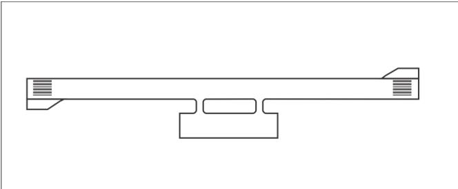

图3-1典型的掉头坪布置图

3.3.2建议：当跑道末端未设置滑行道或掉头滑行道以及基准代字为A、B或C时，应设置跑道掉头坪以方便飞机进行180°转弯。

注1：沿跑道设置多个这样的区域也是有益的，可以缩短不需要跑道全长的飞机的滑行时间和距离。

注2：有关跑道掉头坪设计的指导材料，见《机场设计手册》（Doc9157号文件）第1部分。有关用作备用设施的掉头滑行道的指导材料，见《机场设计手册》（Doc9157号文件）第2部分。

3.3.3建议：跑道掉头坪可以设在跑道的左侧或右侧，并且与跑道两端的和必要时某些中间位置的跑道铺筑面毗邻。

注：由于左座席通常是机长的座位，将跑道掉头坪设在跑道的左侧便于启动转弯。

3.3.4建议：跑道掉头坪与跑道的交接角不应超过30°。

3.3.5建议：在跑道掉头坪设计中使用的鼻轮转向角不应超过45°。

3.3.6跑道掉头坪的设计必须使得当预计使用该掉头坪的飞机的驾驶舱保持在跑道掉头坪标志上时，飞机起落架的任一机轮至跑道掉头坪边缘的净距不得小于下表所列的距离：

<html><body><table border="1"><tr><td colspan="5">外侧主起落架轮距</td></tr><tr><td></td><td>小于4.5m</td><td>4.5m至6m</td><td>6m至9m</td><td>9m至15m</td></tr><tr><td></td><td></td><td>但不含6m</td><td>但不含9m</td><td>但不含15m</td></tr><tr><td>净距</td><td>1.50 m</td><td>2.25 m</td><td>3m或4mb</td><td>4m</td></tr></table></body></html>

a 如果预计使用该跑道掉头坪的飞机的纵向轮距小于18m。

b 如果预计使用该跑道掉头坪的飞机的纵向轮距大于或等于18m。

注：纵向轮距是指前起落架至主起落架的几何中心的距离。

## 跑道掉头坪的坡度

3.3.7建议：跑道掉头坪的纵向和横向坡度应足以防止跑道掉头坪表面积水并且便于地表水的迅速排放。坡度应与相邻跑道铺筑面的坡度相同。

## 跑道掉头坪的强度

3.3.8建议：跑道掉头坪的强度应至少与所服务的相邻跑道的强度相同，并应适当考虑跑道掉头坪将承受飞机的缓行和急转弯所造成的铺筑面上的较高的应力。

注：如跑道掉头坪具有柔性铺筑面，则其表面将需要能够承受主起落架轮胎转弯过程中施加的水平剪力。

## 跑道掉头坪的表面

3.3.9跑道掉头坪的表面不得有可能导致使用该跑道掉头坪的飞机受到损坏的表面不平整。

3.3.10建议：跑道掉头坪的表面应建造得或重铺得能够提供至少与相邻跑道相同的表面摩阻特性。

## 跑道掉头坪的道肩

3.3.11建议：跑道掉头坪应设置有必要宽度的道肩，以防止其表面被要求最严格的预计使用该跑道掉头坪的飞机的喷气气流所侵蚀，并防止任何可能的外来物损伤飞机发动机。

注：作为最低限度，道肩的宽度需要能够容纳要求最严格的飞机的最外边的发动机，这样就有可能比相关跑道的道肩还要宽。

3.3.12建议：跑道掉头坪道肩的强度应能经受使用该跑道掉头坪的飞机的偶然通过而不会导致可能在该道肩上运行的飞机或辅助地面车辆的结构损坏。

### 3.4 升降带

## 概述

3.4.1跑道及任何与之相联接的停止道必须包含在升降带内。

## 升降带的长度

3.4.2升降带必须在跑道入口前，自跑道或停止道端向外延伸至少下述距离：

—基准代码为2、3或4的一60m；

一基准代码为1的仪表跑道一60m；和

一基准代码为1的非仪表跑道一30m。

## 升降带的宽度

3.4.3含有精密进近跑道的升降带，只要实际可行，必须在升降带的全长，从跑道中线及其延长线每侧横向延伸至少下述距离：

一基准代码为3或4的一140m；和

一基准代码为1或2的一70m。

3.4.4建议：含有非精密进近跑道的升降带，应在升降带的全长，从跑道中线及其延长线每侧横向延伸至少下述距离：

一基准代码为3或4的—140m；和

一基准代码为1或2的—70m。

3.4.5建议：含有非仪表跑道的升降带，应在升降带的全长，从跑道中线及其延长线每侧横向延伸至少下述距离：

一基准代码为3或4的—75m;

一基准代码为2的—40m；和

一基准代码为1的—30m。

## 升降带上的物体

注：关于在升降带上的设备和装置的定位的资料，见9.9。

3.4.6建议：位于升降带上可能对飞机构成危险的物体，应被认为是障碍物，并应尽实际可能将其移除。

注1：在升降带上必须考虑排水沟的位置和设计，以防止损坏偶尔滑出跑道的飞机。可能需要适当设计带盖板的排水沟。更多指导，见《机场设计手册》（Doc9157号文件）第1部分。

注2：在设置了露天或者带盖板的暴雨输水系统的情况下，便必须考虑确保它们的结构没有延伸至周围地面以上的地方，这样就不会被认为是障碍物。另见3.4.16的注1。

注3：需要特别注意露天暴雨输水系统的设计和维护，以防招引野生动物，特别是鸟类。如果有必要，可以用网将其盖住。关于野生动物管理的程序在《空中航行服务程序一机场》（Doc9981号文件）中加以规定。更多的指导载于《机场服务手册》（Doc9137号文件）第3部分。

3.4.7除了为导航所需并满足第5章中有关易折要求的必须位于升降带上的目视助航设施或者为航空器安全所需并满足第5章中有关易折要求的必须位于升降带上的物体之外，在精密进近跑道由内过渡面内缘划定的升降带任何部分不允许有固定物体。当跑道用于飞机起飞或着陆时，不允许在升降带的上述范围有移动的物体。

注：内过渡面的特性请参见第4章第4.1节。

## 升降带的平整

3.4.8建议：仪表跑道的升降带，自跑道中线及其延长线起每侧横向至少在下列距离的范围内应提供经过平整的区域，以供准备使用该跑道的飞机万一滑出跑道的情况下使用：

一基准代码为3或4的一75m；和

一基准代码为1或2的—40m。

注：对基准代码为3或4的精密进近跑道的升降带进行较大范围平整的指导材料，见附篇A第8节。

3.4.9建议：非仪表跑道的升降带，自跑道中线及其延长线起每侧横向至少在下列距离的范围内应提供经过平整的区域，以供准备使用该跑道的飞机在滑出跑道的情况下使用：

一基准代码为3或4的—75m;

一基准代码为2的—40m；和

一基准代码为1的—30m。

3.4.10与跑道、道肩或停止道相接部分的升降带的表面必须与跑道、道肩或停止道的表面齐平。

3.4.11建议：在跑道起始点前至少30m部分的升降带应整备得能防吹袭侵蚀，以免着陆的飞机有碰上跑道端部裸边的危险。

注1：为减少喷流和螺旋桨尾流的侵蚀效应而设置的这块区域可称为防吹坪。

注2：有关针对飞机发动机喷气采取防护措施的指导，见《机场设计手册》（Doc9157号文件）第2部分。

3.4.12建议：如果3.4.11中的区域有铺筑面，它们应能承受达到跑道道面设计临界值的飞机的偶尔通行。

升降带的坡度

#### 3.4.13 纵坡

建议：升降带内加以平整的那部分的纵坡应不大于：

一基准代码为4的—1.5%;

一基准代码为3的—1.75%；和

一基准代码为1或2的—2%。

#### 3.4.14 纵向变坡

建议：升降带内加以平整的那部分的变坡应尽实际可行地平缓，并避免急剧的变坡或突然的反坡。

#### 3.4.15 横坡

建议：升降带内加以平整部分的横坡应足以防止表面积水，但应不大于：

一基准代码为3或4的—2.5%；

一基准代码为1或2的一3%。

除了为利于排水，从跑道、道肩或停止道的边缘向外的头3m内的横坡，从跑道向外方向应为降坡，并可大到5%。

3.4.16建议：在升降带内加以平整部分以外的任何部分的横坡，从跑道向外的坡度，其升坡应不大于5%。

注1：在认为对适当排水是必要的情况下，可允许在升降带非平整部分使用露天暴雨输水系统，而且应将其置于离跑道尽可能远的地方。

注2：机场援救与消防（RFF）程序应考虑到位于升降带非平整部分的露天暴雨输水系统的位置。

## 升降带的强度

3.4.17建议：仪表跑道的升降带部分，距跑道中线或其延长线至少在下列距离范围内，应整备或修建得在准备使用该跑道的飞机滑出跑道的情况下，使由于升降带内承载能力的差异对此类飞机造成的危害减到最小：

—基准代码为3或4的一75m；和

一基准代码为1或2的—40m。

注：关于升降带整备的指导材料，见《机场设计手册》（Doc9157号文件）第1部分。

3.4.18建议：非仪表跑道的升降带部分，距跑道中线或其延长线至少在下列距离范围内，应整备或修建得在准备使用该跑道的飞机滑出跑道的情况下，使由于升降带内承载能力的差异对此类飞机造成的危害减到最小：

基准代码为3或4的一75m;

一基准代码为2的—40m；和

基准代码为1的—30m。

### 3.5 跑道端安全区

## 概述

3.5.1在下列条件下，必须在升降带两端设置跑道端安全区：

一基准代码为3或4；

一基准代码为1或2并为仪表跑道时。

注：关于跑道端安全区的指导材料，见附篇A第9节。

3.5.2建议：在基准代码为1或2并为非仪表跑道时，应在升降带两端设置跑道端安全区。

## 跑道端安全区的尺寸

3.5.3在下列条件下，跑道端安全区必须自升降带端延伸到至少90m的距离：

一基准代码为3或4；和

一基准代码为1或2并为仪表跑道时。

如果安装了拦阻系统，则可根据系统的设计规范缩短上述长度，但须得到国家的认可。

注：关于拦阻系统的指导材料，见附篇A第9节。

3.5.4建议：跑道端安全区应自升降带端尽实际可能延伸到至少如下距离：

一基准代码为3或4时一240m；或者在安装了拦阻系统时一某一缩短的长度；

一基准代码为1或2并为仪表跑道时—120m；或者在安装了拦阻系统时—某一缩短的长度；和

一基准代码为1或2并为非仪表跑道时—30m。

3.5.5跑道端安全区的宽度必须至少为与之相联接的跑道宽度的两倍。

3.5.6建议：跑道端安全区的宽度应尽实际可能等于与之相联接的升降带平整部分的宽度。

## 跑道端安全区上的物体

注：有关跑道端安全区上的设备和装置的定位的资料，见9.9。

3.5.7建议：位于跑道端安全区上可能对飞机构成危险的物体应被认为是障碍物，并应尽实际可行地移除。

## 跑道端安全区的清理和平整

3.5.8建议：跑道端安全区应为准备使用该跑道的飞机在过早接地或冲出跑道的情况下提供经过清理和平整的地区。

注：跑道端安全区的地表面不需要整备得与升降带的质量一样。但见3.5.12。

## 跑道端安全区的坡度

#### 3.5.9 概述

建议：跑道端安全区的坡度应使该地区的任何部分都不突出进近面或起飞爬升面。

#### 3.5.10 纵坡

建议：跑道端安全区的纵坡的降坡应不大于5%。纵向变坡应尽实际可行地平缓，并避免急剧的变坡或突然的反坡。

#### 3.5.11 横坡

建议：跑道端安全区的横坡，不论升坡或降坡均应不大于5%。不同坡度之间的过渡应尽实际可行地平缓。

## 跑道端安全区的强度

3.5.12建议：跑道端安全区应整备或修建得使其能减小飞机由于过早接地或冲出跑道所致损害的危险，增加飞机的减速率，并便于救援与消防车辆按9.2.33至9.2.35的要求活动。

注：关于跑道端安全区强度的指导材料，见《机场设计手册》（Doc9157号文件）第1部分。

### 3.6 净空道

注：将净空道的详细规范列入本节并不意味着一定要设置净空道。附篇A第2节提供有关于使用净空道的资料。

## 净空道的位置

3.6.1建议：净空道的起始点应在可用起飞滑跑距离的末端。

## 净空道的长度

3.6.2建议：净空道的长度应不超过可用起飞滑跑距离的一半。

## 净空道的宽度

3.6.3建议：净空道应自跑道中线延长线向两侧横向延伸至少：

对于仪表跑道，75米；和

b）对于非仪表跑道，至跑道升降带宽度的1/2处。

## 净空道的坡度

3.6.4建议：净空道的地面不应突出于1.25%升坡的平面，该平面的底边是一条水平线，它：

a）与含有跑道中线的垂直面相垂直；和

b）通过位于可用起飞滑跑距离末端处跑道中线上的一点。

注：在某种情况下，由于跑道、道肩或升降带的纵、横坡度，上面规定的净空道平面的底边可能处于跑道、道肩或升降带的相应高程之下。这种情况并不意味着要把这些表面平整得使其符合净空道平面的底边，亦不意味着要把升降带端部以外超出净空道平面但低于升降带高程的地形或物体移除，除非认为它们可能危及飞机。

3.6.5建议：当净空道的地面坡度相对较小，或当平均坡度为升坡时，应避免急剧的向上的变坡。在这种情况下，在中线延长线两侧各22.5m或跑道宽度一半（取其大者）范围内的那部分净空道内，其坡度、变坡和自跑道至净空道的过渡，一般应与同它相联接的跑道的坡度、变坡相一致。

## 净空道上的物体

注：有关净空道上的设备和装置的定位的资料，见9.9。

3.6.6建议：位于净空道上可能对空中的飞机造成危险的物体应被认为是障碍物，并应将其移除。

### 3.7 停止道

注：将停止道的详细规范列入本节并不意味着一定要设置停止道。附篇A第2节提供有关于使用停止道的资料。

## 停止道的宽度

3.7.1停止道的宽度必须与同它相联接的跑道的宽度相同。

## 停止道的坡度

3.7.2建议：停止道的坡度和变坡，以及自跑道至停止道的过渡应遵循3.1.13至3.1.19中规定的关于与停止道相联接的跑道的规范，除了：

a）在3.1.14中对跑道两端各四分之一长度部分0.8%的坡度限制无需应用于停止道；和

b）基准代码为3或4的跑道，在停止道与跑道相联接处和沿停止道上的最大变坡率可为每30m0.3%（最小曲率半径为10000m）。

## 停止道的强度

3.7.3建议：停止道应整备或修建得使在中断起飞的情况下能承受准备使用该停止道的飞机，不致引起飞机的结构损坏。

注：附篇A第2节载有关于停止道承载能力的指导材料。

## 停止道的表面

3.7.4有铺筑面的停止道的表面必须修建得或重铺得使表面摩阻特性等于或超出与其相联接跑道的表面摩阻特性。

### 3.8 无线电高度表操作场地

## 概述

3.8.1建议：应在精密进近跑道入口前地区设立一个无线电高度表操作场地。

## 场地的长度

3.8.2建议：无线电高度表操作场地应在跑道入口前至少延伸300m。

## 场地的宽度

3.8.3建议：无线电高度表操作场地应在跑道中线延长线的每侧横向延伸宽60m。除非在特殊的环境下，经航行研究表明不会影响飞机运行安全时，该宽度可以减小到不小于30m。

## 纵向变坡

3.8.4建议：在无线电高度表操作场地上，应避免变坡或将变坡控制在最小。当变坡不能避免时，变坡应尽实际可行地平缓，并避免急剧的变坡或突然的反坡。两个相邻坡度间的变率每30m应不超过2%。

注：关于无线电高度表操作场地的指导材料，见附篇A4.3节和《全天候运行手册》（Doc9365号文件）的5.2节。关于无线电高度表使用的指导材料，见《空中航行服务程序一航空器的运行》，第Ⅱ卷第Ⅱ部分，第1节。

### 3.9 滑行道

注1：除另有注明外，本节所列要求适用干所有类型的滑行道。

注2：请参阅第5.4.3节了解滑行道标准术语体系，该体系可以用来改进情形感知并做为有效的跑道侵入预防措施的一部分。

注3：滑行道设计的具体指导见附篇A第21节，在建造新的滑行道或者改进已知存在安全风险的现有滑行道时，它可能有助于防止跑道侵入。

## 概述

3.9.1建议：滑行道应能使航空器安全而迅速地进行地面活动。

注：有关滑行道布局和标准术语的指导材料，见《机场设计手册》（Doc9157号文件）第2部分。

3.9.2建议：为了加快飞机进出跑道的运行，跑道上应设置足够的进口和出口滑行道，当交通量高时应考虑设置快速出口滑行道。

3.9.3滑行道的设计必须使当准备使用该滑行道的飞机的驾驶舱保持在滑行道中线标志上时，飞机的外侧主轮与滑行道边缘之间的净距不得小于下表所列的净距：

<html><body><table border="1"><tr><td colspan="4">外侧主起落架轮距</td></tr><tr><td>小于4.5m</td><td>4.5m至6m</td><td>6m至9m</td><td>9m至15m</td></tr><tr><td></td><td>但不含6m</td><td>但不含9m</td><td>但不含15m</td></tr><tr><td>净距 1.50 m</td><td>2.25 m</td><td>3mab或4mc</td><td>4m</td></tr></table></body></html>

a直道段上。

准备使用该滑行道的飞机的纵向轮距小于18m时，弯道段上的净距。

°准备使用该滑行道的飞机的纵向轮距大于或等于18m时，弯道段上的净距。

注：纵向轮距是指前起落架至主起落架的几何中心的距离。

## 滑行道的宽度

3.9.4建议：滑行道直线部分的宽度应不小于下表所列的宽度：

<html><body><table border="1"><tr><td colspan="5">9m至15m 但不含15m</td></tr><tr><td>外侧主起落架轮距</td><td></td><td>小于4.5m</td><td>4.5m至6m 但不含6m</td><td>6m至9m 但不含9m</td></tr><tr><td>滑行道宽度</td><td>7.5 m</td><td>10.5 m</td><td>15m</td><td>23m</td></tr></table></body></html>

注：关于滑行道宽度的指导材料，见《机场设计手册》（Doc9157号文件）第2部分。

## 滑行道的弯道

3.9.5建议：滑行道的方向应尽可能地少变和小变。曲线半径应与准备使用该滑行道的飞机的操作能力和正常的滑行速度相适应。弯道的设计应使当飞机的驾驶舱保持在滑行道中线标志上时，飞机的外侧主轮与滑行道边缘之间的净距不小于3.9.3中规定的净距。

注1：图3-2表示了一个加宽滑行道以达到规定的轮子净距的例子。关于适用尺寸的数值的指导材料，见《机场设计手册》（Doc9157号文件）第2部分。

注2：滑行道中线标志和中线灯的位置的规定，见5.2.8.6和5.3.17.12。

注3：使用复合曲线可能减小或不需加宽滑行道。

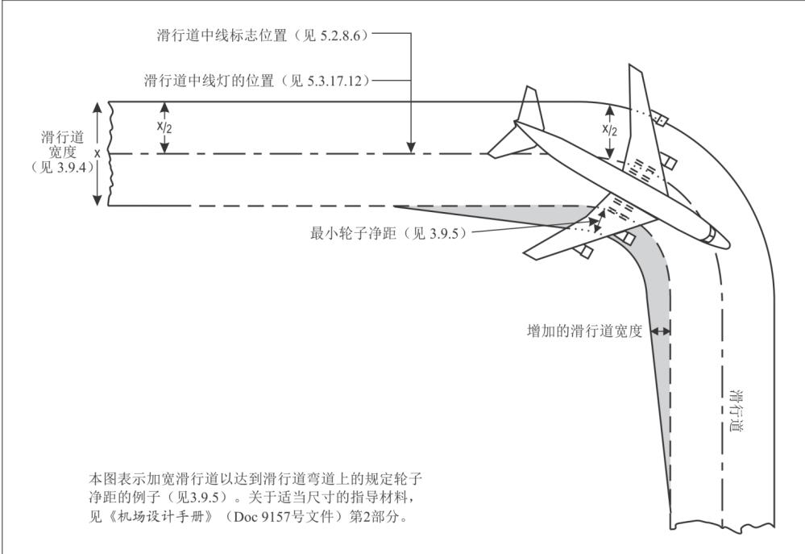

图3-2滑行道弯道

## 连接处和交叉处

3.9.6建议：为了便于飞机的活动，在滑行道与跑道、机坪和其他滑行道的连接处和交叉处应提供增补面。增补面的设计应保证当飞机在通过连接处或交叉处的运转中，保持3.9.3中规定的最小轮子净距。

注：设计增补面时必须考虑飞机的基准长度。有关增补面的设计和飞机基准长度术语的定义的指导材料，见《机场设计手册》（Doc9157号文件）第2部分。

## 滑行道的最小间隔距离

3.9.7建议：滑行道中线与跑道中线、平行滑行道中线或一个物体间的间隔距离应不小于表3-1中所规定的各相应尺寸，除非经航空研究表明采用较小的间隔距离不致对飞机的安全产生不利的影响或显著地影响飞机运行的正常性的情况下，可以允许在现有机场上以较小的间隔距离运行。

注1：有关航空研究中可能要考虑的诸因素的指导材料，见《机场设计手册》（Doc9157号文件）第2部分。

注2：由于滑行或停止的航空器对仪表着陆系统和微波着陆系统信号的干扰，仪表着陆系统和微波着陆系统的装置也可能影响滑行道的位置。有关围绕仪表着陆系统和微波着陆系统装置的临界和敏感地区的资料，分别载于附件10—《航空电信》第I卷一无线电导航设备的附篇C和G中。

注3：表3-1第10栏的间隔距离不一定能提供从一条滑行道正常地转到另一条平行滑行道上去的能力。关于这种情况的指导材料，见《机场设计手册》（Doc9157号文件）第2部分。

注4：当喷气排出的尾流速度可能对地面服务造成危害时，表3-1第13栏所示的航空器机位滑行通道的中线与物体之间的间隔距离可能需要加大。

## 滑行道的坡度

#### 3.9.8 纵坡

建议：滑行道的纵坡应不大于：

一基准代字为C、D、E或F的—1.5%；和

一基准代字为A或B的—3%。

#### 3.9.9 纵向变坡

建议：当滑行道变坡不能避免时，从一个坡度过渡到另一个坡度应采用变率不大于下列的曲面来完成：

一基准代字为C、D、E或F的—每30m，1%（最小曲率半径为3000m)；

一基准代字为A或B的—每25m，1%（最小曲率半径为2500m)。

表3-1滑行道最小间隔距离

<html><body><table border="1"><tr><td rowspan="2">基准</td><td colspan="7">滑行道中线与跑道中线之间的距离 (m)</td><td rowspan="2"></td><td rowspan="2">滑行道中 线到滑行 道中线</td><td rowspan="2">除了机位滑行通 道外的滑行道中 线到物体</td><td rowspan="2">机位滑行通道中 线到机位滑行通 道中线</td><td rowspan="2">机位滑行 通道中线 到物体</td></tr><tr><td colspan="5">仪表跑道基准代码</td><td colspan="3">非仪表跑道基准代码</td></tr><tr><td>代字</td><td>1</td><td>2</td><td>3</td><td>4</td><td></td><td>1</td><td>2 3</td><td>4</td><td>(m)</td><td>(m)</td><td>(m)</td><td>(m)</td></tr><tr><td>(1)</td><td>(2)</td><td>(3)</td><td>(4)</td><td>(5)</td><td>(6)</td><td>(7)</td><td>(8)</td><td>(9)</td><td>(10)</td><td>(11)</td><td>(12)</td><td>(13)</td></tr><tr><td>A</td><td>77.5</td><td>77.5</td><td>−</td><td>−</td><td>37.5</td><td>47.5</td><td>−</td><td>-</td><td>23</td><td>15.5</td><td>19.5</td><td>12</td></tr><tr><td>B</td><td>82</td><td>82</td><td>152</td><td>−</td><td>42</td><td>52</td><td>87</td><td>−</td><td>32</td><td>20</td><td>28.5</td><td>16.5</td></tr><tr><td>C</td><td>88</td><td>88</td><td>158</td><td>158</td><td>48</td><td>58</td><td>93</td><td>93</td><td>44</td><td>26</td><td>40.5</td><td>22.5</td></tr><tr><td>D</td><td>-</td><td>-</td><td>166</td><td>166</td><td>−</td><td>一</td><td>101</td><td>101</td><td>63</td><td>37</td><td>59.5</td><td>33.5</td></tr><tr><td>E</td><td>−</td><td>−</td><td>172.5</td><td>172.5</td><td>-</td><td>−</td><td>107.5</td><td>107.5</td><td>76</td><td>43.5</td><td>72.5</td><td>40</td></tr><tr><td>F</td><td>一</td><td>一</td><td>180</td><td>180</td><td>一</td><td>一</td><td>115</td><td>115</td><td>91</td><td>51</td><td>87.5</td><td>47.5</td></tr></table></body></html>

注1：表中第(2)~(9)栏中的间隔距离代表跑道和滑行道的一般组合。制定这些距离的依据，见《机场设计手册》（Doc9157号文件）第2部分。

注2：表中第(2)~(9）栏中的距离，不能保证在一架等待飞机的后面有足够的净距以允许在平行滑行道上的另一架飞机通行。见《机场设计手册》（Doc9157号文件）第2部分。

#### 3.9.10 视距

建议：当滑行道变坡不能避免时，其变化应能满足：

一基准代字为C、D、E或F的，从高于滑行道任何一点的3m处能看到离该点最少300m距离内的全部滑行道的表面；

基准代字为B的，从高于滑行道任何一点的2m处能看到离该点最少200m距离内的全部滑行道的表面；和

基准代字为A的，从高于滑行道任何一点的1.5m处能看到离该点最少150m距离内的全部滑行道的表面。

#### 3.9.11 横坡

建议：滑行道的横坡应足以防止滑行道表面积水，但应不大于：

一基准代字为C、D、E或F的一1.5%；和

一基准代字为A或B的一2%。

注：有关机位滑行通道的横坡，见3.13.4。

## 滑行道的强度

3.9.12建议：滑行道的强度至少应等于它所服务的跑道的强度，并适当考虑滑行道同其所服务的跑道相比，要承受较大的交通密度和因飞机滑行缓慢及停留而产生较高的应力。

注：有关滑行道强度与跑道强度的关系的指导材料，见《机场设计手册》（Doc9157号文件）第3部分。

## 滑行道的表面

3.9.13建议：滑行道的表面不应有引起飞机结构损害的不平整现象。

3.9.14建议：有铺筑面的滑行道的表面应修建得或重铺得能提供良好的表面摩阻特性。

注：良好的表面摩阻特性指那些滑行道上所需具备的可确保飞机安全运行的表面特征。

## 快速出口滑行道

注：下列规范详述了对快速出口滑行道所特有的要求，见图3-3。对滑行道的一般要求也适用于这类滑行道。有关快速出口滑行道的设置、位置和设计的指导材料，见《机场设计手册》（Doc9157号文件）第2部分。

3.9.15建议：快速出口滑行道应设计成其转出弯道半径至少为：

一基准代码为3或4的—550m；和

一基准代码为1或2的—275m。

以使出口速度能在湿的情况下达到：

一基准代码为3或4的—93km/h；和

一基准代码为1或2的—65km/h。

注：跑道快速出口滑行道的位置除了以不同速度标准为根据外，还以《机场设计手册》（Doc9157号文件）第2部分所述的几种标准为根据。

3.9.16建议：快速出口滑行道在弯道内侧的增补面的半径应足以使提供一个加宽的滑行道入口，以便于及早认出入口并转入到滑行道去。

3.9.17建议：快速出口滑行道应在转出弯道后有一段直线，其长度应足以使转出的航空器在任何交叉的滑行道之前能完全停住。

3.9.18建议：快速出口滑行道与跑道的交角不应大于45°，也不应小于25°，最好应为30°。

图3-3快速出口滑行道

## 滑行道桥

3.9.19滑行道桥能支承飞机部分的宽度，按垂直于滑行道中线量计，必须不小于该滑行带的平整部分的宽度，除非提供了证明有效的不致危害对准备使用该滑行道的飞机的横向约束的方法。

3.9.20建议：应提供救援与消防车辆的通道，以便允许在规定的响应时间内从两个方向到达滑行道桥上的最大飞机。

注：如果飞机的发动机悬于桥结构之外，可能需要考虑桥下面邻近地区受飞机发动机喷气吹袭的防护措施。

3.9.21建议：为了便于飞机在接近滑行道桥时对准滑行道，滑行道桥应修建在滑行道的直线段上并在桥的两端各有一段直线。

### 3.10 滑行道道肩

注：关于滑行道道肩的特性和道肩处理的指导材料，见《机场设计手册》（Doc9157号文件）第2部分。

3.10.1建议：基准代字为C、D、E或F的滑行道的直线部分应设置道肩，道肩在滑行道两侧对称延伸，使直线部分的滑行道加上两侧道肩的总宽度不小于：

一基准代字为F的—44m;

基准代字为E的—38m;

一基准代字为D的—34m；和

一基准代字为C的—25m。

在滑行道弯道和连接处或交叉处道面加宽了的地方，道肩宽度应不小于其邻接的滑行道直线部分的道肩的宽度。

3.10.2建议：当滑行道准备为涡轮发动机飞机使用时，滑行道道肩的表面应整备得能抵抗气流侵蚀和防止表面物质被飞机发动机吸入。

### 3.11 滑行带

注：有关滑行带的特性的指导材料，见《机场设计手册》（Doc9157号文件）第2部分。

## 概述

3.11.1除了机位的滑行通道外，滑行道必须包含在滑行带内。

## 滑行带的宽度

3.11.2建议：滑行带应在滑行道的全长上从滑行道的中线对称地向两边伸展，至少等于如表3-1第11栏中所规定的距中线的距离。

## 滑行带上的物体

注：有关在滑行带上的设备及装置的定位的资料，见9.9。

3.11.3建议：滑行带应提供一个没有可能危及滑行中飞机的物体的地区。

注1：在滑行带上必须考虑排水沟的位置和设计，以防止损坏偶尔滑出滑行道的飞机。可能需要适当设计带盖板的排水沟。更多指导，见《机场设计手册》（Doc9157号文件）第2部分。

注2：在设置了露天或者带盖板的暴雨输水系统的情况下，便必须考虑确保它们的结构没有延伸至周围地面以上的地方，这样就不会被认为是障碍物。另见3.11.6的注1。

注3：需要特别注意露天暴雨输水系统的设计和维护，以防止招引野生动物，特别是鸟类。如果有必要，可以用网将其盖住。关于《野生动物危害管理》的指导载于《机场服务手册》（Doc9137号文件）第3部分。

## 滑行带的平整

3.11.4建议：滑行带的中心部分应提供一个经过平整的地区，到离滑行道中线的距离应不小于下表中的数值：

外侧主起落架轮距小于4.5m的，10.25m 

外侧主起落架轮距为4.5至6m但不含6m的，11m 

—外侧主起落架轮距为6m至9m但不含9m的，12.50m 

基准代字为D的外侧主起落架轮距为9m至15m但不含15m的，18.5m 

一基准代字为E的外侧主起落架轮距为9m至15m但不含15m的，19m 

基准代字为F的外侧主起落架轮距为9m至15m但不含15m的，22m 

注：关于滑行道平整部分的宽度的指导材料，见《机场设计手册》（Doc9157号文件）第2部分。

## 滑行带的坡度

3.11.5建议：滑行带的表面应与滑行道或道肩（如设有道肩）的边缘齐平，经过平整的部分不应有大于下述数值的横向升坡：

一基准代字为C、D、E或F的滑行带一2.5%；和

一基准代字为A或B的滑行带—3%。

上述升坡是从毗连的滑行道表面的横坡量测，而不是从水平面算起。横向降坡则从水平面量起，应不大于5%。

3.11.6建议：当从离开滑行道方向量起时，滑行带在平整部分之外的任何部分的横坡向外升坡或降坡应不大于5%

注1：在认为对适当排水是必要的情况下，可允许在升降带非平整部分使用露天暴雨输水系统，而且应将其置于离滑行道尽可能远的地方。

注2：机场援救与消防程序应考虑到位于滑行带非平整部分的露天暴雨输水系统的位置。

### 3.12 等待坪、跑道等待位置、中间等待位置和道路等待位置

## 概述

3.12.1建议：当交通密度为中、高水平时，应提供等待坪。

3.12.2必须在下列位置设立一个或几个跑道等待位置：

在滑行道上滑行道与跑道相交处：和

b）在一条跑道与另一条跑道相交处，当前一跑道是一条标准滑行路线的一部分时。

3.12.3如果滑行道的位置或方向使得滑行的航空器或车辆会侵犯障碍物限制面或对无线电助航设施的运转有所干扰时，在该滑行道上必须设立跑道等待位置。

3.12.4建议：当适宜确定一个特定的等待范围时，在一条滑行道上除跑道等待位置以外的任何一点应设立中间等待位置。

3.12.5在道路与跑道相交处必须设立道路等待位置。

## 位置

3.12.6等待坪、设在滑行道/跑道相交处的跑道等待位置或道路等待位置与跑道中线之间的距离必须与表3-2相一致，在精密进近跑道情况下，必须使等待的航空器或车辆不致干扰无线电助航设施的运转或是穿透内过渡面。

注：关于跑道等待位置的位置设定指导见于《机场设计手册》（Doc9157号文件）第2部分。

3.12.7建议：在海拔大于700m(2300ft)的地方，表3-2中所规定的代码为4的精密进近跑道的90m距离，还应按下述加大：

a）海拔直至2000m(6 600 ft)；超过700m(2300ft)的每100m(330ft)增加1m;

b）海拔超过2000m(6600ft)直至4000m(13 320ft);13m再加上超过2000m(6600ft)的每100m (330ft)增加1.5m；和

c）海拔超过4000m(13 320ft)直至5000m(16650ft);43m再加上超过4000m(13 320ft)的每100m(330ft)增加2m。

3.12.8建议：如果基准代码为4的精密进近跑道的等待坪、跑道等待位置或道路等待位置的海拔高于跑道入口的海拔，表3-2中规定的距离，还应按等待坪或滑行等待位置每高出跑道入口1m，该距离再增加5m。

3.12.9按照3.12.3设立的跑道等待位置必须使等待的航空器或车辆不侵犯无障碍物区、进近面、起飞爬升面或仪表着陆系统、微波着陆系统的临界/敏感区或干扰无线电助航设施的运行。

表3-2．跑道中线到等待坪、跑道等待位置或道路等待位置的最小距离

<html><body><table border="1"><tr><td rowspan="2"></td><td colspan="4">基准代码</td></tr><tr><td>1</td><td>2</td><td>3</td><td>4</td></tr><tr><td>跑道的类型 非仪表</td><td>30m</td><td>40m</td><td>75m</td><td>75m</td></tr><tr><td>非精密进近</td><td>40m</td><td>40 m</td><td>75 m</td><td>75m</td></tr><tr><td>Ⅰ类精密进近</td><td>60 m{b$</td><td>60 m{b$</td><td>90 ma,b</td><td>90 ma,b,c</td></tr><tr><td>I类及Ⅲ类精密进近</td><td></td><td></td><td>90 ma,b</td><td>90 ma,b,c</td></tr><tr><td>起飞跑道</td><td>30m</td><td>40m</td><td>75m</td><td>75m</td></tr></table></body></html>

a）如果等待坪、跑道等待位置或道路等待位置的高程低于跑道入口的高程，则每低1m，此最小距离可减少5m，但以不突出内过渡面为准。

b）为了避免干扰无线电助航设施，特别是下滑航道和航向设施，这一距离可能需要增加。关于仪表着陆系统和微波着陆系统的临界区和敏感区的资料，分别载于附件10，第I卷、第1部分的附录C和G（另见3.12.6）。

注1：对基准代码为3或4所定的90m距离的根据是：航空器尾翼高20m，机头至尾翼的最高部分距离52.7m，机头高10m，等待在与跑道中线成45°角或更大的位置，未侵犯无障碍物区，且未考虑超障高度/超障高（OCA/H）的计算。

注2：对基准代码为2所定的60m距离的根据是：航空器尾翼高8m，机头到尾翼的最高部位距离24.6m，机头高5.2m，等待在与跑道中线成45°角或更大的位置，未侵犯无障碍物区。

注3：对内进近面内边宽大于120m的基准代码4，大于90m的距离对确保等待航空器未侵犯无障碍区可能是必要的。所定的100m距离的根据是：航空器尾翼高24m，机头至尾翼的最高部分距离62.2m，机头高10m，等待在与跑道中线成45°角或更大的位置，未侵犯无障碍物区。

### 3.13 机坪

## 概述

3.13.1建议：机坪应位于上下旅客、装卸货物或邮件以及航空器保障所需要而不影响机场交通的地方。

## 机坪的大小

3.13.2建议：机坪的全部面积应足以迅速处理在预期最大密度下的机场交通。

## 机坪的强度

3.13.3建议：机坪的每一部分应能承受准备使用的航空器的通行，并适当考虑机坪的有些部分要承受较大的通行密度的事实和因航空器缓行或停留而产生的较跑道更高的应力。

## 机坪的坡度

3.13.4建议：机坪的坡度，包括航空器机位滑行通道的坡度应足够防止机坪表面积水，但应在排水要求许可下使其保持尽量平整。

3.13.5建议：在机位上的最大坡度应不大于1%。

## 机位上的净距

3.13.6建议：机位应对进入或离开它的航空器与任何邻近的建筑物、另一机位上的航空器和其他物体之间提供下列最小净距：

<html><body><table border="1"><tr><td>基准代字</td><td>净距</td></tr><tr><td>A</td><td>3m</td></tr><tr><td>B</td><td>3m</td></tr><tr><td>C</td><td>4.5 m</td></tr><tr><td>D</td><td>7.5m</td></tr><tr><td>E</td><td>7.5m</td></tr><tr><td>F</td><td>7.5m</td></tr></table></body></html>

当基准代字为D、E或F时，根据特殊情况，在机头向内停放时，这些净距可以在以下位置减小：

a)旅客航站，包括任何固定的旅客登机桥与机头之间；和

b）提供有由目视停靠引导系统的方位引导的机位上的任何部分。

注：在机坪上，还必须要考虑为地面设备提供工作通道及其操作和存贮区。（关于存放地面设备的指导材料，见《机场设计手册》（Doc9157号文件）第2部分）。

### 3.14 隔离航空器的停放位置

3.14.1对已知的或被认为是非法干扰对象的航空器，或由于其他原因需要与正常的机场活动相隔离的航空器，必须指定一个隔离的停放位置，或者将适宜于停放该航空器的地段通知机场的管制塔台。

3.14.2建议：隔离航空器停放位置应位于与其他停放位置、建筑物或公共地段等尽实际可行的最大距离，并在任何情况下不小于100m。应注意保证该位置不位于地下公用设施，诸如煤气管道和航空燃油管道之上。并在可能范围内也不位干地下电力或通信电缆之上。

### 3.15 除冰/防冰设施

注：研制飞机除冰/防冰设施对飞机安全和有效运行是非常重要的。进一步指导材料，见《航空器地面除冰/防冰操作手册》（Doc9640号文件）。

## 概述

3.15.1建议：在预料会出现结冰情况的机场应设置飞机除冰/防冰设施。

## 位置

3.15.2建议：除冰/防冰设施应设置在机位上或设置在沿滑行道通向供起飞用的跑道的特定远距离处，但应设置足够的排水设施用以收集和安全处理过量的除冰/防冰液，以防止污染地下水。同时应考虑交通量和离场流速率的影响。

注1：影响除冰/防冰设施位置的一个重要因素是要保证防冰处理的保持时间，即被处理的飞机至滑行终结以及获得起飞许可时防冰处理仍然有效。

注2：当在飞机沿着滑行路线到达跑道准备起飞的途中预料会出现结冰情况或飘雪时，远距除冰/防冰设施可以补偿天气条件的变化。。

3.15.3建议：远距除冰/防冰设施的位置应使其不突出第4章规定的各障碍物限制面，不干扰无线电助航设施以及从空中交通控制塔能够清楚地看见放行处理过的飞机。

3.15.4建议：远距除冰/防冰设施应设置得能加速交通流量，多半有一条旁通道构形，并不需要特意滑入或滑出除冰坪。

注：必须考虑滑行飞机的喷气气流对正在进行除冰处理的其他飞机或其后滑行飞机的影响，以防止降低处理效果。

## 除冰/防冰坪的尺寸和数量

注：飞机除冰/防冰坪包括：a）供接受处理的飞机停放的内部场地和b）供两部或更多机动除冰/防冰设备活动的外围场地。

3.15.5建议：除冰/防冰坪的大小应等于特定类型中要求最严的飞机所需的停放面积，加上飞机四周至少3.8m 宽的供除冰/防冰车活动之用的无障碍道面面积。

注：当设置有一个以上的除冰/防冰坪时，必须考虑为邻接的除冰/防冰坪设置彼此不重叠的，可为每个除冰/防冰坪专用的除冰/防冰车活动场地。还需要考虑到从该场地旁边通过的其他飞机与物体能有3.15.9和3.15.10规定的净距。

3.15.6建议：所需除冰/防冰坪的数量应根据天气条件、要进行处理的飞机的类型、使用除冰/防冰液的方法、所用配药设施的类型和容量以及出港流量来确定。

注：见《机场设计手册》（Doc9157号文件）第2部分。

## 除冰/防冰坪的坡度

3.15.7建议：除冰/防冰坪应设置适当的坡度以保证场地良好的排水并能收集从飞机上流下的多余的除冰/防冰液。最大纵坡应尽可能小，而横坡应不超过1%。

## 除冰/防冰坪的强度

3.15.8建议：除冰/防冰坪应能承受准备使用除冰/防冰坪的航空器的交通，并适当考虑除冰/防冰坪(如同机坪）与跑道相比，要承受较大的交通密度和因航空器滑行缓慢或停留而产生较高的应力。

## 除冰/防冰坪的净距

3.15.9建议：除冰/防冰坪应按3.13.6对机位规定的最小净距进行设置。如除冰/防冰坪布局包括旁通道构形，应按表3-1(12）栏中规定的最小间距设置。

3.15.10建议：除冰/防冰坪设施邻接一条常规滑行道设置时，应提供表3-1第(11）栏中规定的滑行道最小间距(见图3-4)。

## 环境考虑

注：从飞机流下的多余的除冰/防冰液，除了影响道面表面的摩阻性能外，还具有污染地下水的危险。

3.15.11建议：在进行除冰/防冰操作之处，为不致污染地下水，表面排水道应规划得能单独收集流出的除冰/防冰液，防止它与正常的表面径流相混合。

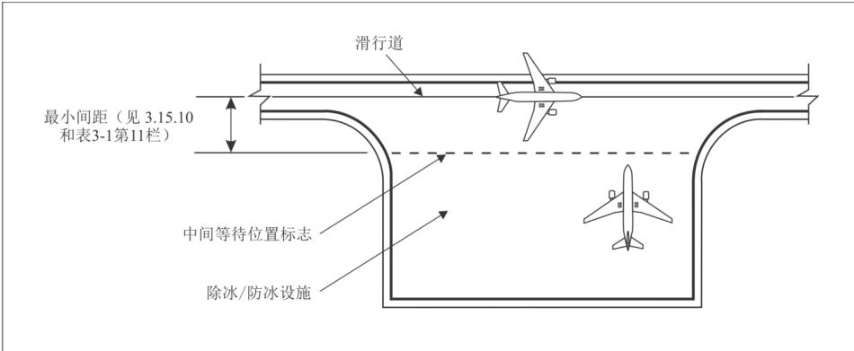

图3-4除冰/防冰设施的最小间距

## 第4章障碍物的限制和移除

注1：本章内各条规范的目的是规定在机场周围保持无障碍物的空域，使准备使用该机场的飞机能够安全运行，并防止由于机场周围障碍物增多而使机场变得无法使用。将通过规定一系列障碍物限制面，对物体可以突出空域的界限加以限定来达到此目的。

注2：突出本章所载障碍物限制面的物体，可能在某些情况下造成仪表进近程序或任何关联的目视盘旋程序加大超障高度/超障高，或对飞行程序设计产生其他运行影响。飞行程序设计的准则载于《空中航行服务程序一航空器的运行》（PANS-OPS，Doc8168号文件）。

注3：关于目视进近坡度指示系统的障碍物保障面的设立和要求的规定，见5.3.5.42至5.3.5.46。

### 4.1 障碍物限制面

注：见图4-1。

外水平面

注：有关需要设立外水平面及其特性的指导材料载于《机场服务手册》（Doc9137号文件）第6部分。

## 锥形面

4.1.1说明一锥形面：从内水平面周边起向上和向外倾斜的一个面。

4.1.2特性一锥形面的界限必须由下列各边组成：

a）一条与内水平面周边相重合的底边；和

b）一条位于高出内水平面一个规定高度的顶边。

4.1.3锥形面的坡度必须在与内水平面周边成直角的垂直平面中度量。

## 内水平面

4.1.4说明—内水平面：位于机场及其周围之上的一个水平面中的一个面。

4.1.5特性—内水平面的半径或其外限必须从为此目的而设立的一个或几个基准点量起。

注：内水平面的形状不一定是圆形的。有关确定内水平面范围的指导材料载于《机场服务手册》（Doc9137号文件）第6部分。

4.1.6内水平面的高度必须从为此目的而设立的一个高度基准量起。

注：有关确定高度基准的指导材料载于《机场服务手册》（Doc9137号文件）第6部分。

## 进近面

4.1.7说明—进近面：在跑道入口前的一个倾斜的平面或几个平面的组合。

4.1.8特性—进近面的界限必须由下列各边组成：

a）一条规定长度的内边：水平并垂直于跑道的中线延长线，位于跑道入口前的一个规定距离处；

b）两条侧边：以内边的两端为起点，自跑道的中线延长线均匀地以规定的比率向外散开；

c）一条外边：平行于内边；和

d)当采用横向偏置、偏移或曲线进近时，上述各面都必须改变，准确地说，两条侧边必须以内边两端为起点，并且必须自横向偏置、偏移或曲线进近的地面航迹的中线延长线均匀地以规定的比率向外散开。

4.1.9内边的标高必须等于跑道入口中点的标高。

4.1.10进近面的坡度必须在含有跑道中线的垂直平面内度量，同时必须连续包含任何横向偏置或曲线进近的地面航迹的中线。

注：见图4-2。

## 内进近面

4.1.11说明一内进近面：进近面中紧靠跑道入口前的一块长方形部分。

4.1.12特性一内进近面的界限必须由下列各边组成：

a）一条内边：与进近面内边的位置重合，但有其自己的规定长度；

b）两条侧边：以内边的两端为起点，平行于包含跑道中线的垂直平面向外延伸；和

c）一条外边：平行于内边。

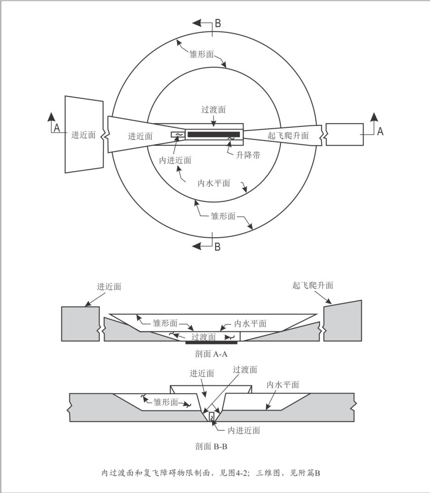

图4-1障碍物限制面

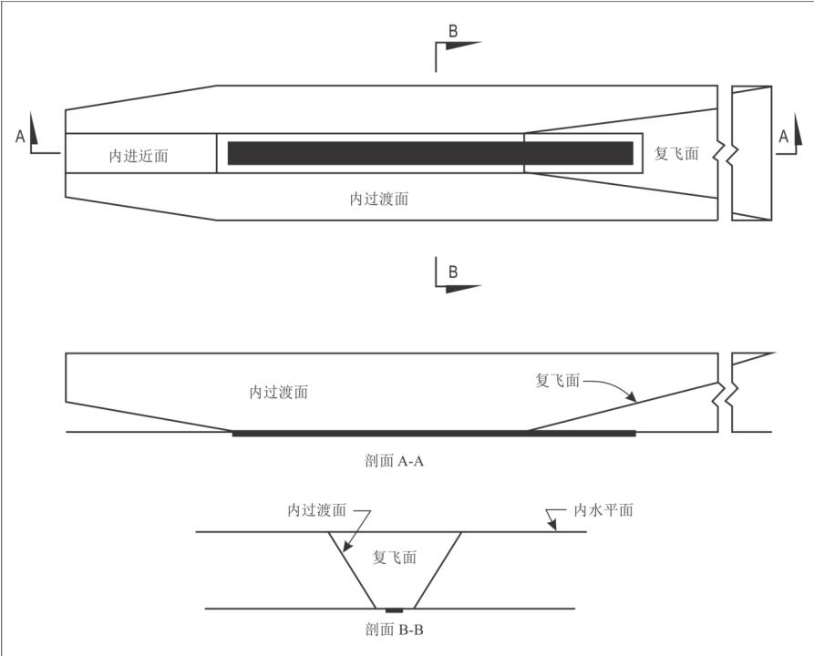

图4-2内进近面、内过渡面、复飞面的障碍物限制面

## 过渡面

4.1.13说明一过渡面：沿升降带边缘和部分进近面边缘坡度向上和向外倾斜到内水平面的一个复合面。

4.1.14特性一过渡面的界限必须由下列各边组成：

a）一条底边：从进近面侧边与内水平面相交处开始、沿进近面侧边向下延伸至进近面的内边，再从该处沿升降带的全长与跑道中线相平行；和

b）一条顶边：位于内水平面的平面上。

#### 4.1.15 底边上一点的标高必须是：

沿进近面的侧边一等于进近面在该点的标高；和

b)沿升降带一等于跑道中线或其延长线上最近点的标高。

注：由于b）的规定，如果跑道纵剖面是弯曲的，则沿升降带的过渡面将是一个曲面；如果跑道纵剖面是一条直线，则沿升降带的过渡面将是一个平面。过渡面与内水平面相交的线亦将视跑道纵剖面的不同而是一条直线或是一条曲线。

4.1.16过渡面的坡度必须在与跑道中线成直角的一个垂直平面内度量。

## 内过渡面

注：内过渡面意在作为对助航设施、航空器和其他必须接近跑道的车辆的控制障碍物限制面，除非是易折物体，它们不得突出这个限制面。4.1.13所描述的过渡面意在作为建筑物等的控制障碍物限制面。

4.1.17说明一内过渡面：与过渡面相似的面，但更接近于跑道。

4.1.18特性一内过渡面的界限必须由下列各边组成：

a）一条底边：从内进近面的末端开始，沿内进近面的侧边向下延伸到该面的内边，从该处沿升降带平行于跑道中线至复飞面的内边，然后再从该处沿复飞面的边线向上至该边线与内水平面相交处为止；和b）一条顶边：位于内水平面的平面上。

4.1.19底边上一点的标高必须是：

a）沿内进近面和复飞面的侧边一等于该点特定面的标高；和

b）沿升降带一等于跑道中线或其延长线上最近点的标高。

注：由于b）条的规定，如果跑道纵剖面是曲线，则沿升降带的过渡面将是一个曲面；如果跑道纵剖面是一条直线，则沿升降带的内过渡面将是一个平面。内过渡面与内水平面相交的线亦将视跑道纵剖面的不同而是一条直线或是一条曲线。

4.1.20内过渡面的坡度必须在与跑道中线成直角的一个垂直平面内度量。

## 复飞面

4.1.21说明一复飞面：位于跑道入口后面一个规定距离的、在两侧内过渡面之间延伸的一个倾斜平面。

4.1.22特性一复飞面的界限必须由下列各边组成：

a）一条内边：位于跑道入口后面一个规定的距离，并垂直于跑道中线的水平线；

b）两条侧边：以内边的两端为起点，并从含有跑道中线的垂直平面以规定的比率均匀地向外扩展；和

c）一条外边：平行于内边，并位于内水平面的平面内。

4.1.23内边的标高必须等于在内边位置处的跑道中线的标高。

4.1.24复飞面的坡度必须在含有跑道中线的一个垂直平面内度量。

## 起飞爬升面

4.1.25说明一起飞爬升面：在跑道端或净空道端外的一个倾斜平面或其他规定的面。

4.1.26特性一起飞爬升面的界限必须由以下各边组成：

a）一条内边：位于跑道端外规定距离处，或当设有净空道而其长度超过上述规定距离时位于净空道端处，垂直于跑道中线的一条水平线；

b）两条侧边：以内边的两端为起点，从起飞航道以规定的比率均匀地扩展至一个规定的最终宽度，然后在起飞爬升面的剩余长度内继续维持这一宽度；和

c）一条外边：垂直于规定的起飞航道的一条水平线。

4.1.27内边的标高必须等于从跑道端至内边之间的跑道中线延长线上最高点的标高：除了当设有净空道时，则内边标高必须等于净空道中线上地面最高点的标高。

4.1.28在一条直线起飞航道的情况下，起飞爬升面的坡度必须在含有跑道中线的一个垂直平面内度量。

4.1.29在一条带有转弯的起飞航道的情况下，起飞爬升面必须是一条含有对其中线的水平法线的复合面，该中线的坡度必须与直线起飞航道的坡度相同。

### 4.2 障碍物限制要求

注：障碍物限制面的要求是根据跑道的预计用途（即起飞或着陆以及进近的类型）来规定的，并准备在该跑道用于这种用途时适用。在跑道要在两个方向都作起飞或着陆运行的情况下，则某些限制面的作用可能由于对另一个较低面的更为严格的要求而变得无用了。

## 非仪表跑道

4.2.1对非仪表跑道必须设立下列障碍物限制面：

一锥形面；

内水平面；

进近面；和

—过渡面。

4.2.2各个限制面的高度和坡度必须不大于表4-1中的规定，其余尺寸必须不小于表4-1中的规定。

4.2.3新物体或现有物体的扩展不允许高出进近面或过渡面，除非有关当局认为该新物体或扩展的物体会被一个已经存在的不能移动的物体所遮蔽。

注：可以合理地利用遮蔽原则的情况，见《机场服务手册》（Doc9137号文件）第6部分。

4.2.4建议：新物体或现有物体的扩展应不允许高出锥形面或内水平面，除非有关当局认为该物体会被一个已经存在的不能移动的物体所遮蔽，或者经过航空研究后确定该物体不致有害地影响飞行安全或严重地影响飞机正常运行。

4.2.5建议：高出4.2.1要求的任何限制面的现有物体应尽实际可行地移除，除非有关当局认为该物体已被一个现存的不能移动的物体所遮蔽，或者经过航空研究后确定该物体不致有害地影响飞行安全或严重地影响飞机正常运行。

注：由于升降带的横坡或纵坡，在某种情况下，进近面的内边或内边的一部分可能处干相应的升降带的高程之下。这种情况并不意味着要把升降带平整得符合于进近面的内边，也不意味着要把升降带端以外的高出进近面但低于升降带高程的地形部分或物体移除，除非认为它们可能危及飞机。

4.2.6建议：在考虑计划的建设时，应考虑到仪表进近跑道将来的可能发展以及随之而来的更为严格的障碍物限制面的要求。

## 非精密进近跑道

4.2.7非精密进近跑道必须设立下列障碍物限制面：

一锥形面；

一内水平面；

一进近面；

一过渡面。

4.2.8各限制面的高度和坡度必须不大于表4-1中的规定，其余尺寸必须不小于表4-1中的规定，进近面的水平段的情况除外（见4.2.9）。

4.2.9在2.5%坡度与下述面相交处以远的那部分进近面必须是水平的：

a）一个高于跑道入口标高150m的水平面；或

b）通过控制超障高度/超障高（OCA/H）的任何物体顶端的水平面。

以两者中的较高者为准。

表4-1障碍物限制面的尺寸和坡度—进近跑道

进近跑道

<html><body><table border="1"><thead><tr><td colspan="10"></td></tr><tr><td></td><td colspan="9"></td></tr><tr><td></td><td colspan="4">非仪表跑道</td><td colspan="3">非精密进近跑道</td><td colspan="2">精密进近跑道等级 I</td></tr><tr><td>障碍物限制面</td><td colspan="3">基准代码 2</td><td colspan="3">跑道类别 基准代码</td><td colspan="2">基准代码 1,2</td><td>Ⅱ类或Ⅲ类 基准代码</td></tr><tr><td>及尺寸a (1)</td><td>1</td><td></td><td>3 (4)</td><td>4</td><td>1,2 3</td><td>4</td><td></td><td>3,4</td><td>3,4</td></tr><tr><td></td><td>(2) (3)</td><td></td><td>(5)</td><td>(6)</td><td>(7)</td><td>(8)</td><td>(9)</td><td>(10)</td><td>(11)</td></tr><tr><td>锥形面</td><td></td><td></td><td></td><td></td><td></td><td></td><td></td><td>5%</td><td></td></tr></thead><tbody><tr><td>坡度</td><td>5%</td><td>5%</td><td>5%</td><td>5%</td><td>5%</td><td>5%</td><td>5%</td><td>5%</td><td></td></tr><tr><td>高度</td><td>35m</td><td>55 m</td><td>75m</td><td>100m</td><td>60m</td><td>75m</td><td>100m</td><td>60m</td><td>5% 100m</td></tr><tr><td>内水平面</td><td></td><td></td><td></td><td></td><td></td><td></td><td></td><td>100m</td><td></td></tr><tr><td>高度</td><td>45m</td><td>45m</td><td>45m</td><td>45m</td><td>45m</td><td>45m 45m</td><td></td><td>45m</td><td>45m</td></tr><tr><td>半径</td><td>2 000m</td><td>2 500m</td><td>4000m</td><td>4000m</td><td>3500m</td><td>4000m 4000m</td><td></td><td>45m 3500 m 4000m</td><td>4000m</td></tr><tr><td>内进近面</td><td></td><td></td><td></td><td></td><td></td><td></td><td></td><td></td><td></td></tr><tr><td>宽度</td><td>一</td><td>—</td><td></td><td>一</td><td>一</td><td></td><td></td><td></td><td></td></tr><tr><td>距跑道入口距离</td><td></td><td></td><td></td><td></td><td></td><td>一</td><td>90m</td><td>120m 60m</td><td>120m</td></tr><tr><td>长度</td><td></td><td></td><td></td><td></td><td>,</td><td>—</td><td>60m 900m</td><td></td><td>60m</td></tr><tr><td>坡度</td><td></td><td></td><td></td><td></td><td></td><td></td><td>2.5%</td><td>900m 2%</td><td>900m 2%</td></tr><tr><td>进近面</td><td></td><td></td><td></td><td></td><td></td><td></td><td></td><td></td><td></td></tr><tr><td>内边长度</td><td>60m</td><td>80m</td><td>150m</td><td>150m</td><td>140m</td><td>280 m</td><td></td><td>280m</td><td>280m</td></tr><tr><td>距跑道入口距离</td><td>30m</td><td>60 m</td><td>60m</td><td>60 m</td><td>60m</td><td>280m 60m</td><td></td><td>140m 60m 60m</td><td></td></tr><tr><td>散开率（每侧）</td><td>10%</td><td>10%</td><td>10% 10%</td><td></td><td>15% 15%</td><td>60m 15%</td><td>15%</td><td>15%</td><td>60m 15%</td></tr><tr><td>第一段</td><td></td><td></td><td></td><td></td><td></td><td></td><td></td><td></td><td></td></tr><tr><td>长度</td><td>1 600m</td><td>2 500m</td><td>3000m</td><td>3000m</td><td>2500m 3000m</td><td>3000m</td><td>3000m</td><td>3000m</td><td>3000m</td></tr><tr><td>坡度</td><td>5%</td><td>4%</td><td>3.33%</td><td>2.5%</td><td>3.33%</td><td>2% 2%</td><td>2.5%</td><td>2%</td><td>2%</td></tr><tr><td>第二段</td><td></td><td></td><td></td><td></td><td></td><td></td><td></td><td></td><td></td></tr><tr><td>长度</td><td>一</td><td>一</td><td></td><td></td><td>一</td><td>3 600m{$ 3 600m{$</td><td></td><td>12 000 m 3 600m{$</td><td>3600m{$</td></tr><tr><td>坡度</td><td></td><td></td><td></td><td></td><td></td><td>2.5% 2.5%</td><td></td><td>3% 2.5%</td><td>2.5%</td></tr><tr><td>水平段</td><td></td><td></td><td></td><td></td><td></td><td></td><td></td><td></td><td></td></tr><tr><td>长度</td><td></td><td></td><td></td><td>一</td><td>一</td><td>8 400m$ 8 400m{b$</td><td>_</td><td>8 400mb$</td><td>8 400 m{b$</td></tr><tr><td>总长度</td><td>一</td><td></td><td></td><td>_</td><td></td><td>15 000m 15 000m</td><td></td><td>15 000m 15 000m</td><td>15 000m</td></tr><tr><td></td><td></td><td></td><td></td><td></td><td></td><td></td><td></td><td></td><td></td></tr><tr><td>过渡面 坡度</td><td>20%</td><td>20%</td><td>14.3%</td><td>14.3%</td><td>20%</td><td>14.3%</td><td></td><td>14.3%</td><td>14.3%</td></tr><tr><td></td><td></td><td></td><td></td><td></td><td></td><td>14.3%</td><td></td><td>14.3%</td><td></td></tr><tr><td>内过渡面 坡度</td><td></td><td></td><td></td><td></td><td></td><td></td><td></td><td>40% 33.3%</td><td>33.3%</td></tr><tr><td></td><td></td><td></td><td></td><td></td><td></td><td></td><td></td><td></td><td></td></tr><tr><td>复飞面 内边长度</td><td></td><td></td><td></td><td></td><td></td><td></td><td></td><td>120mc</td><td></td></tr><tr><td></td><td></td><td></td><td></td><td></td><td></td><td></td><td></td><td>90m 1 800md</td><td>120m</td></tr><tr><td>距跑道入口距离</td><td></td><td></td><td></td><td></td><td></td><td></td><td></td><td>c</td><td>1 800md</td></tr><tr><td>散开率（每侧）</td><td></td><td></td><td></td><td></td><td></td><td></td><td></td><td>10% 10%</td><td>10%</td></tr><tr><td>坡度</td><td></td><td></td><td></td><td></td><td></td><td></td><td></td><td>4% 3.33%</td><td>3.33%</td></tr></tbody></table></body></html>

a.除另有注明外，所有尺寸均为水平度量。

b.可变的长度（见4.2.9或4.2.17）

c.距升降带端的距离。

d.或距跑道端距离，两者取其小者。

e.基准代字为F时（表1-1），该宽度增加到140m，但能接纳装有数字化航空电子设备以便在复飞操作时提供操纵指令使航空器保持已建立航迹的基准代字为F类飞机的机场除外。

注：关于更多资料，见301号通告、345号通告（即将出版）和《空中航行服务程序—机场》第I部分（Doc9981号文件）第4章。

4.2.10新物体或现有物体的扩展不允许高出距内边3000m以内的进近面或高出过渡面，除非有关当局认为该新物体或扩展的物体会被一个已经存在的不能移动的物体所遮蔽。

注：可以合理地利用遮蔽原则的情况，见《机场服务手册》（Doc9137号文件）第6部分。

4.2.11建议：新物体或现有物体的扩展应不允许高出距内边3000m以内的进近面、锥形面或内水平面，除非有关当局认为该物体会被一个已经存在的不能移动的物体所遮蔽，或者在经过航空研究后确定该物体不致有害地影响飞行安全或严重地影响飞机正常的运行。

4.2.12建议：高出4.2.7要求的任何限制面的现有物体应尽实际可行地移除，除非有关当局认为该物体已被一个现存的不能移动的物体所遮蔽，或者经过航空研究后确定该物体不致有害地影响飞行安全或严重地影响飞机正常的运行。

注：由于升降带的横坡或纵坡，在某种情况下，进近面的内边或内边的一部分可能处于相应的升降带的高程之下。这种情况并不意味着要把升降带平整得符合于进近面的内边，也不意味着要把升降带端以外的高出进近面但低于升降带高程的地形部分或物体移除，除非认为它们可能危及飞机。

## 精密进近跑道

注1：有关在运行区上的上的设备和装置的定位的资料，见9.9。

注2：有关精密进近跑道的障碍物限制面的指导材料，见《机场服务手册》（Doc9137号文件）第6部分。

4.2.13I类精密进近跑道必须设立下列障碍物限制面：

锥形面；

内水平面；

进近面；和

过渡面。

4.2.14建议：I类精密进近跑道应设立下列障碍物限制面：

内进近面；

内过渡面；和

复飞面。

4.2.15Ⅱ类或类精密进近跑道必须设立下列障碍物限制面：

锥形面；

内水平面；

进近面和内进近面；

过渡面；

内过渡面；和

复飞面。

4.2.16除进近面的水平段外，各限制面的高度和坡度必须不大于表4-1中的规定，其余尺寸必须不小于表4-1中的规定（见4.2.17）。

4.2.17在2.5%坡度与下述面中相交处以远的那部分进近面必须是水平面：

a)一个高于跑道入口标高150m的水平面；或

b）通过任何控制超障界限的物体顶端的水平面。

以两者中的较高者为准。

4.2.18除了由于其功能需要必须设置在升降带上的易折物体外，所有固定物体不充许超出内进近面、内过渡面或复飞面。在跑道用于飞机着陆期间，不允许有运动的物体高出这些限制面。

4.2.19新物体或现有物体的扩展不允许高出进近面或过渡面，除非有关当局认为该新物体或扩展的物体会被一个已有的不能移动的物体所遮蔽。

注：可以合理地利用遮蔽原则的情况，见《机场服务手册》（Doc9137号文件）第6部分。

4.2.20建议：新物体或现有物体的扩展不允许高出锥形面和内水平面，除非有关当局认为该物体会被现有的不能移动的物体所遮蔽；或者经过航空研究后确定该物体不致有害地影响飞行安全或严重地影响飞机正常的运行。

4.2.21建议：高出进近面、过渡面、锥形面和内水平面的现有物体应尽实际可行地移除，除非有关当局认为该物体已被一个现有的不能移动的物体所遮蔽，或者经过航空研究后确定该物体不致有害地影响飞行安全或严重地影响飞机正常的运行。

注：由于升降带的横坡或纵坡，在某种情况下，进近面的内边或内边的一部分可能处于相应的升降带的高程之下。这种情况并不意味着要把升降带平整得符合于进近面内边，也不意味着要把升降带端以外的高出进近面但低于升降带高程的地形部分或物体移除，除非认为它们可能危及飞机。

## 供起飞用的跑道

4.2.22供起飞用的跑道必须设立下列障碍物限制面：

一起飞爬升面。

4.2.23起飞爬升面的尺寸必须不小于表4-2中的规定，除非当一个较小的长度能符合于所采用的决定离场飞机的程序措施时，起飞爬升面可以采用那个较小的长度。

4.2.24建议：应检查准备使用该跑道的各种飞机的操作性能，以查看当要求适合于应付临界的运行条件时是否需要减小表4-2中所规定的坡度。如果减小了规定的坡度，则应对起飞爬升面的长度作相应的调整，使之提供保障直至300m的高度为止。

注：如当地条件与海平面标准大气条件相差很大，可能宜于将表4-2中所规定的坡度减小。减小的幅度取决于当地条件与海平面标准大气条件之间的差异程度，以及准备使用该跑道的飞机的性能特性和操作要求。

4.2.25新物体或现有物体的扩展不允许高出起飞爬升面，除非有关当局认为该新物体或扩展的物体会被一个已有的不能移动的物体所遮蔽。

注：可以合理地利用遮蔽原则的情况，见《机场服务手册》（Doc9137号文件）第6部分。

4.2.26建议：如果原来没有物体达到2%(1:50）的起飞爬升面，新物体应限制在保持原有的无障碍物面或保持一个坡度减小至1.6%(1:62.5）的限制面内。

表4-2障碍物限制面的尺寸和坡度

供起飞用的跑道

<html><body><table border="1"><tr><td rowspan="2">障碍物限制面和尺寸a</td><td colspan="3">基准代码</td></tr><tr><td>1</td><td>2</td><td>3或4</td></tr><tr><td>(1) 起飞爬升面</td><td>(2)</td><td>(3)</td><td>(4)</td></tr><tr><td></td><td></td><td></td><td></td></tr><tr><td>内边长度 距跑道端距离b</td><td>60m</td><td>80m</td><td>180m</td></tr><tr><td>散开率（每边）</td><td>30m</td><td>60m</td><td>60m</td></tr><tr><td>最终宽度</td><td>10%</td><td>10%</td><td>12.5%</td></tr><tr><td></td><td>380m</td><td>580m</td><td>1 200 m</td></tr><tr><td>长度</td><td>1 600 m</td><td></td><td>1 800mc</td></tr><tr><td></td><td></td><td>2500 m</td><td>15 000 m</td></tr><tr><td>坡度</td><td>5%</td><td>4%</td><td>2%d</td></tr></table></body></html>

a)除另有规定外，所有尺寸均为水平度量。

b)如净空道长度超出规定的距离，起飞爬升面从净空道端开始。

c)在仪表气象条件和夜间目视气象条件下飞行，当拟用航道含有大于15°的航向变动时，采用1800m。

d)见4.2.24和4.2.26。

4.2.27建议：高出起飞爬升面的现有物体应尽实际可行地移除，除非有关当局认为该物体被一个现有的不能移动的物体所遮蔽，或者经过航空研究后确定该物体不致有害地影响飞行安全或严重地影响飞机正常的运行。

注：由于升降带或净空道上的横坡，在某种情况下，起飞爬升面的内边的一部分可能处于升降带或净空道的相应高程之下。这种情况并不意味着要把升降带或净空道平整得符合于起飞爬升面的内边，也不意味着要把升降带或净空道端以外高出起飞爬升面但低于升降带或净空道的地形部分或物体移除，除非认为它们可能危及飞机。类似的考虑亦适用于存在有横坡差异的净空道和升降带的接合处。

### 4.3 障碍物限制面以外的物体

4.3.1建议：应做出安排，以便能够就障碍物限制面范围以外拟建的高于有关当局所规定高度的建筑物向该当局进行咨询，从而可对该建筑物对飞机运行有何影响进行航空研究。

4.3.2建议：在障碍物限制面范围以外的地区内，至少那些高于地面标高达150m或更高的物体应被认为是障碍物，除非经过专门的航空研究表明它们并不构成对飞机的危害。

注：该研究可能与有关飞行的性质有关，并可能要区分白天和夜间飞行的差别。

### 4.4 其他物体

4.4.1建议：对并不高出进近面、但对目视或非目视助航设施的最佳位置或性能有不良影响的物体应尽实际可行地移除。

4.4.2建议：任何东西，在有关当局作航空研究后认为对活动地区上或内水平面和锥形面范围以内的空间的飞机有危害的，应被认为是障碍物，并应尽实际可行地移除。

注：在某些情况下，并未高出4.1中所列举的任何限制面的物体，可能会对飞机构成危险，例如，在机场附近的一个或几个孤立的物体。

## 第5章目视助航设施

### 5.1 指示标和信号设施

#### 5.1.1 风向标

应用

5.1.1.1机场必须至少设置一个风向标。

位置

5.1.1.2风向标必须设置得能被在飞行中的或在活动区上的飞机看得见，并不受附近物体引起的气流干扰。

特性

5.1.1.3建议：风向标应为截头圆锥形，由织物制成，长度应不小于3.6m，大端直径应不小于0.9m。风向标应制造得能明确地指明地面风的方向，并能大致地显示风速。选择的风向标颜色（一种或一种以上）应至少在300m 的高度上相对于背景清楚可见且易于理解。如实际可行，应用单色，最好为白色或橙色。为了在有变化的背景上使其足够醒目而需用两种颜色时，最好应选用橙色与白色、红色与白色或黑色与白色，并应安排成五个两色相间的环带，两端的环带用较深色。

5.1.1.4建议：至少应有一个风向标的位置用直径为15m、宽1.2m的圆环标出。圆环应以风向标的支架为中心，并应选用足够醒目的颜色，最好为白色。

5.1.1.5建议：准备在夜间使用的机场至少应有一个风向标设有照明。

#### 5.1.2 着陆方向标

位置

5.1.2.1机场设置着陆方向标时，必须将其设置在机场内明显的地方。

特性

5.1.2.2建议：着陆方向标应为“T”形。

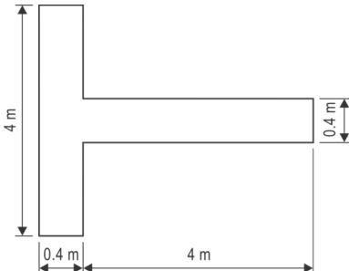

图5-1着陆方向标

5.1.2.3着陆方向标“T”的形状和最小尺寸必须如图5-1所示。着陆方向标“T”的颜色必须为白色或橙色，两者中选择观察时与背景反差最好的。需供夜间使用的机场，着陆方向标“T”必须设有照明或以白色灯勾画其轮廓。

#### 5.1.3 信号灯

应用

5.1.3.1实行空中交通管制的机场必须在管制塔台上设置信号灯。

特性

5.1.3.2建议：信号灯应能发出红、绿、白三种颜色光的信号，并能：

a）按照需要由人工操纵对准任何目标；

b）发出任何一种颜色光的信号，随之发出另外两种颜色光之一的信号；和

c）用三种颜色光中的任何一种以莫尔斯电码传送信息，速度至少每分钟4个字。

当选用绿色时，应使用附录1的2.1.2规定的绿色的界限。

5.1.3.3建议：光束的扩散角应不小于1，亦不大于$3^{\circ}$ ,$3^{\circ}$ 以外应几乎无光。当信号灯准备在白天使用时，颜色光的光强应不小于6000cd。

#### 5.1.4 信号板和信号场地

注：本节列入有关信号场地的详细规定并不意味着一定要设信号场地。附篇A第16节载有是否需设信号场地的指导材料。附件2的附录1规定了地面目视信号的形状、颜色及其使用。有关其设计的指导材料，见《机场设计手册》（Doc9157号文件）第4部分。

## 信号场地的位置

5.1.4.1建议：信号场地应设置在从300m高度、水平面10°以上所有方位角上均能看得到的地方。

## 信号场地的特性

5.1.4.2信号场地必须是一块至少9m见方的平整的水平面。

5.1.4.3建议：信号场地应选用与所用的信号板反差大的颜色，并应围以宽度不小于0.3m的白色边界。

### 5.2 标志

#### 5.2.1 概述

## 跑道标志的中断

5.2.1.1在两条（或更多条）跑道相交处，除跑道边线标志外，必须显示较重要的那条跑道的标志，而其他跑道的标志必须中断。较重要的那条跑道的跑道边线标志在相交处可以连续，也可以中断。

5.2.1.2建议：就显示跑道标志而言，跑道重要性的顺序应如下文所列：

第一，精密进近跑道；

第二，非精密进近跑道；

第三，非仪表跑道。

5.2.1.3在跑道与滑行道相交处，跑道的各种标志除边线标志可以中断外，必须显示，而滑行道的各种标志必须中断。

注：关于跑道和滑行道中线标志的连接方式，见5.2.8.7。

## 颜色和明显性

5.2.1.4跑道标志必须为白色。

注1：实践表明，给浅色跑道表面上的白色标志加上黑边，可以提高其明显度。

注2：最好采用适当品种的油漆，以尽实际可行地减少由标志引起的不均匀摩阻特性的危险。

注3：标志可以由致密的色块组成，也可以由具有相同效果的一系列纵向线条组成。

5.2.1.5滑行道标志、跑道掉头坪标志和机位标志必须为黄色。

5.2.1.6机坪安全线的颜色必须鲜明，并与机位标志的颜色反差良好。

5.2.1.7建议：在夜间运行的机场内，应用反光材料涂刷铺筑面标志以增强其可见性。

注：关于反光材料的指导材料，见《机场设计手册》（Doc9157号文件）第4部分。

## 无铺筑面的滑行道

5.2.1.8建议：只要实际可行，无铺筑面的滑行道应按有铺筑面的滑行道的规定设置各种标志。

#### 5.2.2 跑道号码标志

应用

5.2.2.1有铺筑面的跑道入口处必须设置跑道号码标志。

5.2.2.2建议：只要实际可行，在无铺筑面的跑道入口处应设置跑道号码标志。

位置

5.2.2.3跑道号码标志必须适当地如图5-2所示设在跑道入口处。

注：如果跑道入口自跑道端内移，可设标明跑道号码的标记牌供飞机起飞使用。

## 特性

5.2.2.4跑道号码标志必须由两位数字组成，在平行跑道上必须再增加一个字母。在单条跑道、两条平行跑道和三条平行跑道上，这个两位数必须是从进近方向看去最接近于跑道磁方位角度数的十分之一的整数。在四条或更多的平行跑道上，一组相邻跑道必须按最接近于磁方位角度数的十分之一编号，而另一组相邻跑道则按次一个最接近的磁方位角度数的十分之一编号。当按上述规则得出的是一位数字时，则在它的前面加一个零。

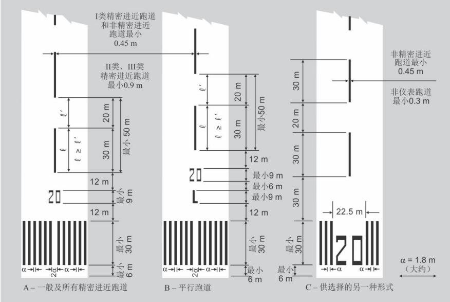

图5-2跑道号码标志、中线标志和入口标志

5.2.2.5在有平行跑道的情况下，每个跑道号码标志必须从进近方向看去自左至右按下列顺序各增加一个字母：

—如为两条平行跑道：“L”“R”；

— 如为三条平行跑道：“L”“C”“R”；

—如为四条平行跑道：“L”“R”“L”“R”；

—如为五条平行跑道：“L”“C”“R”“L”“R”或“L”“R”“L”“C”“R”；

一如为六条平行跑道：“L”“C”“R”“L”“C”“R”。

5.2.2.6数字和字母的形状和比例必须如图5-3所示。其尺寸不得小于图5-3所示，但当数字与跑道入口标志结合在一起时，必须采用较大的尺寸，以填补跑道入口标志线条间的空隙。

#### 5.2.3 跑道中线标志

应用

5.2.3.1有铺筑面的跑道必须设置跑道中线标志。

位置

5.2.3.2跑道中线标志必须设在两端跑道号码标志之间的跑道中线上，如图5-2所示，但按5.2.1.1规定的中断处除外。

特性

5.2.3.3跑道中线标志必须由均匀隔开的线段和间隙组成。每一线段加一个间隙的长度不得小于50m，亦不得大于75m。每一线段的长度必须至少等于间隙的长度或30m，取较大值。

5.2.3.4线段的宽度不得小于：

一在Ⅱ类、Ⅲ类精密进近跑道上，0.90m；

一在I类精密进近跑道上以及基准代码为3或4的非精密进近跑道上，0.45m；

一基准代码为1或2的非精密进近跑道和非仪表跑道上，0.30m。

#### 5.2.4 跑道入口标志

## 应用

5.2.4.1在有铺筑面的仪表跑道的入口处和有铺筑面的基准代码为3或4并准备供国际商务航空运输使用的非仪表跑道的入口处，必须设置跑道入口标志。

5.2.4.2建议：在有铺筑面的基准代码为3或4的准备供国际商务航空运输以外的业务使用的非仪表跑道的入口处，应设置跑道入口标志。

5.2.4.3建议：只要实际可行，应在无铺筑面的跑道的入口处设置跑道入口标志。

注：《机场设计手册》（Doc9157号文件）第4部分载有一种经过使用令人满意的标明紧靠跑道入口前的降坡的标志形式。

位置

5.2.4.4跑道入口标志的线段必须从距离跑道入口6m处开始。

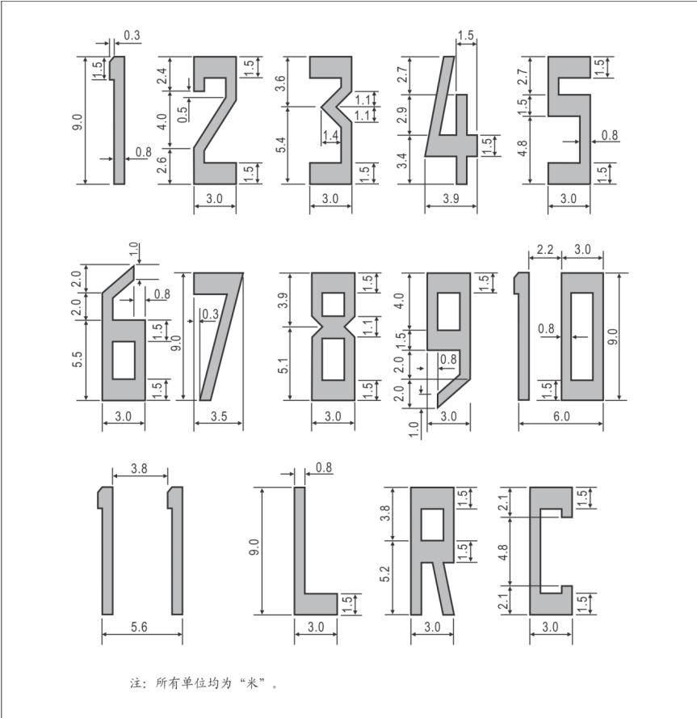

图5-3跑道号码标志的数字和字母的形状和比例

特性

5.2.4.5跑道入口标志必须由一组尺寸相同、位置对称于跑道中线的纵向线段组成，如图5-2(A）和(B）所示作为示例的那条45m宽的跑道那样。线段的数目必须按照跑道宽度确定如下：

<html><body><table border="1"><tr><td>跑道宽度</td><td>线段数目</td></tr><tr><td>18m</td><td>4</td></tr><tr><td>23 m</td><td>6</td></tr><tr><td>30m</td><td>8</td></tr><tr><td>45m</td><td>12</td></tr><tr><td>60m</td><td>16</td></tr></table></body></html>

但45m或更宽的非精密进近跑道和非仪表跑道，可以采用如图5-2(C）所示的形式。

5.2.4.6入口标志的线段必须横向延伸至距跑道边3m处，或跑道中线两侧各27m距离处，以得出较小的横向宽度为准。如跑道号码标志设在入口标志之间，则跑道中线每侧必须至少有三条线段。如跑道号码标志设在入口标志前方，这些线段必须连续横贯跑道。线段必须至少30m长、约1.80m宽、间距约1.80m。但在线段连续横贯跑道时，最靠近跑道中线的两条线段之间必须用双倍的间距隔开，而在跑道号码标志设在入口标志之间的情况下，则此间距必须为22.5m。

## 横向线条

5.2.4.7建议：在跑道入口自跑道端内移或跑道端与跑道中线不成直角的情况下，跑道入口标志应增加一条横向线条，如图5-4(B）所示。

5.2.4.8横向线条的宽度不得小于1.80m。

箭头

5.2.4.9在跑道入口为永久内移的情况下，必须依照图5-4(B）所示在内移跑道入口以前的那部分跑道上设箭头。

5.2.4.10当跑道入口是从正常位置临时内移时，必须如图5-4(A）或(B）所示加以标志，并将内移跑道入口以前除跑道中线标志以外的所有标志予以遮掩，同时将跑道中线标志改为箭头。

注1：在跑道入口仅在短时间内临时内移的情况下，经验表明，不在跑道上油漆内移跑道入口标志而用与其形式和颜色相同的标志物来代替也能取得满意的效果。

注2：当内移跑道入口以前的跑道已不适于航空器的地面活动时，则需要设置如7.1.4所描述的关闭标志。

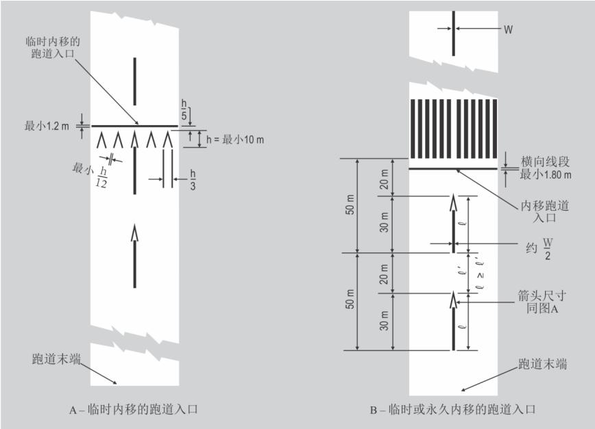

图5-4内移的跑道入口标志

#### 5.2.5 瞄准点标志

应用

5.2.5.1基准代码为2、3或4的有铺筑面的仪表跑道的每个进近端必须设置瞄准点标志。

5.2.5.2建议：当需要增加瞄准点的明显度时，瞄准点标志应设置在下列情况的每个进近端：

a）基准代码为3或4的有铺筑面的非仪表跑道；

b）基准代码为1的有铺筑面的仪表跑道。

## 位置

5.2.5.3瞄准点标志必须从不小于表5-1中相应栏中表明的距入口的距离处开始，但在跑道装有目视进近坡度指示系统时标志的开始点必须与目视进近坡度起端重合。

5.2.5.4瞄准点标志必须由两条明显的条块组成。条块的尺寸及其内边的横向间距必须符合表5-1中相应栏的规定。如设有接地带标志，瞄准点标志的横向间距必须与接地带标志相同。

#### 5.2.6 接地带标志

应用

5.2.6.1基准代码为2、3或4的有铺筑面的精密进近跑道的接地带必须设置接地带标志。

5.2.6.2建议：基准代码为3或4的有铺筑面的非精密进近跑道或非仪表跑道的接地带在需要增加其明显性时，应设置接地带标志。

表5-1瞄准点标志的位置和尺寸

<html><body><table border="1"><tr><td colspan="5">可用着陆距离</td></tr><tr><td>位置和尺寸</td><td>(1)</td><td>小于800m 800m至不足1200m (2)</td><td>1200m至不足2400m (3) (4)</td><td>2 400m及以上 (5)</td></tr><tr><td>跑道入口至标志开始点距离</td><td></td><td>150 m</td><td>250m 300m</td><td>400m</td></tr><tr><td>标志线段长度a</td><td>30~45 m</td><td>30~45 m</td><td>45~60m</td><td>45~60 m</td></tr><tr><td>标志线段宽度</td><td>4m</td><td>6m</td><td>6~10m{b$</td><td>6~10 m{b$</td></tr><tr><td>线段内边的横向间距</td><td>6mc</td><td>9mc$</td><td>18~22.5 m</td><td>18~22.5 m</td></tr><tr><td>a) 规定范围较大的尺寸用于要求增加明显度时使用。 b) c)</td><td colspan="4">横向间距可以在这些范围内变动，以使该标志被橡胶堆积物的污染减小到最小程度。 这些数字是参照第1章表1-1中机场基准代号第二要素即主起落架外轮的间距得出的。</td></tr></table></body></html>

## 位置和特性

5.2.6.3接地带标志必须由若干对对称地设在跑道中线两侧的长方形标志块组成，其对数与可用着陆距离有关，当一条跑道两端的进近方向都要设置该标志时，则与跑道两端入口之间的距离有关。具体规定如下：

可用着陆距离或跑道入口之间的距离

标志块对数

小于 900m 1

900m至不足1200m 2

1200m至不足1500m 3

1500m至不足2400m 4

2400m及2400m以上6

5.2.6.4接地带标志必须符合图5-5所示两种型式之一种。在图5-5(A）所示型式中，每块标志的长和宽必须分别不小于22.5m和3m。在图5-5(B）所示型式中，每条标志的长和宽必须分别不小于22.5m和1.8m，相邻线条之间的间距必须为1.5m。长方形的内边的横向间距在设有瞄准点标志的场合，必须与该瞄准点标志的横向间距相等。在不设置瞄准点标志的场合，长方形的内边之间的横向间距必须与表5-1(第2、3、4或5栏）中对瞄准点标志规定的横向间距相符。成对标志的纵向间距必须为150m，自跑道入口处开始。与瞄准点标志相重合或位于其50m范围内的各对接地带标志必须删去。

5.2.6.5建议：基准代码为2的非精密进近跑道，在瞄准点标志起端之后的150m处应增设一对接地带标志。

#### 5.2.7 跑道边线标志

## 应用

5.2.7.1当跑道边缘与道肩或周围地域缺乏明显对比时，在有铺筑面的跑道的两端入口之间的范围内必须设置跑道边线标志。

5.2.7.2建议：无论跑道边缘与道肩或周围地域有无明显对比，精密进近跑道均应设置跑道边线标志。

## 位置

5.2.7.3建议：跑道边线标志应由两个线条组成，沿跑道的两侧边缘各设一条，每条的外边大致在跑道边缘上，只有在跑道宽度大于60m时，标志才应设在距跑道中线30m处。

5.2.7.4建议：当设有跑道掉头坪时，在跑道与跑道掉头坪之间的跑道边线标志不应中断。

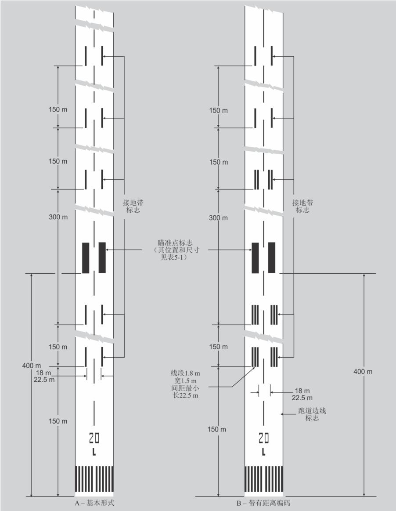

图5-5瞄准点和接地带标志

(2400m或以上长度的跑道示例）

特性

5.2.7.5建议：宽度为30m或大于30m的跑道的跑道边线标志的线条宽度应至少为0.9m，在较窄的跑道上，线条宽度应至少为0.45m。

#### 5.2.8 滑行道中线标志

## 应用

5.2.8.1在基准代码为3或4的机场内的有铺筑面的滑行道、除冰/防冰设施和机坪上的滑行通道上必须设置滑行道中线标志并安排得足以提供从跑道中线到各机位之间的连续的引导。

5.2.8.2建议：在基准代码为1或2的机场内的有铺筑面的滑行道、除冰/防冰设施和机坪上的滑行通道上应设置滑行道中线标志并安排得足以提供从跑道中线到各机位之间的连续的引导。

5.2.8.3在下述情况下，有铺筑面的跑道上必须设置滑行道中线标志：跑道是一条标准滑行路线的一部分而且

a）没有跑道中线标志；或

b）在滑行道中线不与跑道中线相重合。

5.2.8.4建议：当有必要指示接近跑道等待位置之处时，应设置增强型滑行道中线标志。

注：设置增强型滑行道中线标志可以构成防止跑道侵入措施的一部分。

5.2.8.5如果设置，增强型滑行道中线标志必须设在每条滑行道/跑道的交接处。

## 位置

5.2.8.6建议：在滑行道的直线部分，滑行道中线标志应沿滑行道中线设置。在滑行道弯道部分，此标志应从滑行道直线部分延续并保持与弯道的外侧边的距离不变。

注：见3.9.5及图3-2。

5.2.8.7建议：作为跑道出口的滑行道在与跑道交接处，滑行道中线标志应弯向跑道中线标志，如图5-6和图5-26所示。此时，滑行道中线标志应从与跑道中线标志的切点开始平行于跑道中线标志延伸一段距离，此距离在基准代码为3或4时应不小于60m，在基准代码为1或2时应不小于30m。

5.2.8.8建议：按照5.2.8.3要求在跑道上设置滑行道中线标志时，应将该标志设置在指定作为滑行道的中线上。

5.2.8.9如果设置：

a)增强型滑行道中线标志必须从跑道等待位置图形A（按图5-6滑行道标志的规定）沿驶离跑道方向延伸47米的距离。见图5-7(a)。

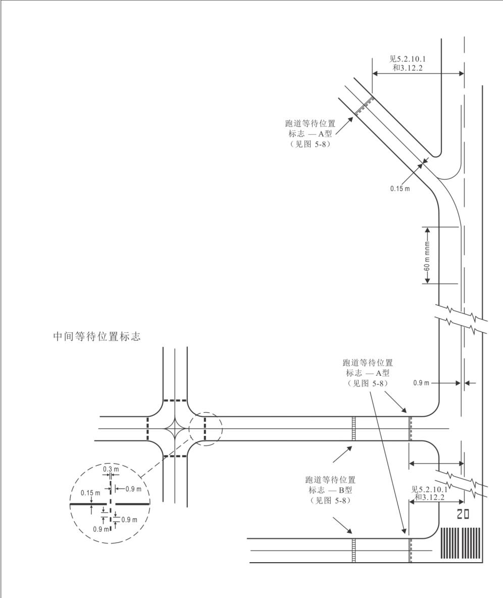

图5-6滑行道标志

（与基本的跑道标志一并示出）

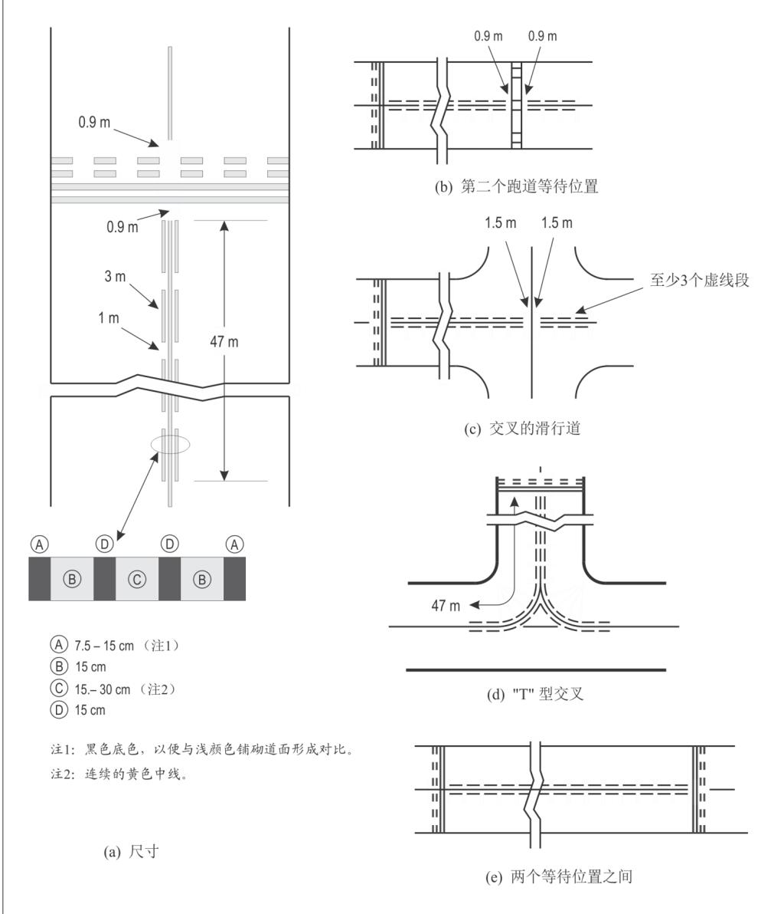

图5-7增强型滑行道中线标志

b)如果增强型滑行道中线标志与位于第一个跑道等待位置标志47米以内的另一个跑道等待位置标志，如Ⅱ类或类精密进近跑道的等待位置标志交叉，则必须在与跑道等待位置标志的交叉点前后各0.9米处中断增强型滑行道中线标志。增强型滑行道中线标志必须在超过与跑道等待位置标志的交叉点后继续向前延伸至少三个虚线段，或者从起点至终点至少达到47米，两者取较大值。见图5-7(b)。c)如果增强型滑行道中线标志穿过位于跑道等待位置标志47米以内的滑行道/滑行道交叉处，则必须在交叉的滑行道中线穿越增强型滑行道中线的这一点的前后各1.5米处中断增强型滑行道中线标志。增强型滑行道中线标志必须在超过滑行道/滑行道交叉处后继续向前延伸至少三个虚线段，或者从起点至终点至少达到47米，两者取较大值。见图5-7(c)。

d)如果两条滑行道中线在跑道等待位置标志处或在此之前汇聚，则内侧虚线的长度不得短于3米。见图5-7(d)。

e)如果有两个相对的跑道等待位置标志，且标志之间的距离小于94米，则增强型滑行道中线标志必须贯穿这一整个距离。增强型滑行道中线标志不得延伸至任一跑道等待位置标志以外。见图5-7(e)。

## 特性

5.2.8.10滑行道中线标志必须为至少宽15cm的连续实线，只有在其与跑道等待位置标志或中间等待位置标志相交处才如图5-6所示中断。

5.2.8.11增强型滑行道中线标志必须如图5-7所示。

#### 5.2.9 跑道掉头坪标志

应用

5.2.9.1当设有跑道掉头坪时，必须设置跑道掉头坪标志用以连续引导飞机完成180°转弯并对准跑道中线。

## 位置

5.2.9.2建议：跑道掉头坪标志应从跑道中线弯出进入掉头坪。其转弯半径应与预计使用该跑道掉头坪的飞机的操纵特性和正常滑行速度相适应。跑道掉头坪标志与跑道中线的交角不应大于30°。

5.2.9.3建议：跑道掉头坪标志应从与跑道中线标志的切点开始平行于跑道中线标志延伸一段距离，此距离在基准代码为3或4时应至少为60m，在基准代码为1或2时应至少为30m。

5.2.9.4建议：跑道掉头坪标志引导飞机滑行的方式应允许在飞机开始180°转弯以前有一段直线滑行。跑道掉头坪标志的这一直线部分应平行于跑道掉头坪的外边。

5.2.9.5建议：供飞机跟随进行180°转弯的曲线部分的设计应以前轮转向角不超过45°为依据。

5.2.9.6建议：跑道掉头坪标志的设计应使得当飞机驾驶舱保持在跑道掉头坪标志的上方时，飞机起落架的任何机轮至跑道掉头坪边缘之间的净距不小于3.3.6中规定的净距。

注：为了便于操纵，可考虑为基准代字为E和F的飞机提供一个较大的轮一边净距。

特性

5.2.9.7跑道掉头坪标志的宽度必须至少为15cm，全部为连续实线。

#### 5.2.10 跑道等待位置标志

## 应用和位置

5.2.10.1跑道等待位置标志必须沿跑道等待位置显示。

注：关于跑道等待位置标记牌的设置，见5.4.2。

## 特性

5.2.10.2在滑行道与非仪表跑道、非精密进近跑道或起飞跑道相交处，跑道等待位置标志必须如图5-6中的A型所示。

5.2.10.3在滑行道与I类、Ⅱ类或Ⅲ类精密进近跑道相交处如仅设有一个跑道等待位置，该处的跑道等待位置标志必须如图5-6中的A型所示。在上述相交处如设有两个或三个跑道等待位置，则最靠近跑道的跑道等待位置标志必须如图5-6中的A型所示，而其余离跑道较远的跑道等待位置标志必须如图5-6中的B型所示。

5.2.10.4按照3.12.3规定设置的跑道等待位置上的跑道等待位置标志必须如图5-6中的A型所示。

5.2.10.5在2026年11月26日前，跑道等待位置标志的间距宽必须如图5-8，A1(或A2)型或B1（或B2)型中所示。

5.2.10.6自2026年11月26日起，跑道等待位置标志的间距宽必须如图5-8，A2型或B2型中所示。

5.2.10.7建议：在需要使跑道等待位置标志更加明显之处，A2型或B2型跑道等待位置标志的间距宽应如图5-8所示。

注：可能会需要使跑道等待位置标志更加明显，尤其是为了避免侵入风险。

图5-8跑道等待位置标志

注：2026年之后A1型和B1型不再有效。

5.2.10.8建议：如B型跑道等待位置标志位于一个使得标志长度大于60m的地区，应按跑道类别将“CATⅡ”或“CAT川”字样标志在跑道等待位置标志的两端以及等间距不大于45m各点的地面上。字母高度不应小于1.8m，并应位于跑道等待位置标志以外不超过0.9m处。

5.2.10.9在跑道与跑道交叉处显示的跑道等待位置标志必须垂直于作为滑行路线一部分的跑道的中线。标志必须如图5-8中的A2型所示。

#### 5.2.11 中间等待位置标志

## 应用和位置

5.2.11.1建议：应沿中间等待位置显示中间等待位置标志。

5.2.11.2建议：应在比邻滑行道的远距除冰/防冰设施的出口边界上显示中间等待位置标志。

5.2.11.3在两条有铺筑面的滑行道的相交处显示的中间等待位置标志必须横跨滑行道设置，并与相交滑行道的近边有足够的距离以保证滑行中的航空器之间的安全净距。在设有停止排灯或中间等待位置灯处，中间等待位置标志必须与其相重合。

5.2.11.4在远距除冰/防冰设施的出口边界上设置的中间等待位置标志至比邻的滑行道的中线的距离必须不小于表3-1的第11栏规定的尺寸。

特性

5.2.11.5中间等待位置标志必须如图5-6所示为单条断续线（虚线）。

#### 5.2.12 VOR机场校准点标志

应用

5.2.12.1当设有VOR机场校准点时，必须设置VOR机场校准点标志和标记牌予以标明。

注：关于VOR机场校准点标记牌，见5.4.4。

5.2.12.2选址

注：关于VOR机场校准点位置选择的指导材料，见附件10第I卷附篇E。

位置

5.2.12.3VOR机场校准点标志必须以让航空器停住去接收正确的VOR信号的地点为中心。

特性

5.2.12.4VOR机场校准点标志必须是一个直径为6m的圆，圆周线条宽15cm（见图5-9(A))。

5.2.12.5建议：当将航空器对准某一特定方向进行校准较好时，应通过圆心设置一条直线指向该方位。该线应向所需方向延伸出圆周6m，以一个箭头终结。线条宽度应为15cm（见图5-9(B))。

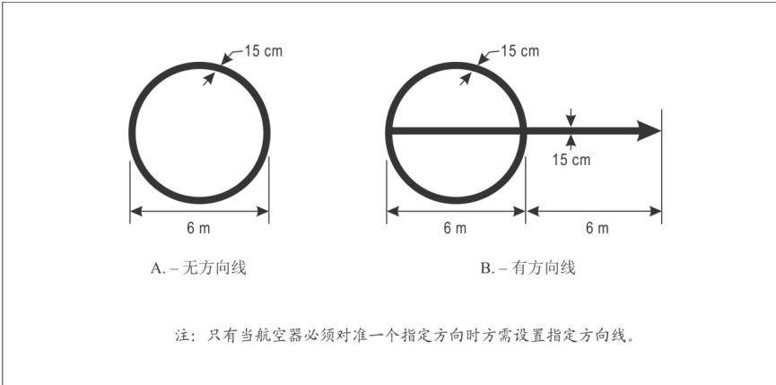

图5-9VOR机场校准点标志

5.2.12.6建议：VOR机场校准点标志最好为白色，但应区别于滑行道标志的颜色。

注：为使对比明显，标志可用黑色镶边。

#### 5.2.13 航空器机位标志

注：关于规划机位标志的指导材料载于《机场设计手册》（Doc9157号文件）第4部分。

应用

5.2.13.1建议：在有铺筑面的机坪和除冰/防冰设施上指定的停放位置应设机位标志。

## 位置

5.2.13.2建议：在有铺筑面的机坪和除冰/防冰设施上设置的机位标志的定位应能保证当航空器以前轮沿该标志滑行时能分别保持3.13.6和3.15.9规定的净距。

特性

5.2.13.3建议：机位标志应根据机位构形和辅助其他停机设施的需要设置机位识别标志、引入线、转弯开始线、转弯线、对准线、停止线和引出线。

5.2.13.4建议：机位识别标志（字母和/或数字）应设在引入线起端后一小段距离处。识别标志的高度应足以从使用该机位的航空器驾驶舱内看得清楚。

5.2.13.5建议：为了能更加灵活地使用机坪，在将两组机位标志重叠设置以致难以辨认应当跟随哪一组标志，或者如果跟随了错误的标志可能危及安全时，应在各组的机位识别标志中分别增加其适用的机型识别符号。

注：例如2A-B747，2B-F28。

5.2.13.6建议：引入线、转弯线和引出线一般应为连续的，线条宽度不小于15cm。在有几组机位标志重叠在一处时，机位要求最严格的航空器的机位标志线应为连续线，其余航空器的机位标志线则应为断续线。

5.2.13.7建议：引入线、转弯线和引出线的转弯半径应适用于准备使用这些标志的要求最严格的航空器。

5.2.13.8建议：在准备让航空器只沿着一个方向前进时，应在引入线和引出线上增加行进方向的箭头。

5.2.13.9建议：开始转弯线应设在对正即将开始转弯的航空器左座驾驶员位置，与引入线成直角。其长度和宽度应分别不小于6m和15cm，并包括一个指明转弯方向的箭头。

注：考虑到驾驶员的视野，开始转弯线与引入线之间应保持的距离可能因航空器型号而异。

5.2.13.10建议：如果需要一条以上的开始转弯线和/或停止线，应将它们分别编码。

5.2.13.11建议：对准线应设置得与停放在规定位置的航空器的中线延长线相重合，并使能被正在停机操作的最后阶段中的驾驶员看得见。其宽度应不小于15cm。

5.2.13.12建议：停止线应设在对正位于拟定的停止点上的左座驾驶员座席的位置并与对准线成直角。其长度和宽度应分别不小于6m和15cm。

注：考虑到驾驶员的视野，停止线与引入线之间应保持的距离可能因航空器型号而异。

#### 5.2.14 机坪安全线

注：有关机坪安全线的指导材料载于《机场设计手册》（Doc9157号文件）第4部分。

应用

5.2.14.1建议：在有铺筑面的机坪上应根据航空器停放布局和地面设施的需要设置机坪安全线。

位置

5.2.14.2机坪安全线必须设置得使其能划定出供车辆和其他为航空器服务的设备等使用的地区范围，以保持其与航空器隔开的安全距离。

特性

5.2.14.3建议：机坪安全线应视停放航空器的布局和地面设施的需要，包括诸如翼尖净距线和服务道路边界线等部分。

5.2.14.4建议：机坪安全线应为宽度至少为10cm的连续实线。

#### 5.2.15 道路等待位置标志

应用

5.2.15.1在所有道路进入跑道处必须设置道路等待位置标志。

位置

5.2.15.2道路等待位置标志必须横过道路，设置在等待位置上。

特性

5.2.15.3道路等待位置标志必须符合当地的道路交通规则。

#### 5.2.16 强制性指令标志

注：关于强制性指令标志的指导材料载于《机场设计手册》（Doc9157号文件）第4部分。

应用

5.2.16.1在实际上无法按照5.4.2.1安装强制性指令标记牌时，必须在铺筑面上设置强制性指令标志。

5.2.16.2建议：在运行上需要时，例如在宽度超过60m的滑行道上，或为协助防止跑道侵入，应设置强制性指令标志对强制性指令标记牌加以补充。

位置

5.2.16.3基准代码为A、B、C和D时，滑行道上的强制性指令标志必须如图5-10（A）所示以滑行道中线为中心等距离地横设在滑行道上，并设在跑道等待位置标志的等待一侧。标志的最近边缘至跑道等待位置标志或滑行道中线标志的距离必须不小于1m。

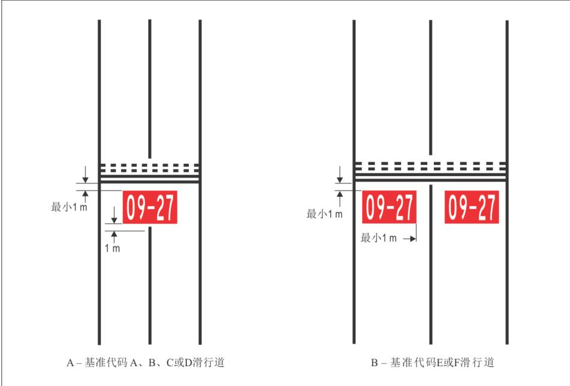

图5-10强制性指令标志

5.2.16.4基准代码为E或F时，滑行道上的强制性指令标志必须如图5-10（B）所示设在滑行道中线标志的两侧和跑道等待位置标志的等待一侧。标志的最近边缘至跑道等待位置标志或滑行道中线标志的距离必须不小于1m。

5.2.16.5建议：除非运行上需要，强制性指令标志不应设在跑道上。

## 特性

5.2.16.6强制性指令标志必须为红底白字。除“禁止进入”标志外，白色字符必须提供与相关的标记牌相同的信息。

5.2.16.7“禁止进入”标志应为白色的“禁止进入”字样书写在红色的底色上。

5.2.16.8如果标志与铺筑面表面的颜色反差不足，必须在强制性指令标志的周边加上适当颜色的边框，最好为白色或黑色。

5.2.16.9建议：基准代码为C、D、E和F的字符，字符高度应为4m，基准代码为A和B时，高度应为2m。字符的形状和比例应如附录3所示。

5.2.16.10建议：标志的底色应为长方形，并应在横向和垂直方向从字符的最突出部分向外扩展至少0.5m。

#### 5.2.17 信息标志

注：关于信息标志的指导材料载于《机场设计手册》（Doc9157号文件）第4部分。

## 应用

5.2.17.1在通常要求设置信息标记牌而根据有关当局的决定，实际上又无法安装时，必须在道面的表面上设置信息标志。

5.2.17.2建议：在运行上需要时，信息标记牌应用信息标志作为补充。

5.2.17.3建议：在复杂的滑行道交叉处的前面和后面应设置一个信息（位置/方向）标志，而且在运行经验表明增设一个滑行道位置标志可能有助于飞行机组地面滑行之处也应设置这样的标志。

5.2.17.4建议：应沿很长的滑行道全长，以有规律的间距在铺筑面上设置一个信息（位置）标志。

位置

5.2.17.5建议：当需要时，应横过滑行道或机坪表面设置信息标志，其位置应使在趋近的航空器的座舱内能看清楚。

特性

5.2.17.6信息标志必须包括：

a）在黑色底色上的黄色字符（当其替代或补充位置标记牌时）；

b）在黄色底色上的黑色字符（当其替代或补充方向标记牌或目的地标记牌时）。

5.2.17.7在标志底色与铺筑面表面的颜色反差不足时，标志必须包括：

a）黑色边框（当字符为黑色时）；

b）黄色边框（当字符为黄色时）。

5.2.17.8．建议：字符的高度应为4m。字符形状和比例应如附录3所示。

### 5.3 灯光

#### 5.3.1 概述

## 可能危及航空器安全的灯光

5.3.1.1机场附近可能危及航空器安全的非航空地面灯必须予以熄灭、遮蔽或改装，以消除危险的来源。

## 可能危及航空器安全的激光发射

5.3.1.2建议：为了防止航空器的安全受到激光发射器的有害影响，应环绕机场建立以下保护区：

一无激光束飞行区（LFFZ）

—激光束临界飞行区（LCFZ）

—激光束敏感飞行区（LSFZ）

注1：可使用图5-11、5-12和5-13来确定足以保护飞行运行的暴露水平和各项距离。

注2：在三个飞行保护区（无激光束飞行区、激光束临界飞行区和激光束敏感飞行区）内限制使用激光束，指的只是可见激光束，不包括由有关当局以不影响飞行安全的方式运行的激光发射器。在所有可航行的空域内，任何激光束（可见的或不可见的）的辐照度水平均应小于或等于最大容许照射量（MPE），除非已经将这种发射通报了有关当局并获得许可。

注3：建立飞行保护区是为了减轻在机场附近运行激光发射器的危险。

注4：关于如何保护飞行运行免受激光发射器的有害影响的更多指导，见《激光发射器与飞行安全手册》（Doc9815号文件)。

注5：另见附件11一《空中交通服务》第2章。

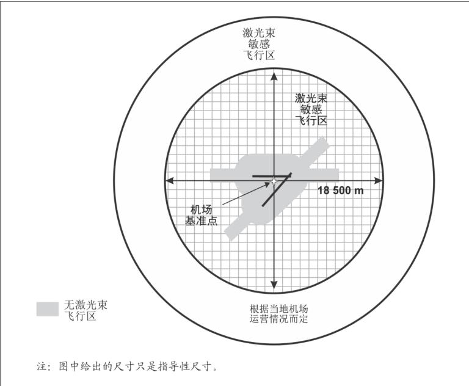

图5-11飞行保护区

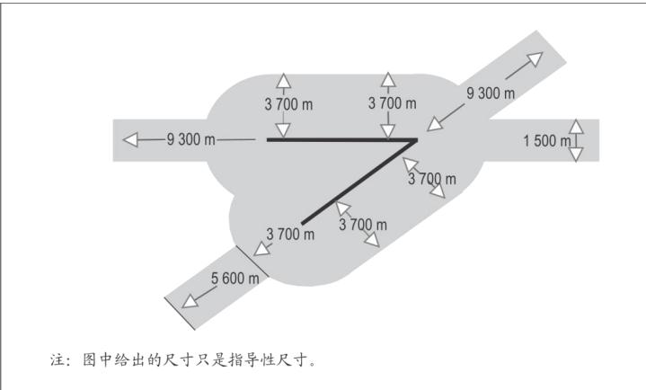

图5-12多跑道无激光束飞行保护区

飞行保护区标高

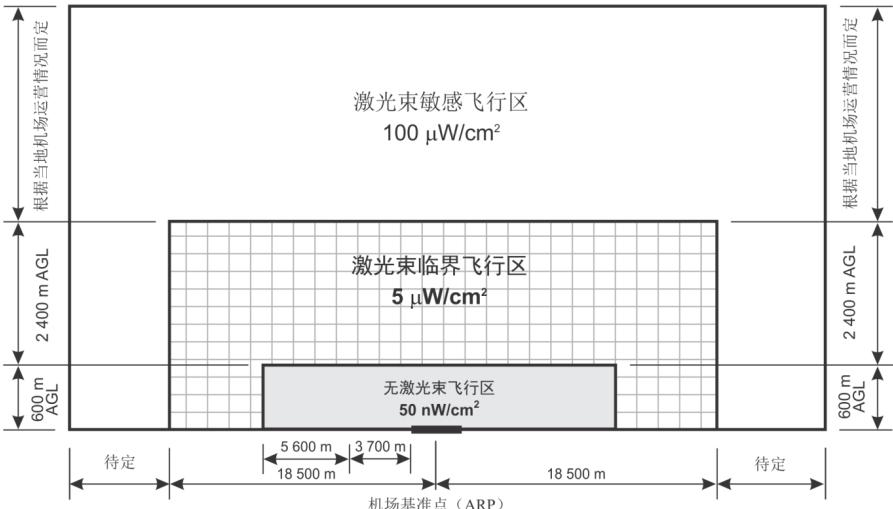

图5-13标有可见激光束最大辐照度水平的飞行保护区

## 可能引起混淆的灯光

5.3.1.3建议：非航空地面灯凡由于其光强、构形或颜色可能会妨碍或混淆对地面航空灯的明确理解的，应予熄灭、遮蔽或改装，以消除这种可能性。对于下述地区内的能从空中看到的非航空地面灯，应特别加以注意：

a 基准代码为4的仪表跑道：

从跑道入口和从跑道末端向外延伸到至少4500m范围以内、跑道中线延长线两侧各750m宽的地区内。

b）基准代码为2或3的仪表跑道：

同a)，仅其长度应至少为3000m。

c）基准代码为1的仪表跑道和非仪表跑道：

进近区内。

可能对海员引起混淆的航空地面灯

注：在航空地面灯接近通航水域的情况下，需考虑保证这种灯光不致对海员引起混淆。

## 灯具及其支柱

注：有关在运行场地上的设备和装置的定位的资料，见9.9。关于灯具及其支柱的易折性的指导材料，见《机场设计手册》（Doc9157号文件）第6部分。

## 立式进近灯具

5.3.1.4立式进近灯具及其支柱必须为易折的，只有进近灯光系统距离跑道入口300m以外部分允许：

a）在支柱高度超过12m时，只要求顶端的12m部分必须为易折的，

b）在支柱周围被非易折的物体围绕时，只有高出周围物体的支柱部分必须是易折的。

5.3.1.5当进近灯具或其支柱本身不足够明显时，必须适当地加以标志。

## 立式灯具

5.3.1.6跑道、停止道和滑行道上的立式灯具必须是易折的。其高度必须低到足以与螺旋桨以及喷气航空器的发动机吊舱之间保持必要的净距。

## 嵌入式灯具

5.3.1.7嵌入跑道、停止道、滑行道和机坪表面的灯具必须设计和安装得能承受航空器轮子的压力，不使航空器或灯具本身受到损坏。

5.3.1.8建议：在安装的嵌入式灯具与飞机轮胎接触处，由于热传导和热辐射所产生的温度在接触持续10分钟的时间内应不超过160℃。

注：关于测量嵌入式灯具温度的指导材料，见《机场设计手册》（Doc9157号文件）第4部分。

## 光强和控制

注：在薄暮中或昼间低能见度条件下，灯光能比标志更为有效。在这种情况下或在夜间低能见度时，灯具必须有足够的光强才能有效。为了达到必要的光强，通常必须使灯光具有方向性。在这种情况下，灯光照射的角度范围必须足够大而且必须按照飞行要求定向。跑道灯光系统必须作为一个整体来考虑，以保证各部分相对光强配合适当、达到同一个目标（见附篇A，第15节及《机场设计手册》（Doc9157号文件）第4部分）。

5.3.1.9跑道灯光的光强必须足以适应准备使用跑道时的最低能见度和跑道周围灯光的情况；当设有进近灯光系统时，跑道灯光的光强必须与最近一段的进近灯光的光强配合适当。

注：由于进近灯光系统的灯具的光强可能比跑道灯光的光强大，最好还是要避免光强的突然变化，因为这种变化会使驾驶员产生一种在进近过程中能见度正在变化的错觉。

5.3.1.10在设有高光强灯光系统时，必须设置适当的光强控制设备以便调节光强来适应现场情况。必须具有分设的光强控制设备或其他适当的方法来保证当装有下列各项灯光系统时能以相互协调的光强运行：

一进近灯光系统；

一跑道边灯；

一跑道入口灯；

跑道末端灯；

—跑道中线灯；

跑道接地带灯；和

一滑行道中线灯。

5.3.1.11在附录2图A2-1至A2-10中规定的灯具主光束的椭圆之内及其边线上的最大光强值不得大于按附录2图A2-1至A2-11和A2-26的总说明注2的规定测定的最小光强值的3倍。

5.3.1.12在附录2图A2-12至A2-20中规定的灯具主光束的长方形之内及其边线上的最大光强值不得大于按附录2图A2-12至A2-21的总说明注2的规定测定的最小光强值的3倍。

#### 5.3.2 应急灯光

应用

5.3.2.1建议：在设有跑道灯光而没有备用电源的机场内，应备有足够的应急灯光设备，以便在正规灯光系统失效的情况下能够方便地将其至少安装在主跑道上。

注：应急灯光对于标志障碍物或勾画出滑行道和机坪的轮廓可能也是有用的。

位置

5.3.2.2建议：当安装在跑道上时，应急灯光至少应与非仪表跑道所需要的构形一致。

特性

5.3.2.3建议：应急灯光的颜色应符合跑道灯光的颜色要求，只有在跑道入口和末端设置颜色灯不实际可行的情况下，全部灯光可用可变白色或尽实际可行地接近可变白色。

#### 5.3.3 航空灯标

应用

5.3.3.1准备夜间使用的每个机场，在运行需要的场合必须设置机场灯标或识别灯标。

5.3.3.2运行要求的确定必须考虑使用该机场的空中交通的要求、机场的特征与其周围环境对比的明显性以及有助于确定机场位置的其他目视和非目视助航设施的设置等因素。

## 机场灯标

5.3.3.3准备夜间使用的机场如果存在下列一个或几个条件时必须设置机场灯标：

a)飞机主要以目视方式飞行；

b)经常出现低能见度；或

c)由于周围灯光或地形难以从空中确定机场位置。

## 位置

5.3.3.4机场灯标必须设在机场内或机场邻近环境背景亮度低的地方。

5.3.3.5建议：灯标的位置应选择得使其在各重要方向上不被物体遮蔽，并对进近着陆中的驾驶员不产生眩光。

## 特性

5.3.3.6机场灯标必须显示有色与白色交替的闪光或仅显示白色的闪光。总的闪光频率必须为每分钟20次至30次。在使用有色闪光的场合，陆地机场灯标发出的有色闪光必须为绿色，水上机场灯标发出的有色闪光必须为黄色。水陆两用机场如用有色闪光，必须根据机场的哪一部分是主要设施来确定闪光的颜色。

5.3.3.7灯标发出的灯光必须在所有的方位角都能看得到。灯光的垂直分布必须从不大于1°的仰角向上扩展到由有关当局确定的足以在准备使用灯标的最大仰角上提供引导的仰角，而且闪光的有效光强必须不小于2000cd。

注：在不能避免高环境背景亮度的地点，闪光灯的有效光强可能需要增大最多到10倍。

识别灯标

应用

5.3.3.8供夜间使用而且从空中用其他方法不易识别的机场，必须设置识别灯标。

位置

5.3.3.9识别灯标必须设在机场内的低环境背景亮度的地区。

5.3.3.10建议：灯标的位置应使灯标在各重要方向上不被物体遮蔽，并对进近着陆的驾驶员不产生眩光。

特性

5.3.3.11陆地机场的识别灯标必须在所有方位角上显示。灯光的垂直分布必须从不大于1°的仰角向上扩展至由有关当局确定的足以在准备使用灯标的最大仰角上提供引导的仰角，而且闪光的有效光强必须不小于2000cd。

注：在不能避免高环境背景亮度的地点，闪光灯的有效光强可能需要增大最多到10倍。

5.3.3.12陆地机场的识别灯标必须显示绿色闪光，而水上机场的识别灯标则必须显示黄色闪光。

5.3.3.13识别字母必须以国际莫尔斯电码传送。

5.3.3.14建议：传送速度应为每分钟6至8个字，相应的莫尔斯电码中“点”的持续时间为每个“点”0.15秒至0.2秒。

#### 5.3.4 进近灯光系统

应用

5.3.4.1应用

A.非仪表跑道

建议：在实际可行时，准备供夜间使用的基准代码为3或4的非仪表跑道应设置符合5.3.4.2至5.3.4.9所规定的简易进近灯光系统，但当该跑道仅供能见度良好时使用并有其他目视助航设施提供足够引导时可以不设。

注：简易进近灯光系统也能在昼间提供目视引导。

### B.非精密进近跑道

在实际可行的情况下，准备供夜间使用的非精密进近跑道必须设置符合5.3.4.2至5.3.4.9所规定的简易进近灯光系统，但当该跑道仅供能见度良好时使用或有其他目视助航设施提供足够引导时可以不设。

注：最好考虑设置|类精密进近灯光系统或加装跑道引入灯光系统。

### C.I类精密进近跑道

在实际可行的情况下，I类精密进近跑道必须设置符合5.3.4.10至5.3.4.21所规定的I类进近灯光系统。

D.I类和IⅢ类精密进近跑道

Ⅱ类或类精密进近跑道必须设置符合5.3.4.22至5.3.4.39所规定的I/II类进近灯光系统。

## 简易进近灯光系统

## 位置

5.3.4.2简易进近灯光系统必须由一行位于跑道中线延长线上并尽可能延伸到距跑道入口不小于420m处的灯具和一排在距跑道入口300m处构成一个长18m或30m的横排灯的灯具组成。

5.3.4.3构成横排灯的灯具必须设置在一条尽实际可行地接近水平的直线上，垂直于中线灯线并被其平分。横排灯的灯具必须布置得能够产生一种直线效果，只有当采用30m的横排灯时可在中线两侧各留一个空隙。这种空隙必须保持在最小值，以满足当地要求，并不得大于6m。

注1：现在采用的横排灯的灯间距在1m至4m之间。中线两侧的空隙可能改善当进近中有横向误差时的方向性引导，并便于救援与消防车辆的通行。

注2：有关安装的容差的指导材料，见附篇A第11节。

5.3.4.4构成中线的灯具的纵向间距必须为60m，只有在需要改善引导作用时可采用30m的间距。最靠里的灯必须根据选用的中线灯的纵向间距设在距跑道入口60m或30m处。

5.3.4.5建议：如实际上不可能把中线灯延伸到距离跑道入口420m处，则应延伸到300m处以包括横排灯。如果这一距离也不可能，则应将中线灯尽实际可行地向外延伸，并将中线灯改为由至少3m长的短排灯组成。在进近灯光系统距跑道入口300m处有横排灯的情况下，可在距入口150m处增设一组横排灯。

5.3.4.6本系统必须尽实际可行地处于通过跑道入口的水平面上，条件是：

a)在距系统的中线60m范围内除仪表着陆系统或微波着陆系统的方位天线外必须没有物体突出于进近灯的平面之上：和

灯光被遮挡。

任何仪表着陆系统或微波着陆系统的方位天线突出于灯光平面之上的，必须把它们作为障碍物看待，并相应地加以标志和照明。

## 特性

5.3.4.7简易进近灯光系统的灯具必须是恒定发光灯，灯光颜色必须易于与其他航空地面灯以及可能存在的外界灯光区别开来。每一中线灯必须为：

a)一个单灯；或

b）至少为3m长的短排灯。

注1：当b）中所述短排灯是由近似点光源的灯组成时，短排灯内1.5m的灯间距业经证明是合用的。

注2：如果预计简易进近灯光系统将发展成为精密进近灯光系统，最好采用4m长的短排灯。

注3：在因周围灯光使简易进近灯光系统难于在夜间识别的地方，在该系统的靠外部分加装顺序闪光灯可能解决此问题。

5.3.4.8建议：用于非仪表跑道的灯具应在对于处在第四边和最后进近中的驾驶员所必需的所有方位角上发光。灯光的光强应在据以设置该系统的各种能见度和周围灯光条件下都是足够的。

5.3.4.9建议：用于非精密进近跑道的灯光应在对于处在最后进近中而不过分偏离非目视助航设施规定的航道的航空器的驾驶员所必需的所有方位角上发光。灯光应设计得无论日夜在准备使用该系统的最不利的能见度和周围灯光条件下都能提供引导。

## I 类精密进近灯光系统

## 位置

5.3.4.10I类精密进近灯光系统必须由一行位于跑道中线延长线上并尽可能延伸到距跑道入口900m处的灯和一排在距跑道入口300m处构成一个长30m的横排灯的灯具组成。

注：长度不足900m的进近灯光系统可能会使跑道的使用受到运行上的限制，见附篇A第11节。

5.3.4.11构成横排灯的灯具必须设置在一条尽可能接近水平的直线上，垂直于中线灯线并被其平分。横排灯的灯具间隔必须布置得能够产生一种直线效果，只有在中线两侧可以各留一个空隙。这种空隙必须保持在最小值，以满足当地要求，每个空隙不得大于6m。

注1：现在采用的横排灯的灯间距在1m至4tn之间。中线两侧的空隙可能改善进近出现横向误差时的方向引导，并便于救援与消防车辆的通行。

注2：关于安装容差的指导材料，见附篇A第11节。

5.3.4.12构成中线的灯具的纵向间距必须为30m，最靠里的灯位于离跑道入口30m处。

5.3.4.13本系统必须尽实际可行地处于通过跑道入口的水平面上，条件是：

a)在距系统中线60m范围内除仪表着陆系统或微波着陆系统的方位天线外，必须没有物体突出于进近灯的平面之上；和

b）除位于横排灯或中线短排灯的中部（不是它们的端部）的灯外，从进近中的航空器看去必须没有灯光被遮挡。

突出于灯光平面之上的任何仪表着陆系统或微波着陆系统的方位天线必须视为障碍物，并须相应地加以标志和照明。

特性

5.3.4.14I类精密进近灯光系统的中线和横排灯灯具必须是发可变白光的恒定发光灯。每一中线灯必须为：

a）在中线的最里面300m部分为单灯光源，在中线的中间300m部分为双灯光源，在中线的外端300m 部分为三灯光源，用以提供距离信息：或

b)短排灯。

5.3.4.15当能够证明10.5.10中规定作为维护目标的进近灯光系统灯具的可用性水平可以达到时，在每一中线灯位置上可以是：

a）单灯；或

b）短排灯。

5.3.4.16短排灯的长度必须至少为4m。在短排灯是由近似点光源组成时，灯具必须等距设置，间距不大于1.5m。

5.3.4.17建议：如果中线灯由5.3.4.14b)或5.3.4.15b)所述的短排灯组成，每一短排灯应附加一个闪光灯，仅当在考虑了这种灯光系统的特性和气象条件的性质后认为无此必要时可以不加。

5.3.4.185.3.4.17中所述的每个闪光灯必须每秒闪光两次，从最外端的灯向着入口逐个顺序闪光直到系统中最里面的灯。电路设计必须使得放电灯能与进近灯光系统中的其他灯具分别运行。

5.3.4.19如果中线灯是由5.3.4.14a）或5.3.4.15a）中所述的灯具组成，除在距跑道入口300m处设置的横排灯外，还须在距入口150m、450m、600m和750m处增设横排灯。构成每一横排的灯具必须尽实际可行地设置在一条接近水平的直线上，垂直于中线灯线并被其平分。这些灯的间隔必须布置得能够产生一种直线效果，只有在中线两侧可以各留一个空隙。这种空隙必须保持在最小值，以满足当地要求，每个空隙不得大于6m。

注：有关灯具布置的细节，见附篇A第11节。

5.3.4.20当在系统内设有5.3.4.19中要求增设的横排灯时，各横排灯的外端必须位于两条平行于中线灯线或逐渐向内收敛并在跑道入口以内300m处与跑道中线会聚的直线上。

5.3.4.21灯具必须符合附录2图A2-1的规定。

注：用于设计这些灯具的飞行轨迹包络面，见附篇A图A-6。

## Ⅱ类和Ⅲ类精密进近灯光系统

## 位置

5.3.4.22进近灯光系统必须由一行位于跑道中线延长线上并尽可能延伸到距跑道入口900m处的灯具组成。此外，本系统还必须有两行延伸到距跑道入口270m处的侧边灯以及两排横排灯，一排在距入口150m处，另一排在距入口300m处，如图5-14所示。当能够证明10.5.7中规定作为维护目标的进近灯光系统灯具的可用性水平可以达到时，系统可设两行延伸到距跑道入口240m处的侧边灯和两排横排灯，一排在距跑道入口150m处，另一排在距跑道入口300m处，如图5-15所示。

注：900m的长度是按在I、Ⅱ和Ⅲ类条件下为飞行提供引导的要求确定的。缩短的长度可能支持Ⅱ类和Ⅲ类运行，但I类运行可能要受到限制。见附篇A第11节。

5.3.4.23构成中线灯的灯具的纵向间距必须为30m，最靠里的灯位于距跑道入口30m处。

5.3.4.24侧边灯的灯具必须位于中线的两侧，其纵向间距与中线灯的纵向间距相同，第一个短排灯设于距入口30m处。当能够证明10.5.7中规定作为维护目标的进近灯光系统灯具的可用性水平可以达到时，侧边灯的灯具可以60m的纵向间距设在中线的两侧，并将第一排侧边灯设置在距入口60m处。两行侧边灯最靠近中线的灯具之间的横向间距必须不小于18m，也不大于22.5m，而以18m为好，但在任何情况下它必须与接地带灯的横向间距相同。

5.3.4.25设在距跑道入口150m处的横排灯必须填满中线灯与侧边灯之间的空隙。

5.3.4.26设在距跑道入口300m处的横排灯必须自中线向两侧各伸出15m 

5.3.4.27如果距跑道入口300m以外的中线灯是由5.3.4.31b)或5.3.4.32b）所述的灯组成的，必须在距入口450m、600m和750m处增设横排灯。

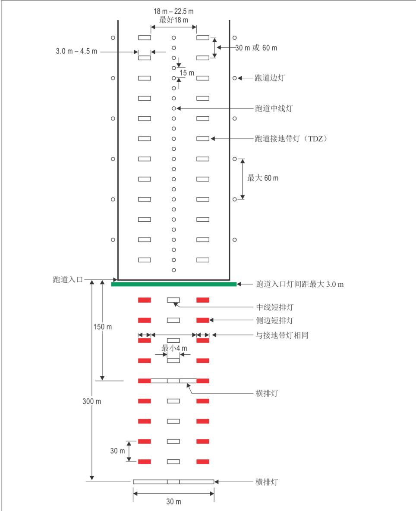

图5-14IⅡ类和IⅢ类精密进近跑道的内端300m的进近灯光和跑道灯光

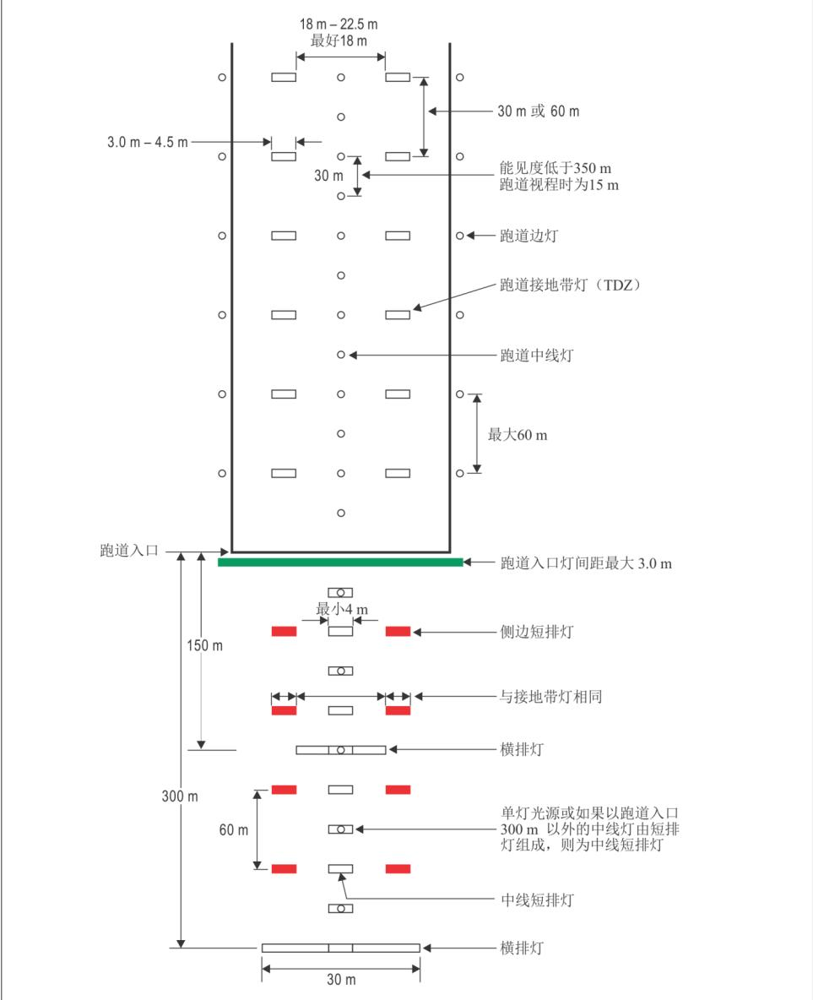

图5-155当能够证明第10章规定作为维护目标的灯具可用性水平可以达到的

ⅡI类和Ⅲ类精密进近跑道内端300m的进近灯光和跑道灯光

5.3.4.28当在系统内设有5.3.4.27中规定增设的横排灯时，各横排灯的外端必须位于两条平行于中线或逐渐向内收敛在跑道入口以内300m处与跑道中线会聚的直线上。

5.3.4.29本系统必须尽实际可行地处于通过跑道入口的水平面上，条件是：

近灯的平面之上：和

光被遮挡。

突出于灯光平面之上的任何仪表着陆系统或微波着陆系统的方位天线必须视为障碍物，并须相应地加以标志和照明。

## 特性

5.3.4.30I/III类精密进近灯光系统距跑道入口第一个300m部分的中线灯必须由发可变白光的短排灯组成，只有当跑道入口内移300m或更多时，这部分中线灯才可由发可变白光的单灯组成。当能够证明10.5.7中规定作为维护目标的进近灯光系统灯具的可用性水平可以达到时，I/III类精密进近灯光系统靠近跑道入口第一个300m部分的中线灯可由下述形式的灯具组成：

a)短排灯，如果距跑道入口300m以外的中线灯是由5.3.4.32a）所述的短排灯组成的；或

b）短排灯与单灯相间，如果距跑道入口300m以外的中线灯是由5.3.4.32b）所述的单灯组成的，最靠里的单灯位于距跑道入口30m处，最靠里的短排灯位于距跑道入口60m处：或

c）单灯，如果跑道入口内移300m或更多。

以上所有灯具都必须发可变白光。

5.3.4.31距跑道入口300m以外的每一中线灯必须是：

a)与内端300m部分相同的短排灯；或

b）在中线的中间300m部分为双灯光源，在中线的外端300m部分为三灯光源。

以上所有灯都必须发可变白光。

5.3.4.32当能够证明10.5.7中规定作为维护目标的进近灯光系统灯具的可用性水平可以达到时，距跑道入口300m以外的每一中线灯可由下述形式的灯组成：

a）短排灯；或

b）单灯。

以上所有灯具都必须发可变白光。

5.3.4.33短排灯的长度必须至少为4m。在短排灯是由近似点光源组成时，灯具必须等距设置，间距不大于1.5m。

5.3.4.34建议：如果中线灯是由5.3.4.31a)或5.3.4.32a)所述的短排灯组成的，每一距跑道入口300m以外的短排灯应附加一个闪光灯，只有在考虑了灯光系统的特性和气象条件的性质以后认为无必要时才可以不加。

5.3.4.355.3.4.34中所述的每个闪光灯必须每秒闪光两次，从最外端的灯向着入口逐个顺序闪光直到系统中最里面的灯。电路设计必须使得放电灯能与进近灯光系统中其他的灯分别运行。

5.3.4.36侧边灯必须由发红光的短排灯组成。每一侧边短排灯的长度和灯的间距必须与接地带灯的短排灯长度和间距相同。

5.3.4.37构成横排灯的灯具必须为发可变白光的恒定发光灯。灯具必须以不大于2.7m的间距均匀布置。

5.3.4.38红色光灯具的光强必须与白色光灯具的光强相协调。

5.3.4.39灯具必须符合附录2图A2-1和A2-2的规定。

注：用于设计这些灯具的飞行轨迹包络面，见附篇A图A-6。

#### 5.3.5 目视进近坡度指示系统

应用

5.3.5.1在存在下列一种或几种情况下，无论跑道是否设有其他目视助航设施或非目视助航设施，必须设置目视进近坡度指示系统，以引导飞机向跑道进近：

a）供涡轮喷气飞机或有类似进近引导要求的飞机使用的跑道；

b）任何类型飞机的驾驶员由于下述情况可能在进近中感到难于判断：

1)目视引导不充分，诸如昼间飞在水面之上或没有特征的陆地上空或夜间飞在进近地区内没有足够的外界灯光等情况下进近时所遇到的情况：或者

2)）容易引起误解的信息，诸如由于迷惑人的地形或跑道坡度所产生的信息：

c)在进近地区内存在物体，如果飞机低于正常进近航道下降时可能引起严重的危险，特别是在没有非目视或其他目视助航设施能发出有这些物体存在的警告时：

d)跑道任何一端的具体情况在发生飞机过早接地或冲出跑道的情况下会导致严重的危险；

e）地形或经常的气象条件使飞机在进近中可能经受到异常的湍流。

注：关于安装目视进近坡度指示系统的优先次序的指导材料载于附篇A第12节。

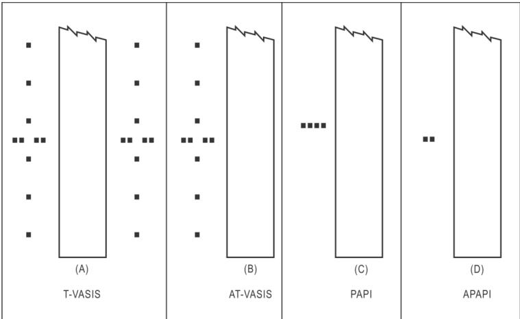

图5-16各种目视进近坡度指示系统

##### 5.3.5.2 标准的目视进近坡度指示系统必须为如图5-16中所示的下列几种：

a)符合5.3.5.7至5.3.5.23规定的T式目视进近坡度指示系统（T-VASIS）和简化T式目视进近坡度指示系统（AT-VASIS);

b）符合5.3.5.24至5.3.5.41所规定的精密进近航道指示器(PAPI)和简化精密进近航道指示器(APAPI)。如图5-16所示

5.3.5.3当存在5.3.5.1中规定的一种或几种情况、基准代码为3或4时，必须设置PAPI、T-VASIS或AT-VASIS。

5.3.5.4建议：自2020年1月1日起，应停止将T-VASIS和AT-VASIS作为标准目视进近坡度指示系统使用。

5.3.5.5当存在5.3.5.1中规定的一种或几种情况、基准代码为1或2时，必须设置PAPI或APAPI。

5.3.5.6建议：当跑道入口是从正常位置临时位移，并存在5.3.5.1中规定的一种或几种情况时，应设置PAPI；仅当基准代码为1或2时才可设置APAPI。

## T-VASIS和AT-VASIS 

## 说明

5.3.5.7T-VASIS必须由对称地布置在跑道中线两侧的20个灯具组成，每侧包括两个由4个灯组成的翼排灯和在翼排灯纵向等分线上的6个灯具，如图5-17所示。

5.3.5.8AT-VASIS必须由布置在跑道一侧的10个灯具组成，包括一个由4个灯组成的翼排灯和在翼排灯纵向等分线上的6个灯具。

##### 5.3.5.9 灯具的构造和布置必须使在进近中的飞机驾驶员将：

a)当其在进近坡之上时，看到翼排灯是白色，以及1、2或3个“飞低些”灯。驾驶员高于进近坡之上越多，看到“飞低些”灯数就越多；

b）当其正在进近坡上时，看到翼排灯是白色；

c)当其低于进近坡时，看到的翼排灯和1、2和3个“飞高些”灯都是白色，驾驶员低于进近坡越多，看到的“飞高些”灯数就越多。当其低于进近坡很多时，看到的翼排灯和3个“飞高些”灯都是红色。

当正在进近坡上或高于进近坡时，必须看不到“飞高些”灯光；当正在进近坡上或低于进近坡时，必须看不到“飞低些”灯光。

## 定位

5.3.5.10灯具必须按图5-17定位，同时符合图中给出的安装容差要求。

注：对于3°的进近坡和15m的眼睛高出跑道入口的标称高度（见5.3.5.7和5.3.5.20)，T-VASIS将为仅看见翼排灯的驾驶员提供高出13m至17m的眼睛至入口高度。如需增大在跑道入口处的眼高（为了提供足够的轮子净距），则可用看到一个或更多“飞低些”灯来做进近飞行。这样，驾驶员高出跑道入口的眼高将如下：

看到翼排灯和一个“飞低些”灯17~22m 

看到翼排灯和两个“飞低些”灯22~28m 

看到翼排灯和三个“飞低些”灯28~54m。

## 灯具的特性

5.3.5.11灯光系统必须适合于昼间和夜间运行。

5.3.5.12每一灯具的光束分布必须是扇形，在进近方向的一个相当宽的方位角范围内发光。翼排灯灯具必须在垂直角1°54′至6°范围内发出白色光束，在垂直角0°至1°54′范围内发出红色光束。“飞低些”灯必须在仰角6°到约为进近坡度角之间发出白色光束，在进近坡度角处突然截光。“飞高些”灯必须在垂直角约为进近坡度角至1°54′的范围内发出白色光束，在垂直角1°54以下发出红色光束。翼排灯和“飞高些”灯的红色光束的顶部的垂直角可以适当增大以符合5.3.5.22的要求。

5.3.5.13“低飞些”灯、翼排灯和“飞高些”灯的光强分布必须如附录2图A2-22所示。

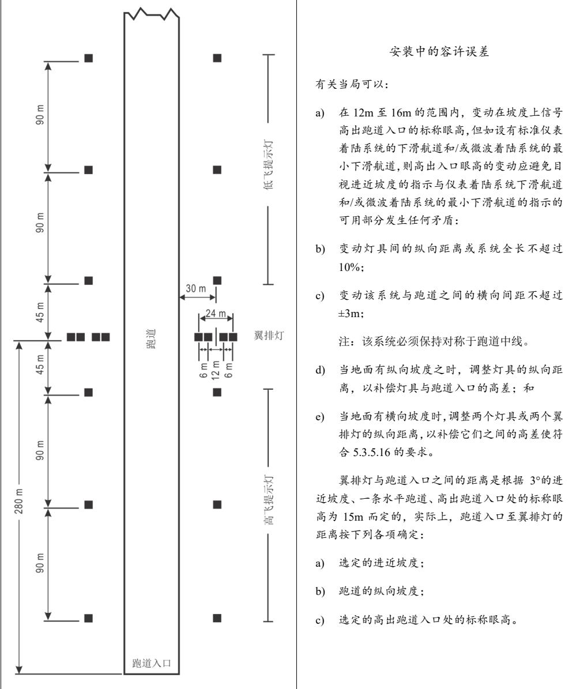

图5-17T-VASIS灯具的定位

5.3.5.14在垂直面上，从红色到白色的过渡在一个距离不少于300m远处的观察者看来必须是发生在不大于15的垂直角内。

5.3.5.15在满光强时红光的Y坐标值不得超过0.320。

5.3.5.16必须设置合适的光强调节设备，以便调节光强来适应当时的情况并避免使驾驶员在进近和着陆中感到眩目。

5.3.5.17构成翼排灯的灯具或配对的“飞高些”灯或“飞低些”灯的灯具必须安装得使在进近中的飞机驾驶员看来基本上是成对地各在一条水平线上。灯具必须装得尽可能低而且必须是易折的。

5.3.5.18灯具必须设计得在透光或反光面上的凝结水、尘土等对灯光信号的干扰减到尽可能小的程度，并绝对不影响光束的仰角或红色与白色信号之间的对比。在预计会遇到下雪或结冰的地方，灯具的构造必须使出光缝被冰雪全部或部分堵塞的可能性减至最小。

## 进近坡和光束的仰角调置

5.3.5.19进近坡度必须适合于使用该进近方向的飞机。

5.3.5.20当设置T-VASIS的跑道装有ILS和/或MLS时，灯具的位置和仰角必须使目视进近坡与ILS的下滑航道和/或MLS的最小下滑航道尽可能地相符。

5.3.5.21跑道两侧翼排灯灯具的光束仰角必须相同。最靠近每组翼排灯的“飞高些”灯具的光束顶部的仰角必须与最靠近每组翼排灯的“飞低些”灯具的光束底部的仰角相同，并与进近坡相符。其余“飞高些”灯具的光束顶部的截止角必须按离开翼排灯的距离由近及远地依次递减5’角度。其余“飞低些”灯具的光束底部的进入角必须按离开翼排灯的距离由近及远地依次递增7′角度（见图5-18）。

5.3.5.22翼排灯和“飞高些”灯具的红色光束顶部的仰角调置必须使得在进近过程中飞机驾驶员看到翼排灯和三个“飞高些”灯具时，只要看不见任何一个灯具的光束是红色的就会对进近区内的所有物体保持安全净距。

5.3.5.23在发现有一位于系统的障碍物保护面之外但在系统光束的横向界限以内的物体伸出于障碍物保护面之上，而且航空研究表明该物体对飞机安全会有不利影响时，必须适当地限制光束的方位角扩散范围，使该物体保持在光束范围之外。

注：关于有关的障碍物保护面，见5.3.5.42至5.3.5.46。

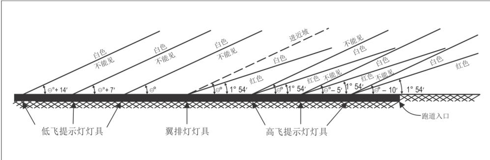

图5-18T-VASIS和AT-VASIS的光束和仰角调置

## PAPI和APAPI 

## 说明

5.3.5.24PAPI系统必须由一个包括四个等距设置的急剧变色的多灯泡（或成对单灯泡）灯具的翼排灯组成。除非实际不可行，该系统必须设在跑道的左侧。

注：在使用跑道的航空器需要得到无法通过其他外部方式提供的目视侧滚引导时，可在跑道的另一侧设置另一个翼排灯。

5.3.5.25APAPI系统必须由一个包括两个急剧变色的多灯泡（或成对单灯泡）灯具的翼排灯组成。除非实际不可行，该系统必须设在跑道的左侧。

注：在使用跑道的航空器需要得到无法通过其他外部方式提供的目视侧滚引导时，可在跑道的另一侧设置另一个翼排灯。

##### 5.3.5.26 PAPI翼排灯必须建造和布置得使进近中的驾驶员将能：

a)当正在或接近进近坡时，看到离跑道最近的两个灯具为红色，离跑道最远的两个灯具为白色：

b)当高于进近坡时，看到离跑道最近的一个灯具为红色，离跑道最远的三个灯具为白色；在高于进近坡更多时，看到全部灯具均为白色：

c)当低于进近坡时，看到离跑道最近的三个灯具为红色，离跑道最远的一个灯具为白色：在低于进近坡更多时，看到全部灯具均为红色。

5.3.5.27APAPI翼排灯必须建造和布置得使进近中的驾驶员将能：

a)当正在或接近进近坡时，看到离跑道较近的灯具为红色，离跑道较远的灯具为白色；

b)当高于进近坡时，看到两个灯具均为白色：

c)当低于进近坡时，看到两个灯具均为红色。

## 定位

5.3.5.28灯具必须位于如图5-19所示的基本构形的位置，允许存在图中所给出的安装容差。构成翼排灯的灯具必须安装得使在进近中的飞机驾驶员看来基本上是在一条水平线上。灯具必须装得尽可能地低而且必须是易折的。

## 灯具的特性

5.3.5.29该灯光系统必须适合于昼间和夜间运行。

5.3.5.30在垂直面上，灯光由红色到白色的过渡在一个位于不小于300m距离以外的观察者看来必须是发生在不大于3的一个垂直角内。

5.3.5.31在满光强时，红色光的Y坐标值不得超过0.320。

5.3.5.32灯具的光强分布必须如附录2图A2-23所示。

注：有关灯具的特性的更多指导材料，见《机场设计手册》（Doc9157号文件）第4部分。

5.3.5.33必须设置合适的光强调节设备，以便调节光强来适应当时的情况并避免使驾驶员在进近和着陆中感到眩目。

5.3.5.34每个灯具必须能调节仰角，使光束的白光部分的下限可以固定在水平以上1°30′至4°30′之间的任何要求的角度上。

5.3.5.35灯具必须设计得在透光或反光面上的凝结水、冰、雪、尘土等对灯光信号的干扰减至尽可能小的程度，并不得影响红色和白色信号之间的对比和过渡扇形面的仰角。

<html><body><table border="1"><tbody><tr><td>跑道入口 跑道入口 跑道 跑道 -D{$ □B</td></tr><tr><td>15m D_{$ 10m (±1m) (±1m) □D 6m 9m (±1m) (±1m) □C 9m (±1m) □B 9m (±1m) ▼ □A 典型的PAPI翼排灯 
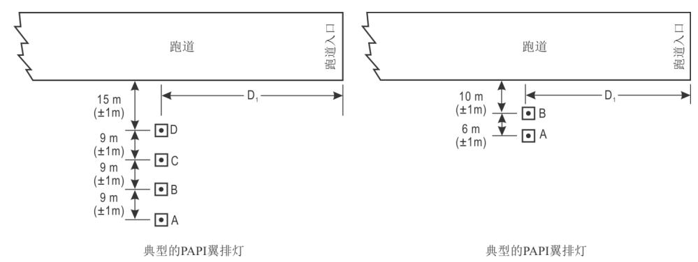
</td></tr><tr><td>□A 典型的PAPI翼排灯 如果由于某种航空器要求有大于上述a）中规定</td></tr><tr><td>安装容差 a) 在安装PAPI或APAPI的跑道上未装有ILS或 c) MLS时，距离D必须计算得保证经常使用跑道 的轮子净距，可用增大来达到。 的飞机中的要求最严格的飞机的驾驶员在看到最 低的正确的进近坡度指示时(即在图5-20中PAPI d) 的B角上或A-PAPI的A角上）能有表5-2中规 口之间的高差。 $\mathrm{D}_{1}$ $\mathbf{D}_{1}$</td></tr><tr><td>必须调整距离以补偿灯具透镜中心与跑道入 b)</td></tr><tr><td>定的过入口处的轮子净距。</td></tr><tr><td>e) 为了保证灯具安装得尽可能低和为了容许一些横 在安装PAPI或APAPI的跑道上装有ILS和/或 坡，灯具之间不大于5cm的小量高度调整是许可 MLS时，距离D必须能在经常使用跑道的各种 飞机的眼—天线高度范围内提供目视和非目视 助航信号之间的最佳协调。此距离必须等于ILS 下滑道或MLS的最小下滑航道的有效原点到入 口的距离加上一个为补偿各种有关的飞机的眼 一天线高度变化的校正因数。此校正因数为这些 飞机的眼—天线高度的平均值与进近角的余切 净距。 注：关于瞄准点标志的规定见5.2.5。《机场设计 手册》（Doc9157号文件)第4部分载有关于协调PAPI、 ILS和/或MLS信号的指导材料。</td></tr><tr><td>的。在灯具之间统一采用一个不大于1.25%的横 坡也是许可的。 f) 基准代码为1或2时，PAPI的灯间距应为6m(±1 m)。在此情况下，最靠近跑道的灯具必须设在距 跑道边不小于10m(±1m)处。 注：减小灯的间距将导致该系统的可用距离的减 的乘积。但距离D在任何情况下不得使过入口处 小。 的轮子净距低于表5-2第(3）栏规定的最小轮子 g) 如需要较大的可用距离，或预期将来要改成 PAPI，APAPI的灯具横向间距可增大到9m(±1 m)。在后一情况下，最靠近跑道的灯具必须设在 距跑道边15m(±1m)处。</td></tr></tbody></table></body></html>

图5-19PAPI和APAPI的定位

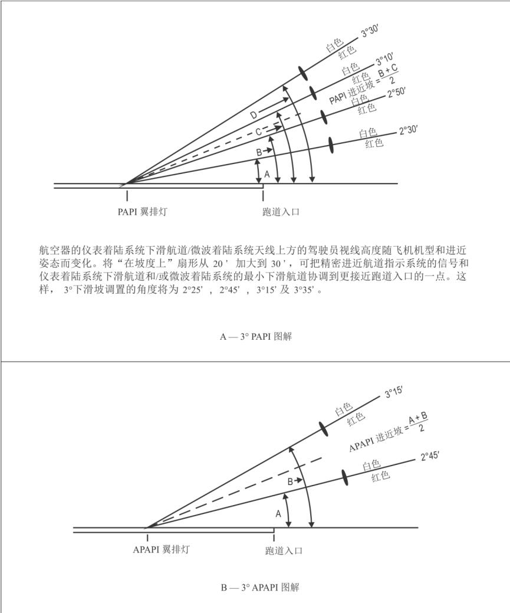

图5-20PAPI和APAPI的光束和仰角调置

表5-2对PAPI和APAPI过入口处轮子的净距

<html><body><table border="1"><tr><td>飞机在进近姿态中的眼——轮高度a (1)</td><td>要求的轮子净距 (m)b c (2)</td><td>最小轮子净距 (m)d (3)</td></tr><tr><td>3m以下、不到3m</td><td>6</td><td>3e</td></tr><tr><td>3m以上、不到5m</td><td>6</td><td>4</td></tr><tr><td>5m以上、不到8m</td><td>6</td><td>5</td></tr><tr><td>8m以上、不到14m</td><td>9</td><td>6</td></tr></table></body></html>

a)在选择眼一轮高度组时，仅考虑那些预定经常使用本系统的飞机，按其中要求最高的飞机确定。

b)只要实际可行，必须提供第(2）栏中规定的轮子净距。

c)第(2）栏要求的轮子净距可减至不小于第(3)栏中的规定值，只要航空研究表明减小了的轮子净距是可被接受的。

d)在内移入口采用了减小的轮子净距时，必须保证位于选用的眼一轮高度组上限的飞机飞过跑道端时具有符合第(2）栏中要求的轮子净距。

e)在主要供轻型非涡轮喷气飞机使用的跑道上，此最小轮子净距可减小至1.5m。

## 进近坡和灯具的仰角调置

5.3.5.36图5-20中确定的进近坡度必须适合于使用该进近方向的飞机。

5.3.5.37当跑道装有ILS和/或MLS时，灯具的定位和仰角必须使目视进近坡与ILS的下滑航道和/或MLS的最小下滑航道尽可能地相符。

5.3.5.38PAPI翼排灯中各个灯具的仰角调置必须使得在进近中的飞机驾驶员看见一个白灯和三个红灯的信号时能对进近区内的所有物体保持一个安全净距（见表5-2）。

5.3.5.39APAPI翼排灯中各个灯具的仰角调置必须使得在进近中的飞机驾驶员看见最低的在坡度上（即一红一白）信号时，能对进近区内所有物体保持一个安全净距（见表5-2）。

5.3.5.40在发现有一位于PAPI或APAPI系统的障碍物保护面之外但在系统光束的横向界限以内的物体伸出于障碍物保护面之上，而且航空研究表明该物体对飞行安全会有不利影响时，必须适当地限制光束的方位角的扩散范围，使该物体保持在光束范围之外。

注：关于有关的障碍物保护面，见5.3.5.42至5.3.5.46。

5.3.5.41在为提供侧滚引导而在跑道两侧设置翼排灯时，必须将相应的灯具的仰角设置得相同，使得两个翼排灯的信号同时对称地变化。

## 障碍物保护面

注：以下规范适用于T-VASIS、AT-VASIS、PAPI和APAPI。

5.3.5.42在准备设置目视进近坡度指示系统时必须规定一个障碍物保护面。

5.3.5.43障碍物保护面的特性即原点、散开度、长度和坡度等必须符合表5-3和图5-21中有关各列的规定。

5.3.5.44不允许有新物体或已有物体的扩展部分突出于障碍物保护面之上，除非有关当局认为新的物体或扩展部分会被一个已有的无法移开的物体所遮蔽。

注：可以合理地应用遮蔽原则的情况，见《机场服务手册》（Doc9137号文件）第6部分。

5.3.5.45现有的高出于障碍物保护面以上的物体必须移除，除非有关当局认为该物体已被一个现有的无法移开的物体所遮蔽，或者经过航空研究后确定该物体不致对飞机安全产生不利影响。

表5-3障碍物保护面的尺寸和坡度

<html><body><table border="1"><tbody><tr><td colspan="9">跑道类型/基准代码</td></tr><tr><td></td><td colspan="4">非仪表跑道</td><td colspan="4">仪表跑道</td></tr><tr><td colspan="2"></td><td colspan="3">基准代码</td><td colspan="4">基准代码</td></tr><tr><td colspan="2">保护面尺寸</td><td>1</td><td>2</td><td>3</td><td>4</td><td>1</td><td>2</td><td>3</td><td>4</td></tr><tr><td colspan="2">内边长度 距离目视进近坡度指示器</td><td>60m</td><td>80 ma</td><td>150m</td><td>150m</td><td>150m D{1+60m</td><td>150m</td><td>300m</td><td>300m</td></tr><tr><td colspan="2">系统 (e)</td><td>D_1+30m</td><td>D1+60m</td><td>D_1+60m</td><td>D1+60m</td><td></td><td>D_{1+60m</td><td>D_{+60m</td><td>D_1+60m</td></tr><tr><td colspan="2">散开度（每边）</td><td>10%</td><td>10%</td><td>10%</td><td>10%</td><td>15%</td><td>15%</td><td>15%</td><td>15%</td></tr><tr><td colspan="2">总长度 坡度</td><td>7500m</td><td>7 500mb$</td><td>15 000 m</td><td>15 000m</td><td>7500m</td><td>7 500mb$</td><td>15 000m</td><td>15 000m</td></tr><tr><td colspan="2"></td><td></td><td></td><td></td><td></td><td></td><td></td><td></td><td></td></tr><tr><td>a)</td><td>T-VASIS和AT-VASIS</td><td>—c</td><td>1.9\}$</td><td>1.9°}</td><td>1.9\}</td><td></td><td>1.9\}</td><td>1.9\}$</td><td>1.9\}$</td></tr><tr><td>b)</td><td>PAPId</td><td></td><td>A-0.57°</td><td>A-0.57°</td><td>A-0.57°</td><td>A-0.57°</td><td>A-0.57°</td><td>A-0.57°</td><td>A-0.57°</td></tr><tr><td>c)</td><td>APAPId</td><td>A-0.9\</td><td>A-0.9°</td><td>—</td><td>—</td><td>A-0.9°</td><td>A-0.9{</td><td></td><td></td></tr></tbody></table></body></html>

a)对T-VASIS或AT-VASIS此长度应增至150m。

b)对T-VASIS或AT-VASIS此长度应增至15 000m。

c)未规定坡度，因本系统不大可能用于表列的跑道类型和基准代码。

d)角度系指图5-20中的角度。

e)D1是为纠正物体穿透障碍物保护面，目视进近坡度指示器系统位移之前至入口的距离(见图5-19)。障碍物保护面的起点固定在目视进近坡度指示器系统的位置，这样精密进近航道指示器的位移可使障碍物保护面的起点产生相等位移。见5.3.5.46 e)。

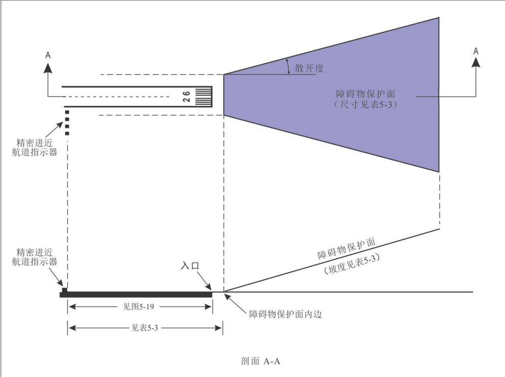

图5-21目视进近坡度指示系统的障碍物保护面

5.3.5.46当航空研究表明一个突出于障碍物保护面之上的物体对飞行安全会有不利影响时，必须采取下列一项或几项措施：

a)清除该物体；

b）适当地提高该系统的进近坡度；

c）减小该系统的方位扩散角，使该物体处于光束范围之外；

d)将该系统的轴线及其相应的障碍物保护面偏移一个不大于5°的角度；和

e）将该系统适当地朝入口上风方向移动，以使该物体不穿透障碍物保护面。

注1：有关此问题的指导材料载于《机场设计手册》（Doc9157号文件）第4部分。

注2：将该系统朝入口上风方向移动可缩短实际着陆距离。

#### 5.3.6 盘旋引导灯

应用

5.3.6.1建议：在跑道准备用于盘旋进近的情况下，如现有的进近和跑道灯光系统不能圆满地使盘旋飞行的航空器驾驶员识别跑道和/或进近区，则应设置盘旋引导灯。

位置

5.3.6.2建议：盘旋引导灯的位置和数量应足以使驾驶员能够视情况：

a 进入第3边或调整航空器对跑道的航迹，保持对跑道有一个所需距离并在经过跑道入口时将跑道入口辨认出来；和

b）在有其他目视助航设施提供引导的情况下，保持看见跑道入口和/或可借以判断转到第4边和最后进近的其他特征。

5.3.6.3建议：盘旋引导灯应由以下灯具组成：

a）指明跑道中线延长线和/或进近灯光系统的一部分的灯具；或

b）指明跑道入口位置的灯具；或

c）指明跑道方向或位置的灯具；

或适用于所考虑的跑道的以上几种灯的组合。

注：有关安装盘旋引导灯的指导材料，见《机场设计手册》（Doc9157号文件）第4部分。

## 特性

5.3.6.4建议：盘旋引导灯应为恒定发光灯或闪光灯，其光强和光束扩散角在预期进行目视盘旋进近的能见度和周围灯光条件下应是足够的。闪光灯应发白光，恒定发光灯应发白光或为气体放电灯。

5.3.6.5建议：灯具应设计和安装得使正在进近着陆、起飞或滑行的驾驶员不会感到眩目或迷惑不解。

#### 5.3.7 跑道引入灯光系统

应用

5.3.7.1建议：为了避开危险的地形或减少噪声等目的，需要沿某一特定的进近航道提供目视引导时，应设置跑道引入灯光系统。

注：有关设置跑道引入灯光系统的指导材料，见《机场设计手册》（Doc9157号文件）第4部分。

位置

5.3.7.2建议：跑道引入灯光系统应由若干灯组组成，这些灯组应布置得能够勾划出要求的进近航道，而且能从前一组灯看到后一组灯。相邻灯组间的间隔应不超过约1600m。

注：跑道引入灯光系统可以是曲线、直线或曲线与直线的组合。

5.3.7.3建议：跑道引入灯光系统应从有关当局确定的位置开始，延伸到能看到进近灯光系统（如设有），或跑道或跑道灯光系统的地点为止。

特性

5.3.7.4建议：跑道引入灯光系统的每一组灯应由形成一条线或一簇的至少三个闪光灯组成。如加装稳定发光灯会有助于识别跑道引入灯光系统，则可加装稳定发光灯。

5.3.7.5建议：闪光灯和稳定发光灯应为发白色光的。

5.3.7.6建议：只要实际可行，每组闪光灯应朝跑道方向顺序闪光。

#### 5.3.8 跑道入口识别灯

应用

5.3.8.1建议：在以下情况下应设置跑道入口识别灯：

a）当需要使非精密进近跑道的入口更加明显或设置其他进近灯光为实际上不可行时：和

b）当跑道入口从跑道端永久位移或从正常位置临时位移并需要使入口更加明显时。

位置

5.3.8.2跑道入口识别灯必须对称地设在跑道中线两侧，与跑道入口在同一条直线上，在跑道两侧边灯线以外约10m处。

特性

5.3.8.3建议：跑道入口识别灯应为每分钟闪光60次至120次的白色闪光灯。

5.3.8.4灯光必须只能在向跑道进近的方向才能看到。

#### 5.3.9 跑道边灯

应用

5.3.9.1拟供夜间使用的跑道或拟供昼间和夜间使用的精密进近跑道，均必须设置跑道边灯。

5.3.9.2建议：拟供在昼间跑道视程小于800m左右的最低运行标准条件下起飞的跑道，应设置跑道边灯。

位置

5.3.9.3跑道边灯必须沿跑道全长在与跑道中线等距的两条平行线上设置。

5.3.9.4跑道边灯必须沿着被公布作为跑道使用的地区的边缘或沿边缘以外距离不大于3m处设置。

5.3.9.5建议：在公布作为跑道场地的宽度超过60m的情况下，在确定两行跑道边灯之间的距离时应综合考虑运行性质、跑道边灯灯具的光分布特性和服务于该跑道的其他目视助航设施的情况。

5.3.9.6跑道边灯必须成行地以均匀间隔布置，如为仪表跑道，灯的间距不得大于60m，如非仪表跑道，灯的间距不得大于100m。在跑道轴线两侧对应的灯必须设在垂直于轴线的直线上。在跑道交叉处，如果对驾驶员仍可提供足够的引导，边灯可用不规则的间距或者取消若干灯具。

## 特性

5.3.9.7跑道边灯必须是发可变白光的恒定发光灯，但以下情况除外：

a）在跑道入口内移的情况下，从跑道起点至内移跑道入口之间的灯必须在进近方向显示红色；

b）从起飞滑跑开始的一端看，跑道末端的600m或跑道长度的三分之一（二者取其小值）这一段的灯光可显示黄色。

5.3.9.8跑道边灯必须在为从任一方向起飞或着陆的驾驶员提供引导的所有必要的方位角上发光。当跑道边灯准备用来提供盘旋引导时，灯具必须在所有方位角上都发光（见5.3.6.1）。

5.3.9.9跑道边灯在5.3.9.8中所要求的所有方位角上自水平以上至仰角$15^{\circ}$ 的范围内都必须发光，其光强必须足以适应跑道拟供起飞或着陆时的能见度和周围灯光条件的需要。在任何情况下，光强至少应为50cd，只有在没有周围灯光的机场，可将光强降低到不小于25cd，以避免使驾驶员感到眩目。

5.3.9.10精密进近跑道的跑道边灯必须符合附录2图A2-9或A2-10中的规范。

#### 5.3.10 跑道入口灯和翼排灯（见图5-22）

## 跑道入口灯的应用

5.3.10.1设有跑道边灯的跑道必须设置跑道入口灯，只有跑道入口内移并设有跑道入口翼排灯的非仪表跑道和非精密进近跑道可以不设。

## 跑道入口灯的位置

5.3.10.2当跑道入口位于跑道端时，跑道入口灯必须设在垂直于跑道轴线的一条直线上并尽可能地靠近跑道端，并在任何情况下不得设置在跑道端以外距离大于3m处。

5.3.10.3当跑道入口自跑道端内移时，跑道入口灯必须设在跑道内移入口处的一条垂直于跑道轴线的直线上。

5.3.10.4跑道入口灯必须由如下灯具组成：

a）如为非仪表跑道或非精密进近跑道，至少六个灯；

b）如为I类精密进近跑道，至少为如果在跑道边灯之间以3m间距等距设置时所需的灯；和

c）如为Ⅱ类或Ⅲ类精密进近跑道，在跑道边灯之间以不大于3m的间距等距设置的灯。

5.3.10.5建议：5.3.10.4a）和b)所规定的灯，其灯具应按下述a）或b）布置：

a)，在两行跑道边灯线之间等距布置；或

b）分为两组对称于跑道中线布置，每一组灯都以等距布置，而在两组之间留一个缺口。缺口的宽度等于接地带标志或接地带灯的轨距（横向间距)，或者不大于两行跑道边灯之间距离的一半。

## 翼排灯的应用

5.3.10.6建议：当认为需要使精密进近跑道更加明显时，应设置翼排灯。

5.3.10.7跑道入口内移的非仪表跑道或非精密进近跑道，需要跑道入口灯而未设时，必须设置翼排灯。

## 翼排灯的位置

5.3.10.8翼排灯必须在跑道入口处分为两组即两个翼排灯对称于跑道中线设置。每个翼排灯必须至少由五个灯组成，垂直于跑道边灯线并伸出该线至少10m，并将每个翼排灯的最里面的灯放在跑道边灯线上。

<html><body><table border="1"><tbody><tr><td colspan="12">图5-22.跑道入口灯和跑道末端灯的布置 注：图示为跑道边上装有跑道边灯的宽45m跑道所需的最小为数。</td></tr><tr><td colspan="13">有条件的建议 双向灯 单向灯 X</td></tr><tr><td>图例</td><td>[5.3.11.2, 5.3.11.3]</td><td>[5.3.11.2, 5.3.11.3]</td><td>末端灯 跑道</td><td>内移 从跑道端 入口</td><td>[5.3.10.3, 5.3.10.4c), 5.3.10.8]</td><td>[5.3.10.3, 5.3.10.4c), 5.3.10.8]</td><td colspan="3">[5.3.10.3,5.3.10.4b),5.3.10.5,5.3.10.8]</td><td>[5.3.10.3,5.3.10.4a),5.3.10.5,5.3.10.8] YYY V V 1 '</td><td rowspan="3">入口灯 联聘</td></tr><tr><td></td><td colspan="2"></td><td colspan="3"></td><td colspan="3"></td><td colspan="2"></td></tr><tr><td>[.3.10.2...1.2</td><td colspan="3">[.3.10.2,...),,..13.]</td><td colspan="3">[5.3.10.2,5.3.10.4b),5.3.10.5,5.3.10.8,5.3.11.2,5.3.11.3]</td><td colspan="3">[.3.10.2,...,..11 y y > ></td></tr><tr><td colspan="3"></td><td colspan="3"></td><td colspan="3"></td><td colspan="2"></td><td rowspan="2"></td></tr><tr><td></td><td></td><td></td><td></td><td></td><td></td><td></td><td></td><td></td><td></td><td></td></tr><tr><td colspan="3">Ⅲ类精密进近跑道</td><td colspan="3">i类精密进近跑道</td><td colspan="3">I类精密进近跑道</td><td colspan="2">非仪表跑道及非精密进近跑道</td><td rowspan="2">灯</td></tr><tr><td></td><td></td><td></td><td></td><td></td><td></td><td></td><td></td><td></td><td></td><td></td></tr></tbody></table></body></html>

## 跑道入口灯和翼排灯的特性

5.3.10.9跑道入口灯和翼排灯必须为向跑道进近方面发绿色光的单向恒定发光灯，其光强和光束扩散角必须足以适应跑道拟供使用时的能见度和周围灯光条件的需要。

5.3.10.10精密进近跑道的跑道入口灯必须符合附录2图A2-3中的规范。

5.3.10.11精密进近跑道的入口翼排灯必须符合附录2图A2-4中的规范。

#### 5.3.11 跑道末端灯

（见图5-22）

应用

5.3.11.1设有跑道边灯的跑道必须设置跑道末端灯。

注：当跑道入口位于跑道端时，作为跑道入口灯的灯具可以用作跑道末端灯。

位置

5.3.11.2跑道末端灯必须设在一条垂直于跑道轴线并尽可能靠近跑道端的直线上，并在任何情况下不得设在跑道端以外距离大于3m处。

5.3.11.3建议：跑道末端灯应至少由六个灯组成并按下述a）或b）布置：

a）在两行跑道边灯线之间等距布置；或

b）分为两组对称于跑道中线布置，每一组灯都等距布置而在两组之间留一个空隙，其宽度不大于两行跑道边灯线之间距离的一半。

II类精密进近跑道的跑道末端灯的间距除两组灯之间的空隙处外（如设有空隙），不应超过6m。

特性

5.3.11.4跑道末端灯必须为向跑道方向发红色光的单向恒定发光灯。其光强和光束扩散角必须足以适应跑道拟供使用时的能见度和周围灯光条件的需要。

5.3.11.5精密进近跑道的跑道末端灯必须符合附录2图A2-8中的规范。

#### 5.3.12 跑道中线灯

应用

5.3.12.1在Ⅱ类或Ⅲ类精密进近跑道上必须设置跑道中线灯。

5.3.12.2建议：在I类精密进近跑道上应设置跑道中线灯，特别是当跑道系供高速着陆航空器使用或当跑道边灯之间的宽度大于50m时。

5.3.12.3拟供在跑道视程小于400m左右的最低标准条件下起飞的跑道必须设置跑道中线灯。

5.3.12.4建议：拟在跑道视程等于或大于400m左右的最低标准条件下供起飞速度极高的飞机起飞用的跑道，特别是当跑道边灯之间的宽度大于50m时，应设置跑道中线灯。

位置

5.3.12.5跑道中线灯必须沿跑道中线设置，仅当沿跑道中线设置不实际可行时才可设在偏离跑道中线同一侧不大于60cm之处，灯具必须从跑道入口到末端按大致15m的纵向间距设置。仅在能够证明10.5.7或10.5.11（视情况而定）中规定作为维护目标的跑道中线灯具的可用性水平可以达到，而且跑道是拟在跑道视程等于或大于350m时运行的情况下，灯具的纵向间距才可以大致为30m。

注：不必更换已有的间距为7.5m的跑道中线灯。

5.3.12.6建议：应用以下方法为飞机起飞提供从跑道始端到内移跑道入口间的中线引导：

a）一个进近灯光系统，如果其特性和光强调置能够提供航空器起飞时所需的引导而不使驾驶员感到眩目；或

b）跑道中线灯；或

c）如图5-23所示的至少3m长、间距30m均匀布置的短排灯组，其设计应使其光度特性和光强调置能够提供航空器起飞时所需的引导而不使驾驶员感到眩目。

当跑道用于着陆时，必要时应具备熄灭上述b）中规定的那些跑道中线灯的设施或重新调置进近灯光系统或短排灯组的光强。当跑道用于着陆时，在任何情况下，不应在跑道始端到内移跑道入口之间只显示单光源跑道中线灯。

## 特性

5.3.12.7从跑道入口到距跑道末端900m处的跑道中线灯必须是发可变白光的恒定发光灯；从距跑道末端900m 到300m之间的跑道中线灯必须交替地是发可变白光和发红色光的恒定发光灯；从距跑道末端300m到跑道末端必须是发红色光灯：但在跑道长度小于1800m的情况下交替地发可变白光和发红色光的灯光段必须从跑道的可用于着陆长度的中点到距跑道末端300m处。

图5-23跑道入口内移的进近灯光和跑道灯光示例

注：在电力系统的设计中，需要注意保证当部分电力系统失效时不致导致对跑道剩余长度的错误指示。

5.3.12.8跑道中线灯必须符合附录2图A2-6或A2-7中的规范。

#### 5.3.13 跑道接地带灯

应用

5.3.13.1在Ⅱ类或类精密进近跑道的接地带必须设置接地带（TDZ）灯。

## 位置

5.3.13.2接地带灯必须从跑道入口开始纵向延伸900m，只有在跑道长度小于1800m时才须将该系统缩短使其不致超越过跑道的中点。该系统必须以许多对对称于跑道中线的短排灯组成。每对短排灯的最里面两个灯的横向间距必须等于接地带标志所选用的横向间距。两对短排灯之间的纵向距离必须为30m或60m。

注：为了使能在尽可能较低的能见度条件下运行，可能以采用30m的短排灯纵向间距为宜。

特性

5.3.13.3短排灯必须至少由三个灯组成，灯的间距不大于1.5m。

5.3.13.4建议：短排灯的长度应不小于3m，也不大于4.5m。

5.3.13.5接地带灯必须为单向发可变白光的恒定发光灯。

5.3.13.6接地带灯必须符合附录2图A2-.5中的规范。

#### 5.3.14 简易接地带灯

注：简易接地带灯的目的是增强驾驶员在所有能见度条件下的情景意识，并帮助驾驶员确定当航空器未在跑道上某一点附近着陆时是否要开始复飞。在设置简易接地带灯的机场飞行的驾驶员必须熟悉这些灯的用途。

## 应用

5.3.14.1建议：除非根据第5.3.13段在进近角大于3.5度和/或可用着陆距离加上其他一些因素可使冲出跑道的风险增加的机场设置接地带灯，否则应设置简易接地带灯。

位置

5.3.14.2简易接地带灯必须是位于跑道中线每侧的一对灯具，位于最终接地带标志上风边缘以外0.3米处。两对灯具的靠里边的灯具之间的横向间距必须等于为接地带标志所选定的横向间距。同一对灯具的两个灯具之间的间隔不得大于1.5米或接地带标志宽度的一半，两者取较大值。（见图5-24）

5.3.14.3建议：如果设置在不带接地带标志的跑道上，简易接地带灯应安装在可提供等效接地带信息的位置。

特性

5.3.14.4简易接地带灯必须是发出可变白色光的单向恒定发光灯，必须对准方向使朝跑道方向进近的着陆飞机的驾驶员能看得到。

5.3.14.5简易接地带灯必须符合附录2图A2-5中的规范。

注：作为一个良好的操作做法，可由一个与其他跑道灯的电路分开的电路为接地带灯提供电源，以便在其他灯关灭时能够使用这些灯。

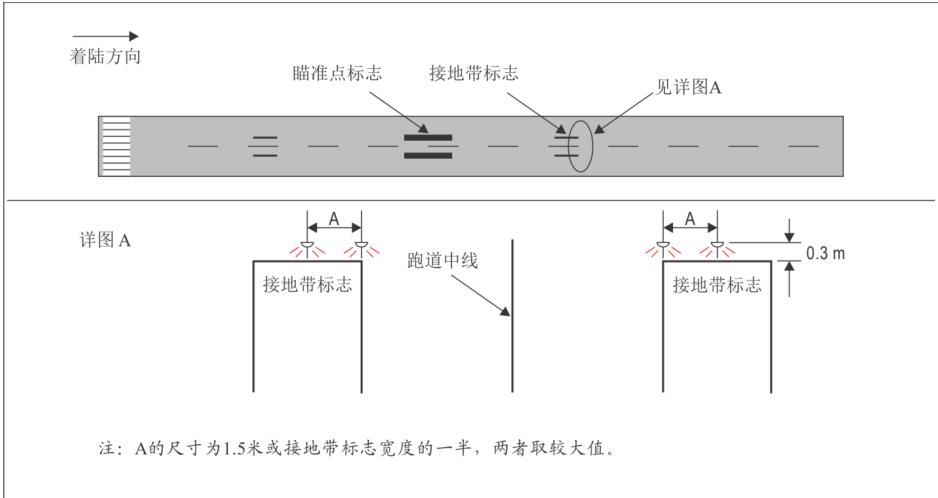

图5-24简易接地带灯光

#### 5.3.15 快速出口滑行道指示灯

注：快速出口滑行道指示灯（RETILs）的用途是为驾驶员提供距跑道上最近的快速出口滑行道的距离信息，增强其在低能见度条件下的情景意识和使其能够运用制动操作以达到更高效的滑跑和脱离跑道速度。在备有设置了快速出口滑行道指示灯的跑道的机场飞行的驾驶员必须熟悉这些灯的用途。

## 应用

5.3.15.1建议：拟在跑道视程条件低于350m和/或高交通密度的情况下使用的跑道应设置快速出口滑行道指示灯。

注：见附篇A，第14节。

5.3.15.2在出现任何灯泡故障或其他故障以致不能完整显示图5-25中所示的灯光布局时，不得打开快速出口滑行道指示灯。

## 位置

5.3.15.3一组快速出口滑行道指示灯必须与相关的快速出口滑行道设在跑道中线的同一侧，其构形如图5-25所示。在每一组灯中，灯的间距必须为2m，最靠近跑道中线的灯距离跑道中线必须为2m。

5.3.15.4当在跑道上有一条以上的快速出口滑行道时，每一个出口的快速出口滑行道指示灯在展示时不得相互重叠。

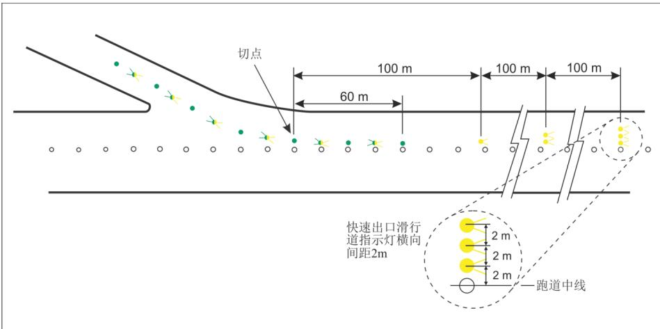

图5-25快速出口滑行道指示灯(RETILs)

特性

5.3.15.5快速出口滑行道指示灯应为单向黄色恒定发光灯并对准方向使趋近跑道着陆的飞机驾驶员能看得见。

5.3.15.6快速出口滑行道指示灯必须视情况符合附录2中图2-6或图2-7的规范。

5.3.15.7建议：快速出口滑行道指示灯应由与其他跑道灯的电路分开的单独电路供电，以便在其他灯光关灭时仍可使用这些灯。

#### 5.3.16 停止道灯

应用

5.3.16.1拟在夜间使用的停止道上必须设置停止道灯。

位置

5.3.16.2停止道灯必须沿停止道全长设置，设在与中线等距并与跑道边灯线重合的两条平行线上。停止道灯还必须横贯设置在停止道端垂直于停止道轴线的一条直线上，该直线必须尽可能靠近停止道端并在任何情况下不越过停止道端外3m。

特性

5.3.16.3停止道灯必须为单向朝跑道方向发红色光的恒定发光灯。

#### 5.3.17 滑行道中线灯

应用

5.3.17.1拟在跑道视程小于350m的情况下使用的出口滑行道、滑行道、除冰/防冰设施和机坪必须设置滑行道中线灯，设置方式必须能在跑道中线和机位之间提供连续的引导，只有在低交通密度和滑行道边灯及中线标志已能提供足够引导的情况下才无需设置。

5.3.17.2建议：拟在跑道视程为350m或更大的夜间情况下使用的滑行道，特别是在复杂的滑行道相交处和出口滑行道上，应设置滑行道中线灯，只有在低交通密度和滑行道边灯及中线标志已能提供足够引导的情况下才可以不设。

注：在可能需要勾画出滑行道边之处，例如快速出口滑行道、窄滑行道，或在有积雪的情况下，可设滑行道边灯或标志物来解决。

5.3.17.3建议：如某一出口滑行道、滑行道、除冰/防冰设施和机坪被规定为高级地面活动引导及控制系统的一部分，则在各种能见度条件下均应为其设置滑行道中线灯，其设置方式应能在跑道中线和机位之间提供连续的引导。

5.3.17.4跑道上作为标准滑行路线的那一部分拟供在跑道视程小于350m的情况下滑行时，必须在其上设置滑行道中线灯。只有在低交通密度和滑行道边灯及中线标志已能提供足够引导的情况下才可以不设。

注：有关跑道和滑行道灯光系统联锁装置的规定，见8.2.3。

5.3.17.5建议：作为标准滑行路线的一部分的跑道如规定为高级地面活动引导及控制系统的一部分，则在各种气象条件下均应为其设置滑行道中线灯。

## 特性

5.3.17.6除5.3.17.8中规定的情况外，除出口滑行道之外的滑行道上的和作为标准滑行路线一部分的跑道上的滑行道中线灯必须是发绿色光的恒定发光灯，其光束大小必须只有从在滑行道上或其附近的飞机上才能看得见灯光。

5.3.17.7出口滑行道上的滑行道中线灯必须是恒定发光灯。从靠近跑道中线开始到ILS/MLS临界/敏感区的边界或内过渡面的低边（取二者之中离跑道较远者）为止，滑行道中线灯必须是发绿色光的与发黄色光的交替设置，此后所有全部的灯必须是发绿色光的（见图5-26）。出口中线上第一个灯必须总是发绿色光，最靠近上述边界的灯必须总是发黄色光。

注1：有必要注意限制在跑道上或其附近的发绿色光灯具的光束分布，以避免与跑道入口灯产生混淆。

注2：关于黄色滤光镜的特性，见附录1的2.2。

注3：ILS/MLS的临界/敏感区的大小取决于使用的ILS/MLS的特性和其他因素。在附件10第I卷，第一部分的附篇C和G中提供有指导材料。

注4：关于脱离跑道标记牌的规范，见5.4.3。

5.3.17.8建议：当有必要指示接近一条跑道时，滑行道中线灯应为从ILS/MLS临界/敏感区的边界或内过渡面的低边（取二者之中离跑道较远者）到跑道交替发出绿色和黄色光的恒定发光灯，并应继续交替设置绿色和黄色光：

a）直至其靠近跑道中线的末端点；或

b）如果滑行道中线灯穿越跑道，则直至ILS/MLS临界/敏感区对面的边界或内过渡面的低边(取二者之中离跑道较远者）。

注1：有必要注意限制在跑道上或其附近的发绿色光灯具的光束分布，以避免可能与跑道入口灯产生混淆。

注2：5.3.17.8中的规定可以构成防止跑道侵入有效措施的一部分。

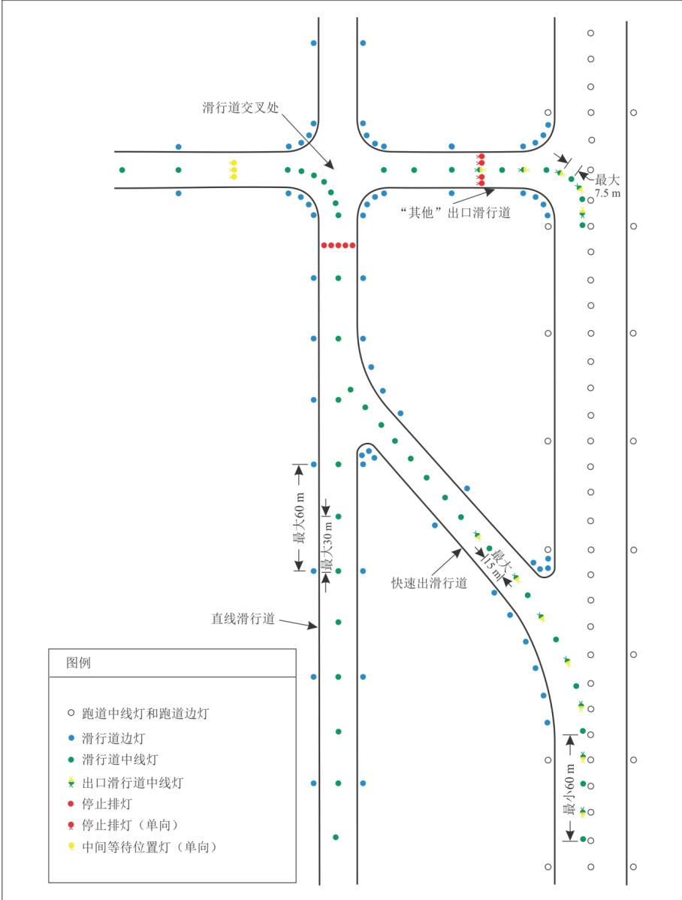

图5-26滑行道灯

5.3.17.9滑行道中线灯必须符合下列有关规范：

a）拟供在跑道视程小于350m左右情况下使用的滑行道上的灯具，见附录2图A2-12、A2-13或A2-14；

b）其他滑行道，见附录2图A2-15或A2-16。

5.3.17.10建议：在从运行观点看，需要较高的光强时，拟在跑道视程小于350m的情况下使用的快速出口滑行道上的滑行道中线灯应符合附录2中图A2-12的规范。这些灯的亮度调节级数应同跑道中线灯相同。

5.3.17.11建议：当滑行道中线灯被规定作为高级地面活动引导及控制系统的一部分时，而且从运行观点看，为了在很低能见度或晴朗白昼条件下保持一定的地面运转速度需要较高的光强时，滑行道中线灯应符合附录2图A2-17、A2-18或A2-19的规范。

注：应在有绝对需要并经专门研究后才使用高光强中线灯。

位置

5.3.17.12建议：滑行道中线灯通常应设置在滑行道中线标志上，只有在实际上无法将其设在标志上时才可使灯具偏离标志不大于30cm。

## 滑行道上的滑行道中线灯

位置

5.3.17.13建议：滑行道直线部分的滑行道中线灯的纵向间距应不大于30m，但以下情况除外：

a）在由于经常的气象条件采用较大的间距仍能提供足够的引导的情况下，可用不超过 60m的较大间距；

b）在短的直线段上，应采用小于30m的间距；

c）在拟供跑道视程小于350m的条件下使用的滑行道上，纵向间距应不超过15m。

5.3.17.14建议：滑行道弯道部分的滑行道中线灯应与滑行道直线部分的滑行道中线灯衔接，并从衔接处起保持中线灯至弯道外侧边缘的距离不变。灯的间距应能清晰地显示出弯道来。

5.3.17.15建议：在准备用于跑道视程小于350m的情况下的滑行道上，弯道上的灯的间距应不超过15m，而在半径小于400m的弯道上的灯的间距应不大于7.5m。这个距离应保持到弯道前后各60m。

注1：在准备用于跑道视程为350m或更大的情况下的滑行道弯道上，业经证明下列的灯的间距是合适的：

弯道半径灯间距离

直至400m 

7.5 m 

401m至899m 

15m 

900m或更大30m。

注2：见3.9.6和图3-2。

快速出口滑行道上的滑行道中线灯

位置

5.3.17.16建议：快速出口滑行道上的滑行道中线灯应从滑行道中线曲线起始点以前至少60m处的一点开始，一直延续到曲线终点以后滑行道中线上预期飞机将降速至正常滑行速度的一点为止。平行于跑道中线的那一部分滑行道中线灯应始终离开任何一行跑道中线灯至少60cm，如图5-27中所示。

5.3.17.17建议：灯具的纵向间距应不大于15m，但在未设有跑道中线灯的场合，可采用不大于30m的纵向间距。

其他出口滑行道上的滑行道中线灯

位置

5.3.17.18建议：快速出口滑行道以外的出口滑行道上的滑行道中线灯应从滑行道中线标志从跑道中线开始弯出的那一点开始，沿着弯曲的滑行道中线标志，至少到该标志离开跑道的地点为止。第一个灯应距离任何一行跑道中线灯至少60cm，如图5-27中所示。

5.3.17.19建议：灯具的纵向间距应不大于7.5m。

跑道上的滑行道中线灯

位置

5.3.17.20建议：跑道上作为标准滑行路线的一部分拟供在跑道视程小于350m的情况下滑行时，其滑行道中线灯的纵向间距不应超过15m。

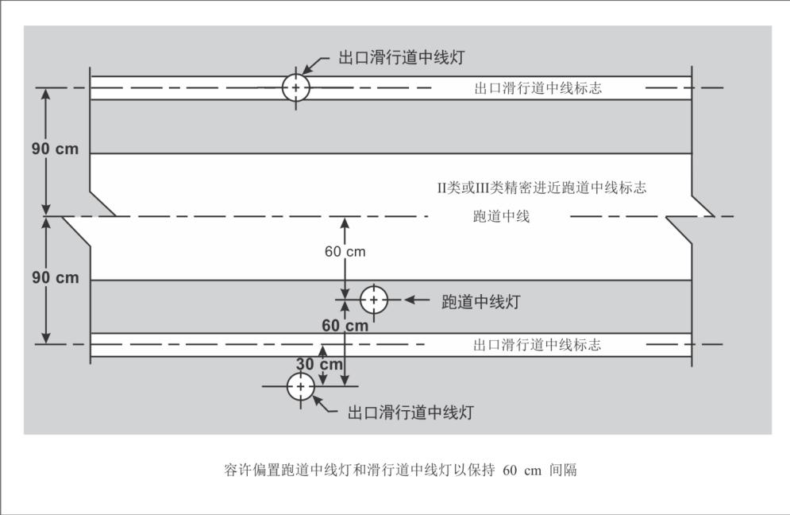

图5-27偏置跑道和滑行道中线灯

#### 5.3.18 滑行道边灯

## 应用

5.3.18.1供夜间使用的跑道掉头坪、等待坪、除冰/防冰设施、机坪等和未设有滑行道中线灯的滑行道的边缘必须设置滑行道边灯，只有在考虑到运行的性质，认为地面照明或其他方法已能提供足够的引导时才无需设置。

注：关于滑行道边线标志物，见5.5.5。

5.3.18.2跑道上作为标准滑行路线的一部分拟供在夜间滑行而没有滑行道中线灯时，必须设置滑行道边灯。

注：关于跑道和滑行道灯光系统的联锁装置的规定，见8.2.3。

## 位置

5.3.18.3建议：滑行道直线部分和在跑道上作为标准滑行路线那一部分的滑行道边灯应以不大于60m的纵向间距均匀设置。弯道部分的灯的间距应小于60m，使能清晰地显示出该弯道。

注：关于弯道上的滑行道边灯的间距的指导材料，见《机场设计手册》（Doc9157号文件）第4部分。

5.3.18.4建议：在等待坪、除冰/防冰设施、机坪等边缘设置的滑行道边灯应以不大于60m的纵向间距均匀布置。

5.3.18.5建议：跑道掉头坪上的滑行道边灯应以不大于30m的均等纵向间隔设置。

5.3.18.6建议：灯具位置应尽实际可行地靠近滑行道、跑道掉头坪、等待坪、除冰/防冰设施、机坪或跑道等的边缘，或在边缘以外距离不大于3m处。

特性

5.3.18.7滑行道边灯必须是发蓝色光的恒定发光灯。灯具必须在为朝任一方向滑行的驾驶员提供引导所有必要的方位角上，自水平至水平以上至少75°的范围内发光。在相交、出口或弯道处的灯具必须尽可能地加以遮挡使得在可能与其他灯光混淆的那些方位上看不见它的灯光。

5.3.18.8滑行道边灯光强在0°至6°仰角范围之内必须至少为2个坎德拉，6°至75°仰角范围之内必须至少为0.2个坎德拉。

#### 5.3.19 跑道掉头坪灯

应用

5.3.19.1拟在跑道视程小于350m的情况下使用的跑道掉头坪上必须设置跑道掉头坪灯以提供连续的引导，帮助飞机能完成180°转弯并对准跑道中线。

5.3.19.2建议：拟在夜间使用的跑道掉头坪上应设置跑道掉头坪灯。

位置

5.3.19.3建议：跑道掉头坪灯通常应设置在跑道掉头坪标志上，只有在实际上无法将其设在标志上时才可使灯具偏离标志不大于30cm。

5.3.19.4建议：在跑道掉头坪标志直线段上的跑道掉头坪灯其纵向间距应不大于15m。

5.3.19.5建议：在跑道掉头坪标志曲线段上的跑道掉头坪灯其间距不应大于7.5m。

## 特性

5.3.19.6跑道掉头坪灯必须是发绿色光的单向恒定发光灯，其光束范围必须使该灯只能从位于或趋近跑道掉头坪的飞机上才能看到。

5.3.19.7跑道掉头坪灯必须视情况符合附录2中图A2-13、A2-14或A2-15的规范。

#### 5.3.20 停止排灯

## 应用

注1：需要由空中交通服务部门进行人工或自动化控制。

注2：跑道侵入在所有能见度或者天气条件下都可能发生。在跑道等待位置提供停止排灯以及在夜晚或跑道视程大于550米的能见度条件下使用停止排灯可以构成有效的跑道侵入预防措施的一部分。

5.3.20.1拟在跑道视程小于550m时使用的跑道，必须在为其服务的每一跑道等待位置上设置停止排灯，除非：

a）已具有相应的助航设施和程序以帮助防止交通偶然侵入跑道；或

b)在跑道视程小于550m时，存在有运行程序来对航空器和车辆的数量进行如下限制：

1）在运转区上的航空器每次只有一架；和

2）在运转区上的车辆限制在必不可少的最小数量。

5.3.20.2如果有一个以上的停止排灯与滑行道/跑道交叉处相关联，在任一给定的时间，只可开亮一个。

5.3.20.3建议：当要求用灯光来补充标志并用目视方法实施交通管制时，应在中间等待位置设置停止排灯。

## 位置

5.3.20.4停止排灯必须在要求飞机停住的地点横贯滑行道设置。当按5.3.20.6增设立式灯具时，必须设在滑行道边以外不小于3m处。

## 特性

5.3.20.5停止排灯必须由若干个等距分布、间距不大于3m、横贯滑行道、朝着预计的向相交点或跑道等待位置趋近的方向发红色光的灯组成。

注：如果有必要提高鲜明性，可等距安装额外灯具。

5.3.20.6建议：在嵌入道面的停止排灯可能由于雨雪等使得驾驶员看不清楚，或在要求驾驶员停住航空器的位置距离该灯太近以致灯光被航空器的结构挡住的情况下，应在停止排灯的两端各增设一对立式灯具。

5.3.20.7设置在跑道等待位置上的停止排灯必须是朝着趋近跑道的方向发红色光的单向灯。

5.3.20.8按5.3.20.6增设的立式灯必须具有与停止排灯相同的特性，但必须一直都能被进近的航空器看见，直到停止排灯位置。

5.3.20.9停止排灯灯具的红色光强和光束扩散角必须符合附录2中图A2-12至A2-16中适用的规范。

5.3.20.10建议：当停止排灯被规定作为高级地面活动引导及控制系统的一部分时，以及从运行观点看，为了在很低能见度或晴朗白昼条件下保持一定的地面运转速度需要较高的光强时，停止排灯应符合附录2图A2-17、A2-18或A2-19中的规范。

注：应在有绝对需要并经专门研究后才使用高光强停止排灯。

5.3.20.11建议：在需要宽光束扩散角时，停止排灯的红色光强和光束扩散角应符合附录2图2-17或2-19中的规范。

5.3.20.12灯光电路必须设计得使其：

a）横贯入口滑行道的停止排灯能够有选择地进行开关控制；

b）横贯只准备作为出口滑行道的停止排灯能够有选择地或成组地进行开关控制；

c）停止排灯开亮时，安装在停止排灯以外至少90m距离内的任何滑行道中线灯必须熄灭；

d）停止排灯与滑行道中线灯相联锁，以便在停止排灯以外的中线灯开亮时，停止排灯熄灭；反之亦然。

注：电力系统的设计需要注意保证一组停止排灯不会同时全部失效。关于此问题的指导材料，见《机场设计手册》（Doc9157号文件）第5部分。

#### 5.3.21 中间等待位置灯

注：关于中间等待位置标志的规定，见5.2.11。

应用

5.3.21.1除非该处已设有停止排灯，拟在跑道视程小于350m的情况下使用的中间等待位置处必须设置中间等待位置灯。

5.3.21.2建议：在不需要像停止排灯那样提供停止或通行信号的中间等待位置上应设置中间等待位置灯。

位置

5.3.21.3中间等待位置灯必须沿中间等待位置标志设置并位于等待侧距离标志0.3m处。

特性

5.3.21.4中间等待位置灯必须由3个具有类似滑行道中线灯（如设有）的光分布特性、朝着趋向中间等待位置方向发黄色光的单向恒定发光灯组成。灯具必须以1.5m的等间距布置，对称于滑行道中线并与其成直角。

#### 5.3.22 除冰/防冰设施出口灯

应用

5.3.22.1建议：在比邻滑行道的远距除冰/防冰设施的出口边界处应设除冰设施出口灯。

位置

5.3.22.2除冰/防冰设施出口灯必须沿除冰/防冰设施出口边界处的中间等待位置标志内侧设置，距离标志0.3m。

特性

5.3.22.3除冰/防冰设施出口灯必须由若干个光分布特性类似滑行道中线灯、朝趋近出口边界方向发黄色光的单向嵌入式恒定发光灯组成，灯具必须以6m的等间距布置（见图5-28）。

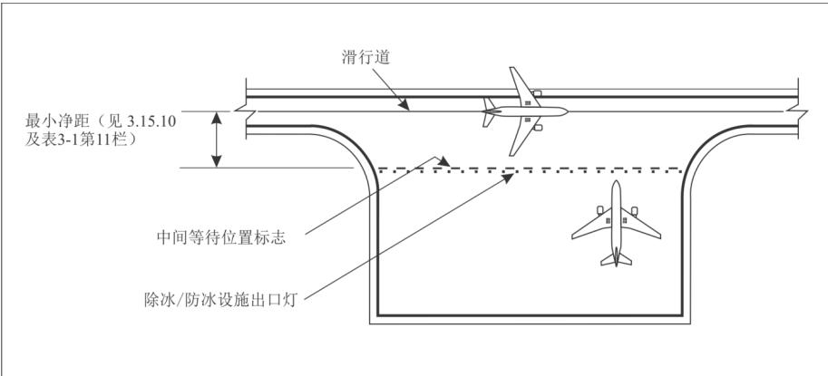

图5-28典型的远距除冰/防冰设施

#### 5.3.23 跑道警戒灯

注：跑道侵入事件在所有能见度或气象条件下都可能发生。在跑道等待位置设置跑道警戒灯，可以构成防止跑道侵入有效措施的一部分。跑道警戒灯在滑行道上操纵飞机的驾驶员和驾驶车辆的司机将要进入一条跑道时发出警告。跑道警戒灯有两种标准构型，如图5-29所示。

## 应用

5.3.23.1在跑道拟用于下列情况时，每个跑道/滑行道相交处必须设置A型跑道警戒灯：

a）跑道视程小于550m且未安装停止排灯；和

b）跑道视程在550m至1200m之间且交通密度高。

注1：必要时，B型跑道警戒灯可以对A型跑道警戒灯进行补充。

注2：关于B型跑道警戒灯的设计、运行和位置的指导载于《机场设计手册》（Doc9157号文件）第4部分。

5.3.23.2建议：作为防止跑道侵入预防措施的一部分，在每个已被确定存在跑道侵入危险区的跑道/滑行道相交处应设置A型或B型跑道警戒灯，并昼夜用于所有天气条件。

5.3.23.3建议：B型跑道警戒灯不应与停止排灯并列。

5.3.23.4如果跑道/滑行道相交处的等待位置不止一个，则只能开亮与运行的跑道等待位置相关的跑道警戒灯组。

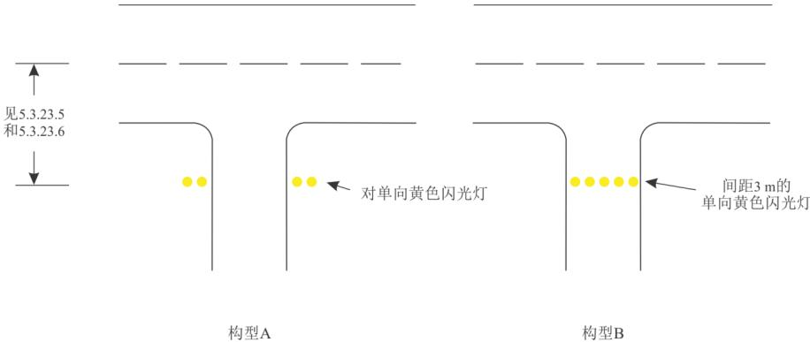

图5-29跑道警戒灯

位置

5.3.23.5A型跑道警戒灯必须设置在滑行道的两侧并置于跑道等待位置标志的等待一侧。

5.3.23.6B型跑道警戒灯必须横贯滑行道设置并置于跑道等待位置标志的等待一侧。

## 特性

5.3.23.7A型跑道警戒灯必须由两对黄色灯组成。

5.3.23.8建议：在需要加强A型跑道警戒灯在昼间使用时的明暗对比度时，应在每一灯泡之上加装一个足够大小的遮阳罩以防阳光进入透镜，干扰灯具功能的发挥。

注：可用其他装置或设计，例如特殊的光学设计来代替遮阳罩。

5.3.23.9B型跑道警戒灯必须由横贯滑行道间距为3m的黄色灯组成。

5.3.23.10光束必须是单向的并必须对向跑道等待位置进近的方向显示黄色。

注：有关跑道警戒灯方向和朝向的指导材料，见《机场设计手册》（Doc9157号文件）第4部分。

5.3.23.11建议：A型跑道警戒灯的黄色光强和光束扩散角应符合附录2图A2-24的规范。

5.3.23.12建议：拟在昼间使用的A型跑道警戒灯的黄色光强和光束扩散角应符合附录2图A2-25的规范。

5.3.23.13建议：当规定跑道警戒灯作为高级地面活动引导及控制系统的一部分需要较高的光强时，A型跑道警戒灯的黄色光强和光束扩散角应符合附录2图A2-25的规范。

注：为了在低能见度条件下保持一定的地面运转速度可能需要较高的光强。

5.3.23.14建议：B型跑道警戒灯的黄色光强和光束扩散角应符合附录2图A2-12的规范。

5.3.23.15建议：拟在昼间使用的B型跑道警戒灯的黄色光强和光束扩散角应符合附录2图A2-20的规范。

5.3.23.16建议：当规定跑道警戒灯作为高级地面活动引导及控制系统的一部分需要较高的光强时，B型跑道警戒灯的黄色光强和光束扩散角应符合附录2图A2-20的规范。

5.3.23.17每个A型灯具内的灯泡必须交替发光。

5.3.23.18B型跑道警戒灯中相邻的灯必须交替发光，隔开的灯必须同时发光。

5.3.23.19交替发光的灯必须以每分钟30次至60次的频率交替发光，而且明暗时间相同、彼此相反。

注：最佳闪光频率取决于所用灯泡的光上升和下降时间。已经发现，装在6.6A串联电路里的A型跑道警戒灯运行于每一灯泡每分钟闪光45次至50次时效果最佳，装在6.6A串联电路中的B型跑道警戒灯运行于每一灯泡每分钟闪光30次至32次时效果最佳。

#### 5.3.24 机坪泛光照明

（另见5.3.17.1和5.3.18.1）

## 应用

5.3.24.1建议：准备在夜间使用的机坪、除冰/防冰设施和指定的隔离航空器的停放位置应设机坪泛光照明。

注1：在除冰/防冰设施靠近跑道而且永久性的泛光照明可能使驾驶员感到干扰之处，可采用其他照明方式。

注2：隔离航空器的停放位置的指定，见3.14。

注3：有关机坪泛光照明的指导材料，见《机场设计手册》（Doc9157号文件）第4部分。

## 位置

5.3.24.2建议：机坪泛光灯的位置应能对机坪的所有工作地区提供足够的照明，并使对在飞行中的和地面上的航空器驾驶员、机场和机坪管制员和在机坪上的其他人员的眩光降至最低。泛光灯的布置和朝向应使得每一机位能从两个或更多方向受光以尽量减少阴影。

特性

5.3.24.3机坪泛光灯的光谱分布必须使得与例行检修有关的航空器标志、地面标志和障碍物标志的颜色能够正确地加以辨认。

5.3.24.4建议：平均照度至少应如下：

机位：

一水平照度—20lux，均匀比（平均值比最小值）不大于4比1；

—垂直照度—在有关方向上高出机坪2m处，20lux。

其他机坪地区：

一水平照度—机位上平均照度的50%，均匀比（平均值比最小值）不大于4比1。

#### 5.3.25 目视停靠引导系统

应用

5.3.25.1当准备用一种目视方法指示航空器在机位上准确定位而其他替代方法例如由指挥员引导实际上不可行时，必须设置目视停靠引导系统。

注：在评价是否需要目视停靠引导系统时，特别需要考虑的因素是：使用机位的航空器数量和机型、天气条件、机坪上具有的面积和由于航空器服务设施、旅客登机桥等对操纵航空器到停放位置的精确度要求。关于适当系统的选择的指导材料，见《机场设计手册》（Doc9157号文件）第4部分—目视助航设施。

## 特性

5.3.25.2该系统必须提供方位和停住的引导。

5.3.25.3无论昼夜在准备使用该系统的各种天气、能见度、背景灯光和道面情况下，方位引导设备和停止位置指示器提供的引导必须足够明确，但不得使驾驶员感到眩目。

注：在该系统的设计和现场安装中，要求小心仔细以保证阳光的反射或周围的其他灯光不降低由该系统提供的目视信号的清晰度和明显性。

5.3.25.4方位引导设备和停止位置指示器必须设计得：

a）在二者或其中之一发生故障时，能给驾驶员一个明确的故障信号；

b）它们能被关掉。

5.3.25.5方位引导设备和停止位置指示器的位置必须选择得使机位标志、机位操作引导灯（如果设有）与目视停靠引导系统三者提供的引导有连续性。

5.3.25.6该系统的精确度必须足以适应配套使用的登机桥的型式和为航空器服务的各种固定设施。

5.3.25.7建议：该系统应能适用于准备使用该机位的各种机型，最好无需进行选择操作。

5.3.25.8如果为了将该系统准备好供某一种特定型号航空器使用而需要进行选择操作，则系统必须向驾驶员和系统操作人员提供一个所选择的机型的识别信号，作为保证系统已准备妥当的一种手段。

## 方位引导设备

位置

5.3.25.9方位引导设备必须位于或靠近航空器前方的机位中线延长线上并对准方向，使其信号在整个停靠操作过程中都能从驾驶舱内看到，至少应对准左座驾驶员以供其使用。

5.3.25.10建议：方位引导设备应使其信号对准左座和右座驾驶员以供使用。

特性

5.3.25.11方位引导设备必须提供毫不含糊的左/右引导，使驾驶员能够找到并保持在引入线上而不发生控制过头。

5.3.25.12当用颜色变化来体现方位引导时，必须用绿色来识别中线、用红色来识别偏离中线。

## 停止位置指示器

位置

5.3.25.13停止位置指示器必须与方位引导设备装在一起或者足够接近，使得驾驶员无需转头就能既观察到方位信号又能观察到停住信号。

5.3.25.14停止位置指示器必须至少能供左座驾驶员使用。

5.3.25.15建议：停止位置指示器应让左座和右座驾驶员都能使用。

特性

5.3.25.16供某一特定机型使用的指示器提供的停止位置信息必须预计到驾驶员的视线高度和/或视角的变化。

5.3.25.17停止位置指示器必须显示被引导的航空器的停止位置，并提供其接近率的信息，使驾驶员能够逐渐降低航空器速度以在预定的停止位置完全停住。

5.3.25.18建议：停止位置指示器应在至少10m的范围内提供接近率信息。

5.3.25.19当用颜色变化来体现停止位置引导时，必须用绿色表示航空器可以前进，红色表示已经到达停止地点。只有在停止点之前的短距离上可用第三种颜色来警告停止地点业已接近。

#### 5.3.26 高级目视停靠引导系统

## 应用

注1：高级目视停靠引导系统（A-VDGS）除提供基本的和被动的方位及停机位置信息之外，还包括向驾驶员提供主动的（通常基于传感器）引导信息，比如航空器机型指示（按照Doc8643号文件一航空器型号代码）、剩余距离信息和接近速度。通常在单显示装置上提供停靠引导信息。

注2：高级目视停靠引导系统分三阶段提供停靠引导信息：系统获取航空器信息、航空器对正方位和停机等待位置信息。

5.3.26.1建议：应在下列情况下设置高级目视停靠引导系统：运行上有必要对正在接受引导的航空器的机型是否正确进行确认和/或在设有多条航空器机位中线时指示正在使用的航空器机位中线。

5.3.26.2高级目视停靠引导系统必须适宜供准备使用该航空器机位的各种机型使用。

5.3.26.3高级目视停靠引导系统必须只能在其工作性能的规定条件下使用。

注1：需要对高级目视停靠引导系统在诸如天气、能见度及昼间和夜间背景灯光条件下的使用做出规定。

注2：系统的设计和现场安装需要审慎，确保炫目、阳光反射或周围的其他光线不得降低该系统提供的目视信号的清晰度和醒目性。

5.3.26.4如果在航空器机位安装有高级目视停靠引导系统和常规的目视停靠引导系统，而两者都在使用，高级目视停靠引导系统提供的停靠引导信息不得与常规的航空器机位目视停靠引导系统提供的信息相互冲突。必须提供一种方法用以显示高级目视停靠引导系统不工作或不适用的情况。

## 位置

5.3.26.5高级目视停靠引导系统必须设置在可在停靠操作整个过程中向负责航空器停靠的人员和协助航空器停靠的人员提供无遮挡和明晰引导的位置。

注：机长通常需负责停靠航空器。但是在某些情况下，也可由其他人员负责，比如牵引航空器车辆的司机。

特性

5.3.26.6在停靠操作的各相关阶段，高级目视停靠引导系统必须至少提供下述引导信息：

紧急停住指示；

b)所引导的航空器型号和机型；

c)指示航空器相对于机位中线的侧向偏离；

d)需要用以修正与机位中线偏离的方位修正方向；

e)指示距停止位置的距离；

f)指示航空器已到达正确的停车位置；和

g)航空器越过正确的停止位置时，警告指示。

5.3.26.7高级目视停靠引导系统必须能够对停靠操作过程中遇到的各种航空器的滑行速度提供停靠引导信息。

注：关于航空器相对于停止位置距离的最大速度数值，见《机场设计手册》（Doc9157号文件）第4部分。

5.3.26.8在正常工作条件下，从确定侧向偏离到将其显示出来所耗时间不得导致航空器偏离机位中线超过1m。

5.3.26.9建议：当显示有航空器偏离机位中线和距停止位置距离的信息时，应按照表5-4规定的精确度予以提供。

5.3.26.10用来显示引导信息的符号和图形必须能够直观地代表提供信息的类型。

注：颜色的使用需要恰当并要遵守信号通则，即红、黄和绿分别表示危险、小心和正常/正确的状况。还需考虑到颜色对比度的效果。

5.3.26.11必须在距停止位置至少25米之前提供航空器与机位中线侧向偏离的信息。

注：指示航空器距停止位置的距离时可用颜色代码，并按与航空器接近停住点的实际接近速率和距离成正比的速率和距离来表示。

5.3.26.12必须在距飞机停止位置至少15米之前连续提供接近距离和接近速率。

5.3.26.13建议：如果提供接近距离，以数字显示的距停止位置的接近距离应以米的整数来显示，并应在距停止位置至少3米之前使所显示的数字精确到小数点后一位。

表5-4高级目视停靠引导系统建议的偏离精确度

<html><body><table border="1"><tr><td>引导信息</td><td>停机位置（停机区域） 的最大偏离</td><td>距停机位置9米时的 最大偏离</td><td>距停机位置15米时的 最大偏离</td><td>距停机位置25米时的 最大偏离</td></tr><tr><td>方位</td><td>±250 mm</td><td>±340 mm</td><td>±400 mm</td><td>±500 mm</td></tr><tr><td>距离</td><td>±500 mm</td><td>±1 000 mm</td><td>±1 300 mm</td><td>未规定</td></tr></table></body></html>

5.3.26.14在整个停靠操作过程中，当需要立即停住航空器时，高级目视停靠引导系统必须有适当办法来显示这一信息。在此情况下（包括高级目视停靠引导系统故障），不得显示任何其他信息。

5.3.26.15必须向负责航空器机位运行安全的人员提供使其能够立即暂停停靠程序的办法。

5.3.26.16建议：需要立即中止停靠活动时，应用红色字母显示“STOP"（停住）。

#### 5.3.27 航空器机位操作引导灯

应用

5.3.27.1建议：除非已有其他方式提供足够的引导，拟供在低能见度条件下使用的有铺筑面的机坪或除冰/防冰设施上，应设机位操作引导灯以便利航空器正确地停放在机位上。

位置

5.3.27.2机位操作引导灯必须与机位标志设在一起。

## 特性

5.3.27.3除了标示停止位置的灯外，机位操作引导灯必须是发黄色光的恒定发光灯，发出的光必须在准备由它提供引导的整个区段内都能看到。

5.3.27.4建议：用以勾画引入线、转弯线和引出线的灯在曲线上的间距应不大于7.5m，在直线段上的间距应不大于15m。

5.3.27.5标示停止位置的灯必须是发红色光的单向恒定发光灯。

5.3.27.6建议：灯具的光强应足以适应准备使用机位时的能见度和周围灯光条件的需要。

5.3.27.7建议：灯光电路应设计得使打开灯表示机位已准备好可供使用、熄灭灯表示机位不供使用。

#### 5.3.28 道路等待位置灯

## 应用

5.3.28.1当跑道拟在跑道视程小于350m的条件下使用时，在服务于跑道的每一个道路等待位置上必须设置道路等待位置灯。

5.3.28.2建议：当跑道拟在跑道视程为350m至550m之间的条件下使用时，服务于跑道的每一个道路等待位置应设置道路等待位置灯。

位置

5.3.28.3道路等待位置灯必须设在靠近等待位置标志距离路边1.5m（±0.5m）处，根据当地相应的交通规则设在道路的左侧或右侧。

注：位于升降带上的物体的质量和高度限制以及助航设施的易折性要求，见9.9。

特性

5.3.28.4道路等待位置灯必须由以下灯具组成：

a）一个可控制的红（停止）/绿（前进）交通灯；或

b）一个闪光的红灯。

注：a）中规定的灯准备由空中交通服务部门来控制。

5.3.28.5道路等待位置灯的光束必须是单向的并调整方向让接近等待位置的车辆司机能看得见。

5.3.28.6灯具必须具有足够的光强使其在预期的等待位置周围灯光和能见度条件下能发挥作用，但不得使司机眩目。

注：通常使用的交通灯大都均能满足5.3.28.5和5.3.28.6中的要求。

5.3.28.7红色闪光灯的闪光频率须为每分钟30次至60次闪光。

#### 5.3.29 禁止进入排灯

注：跑道侵入事件在所有能见度或气象条件下都可能发生。禁止进入排灯的使用可以构成防止跑道侵入有效措施的一部分。

## 应用

5.3.29.1建议：应在拟用做出口专用滑行道的滑行道上横向设置一组禁止进入排灯，以有助于防止交通无意中进入该滑行道。

## 位置

5.3.29.2建议：应在位于出口专用滑行道末端的滑行道上横向设置一组禁止进入排灯，以便防止交通从错误的方向进入滑行道。

5.3.29.3建议：禁止进入排灯应与禁止进入标记牌和/或标志设在一处。

## 特征

5.3.29.4建议：禁止进入排灯应由若干个等距分布、间距不大于3m、朝着向跑道进近的预定方向发出红光的定向灯具组成。

注：如果有必要提高鲜明性，可等距安装额外灯具。

5.3.29.5建议：在嵌入道面内的禁止进入排灯可能由于雨雪等使得驾驶员看不清楚，或在要求驾驶员停住航空器的位置距离该灯太近以致灯光被航空器的结构挡住的情况下，应在禁止进入排灯的两端各增设一对立式灯具。

5.3.29.6禁止进入排灯的红色光强和光束扩散角必须符合附录2图A2-12至A2-16中适用的规范。

5.3.29.7建议：当禁止进入排灯被规定作为高级地面活动引导及控制系统的一部分时，以及从运行角度出发，需要更高的光强以便能在很低能见度或晴朗白昼条件下以一定速度维持地面运转时，禁止进入排灯的红色光强和光束扩散角应符合附录2图A2-17、A2-18或A2-19中的规范。

注：一般仅在有绝对需要并经专门研究后才使用高光强禁止进入排灯。

5.3.29.8建议：在需要宽光束扩散角灯具时，禁止进入排灯的红色光强和光束扩散角应符合附录2图A2-17或A2-19中的规范。

5.3.29.9安装在禁止进入排灯以远并朝向跑道方向的滑行道中线灯，从滑行道看必须不可见。

#### 5.3.30 跑道状态灯

引注：跑道状态灯（RWSL）是一种跑道侵入自主警告系统（ARIWS）。跑道状态灯的两个基本目视组成部分是：跑道进入灯（RELs）和起飞等待灯（THLs）。两者都可以单独安装，但两个构成部分被设计成彼此互为补充。

## 位置

5.3.30.1所安装的跑道进入灯须偏离滑行道中线0.6米，位于滑行道中线灯的对面一侧，并在跑道等待位置前面0.6米处开始，一直延伸至跑道边线处。必须在跑道上离跑道中线0.6米处额外安装一个灯具，并与滑行道上最后两个跑道进入灯对准。

注：如果提供两个或两个以上跑道等待位置，则所指的跑道等待位置为离跑道最近的那个。

5.3.30.2跑道进入灯必须至少包括5个灯具，并且须根据所涉滑行道的长度，保持最小3.8米及最大15.2米的纵向间隔，但安装在跑道中线附近的那个灯具除外。

5.3.30.3所安装的起飞等待灯必须位于跑道中线灯两侧偏离中线灯1.8米之处，并从距离跑道开始处115米的一个点开始，向后成对延伸，每30米一对，至少延伸450米。

注：同样，可能会在起飞滑跑开始点额外安装起飞等待灯。

## 特性

5.3.30.4所安装的跑道进入灯必须由一行沿航空器朝跑道进近的方向发红色光的嵌入式恒定发光灯组成。

5.3.30.5在每个滑行道与跑道的交叉处安装的跑道进入灯具组须在该系统确定需要发出警告后2秒内开亮。

5.3.30.6跑道进入灯的光强和光束扩散角必须符合附录2图A2-12和A2-14的规范。

注：可能要求考虑降低在呈锐角交叉的跑道与滑行道的交叉处安装的某些跑道进入灯的光束宽度，以确保跑道上的航空器看不见跑道进入灯。

5.3.30.7所安装的起飞等待灯必须由两排朝起飞航空器方向发红色光的嵌入式恒定发光灯组成。

5.3.30.8跑道上的起飞等待灯具组须在该系统确定需要发出警告后2秒内开亮。

5.3.30.9起飞等待灯的光强和光束扩散角必须符合附录2图A2-26中规范。

5.3.30.10建议：跑道进入灯和起飞等待灯的自动化程度应为：对每套系统的唯一控制将是断开一套或两套系统。

### 5.4 标记牌

#### 5.4.1 概述

注：标记牌必须为不变内容标记牌或可变内容标记牌。有关标记牌的指导材料，见《机场设计手册》（Doc9157号文件）第4部分。

## 应用

5.4.1.1必须设置标记牌以传达强制性指令、关于在活动地区内某一特定位置或目的地的信息和9.8.1要求的其他信息。

注：关于信息标志的规范，见5.2.17。

5.4.1.2建议：在下列情况下应设可变内容标记牌：

a）标记牌上显示的指令或信息仅在某一期间内有效；和/或

b）有必要为满足9.8.1要求在标记牌上显示可变的预先确定的信息。

## 特性

5.4.1.3标记牌必须是易折的。靠近跑道或滑行道安装的那些标记牌必须低得足以保持与飞机螺旋桨和喷气飞机发动机吊舱的净距。标记牌的安装高度必须不超过在表5-5相应栏中所示的尺寸。

表5-5滑行道引导标记牌包括跑道出口标记牌的位置距离

<html><body><table border="1"><tr><td colspan="4">标记牌高度 (mm)</td><td rowspan="2">从规定的滑行道道面边缘至 标记牌最近侧面的</td><td rowspan="2">从规定的跑道道面边缘至 标记牌最近侧面的 垂直距离</td></tr><tr><td>基准代码</td><td>文字符号</td><td>牌面 (最小)</td><td>安装高度 (最大)</td></tr><tr><td>1或2</td><td>200</td><td>300</td><td>700</td><td>垂直距离 5~11m</td><td>3~10m</td></tr><tr><td>1或2</td><td>300</td><td>450</td><td>900</td><td>5~11m</td><td>3~10m</td></tr><tr><td>3或4</td><td>300</td><td>450</td><td>006</td><td>11~21m</td><td>8~15m</td></tr><tr><td>3或4</td><td></td><td>600</td><td>1 100</td><td>11~21m</td><td>8~15m</td></tr><tr><td></td><td>400</td><td></td><td></td><td></td><td></td></tr></table></body></html>

5.4.1.4标记牌必须为长方形，如图5-30和图5-31所示，其长边为水平。

5.4.1.5在活动区上使用红色的标记牌必须只能是强制性指令标记牌。

5.4.1.6标记牌上的文字符号必须符合附录4的规定。

图5-30强制性指令标记牌

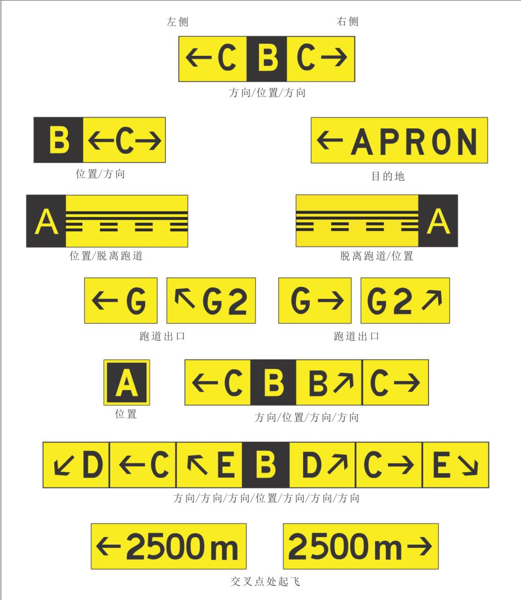

图5-31信息标记牌

5.4.1.7拟在下列情况下使用的标记牌必须按附录4的规定予以照明；

跑道视程条件小于800m；或

在夜间用于仪表跑道；或

c）在夜间用于基准代码为3或4的非仪表跑道。

5.4.1.8拟在夜间用于基准代码为1或2的非仪表跑道的标记牌必须按附录4的规定做成逆向反光的和/或予以照明。

5.4.1.9可变内容标记牌在不使用时必须展示一片空白。

5.4.1.10在出现故障时，可变内容标记牌必须不至显示出可能导致驾驶员或车辆司机做出不安全动作的信息。

5.4.1.11建议：在可变内容标记牌上从一个通知改变到另一个通知的时间应尽可能地短，不得超过5秒。

#### 5.4.2 强制性指令标记牌

注：强制性指令标记牌的图形说明，见图5-30。在跑道/滑行道相交处的标记牌位置的示例见图5-32。

应用

5.4.2.1在需要指示行进中的航空器或车辆非经机场管制塔台许可不得越过之处必须设置一个强制性指令标记牌。

5.4.2.2强制性指令标记牌必须包括跑道号码标记牌、I类、Ⅱ类或类等待位置标记牌、跑道等待位置标记牌、道路等待位置标记牌和“禁止进入”标记牌。

注：关于道路等待位置标记牌的规范，见5.4.7。

5.4.2.3在跑道/跑道或滑行道/跑道相交处，必须设跑道号码标记牌来补充“A”型跑道等待位置标志。

5.4.2.4“B”型跑道等待位置标志必须用一块I类、Ⅱ类或类等待位置标记牌加以补充。

5.4.2.5在按3.12.3设立的跑道等待位置设置的“A"型跑道等待位置标志必须用一块跑道等待位置标记牌加以补充。

注：关于跑道等待位置标志的规定，见5.2.10。

5.4.2.6建议：在滑行道/跑道相交处设置的跑道号码标记牌应在其外侧距滑行道最远处的适当位置用一块位置标记牌加以补充。

注：关于位置标记牌的特性，见5.4.3。

5.4.2.7当需要禁止进入一个地区时，必须设置一块“禁止进入”标记牌。

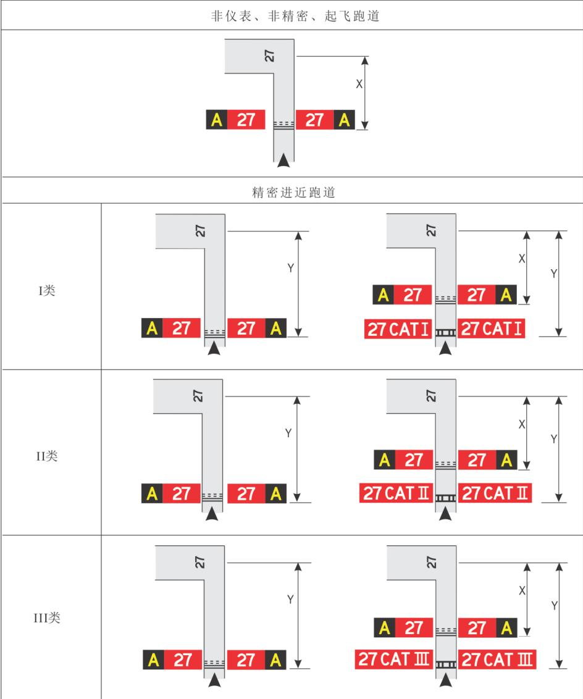

注：距离X是按表3-2确定的，距离Y是根据ILS/MLS的临界敏感区的边界确定的。

图5-32在滑行道/跑道相交处的标记牌位置的示例

位置

5.4.2.8必须在滑行道/跑道相交处或跑道/跑道相交处的跑道等待位置标志的每一侧设置跑道号码标记牌，标记牌面对趋向跑道的方向。

5.4.2.9I类、Ⅱ类或Ⅲ类等待位置标记牌必须设置在跑道等待位置标志的每一侧，标记牌面对趋向临界区的方向。

5.4.2.10“禁止进入”标记牌必须设置在“禁止进入”地区的起始处的滑行道两侧，标记牌面向驾驶员。

5.4.2.11跑道等待位置标记牌必须设置在按3.12.3设置的跑道等待位置的两侧，标记牌面对趋向障碍物限制面或ILS/MLS临界/敏感区的方向（视情况而定）。

特性

5.4.2.12强制性指令标记牌必须为红底白字。

5.4.2.13建议：由于环境或其他因素，强制性指令标记牌文字符号需要突出其鲜明性时，白色文字符号的外缘应加黑色边框。跑道基准代码1和2的黑色边框宽度为10mm，跑道基准代码3和4的黑色边框宽度为20mm。

5.4.2.14跑道号码标记牌上的文字符号必须包括相交跑道两端的跑道识别号码，并按观看标记牌的方向适当安排号码顺序。但靠近跑道一端的跑道号码标记牌可仅显示该跑道端的识别号码。

5.4.2.15I类、Ⅱ类、Ⅲ类或I/III联合等待位置标记牌上的文字符号必须包括相交跑道的跑道识别号码，后面随CATI、CATII、CATIⅢ或CATII/III（视情况而定）。

5.4.2.16“禁止进入”标记牌上的符号必须符合图5-30。

5.4.2.17按3.12.3设置的跑道等待位置处的跑道等待位置标记牌上的文字符号必须包括滑行道识别代码和一个数字。

5.4.2.18如果设立了标记牌，则必须采用图5-30的文字/符号。

#### 5.4.3 信息标记牌

注：信息标记牌的示例，见图5-31。

应用

5.4.3.1在运行需要用一块标记牌标明一个特定位置或提供路由（方向或目的地）信息时，必须设置一块信息标记牌。

5.4.3.2信息标记牌必须包括方向标记牌、位置标记牌、目的地标记牌、跑道出口标记牌、脱离跑道标记牌和短距起飞标记牌。

5.4.3.3当运行需要标明跑道出口时，必须设置一块跑道出口标记牌。

5.4.3.4当出口滑行道上未设有滑行道中线灯，而且需要向离开跑道的驾驶员标明ILS/MLS临界/敏感区的边界或内过渡面的低边（取距离跑道中线较远者）时，必须设置一块脱离跑道标记牌。

注：关于滑行道中线灯颜色代码规范，见5.3.17。

5.4.3.5建议：当运行需要标明交叉点处起飞的剩余可用起飞滑跑距离(TORA）时，应设一块交叉点处起飞标记牌。

5.4.3.6建议：在有必要时，应设一块目的地标记牌以标明前往机场内某一特定目的地，诸如货运区、通用航空等的方向。

5.4.3.7当拟在一滑行道交叉点之前提供路由信息时，必须设置一块同时显示位置及方向的标记牌。

5.4.3.8当运行需要标明在一交叉处的滑行道的代号和方向时，必须设置一块方向标记牌。

5.4.3.9建议：在中间等待位置应设置一位置标记牌。

5.4.3.10除在跑道/跑道相交处外，必须随同每一跑道号码标记牌设置一块位置标记牌。

5.4.3.11必须随同每一方向标记牌设置一块位置标记牌，只有航空研究表明不需要时才可省略。

5.4.3.12建议：在有必要时，应设一块位置标记牌以标明机坪出口处的滑行道或相交点以远的滑行道。

5.4.3.13建议：在有必要标明滑行道中断于一个T形之类的相交点时，应使用一个路障、方向标记牌和/或其他适当的目视助航设施。

位置

5.4.3.14除5.4.3.16和5.4.3.24规定的情况外，只要实际可行，信息标记牌必须按照表5-5设在滑行道的左侧。

5.4.3.15在滑行道相交处，信息标记牌必须设在相交处之前并在中间等待位置标志线的延长线上。如未设有中间等待位置标志，标记牌至相交滑行道中线的距离必须在基准代码为3或4时不小于60m；在基准代码为1或2时不小于40m。

注：设在滑行道相交处以远的位置标记牌可设在滑行道的任何一侧。

5.4.3.16跑道出口标记牌必须设在跑道出口的同一侧（左或右）并按表5-5定位。

5.4.3.17跑道出口标记牌必须设在跑道与出口滑行道相交切点之前，标记牌至切点的距离必须在基准代码为3或4时不小于60m：在基准代码为1或2时不小于30m。

5.4.3.18脱离跑道标记牌必须至少设在滑行道的一侧，标记牌至跑道中线的距离必须不小于下列中的较大者：

跑道中线至ILS/MLS临界/敏感区的边界的距离；或

b）跑道中线至内过渡面低边的距离。

5.4.3.19与脱离跑道标记牌合设的位置标记牌必须设在脱离跑道标记牌的外侧。

5.4.3.20交叉点处起飞标记牌必须设置在入口滑行道的左侧。标记牌至跑道中线的距离必须在基准代码为3或4时不小60m；在基准代码为1或2时不小于45m。

5.4.3.21与跑道号码标记牌合设的滑行道位置标记牌必须位于跑道号码标记牌的外侧。

5.4.3.22建议：目的地标记牌通常不应与位置或方向标记牌合设。

5.4.3.23除位置标记牌外，信息标记牌必须不与强制性指令标记牌合设。

5.4.3.24建议：用以标明滑行道中止于一个T形相交点的路障、方向标记牌和/或其他适当的目视助航设施应设在中止的滑行道终端的对面。

## 特性

5.4.3.25除位置标记牌外，信息标记牌必须为黄底黑字。

5.4.3.26位置标记牌必须为黑底黄字，独立安装时还必须加一黄色边框。

5.4.3.27跑道出口标记牌上的文字符号必须包括出口滑行道的代码和一个标明应遵行方向的箭头。

5.4.3.28脱离跑道标记牌上必须展示如图5-31所示的A型跑道等待位置标志。

5.4.3.29交叉点处起飞标记牌上的文字符号必须包括一个以米为单位标明剩余可用起飞滑跑距离的数字信息，外加一个方向和位置适当的标明起飞方向的箭头，如图5-31所示。

5.4.3.30目的地标记牌上的文字符号必须包括标明目的地的字母、字母数字或数字信息，外加一个标明前进方向的箭头，如图5-31所示。

5.4.3.31方向标记牌上的文字符号必须包括标明滑行道（一条或几条）的字母或字母数字，外加一个或几个方向适当的箭头，如图5-31所示。

5.4.3.32位置标记牌上的文字符号须包括航空器当时所在的或正在进入的滑行道、跑道或其他铺筑面的识别代码，但不得有箭头。

5.4.3.33建议：在有必要标明同一滑行道上的一系列中间等待位置时，位置标记牌上的文字符号应包括该滑行道的识别代码和一个数字。

##### 5.4.3.34 在一块位置标记牌与多块方向标记牌合设时：

a)所有指向左转的方向标记牌必须设在位置标记牌的左侧，所有指向右转的方向标记牌必须设在位置标记牌的右侧，只有在与一条滑行道相交的情况下方向标记牌才可设在左侧；

b)方向标记牌的布置应使各个方向箭头偏离垂直线的程度随着相应滑行道方向偏离所在滑行道方向的程度的增大而增大；

如所在滑行道的方向在穿越交叉点后有显著改变，应靠近位置标记牌再设一块所在滑行道的方向标记牌；

d)相邻方向标记牌应如图5-31所示用黑色垂直分界线隔开。

5.4.3.35滑行道必须由仅在一个机场使用一次的一个识别代码加以标明，识别代码由一个字母、两个字母、或一个或多个字母与一个数字的组合构成。

5.4.3.36建议：在用识别代码标明滑行道时，应尽可能避免使用诸如“内侧”和“外侧”这类文字。

5.4.3.37在用识别代码标明滑行道时，须避免使用字母I、0和X，以避免与数字1、0和关闭标志相混淆。

5.4.3.38在运转区内单独使用数字的情况必须只适用于跑道编号。

5.4.3.39建议：停机坪机位识别代码不应与滑行道识别代码相同。

#### 5.4.4 VOR机场校准点标记牌

## 应用

5.4.4.1当设有VOR机场校准点时，必须以VOR机场校准点标志和VOR机场校准点标记牌来标明。

注：关于VOR机场校准点标志，见5.2.12。

## 位置

5.4.4.2VOR机场校准点标记牌必须尽可能地靠近校准点，使得从正确地位于VOR机场校准点标志上的航空器驾驶舱里能看得到标记牌上的字样。

特性

5.4.4.3VOR机场校准点标记牌必须含有在黄色背景上的黑色文字。

5.4.4.4建议：VOR机场校准点标记牌上的文字符号应符合图5-33所示可供选择者中之一，其中：

VOR 为缩写，标明这是VOR机场校准点；

116.3为该VOR无线电频率的一个示例：

147°是应在VOR校准点指示出的VOR方位角（精确到度）的一个示例；和

4.3 NM 为至与VOR装在一起的测距仪的距离（以海里为单位）的一个示例。

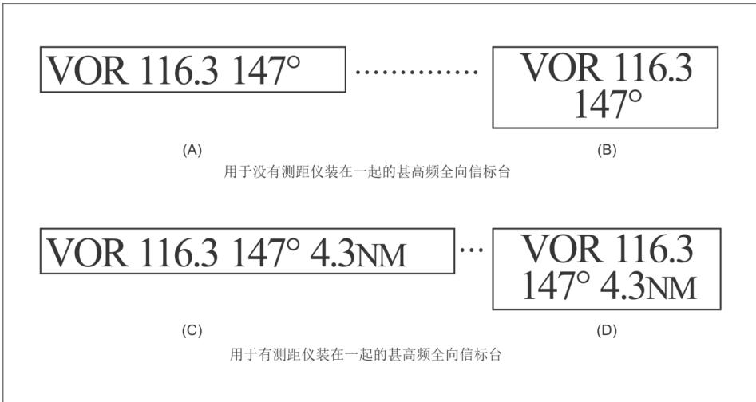

图5-33VOR机场校准点标记牌

注：标记牌上所示方位角值的容差，见附件10第I卷第1部分附篇1$ E。$ ，注意仅当多次定期校验表明它一直是在其宣布的方位角的土2°以内，才可供运行使用。

#### 5.4.5 机场识别标记牌

应用

5.4.5.1建议：在没有其他足够的目视识别手段的机场，应设置机场识别标记牌。

位置

5.4.5.2建议：机场识别标记牌应尽实际可行地设在机场内从水平以上各个方位均能容易认清之处。

特性

5.4.5.3机场识别标记牌上必须有机场的名称。

5.4.5.4建议：机场识别标记牌选用的颜色应在其背景的衬托下足够醒目。

5.4.5.5建议：标记牌的字体高度应不小于3m。

#### 5.4.6 航空器机位识别标记牌

应用

5.4.6.1建议：如可行，每一机位识别标志应用一块机位识别标记牌来作补充。

位置

5.4.6.2建议：机位识别标记牌应设置得使在航空器进入机位以前就能从驾驶舱清楚地看到。

特性

5.4.6.3建议：机位识别标记牌应为黄底黑字。

#### 5.4.7 道路等待位置标记牌

5.4.7.1在所有道路进入跑道的入口处必须设置道路等待位置标记牌。

位置

5.4.7.2道路等待位置标记牌必须设置在等待位置距道边1.5m处（按照当地交通规则，设在左侧或右侧）。特性

5.4.7.3道路等待位置标记牌必须为红底白字。

5.4.7.4道路等待位置标记牌上的文字符号必须用本国文字，符合当地的交通规则，并包括如下内容：

a）停住的要求；和

b)）在适当的情况下增加：

1）取得空中交通管制部门放行的要求；

2）位置代号。

注：道路等待位置标记牌的示例载于《机场设计手册》（Doc9157号文件）第4部分。

5.4.7.5拟供夜间使用的道路等待位置标记牌必须是逆向反光的或予以照明。

### 5.5 标志物

#### 5.5.1 概述

标志物必须是易折的。跑道或滑行道附近的标志物必须低得足以保持与螺旋桨和喷气飞机发动机吊舱的净距。

注1：为了防止标志物从基座断开后被吹走，有时用地锚或链条将其拴住。

注2：有关标志物的易折性的指导材料，见《机场设计手册》（Doc9157号文件）第6部分。

#### 5.5.2 无铺筑面跑道的边线标志物

应用

5.5.2.1建议：当无铺筑面的跑道的表面与周围地面比较，不能清楚地显示出跑道的范围时，应设置标志物。

位置

5.5.2.2建议：在设有跑道灯时，标志物应与灯具结合在一起。在未设跑道灯时，应用扁平长方形或锥形的标志物清晰地勾画出跑道的边界。

特性

5.5.2.3建议：扁平长方形标志物的尺寸应不小于1m×3m，并应安置得使其长边平行于跑道中线。锥形标志物的高度应不超过50cm。

#### 5.5.3 停止道边线标志物

应用

5.5.3.1建议：当停止道的表面与周围地面比较不能清楚地显示出停止道的范围时，应设置标志物。

特性

5.5.3.2停止道边线标志物与使用的跑道边线标志物必须有明显的不同，以保证这两种标志物不会被混淆。

注：由一些从跑道看去背面经过伪装的小块竖板组成的标志物已证明在运行上是可以接受的。

#### 5.5.4 积雪的跑道边线标志物

应用

5.5.4.1建议：当积雪跑道未能用其他方法标出其可用界限时，应采用积雪跑道的边线标志物标出其可用界限。

注：跑道灯可被用来标出跑道界限。

位置

5.5.4.2建议：积雪跑道的边线标志物应沿跑道两边设置，间距不大于100m，并对称于跑道中线，与中线的距离应使其与航空器翼尖和发动机有足够的净距。横贯跑道入口和末端应设置足够数量的标志物。

特性

5.5.4.3建议：积雪跑道的边线标志物应由醒目的物体诸如高约1.5m的常青树或轻型标志物组成。

#### 5.5.5 滑行道边线标志物

应用

5.5.5.1建议：基准代码为1或2的机场上，未设滑行道中线灯或边灯或滑行道中线标志物的滑行道，应设置滑行道边线标志物。

位置

5.5.5.2建议：滑行道边线标志物应至少设置在假定要设置的滑行道边灯的位置上。

特性

5.5.5.3滑行道边线标志物必须逆向反射蓝色光。

5.5.5.4建议：标志物的逆向反光表面在驾驶员看来应为长方形，面积应不小于150cm2。

5.5.5.5滑行道边线标志物必须是易折的。其高度必须低得足以保持与螺旋桨和喷气飞机发动机吊舱的净距。

#### 5.5.6 滑行道中线标志物

## 应用

5.5.6.1建议：在基准代码为1或2的机场上，未设滑行道中线灯或边灯或滑行道边线标志物的滑行道，应设置滑行道中线标志物。

5.5.6.2建议：在基准代码为3或4的机场上，未设滑行道中线灯但有必要加强滑行道中线标志所提供的引导的滑行道，应设置滑行道中线标志物。

位置

5.5.6.3建议：滑行道中线标志物至少应设置在假定要设置的滑行道中线灯的位置上。

注：关于滑行道中线灯的间距，见5.3.17.12。

5.5.6.4建议：滑行道中线标志物通常应设置在滑行道中线标志上，只有在实际上无法将其设在标志上时才可使标志物偏离标志不大于30cm。

特性

5.5.6.5滑行道中线标志物必须逆向反射绿色光。

5.5.6.6建议：标志物的逆向反光表面在驾驶员看来应为长方形，面积应不小于20cm2。

5.5.6.7滑行道中线标志物必须设计和安装得使其能经受航空器轮胎的滚压而不损坏，也不损坏航空器。

#### 5.5.7 无铺筑面的滑行道边线标志物

应用

5.5.7.1建议：在无铺筑面的滑行道的外貌与周围地面相比不能清晰地显示出滑行道的范围时，应设置标志物。

位置

5.5.7.2建议：在设有滑行道灯时，标志物应与灯具结合在一起。在未设滑行道灯时，应用锥形的标志物清晰地勾画出滑行道的边界。

#### 5.5.8 边界标志物

应用

5.5.8.1起飞着陆区内没有跑道的机场必须设置边界标志物。

## 位置

5.5.8.2边界标志物必须沿起飞着陆区的边界设置。如采用如图5-34所示的标志物，其间距必须不大于200m，如采用锥形标志物，间距必须约为90m，并在每一转角处设置一个标志物。

## 特性

5.5.8.3建议：边界标志物应为类似图5-34所示形状，或为高度不小于50cm，底部直径不小于75cm的锥形体。标志物的颜色看起来应与背景对比明显。应采用单一的橙色或单一的红色，或橙与白或红与白两种有反差的颜色，除非这些颜色与背景融成一片。

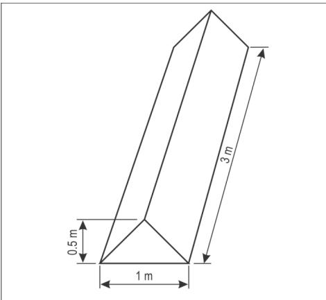

图5-34边界标志物

## 第6章标示障碍物的目视助航设施

### 6.1 需加标志和/或照明的物体

注：对障碍物的标志和/或照明是用以标示障碍物的存在以减少对航空器的危害。这样做并不一定能减少障碍物对航行的限制。

注2：在一个障碍物（或诸如风场等一组障碍物）上面或附近安装一个自动航空器探测系统，只在系统探测到航空器接近障碍物时进行照明，这可以减少当地居民遭受的光线照射。航空器探测系统的设计和安装指南载于Doc9157号文件《机场设计手册》第4部分。提供这种指南并不意味着必须提供此类系统。

#### 6.1.1 位于障碍物限制面的横向边界内的物体

6.1.1.1在机场活动区内，所有车辆和移动物体除航空器外均为障碍物，必须予以标志，如在夜间或低能见度条件下使用还必须加以照明，只有仅在机坪上使用的航空器服务设备和车辆可以例外。

6.1.1.2在机场活动区内的立式航空地面灯必须予以标志，使其在昼间鲜明醒目。在活动区内的立式灯具和标记牌上不得设置障碍灯。

6.1.1.3在表3-1第11或12栏中规定的至滑行道、机坪滑行道或机位滑行通道的中线的间隔距离范围内的所有障碍物，必须予以标志，如果这些滑行道、机坪滑行道或或航空器机位滑行通道在夜间使用，还必须加以照明。

6.1.1.4建议：距离起飞爬升面内边3000m以内、突出于该面之上的固定障碍物，应予以标志；如跑道供夜间使用，还应予以照明，除非：

a）当该障碍物已被另一固定障碍物所遮蔽时，可略去此种标志和照明；

b）当该障碍物超出周围地面高度不大于150m并设有在昼间运行的A型中光强障碍灯时，可将标志略去；

c)当该障碍物设有在昼间运行的高光强障碍灯时，可将标志略去；和

d）当该障碍物为一灯塔，并经航空研究表明该灯塔的灯光已足够时，可将标志略去。

6.1.1.5建议：为保证飞机避开邻近起飞爬升面的障碍物以外的固定物，在认为必要时应对此种固定物加以标志；如跑道供夜间使用，还应予以照明：仅在下情况下可将标志略去：

a)固定物在昼间有A型中光强障碍灯照明且其高度未超过周围地面150m；或

b)固定物在昼间有高光强障碍灯照明。

6.1.1.6距离进近面内边3000m以内、突出于该面或过渡面之上的固定障碍物，必须予以标志：如跑道供夜间使用，还必须予以照明；除非：

a)当该障碍物已被另一固定障碍物所遮蔽时，可以略去这些标志和照明；

b)当该障碍物超出周围地面高度不大于150m并设有在昼间运行的A型中光强障碍灯时，可将标志略去；

c 当该障碍物设有在昼间运行的高光强障碍灯时，可将标志略去；和

d）当该障碍物为一灯塔，并经航空研究表明该灯塔的灯光已足够时，可将障碍灯略去。

6.1.1.7建议：突出于水平面之上的固定障碍物应予以标志；如跑道供夜间使用，还应予以照明；除非：

a）在下列情况下可将标志和障碍灯略去：

1）当该障碍物已被另一固定障碍物所遮蔽时；或

2）对于由不可移除的物体或地形构成的大片障碍物范围，已制定有保证规定的飞行航迹具有安全垂直净距的飞行程序；或

3）经航空研究表明该障碍物对航行无关重要。

b）当障碍物在昼间有A型中光强障碍灯照明且高度未超出周围地面150m时，可将标志略去；

c）当障碍物在昼间有高光强障碍灯照明时，可将标志略去；

d）当障碍物为一灯塔，并经航空研究表明该灯塔的灯光已足够时，可将障碍灯略去。

6.1.1.8突出于障碍物保护面之上的固定物体，必须予以标志；如跑道供夜间使用，还必须予以照明。

注：关于障碍物保护面，见5.3.5。

6.1.1.9建议：位于障碍物限制面以内的其他物体（这包括与目视航路相邻的物体，如水道或公路），如经航空研究认为这些物体可能构成对航空器的危害，则应予以标志和/或照明。

注：见4.4.2中的注。

6.1.1.10建议：横跨河流、水道、山谷或公路的架空电线或电缆等，如经航空研究认为这些电线或电缆可能构成对航空器的危害，则应予以标志并对其支撑杆塔予以标志和照明。

#### 6.1.2 位于障碍物限制面的横向边界外的物体

6.1.2.1建议：符合4.3.2规定的障碍物，应予以标志和照明，但在该障碍物昼间有高光强障碍灯照明时，可将标志略去。

6.1.2.2建议：位于障碍物限制面以外的其他物体（这包括与目视航路相邻的物体，如水道或公路），如经航空研究认为这些物体可能构成对航空器的危害，则应予以标志和/或照明。

6.1.2.3建议：横跨河流、水道、山谷或公路的架空电线或电缆等，如经航空研究认为这些电线或电缆可能构成对航空器的危害，则应予以标志并对其支撑杆塔予以标志和照明。

### 6.2 物体的标志和/或照明

#### 6.2.1 概述

6.2.1.1必须用低光强、中光强或高光强的障碍灯或其组合来标明按6.1规定必须予以照明的物体的存在。

6.2.1.2A型、B型、C型、D型和E型低光强障碍灯，A型、B型和C型中光强障碍灯，以及A型和B型高光强障碍灯必须符合表6-1和附录1中的规范。

6.2.1.3每一高度层的低光强、中光强或高光强障碍灯的数量和布置必须做到在每一个方位角都能将物体标明出来。在有一个灯在某一方向被物体的另一部分或另一物体遮挡时，必须在遮挡灯光的该另一物体或该物体的该部分上增设障碍灯以保持应予标明的物体的基本轮廓。如果被遮挡的灯对于应予标明的物体的基本轮廓的显示不起作用，则可将该灯取消。

#### 6.2.2 可移动物体

标志

6.2.2.1所有应予标志的可移动的物体，必须予以涂色或展示旗帜。

## 用颜色标志

6.2.2.2建议：当用颜色标志可移动的物体时，应采用明显的单色，应急车辆以红色或黄绿色为宜，服务车辆以黄色为宜。

## 用旗帜标志

6.2.2.3用以标志可移动物体的旗帜必须展示在物体的顶部或最高边缘的四周。标志旗必须不增大所标志物体的危害。

6.2.2.4用以标志可移动物体的旗帜的每一边必须不小于0.9m，并且必须为不同颜色的棋盘格式，每个方格的边长不小于0.3m。棋盘格式标志的颜色必须相互反差鲜明，并与看到它们时的背景反差鲜明。必须采用橙色与白色相间，或红色与白色相间的颜色，除非它们与背景颜色相近似。

表6-1障碍灯的特性

<html><body><table border="1"><tr><td>1</td><td>2</td><td>3</td><td>4</td><td>5</td><td>6</td><td>7</td></tr><tr><td rowspan="2">障碍灯型号</td><td rowspan="2">颜色</td><td rowspan="2">信号型式 (闪光频率)</td><td colspan="3">给定背景亮度 (b)下的峰值光强 (cd)</td><td rowspan="2">光束 分布表</td></tr><tr><td>昼间 (>500 cd/m2)</td><td>黄昏和黎明 (50~500 cd/m2)</td><td>夜间 (<50 cd/m2)</td></tr><tr><td>A型低光强 (固定障碍物)</td><td>红</td><td>恒定光</td><td>不适用</td><td>不适用</td><td>10</td><td>表6-2</td></tr><tr><td>B型低光强 （固定障碍物）</td><td>红</td><td>恒定光</td><td>不适用</td><td>不适用</td><td>32</td><td>表6-2</td></tr><tr><td>C型低光强 (移动障碍物)</td><td>黄/蓝(a)</td><td>闪光 (60~90 fpm)</td><td>不适用</td><td>40</td><td>40</td><td>表6-2</td></tr><tr><td>D型低光强 （“跟随我”车）</td><td>黄</td><td>闪光 (60~90 fpm)</td><td>不适用</td><td>200</td><td>200</td><td>表6-2</td></tr><tr><td>E型低光强</td><td>红</td><td>闪光 (c)</td><td>不适用</td><td>不适用</td><td>32</td><td>表6-2 (B型)</td></tr><tr><td>A型中光强</td><td>白</td><td>闪光 (20~60 fpm)</td><td>20 000</td><td>20 000</td><td>2000</td><td>表6-3</td></tr><tr><td>B型中光强</td><td>红</td><td>闪光 (20~60 fpm)</td><td>不适用</td><td>不适用</td><td>2000</td><td>表6-3</td></tr><tr><td>C型中光强</td><td>红</td><td>恒定光</td><td>不适用</td><td>不适用</td><td>2 000</td><td>表6-3</td></tr><tr><td>A型高光强</td><td>白</td><td>闪光 (40~60 fpm)</td><td>200 000</td><td>20 000</td><td>2000</td><td>表6-3</td></tr><tr><td>B型高光强</td><td>白</td><td>闪光 (40~60 fpm)</td><td>100 000</td><td>20 000</td><td>2 000</td><td>表6-3</td></tr></table></body></html>

a)见6.2.2.6。

b)对于闪光灯，指按《机场设计手册》（Doc9157号文件）第4部分确定的有效光强。

c)用于按照齿轮箱照明相同速率闪光的风力发电机。

表6-2低光强障碍灯的光束分布

<html><body><table border="1"><tr><td rowspan="2"></td><td rowspan="2">最小光强(a)</td><td rowspan="2">最大光强(a)</td><td colspan="2">垂直光束扩散角 (f)</td></tr><tr><td>最小光束扩散角</td><td>光强</td></tr><tr><td>A型</td><td>10cd (b)</td><td>不适用</td><td>10^{\}$</td><td>5cd</td></tr><tr><td>B型</td><td>32cd (b)</td><td>不适用</td><td>10^}$</td><td>16cd</td></tr><tr><td>C型</td><td>40cd (b)</td><td>400cd</td><td>$12^{cid)</td><td>20cd</td></tr><tr><td>D型</td><td>200cd (c)</td><td>400cd</td><td>不适用(e)</td><td>不适用</td></tr></table></body></html>

注：本表未包括建议的水平扩散角。6.2.1.3要求覆盖障碍物周围360°。因此，为满足此项要求需要的灯具数量将取决于每一个灯具的水平扩散角和障碍物的形状。所以，使用水平扩散角较小的灯具时将需要较多的灯具。

a)水平面360°内。对于闪光灯，光强被读为按《机场设计手册》（Doc9157号文件）第4部分确定的有效光强。

b)在仰角2°至10°之间。灯具水平时，仰角以水平面为基准。

c)在仰角2°至20°之间。灯具水平时，仰角以水平面为基准。

d)峰值光强应大约位于仰角2.5°。

e)峰值光强应大约位于仰角17°。

f)光束扩散角被定义为：水平面与光强超过在“光强”一栏中所提光强的方向之间的夹角。

表6-3根据表6-1中的基准光强确定的中、高光强障碍灯的光束分布

<html><body><table border="1"><tr><td rowspan="5">基准 光强</td><td colspan="5">最低要求</td><td colspan="5">建议</td></tr><tr><td colspan="3">仰角 (b)</td><td colspan="2" rowspan="2">垂直光束扩散角 (c)</td><td>仰角 (b)</td><td colspan="2">垂直光束扩散角 (c)</td><td colspan="2" rowspan="2"></td></tr><tr><td colspan="2">$0^</td><td>-1\}$</td><td>00</td><td>-1\}$</td><td>-10\}$</td><td></td></tr><tr><td>最小平 均光强 (a)</td><td>最小 光强 (a)</td><td>最小 光强 (a)</td><td>最小 光束 扩散角</td><td>光强 (a)</td><td>最大 光强 (a)</td><td>最大 光强 (a)</td><td>最大 光强 (a)</td><td>最大 光束 扩散角</td><td>光强 (a)</td></tr><tr><td>200 000</td><td>200 000</td><td>150 000</td><td>75 000</td><td>3°</td><td>75 000</td><td>250 000</td><td>112 500</td><td>7 500</td><td>7°</td><td>75 000</td></tr><tr><td>100 000</td><td>100 000</td><td>75 000</td><td>37 500</td><td>3°</td><td>37 500</td><td>125 000</td><td>56 250</td><td>3 750</td><td>7°</td><td>37 500</td></tr><tr><td>20 000</td><td>20 000</td><td>15 000</td><td>7 500</td><td>3°</td><td>7 500</td><td>25 000</td><td>11 250</td><td>750</td><td>不适用</td><td>不适用</td></tr><tr><td>2000</td><td>2 000</td><td>1 500</td><td>750</td><td>3°</td><td>750</td><td>2 500</td><td>1 125</td><td>75</td><td>不适用</td><td>不适用</td></tr><tr><td></td><td></td><td></td><td></td><td></td><td></td><td></td><td></td><td></td><td></td><td></td></tr></table></body></html>

注：本表未包括建议的水平扩散角。6.2.1.3要求覆盖障碍物周围360°。因此，为满足此项要求需要的灯具数量将取决于每一个灯具的水平扩散角和障碍物的形状。所以，使用水平扩散角较小的灯具时将需要较多的灯具。

a)水平面360°内。所有光强用坎德拉(烛光）表示。对于闪光灯，光强被读为按《机场设计手册》（Doc9157号文件）第4部分确定的有效光强。

b)灯具水平时，仰角以水平面为基准。

c)光束扩散角被定义为：水平面和光强超过在“光强”一栏中所提光强的各方向之间的夹角。

注：扩展的光束扩散角在特定构型下可能是必要的，并且一项航空研究已为之提供了依据。

## 照明

6.2.2.5除航空器外，在车辆和移动物体上均必须设置C型低光强障碍灯。

注：航空器展示的灯光，见附件2。

6.2.2.6在应急和安保用的车辆上显示的C型低光强障碍灯必须发出蓝色闪光，而在其他车辆上显示的C型低光强障碍灯必须发出黄色闪光。

6.2.2.7引导车上须设置D型低光强障碍灯。

6.2.2.8在诸如旅客登机桥之类的机动性有限的物体上的低光强障碍灯必须是红色恒定发光灯，并且至少必须符合表6-1中A型低光强障碍灯的规范，其光强在附近灯光的光强和正常观看该物体的一般照明水平的条件下必须足以保证物体的鲜明度。

#### 6.2.3 固定物体

注：固定物体风力发电机单独在6.2.4中进行说明，固定物体架空电线、电缆等和支撑杆塔单独在6.2.5中进行说明。

## 标志

6.2.3.1所有应予标志的固定物体，只要实际可行，必须用颜色标志；但如实际不可行，则必须在物体上或物体上方展示标志物或旗帜，除非该物体的形状、大小和颜色已足够明显，不需再加标志。

## 用颜色标志

6.2.3.2建议：表面基本上不间断的、在任一垂直面上投影的尺寸等于或超过4.5m的物体，应用颜色将其涂成棋盘格式。棋盘格式应由每边不小于1.5m、亦不大于3m的长方形组成，棋盘角隅处用较深的颜色。棋盘格的颜色应相互反差鲜明，并应与看到它时的背景反差鲜明。应采用橙色与白色相间或红色与白色相间的颜色：除非这些颜色与背景相近似。（见图6-1）。

6.2.3.3建议：如为下列情况的物体应涂以反差增强型相间色带：

a）表面基本上不间断、且其一边（水平或垂直）的尺寸大于1.5m、而另一边（水平或垂直）的尺寸小于4.5m的物体；或

b）其一水平边或一垂直边的尺寸大于1.5m的骨架式物体。

色带应垂直于长边，其宽度约为最长边的1/7或30m，取其较小值。色带的颜色应与看到它时的背景形成反差。应采用橙色与白色，仅当与看到它们时的背景反差不明显时为例外。物体的端部色带应为较深的颜色。（见图6-1和图6-2)

注：表6-4显示了一个用奇数色带确定色带宽度的方案，这样能使顶部和底部的色带为较深的颜色。

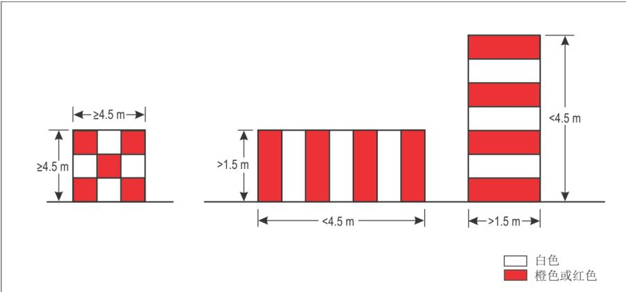

图6-1基本标志形式

表6-4标志色带的宽度

<html><body><table border="1"><tr><td colspan="3">最长边的尺寸</td></tr><tr><td>大于</td><td>不超过</td><td>色带宽度</td></tr><tr><td>1.5 m</td><td>210m</td><td>最长边的1/7</td></tr><tr><td>210m</td><td>270m</td><td>最长边的1/9</td></tr><tr><td>270 m</td><td>330m</td><td>最长边的1/11</td></tr><tr><td>330m</td><td>390m</td><td>最长边的1/13</td></tr><tr><td>390 m</td><td>450 m</td><td>最长边的1/15</td></tr><tr><td>450m</td><td>510m</td><td>最长边的1/17</td></tr><tr><td>510 m</td><td>570 m</td><td>最长边的1/19</td></tr><tr><td>570 m</td><td>630m</td><td>最长边的1/21</td></tr></table></body></html>

6.2.3.4建议：在任一垂直面上投影的长宽均小于1.5m的物体，应涂满明显的单色。应采用橙色或红色，除非这些颜色与背景色相似。

注：对有些背景，可能需采用橙色或红色以外的颜色，以获得充分的反差。

## 用旗帜标志

6.2.3.5用以标志固定物体的旗帜必须展示在物体的周围、顶部或最高边缘的四周。当用旗帜标志巨大物体或一组密集的物体时，必须至少每15m设置一面标志旗。标志旗必须不增大所标志物体的危害。

6.2.3.6用以标志固定物体的旗帜的每一边必须不小于0.6m。

$$ 灯的层数 =N=\frac{Y(metres)}{X(metres)}$$

图6-2高结构物的标志和照明示例

6.2.3.7建议：用以标志固定物体的旗帜应为橙色，或为橙色与白色，或红色与白色的两个三角形的组合；如上述颜色与背景颜色相近似，则应采用其他更鲜明的颜色。

## 用标志物标志

6.2.3.8在物体上或邻近物体上展示的标志物必须位于醒目的位置，以保持物体的一般轮廓，并且在天气晴朗时、在航空器有可能接近它的所有方向上至少从空中1000m、从地面300m的距离上必须能够被识别出来。标志物的形状和醒目的程度必须保证其不致被误认为是用来传达其他信息的标志物，同时它们必须不增加其所标志的物体的危害性。

6.2.3.9建议：标志物应是一种颜色。设置时，应使白色及红色或白色及橙色的标志物交替叉开。所选的颜色应与看到它时的背景形成反差。

## 照明

6.2.3.10对一个应予以照明的物体，一个或多个低、中光强或高光强障碍灯必须尽实际可行地靠近物体的顶端设置。

注：附录5提供了应如何组合低、中光强和/或高光强障碍灯来标明障碍物的建议。

6.2.3.11建议：对烟囱或其他类似性质的构筑物，应将顶部的灯设置在顶部以下足够低的位置，使其受烟雾等的污染降至最小（见图6-2）。

6.2.3.12对于一个要用高光强障碍灯在昼间标明的带有长度超过12m的诸如天线或棒体之类的附属物的塔或天线构筑物，如果无法在附属物顶部设置高光强障碍灯，则必须将高光强障碍灯装在尽可能最高点，并且如实际可行，在附属物顶部装一个A型中光强障碍灯。

6.2.3.13对于应予以照明的一个大型物体或一组密集的物体：

a）如果它们超过一个水平的障碍物限制面（OLS）或位于一个障碍物限制面之外，其顶部灯的排列必须至少可显示出物体相对于障碍物限制面处于最高位置的或位于地面以上的点或边，并且可标示出物体的基本轮廓和范围：和

b)如果它们超出一个倾斜的障碍物限制面，其顶部灯的排列必须至少可显示出物体相对于障碍物限制面的最高点或最高边，并且可标示出物体的基本轮廓和范围。如有两个或多个同样高度的边缘，则必须标示出距离起飞着陆区最近的那个边缘。

6.2.3.14建议：当有关障碍物限制面为一斜面，而物体突出于障碍物限制面之上最多的一点并非物体本身的最高点时，应在物体的最高点增设障碍灯。

6.2.3.15如果采用灯具标示一个大型物体或一组密集的物体的基本轮廓，并且：

a）采用低光强障碍灯，其纵向间距必须不大于45m；和

b）采用中光强障碍灯，其纵向间距必须不大于 900m。

6.2.3.16设在一个物体上的A型高光强障碍灯，以及A型和B型中光强障碍灯必须同时闪光。

6.2.3.17建议：A型高光强障碍灯的安装调置角应符合表6-5的规范。

注：高光强障碍灯是准备无论在白昼或夜间都使用的。需要注意保证其灯光不致引起令人不适的眩目。关干高光强障碍灯的设计、定位和运行的指导材料，见《机场设计手册》（Doc9157号文件）第4部分。

6.2.3.18建议：如果有关当局认为在夜间使用A型高光强障碍灯或A型中光强障碍灯可能造成对机场附近（约10km半径范围内）驾驶员的眩目或形成影响环境的重大问题，则应采用双障碍灯系统。双障碍灯系统应由在昼间、黄昏和黎明使用的A型高光强障碍灯或A型中光强障碍灯（视情况而定）和在夜间使用的B型或C型中光强障碍灯组成。

## 高度超出地面不到45m的物体的照明

6.2.3.19建议：不太大的高出周围地面不及45m的物体应用A型或B型低光强障碍灯予以照明。

6.2.3.20建议：在使用A型或B型低光强障碍灯可能不足或需要提前发出特别的警告时，应使用中光强或高光强的障碍灯。

6.2.3.21建议：B型低光强障碍灯应按照6.2.3.22单独使用或与B型中光强障碍灯组合使用。

6.2.3.22建议：大片的物体应用A型、B型或C型中光强障碍灯予以照明。A型和C型中光强障碍灯应单独使用，而B型中光强障碍灯应单独使用或与B型低光强障碍灯组合使用。

注：一组建筑物被视为大片的物体。

## 高度超出地面45m至150m以下的物体的照明

6.2.3.23建议：应使用A型、B型或C型中光强障碍灯。A型和C型中光强障碍灯应单独使用，而B型中光强障碍灯应单独使用或与B型低光强障碍灯组合使用。

6.2.3.24由A型中光强障碍灯标示的障碍物的顶部比周围地面或附近建筑物（当障碍物被多个建筑物包围时）的顶部标高高出105m以上时，必须在中间增设障碍灯。增设的中间层障碍灯必须视情况在顶部障碍灯与地面或附近建筑物顶部标高之间尽可能地以不大于105m的等距离设置。

6.2.3.25由B型中光强障碍灯标示的障碍物的顶部比周围地面或附近建筑物（当障碍物被多个建筑物包围时）的顶部标高高出45m以上时，必须在中间增设障碍灯。增设的中间层障碍灯必须为交替的B型低光强障碍灯和B型中光强障碍灯并视情况在顶部障碍灯与地面或附近建筑物顶部标高之间尽可能地以不大于52m的等距离设置。

6.2.3.26由C型中光强障碍灯标示的障碍物的顶部比周围地面或附近建筑物（当障碍物被多个建筑物包围时）的顶部标高高出45m以上时，必须在中间增设障碍灯。增设的中间层障碍灯必须视情况在顶部障碍灯与地面或附近建筑物顶部标高之间尽可能地以不大于52m的等距离设置。

6.2.3.27在使用A型高光强障碍灯时，必须将障碍灯以不大于105m的间隔均匀地设置在地面与按6.2.3.10规定的顶部障碍灯之间，但在物体被多个建筑物包围时，可用附近建筑物的顶部标高代替地面来确定应设障碍灯的层数。

## 高度超出地面150m或150m以上的物体的照明

6.2.3.28建议：高出周围地面150m以上的物体经航空研究表明应用高光强障碍灯照明才能在昼间认出时应用A型高光强障碍灯标明它的存在。

6.2.3.29在使用A型高光强障碍灯时，必须将障碍灯以不大于105m的间隔均匀地设置在地面与按6.2.3.10规定的顶部障碍灯之间，但在物体被多个建筑物包围时，可用附近建筑物的顶部标高代替地面来确定应设障碍灯的层数。

6.2.3.30建议：如果有关当局认为在夜间使用A型高光强障碍灯可能造成对机场附近（约10km半径范围内）驾驶员的眩目或形成影响环境的重大问题，C型中光强障碍灯应单独使用，而B型中光强障碍灯应单独使用或与B 型低光强障碍灯组合使用。

6.2.3.31由A型中光强障碍灯标示的障碍物必须在中间增设障碍灯。增设的中间层障碍灯必须视情况在顶部障碍灯与地面或附近建筑物顶部标高之间尽可能地以不大于105m的等距离设置。

6.2.3.32由B型中光强障碍灯标示的障碍物必须在中间增设障碍灯。增设的中间层障碍灯必须为交替的B型低光强障碍灯和B型中光强障碍灯，并视情况在顶部障碍灯与地面或附近建筑物顶部标高之间尽可能地以不大于52m 的等距离设置。

6.2.3.33由C型中光强障碍灯标示的障碍物必须在中间增设障碍灯。增设的中间层障碍灯必须视情况在顶部障碍灯与地面或附近建筑物顶部标高之间尽可能地以不大于52m的等距离设置。

#### 6.2.4 风力发电机

6.2.4.1风力发电机如被确定为障碍物，必须加以标志和/或照明。

注1：如果国家认为其他照明或标志实属必要，可增设照明或标志。

注2：见4.3.1和4.3.2。

标志

6.2.4.2建议：除航空研究表明应用其他颜色标示外，风力发电机的转子叶片、机舱和杆塔上部2/3的部分应涂成白色。

## 照明

6.2.4.3建议：对于风力发电场，即两个或更多一组的风力发电机，如照明实属必要，风力发电场应被视为大型障碍物并应安装灯具用以：

a）标示风力发电场的边界；

b）遵守6.2.3.15中对边界上灯具之间最大间距的规定，除非专项评估表明可使用更大的间距；

c）使用闪光灯时它们会在整个风力发电场同时闪光；

d）可以识别风力发电场内明显位于较高位置的风力发电机，无论这些发电机位于何处；和

e）在a)，b)和d)规定的地点，遵守以下标准：

i）对于整体高度低于150米的风力发电机（轮毂高度加上垂直叶片高度），应在齿轮箱安装中光强照明；

ii)对于整体高度150米至315米的风力发电机，除了在齿轮箱安装中光强度灯具之外，应增设第二套灯具，作为照明灯具出现故障时的代用品。这些灯具应按照确保任一灯具的输出不被其他灯具遮挡的方式安装；和

iii)此外，对于整体高度150米至315米的风力发电机，应根据6.2.1.3的规定在齿轮箱高度一半中间处安装至少3个低强度E型灯。如果航空研究显示低强度E型灯不合适，则可使用低强度A或B型灯。

注：以上6.2.4.3e）不涉及整体高度超过315米的风力发电机。对于这种风力发电机，可能需要经航空研究确定增设标志和照明。

6.2.4.4建议：障碍灯应安装在发电机机舱上，并使从任何方向接近的航空器都能不被遮挡地看到。

6.2.4.5建议：如一个单一风力发电机或风力发电机短线的照明实属必要，安装应符合6.2.4.3（e）或按照航空研究的决定。

#### 6.2.5 架空电线、电缆等和支撑杆塔

标志

6.2.5.1建议：应予以标志的电线、电缆等应配有标志物；支撑杆塔应用颜色标志。

## 用颜色标志

6.2.5.2建议：架空电线、电缆等的支撑杆塔如果要求予以标志，则应根据6.2.3.1至6.2.3.4予以标志，但当杆塔在昼间有高光强障碍灯照明时，可将标志略去。

## 用标志物标志

6.2.5.3在物体上或邻近物体上展示的标志物必须位于醒目的位置，以保持物体的一般轮廓，并且在天气晴朗时、在航空器有可能接近它的所有方向上至少从空中1000m、从地面300m的距离上必须能够被识别出来。标志物的形状和醒目的程度必须保证其不致被误认为是用来传达其他信息的标志物，同时它们必须不增加其所标志的物体的危害性。

6.2.5.4建议：展示于架空的电线、电缆等上的标志物，应为球形，其直径不小于60cm。

6.2.5.5建议：两个连续的标志物或一个标志物与支承杆塔之间的间距，应与标志物的直径相适应；但在任何情况下，该间距应：

a）当标志物的直径为60 cm时，不超出30m，此值随标志物直径的增大而逐渐加大，直至

b）当标志物的直径为80 cm时，不超出35m，此值随标志物直径的增大进一步逐渐加大，直至

c）当标志物直径不小于130 cm时，不超出40m。

当涉及多条电线、电缆等时，标志物应设在不低于各该标志物所在的最高的架空线的高度上。

6.2.5.6建议：标志物应是一种颜色。设置时，应使白色及红色或白色及橙色的标志物交替叉开。所选的颜色应与看到它时的背景形成反差。

6.2.5.7建议：在已经确定应予标志的架空电线或电缆等上设置标志物为不实际可行时，应在其支撑杆塔上设置B型高光强障碍灯。

照明

6.2.5.8建议：应使用B型高光强障碍灯标明架空电线或电缆等的支撑杆塔的存在，如果：

a）航空研究表明必须用高光强障碍灯才能认出电线或电缆等的存在；或

b）业已发现在电线或电缆等上安装标志物不可行。

6.2.5.9在使用B型高光强障碍灯时，必须将障碍灯设置于下列三个高度层：

杆塔顶部；

电线或电缆悬垂线的最低点；和

上述两层之间的大致中间高度。

注：在某些情况下，这可能要求将灯设在杆塔以外。

6.2.5.10建议：标明架空电线或电缆等的支撑杆塔的存在的B型高光强障碍灯应顺序闪光；首先中层灯，然后顶层灯，最后底层灯。各层闪光之间的间隔时间应大致为下列比例：

<html><body><table border="1"><tbody><tr><td>闪光间隔</td><td>周期时间之比</td></tr><tr><td>中层灯与顶层灯</td><td>1/13</td></tr><tr><td>顶层灯与底层灯</td><td>2/13</td></tr><tr><td>底层灯与中层灯</td><td>10/13</td></tr></tbody></table></body></html>

注：高光强障碍灯是准备无论在白昼或夜间都使用的。需要注意保证其灯光不致引起令人不适的眩目。关于高光强障碍灯的设计、定位和运行的指导材料，见《机场设计手册》（Doc9157号文件）第4部分。

6.2.5.11建议：如果有关当局认为在夜间使用B型高光强障碍灯可能造成对机场附近（约10km半径范围内）驾驶员的眩目或形成影响环境的重大问题，则应采用双障碍灯系统。双障碍灯系统应由在昼间、黄昏和黎明使用的B 型高光强障碍灯和在夜间使用的B型中光强障碍灯组成。如果使用中光强灯，它们应与B型高光强障碍灯安装在同一高度。

6.2.5.12建议：B型高光强障碍灯的安装调置角应符合表6-5的规范。

表6-5高光强障碍灯安装调置角

<html><body><table border="1"><tr><td>灯具高出地面(AGL)</td><td>光强的峰值高于水平面的角度</td></tr><tr><td>大于 不超过</td><td></td></tr><tr><td>151m</td><td>$0^}$</td></tr><tr><td>122m 151m</td><td>1\}</td></tr><tr><td>92m 122m</td><td>2\</td></tr><tr><td>92m</td><td>3°</td></tr></table></body></html>

## 第7章标示限制使用区的目视助航设施

### 7.1 关闭的跑道和滑行道或其部分

## 应用

7.1.1对所有航空器的使用永久关闭的跑道或滑行道或其部分，必须展示关闭标志。

7.1.2建议：对临时关闭的跑道和滑行道或其部分，应展示关闭标志；只有当关闭时间短暂且已由空中交通服务部门发出充分的警告时，此种标志才可免去。

## 位置

7.1.3在跑道上，关闭标志必须设在经公布关闭的跑道或其部分的两端，而且中间必须增设关闭标志使其最大间距不超过300m。在滑行道上，关闭标志必须至少设在被关闭的滑行道或其部分的两端。

## 特性

7.1.4跑道上的关闭标志的形状和比例必须如图7-1中的图形a）所示。滑行道上的关闭标志的形状和比例必须如图7-1中的图形b）所示。跑道上的关闭标志必须是白色，而在滑行道上的关闭标志必须是黄色。

注1：如仅为暂时关闭，可以用易折的路障或使用油漆以外的材料来涂刷或其他合适的方法来标识该关闭地区。

注2：关于活动区内正在进行的工作的规划、协调、监控和安全管理的程序，在《空中航行服务程序一机场》（Doc9981号文件）中加以规定。

7.1.5当跑道和滑行道或其部分为永久关闭时，必须涂抹掉所有的正常跑道和滑行道标志。

7.1.6除为维护目的所需外，已关闭的跑道和滑行道或其部分上的灯光不得再开启运行。

7.1.7当关闭的跑道或滑行道或其部分与可供夜间使用的跑道或滑行道相交时，除关闭标志外，在横贯被关闭区域的进口处，还必须设置间距不超过3m的不适用地区标志灯（见7.4.4）。

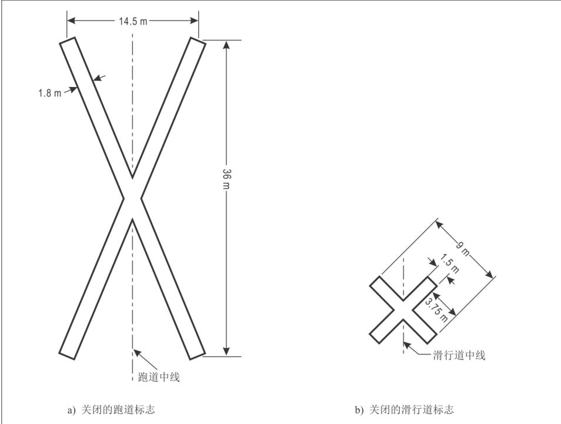

图7-1关闭的跑道和滑行道的标志

### 7.2 非承重表面

## 应用

7.2.1凡不易与承重道面区别开来的滑行道、跑道掉头坪、等待坪和机坪的道肩以及其他非承重表面，如航空器使用这些表面会引起航空器损害，则必须在这种非承重表面与承重表面的接界处用滑行边线标志加以标示。

注：跑道边线标志的规定，见5.2.7。

## 位置

7.2.2建议：滑行边线标志应沿承重道面的边缘设置，使标志的外缘大致在承重道面的边缘上。

特性

7.2.3建议：滑行边线标志应由一对实线组成，每一线条宽15cm，间距15cm，其颜色与滑行道中线标志相同。

注：有关在相交处或机坪上小范围内增设横线条的指导材料，见《机场设计手册》（Doc9157号文件）第4部分。

### 7.3 跑道入口前地区

应用

7.3.1建议：当跑道入口前筑有道面，其长度超过60m，且不适于航空器的正常使用时，应在跑道入口前的全长用“入”形符号予以标志。

位置

7.3.2建议：“人”形标志应指向跑道方向，并置于如图7-2所示位置。

特性

7.3.3建议：“人”形标志应颜色鲜明，且与跑道标志所用颜色形成反差，以黄色为宜。线条总宽度至少为0.9m。

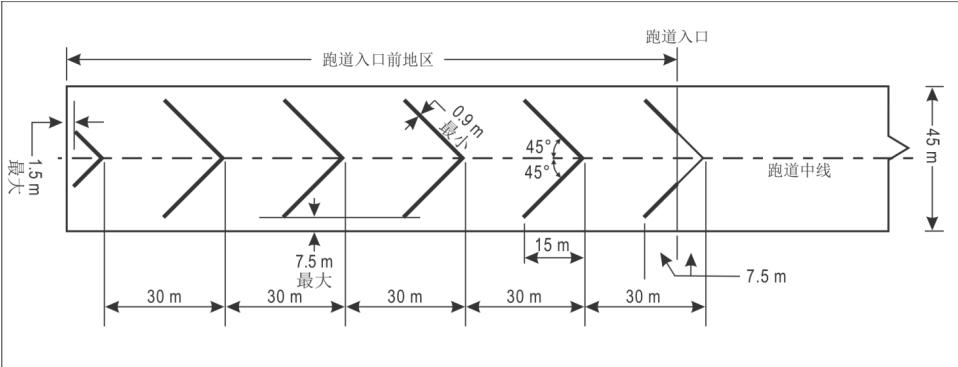

图7-2跑道入口前标志

### 7.4 不适用地区

## 应用

7.4.1在滑行道、机坪、等待坪上不适宜于航空器活动、但仍可能让航空器在其旁边安全通行的任何部分，必须展示不适用地区的标志物。对供夜间使用的活动区，则必须设置不适用地区的标志灯。

注1：不适用地区标志物和灯用于下述目的，例如警告驾驶员在滑行道或机坪的道面上有洞，或勾画出道面上（如在机坪上）正在修补中某一部分。当跑道的一部分已不适用，或滑行道在其宽度的主要部分已不适用时，不适于使用这种标志物。在这种情况下，跑道和滑行道一般已予关闭。

注2：关于活动区内正在进行的施工的规划、协调、监控和安全监督的程序，在《空中航行服务程序一机场》（Doc9981号文件）中加以规定。

## 位置

7.4.2不适用地区标志物和灯必须设置得间距足够紧密，使其能勾画出不适用地区的范围。

注：关于不适用地区灯位置的指导材料，见附篇A.13节。

## 不适用地区标志物的特性

7.4.3不适用地区的标志物必须以鲜明竖立的器件，如旗帜、锥体或标志板组成。

## 不适用地区标志灯的特性

7.4.4不适用地区标志灯必须是红色恒定发光灯。其光强必须足以保证其在周围灯光的光强和正常看到它时的背景的一般照度下明显醒目。在任何情况下，光强不得小于10cd红光。

## 不适用地区锥体的特性

7.4.5建议：不适用地区锥体标志物的高度应至少为0.5m，其颜色应为红、橙或黄色，或上述任一颜色与白色的组合。

## 不适用地区旗帜的特性

7.4.6建议：不适用地区旗帜应至少为0.5m见方，其颜色应为红、橙或黄色，或上述任一颜色与白色的组合。

## 不适用地区标志板的特性

7.4.7建议：不适用地区标志板应至少为0.5m高、0.9m长，涂以红色与白色相间，或橙色与白色相间的垂直线条。

## 第8章电力系统

### 8.1 航空导航设施的供电系统

引言：在机场的安全运行取决于供电的质量。整个供电系统可包括与一个或多个外部电源、一个或多个本地发电设施和与一个带有多个变压器和开关设备的配电网的连接。在规划机场的供电系统时，需要考虑到同一系统还要供电给机场的很多其他设施。

8.1.1机场必须设有足够的主电源以保证航空导航设施的安全运行。

8.1.2为机场目视和无线电导航设备供电的电力系统的设计和提供，必须保证一次设备失效不致使驾驶员处于缺乏足够的目视和非目视引导的状态或得到误导的信息。

注：电力系统的设计和安装需要考虑到一些可能导致故障的因素，例如：电磁干扰、线路损耗、电源质量等。更详细的指导材料见《机场设计手册》（Doc9157号文件）第5部分。

8.1.3建议：需要备用电源的设施应将其供电线路联接得当主电源失效时能自动接通备用电源。

8.1.4建议：从主电源失效到8.1.10规定的各项设施的供电完全恢复的时间间隔应尽实际可行地短，但与非精密跑道、精密跑道和起飞跑道有关的目视助航设施的最大转换时间应满足表8-1的要求。

注：转换时间的定义，见第1章。

8.1.5转换时间的定义的提出并不要求在2010年1月1日以前更换现有的备用电源设备。但是，在1999年11月4日以后安装的备用电源设备及其接至需要备用电源的设施的线路设备，必须安排得使其能够满足表8-1中的由第1章所定义的转换时间要求。

## 目视助航设施

应用

8.1.6对于精密进近跑道，必须设置能满足表8-1规定的相应类别的精密进近跑道要求的备用电源。要求备用电源的设施必须将其供电线路联接得当主电源失效时能自动接通备用电源。

8.1.7对于准备用于跑道视程小于800m条件下的起飞跑道，必须设置能满足表8-1规定的相应要求的备用电源。

8.1.8建议：在主跑道为非精密进近跑道的机场，应设置能满足表8-1要求的备用电源，但不需为一条以上的非精密进近跑道的目视助航设施设置备用电源。

8.1.9建议：在主跑道为非仪表跑道的机场，应设置能满足8.1.4要求的备用电源，只有在已经按照5.3.2的规定设有应急灯光系统，并能在15min内使用时，才不需为目视助航设施再设置备用电源。

8.1.10建议：应为下述机场设施设置能在主电源出现故障时供电的备用电源：

a）信号灯和空中交通服务人员履行职责所必需的最低限度的灯光；

注：最低限度的灯光要求亦可用电力以外的其他方法来满足。

b）有关当局认为是保证航空器的安全运行所必需的所有障碍灯；

c）在8.1.6至8.1.9中规定的进近灯、跑道灯和滑行道灯；

d)气象设备；

e)按照9.11的规定设置的必要的安保照明（如设有）；

f)机场应急机构的必要的设备和设施；

g)按照5.3.24.1的规定设置在指定的航空器隔离机位上的泛光照明（如设有）；

h）机坪上旅客可能行走的地区的照明。

注：有关无线电助航设施和通信系统的地面设备所需的备用电源的规范，见附件10第I卷第1部分第2章。

8.1.11建议：应用下列方法之一来满足备用电源要求：

—从一个不同于供给机场主电源的变电站，经由不同于供给机场主电源输电线路的输电线路取得的独立公用电源，从而使正常电源与独立公用电源同时失效的可能性变得非常小；或

一使用一个或多个备用电源设备，如油机发电机组、蓄电池等，以取得电源。

注：有关电力系统的指导材料，见《机场设计手册》（Doc9157号文件）第5部分。

表8-1备用电源要求

(见8.1.4)

<html><body><table border="1"><thead><tr><td>跑道</td><td>需要供电的助航灯光设备</td><td>最大转换时间 (秒)</td></tr></thead><tbody><tr><td>非仪表跑道</td><td>目视进近坡度指示系统a</td><td>见8.1.4和8.1.9</td></tr><tr><td></td><td>跑道边灯b 跑道入口灯b</td><td></td></tr><tr><td></td><td></td><td></td></tr><tr><td></td><td>跑道末端灯b</td><td></td></tr><tr><td></td><td>障碍灯a</td><td></td></tr><tr><td>非精密进近跑道</td><td>进近灯光系统</td><td>15</td></tr><tr><td></td><td>目视进近坡度指示系统a,d</td><td>15</td></tr><tr><td></td><td>跑道边灯d</td><td>15</td></tr><tr><td></td><td>跑道入口灯d</td><td>15</td></tr><tr><td></td><td>跑道末端灯</td><td>15</td></tr><tr><td></td><td>障碍灯a</td><td>15</td></tr><tr><td>I类精密进近跑道</td><td>进近灯光系统</td><td>15</td></tr><tr><td></td><td>跑道边灯d</td><td>15</td></tr><tr><td></td><td>目视进近坡度指示系统a,d</td><td>15</td></tr><tr><td></td><td>跑道入口灯d</td><td>15</td></tr><tr><td></td><td>跑道末端灯</td><td>15</td></tr><tr><td></td><td>必要的滑行道灯a</td><td>15</td></tr><tr><td></td><td>障碍灯a</td><td>15</td></tr><tr><td>II/III类精密进近跑道</td><td>进近灯光系统内端300m部分</td><td>1</td></tr><tr><td></td><td>进近灯光系统的其他部分</td><td>15</td></tr><tr><td></td><td>障碍灯a</td><td>15</td></tr><tr><td></td><td>跑道边灯</td><td>15</td></tr><tr><td></td><td>跑道入口灯</td><td>1</td></tr><tr><td></td><td>跑道末端灯</td><td>1</td></tr><tr><td></td><td>跑道中线灯</td><td>1</td></tr><tr><td></td><td>接地带灯</td><td>1</td></tr><tr><td></td><td>全部停止排灯</td><td>1</td></tr><tr><td></td><td>必要的滑行道灯</td><td>15</td></tr><tr><td>跑道视程小于800m条件下供起飞用的跑道</td><td>跑道边灯</td><td>15c</td></tr><tr><td></td><td>跑道末端灯</td><td>1</td></tr><tr><td></td><td>跑道中线灯</td><td>1</td></tr><tr><td></td><td>全部停止排灯</td><td>1</td></tr><tr><td></td><td>必要的滑行道灯a</td><td>15</td></tr><tr><td></td><td>障碍灯a</td><td>15</td></tr><tr><td></td><td></td><td></td></tr><tr><td>a) 关于应急灯光的应用，见第5章的5.3.2。</td><td>当此类灯光对于安全飞行至关重要时应设备用电源。</td><td></td></tr><tr><td>b) 当无跑道中线灯时为1秒。</td><td></td><td></td></tr><tr><td>c)</td><td></td><td></td></tr><tr><td>d) 如进近需飞越危险或陡峭的地形，则为1秒。</td><td></td><td></td></tr></tbody></table></body></html>

### 8.2 系统设计

8.2.1跑道拟在视程小于550m使用时，全部包含在表8-1中的供电、灯光和灯光控制系统用的电力系统，必须设计得一次设备失效不致使驾驶员处于缺乏足够的目视引导的状态或得到误导的信息。

注：有关提供这种保护办法的指导材料，见《机场设计手册》（Doc9157号文件）第5部分。

8.2.2机场的备用电源由采用双回路输电的方式提供时，两路输电线必须在电气上和物理上隔离以保证要求的可用性和独立性水平。

8.2.3当跑道构成标准滑行路线的一部分并设置了跑道灯和滑行道灯时，其灯光系统必须联锁，以防止这两类灯同时工作的可能性。

### 8.3 监控

注：有关这个问题的指导材料，见《机场设计手册》（Doc9157号文件）第5部分。

8.3.1建议：应采用监控系统来指示灯光系统的运行状态。

8.3.2当为管制航空器目的而使用灯光系统时，这些灯光系统必须有自动监控，以便对可能影响管制功能的任何故障发出信息。这种信息必须自动传输到空中交通服务部门。

8.3.3建议：当灯光的运行状态发生变化时，应在2秒内显示跑道等待位置停止排灯的状态，并在5秒内显示所有其他类型的目视助航设施灯光的状态。

8.3.4建议：拟在跑道视程小于550m时使用的跑道，对表8-1中所列的灯光系统应予自动监控，以便当任何单元的可用性水平低于10.5.7至10.5.11规定的相应最低可用性水平时能发出信息。这种信息应自动地传递给维护人员。

8.3.5建议：拟在视程小于550m时使用的跑道，对表8-1中所列的灯光系统应予自动监控，当任何单元的可用性水平低于有关当局规定的不应继续运行的最低水平时应发出信息。这种信息应自动地传输到空中交通服务部门，并在显著位置显示出来。

注：关于空中交通管制接口和目视助航设施监控的指导材料包含在《机场设计手册》（Doc9157号文件）第5部分中。

## 第9章机场运行服务、设备和装置

### 9.1 机场应急计划

## 概述

引言机场应急计划是制定在机场及其紧邻地区内发生紧急情况时妥善处理的步骤。机场应急计划的目的是把紧急情况的影响，特别是有关抢救生命和维持航空器运行方面的影响减至最小。机场应急计划提出对不同的机场单位（或服务部门）和机场周围可能有助于对紧急情况作出响应的单位作出的响应进行协调的程序。有助于有关当局制定机场应急计划的指导材料，见《机场服务手册》（Doc9137号文件）第7部分。

9.1.1机场必须制定一个与该机场航空器运行和其他活动相称的机场应急计划。

9.1.2机场应急计划必须规定在机场或其紧邻地区发生紧急情况时所要采取的行动的协调。

注1：紧急情况的例子有：航空器紧急情况、破坏活动（包括炸弹威胁）、非法劫持航空器、发现危险物品、建筑物起火、自然灾害和突发公共卫生事件。

注2：突发公共卫生事件的示例包括：旅客或货物通过航空运输在国际上传播严重传染病的风险增加以及可能使大批机场工作人员感染的传染病大爆发。

9.1.3应急计划必须对所有有关当局认为有助于响应紧急情况的单位的响应或参与进行协调。

注1：这些单位的例子为：

一在机场的：空中交通管制部门、救援与消防部门、机场管理部门、医疗和救护部门、航空器经营人、安保部门和公安部门；

一机场外的：消防部门、公安部门、卫生部门（包括医疗、救护、医院和公共卫生服务）、军队，以及港口巡逻队或海岸警卫队。

注2：公共卫生服务包括制定规划，以期将与卫生有关的事件对社区的不利影响减至最低，并处理公共卫生问题，而不是向个人提供卫生服务。

9.1.4建议：如有必要，应急计划应规定与救援协调中心进行合作与协调。

9.1.5建议：机场应急计划文件至少应包括下列内容：

a）计划中的各种紧急情况类型；

b）计划中所涉及的单位；

c）每个单位、应急行动中心和指挥所在每一类型紧急情况中的职责和作用；

d）在发生一个特定紧急情况时要与之联系的部门或人员的名称和电话号码；和

e）机场及其紧邻地区的方格坐标地图。

9.1.6计划必须遵循人的因素原理，以保证所有参与应急行动的现有机构的最佳响应。

注1：关于人的因素原理的指导材料，见《人的因素培训手册》（Doc9683号文件）。

注2：关于机场人员培训的一般性原则和程序，包括培训方案和能力核查，在《空中航行服务程序一机场》（Doc9981号文件）中加以规定。

## 应急行动中心和指挥所

9.1.7建议：在紧急情况期间，应有一个固定的应急行动中心和一个机动的指挥所。

9.1.8建议：应急行动中心应是机场设施的一部分，负责对紧急情况响应的全面协调和总指挥。

9.1.9建议：指挥所应是能在需要时迅速转移到紧急情况现场的一个设施，并对紧急情况响应单位进行现场协调。

9.1.10建议：应指定一人负责应急行动中心的控制，并在适当时指定另一人负责指挥所。

## 通信系统

9.1.11建议：应按照机场应急计划以及机场的特定要求，为指挥所与机场应急行动中心之间以及它们与各参与单位之间的联系提供充分的通信系统。

## 机场应急演习

9.1.12机场应急计划必须含有对计划的充分程度进行定期检验和对结果进行审查以便改进应急计划的有效性的程序。

注：该计划包括所有参与单位及与之相关联的设备。

#### 9.1.13 该计划必须以下述方式进行检验：

a)相隔不超过两年进行一次全面的机场应急演习，并在这两年的其中一年里进行部分的机场应急演习，以保证在全面的机场应急演习中发现的任何不足之处已得到改正：或

b）进行以第一年为起始点，以每隔不超过三年进行一次的全面机场应急演习为终结点的一系列模块化检验；

并于此后或在一次实际的紧急情况之后接受审查，以便改正在这种演习或实际紧急情况期间发现的任何不足之处。

注1：全面应急演习的目的是为了保证应急计划在应付不同类型紧急情况方面的适当性。部分演习的目的是为了保证各参与单位和该计划的组成部分（如通信系统等）在作出响应方面的适当性。模块化检验的目的是为了能够把力量集中在既定应急计划的具体组成部分上。

注2：关于机场应急计划的指导材料，见《机场服务手册》（Doc9137号文件）第7部分。

## 困难环境中的应急

9.1.14该计划的内容必须包括可随时提供适当的专业救援服务并与之协调，以便当机场位于靠近水域和/或沼泽地带时以及相当大的一部分进近和离场飞行是在这种地区上空进行时，能够对紧急情况作出响应。

9.1.15建议：在靠近水域和/或沼泽地带或困难地形的机场，机场应急计划应包括对预先设定的专业救援服务的响应进行定期确定、检测和评价。

9.1.16建议：应对位于跑道入口1000米之内的进近和离场区域进行评估，以确定可供选择的干预措施。

注：关干对位干跑道入口1000米之内的进近和离场区域进行评估的指导材料，见《机场服务手册》（Doc9137号文件）第1部分的第13章。

### 9.2 救援与消防

## 概述

引言救援与消防服务的主要目标是在机场或其紧邻地区发生航空器事故或事故征候时抢救生命。提供救援与消防服务是为了创造与保持一个存活条件、向乘员提供逃逸路线，以及向那些得不到直接援助便无法逃生的乘员提供救援。救援可能需要动用被确定为主要用于救援与消防服务目的之外的设备与人员。

在一次能得救的航空器事故中，有效救援的最重要的因素是：所受的训练、设备的有效性和指定的救援与消防人员和设备能够投入使用的速度。

关于对付建筑物和油库起火，或给跑道喷洒泡沫的要求不在考虑之内。

## 应用

9.2.1一个机场在为商业航空运输运营服务时必须具备救援与消防的设备和服务。

注：可以指定位于适当地点并具有适合设备的公共或私营机构，对机场提供救援与消防服务。意思是说，这种机构的消防站一般是位于机场内的：但如能满足响应时间的要求，亦不排除其位于机场外的。

9.2.2位于靠近水域和/或沼泽地带或困难地形以及相当大的一部分进近和离场飞行是在这种地区上空进行的机场，必须具备专为偶然事故和危险用的专业救援服务和消防设施。

注1：对水域地区不需设置特种灭火设备，但如这些设备实际有用，例如当所述地区内有礁石或小岛时，亦不阻止设置这些设施。

注2：目标是规划和采用必要的救生漂浮设施尽可能快地在数量上与通常在机场使用的最大机型相适应。

注3：更多的指导材料，见《机场服务手册》（Doc9137号文件）第1部分第13章。

## 提供保障的水平

9.2.3机场救援与消防要提供的保障水平，必须与采用9.2.5和9.2.6中的原则所确定的机场消防等级相适应，只是当正常使用该机场的最高消防等级的飞机的起降架次在最繁忙的连续三个月内少于700架次时，所提供的保障水平相对于所确定的等级最多不得低一级。

注：一次起飞或一次着陆构成一个起降架次。

9.2.4建议：机场救援与消防要提供的保障水平应与采用9.2.5和9.2.6中的原则所确定的机场消防等级相一致。

9.2.5机场消防等级必须按表9-1确定，并必须根据机场正常使用的最长的飞机及其机身宽度确定。

注：对使用机场的飞机进行分级，首先评估其全长，其次是机身宽度。

9.2.6如果根据最长的飞机的全长选定了机场消防等级之后，该飞机的机身宽度大于表9-1中第3栏该等级的最大宽度，则这种飞机的消防等级实际上必须提高一级。

注1：关于为救援与消防之目的对机场（包括供全货机运行的机场）分级的指导材料，见《机场服务手册》（Doc9137号文件）第1部分。

注2：关于培训的原则和程序，包括培训方案和能力核查，在《空中航行服务程序一机场》（Doc9981号文件）中加以规定。关于对人员培训、困难环境下使用的救援设备以及其他救援与消防设备和服务的更多指导材料，见附篇A第17节和《机场服务手册》（Doc9137号文件）第1部分。

9.2.7在预计飞机活动减少期间，具备的保障水平必须不低于在该期间计划使用该机场的最高类别飞机所需的水平，不论飞机起降架次多少。

表9-1救援与消防的机场等级

<html><body><table border="1"><tr><td>机场消防等级 (1)</td><td>飞机机身全长 (2)</td><td>最大机身宽度 (3)</td></tr><tr><td>1</td><td>0~<9m</td><td>2m</td></tr><tr><td>2</td><td>9~<12m</td><td>2m</td></tr><tr><td>3</td><td>12~<18 m</td><td>3m</td></tr><tr><td>4</td><td>18~<24m</td><td>4m</td></tr><tr><td>5</td><td>24~<28m</td><td>4m</td></tr><tr><td>6</td><td>28~<39m</td><td>5m</td></tr><tr><td>7</td><td>39~<49m</td><td>5m</td></tr><tr><td>8</td><td>49~<61m</td><td>7m</td></tr><tr><td>6</td><td>61~<76 m</td><td>7m</td></tr><tr><td>10</td><td>76~<90 m</td><td>8m</td></tr></table></body></html>

## 灭火剂

9.2.8建议：机场上通常应置备主要灭火剂和辅助灭火剂。

注：灭火剂的描述，见《机场服务手册》（Doc9137号文件）第1部分。

#### 9.2.9 建议：主要灭火剂应为：

a)达到最低性能水平A的泡沫；或

b）达到最低性能水平B的泡沫；或

c）达到最低性能水平C的泡沫；或

d）这些灭火剂的组合；

但是对于等级1~3的机场，其主要灭火剂的泡沫最好应达到性能水平B或C。

注：关于达到可接受的性能水平A、B或C的泡沫所需的物理特性和灭火性能标准的资料，见《机场服务手册》（Doc9137号文件）第1部分。

9.2.10建议：辅助灭火剂应为适用于碳氢化合物灭火的化学干粉。

注1：当选择化学干粉与泡沫一起使用时，必须注意保证它们能相容。

注2：可以采用有相当消防性能的代替的辅助灭火剂。关于消防剂的补充资料，见《机场服务手册》（Doc9137号文件）第1部分。

9.2.11救援与消防车辆上配备的产生泡沫的用水量和辅助剂必须与根据9.2.3、9.2.4、9.2.5、9.2.6和表9-2所确定的机场消防等级相符合，但对消防等级1~2的机场，可用辅助剂代替水量直到100%。

为替换灭火剂的目的，1kg辅助剂必须视为等同于1.0L产生达到性能水平A的泡沫用水。

注1：上述产生泡沫的用水量是在按达到性能水平A的泡沫灭火剂施用率为8.2L/min/m2、对达到性能水平B的泡沫灭火剂施用率为5.5L/min/m2，以及对达到性能水平C的泡沫灭火剂施用率为3.75L/min/m2的基础上判定的。

注2：当使用其他辅助剂时必须校核代替比率。

9.2.12如果计划在机场运行的飞机的长度大于其所属机场消防等级中飞机的平均尺寸，应重新计算水量，并相应增加产生泡沫的用水量及泡沫溶液的喷射率。

注：关于根据所属机场消防等级中的最大飞机总长确定水量和喷射率的指导材料，见《机场服务手册》（Doc9137号文件）第1部分第2章。

表9-2最小可用灭火剂数量

<html><body><table border="1"><thead><tr><td></td><td colspan="2">达到性能水平A的泡沫</td><td colspan="2">达到性能水平B的泡沫</td><td colspan="2">达到性能水平C的泡沫</td><td colspan="2">辅助剂</td></tr><tr><td>机场消</td><td>水</td><td>喷射率 泡沫溶液/分钟</td><td>水</td><td>喷射率 泡沫溶液/分钟</td><td>水</td><td>喷射率 泡沫溶液/分钟</td><td>化学 干粉</td><td>喷射率</td></tr><tr><td>防等级</td><td>(L)</td><td>(L)</td><td>(L)</td><td>(L)</td><td>(L)</td><td>(T)</td><td>(kg)</td><td>(kg/秒)</td></tr><tr><td>(1)</td><td>(2)</td><td>(3)</td><td>(4)</td><td></td><td></td><td></td><td></td><td></td></tr><tr><td></td><td></td><td></td><td></td><td>(5)</td><td>(6)</td><td>(7)</td><td>(8)</td><td>(9)</td></tr><tr><td></td><td>350</td><td></td><td></td><td></td><td></td><td></td><td></td><td></td></tr></thead><tbody><tr><td>1</td><td></td><td>350</td><td>230</td><td>230</td><td>160</td><td>160</td><td>45</td><td>2.25</td></tr><tr><td>2</td><td>1 000</td><td>800</td><td>670</td><td>550</td><td>460</td><td>360</td><td>06</td><td>2.25</td></tr><tr><td>3</td><td>1 800</td><td>1 300</td><td>1 200</td><td>006</td><td>820</td><td>630</td><td>135</td><td>2.25</td></tr><tr><td>4</td><td>3 600</td><td>2 600</td><td>2 400</td><td>1 800</td><td>1 700</td><td>1 100</td><td>135</td><td>2.25</td></tr><tr><td>5</td><td>8 100</td><td>4 500</td><td>5 400</td><td>3 000</td><td>3 900</td><td>2 200</td><td>180</td><td>2.25</td></tr><tr><td>6</td><td>11 800</td><td>6 000</td><td>7 900</td><td>4000</td><td>5 800</td><td>2 900</td><td>225</td><td>2.25</td></tr><tr><td>7</td><td>18 200</td><td>7 900</td><td>12 100</td><td>5 300</td><td>8 800</td><td>3 800</td><td>225</td><td>2.25</td></tr><tr><td>8 9</td><td>27 300</td><td>10 800 13 500</td><td>18 200</td><td>7 200 9000</td><td>12 800 17 100</td><td>5 100 6 300</td><td>450 450</td><td>4.5</td></tr><tr><td></td><td>36 400</td><td></td><td>24 300</td><td></td><td></td><td></td><td></td><td>4.5</td></tr><tr><td>10</td><td>48 200</td><td>16 600</td><td>32 300</td><td>11 200</td><td>22 800</td><td>7 900</td><td>450</td><td>4.5</td></tr></tbody></table></body></html>

注：(2)、(4)和(6)栏所示的水量是根据所属机场消防等级中的飞机的平均全长确定的。

9.2.13分别放在消防车上产生泡沫用的泡沫浓缩液的数量，必须与所带的水量和所选用的泡沫浓缩液成比例。

9.2.14建议：放在消防车上的泡沫浓缩液的数量，应至少足以生产两车载量的泡沫溶液。

9.2.15建议：在航空器事故现场应提供补充水源以迅速补充救援与消防车辆。

9.2.16建议：当在机场配备不同性能水平的泡沫时，应计算每类泡沫产生泡沫时所需的总用水量。这些总用水量在每台车辆上的分配情况应记录在案，并将其适用于总的救援与消防要求。

9.2.17泡沫溶液的喷射率必须不低于表9-2所示。

9.2.18辅助剂必须与国际标准化组织（ISO）的有关规定相一致。*

9.2.19建议：辅助剂的喷射率不得小于表9-2所示的比率。

9.2.20建议：对于预计使用辅助灭火剂的各种类型的火情，只应使用具有等效或更佳效果的灭火剂来代替化学干粉。

注：使用辅助灭火剂的指导材料，见《机场服务手册》（Doc9137号文件）第1部分。

9.2.21建议：为了对消防车进行补充，机场应保持有相当于表9-2中所规定量的200%的泡沫浓缩液的库存。

注：消防车所载的超出表9-2中所规定量的泡沫浓缩液能够起到增加库存的作用。

9.2.22建议：为了对消防车进行补充，机场应保持有相当于表9-2中所规定量的100%的辅助剂的库存。为了利用该库存的辅助剂，应存有足量的气态推进剂。

9.2.23建议：用辅助剂代替水量多达100%的消防等级1和2的机场应保持200%的辅助剂库存量。

9.2.24建议：在预计补充供应可能出现重大延误时，应根据风险评估所确定的数量，增加9.2.21、9.2.22和9.2.23中的库存量。

注：关于进行风险分析以确定灭火剂库存量的指导材料，见《机场服务手册》（Doc9137号文件）第1部分。

## 救援设备

9.2.25建议：应在救援与消防车上装备与航空器运行水平相称的救援设备。

注：有关在机场上置备救援设备的指导材料，见《机场服务手册》（Doc9137号文件）第1部分。

## 响应时间

9.2.26救援与消防服务的工作目标必须是在最佳能见度和地面条件下，在不超过三分钟的响应时间内到达每条运行跑道的任一点。

9.2.27建议：救援与消防服务的工作目标应是在最佳能见度和地面条件下，在不超过二分钟的响应时间内到达每条运行跑道的任一点。

9.2.28建议：救援与消防服务的工作目标应是在最佳能见度和地面条件下，在不超过三分钟的响应时间内到达机场活动区的任何其他部分。

注1：响应时间被认为是从向救援与消防机构的首次呼救至响应救援的第一（批）辆车到位并按表9-2中规定的喷射率的至少50%施放灭火泡沫之间的这段时间。

注2：最佳能见度和地面条件的定义为白天、良好能见度、未降雨雪、规定的响应路线的表面没有水、冰或雪的污染。

9.2.29建议：为在低于最佳能见度的情况下尽可能达到上述运行目标，特别是在低能见度下运行时，应对救援与消防服务提供适当的指导、设备和/或程序。

注：更多的指导材料见《机场服务手册》（Doc9137号文件）第1部分第2章。

9.2.30除第一辆（批）响应车辆外，任何为运送表9-2中规定的灭火剂用量所需的其他车辆必须保证连续喷施灭火剂并必须在首次呼叫之后不超过四分钟到达现场。

9.2.31建议：除第一辆（批）响应车辆外，任何为运送表9-2中规定的灭火剂用量所需的其他车辆应保证连续喷施灭火剂并应在首次呼叫之后不超过三分钟到达现场。

9.2.32建议：应采用一套救援与消防车辆的预防性维护系统，以保证设备的有效性，并在车辆的使用寿命期内都能符合规定的响应时间要求。

## 应急通道

9.2.33建议：在地形条件允许的机场应提供应急通道，以利于达到最短的响应时间。应特别注意对通往跑道入□以外1000m或至少在机场范围内的进近区设置方便通道。如设有围界，应考虑需要有便于通向场外的通道。

注：当机场辅路的位置和构造适当时，可以将其作为应急通道。

9.2.34建议：应急通道应能承载使用它们的最重的车辆，并在所有天气条件下都可使用。距跑道90m以内的道路应有铺筑面，以防表面侵蚀及将碎物带上跑道。对上跨的障碍物应有足够的垂直净距，以供最大的车辆通过。

9.2.35建议：当通道表面与周围地区分辨不清或在积雪可能掩盖通道的地区，应设置间距约10m的边线标志物。

## 消防站

9.2.36建议：所有救援与消防车辆一般应停放在消防站内。无论何时如不能从一个消防站达到响应时间要求，应设消防分站。

9.2.37建议：消防站应设在使救援与消防车辆能最直接并无阻碍地进入跑道地区，只需最少的转弯的地点。

## 通信和报警系统

9.2.38建议：应在消防站与管制塔台、机场内的任何其他消防分站和救援与消防车辆之间设置独立的通信系统。

9.2.39建议：应在消防站、机场内的任何其他消防分站和机场管制塔台设置能由消防站操纵的对救援与消防人员的报警系统。

## 救援与消防车辆的数量

9.2.40建议：机场配置救援与消防车辆的最少数量，应符合下表所列：

机场消防等级救援与消防车辆

注：有关救援与消防车辆的最低限度特性的指导材料，见《机场服务手册》（Doc9137号文件）第1部分。

人员

9.2.41所有救援与消防人员必须进行良好的训练以便能有效地履行职责，同时必须参与同机场上使用的机型和救援与消防设施类型相适应的真实防火（包括压力油料起火）演习。

注1：帮助有关当局提供正规训练的指导材料，见附篇A，第17节和《机场服务手册》（Doc9137号文件）第1部分。

注2：从一辆有裂缝的油罐在很高的压力下喷出的油料引起的火情称之为“压力油料起火”。

9.2.42救援与消防人员训练计划必须包括人的行为能力训练，其中包括团队协调训练。

注：关于人的行为能力和团队协调训练计划设计的指导材料，见《人的因素培训手册》（Doc9683号文件）。

9.2.43建议：在有飞行活动时，应选派足够的经过训练的和具备所需能力的人员随时能够驾驶救援与消防车辆，并能以最大功率操纵设备。应对这些人员进行适当部署，以保证达到最短的响应时间，并能保持连续地用最佳喷射率施放灭火剂。还应对这些人员使用手绳、梯子以及通常与航空器救援与消防工作相关联的其他消防设备加以考虑。

9.2.44建议：为了确定所需最少救援与消防人员人数，应完成一项任务资源分析，并将人员配备水平写入《机场手册》。

注：关于使用任务资源分析的指导材料，见《机场服务手册》（Doc9137号文件）第1部分。

9.2.45必须为所有作出响应的救援与消防人员提供防护服和呼吸设备，以便他们能有效地履行职责。

### 9.3 残损航空器的搬移

注：有关残损航空器的搬移、包括恢复设备的指导材料，见《机场服务手册》（Doc9137号文件）第5部分。另见附件13一《航空器事故和事故征候调查》有关保护现场证据、航空器的保管和搬移等内容。

9.3.1建议：机场应制定机场活动区内或其附近的残损航空器的搬移计划，并在必要时指定协调人来实施该计划。

9.3.2建议：残损航空器的搬移计划应根据通常在机场飞行的航空器的特性来制定，除其他内容外包括：

a）为此目的能在机场内或其附近地区获得的设备和人员的清单；和

b）能快速接收从其他机场运来的航空器修复设备的安排。

### 9.4 减轻野生动物撞击的危害

注：在机场或其邻近地带出现的野生动物（鸟类和其他动物）会对航空器运行安全产生严重威胁。

9.4.1对于在机场或其邻近地带的野生动物撞击危害，必须通过下述方式进行评估：

a）建立一个记录、报告野生动物撞击航空器的国家程序；

b）从航空器运营人、机场工作人员和其他方面收集有关在机场或机场周围对航空器的飞行构成潜在危害的野生动物出现的情况；和

c）由专职人员对野生动物危害进行持续评估。

注：见附件15第5章。

9.4.2必须收集野生动物撞击报告，并将这些报告提交给国际民航组织，以便收入国际民航组织鸟击信息系统（IBIS）数据库。

注：国际民航组织鸟击情报系统是为了收集并传播野生动物撞击航空器的情报而设计的。该系统的情报包含在国际民航组织《鸟击信息系统手册》（Doc9332号文件）（即将出版）中。

9.4.3必须采取行动，通过各种旨在最大限度地降低野生动物与航空器相撞可能性的措施来减少对航空器运行的风险。

注：关干机场上和机场附近野生动物危害的管理程序，包括野生动物危害管理方案（WHMP）的制定、野生动物的风险评估、土地使用的管理和人员培训，在《空中航行服务程序一机场》（Doc9981号文件）第Ⅱ部分第1和第6章中加以规定。更多的指南，见《机场服务手册》（Doc9137号文件）第3部分。

9.4.4有关当局必须采取行动，消除或阻止建立可能把野生动物吸引至机场或其邻近地带的垃圾堆或任何其他源头，除非相关野生动物评估表明，它们不大可能造成助长野生动物撞击问题的条件。如无法消除现有场所，有关当局必须保证对这些场所给航空器带来的风险进行评估，并将风险降低至切实合理的程度。

9.4.5建议：各国应对机场周界附近进行的可能会吸引野生动物的土地开发所引起的航空安全关切给予适当考虑。

### 9.5 机坪管理服务

9.5.1建议：当根据交通量和运行条件认为有必要时，应由机场的空中交通服务部门（ATS）、机场另一个运行部门，或由这些单位的合作组合，在机坪上提供适当的机坪管理服务工作，以便：

管理机坪上的活动，目的在于防止航空器与航空器和航空器与障碍物之间的碰撞；

b）同机场管制塔台一起管理和协调航空器进出机坪；和

c)保证车辆的安全而迅速活动，以及对其他活动的适当管理。

9.5.2建议：当机场管制塔台不参与机坪管理服务时，应建立程序，以利于机坪管理单位与机场管制塔台之间对航空器有秩序地进行交接。

注：关于停机坪安全的程序在《空中航行服务程序一机场》（Doc9981号文件）中加以规定。有关机坪管理服务的指导材料，见《机场服务手册》（Doc9137号文件）第8部分和《地面活动引导及控制系统（SMGCS）手册》（Doc9476号文件）。

9.5.3机坪管理服务必须配置无线电话通信设备。

9.5.4在实施低能见度程序时，机坪上活动的人员和车辆必须限制在必要的最低限度。

注：有关特别程序的指导材料，见《地面活动引导及控制系统（SMGCS）手册》（Doc9476号文件）。

9.5.5对响应紧急情况的应急车辆必须给予其超出所有其他地面活动车辆的优先权。

9.5.6在机坪上运行的车辆必须：

a)让道给应急车辆；滑行中的、就要滑行的，或要推出或牵引的航空器；和

b）按照当地规章给行驶的其他车辆让路。

9.5.7机位必须目视监控，以保证为使用该机位的航空器提供所建议的净距。

注：关于运行人员培训和关于停机坪安全和运行的程序，在《空中航行服务程序一机场》（Doc9981号文件）第Ⅱ部分第1和第7章中加以规定。

### 9.6 航空器地面服务

9.6.1在航空器地面服务期间，必须备有随时可用的、至少能在燃油起火初期适用的灭火设备和经过训练能使用此种设备的人员，并且具有在出现火情或燃油大量溢流的情况下迅速召唤救援与消防服务的手段。

9.6.2如果航空器是在旅客正在登机、或已在机上、或正在下机时进行加油的，地面设备必须放置得能够：

a）使用足够数量的紧急撤离出口；和

b）出现紧急情况时，所用的每个紧急出口有迅速撤离的路线。

### 9.7 机场车辆的运行

注1：关于确定空侧驾驶许可（ADP）方案和车辆/设备安全要求的程序，包括详细的人员培训，在《空中航行服务程序一机场》（Doc9981号文件）第Ⅱ部分第9章中加以规定。

注2：有关机场车辆运行的指导材料，载于附篇A第18节中：车辆的交通规则和条例载于《地面活动引导及控制系统（SMGCS）手册》（Doc9476号文件）中。

注3：机场活动区上的道路只限于供机场工作人员和其他经许可的人员使用，而未经许可的人员进入公共建筑物的通道不需要使用这种道路。

9.7.1地面车辆：

a）只有经机场管制塔台批准，才能在飞机运转区运行；和

b）只有经适当的指定当局批准才能在机坪上运行。

9.7.2在机场活动区内的车辆司机必须遵守所有以标志和标记牌传达的强制性指令，除非：

a）在飞机运转区，经机场管制塔台另外授权；和

b）在机坪上，经适当的指定当局另外授权。

9.7.3在机场活动区内的车辆司机必须遵守所有以灯光传达的强制性指令。

9.7.4在机场活动区内的车辆司机必须针对其所要执行的任务经过适当的培训，并遵守下列部门发出的指示：

a）在飞机运转区，由机场管制塔台；和

b）在机坪上，由适当的指定当局。

9.7.5配备无线电设备的车辆司机在进入运转区以前必须与机场管制塔台建立良好的双向无线电通信联系，在进入机坪以前必须与适当的指定当局建立良好的双向无线电通信联系。车辆司机在机场活动区内必须连续不断地在指定的频率上守听。

### 9.8 地面活动引导及控制系统

应用

9.8.1机场必须设置地面活动引导及控制系统（SMGCS）。

注：有关地面活动引导及控制系统的指导材料，载于《地面活动引导及控制系统（SMGCS）手册》（Doc9476号文件）中。

特性

9.8.2建议：地面活动引导及控制系统的设计应考虑到：

a）空中交通密度；

b）预计运行时具有的能见度条件；

c 驾驶员确定方位的需要；

d）机场布局的复杂性；和

e)车辆的活动。

9.8.3建议：地面活动引导及控制系统中的目视助航设施部分，即标志、灯光和标记牌应分别设计得符合5.2，5.3和5.4各节中的相应规范。

9.8.4建议：地面活动引导及控制系统应设计得有助于防止航空器和车辆因疏忽而侵入使用中的跑道。

9.8.5建议：系统应设计得有助于防止在机场活动区的任何部分航空器与航空器以及航空器与车辆或物体发生碰撞。

注：有关借助感应线圈控制停止排灯和有关目视滑行引导及控制系统的指导材料，载于《机场设计手册》（Dod 9157号文件）第4部分。

9.8.6在使用有选择地开、关停止排灯和滑行道中线灯来进行地面活动引导及控制时，必须满足下列要求：

a）由开亮的滑行道中线灯指示的滑行路线必须能够中止于一个开亮的停止排灯；

b）控制线路必须设置得当位于航空器前面的停止排灯开亮时，停止排灯以远适当长度的滑行道中线灯段即关灭；和

c）当停止排灯被关灭时，在航空器前面的滑行道中线灯即开亮。

注1：关于滑行道中线灯和停止排灯的规范，分别见5.3.17和5.3.20。

注2：关于地面活动引导及控制系统中的停止排灯和滑行道中线灯的安装的指导材料，见《机场设计手册》（Dod 9157号文件）第4部分。

9.8.7建议：拟在跑道视程小于350m的情况下使用的机场应设置航空器运转区地面活动雷达。

9.8.8建议：在与9.8.7规定不同的机场，当其交通密度和运行条件使得另外的程序和设施不能保持交通流动的正常性时，应设置飞机运转区地面活动雷达。

注：有关地面活动雷达的使用的指导材料，见《地面活动引导及控制系统（SMGCS）手册》（Doc9476号文件）和《空中交通服务规划手册》（Doc9426号文件）。

### 9.9 运行区上的设备和装置的定位

注1：对障碍物限制面的要求，见4.2。

注2：关于灯具及其支架、目视进近坡度指示系统的灯具、标记牌和标志物的设计，分别见5.3.1，5.3.5，5.4.1和5.5.1。关于目视及非目视导航设备的易折设计的指导材料，见《机场设计手册》（Doc9157号文件）第6部分。

9.9.1任何设备或装置不得处于下列位置，除非为航行或航空器安全目的根据其功能必须设在该处：

a)升降带上、跑道端安全区上、滑行带上或在表3-1第11栏中所规定的距离之内，如果设备或装置可能危及航空器；或

b）净空道上，如果设备或装置可能危及空中航空器。

9.9.2任何必须设置在下列地区的为航行或航空器安全目的所需的设备或装置，必须为易折的并安装得尽可能低：

a）升降带的下列部位：

1）基准代码为3或4时，跑道中线两侧各75m范围以内；或

2）基准代码为1或2时，跑道中线两侧各45m范围以内；或

b）跑道端安全区上、滑行带上或表3-1规定的距离以内；或

c）净空道上可能会危及空中的航空器之处。

9.9.3建议：设置在升降带的未经平整地段上的任何为航行或航空器安全目的所需的设备或装置，均应视为障碍物，应为易折的并安装得尽可能低。

注：关于导航设备选址的指导材料，见《机场设计手册》（Doc9157号文件）第6部分。

9.9.4在I类、Ⅱ类或类精密进近跑道的升降带端外240m以内的下列范围内，不得存在任何设备或装置，除非为导航或航空器安全目的根据其功能必须设置在该处：

a）基准代码为3或4时，跑道中线延长线两侧各60m范围以内，或

b）基准代码为1或2时，跑道中线延长线两侧各45m范围以内。

9.9.5任何由于其导航功能或航空器安全目的必须设置在或邻近I类、Ⅱ类或Ⅲ类精密进近跑道的升降带的下列范围内的设备和设施必须为易折，并安装得尽可能低：

a）升降带端外240m以内的：

1）基准代码为3或4时，跑道中线延长线两侧各60m以内；或

2）基准代码为1或2时，跑道中线延长线两侧各45m以内；或

b）穿透内进近面、内过渡面或复飞面；

9.9.6建议：按4.2.4、4.2.11、4.2.20或4.2.27的规定构成运行障碍物的任何为导航或航空器安全目的所需的设备或装置，应为易折，并安装得尽可能低。

### 9.10 围界

## 应用

9.10.1机场上必须设置围界或其他合适的围栏，以防止大得足以对航空器形成危害的动物进入机场活动区。

9.10.2机场上必须设置围界或其他合适的围栏，以阻止未经许可的人员由于疏忽或预谋进入机场的不对外开放的地区。

注1：这包括挡住下水道、管沟、地道等有必要防止进入的设施。

注2：可能需要采取特别的措施以防止未经许可的人员进入跨越公用道路的跑道或滑行道。

9.10.3对于为民用航空的安全所必需的位于机场以外的地面装置和设施，必须采取适当的保护措施，以阻止未经许可的人员由于疏忽，或预谋进入。

## 位置

9.10.4围界或围栏的设置地点必须能将机场活动区及机场上其他对航空器安全运行至关重要的设施或地带同向公众开放的地区分隔开来。

9.10.5建议：当认为需要更大的安全保障时，在围界或围栏的两侧应设置开拓地带，以利于巡逻，并使非法侵入更为困难。应考虑设置机场围栏内侧的围场路，供维护人员和安保巡逻人员使用。

### 9.11 安保照明

建议：在机场上，在由于安保原因认为需要时，应对保护国际民用航空及其设施的围界或其他围栏予以最低必要程度的照明。应考虑将灯光设置在使围界或围栏两侧的地面，特别是进入点得到照明的地方。

### 9.12 跑道侵入自主警告系统

注1：在本节中纳入跑道侵入自主警告系统（ARIWS）的详细规范，其意图并非暗指必须在机场安装此种系统。

注2：跑道侵入自主警告系统的实施是一个复杂的问题，机场运营人、空中交通服务和各国应对其进行仔细考虑并就其与航空器运营人进行协调。

注3：附篇A第20节对跑道侵入自主警告系统（ARIWS）做了说明，并载有该系统使用方面的信息。

特性

#### 9.12.1 如果在机场安装跑道侵入自主警告系统：

a)该系统必须对在用跑道上的潜在侵入或占用情况提供自动探测并向飞行机组或车辆驾驶员提供直接警告。

b)该系统的运行和控制必须独立于机场内任何其他目视系统：

c)该系统的目视助航构成部件，即灯具，必须设计成与5.3中相关规范相符；和

d）该系统如部分或全部失效，不得干扰机场正常运行。为此，应做出规定，使空中交通管制单位能够将该系统部分或全部关闭。

注1：跑道侵入自主警告系统可以与增强型滑行道中线标志、停止排灯或跑道警戒灯一起安装。

注2：拟让系统可在包括低能见度在内的所有天气条件下运行。

注3：跑道侵入自主警告系统可共用地面活动引导及控制系统或高级地面活动引导及控制系统的共同传感部件，但该系统的运行独立于后两个系统。

9.12.2在机场安装有跑道侵入自动告警系统的情况下，必须向适当的航行情报服务部门提供关于其特征和状态的情报以便在航行资料汇编中公布，并根据附件15的规定说明机场地面活动引导和控制系统以及标志。

注：关于航行资料汇编的详细规定载于《空中航行服务程序一航空情报管理》（Doc10066号文件）。

## 第10章机场维护

### 10.1 概述

10.1.1机场必须建立一项维护计划，酌情包括预防性维护计划，以使各种设施保持在不致损害空中航行的安全、正常或效率的状态。

注1：预防性维护是指为了防止设施失效或降级而进行的有计划的维护工作。

注2：“设施”意在包括诸如道面、目视助航设施、围栏、排水系统、电力系统及建筑物等等。

10.1.2建议：维护计划的设计和应用应遵循人的因素原理。

注1：关于人的因素原理的指导材料，见《人的因素培训手册》（Doc9683号文件）和《机场服务手册》（Doc9137号文件）第8部分。

注2：关于机场人员培训的一般性原则和程序，包括培训方案和能力核查，在《空中航行服务程序一机场》（Doc9981号文件）中加以规定。

### 10.2 道面

10.2.1作为机场预防性和修复性维护方案的一部分，必须对包括铺筑面在内的所有活动区（跑道、滑行道和机坪）和相邻地区的表面进行定期检查并对其状况进行定期监测，目的旨在避免和清除可能会损伤航空器，或影响航空器系统工作的任何外来物（FOD）。

注1：活动区的检查见2.9.3。

注2：关于对活动区进行日常检查及控制外来物的程序，见《空中航行服务程序一机场》（Doc9981号文件）《地面活动引导及控制系统（SMGCS）手册》（Doc9476号文件）和《改进型地面活动引导及控制系统（A-SMGCS）手册》（Doc9830号文件）。

注3：清扫道面的更多指导材料，见《机场服务手册》（Doc9137号文件）第9部分。

注4：关于对道肩表面应采取的预防措施的指导材料，见附篇A第8节和《机场设计手册》（Doc9157号文件）第2部分。

注5：如果道面供大型航空器或具有2.6.6c）中所述高胎压的航空器使用，应特别注意道面和道面连接处灯具的完整性。

10.2.2必须对跑道表面进行维护，使其处于一种防止形成有害的不平整情况的状态。

注：见附篇A第5节。

10.2.3必须对有铺筑面的跑道进行维护，使其表面摩阻特性处于一种等于或高于国家规定的最小摩阻值的状态。

注：《跑道表面状况的评估、测量和报告》（Cir355号通告）载有关于这一问题的更多资料。

10.2.4出于维护目的，必须定期用一个装有自湿装置的连续测试摩擦力的仪具来测定跑道表面摩阻特性，并对测定结果存档。进行这些测定的频率必须足以确定跑道表面摩阻特性的趋势。

注1：关于评价跑道表面摩阻特性的指导材料载于《跑道表面状况的评估、测量和报告》（Cir355号通告）。

注2：第10.2.3段至第10.2.8段的目的是确保整个跑道的表面摩阻特性保持在等于或超出国家规定的最小摩阻力值的水平。

10.2.5如果出于维护目的，使用带自湿装置的连续摩阻力测量装置进行跑道表面摩阻力测量，则此装置的性能必须满足国家设定或同意的标准。

10.2.610.2.5中要求的跑道表面摩阻力测量人员必须接受培训并能够胜任其工作。

10.2.7为防止跑道的全部或其部分的跑道表面摩阻特性降至低于国家规定的最小摩阻值，必须采取修复性维护行动。

注：100米左右长的跑道部分可认为是对维护或通报行动具有意义。

10.2.8建议：在自然或模拟降雨条件下，应该对跑道表面进行必要的目视评估，以确定是否存在坑洼或排水不良，必要时，必须采取纠正性维护行动。

10.2.9建议：当滑行道供装有涡轮发动机的飞机使用时，滑行道道肩的表面上应保持其没有松散的石子和其他可能会被飞机发动机吸入的其他物体。

注：关于这个问题的指导材料，见《机场设计手册》（Doc9157号文件）第2部分。

### 10.3 污染物的清除

10.3.1必须尽可能迅速并完全地清除掉使用中的跑道表面上的雪、雪浆、冰、积水、泥浆、尘土、砂子、油、橡胶残积物和其他污染物，使其积聚减至最小。

注：上述要求并不意味着禁止冬季在压实的雪和冰上运行。关于雪的清除和冰的控制及其他污染物的清除的资料，见《空中航行服务程序一机场》（Doc9981号文件）。

10.3.2建议：滑行道上的雪、雪浆、冰等应清除到使航空器能滑行到使用中的跑道和从该跑道滑行出来所需要的程度。

10.3.3建议：机坪上的雪、雪浆、冰等应清除到使航空器能安全地运转或在需要时将航空器牵引或推出所需要的程度。

10.3.4建议：每当不能同时将机场活动区的各个部分的雪、雪浆、冰等都予以清除时，应与援救和消防服务等受影响的各方协商确定在使用中的跑道上的清除工作完成后其他部分的清除工作的优先顺序，并记录在除雪计划中。

注：关于需在航行资料汇编中公布的有关除雪计划的资料，见《空中航行服务程序一航空情报管理》（Doc10066号文件）附录2第3部分的AD1.2.2。《航空情报服务手册》（Doc8126号文件）载有关于清雪计划的指南，其中包括为活动区的清扫工作确定实际优先顺序的一般性政策。

10.3.5建议：当情况表明使用化学剂有效时，应使用化学剂来除去或防止机场道面上冰和霜的形成。施用化学剂时，应当小心，不使其造成更加滑溜的情况。

注：有关机场道面使用化学剂的资料，见《空中航行服务程序一机场》（Doc9981号文件）。

10.3.6不得使用对航空器或道面可能产生有害影响的，或可能对机场环境有毒性影响的化学剂。

### 10.4 跑道道面加覆盖层

注：下述规范拟用于跑道要在重新铺筑完成之前临时恢复到运行状态时给跑道道面加覆盖层的工程。这可能需要在新老跑道表面之间设有一个临时的斜坡。关于道面加覆盖层以及评估其可运行状态的指导材料，见《机场设计手册》（Doc9157号文件）第3部分。

10.4.1从现有跑道表面或以前铺筑的覆盖层量起的临时斜坡的纵坡必须：

a）在覆盖层厚度相当于5cm（包括5cm）时，为0.5%～1.0%;

b）在覆盖层厚度大于5cm时，不大于0.5%。

10.4.2建议：加覆盖层施工应从跑道的一端向其另一端进行，以便根据跑道的使用情况，大多数航空器的运行将只经受一个向下的接坡。

10.4.3建议：在每个工作阶段中，应覆盖跑道的全宽。

10.4.4跑道加铺覆盖层完成后恢复到临时运行状态之前，必须按照5.2.3中的规定设置跑道中线标志。此外，任一临时跑道入口的位置必须用3.6m宽的横向线条来加以识别。

10.4.5建议：覆盖层的建造和维护应使其摩阻力超出10.2.3中规定的最小摩阻值。

### 10.5 目视助航设施

注1：这些规范旨在规定出各项维护工作水平的目标。并不打算用它们来确定灯光系统是否还能运行。

注2：发光二极管（LEDs）之所以节能，很大一部分原因在于它们不会产生白炽灯的红外热特征。那些期望该热特征会将冰雪融化的机场运营人似宜评估在此种情况下是否需要修改维修计划，或评估安装配有加热原件的发光二极管灯具可能具有的运行价值。

注3：增强目视系统（EVS）技术依赖于由白炽灯提供的红外热特征。附件15提供了一种在将照明系统换成发光二极管时，向使用增强目视系统的机场用户发出通知的适当方式。

10.5.1当一个灯的主光束平均光强小于附录2相应图中规定值的50%时，该灯必须被认为是不能使用的。在灯具设计主光束平均光强大于附录2中所示值时，该50%的值必须以该设计值为基数。

10.5.2必须采用一个对目视助航设施的预防性维护的系统来保证灯光和标志系统的可靠性。

注：有关目视助航设施的预防性维护的指导材料，见《机场服务手册》（Doc9137号文件）第9部分。

10.5.3建议：供Ⅱ、川类精密进近跑道用的预防性维护系统应至少包括下列各项检查：

a）进近和跑道灯光系统中的灯光的光强、光束扩散角以及灯光朝向的目视检查和现场测定；

b）进近和跑道灯光系统中的每一电路的电气特性的控制和测量；和

c）空中交通管制所用的光强调置的功能正确性的控制。

10.5.4建议：I、IⅢ类精密进近跑道的进近和跑道灯光系统中的灯具的光强、光束扩散角以及朝向的现场测定，应尽实际可能做到测量所有的灯具，以保证符合附录2的规范。

10.5.5建议：I、类精密进近跑道的进近和跑道灯光系统中的灯具的光强、光束扩散角以及朝向的测定，应采用高精度的移动式的测量设备，以分析每一个灯具的特性。

10.5.6建议：I、类精密进近跑道灯具的测量频率应根据交通密度、当地的污染程度、安装灯光设施的可靠性以及现场测试结果的连续评价而定，但无论如何对于嵌入式的灯具每年应不少于两次，对其他灯具一年应不少于一次。

10.5.7对Ⅱ类或Ⅲ类精密进近跑道采用的预防性维护系统必须有这样的目标，即在进行Ⅱ类或类精密进近飞行的任何时间中，所有进近灯和跑道灯是可用的，并在任何情况下至少：

a）在下列每一特定的重要灯光系统中，95%的灯是可用的；

1）II/III类精密进近灯光系统中靠近跑道的450m；

2)跑道中线灯；

3）跑道入口灯；和

4)跑道边灯；

b)接地带灯中的90%是可用的；

c）进近灯光系统中在450m以外的部分，其85%是可用的；和

d）跑道末端灯的75%是可用的。

为使引导具有连续性，允许的不可用的灯的百分数必须不改变灯光系统的基本型式。此外，除短排灯或横排灯允许两个相邻灯不可用外，不得允许两个相邻灯都不可用。

注：关于短排灯、横排灯和跑道边灯，如果它们位置连续，并如下述，则可认为是相邻的：

一横向，在同一短排灯或横排灯内；或

—纵向，在边灯或短排灯的同一列内。

10.5.8对拟与用于跑道视程小于350m的跑道同时使用的跑道等待位置的停止排灯所采用的预防性维护系统必须具有下述目标：

a）不可用的灯不超过两个；和

b）不致有两个相邻的灯都是不可用的，除非灯距比规定的要小得多。

10.5.9对拟用于跑道视程小于350m的滑行道灯光系统所采用的预防性维护系统必须具有的目标应是：不致有两个相邻的滑行道中线灯是不可用的。

10.5.10对I类精密进近跑道灯光系统所采用的预防性维护系统必须具有的目标是：在进行I类进近飞行的任何时间内所有的进近灯和跑道灯都是可用的，并在任何情况下，下列每项中至少有85%的灯是可用的：

a）I类精密进近灯光系统；

b)跑道入口灯；

c）跑道边灯；和

d)跑道末端灯。

为使引导具有连续性，不得允许两个相邻灯都是不可用的，除非灯距比规定的要小得多。

注：在短排灯和横排灯中，两个相邻灯都不可用并不失去其引导作用。

10.5.11对跑道视程小于550m时供起飞用的跑道所采用的预防性的维护系统必须具有的目标是：在任何运行时间内所有的跑道灯都是可用的，并在任何情况下：

a）跑道中线灯（当设有时）和跑道边灯中至少有95%的灯是可用的；和

b）跑道末端灯中至少有75%的灯是可用的。

为使引导具有连续性，不得允许两个相邻灯都是不可用的。

10.5.12跑道视程为550m或更大时供起飞用的跑道所采用的预防性维护系统必须具有的目标是：任何运行时间内所有的跑道灯都是可用的，并在任何情况下，跑道边灯和跑道末端灯中至少有85%的灯是可用的。为使引导具有连续性，不得允许两个相邻的灯都是不可用的。

10.5.13建议：在低能见度程序中，有关当局应限制在机场电力系统附近进行施工或维护活动。

## 附录1航空地面灯、标志、标记牌和面板的颜色

### 1. 概述

引言下列规范规定了各种航空地面灯、标志、标记牌和面板所使用的颜色的色度界限。这些规范与国际照明委员会（CIE）1983年的规范是一致的，但图A1-2中的桔色除外。

制定没有混淆可能性的颜色规范是不可能的。为了能相当确定地辨认颜色，以下三点是重要的：眼睛感受的照度要高出视觉阈很多：颜色不曾由于有选择性的大气衰减而大大改变；观察者的色视觉良好。在眼睛上感受的照度水平极高时，诸如在很近处有高光强光源的情况下，也有颜色混淆的危险。经验表明，如果对这些因素给予适当的注意，就能获得满意的颜色识别。

色度是用国际照明委员会1931年在英国剑桥召开的第八届会议上通过的标准观察者和坐标系统表示的。*

固态照明（如发光二极管）的色度界限是根据国际照明委员会2001年S004/E标准给出的界限，但白色的蓝色界限除外。

## 2 ．航空地面灯的颜色

### 2.1 灯丝型光源灯光的色度

#### 2.1.1 灯丝型光源航空地面灯的色度必须在下列界限之内：

CIE公式（见图A1-1a）：

## a)红色

紫色界限$y=0.980-x$ 

黄色界限$y=0.335$ ，目视进近坡指示灯系统除外；

黄色界限$y=0.320$ ，用于目视进近坡指示灯系统。

注：见5.3.5.15和5.3.5.31。

b)黄色

红色界限绿色界限白色界限$\begin{aligned}&\mathrm{y}=0.382\\&\mathrm{y}=0.790-0.667\mathrm{x}\\&\mathrm{y}=\mathrm{x}-0.120\\ \end{aligned}$ 

c)绿色

黄色界限x= 0.360 – 0.080y 白色界限x=0.650y 蓝色界限$y=0.390-0.171x$ d)蓝色

绿色界限$y=0.805x+0.065$ 

白色界限y= 0.400 − x 紫色界限$x=0.600y+0.133$ 

## e)白色

黄色界限x=0.500蓝色界限x=0.285绿色界限$y=0.440 和 y=0.150+0.640x$ 紫色界限$y=0.050+0.750x 和 y=0.382$ 

f)可变白色

黄色界限$x=0.255+0.750y\quad 和 \quad y=0.790-0.667x$ 

蓝色界限x= 0.285

绿色界限$y=0.440 和 y=0.150+0.640x$ 

紫色界限$y=0.050+0.750x 和 y=0.382$ 

注：关于由于温度对滤光元件的作用造成的色度变化的指导材料，见《机场设计手册》(Doc9157号文件）第4部分。

2.1.2建议：在无需调暗灯光，或者必须使色视觉有缺陷的观察者能确定灯光的颜色时，绿色信号应在以下界限以内：

黄色界限蓝色界限白色界限$\begin{aligned}&\mathrm{y}=0.726-0.726\mathrm{x}\\&\mathrm{x}=0.650\mathrm{y}\\&\mathrm{y}=0.390-0.171\mathrm{x}\\ \end{aligned}$ 

注：颜色信号需要从远视程看到的，通常做法是使用2.1.2界限内的颜色。

2.1.3建议：当提高从白色辨识的确定性比最大视距更为重要时，绿色信号应在以下界限之内：

黄色界限$y=0.726-0.726x$ 白色界限$x=0.625y-0.041$ 蓝色界限$y=0.390-0.171x$ 

### 2.2 灯丝型光源灯光颜色的辨别

2.2.1建议：如果需要相互辨别黄色和白色，应将这两种颜色在空间或在时间非常靠近的情况下显示出来，例如从同一个灯标中相继闪光。

2.2.2建议：如果需要从绿色和/或白色中辨别出黄色来，例如出口滑行道中线灯，黄色光的y坐标值就不应超过0.40。

注：白色的色度界限是在假定其使用场合光源特性（色温）基本不变的条件下确定的。

2.2.3建议：可变白光是仅准备用于需要改变光强的灯具，例如为了避免眩目需要调光的灯具。如果要从黄色光中辨别可变白光，灯具应按下述要求设计和运行：

a)黄色光的x坐标值至少比白色光的x坐标值大0.050；和

b）灯具的布置使黄灯和白灯非常接近并同时发光。

### 2.3 固态光源灯光的色度

2.3.1固态光源航空地面灯，如发光二极管的色度必须在下列界限之内：

CIE公式（见图A1-1b):

## a)红色

紫色界限$y=0.980-x$ 

黄色界限$y=0.335$ ，目视进近坡指示灯系统除外；黄色界限$y=0.320$ ，用于目视进近坡指示灯系统。注：见5.3.5.15和5.3.5.31。

## b)黄色

红色界限白色界限$\begin{aligned}&\mathbf{y}=0.387\\&\mathbf{y}=0.980-\mathbf{x}\\&\mathbf{y}=0.727\mathbf{x}+0.054\\ \end{aligned}$ 

c)绿色（另见2.3.2和2.3.3）蓝色界限黄色界限白色界限$\begin{aligned}&\mathrm{x}=0.310\\&\mathrm{x}=0.625\mathrm{y}-0.041\\&\mathrm{y}=0.400\\ \end{aligned}$ d)蓝色

绿色界限$y=1.141x+0.037$ 白色界限$x=0.400-y$ 紫色界限$x=0.134+0.590y$ 

## e)白色

黄色界限$x=0.440$ 

蓝色界限$x=0.320$ 

绿色界限$y=0.150+0.643x$ 

紫色界限$y=0.050+0.757x$ 

## f)可变白色

固态光源可变白色的界限按上述e）白色所示。

2.3.2建议：当有辩色缺陷的观测人员必须能够确定灯光的颜色时，绿色信号应在下列界限之内：

黄色界限$y=0.726-0.726x$ 白色界限$x=0.625y-0.041$ 蓝色界限$y=0.400$ 

2.3.3建议：为了避免大的绿色色泽变化，如果选用下列界限之内的颜色，则不应使用2.3.2界限内的颜色。

黄色界限$x=0.310$ 

白色界限$x=0.625y-0.041$ 蓝色界限$y=0.726-0.726x$ 

### 2.4 灯丝型光源和固态型光源的颜色测量

2.4.1必须酌情根据图A1-1a或图A1-1b的要求，从等光强曲线（参见附录2中的等光强图）最内侧限定区域内的五个点，测量航空地面灯按额定电流或电压运行时，其颜色确实是在规定的界限之内。等光强曲线是椭圆形或圆形的，颜色测量必须在中心和水平及垂直界限进行。等光强曲线是矩形的，颜色测量则必须在中心和对角（角）界限进行。此外，必须在等光强曲线最外侧检查灯光颜色，以确保不会发生可能造成驾驶员对信号混乱的色偏。

注1：对于最外侧等光强曲线，应测量和记录颜色坐标，以便国家审查和断定可接受性。

注2：由于某些灯具的运用，可能使驾驶员能从最外侧等光强曲线以外方向看到或加以利用（如相当宽的跑道等待位置的停止排灯）。在这种情况下，国家应评价实际使用，如有必要，应要求检查曲线最外侧以外不同角距离的灯光颜色偏移。

2.4.2对于目视进近坡指示器系统和其他具有颜色过渡区的灯具，必须在2.4.1规定的各个点测量颜色，但对颜色区域必须分升处理，而且任一点均不得在过渡区的0.5度以内。

### 3. 标志、标记牌和面板的颜色

注1：下列表面颜色的规范仅适用于新涂刷的颜色表面。标志、标记牌和面板使用的颜色通常随时间而变化，故需要刷新。

注2：有关表面颜色的指导材料，载于题为《对目视信号用的表面颜色的建议》的国际照明委员会文件中，即出版物第39-2号（TC-106）1983年。

注3：3.4中建议的透光面板的规范是临时性的，是根据国际照明委员会透光标记牌的规范制定的。在国际照明委员会制定出透光面板的规范后，将对3.4中的这些规范进行审查和更新。

3.1普通颜色、逆向反光材料的颜色以及透光（内部照明）标记牌和面板的颜色的色度和亮度因数必须在下列标准条件下确定：

a)  照明角度：$45{°;

b)观察方向：垂直于表面；和

c)照明体：CIE标准照明体D65

3.2建议：用于标志、外部照明的标记牌和面板的普通颜色的色度和亮度因数，当在标准条件下确定时，应在以下界限之内：

CIE公式（见图A1-2)：

a) 红色

紫色界限$y=0.345-0.051x$ 

白色界限y=0.910-x 橙色界限y=0.314+0.047x 亮度因数β=0.07(最小）

b) 橙色

红色界限y=0.285+0.100x 白色界限y=0.940-x 黄色界限y=0.250+0.220x 亮度因数β=0.20 (最小)c) 黄色

橙色界限y=0.108+0.707x 白色界限y=0.910-x 绿色界限y=1.35x-0.093亮度因数β=0.45 (最小)d) 白色

紫色界限y=0.010+x 蓝色界限y=0.610-x 绿色界限y=0.030+x 黄色界限y=0.710-x 亮度因数β=0.75 (最小)e)黑色

紫色界限y=x-0.030蓝色界限y=0.570-x 绿色界限y=0.050+x 黄色界限y=0.740-x 亮度因数β=0.03 (最大)

f)黄绿色

绿色界限y=1.317x+0.4白色界限y=0.910-x 黄色界限y=0.867x+0.4g) 绿色

黄色界限白色界限蓝色界限亮度因数$\begin{array}{l}\mathrm{x}=0.313\\\mathrm{y}=0.243+0.670\mathrm{x}\\\mathrm{y}=0.493-0.524\mathrm{x}\\\beta=0.10(最小)\end{array}$ 

注：表面红色与表面橙色之间的微小间隔，当分开看时，是不足以保证将二者区分开的。

3.3建议：用于标志、标记牌和面板的逆向反光材料的色度和亮度因数，当在标准条件下确定时，应在以下界限之内：

CIE公式(见图A1-3)：

a) 红色

紫色界限$y=0.345-0.051x$ 

白色界限y=0.910-x 橙色界限y=0.314+0.047x 亮度因数β=0.03 (最小)b) 橙色

红色界限$y=0.265+0.205x$ 

白色界限y=0.910-x 黄色界限y=0.207+0.390x 亮度因数β=0.14(最小)c) 黄色

橙色界限白色界限绿色界限亮度因数$\begin{array}{l}\mathrm{y}=0.160+0.540\mathrm{x}\\\mathrm{y}=0.910-\mathrm{x}\\\mathrm{y}=1.35\mathrm{x}-0.093\\\beta=0.16(最小)\end{array}$ d) 白色

紫色界限y=xxx$ 

蓝色界限y=0.610-x 绿色界限y=0.040+x 黄色界限y=0.710-x 亮度因数β=0.27 (最小)e)蓝色

绿色界限白色界限紫色界限亮度因数$\begin{array}{l}\mathrm{y}=0.118+0.675\mathrm{x}\\ \mathrm{y}=0.370-\mathrm{x}\\ \mathrm{y}=1.65\mathrm{x}+0.187\\ \beta=0.01(最小)\end{array}$ 

f) 绿色

黄色界限y=0.711-1.22x 白色界限y=0.243+0.670x 蓝色界限y=0.405-0.243x 亮度因数β=0.03 (最小)

3.4建议：用于发光或透光（内部照明）标记牌和面板的颜色的色度和亮度因数，当在标准条件下确定时，应在下列界限之内：

CIE公式（见图A1-4)：

a) 红色

紫色界限y=0.345-0.051x 白色界限y=0.910-x 橙色界限y=0.314+0.047x 亮度因数β=0.07 (最小)

(昼间情况)

相对于白色的5% (最小)

亮度(夜间情况)20% (最大)

b) 黄色

橙色界限y=0.108+0.707x 白色界限y=0.910-x 绿色界限y=1.35x-0.093亮度因数β=0.45 (最小)

(昼间情况)

相对于白色的30% (最小)

亮度(夜间情况)80% (最大)

c)白色

紫色界限$y=0.010+x 蓝色界限y=0.610-x 绿色界限y=0.030+x 黄色界限y=0.710-x 亮度因数β=0.75 (最小)

(昼间情况)

相对于白色的100%

亮度(夜间情况)

d) 黑色

紫色界限y=x-0.030蓝色界限y=0.570-x 绿色界限y=0.050+x 黄色界限y=0.740-x 亮度因数β=0.03 (最大)

(昼间情况)

相对于白色的0% (最小)

亮度(夜间情况)2% (最大)

e) 绿色

黄色界限：x=0.313

白色界限：$y=0.243+0.670x$ 

蓝色界限：y=0.493-0.524x 

亮度因数：β=0.10最小（昼间情况）

相对于白色的5% (最小)

亮度(夜间情况)30% (最大)

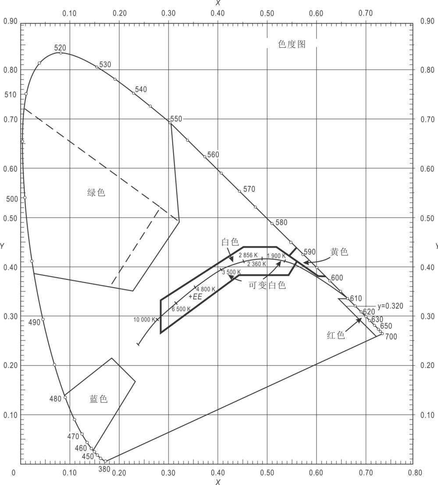

图A1-1a航空地面灯的颜色（灯丝型灯）

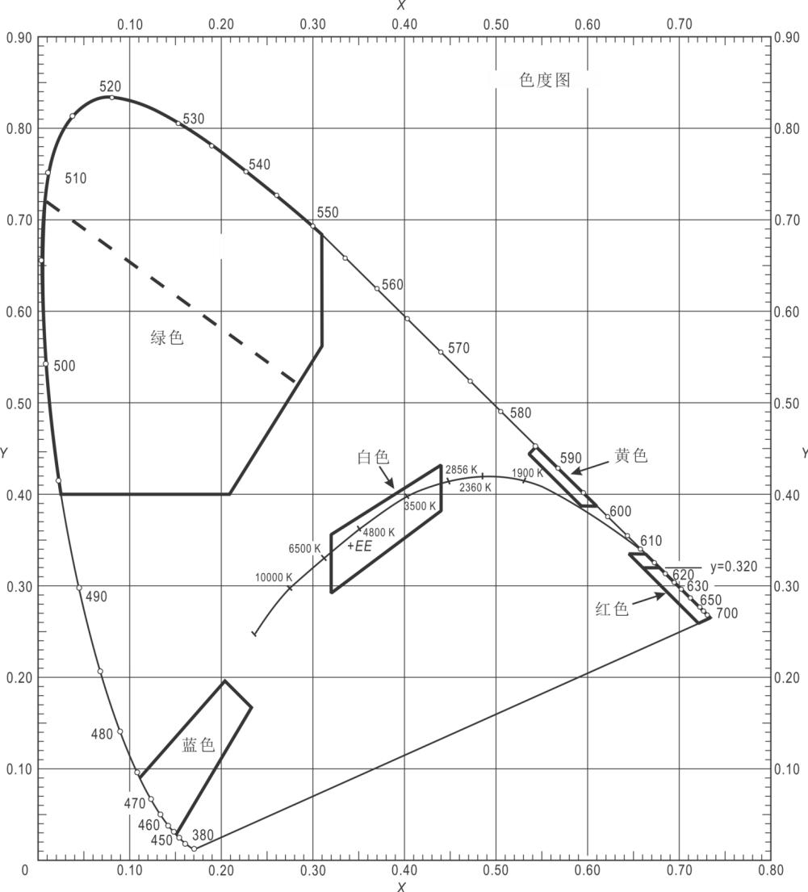

图 A1-1b 航空地面灯的颜色（固态照明）

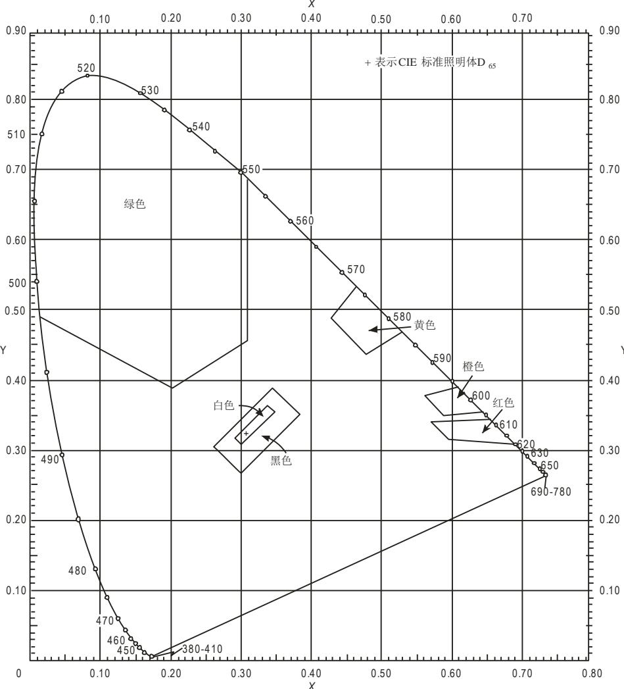

图A1-2用于标志、外部照明的标记牌和面板的普通颜色

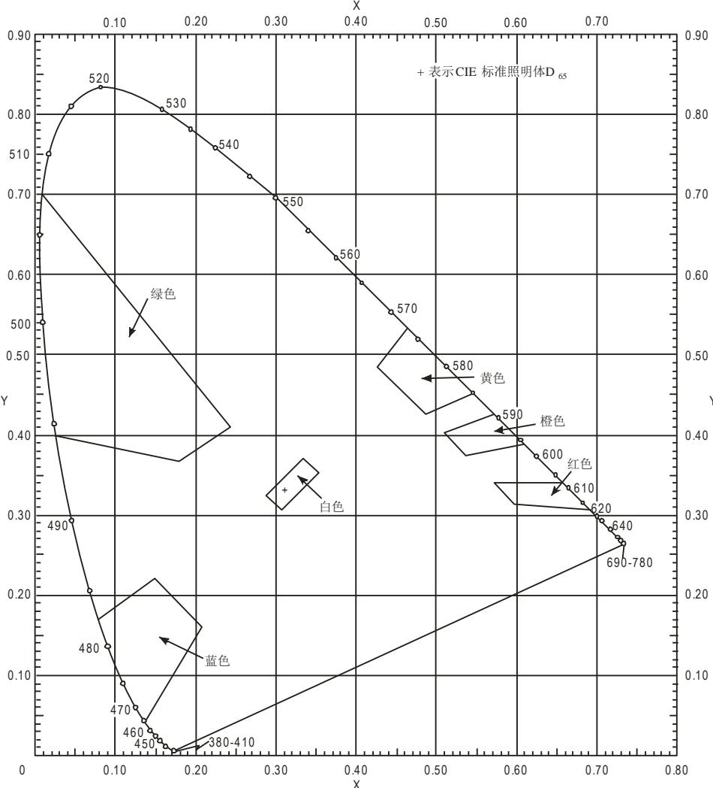

图A1-3标志、标记牌和面板的逆向反光材料的颜色

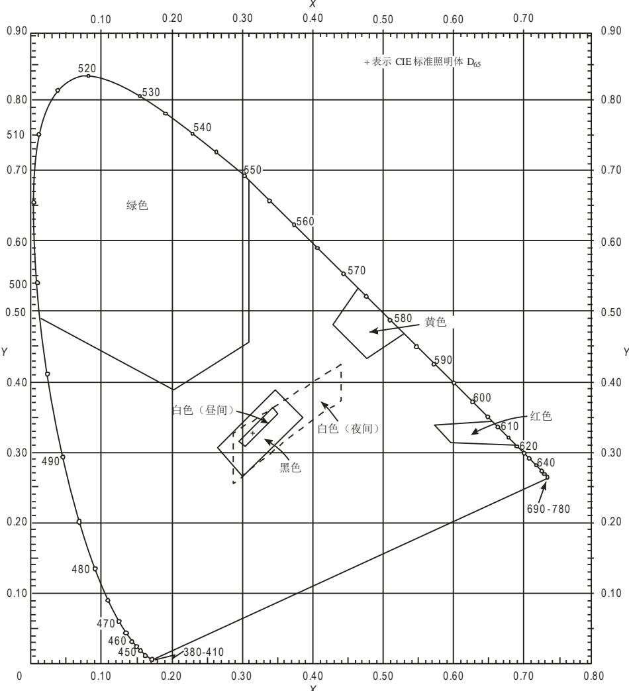

图A1-4荧光或透光（从内部照亮）标记牌和面板的颜色

附录2航空地面灯的特性

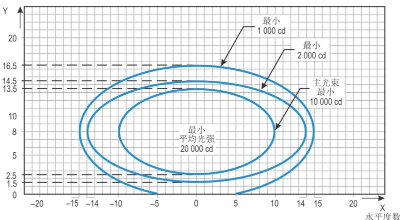

注：

1．曲线按公式$\frac{\mathbf{x}^{2}}{\mathbf{a}^{2}}+\frac{\mathbf{y}^{2}}{\mathbf{b}^{2}}=1$ 算出

<html><body><table border="1"><tr><td>a</td><td>10</td><td>14</td><td>15</td></tr><tr><td>b</td><td>5.5</td><td>6.5</td><td>8.5</td></tr></table></body></html>

2．灯具垂直调置角必须满足主光束垂直覆盖范围要求如下：

距跑道入口的距离主光束垂直覆盖范围

入口至315m 316m至475m 476m至640m 641m及以远

$$0^{\circ}\sim11^{\circ}$$

0.5°11.5°

$$1.5^{\circ}\sim12.5^{\circ}$$

$$2.5^{\circ}\sim13.5^{\circ}$$

3．距离中线大于22.5m的横排灯的灯具必须内倾2度。所有其他灯具轴线必须平行于跑道中线。

4．见图A2-1至图A2-11和图A2-26的总说明。

图A2-1进近灯光系统的中线灯和横排灯（白光）等光强图

垂直度数

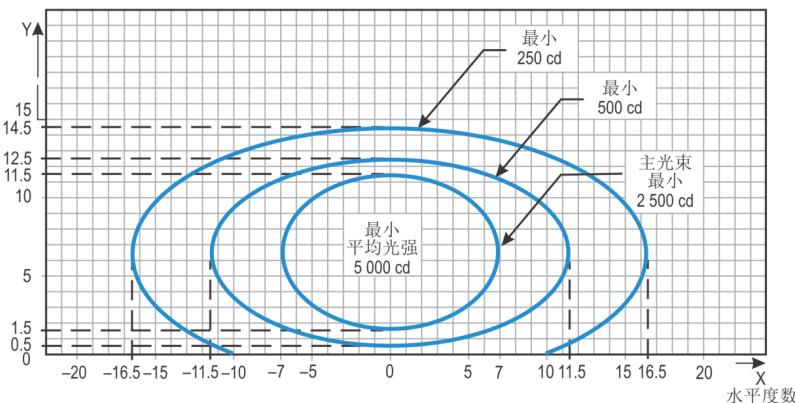

注：

1．曲线按公式$\frac{\mathbf{x}^{2}}{\mathsf{a}^{2}}+\frac{\mathbf{y}^{2}}{\mathsf{b}^{2}}=1$ 算出

<html><body><table border="1"><tr><td>a</td><td>7.0</td><td>11.5</td><td>16.5</td></tr><tr><td>b</td><td>5.0</td><td>6.0</td><td>8.0</td></tr></table></body></html>

2.内倾2度。

3．灯具垂直调置角必须满足主光束垂直覆盖范围要求如下：

距跑道入口的距离

主光束垂直覆盖范围

入口至115m 116m至215m 216m及以远

$$\begin{aligned}&0^{\circ}\sim10.5^{\circ}\\&1^{\circ}\sim11^{\circ}\\ \end{aligned}$$

$1.5^{\circ}\sim11.5^{\circ}$ (如图所示）

4.A见图2-1至图A2-11和图A2-26的总说明。

图A2-2进近灯光系统的侧边灯等光强图(红光)

注：

1．曲线按公式$\frac{\mathbf{x}^{2}}{\mathbf{a}^{2}}+\frac{\mathbf{y}^{2}}{\mathbf{b}^{2}}=1$ 算出

<html><body><table border="1"><tr><td>a</td><td>5.5</td><td>7.5</td><td>9.0</td></tr><tr><td>b</td><td>4.5</td><td>6.0</td><td>8.5</td></tr></table></body></html>

2.内倾3.5度。

3．见图A2-1至图A2-11和图A2-26的总说明。

图A2-3跑道入口灯等光强图 (绿光）

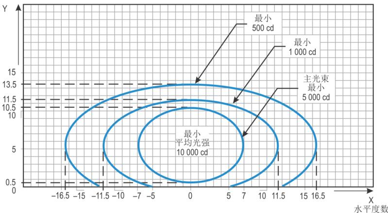

注：

1．曲线按公式$\frac{\mathbf{x}^{2}}{\mathbf{a}^{2}}+\frac{\mathbf{y}^{2}}{\mathbf{b}^{2}}=1$ 算出

<html><body><table border="1"><tr><td>a</td><td>7.0</td><td>11.5</td><td>16.5</td></tr><tr><td>b</td><td>5.0</td><td>6.0</td><td>8.0</td></tr></table></body></html>

2．内倾2度。

3．见图A2-1至图A2-11和图A2-26的总说明。

图A2-4跑道入口翼排灯等光强图 （绿光）

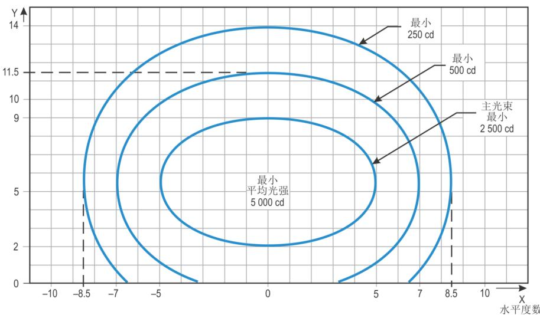

注：

1．曲线按公式$\frac{\mathbf{x}^{2}}{\mathbf{a}^{2}}+\frac{\mathbf{y}^{2}}{\mathbf{b}^{2}}=1$ 算出

<html><body><table border="1"><tr><td>a</td><td>5.0</td><td>7.0</td><td>8.5</td></tr><tr><td>b</td><td>3.5</td><td>6.0</td><td>8.5</td></tr></table></body></html>

2.内倾4度。

3．见图A2-1至图A2-11和图A2-26的总说明。

图A2-5接地带灯等光强图 (白光)

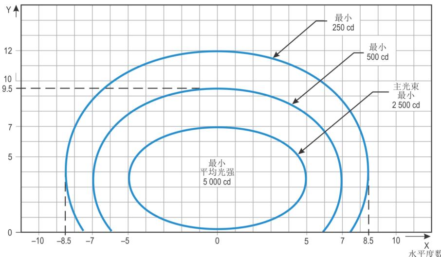

注：

1．曲线按公式$\frac{\mathbf{x}^{2}}{\mathbf{a}^{2}}+\frac{\mathbf{y}^{2}}{\mathbf{b}^{2}}=1$ 算出

<html><body><table border="1"><tr><td>a</td><td>5.0</td><td>7.0</td><td>8.5</td></tr><tr><td>b</td><td>3.5</td><td>6.0</td><td>8.5</td></tr></table></body></html>

2.对红光将数值乘以0.15。

3．对黄光将数值乘以0.40。

4.见图A2-1至图A2-11和图A2-26的总说明。

图A2-6纵向间距为30m的跑道中线灯（白光）和快速出口滑行道指示灯（黄光）等光强图

注：

1．曲线按公式$\frac{\mathbf{x}^{2}}{\mathbf{a}^{2}}+\frac{\mathbf{y}^{2}}{\mathbf{b}^{2}}=1$ 算出

<html><body><table border="1"><tr><td>a</td><td>5.0</td><td>7.0</td><td>8.5</td></tr><tr><td>b</td><td>4.5</td><td>8.5</td><td>10</td></tr></table></body></html>

2.对红光将数值乘以0.15。

3.对黄光将数值乘以0.40。

4.见图A2-1至图A2-11和图A2-26的总说明。

图A2-7纵向间距为15m的跑道中线灯（白光）和快速出口滑行道指示灯（黄光）等光强图

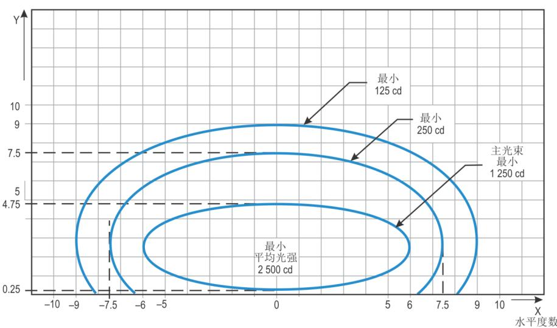

注：

1．曲线按公式$\frac{\mathbf{x}^{2}}{\mathbf{a}^{2}}+\frac{\mathbf{y}^{2}}{\mathbf{b}^{2}}=1$ 算出

<html><body><table border="1"><tr><td>a</td><td>6.0</td><td>7.5</td><td>9.0</td></tr><tr><td>b</td><td>2.25</td><td>5.0</td><td>6.5</td></tr></table></body></html>

2.见图A2-1至图A2-11和图A2-26的总说明。

图A2-8跑道末端灯等光强图 (红光)

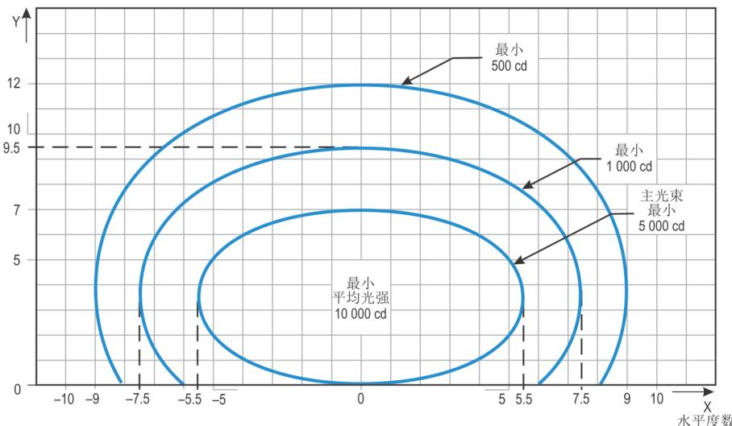

注：

1．曲线按公式$\frac{\mathbf{x}^{2}}{\mathbf{a}^{2}}+\frac{\mathbf{y}^{2}}{\mathbf{b}^{2}}=1$ 算出

<html><body><table border="1"><tr><td>a</td><td>5.5</td><td>7.5</td><td>9.0</td></tr><tr><td>b</td><td>3.5</td><td>6.0</td><td>8.5</td></tr></table></body></html>

2.内倾3.5度。

3.对红光将数值乘以0.15。

4.对黄光将数值乘以0.40。

5.见图A2-1至图A2-11和图A2-26的总说明。

图A2-9跑道宽度为45m的跑道边灯等光强图(白光)

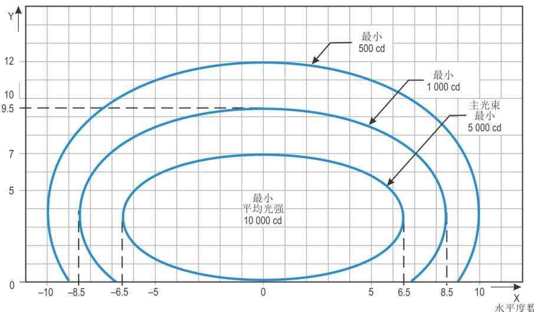

注：

1．曲线按公式$\frac{\mathbf{x}^{2}}{\mathbf{a}^{2}}+\frac{\mathbf{y}^{2}}{\mathbf{b}^{2}}=1$ 算出

<html><body><table border="1"><tr><td>a</td><td>6.5</td><td>8.5</td><td>10.0</td></tr><tr><td>b</td><td>3.5</td><td>6.0</td><td>8.5</td></tr></table></body></html>

2.内倾4.5度。

3.对红光将数值乘以0.15。

4.对黄光将数值乘以0.40。

5.见图A2-1至图A2-11和图A2-26的总说明。

图A2-10 跑道宽度为60m的跑道边灯等光强图(白光)

垂直度数

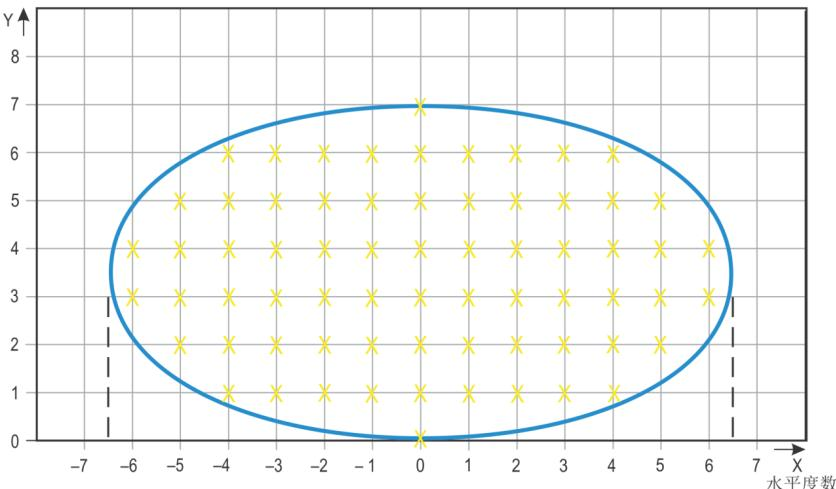

图A2-11用于计算进近灯和跑道灯平均光强的网格点

图A2-1至图A2-11和图A2-26的总说明

1．每一图中的椭圆均对称于公共垂直和水平轴。

2.图A2-1至图A2-10及图A2-26示出了最小允许光强。主光束的平均光强按以下计算：按图A2-11所示建立代表主光束的椭圆和网格点，使用测出的代表主光束的椭圆上的和椭圆以内的各网格点上的光强值，计算出网格点上的各光强值的算术平均值即为主光束的平均光强。

3．当灯具正确地对正方向时，主光束的图形不得有偏移。

4．平均光强比。平均光强比为一个典型的新灯具的主光束椭圆之内的平均光强与一个新的跑道边灯的主光束的平均光强之比。各种灯具的平均光强比必须如下列：

图A2-1进近灯光系统的中线灯和横排灯1.5~2.0（白光）

图A2-2进近灯光系统的侧边灯0.5~1.0（红光）

图A2-3跑道入口灯1.0~1.5(绿光)

图A2-4跑道入口翼排灯1.0~1.5（绿光）

图A2-5接地带灯0.5~1.0（白光）

图A2-6跑道中线灯（纵向间距30m）0.5~1.0(白光)

图A2-7跑道中线灯（纵向间距15m）0.5~1.0（类用，白光）

图A2-8跑道末端灯0.25~0.5（红光）

图A2-9跑道边灯（跑道宽度45m）1.0（白光）

图A2-10跑道边灯 （跑道宽度60m）1.0（白光）

5．图示光束范围均能提供必要的进近引导直到跑道视程降低至150m左右和起飞引导直到跑道视程降低至100m左右。

6．水平角均以通过跑道中线的垂直面为测量基准。除中线灯以外的灯，以趋向跑道中线的方向作为正的方向。垂直角为相对于水平平面量出的角度。

7．在采用嵌入式灯具代替立式灯具之处，例如在入口内移的跑道上，对进近灯光系统的中线灯、横排灯和侧边灯的光强要求可用在每一位置安装2个或3个光强较低的灯具的办法来满足。

8．充分维护的重要性是怎么强调都不会过分的。平均光强决不应降低至图示光强值的50%以下。机场当局应以保持光输出水平接近于规定的最小平均光强为目标。

9．灯具的安装必须使主光束方向符合规定，其偏差不得大于1/2度。

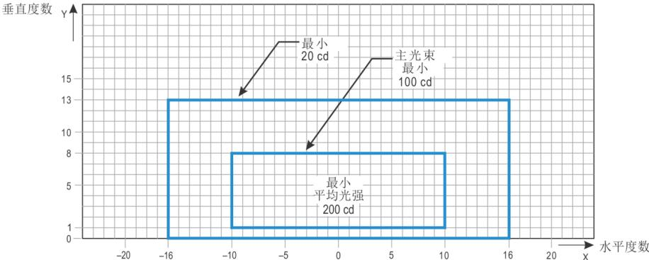

注：

1.这些光束覆盖范围允许驾驶舱偏离中线直至12m，并准备使用于弯道的前面和后面。

2.见图A2-12至图A2-21的总说明。

3．5.3.16.9中所建议的增强型快速出口滑行道中线灯的增大的光强值均为图示各值的4倍一（即主光束的最小平均光强为800cd)。

图A2-12拟用于跑道视程小于350m左右并有偏离中线较远的可能的情况下直线段上滑行道中线灯（间距15m）、跑道进入灯、禁止进入排灯、停止排灯和低光强B型跑道警戒灯的等光强图 

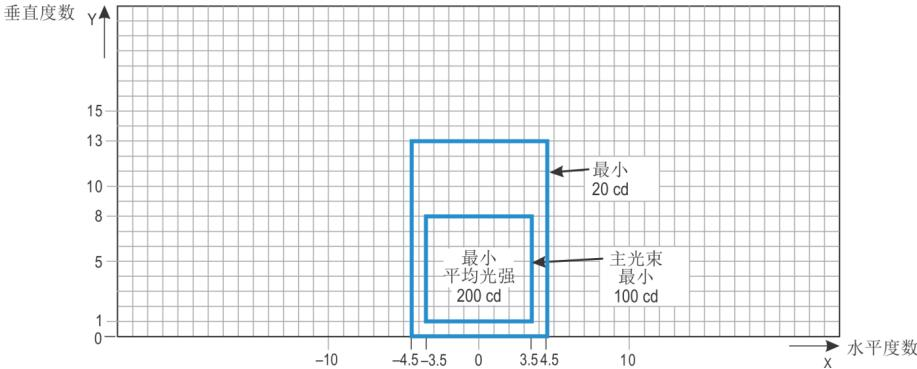

注：

1．这些光束覆盖范围一般能令人满意，并已照顾到驾驶舱偏离中线约3m这种正常情况。

2．见图A2-12至图A2-21的总说明。

图A2-13拟用于跑道视程小于350m情况下直线段上滑行道 中线灯（间距15m）、禁止进入排灯 和停止排灯的等光强图  

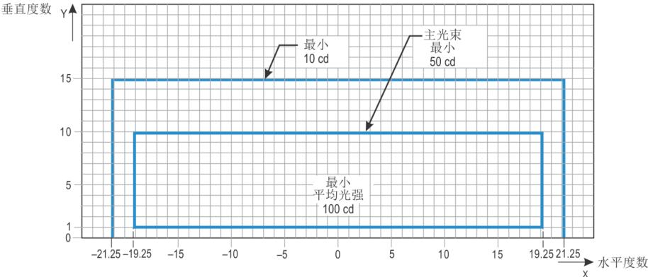

注：

1．弯道上的灯具相对于弯道切线内倾15.75度。这对跑道进入灯（RELs）不适用。

2．跑道进入灯的增强光强必须是规定光强的两倍，即最小20cd、主光束最小100cd和最小平均光强200cd。3．见图A2-12至图A2-21的总说明。

图A2-14拟用于跑道视程小于350m情况下

弯道上的滑行道中线灯（间距7.5m）、跑道进入灯、禁止进入排灯和停止排灯的等光强图

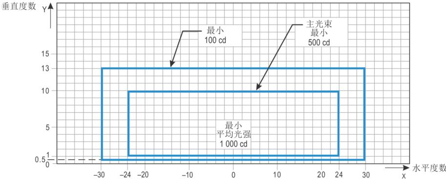

注：

1．在背景亮度经常较高和由于尘土、积雪和局部污染使得光输出显著下降之处，应将图示光强值乘以2.5。

2．在使用全向灯具时，灯具必须符合本图中的光束垂直要求。

3．见图A2-12至图A2-21的总说明。

图A2-15拟用于跑道视程为350m或更大的情况下

直线段上滑行道中线灯（间距30m、60m）、禁止进入排灯和停止排灯的等光强图

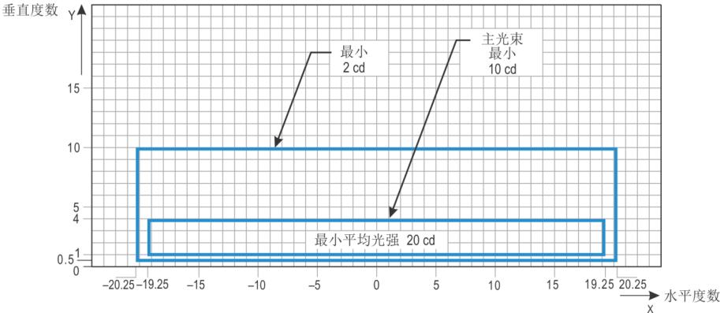

注：

1．弯道上的灯具相对于弯道切线内倾15.75度。

2．在背景亮度经常较高和由于尘土、积雪和局部污染使得光输出显著下降之处，应将图示光强值乘以2.5。

3．这些光束覆盖范围允许驾驶舱偏离中线约12m，例如在弯道末端会出现此种情况。

4.见图A2-12至图A2-21的总说明。

图A2-16拟用于跑道视程为350m或更大情况下，

弯道上的滑行道中线灯（间距7.5m、15m、30m）、禁止进入排灯和停止排灯的等光强图

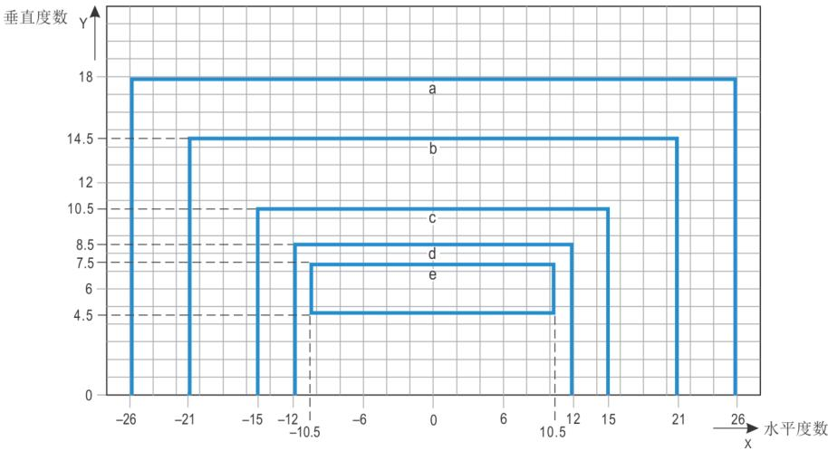

<html><body><table border="1"><tr><td>曲线</td><td>a</td><td>b</td><td>c</td><td>d</td><td>e</td></tr><tr><td>光强 (cd)</td><td>8</td><td>20</td><td>100</td><td>450</td><td>1 800</td></tr></table></body></html>

注：

1．这些光束覆盖范围允许驾驶舱偏离中线达12m左右，并准备用于弯道的前面和后面。

2.见图A2-12至图A2-21的总说明。

图A2-17拟用于偏离可能较大并需要较高光强的

高级地面活动引导及控制系统中的直线段上的高光强滑行道

中线灯（间距15m）、禁止进入排灯

和停止排灯的等光强图

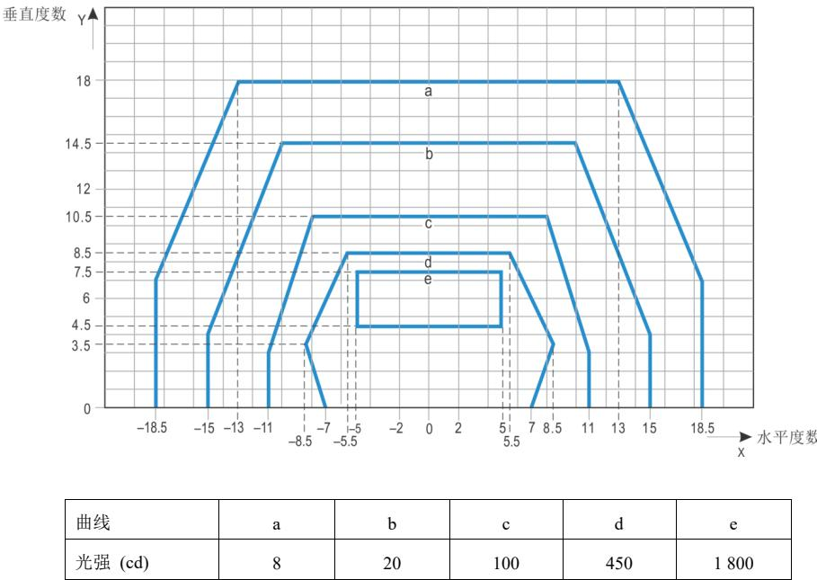

注：

1．这些光束覆盖范围一般能令人满意并已照顾到主起落架外轮跑到滑行道边这种正常的驾驶舱偏离。2．见图A2-12至图A2-21的总说明。

图A2-18拟用于需要较高光强的高级地面活动引导及控制系统中的直线段上的高光强滑行道中线灯（间距15m）、禁止进入排灯和停止排灯的等光强图

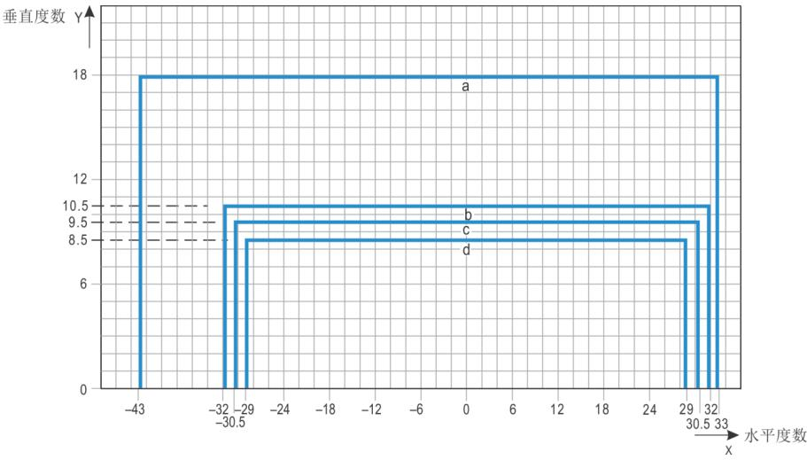

<html><body><table border="1"><tr><td>曲线</td><td>a</td><td>b</td><td>c</td><td>d</td></tr><tr><td>光强 (cd)</td><td>8</td><td>100</td><td>200</td><td>400</td></tr></table></body></html>

注：

1．弯道上的灯具相对于弯道切线内倾17度。

2．见图A2-12至图A2-21的总说明。

图A2-19拟用于需要较高光强的高级地面活动引导及控制系统中的弯道上的高光强滑行道中线灯（间距7.5m）、禁止进入排灯和停止排灯的等光强图

注：

1．虽然灯具在正常运行中闪光，光强是按恒定发光的白炽灯规定的。

2．见图A2-12至图A2-21的总说明。

图A2-20B型高光强跑道警戒灯的等光强图

图A2-21用于计算滑行道中线灯和停止排灯平均光强的网格点

图A2-12至图A2-21的总说明

1．图2-12至图2-20规定的光强指的是滑行道中线灯的绿色和黄色光强和停止排灯的红色光强以及跑道警戒灯的黄色光强。

2．图A2-12至图A2-20的所示光强为最小允许光强。主光束的平均光强按以下计算：按图A2-21所示建立代表主光束的长方形和网格点，使用测出的代表主光束的长方形上的和长方形以内的各网格点上的光强值，计算出网格点上的各光强值的算术平均值即为主光束的平均光强。

3．当灯具正确地对准方向时，主光束或最里面的光束（视情况而定）不得有偏移。

4．水平角均以通过滑行道中线的垂直面为测量基准，只有在滑行道的弯道部分是以弯道曲线的切线为测量基准。

5．垂直角是从滑行道道面的纵坡量得的角度。

6．充分维护的重要性是怎么强调都不会过分的。平均光强或相应的等光强曲线上规定的光强决不应降至图示光强的50%以下。机场当局应以保持光输出水平接近规定的最小平均光强为目标。

7．灯具的安装必须酌情使主光束或最里面的光束的方向符合规定，偏差不得大于1/2度。

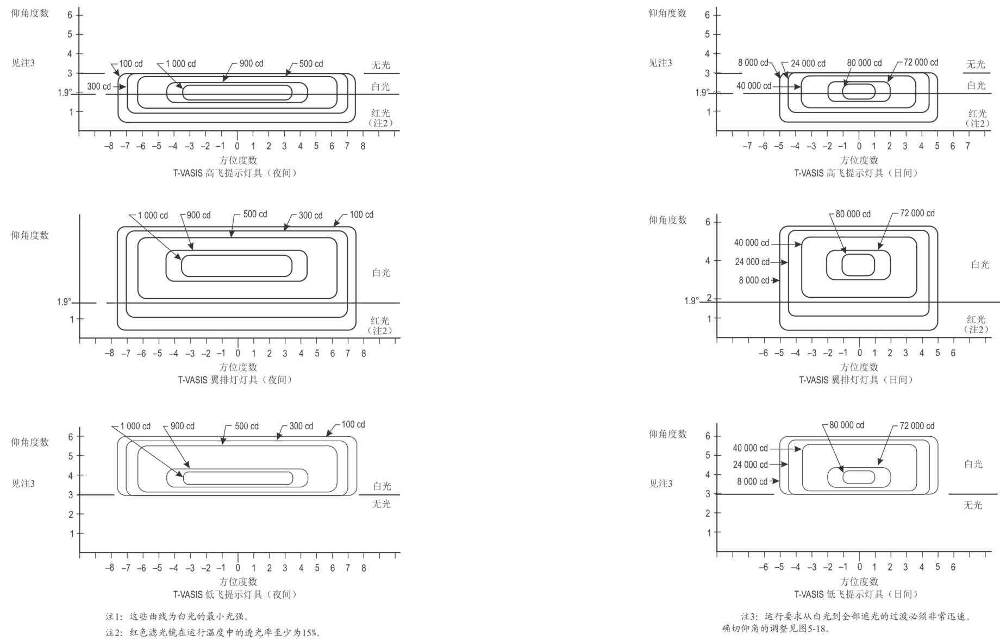

图A2-22T-VASIS和AT-VASIS的光强分布

仰角度数

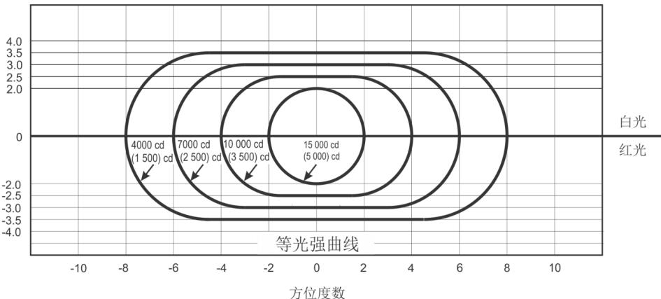

注：

1．这些曲线为红光的最小光强。

2．白光区的光强值为相应红光区光强的2倍以上，最高可达6.5倍。

3.APAPI的光强值示于括弧内。

图A2-23PAPI和APAPI的光强分布

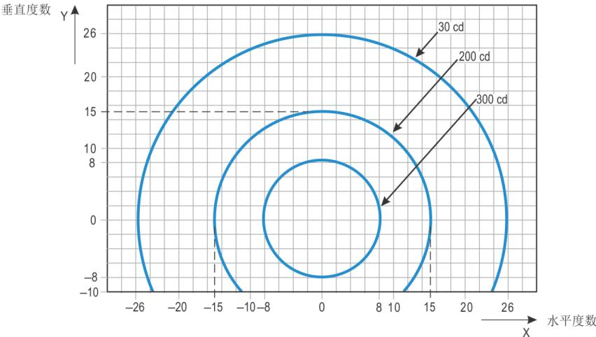

注：

1．虽然灯具在正常运行中闪光，光强是按恒定发光的白炽灯规定的。

2．规定的光强是指黄色光强。

图A2-24A型低光强跑道警戒灯内每一个灯的等光强图

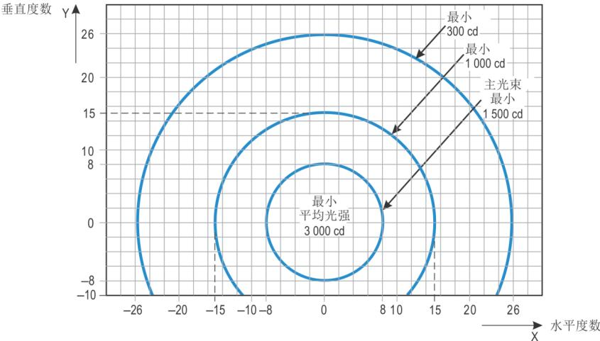

注：

1．虽然灯具在正常运行中闪光，光强是按恒定发光的白炽灯规定的。

2．规定的光强是指黄色光强。

图A2-25A型高光强跑道警戒灯内每一个灯的等光强图

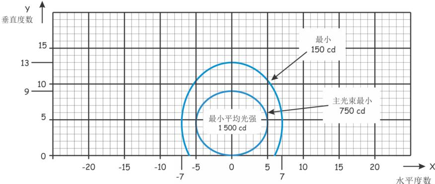

注：

1．曲线按公式$\frac{\mathbf{x}^{2}}{\mathsf{a}^{2}}+\frac{\mathbf{y}^{2}}{\mathsf{b}^{2}}=1$ 算出

<html><body><table border="1"><tr><td>a</td><td>5.0</td><td>7.0</td></tr><tr><td>b</td><td>4.5</td><td>8.5</td></tr></table></body></html>

2.见图A2-1至图A2-11和图A2-26的总说明。

图A2-26起飞等待灯（THL）等光强图（红色）

## 附录3强制性指令标志和信息标志

注1：有关强制性指令标志和信息标志的应用、位置和特性的规范，见第5章5.2.16和5.2.17。

注2：本附录在网格上详细地绘出了强制性指令标志和信息标志的字母、数字和符号的形状及比例。

注3：如图A3-1，道面上的强制性指令标志和信息标志，其构成跟等效立式标记牌字符乘以2.5倍数的投影一样（即：被延长）。但是，投影只影响垂直尺寸。因此，通过首先确定等效立式标记牌字符的高度，得出道面标志的字符间距，然后按比例分摊表A4-1给出的间距数值。

例如；对于4000毫米高（Hps）的跑道识别号“10”而言，等效立式标记牌字符的高度是4000/2.5=1600毫米（Hes）。表A4-1(b)标明了数字间距代码1，并且从表A4-1(c)看到，对于400毫米高的字符而言，这一代码的尺寸为96毫米。因此，“10”的道面标志的间距就是（1600/400）*96=384毫米。

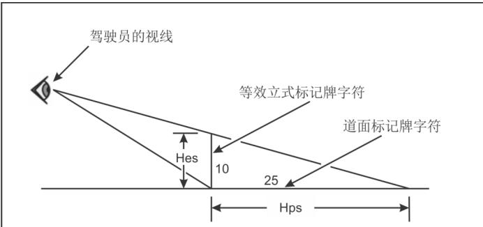

图A3-1

<html><body><table border="1"><tbody><tr><td></td><td></td><td></td><td></td><td></td><td></td><td></td><td></td><td></td><td></td><td></td><td></td><td></td><td></td><td></td><td></td><td></td><td></td><td></td><td></td><td></td><td></td><td></td><td></td><td></td><td></td><td></td><td></td><td></td><td></td><td></td><td></td><td></td><td></td></tr><tr><td></td><td></td><td></td><td></td><td></td><td></td><td></td><td></td><td></td><td></td><td></td><td></td><td></td><td></td><td></td><td></td><td></td><td></td><td></td><td></td><td></td><td></td><td></td><td></td><td></td><td></td><td></td><td></td><td></td><td></td><td></td><td></td><td></td><td></td></tr><tr><td></td><td></td><td></td><td></td><td></td><td></td><td></td><td></td><td></td><td></td><td></td><td></td><td></td><td></td><td></td><td></td><td></td><td></td><td></td><td></td><td></td><td></td><td></td><td></td><td></td><td></td><td></td><td></td><td></td><td></td><td></td><td></td><td></td><td></td></tr><tr><td></td><td></td><td></td><td></td><td></td><td></td><td></td><td></td><td></td><td></td><td></td><td></td><td></td><td></td><td></td><td></td><td></td><td></td><td></td><td></td><td></td><td></td><td></td><td></td><td></td><td></td><td></td><td>X /</td><td></td><td></td><td></td><td>/</td><td>]</td></tr><tr><td></td><td></td><td></td><td></td><td></td><td></td><td></td><td></td><td></td><td></td><td></td><td></td><td></td><td></td><td></td><td></td><td></td><td>E</td><td></td><td>7</td><td>人</td><td></td><td></td><td></td><td></td><td></td><td></td><td></td><td></td><td></td><td></td><td></td><td></td></tr><tr><td></td><td></td><td></td><td></td><td></td><td></td><td></td><td></td><td></td><td></td><td></td><td></td><td></td><td></td><td></td><td></td><td></td><td></td><td></td><td></td><td></td><td></td><td></td><td></td><td></td><td></td><td></td><td></td><td>/</td><td>2</td><td></td><td></td><td></td></tr><tr><td></td><td>F V</td><td></td><td></td><td></td><td></td><td></td><td></td><td></td><td></td><td></td><td></td><td></td><td>F</td><td>V</td><td></td><td></td><td></td><td></td><td></td><td></td><td></td><td></td><td></td><td></td><td></td><td></td><td></td><td></td><td></td><td></td><td></td><td></td></tr><tr><td></td><td></td><td></td><td></td><td></td><td></td><td></td><td></td><td></td><td></td><td></td><td></td><td></td><td></td><td></td><td></td><td></td><td></td><td></td><td></td><td></td><td></td><td>国</td><td></td><td></td><td></td><td></td><td></td><td></td><td></td><td></td><td></td><td></td></tr><tr><td></td><td></td><td></td><td></td><td></td><td></td><td></td><td></td><td></td><td></td><td></td><td></td><td></td><td></td><td></td><td></td><td></td><td></td><td></td><td></td><td></td><td></td><td></td><td></td><td></td><td></td><td></td><td></td><td></td><td></td><td></td><td></td><td></td></tr><tr><td></td><td></td><td></td><td></td><td></td><td></td><td></td><td></td><td></td><td></td><td></td><td></td><td></td><td></td><td></td><td></td><td></td><td></td><td></td><td></td><td></td><td></td><td></td><td></td><td></td><td></td><td></td><td></td><td></td><td></td><td></td><td></td><td></td></tr><tr><td></td><td></td><td></td><td></td><td></td><td></td><td></td><td></td><td></td><td></td><td></td><td></td><td></td><td></td><td></td><td></td><td></td><td></td><td></td><td></td><td></td><td></td><td></td><td></td><td></td><td></td><td></td><td></td><td></td><td></td><td></td><td></td><td></td></tr><tr><td></td><td></td><td></td><td></td><td></td><td></td><td></td><td></td><td></td><td></td><td></td><td></td><td></td><td></td><td></td><td></td><td></td><td></td><td></td><td></td><td></td><td></td><td></td><td></td><td></td><td></td><td></td><td></td><td></td><td></td><td></td><td></td><td></td></tr><tr><td></td><td></td><td></td><td></td><td></td><td></td><td></td><td></td><td></td><td></td><td></td><td></td><td></td><td></td><td></td><td></td><td></td><td></td><td></td><td></td><td></td><td></td><td></td><td></td><td></td><td></td><td></td><td></td><td></td><td></td><td></td><td></td><td></td></tr><tr><td></td><td></td><td></td><td></td><td></td><td></td><td></td><td></td><td></td><td></td><td></td><td></td><td></td><td></td><td></td><td></td><td></td><td></td><td></td><td></td><td></td><td></td><td></td><td></td><td></td><td></td><td></td><td></td><td></td><td></td><td></td><td></td><td></td></tr><tr><td></td><td></td><td></td><td></td><td></td><td></td></table></body></html>

<html><body><table border="1"><tbody><tr><td></td><td></td><td></td><td></td><td></td><td></td><td></td><td></td><td></td><td></td><td></td><td></td><td></td><td></td><td></td><td></td><td></td><td></td><td></td><td></td><td></td><td></td><td></td><td></td><td></td><td></td><td></td><td></td><td></td><td></td><td></td><td></td><td></td><td></td><td></td><td></td><td></td><td></td></tr><tr><td></td><td></td><td></td><td></td><td></td><td></td><td></td><td></td><td></td><td></td><td></td><td></td><td></td><td></td><td></td><td></td><td></td><td></td><td></td><td></td><td></td><td></td><td>E</td><td>E</td><td></td><td></td><td></td><td></td><td></td><td></td><td></td><td></td><td></td><td></td><td></td><td></td><td></td><td></td></tr><tr><td></td><td></td><td></td><td></td><td></td><td></td><td></td><td></td><td></td><td></td><td></td><td></td><td></td><td></td><td></td><td></td><td></td><td></td><td></td><td></td><td>−</td><td></td><td></td><td></td><td></td><td></td><td></td><td></td><td></td><td></td><td></td><td></td><td></td><td></td><td></td><td></td><td></td><td></td></tr><tr><td></td><td></td><td></td><td></td><td></td><td></td><td></td><td></td><td></td><td></td><td></td><td></td><td></td><td></td><td></td><td></td><td></td><td></td><td></td><td></td><td></td><td></td><td></td><td></td><td></td><td></td><td></td><td></td><td></td><td></td><td></td><td></td><td></td><td></td><td></td><td></td><td></td><td></td></tr><tr><td></td><td></td><td></td><td></td><td></td><td></td><td></td><td></td><td></td><td></td><td></td><td></td><td></td><td></td><td></td><td></td><td></td><td></td><td></td><td></td><td></td><td></td><td></td><td></td><td></td><td></td><td></td><td></td><td>不 , 广 不 </td><td></td><td></td><td></td><td></td><td></td><td></td><td></td><td></td><td></td></tr><tr><td></td><td></td><td></td><td></td><td></td><td></td><td></td><td></td><td></td><td></td><td></td><td></td><td></td><td></td><td></td><td></td><td></td><td></td><td></td><td></td><td></td><td></td><td></td><td></td><td></td><td></td><td></td><td></td><td></td><td></td><td></td><td></td><td></td><td></td><td></td><td></td><td></td><td></td></tr><tr><td></td><td></td><td></td><td></td><td></td><td></td><td></td><td></td><td></td><td></td><td></td><td></td><td></td><td></td><td></td><td></td><td></td><td></td><td></td><td></td><td></td><td></td><td></td><td></td><td></td><td></td><td></td><td></td><td></td><td></td><td></td><td></td><td></td><td></td><td></td><td></td><td></td><td></td></tr><tr><td></td><td></td><td></td><td></td><td></td><td></td><td></td><td></td><td></td><td></td><td></td><td></td><td></td><td></td><td></td><td></td><td></td><td></td><td></td><td></td><td></td><td></td><td></td><td></td><td></td><td></td><td></td><td></td><td></td><td></td><td></td><td></td><td></td><td></td><td></td><td></td><td></td><td></td></tr><tr><td></td><td></td><td></td><td></td><td></td><td></td><td></td><td></td><td></td><td></td><td></td><td></td><td></td><td></td><td></td><td></td><td></td><td></td><td></td><td></td><td></td><td></td><td></td><td></td><td></td><td></td><td></td><td></td><td></td><td></td><td></td><td></td><td></td><td></td><td></td><td></td><td></td><td></td></tr><tr><td></td><td></td><td></td><td></td><td></td><td></td><td></td><td></td><td></td><td></td><td></td><td></td><td></td><td></td><td></td><td></td><td></td><td></td><td></td><td></td><td></td><td></td><td></td><td></td><td></td><td></td><td></td><td></td><td></td><td></td><td></td><td></td><td></td><td></td><td></td><td></td><td></td><td></td></tr><tr><td></td><td></td><td></td><td></td><td></td><td></td><td></td><td></td><td></td><td></td><td></td><td></td><td></td><td></td><td></td><td></td><td></td><td></td><td></td><td></td><td></td><td></td><td></td><td></td><td></td><td></td><td></td><td></td><td></td><td></td><td></td><td></td><td></td><td></td><td></td><td></td><td></td><td></td><td></td></tr><tr><td></td><td></td><td></td><td></td><td></td><td></td><td></td><td></td><td></td><td></td><td></td><td></td><td></td><td></td><td></td><td></td><td></td><td></td><td></td><td></td><td></td><td></td><td></td><td></td><td></td><td></td><td></td><td></td><td></td><td></td><td></td><td></td><td></td><td></td><td></td><td></td><td></td><td></td><td></td></tr><tr><td></td><td></td><td></td><td></td><td></td><td></td><td></td><td></td><td></td><td></td><td></td><td></td><td></td><td></td><td></td><td></td><td></td></table></body></html>

<html><body><table border="1"><tbody><tr><td></td><td></td><td></td><td></td><td></td><td></td><td></td><td></td><td></td><td></td><td></td><td></td><td></td><td></td><td></td><td></td><td></td><td></td><td></td><td></td><td></td><td></td><td></td><td></td><td></td><td></td><td></td><td></td><td></td><td></td><td></td><td></td><td></td><td></td><td></td><td></td></tr><tr><td></td><td></td><td></td><td></td><td></td><td></td><td></td><td></td><td></td><td></td><td></td><td></td><td></td><td></td><td></td><td></td><td></td><td></td><td></td><td></td><td></td><td></td><td></td><td></td><td></td><td></td><td></td><td></td><td></td><td></td><td></td><td></td><td></td><td></td><td></td><td></td></tr><tr><td></td><td></td><td></td><td></td><td></td><td></td><td></td><td></td><td></td><td></td><td></td><td></td><td></td><td></td><td></td><td>人</td><td></td><td></td><td></td><td></td><td></td><td>E</td><td>[]</td><td></td><td></td><td></td><td></td><td></td><td></td><td></td><td></td><td></td><td>E</td><td></td><td></td></tr><tr><td></td><td></td><td></td><td></td><td></td><td></td><td></td><td></td><td></td><td></td><td></td><td></td><td></td><td>T</td><td>+</td><td></td><td>— </td><td></td><td>S</td><td>ci</td><td>—</td><td></td><td></td><td></td><td></td><td></td><td>—</td><td>+</td><td>二</td><td></td><td></td><td></td><td></td><td></td><td></td></tr><tr><td></td><td></td><td></td><td></td><td></td><td></td><td></td><td></td><td></td><td></td><td></td><td></td><td></td><td>I</td><td>=</td><td></td><td></td><td></td><td></td><td></td><td></td><td>i</td><td></td><td></td><td></td><td></td><td></td><td></td><td></td><td></td><td></td><td></td><td></td><td></td><td></td></tr><tr><td></td><td></td><td></td><td></td><td></td><td></td><td></td><td></td><td></td><td></td><td></td><td></td><td></td><td></td><td></td><td></td><td></td><td></td><td></td><td></td><td></td><td></td><td></td><td>−</td><td>−</td><td></td><td></td><td></td><td></td><td></td><td></td><td></td><td></td><td></td><td></td></tr><tr><td></td><td></td><td></td><td></td><td></td><td></td><td></td><td></td><td></td><td></td><td></td><td></td><td></td><td></td><td></td><td></td><td></td><td></td><td></td><td></td><td></td><td></td><td></td><td></td><td></td><td></td><td></td><td></td><td></td><td></td><td></td><td></td><td></td><td></td><td></td></tr><tr><td></td><td></td><td></td><td></td><td>| , (cid</td><td></td><td></td><td>(cid</td><td></td><td></td><td></td><td></td><td></td><td></td><td></td><td></td><td></td><td></td><td></td><td></td><td></td><td></td><td></td><td></td><td></td><td></td><td></td><td></td><td></td><td></td><td></td><td></td><td></td><td></td><td></td></tr><tr><td></td><td></td><td></td><td></td><td></td><td></td><td></td><td></td><td></td><td></td><td></td><td></td><td></td><td></td><td></td><td></td><td></td><td></td><td>1</td><td></td><td></td><td></td><td></td><td></td><td></td><td></td><td></td><td></td><td></td><td></td><td></td><td></td><td></td><td></td><td></td></tr><tr><td></td><td></td><td></td><td></td><td></td><td></td><td></td><td></td><td></td><td></td><td></td><td></td><td></td><td></td><td></td><td></td><td></td><td></td><td></td><td></td><td></td><td></td><td></td><td></td><td></td><td></td><td></td><td></td><td></td><td></td><td></td><td></td><td></td><td></td><td></td></tr><tr><td></td><td></td><td></td><td></td><td></td><td></td><td></td><td></td><td></td><td></td><td></td><td></td><td></td><td></td><td></td><td></td><td></td><td></td><td></td><td></td><td></td><td></td><td></td><td></td><td></td><td></td><td></td><td></td><td></td><td></td><td></td><td></td><td></td><td></td><td></td></tr><tr><td></td><td></td><td></td><td></td><td></td><td></td><td></td><td></td><td></td><td></td><td></td><td></td><td></td><td></td><td></td><td></td><td></td><td></td><td></td><td></td><td></td><td></td><td></td><td></td><td></td><td></td><td></td><td></td><td></td><td></td><td></td><td></td><td></td><td></td><td></td></tr><tr><td></td><td></td><td></td><td></td><td></td><td></td><td></td><td></td><td></td><td></td><td></td><td></td><td></td><td></td><td></td><td></td><td></td><td></td><td></td><td></td><td></td><td></td><td></td><td></td><td></td><td></td><td></td><td></td><td></td><td></td><td></td><td></td><td></td><td></td><td></td></tr><tr><td></td><td></td><td></td><td></td><td></td><td></td><td></td><td></td><td></td><td></td><td></td><td></td><td></td><td></td><td></td><td></td></table></body></html>

<html><body><table border="1"><tbody><tr><td></td><td></td><td></td><td></td><td></td><td></td><td></td><td></td><td></td><td></td><td></td><td></td><td></td><td></td><td></td><td></td><td></td><td></td><td></td><td></td><td></td><td></td><td></td><td></td><td></td><td></td><td></td><td></td><td></td><td></td><td></td><td></td><td></td><td></td><td></td><td></td><td></td><td></td></tr><tr><td></td><td></td><td></td><td></td><td></td><td></td><td></td><td></td><td></td><td></td><td></td><td></td><td></td><td></td><td></td><td></td><td></td><td></td><td></td><td></td><td></td><td></td><td></td><td></td><td></td><td></td><td></td><td></td><td></td><td></td><td></td><td></td><td></td><td></td><td></td><td></td><td></td><td></td></tr><tr><td></td><td></td><td></td><td></td><td></td><td></td><td></td><td></td><td></td><td></td><td></td><td></td><td>中</td><td></td><td></td><td></td><td></td><td></td><td></td><td></td><td></td><td></td><td></td><td></td><td></td><td></td><td></td><td></td><td></td><td></td><td></td><td></td><td></td><td></td><td></td><td></td><td></td><td></td></tr><tr><td></td><td></td><td></td><td></td><td></td><td></td><td></td><td></td><td></td><td></td><td></td><td></td><td></td><td></td><td></td><td></td><td></td><td></td><td></td><td></td><td></td><td></td><td></td><td></td><td></td><td></td><td></td><td></td><td></td><td></td><td></td><td></td><td></td><td></td><td></td><td></td><td></td><td></td></tr><tr><td></td><td></td><td></td><td></td><td></td><td></td><td></td><td></td><td></td><td></td><td></td><td></td><td></td><td></td><td></td><td></td><td></td><td></td><td></td><td></td><td></td><td></td><td></td><td></td><td></td><td></td><td></td><td></td><td></td><td></td><td></td><td>二</td><td></td><td></td><td></td><td></td><td></td><td></td></tr><tr><td></td><td></td><td></td><td></td><td></td><td></td><td></td><td></td><td></td><td></td><td></td><td></td><td></td><td></td><td></td><td></td><td></td><td></td><td></td><td></td><td></td><td></td><td></td><td>7</td><td></td><td></td><td></td><td></td><td></td><td></td><td></td><td></td><td></td><td></td><td></td><td></td><td></td><td></td></tr><tr><td></td><td></td><td></td><td></td><td></td><td></td><td></td><td></td><td></td><td></td><td></td><td></td><td></td><td></td><td></td><td></td><td></td><td></td><td></td><td></td><td></td><td></td><td></td><td></td><td></td><td></td><td></td><td></td><td></td><td></td><td></td><td></td><td></td><td></td><td></td><td></td><td></td><td></td></tr><tr><td></td><td></td><td></td><td></td><td></td><td></td><td></td><td></td><td></td><td></td><td></td><td></td><td></td><td></td><td></td><td></td><td></td><td></td><td>−</td><td>/</td><td>力</td><td></td><td></td><td></td><td></td><td></td><td></td><td></td><td></td><td></td><td></td><td></td><td></td><td></td><td></td><td></td><td></td><td></td></tr><tr><td></td><td></td><td></td><td></td><td></td><td></td><td></td><td></td><td></td><td></td><td></td><td></td><td></td><td></td><td></td><td></td><td></td><td></td><td></td><td></td><td></td><td></td><td></td><td></td><td></td><td></td><td></td><td></td><td></td><td></td><td></td><td></td><td></td><td></td><td></td><td></td><td></td><td></td></tr><tr><td></td><td></td><td></td><td></td><td></td><td></td><td></td><td></td><td></td><td></td><td></td><td></td><td></td><td></td><td></td><td></td><td></td><td></td><td></td><td></td><td></td><td></td><td></td><td></td><td></td><td></td><td></td><td></td><td></td><td></td><td></td><td></td><td></td><td></td><td></td><td></td><td></td><td></td></tr><tr><td></td><td></td><td></td><td></td><td></td><td></td><td></td><td></td><td></td><td></td><td></td><td></td><td></td><td></td><td></td><td></td><td></td><td></td><td></td><td></td><td></td><td></td><td></td><td></td><td></td><td></td><td></td><td></td><td></td><td></td><td></td><td></td><td></td><td></td><td></td><td></td><td></td><td></td></tr><tr><td></td><td></td><td></td><td></td><td></td><td></td><td></td><td></td><td></td><td></td><td></td><td></td><td></td><td></td><td></td><td></td><td></td><td></td><td></td><td></td><td></td><td></td><td></td><td></td><td></td><td></td><td></td><td></td><td></td><td></td><td></td><td></td><td></td><td></td><td></td><td></td><td></td><td></td></tr><tr><td></td><td></td><td></td><td></td><td></td><td></td><td></td><td></td><td></td><td></td><td></td><td></td><td></td><td></td><td></td><td></td><td></td><td></td><td></td></table></body></html>

## 附录4有关滑行引导标记牌的设计要求

注：关于标记牌的应用、位置和特性的规范，见第5章第5.4节。

1．文字符号的高度必须符合下表的要求：

<html><body><table border="1"><tr><td rowspan="3">跑道 基准代码</td><td colspan="3">最小字符高度</td></tr><tr><td rowspan="2">强制性 指令标记牌</td><td colspan="2">信息标记牌</td></tr><tr><td>跑道出口和脱离跑道 标记牌</td><td>其他 标记牌</td></tr><tr><td>1或2</td><td>300 mm</td><td>300 mm</td><td>200 mm</td></tr><tr><td>3或4</td><td>400 mm</td><td>400 mm</td><td>300 mm</td></tr></table></body></html>

注：滑行道位置标记牌在与跑道号码标记牌合设一处时（见5.4.3.22），其字符尺寸必须符合强制性指令标记牌的要求。

2．箭头的尺寸必须符合如下规定：

<html><body><table border="1"><tr><td>文字符号高度</td><td>笔画宽度</td></tr><tr><td>200 mm</td><td>32 mm</td></tr><tr><td>300 mm</td><td>48 mm</td></tr><tr><td>400 mm</td><td>64 mm</td></tr></table></body></html>

3．单个字符的笔画宽度必须符合如下规定：

<html><body><table border="1"><tbody><tr><td>文字符号高度 笔画宽度 200 mm 32 mm 300 mm 48 mm 400 mm 64 mm</td></tr></tbody></table></body></html>

4．标记牌亮度必须符合如下规定：

a)在运行于跑道视程小于800m的情况下，标记牌平均亮度必须至少为：

红色30 cd/m2黄色150 cd/m2白色300 cd/m2附件14一第I卷

b)在运行于5.4.1.7b)和c）以及5.4.1.8规定的情况下，标记牌平均亮度必须至少为：

红色10 cd/m2黄色50 cd/m2白色100 cd/m2

注：在跑道视程小于400m的情况下，标记牌的性能将有所下降。

5．强制性指令标记牌的红色与白色部分的亮度比必须在1:5与1:10之间。

6．标记牌的平均亮度用按图A4-1建立的网格点进行计算，采用在代表标记牌的长方形范围内的所有网格点上量得的亮度值。

7．将所有考虑到的网格点上所量得的亮度值进行算术平均，即为得出标记牌的平均亮度。

注：关于测量标记牌平均亮度的指导材料载于《机场设计手册》（Doc9157号文件）第4部分。

8．相邻网格点的亮度值之比必须不大于1.5:1。在网格点间距为7.5cm的那一部分牌面上，相邻网格点的亮度值之比必须不大于1.25：1。整个标记牌牌面上最大与最小亮度值之比必须不大于5：1。

9．字符的形状，即字母、数字、箭头和符号必须如图A4-2所示。字符的宽度和单个字符之间的空隙必须按表A4-1确定。

10．标记牌的牌面高度必须符合如下要求：

字符高度牌面高度（最小）200 mm 300 mm 300 mm 450 mm 400 mm 600 mm 

11．标记牌的牌面宽度必须按图A4-4确定，但仅设置在滑行道一侧的强制性指令标记牌的牌面宽度必须不小于：

a）跑道基准代码为3或4时，1.94m 

b 跑道基准代码为1或2时，1.46m 

注：关于确定标记牌的牌面宽度的更多指导材料载于《机场设计手册》（Doc9157号文件）第4部分。

### 12. 边界

a）相邻的方向标记牌之间的黑色垂直分界线的宽度应大致为字符笔画宽度的0.7。

b）单独的位置标记牌上的黄色边框的宽度应大致为字符笔画宽度的0.5。

13．标记牌的颜色必须符合附录1的有关规范。

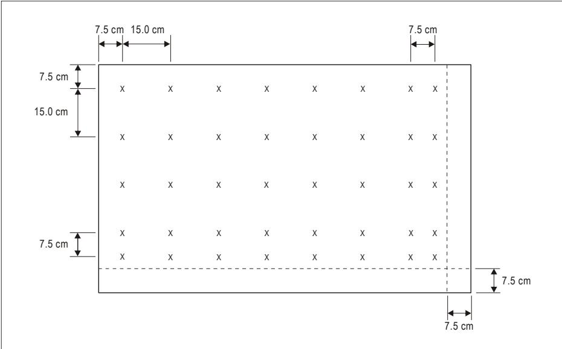

注1：标记牌的平均亮度通过在显示典型的文字符号和背景颜色（强制性指令标记牌为红色，方向和目的地标记牌为黄色）的标记牌牌面上确定网格点来计算，方法如下：

a）先在牌面的左上角建立一个网格基准点，距离牌面的左边界和顶边各7.5cm。

b）从网格基准点开始在水平和垂直方向以15cm的间距建立网格。距离牌面边缘不足7.5cm的点不计。

c）如一行或一列的最末点至牌面边缘的距离在22.5 cm与15 cm之间（不含15 cm和22.5 cm)，则在距离最末点7.5cm处增加一个网格点。

d）如网格点恰位于字符与背景颜色的交界处，则必须将该网格点稍稍移动使之完全在字符以外。

注2：可能需要增加若干个网格点以保证每一字符包括至少五个等间距的网格点。

注3：如一个单元包含两种类型的标记牌，则必须为每一种类型的标记牌建立网格点。

图A4-1计算标记牌平均亮度的网格点

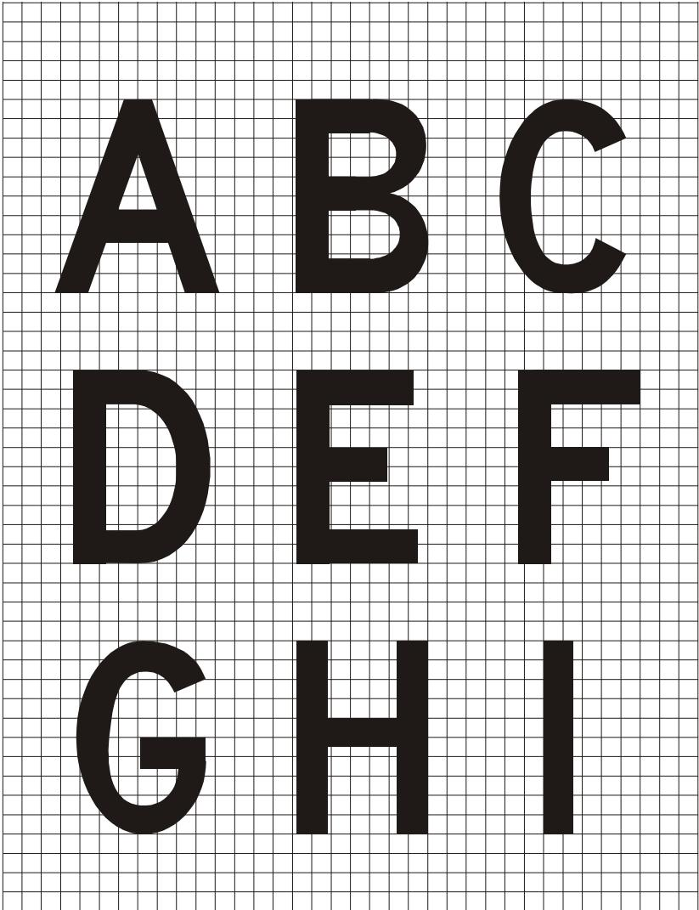

图A4-2字符形状

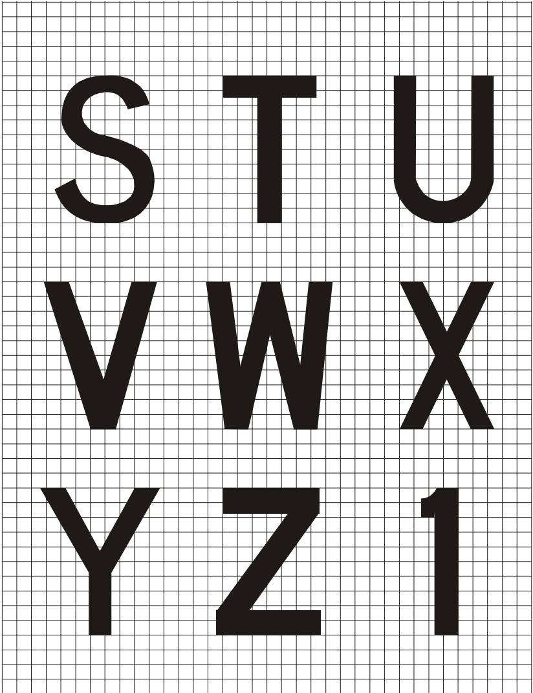

图A4-2(续）

图A4-2(续）

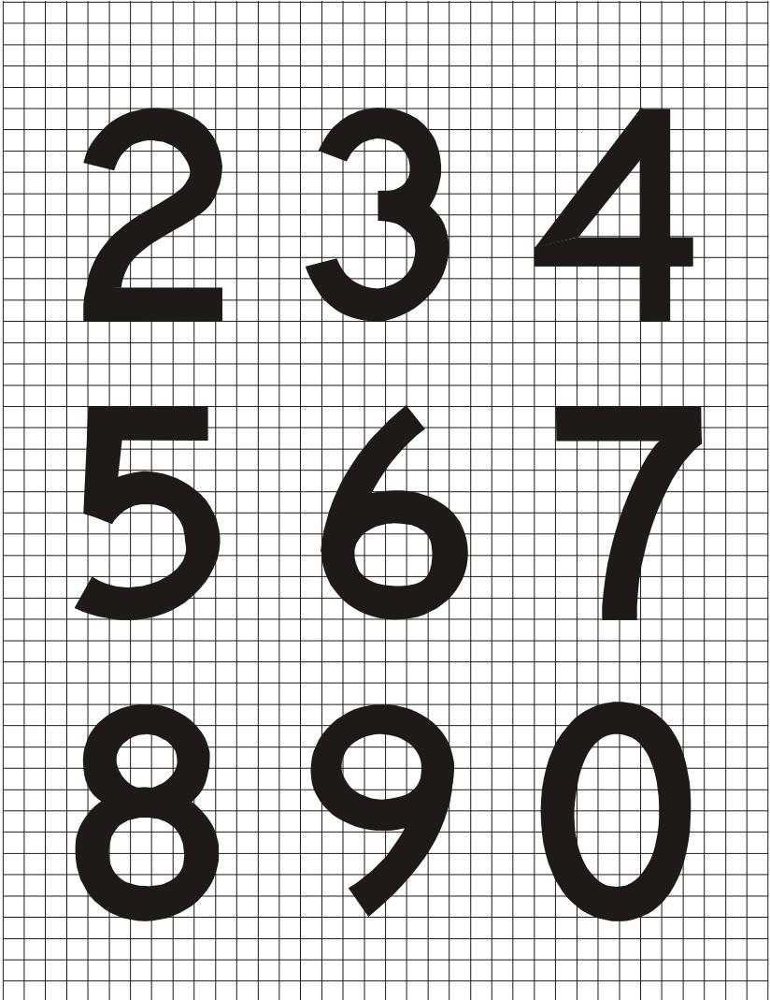

图A4-2(续）

图A4-2 (续)

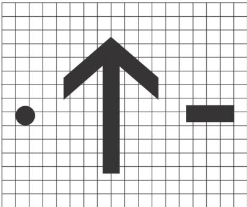

箭头、点和短横线

注1：箭头笔画宽度、点的直径和短横线的长度和宽度必须与字体笔画的宽度成比例。

注2：箭头的尺寸对特定的标记牌尺寸必须保持不变，不论指向哪个方向。

图A4-2 （续）

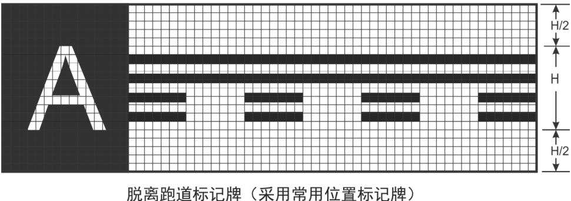

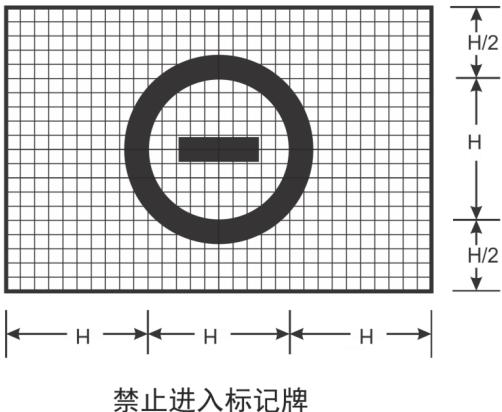

图A4-3脱离跑道标记牌和禁止进入标记牌

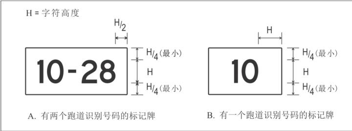

图A4-4的注解：“H”代表字符高度

图A4-4标记牌尺寸

表4-1字母和数字的宽度和字母或数字之间的空隙

<html><body><table border="1"><tr><td colspan="4">a）字母之间的空隙代码</td></tr><tr><td colspan="4">后随字母</td></tr><tr><td rowspan="2">前一 字母</td><td>B，D，E，F, H, 1, K, L, M，N,P,R,U</td><td>C, G, O, Q，S，X，Z</td><td>A，J,T, V，W，Y</td></tr><tr><td colspan="3">代码</td></tr><tr><td>A B C D E F G H I J K L M N O P Q R S T U V W X Y Z</td><td>2 1 2 1 2 2 1 1 1 1 2 2 1 1 1 1 1 1 1 2 1 2 2 2 2 2</td><td>2 2 2 2 2 2 2 1 1 1 2 2 1 1 2 2 2 2 2 2 1 2 2 2 2 2</td><td>4 2 3 2 3 3 2 2 2 2 3 4 2 2 2 2 2 2 2 4 2 4 4 3 4 3</td></tr></table></body></html>

<html><body><table border="1"><tr><td colspan="4">b) 数字之间的空隙代码</td></tr><tr><td colspan="4"></td></tr><tr><td rowspan="2">前一 数字</td><td>1,5</td><td>后随数字 2,3，6， 8,9,0</td><td>4,7</td></tr><tr><td colspan="3">代码</td></tr><tr><td>1 2 3 4 5 6 7 8 9 0</td><td>1 1 1 2 1 1 2 1 1 1</td><td>1 2 2 2 2 2 2 2 2 2</td><td>2 2 2 4 2 2 4 2 2 2</td></tr></table></body></html>

<html><body><table border="1"><thead><tr><td colspan="4">d）字母宽度 (mm)</td></tr></thead><tbody><tr><td colspan="4">200</td></tr><tr><td rowspan="2">字母</td><td colspan="3">字母高度 (mm) 300</td></tr><tr><td colspan="3">宽度 (mm)</td></tr><tr><td>A</td><td>170</td><td>255</td><td>400 340</td></tr><tr><td>B</td><td>137</td><td>205</td><td>274</td></tr><tr><td>C</td><td>137</td><td>205</td><td>274</td></tr><tr><td>D</td><td>137</td><td>205</td><td>274</td></tr><tr><td>E</td><td>124</td><td>186</td><td>248</td></tr><tr><td>F</td><td>124</td><td>186</td><td>248</td></tr><tr><td>G</td><td>137</td><td>205</td><td>274</td></tr><tr><td>H</td><td>137</td><td>205</td><td>274</td></tr><tr><td>I</td><td>32</td><td>48</td><td>64</td></tr><tr><td>J</td><td>127</td><td>190</td><td>254</td></tr><tr><td>K</td><td>140</td><td>210</td><td>280</td></tr><tr><td>L</td><td>124</td><td>186</td><td>248</td></tr><tr><td>M</td><td>157</td><td>236</td><td>314</td></tr><tr><td>N</td><td>137</td><td>205</td><td>274</td></tr><tr><td>O</td><td>143</td><td>214</td><td>286</td></tr><tr><td>P</td><td>137</td><td>205</td><td>274</td></tr><tr><td>Q</td><td>143</td><td>214</td><td>286</td></tr><tr><td>R</td><td>137</td><td>205</td><td>274</td></tr><tr><td>S</td><td>137</td><td>205</td><td>274</td></tr><tr><td>T</td><td>124</td><td>186</td><td>248</td></tr><tr><td>U</td><td>137</td><td>205</td><td>274</td></tr><tr><td>V</td><td>152</td><td>229</td><td>304</td></tr><tr><td>W</td><td>178</td><td>267</td><td>356</td></tr><tr><td>X</td><td>137</td><td>205</td><td>274</td></tr><tr><td>Y</td><td>171</td><td>257</td><td>342</td></tr><tr><td>Z</td><td>137</td><td>205</td><td>274</td></tr></tbody></table></body></html>

<html><body><table border="1"><tr><td colspan="4">e)数字宽度</td></tr><tr><td colspan="4">数字高度(mm)</td></tr><tr><td rowspan="2">数字</td><td colspan="3">200 300 400</td></tr><tr><td></td><td>宽度(mm)</td><td></td></tr><tr><td>1</td><td>50</td><td>74</td><td>98 274</td></tr><tr><td>2 3</td><td>137</td><td>205</td><td>274</td></tr><tr><td></td><td>137</td><td>205</td><td></td></tr><tr><td>4 5</td><td>149</td><td>224</td><td>298</td></tr><tr><td>6</td><td>137</td><td>205</td><td>274</td></tr><tr><td></td><td>137</td><td>205</td><td>274</td></tr><tr><td>7</td><td>137</td><td>205</td><td>274</td></tr><tr><td>8</td><td>137</td><td>205</td><td>274</td></tr><tr><td>9</td><td>137</td><td>205</td><td>274</td></tr><tr><td>0</td><td>143</td><td>214</td><td>286</td></tr></table></body></html>

## 说明

<html><body><table border="1"><tr><td colspan="4">c) 字符之间的空隙</td></tr><tr><td rowspan="3">代码 200</td><td colspan="3">字符高度 (mm)</td></tr><tr><td colspan="3">300 400</td></tr><tr><td></td><td>空隙 (mm)</td><td></td></tr><tr><td>1</td><td>48</td><td>71</td><td>96</td></tr><tr><td>2 3</td><td>38</td><td>57</td><td>76</td></tr><tr><td>4</td><td>25</td><td>38</td><td>50</td></tr><tr><td></td><td>13</td><td>19</td><td>26</td></tr></table></body></html>

附录5灯具在障碍物上的安装位置

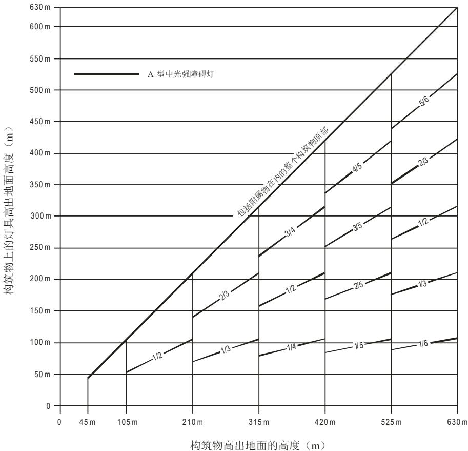

注：建议在高出地面150m以上的构筑物上装高光强障碍灯。如装中光强障碍灯，还需涂刷标志。

图A5-1A型中光强白色闪光障碍灯系统

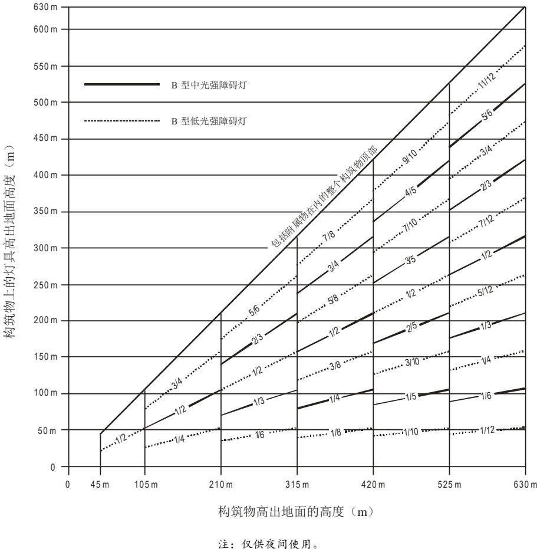

图A5-2B型中光强红色闪光障碍灯系统

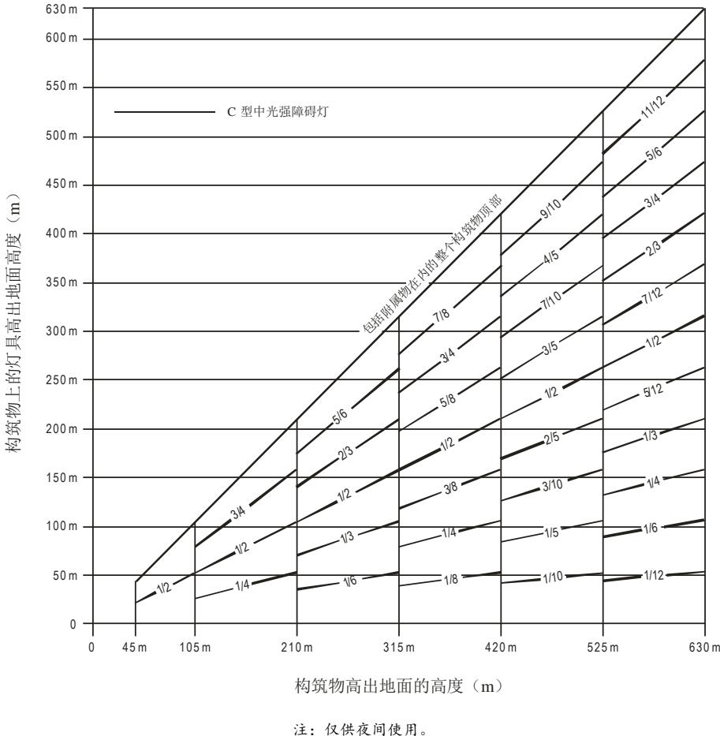

图A5-3C型中光强恒定红色障碍灯系统

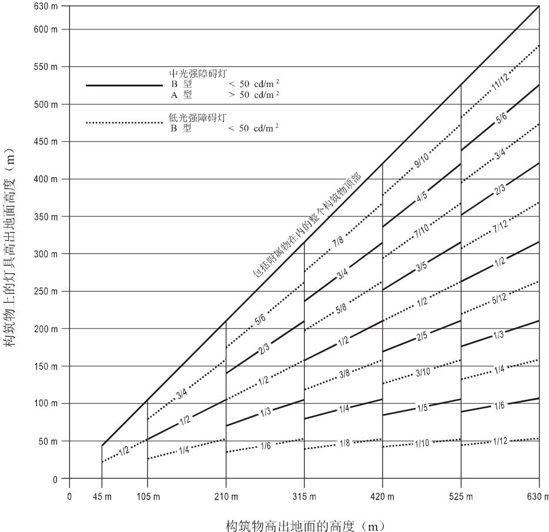

注：建议在高出地面150m以上的构筑物上装高光强障碍灯。如装中光强障碍灯，还需涂刷标志。

图A5-4A型/B型中光强双障碍灯系统

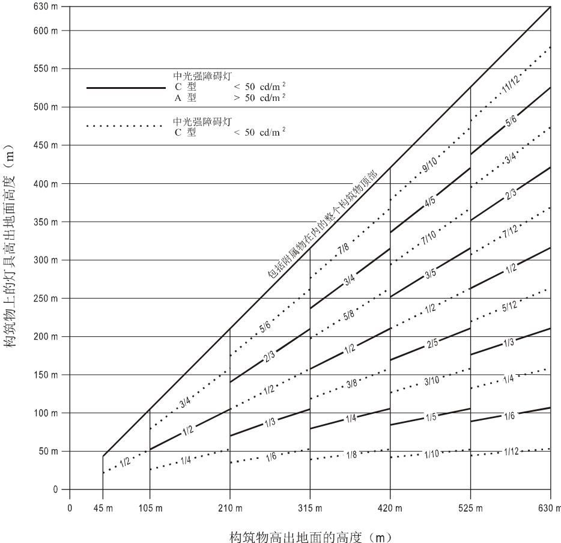

注：建议在高出地面150m以上的构筑物上装高光强障碍灯。如装中光强障碍灯，还需涂刷标志。

图A5-5A型/C型中光强双障碍灯系统

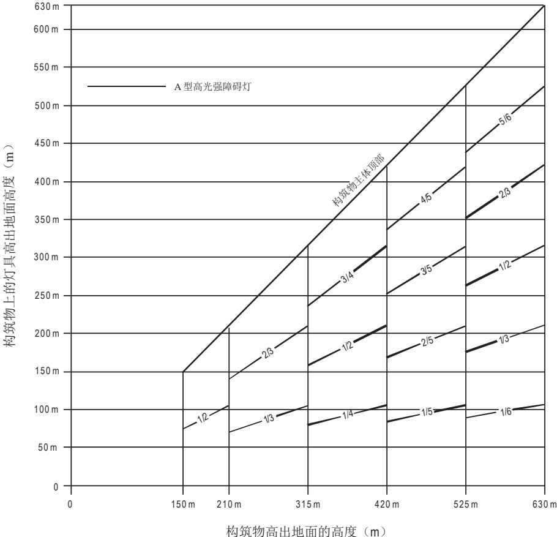

图A5-6A型高光强白色闪光障碍灯系统

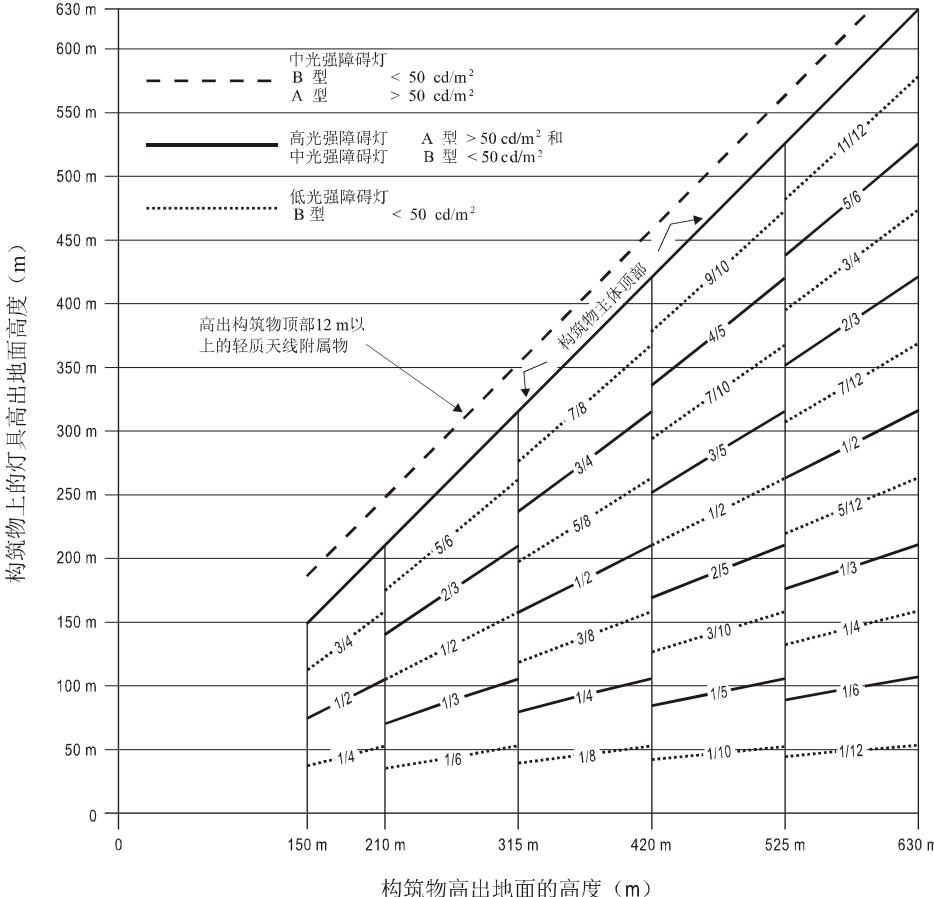

图A5-7A型/B型高/中光强双障碍灯系统

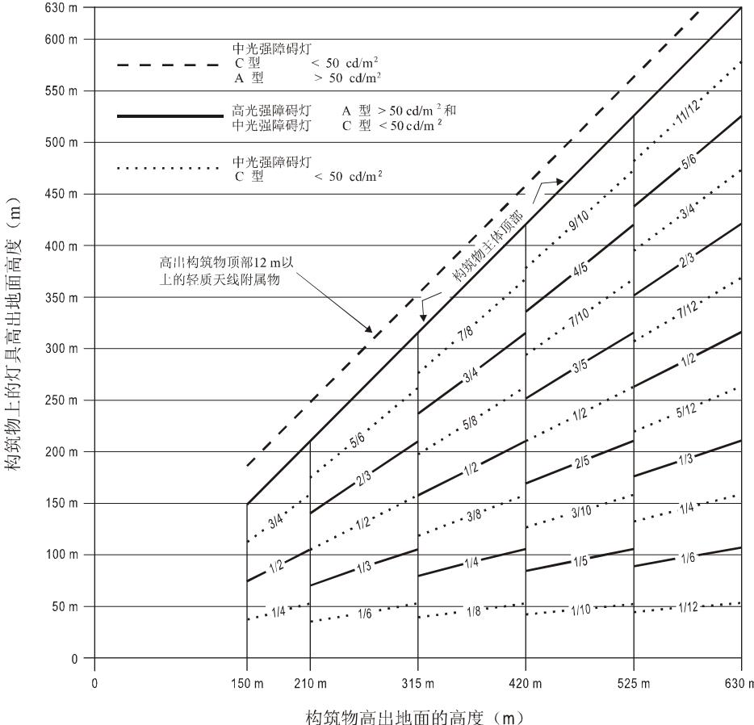

图A5-8A型/C型高/中光强双障碍灯系统

## 附篇A附件14第I卷的补充指导材料

## 1 ．跑道的条数、定位和定向

## 跑道的定位和定向

1.1在确定跑道的位置和方向时，应考虑很多方面的因素。这里不准备详尽无遗地列出这些因素，也不准备分析它们的影响；但指出那些需要经常加以研究的因素看来是有益的。这些因素可分为以下四类：

1.1.1运行的类别应特别注意该机场是供全天候条件使用，还是仅供在目视气象条件下使用，以及它是准备供昼夜使用，还是仅供昼间使用。

1.1.2气候条件应对风的分布进行研究，以确定利用率。在这方面，应考虑下列各点：

a）用以计算利用率的风的统计资料所提供的通常都是风速和风向范围，而计算所得结果的准确性在很大程度上取决于观测值在这些范围内的假定分布。在缺乏对实际分布情况的确实资料时，通常的办法是假定它是均匀分布的，因为从最有利的跑道方位来说，这样做得出的利用率一般是偏于保守的。

b 在第3章3.1.3中所述的最大平均侧风分量是指在正常环境下的情况。在一个特定的机场，有若干可能减小其最大值的因素需要考虑。它们包括：

1）3.1.3中所述的三组飞机的多种类型的飞机（包括将来的类型）在操纵特性和最大容许侧风分量上可能存在的巨大差异；

2)阵风的流行方向及其性质；

3)湍流的流行方向及其性质；

4)是否有次要跑道可供使用；

5)跑道的宽度；

6)跑道的表面情况一跑道上的水、雪和冰会大大地减小容许的侧风分量；和

与限制的侧风分量相关的风的强度。

还应研究出现低能见度和/或低云底的情况。应考虑它们的频率和所伴随的风向和风速。

1.1.3机场场址、进近地区及其周围的地形，特别是：

a)与障碍物限制面的适应性；

b)目前和将来对土地的利用。在选择跑道方位和布局时应注意尽可能地保护特别敏感的地区，诸如居民区、学校和医院等，使之免受航空器噪声引起的不适；有关这一问题的详细资料载于《机场规划手册》（Doc9184号文件）第2部分和《航空器噪声管理平衡做法指南》（Doc9829号文件）中。

c)目前和将来提供的跑道长度；

d)建设费用；和

e）安装适合的用于进近着陆的非目视和目视助航设施的可能性。

1.1.4机场附近的空中交通情况，特别是：

a）与其他机场或空中交通服务航路的接近程度；

b）交通密度；和

c）空中交通管制和复飞程序。

## 每个方向的跑道条数

1.2每个方向设置的跑道条数取决于要接纳的航空器起降架次。

## 2 ．净空道和停止道

2.1就是否设置停止道和/或净空道以代替增加跑道长度的问题做出的决定，将取决于跑道端以外地区的物理特性和预期要使用的飞机的运行性能要求。要提供的跑道、停止道和净空道的长度是由飞机的起飞性能确定的，但也应对使用该跑道的飞机所需的着陆距离进行复核，以保证跑道有足够的着陆长度。不过，净空道的长度不能超过可用起飞滑跑长度的一半。

2.2飞机性能运行限制要求有一个足以保证飞机在开始起飞后，或者安全地停住、或者安全地完成起飞所需的长度。为讨论的目的，在考虑了飞机的起飞质量、跑道特征和周围的大气条件下，假定机场所设置的跑道、停止道和净空道的长度只能刚好满足飞机需要的最长的起飞距离和加速停止距离。在这种情况下，每次起飞有一个被称为决断速度的速度：如果在低于该速度时一台发动机失效，必须放弃起飞：而在高于该速度时一台发动机失效，则必须完成起飞。当一台发动机在达到决断速度之前失效时，由于速度不够和具有的动力降低，就需要很长的起飞滑跑距离和起飞距离来完成起飞。假若立即采取行动，在所剩余的可用加速停止距离内停住是不会有困难的。在这种情况下，正确的行动当是放弃起飞。

2.3另一方面，如果一台发动机在达到决断速度以后失效，则飞机将有足够的速度和动力在剩余的可用起飞距离内安全地完成起飞。可是由于它的高速度，在所剩余的可用加速停止距离内停住会是困难的。

2.4对任何一架飞机来说，决断速度并不是一个固定的速度，而是可以由驾驶员在一定限度内根据可用加速停止距离和可用起飞距离、飞机起飞质量、跑道特征和机场周围的大气条件来加以选择的。一般来说，当可用加速停止距离增加时，选择较高的决断速度。

2.5在考虑了飞机的起飞质量、跑道特征和周围的大气条件下，可以得到多种所需加速停止距离和所需起飞距离的组合，来适应一架特定的飞机。每种组合要求其特定的起飞滑跑长度。

2.6最熟悉的情况是，所选的决断速度使所需起飞距离和所需加速停止距离正好相等：这个值称为平衡场地长度。当不设停止道和净空道时，这两个距离都等于跑道长度。不过，如果暂不考虑着陆距离，则整个平衡场地长度不必全部是跑道，因为所需的起飞滑跑距离肯定要比平衡场地长度短。因此，平衡场地长度可由跑道辅以长度相等的净空道和停止道来提供，而不必全部作成跑道。如跑道用于双向起飞，则在跑道的两端都必须设置等长的净空道和停止道。因此，减短跑道长度是以较大的全长为代价的。

2.7如因经济上的考虑不设置停止道，而只设置跑道和净空道，跑道长度（不考虑着陆要求）应等于所需的加速停止距离或所需的起飞滑跑距离二者中的较大值。可用起飞距离将是跑道长度加上净空道长度。

2.8所提供的最小跑道长度和最大停止道或净空道长度，可根据从跑道长度要求的观点来看被认为关键的飞机的飞行手册中的数据，按以下方式来确定：

a)如果停止道在经济上是可能的，则提供的长度为平衡场地长度。跑道长度为所需的起飞滑跑距离或所需的着陆距离，取其中较大者。如所需的加速停止距离大于按此确定的跑道长度，其超出的长度可设置为停止道，通常在跑道两端均设置，此外，还必须设置与停止道等长的净空道：

b）如不设停止道，则跑道长度为所需的着陆距离，或如果该距离较大，则为与实际可行的最低决断速度值相对应的所需加速停止距离。所需起飞距离比跑道长的部分，可设置为净空道，通常在跑道两端均设置。

2.9除上述考虑外，净空道的概念在某种环境下可应用于在全部发动机运行时所需的起飞距离超过一台发动机失效时所需的起飞距离的情况。

2.10如果停止道每使用一次就须重新加以平整和压实，则其经济性就可能全部消失。因此，应将停止道设计得能够承受至少若干次准备使用该停止道的飞机的荷载，而不致使飞机造成结构损坏。

### 3. 公布距离的计算

3.1每一跑道方向需要计算的公布距离包括：可用起飞滑跑距离（TORA）、可用起飞距离（TODA）、可用加速停止距离（ASDA）和可用着陆距离（LDA）。

3.2不设停止道或净空道、而且跑道入口在跑道端的跑道，其上述四个公布的距离一般应等于跑道长度，如图A-1(A）所示。

3.3设有净空道（CWY）的跑道，则可用起飞距离将包括净空道的长度，如图A-1(B）所示。

3.4设有停止道（SWY）的跑道，则可用加速停止距离将包括停止道的长度，如图A-1(C）所示。

3.5跑道入口内移的跑道，其可用着陆距离将减去跑道入口内移的距离，如图A-1(D）所示。跑道入口内移只影响对该跑道入口进近的可用着陆距离；相反方向运行的所有公布的距离并不受到影响。

3.6图A-1(B）至A-1(D）说明了跑道设有净空道或停止道、或跑道入口内移的情况。如果这些特性中的不止一种同时存在，则需要变更的公布距离将不止一个一但都要按图中所示的同样的原则变更。图A-1(E）示出了一个所有这些特性都存在的例子。

3.7图A-1(F）提出了一个提供公布距离资料的建议格式。如果跑道的一个方向，由于飞行上的原因禁止用于起飞或着陆，或既不能用于起飞也不能用于着陆，则应予以公布并加入“notusable”（不能使用）或缩写“NU”的字样。

### 4. 跑道上的坡度

### 4.1 变坡间的距离

下例说明了变坡之间的距离是如何确定的（见图A-2）：

对基准代码为3的跑道，D至少应为：

$$\begin{aligned}&15\ 000\ (|x-y|+|y-z|)m\\&\quad|x-y| 是 x-y 的绝对数值 \\&\quad|y-z| 是 y-z 的绝对数值 \\&\quad\\& 假设 \quad x=+0.01\\&\quad y=-0.005\\&\quad z=+0.005\\&\quad 则 |x-y|=0.015\\&\quad|x-z|=0.01\end{aligned}$$

为了符合规范，D应不小于：

$$15000(0.015+0.01)m,\quad15000\times0.025=375m $$

### 4.2 纵坡和横坡坡度的考虑

当跑道规划得同时采用第3章3.1.13至3.1.19中所允许的坡度和变坡的极限值时，应进行研究，以保证所形成的跑道表面纵剖面不致妨碍飞机的运行。

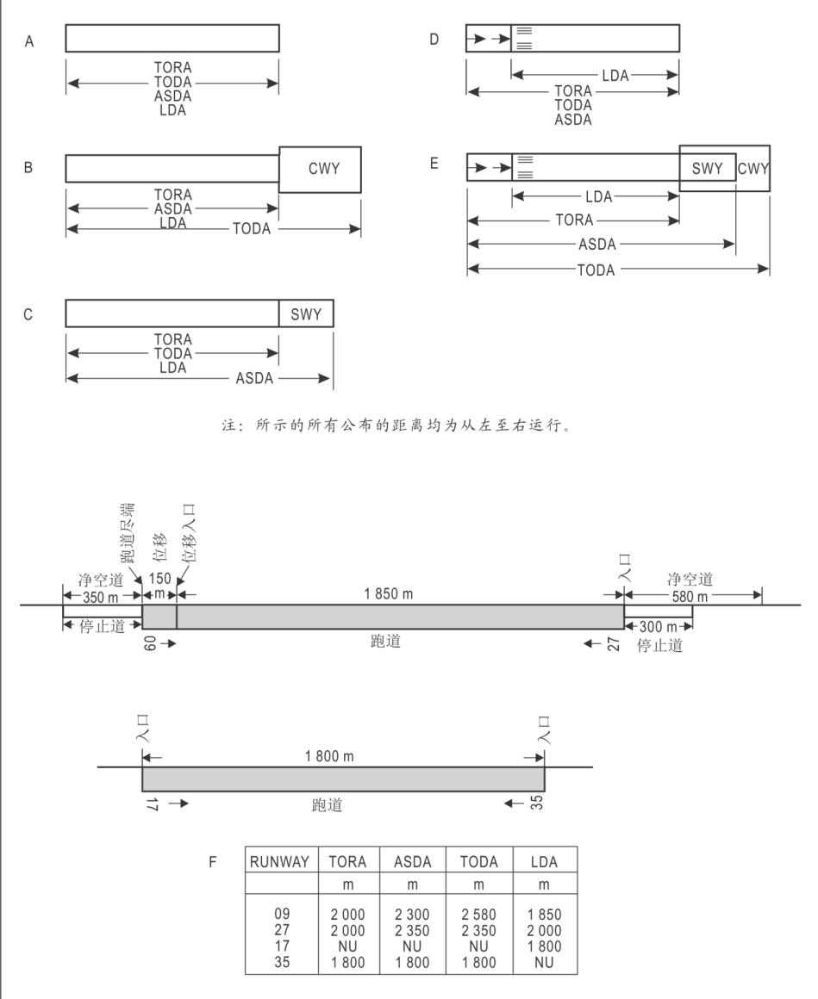

图A-1公布的距离的示例

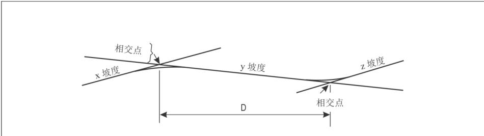

图A-2跑道中线的纵剖面

### 4.3 无线电高度表操作区

为适应飞机进行自动耦合进近和自动着陆（不论天气条件如何），在精密进近跑道的入口前至少300m长的一块长方形地段最好没有变坡或尽量将变坡减至最小。该地区应对称于跑道中线延长线，宽120m。当特殊环境要求时，该宽度可以减少到不小于60m，如果航空研究表明这种宽度减少不会影响航空器运行安全的话。之所以有此必要，是因为这些飞机装有指示最后高度和拉平引导的无线电高度表，当飞机在紧接跑道入口前地形的上方时，无线电高度表即开始向自动驾驶仪提供自动拉平的信息。当变坡不能避免时，两个邻接坡之间的变坡率应每30m不大于2%

### 5. 跑道表面的平整度

5.1在采用跑道表面不平整性的容差时，下述施工标准在3m短距离内是能够达到的，并且符合良好的工程惯例：

除了横跨路拱顶部或横跨排水沟外，峻工的磨耗层的表面要达到这样的平整度：用3m长的直尺置于表面的任何地方和任何方向上进行测试时，在沿直尺边的任何地方，直尺底面与道面表面之间的空隙不大于3mm。

5.2当将跑道灯或排水格栅嵌入跑道道面时，也应注意保证使表面保持足够的平整度。

5.3航空器的运行和道面基础的不均匀沉陷，终将导致表面不平整的增加。上述容差中的少量偏差将不致严重地妨碍航空器的运行。一般来说，在45m距离内，偏差2.5cm至3cm的孤立的不平整是可接受的，如图A-3所示。虽然最大可予接受的偏差随航空器的类型和速度而改变，但仍可合理预测出可予接受表面不平整的限度。下表介绍了可接受的、可容许的和过大的限度：

极限曲线规定的高度(此处用可容许区域来注明)，则应计划采取维护行动。跑道可继续使用。从该区域开始，旅客和驾驶员可能会感到不适；

b)如果在规定的可接受的最低长度下，表面不平整超过可容许的极限曲线规定的高度但未达到过大的极限曲线规定的高度(此处用过大区域来注明），则必须采取维护改正行动，以便将表面状况恢复至可接受区域。跑道可继续使用，但应在合理的期限内对其进行修补。该区域可能会导致因某一次单一事件或长期的疲劳断裂而使得航空器可能出现结构性损坏的风险；和

c)如果在规定的可接受的最低长度下，表面不平整超过过大的极限曲线规定的高度(此处用不可接受区域来注明)，则应关闭存在不平整情况的跑道区域。应对该区域进行修补，以便将表面状况恢复至可接受区域，并可相应通知航空器运营人。该区域存在导致结构断裂的极端风险，必须立即加以处理。

<html><body><table border="1"><tr><td rowspan="2">表面不平整</td><td colspan="11">不平整的长度 (m)</td></tr><tr><td>3</td><td>6</td><td>9</td><td>12</td><td>15</td><td>20</td><td>30</td><td>45</td><td>60</td><td></td></tr><tr><td>可接受的表面不平整的高度 (cm)</td><td>2.9</td><td>3.8</td><td>4.5</td><td>5</td><td>5.4</td><td>5.9</td><td>6.5</td><td>8.5</td><td>10</td><td></td></tr><tr><td>可容许的表面不平整的高度(cm)</td><td>3.9</td><td>5.5</td><td>6.8</td><td>7.8</td><td>8.6</td><td>9.6</td><td>11</td><td>13.6</td><td>16</td><td></td></tr><tr><td>过大的表面不平整的高度 (cm)</td><td>5.8</td><td>7.6</td><td>9.1</td><td>10</td><td>10.8</td><td>11.9</td><td>13.9</td><td>17</td><td>20</td><td></td></tr></table></body></html>

注意“表面不平整”在此定义为在任一给定跑道部位上，孤立的表面标高偏差不构成一个均匀坡面。出于这种关注，“跑道部位”在此被界定为是指一段其主导总体坡度是连续的上坡、下坡或平坦的跑道。这一部位的长度通常介于30m至60m之间，或更长，视铺筑面纵向剖面和道面条件而定。

譬如相邻铺筑板块之间可能存在的最大可容许的阶跃隆起，就是对应图A-3不平整标准的可容许区域上端零隆起长度的隆起高度。这个位置的隆起高度是1.75厘米。

5.4图A-3对表面不平整标准与美国联邦航空局制定的标准做了比较介绍。关于在处于运行状态的跑道上进行铺设工程时存在的临时坡度的进一步指导，见《机场设计手册》（Doc9157号文件）第3部分一道面。

5.5跑道随时间的形变也可能增加形成水洼的可能性。水洼约达3mm深时，特别是在它处在可能被高速着陆的飞机压过的地方时，能引起飞机的飘滑，飘滑还能在水深浅得多的湿跑道上继续下去。有关对飘滑有影响的水洼的长度和深度的进一步指导，是需要进一步研究的课题。当然，任何时候，当水有可能结冻时，更要防止水洼的形成。

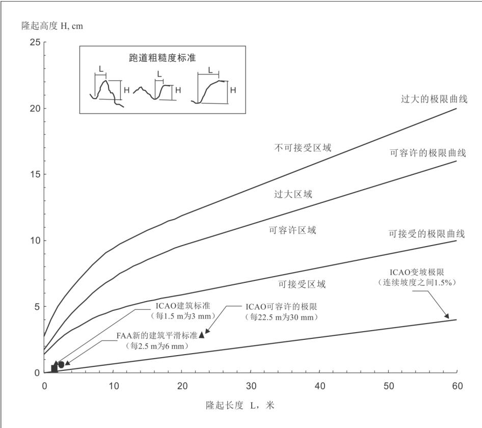

图A-3粗糙度标准的对比

注：这些标准涉及既不是长波谐波效应，也不是表面反复起伏效应的个别出现的不平整的情况。

## 6 ．报告跑道表面状况的跑道状况报告

6.1在全球一级，活动区面临的天气状况多种多样，因此在有待报告的表面状况方面存在重大差别。跑道状况报告（RCR）述及了一种可适用于所有这些气候变化的基本方法，其构造方式可使得各国能够根据可适用于该国或地区的气候条件对其进行调整。

6.2跑道状况报告这一概念的前提条件为：

a)一组商定的标准，该标准可以一致的方式用于跑道表面状况评估、飞机（性能）合格审定和运行性能计算；

b）一个独一无二的跑道状况代码（RWYCC），该代码可将这组商定的标准与航空器着陆和起飞性能表关联起来，并与飞行机组所经历的并最终予以报告的制动效果相关；

c)报告与起飞性能相关的污染物类型和深度；

d)一套可供机场运营人检查人员、空中交通管制员、航空器运营人和飞行机组使用的对跑道表面状况进行描述的标准化普通术语和用语；和

e)全球统一的跑道状况代码的确定程序，该程序具有内在的灵活性，允许本地做出变动，以便与具体天气、基础设施和其他特殊条件相符。

6.3在将跑道状况代码、这组所商定的标准及飞行机组所预计的与每个跑道状况代码值对应的航空器制动效果关联起来的跑道状况评估矩阵（RCAM）中，对这些统一的程序做了反映。

6.4跑道状况评估矩阵的使用程序，见《空中航行服务程序一机场》（Doc9981号文件）。

6.5大家承认，机场跑道表面状况评估和报告人员提供的信息对跑道状况报告的有效性至关重要。如出现跑道状况错报，其本身不应引发事故或事故征候。运行裕度应可弥补评估中合理存在的差错，包括未对跑道状况的变化情况进行报告。但是跑道状况错报能够意味着该裕度不能再用作弥补其他运行异常（例如跑道入口上方高处意外出现的快速顺风或者长距离拉平）。

6.6由于有必要按照合适的资料分发格式提供评估信息，从而要求了解资料分发方面的句法限制，这使得更有必要进行培训。而句法限制反过来会限制所能提供的普通文本说明的措辞。

6.7必须按照标准程序提供跑道表面状况评估信息，以确保飞机在使用湿跑道或被污染跑道时安全性不会受到影响。应对这些人员进行相关胜任能力方面的培训，并按照国家要求的方式，对其胜任能力进行核实，以确保其所做评估的可信性。

6.8培训大纲可包括涉及如下各领域的初训和定期复训：

a）熟悉机场情况，包括机场标志、标记和照明；

b）机场手册中所述机场程序；

c 机场紧急计划；

d)航行通告（NOTAM）启动程序；

e)跑道状况报告（RCR）的完成/启动程序；

f)机场驾驶规则；

g)活动区内空中交通管制程序；

h）无线电话作业程序；

i)机场管制期间所用用语，包括国际民航组织无线电通话拼写字母；

j)机场检查程序和技术；

k)跑道污染物类型和报告；

1)跑道表面摩阻力特性的评估和报告；

m)跑道摩阻力测量装置的使用；

n)跑道摩阻力测量装置的校准和维护；

0）对1）和m）存在的不确定性的意识；和

p）低能见度程序。

## 7 ．活动区和相邻地区的排水性能

### 7.1 概述

7.1.1快速排除表面的水是在设计、修建和维护活动区和相邻地区时考虑的一个安全因素。目的是通过沿着尽可能最短的路径将水排出跑道，尤其是排出机轮胎滑经地区，将表面的水深降至最低。有如下两个显然不同的排水过程：

a）自然排出道面表面上的表面水，直至其流入河流或其他水体等最终受纳水体；和

b）靠动力排出移动轮胎下积累的表面水，直至其流出轮胎与地面之间的接触面。

7.1.2上述两个过程能够通过道面的：

a)设计；

b）修建；和

c）维护

加以控制，以防止道面表面积水。

### 7.2 道面设计

7.2.1表面排水是一项基本要求，可用于最大程度地降低表面的水深。目的是以最短的路径将水从跑道上排走。充分的表面排水主要通过坡度适当（沿纵向和横向两个方向）的表面来实现。最终形成的共同的纵向与横向坡是排水径流的排出路径。该路径可通过增加横向槽予以缩短。

7.2.2动力排水是通过在道面表面上做出的纹理实现的。滚动的轮胎增加水压并将水挤出由纹理形成的排水沟槽。轮胎与道面之间的接触面的动力排水可以通过增加横向槽予以改善，但须对横向槽进行仔细维护。

### 7.3 道面修建

7.3.1可通过施工使道面具有排水特性。这些表面特性包括：

a)斜坡；

b）纹理

i）宏观纹理；

ii）微观纹理；

7.3.2关于活动区和相邻地区各部分的斜坡的说明见第3章，相关数值按百分数列出。更多的指导材料见《机场设计手册》（Doc9157号文件）第1部分第5章。

7.3.3在文献中，将纹理描述成微观纹理或宏观纹理。航空业的不同部门对这些术语有不同的理解。

7.3.4微观纹理为单块石头的纹理，肉眼很难看到。微观纹理被视为（航空器机轮）低速防滑的一个主要因素。在潮湿表面上，在高速情况下，由于轮胎与地面之间的接触面的排水不充分，水膜可以阻碍表面粗糙处和轮胎之间的直接接触。

7.3.5微观纹理是道面表面的固有特性。通过确定微观纹理能耐受磨耗的骨料，可以确保在更长的时间内道面的薄水膜被排干。防滑能力用石料磨光值（PSV）表示，这基本上是一个根据国际标准从摩阻测试中获取的一个值。这些标准对石料磨光值的最低值做了规定，丛而使微观纹理较好的材料能够被选上。

7.3.6微观纹理的一个主要问题是，它能够在很短时间里发生不容易察觉的变化。这方面的一个典型例子是，接地带道面积胶将在很大程度上遮盖住微观纹理，但不一定会减少宏观纹理。

7.3.7宏观纹理为单块石头之间的纹理。这种规模的纹理可用肉眼做大致判断。宏观纹理主要由所用骨料的大小或由道面的表面处理而产生，并且是影响高速情况下的排水能力的主要因素。选取材料时，必须保证宏观纹理良好。

7.3.8在跑道表面刻槽的主要目的是加强表面排水。自然排水可能因表面纹理而减慢，但是刻槽则能提供更短的排水路径和加快排水速度，从而加速排水。

7.3.9为了测量宏观纹理，制定了简易方法，如《机场服务手册》（Doc9137号文件）中所述的“砂子和油脂摊铺”法。这些方法曾被用于目前的适航性要求赖以产生的早期研究，它们参照了从A至E的宏观纹理分类。该分类法是使用砂子或油脂摊铺测量技术拟定的，由工程科学数据组织（ESDU）于1971年发布。

基于ESDU71026提供的纹理信息对跑道进行的分类如下：

<html><body><table border="1"><tr><td>分类</td><td>纹理深度 (mm)</td></tr><tr><td>A</td><td>0.10 - 0.14</td></tr><tr><td>B</td><td>0.15 - 0.24</td></tr><tr><td>C</td><td>0.25 - 0.50</td></tr><tr><td>D</td><td>0.51 - 1.00</td></tr><tr><td>E</td><td>1.01 - 2.54</td></tr></table></body></html>

7.3.10如果使用该分类法，微观纹理和宏观纹理之间的临界值为平均纹理深度（MTD)0.1mm。根据该等级表，航空器在湿跑道条件下的正常性能是以其排水和摩擦性能值为B类和C类的中间值（0.25mm）的纹理为依据的。通过更合理的纹理加强排水可以符合更高等级的航空器性能的要求。但是，这种改进必须符合飞机制造商文件并经国家同意。目前改进的是符合可为国家接受的设计、修建和维护标准的带槽或多孔的带防滑层跑道。一些国家的统一鉴定标准参照的是排水和摩擦性能为D类和E类的中间值（1.0mm）的纹理。

7.3.11在修建、设计和维护方面，各国使用各种不同的国际标准。目前的ISO13473-1《利用表面断面表征道面纹理的特性》一第1部分：平均断面高度的测定将体积测量技术与可给出类似纹理值的非接触式断面测量技术联系起来。这些标准将微观纹理和宏观纹理之间的临界值定为0.5mm。体积方法的有效范围为平均纹理深度在0.25至0.5mm之间。断面测量方法的有效范围为平均断面深度（MPD）在0至5mm之间。由于体积技术所用的玻璃球的有限尺寸，并且由于平均断面深度是从一个二维断面而非三维断面测得的，所以平均断面深度和平均纹理深度之值有所不同。因此，必须为所用测量装置确定一个转换等式，将平均断面深度与平均纹理深度关联起来。

7.3.12工程科学数据组织的分类表根据A类至E类宏观纹理对跑道表面进行分组，E组代表具有最好的动力排水能力的表面。因此，工程科学数据组织的分类表可反映出道面的动力排水特性。在任何这些表面上刻槽可提高动力排水能力。因此，表面的最终排水能力随着纹理（A至E）和刻槽而变化。刻槽的作用随着槽的尺寸和槽与槽之间的间距而变化。会发生大雨或暴雨的机场必须确保道面和相邻地区的排水能力以抵御住这些降雨，或者对在此类极端情况下跑道的使用施加限制。这些机场应争取让斜度达到最大的容许值，并使用排水特性良好的骨料。此外，它们还应考虑让带槽的道面达到E类，以确保安全不受损。

### 7.4 道面排水特性的维护

7.4.1宏观纹理在短时间内不会变化，但是积胶可能填满纹理，并因此而降低排水能力，从而可导致安全受损。此外，跑道结构可能会随着时间而变动，并出现可导致雨后积水的不平整情况。关于清除橡胶和处理不平整情况的指导材料，见《机场服务手册》（Doc9137号文件）第2部分。关于表面纹理的改进方法的指导材料，见《机场设计手册》（Doc9157号文件）第3部分。

7.4.2如果使用刻槽，应定期检查刻槽的状况以确保刻槽的状况良好，且没有出现变差的情况。关于道面维护的指导材料，见《机场服务手册》（Doc9137号文件）第2部分一道面表面情况和第9部分一机场维修做法及Doc9157号文件第2部分。

7.4.3道面可能会进行喷砂处理，以改善道面的宏观纹理。

### 8. 升降带

### 8.1 道肩

8.1.1跑道或停止道的道肩应整备或修建得使对滑出跑道或停止道的飞机的危害减至最小。以下各段对可能出现的某些专门问题以及避免涡轮发动机吸入松散石子及其他物体的措施等问题给出一些指导意见。

8.1.2在有些情况下，升降带的天然地面的承载强度可能已经足够，不需要作专门的整备来满足道肩的要求。当需要作专门整备时，使用的方法取决于当地土壤条件和拟使用该跑道的飞机的质量。土壤试验将有助于确定最好的改善方法（例如排水、稳定土壤、表面处理、薄层铺面）。

8.1.3在设计道肩时还应注意防止涡轮发动机吸入石子或其他物体。《机场设计手册》（Doc9157号文件）第2部分中所讨论的滑行道边缘在必要时所采取的特殊措施以及需要时应在多长的距离上采取此种特别措施等，也适用于此处。

8.1.4在为了提供所需的承载强度或防止有石子或杂物而对道肩作了专门处理后，可能由于跑道表面和毗邻的升降带表面之间缺少视觉对比而产生困难。这个困难可用对比明显的跑道或升降带表面颜色，或者设置跑道边线标志的办法来予以克服。

### 8.2 升降带上的物体

在与跑道相邻的全部升降带内，应采取措施防止飞机轮子陷入地面时撞上坚硬的直立面。升降带内，或跑道与滑行道或另一跑道相交处设置的跑道灯或其他物体，可能会引起一些特殊的问题。在有结构物的情况下，如跑道或滑行道，当该表面必须与升降带面齐平时，可以用从结构物顶部向下斜切到至少比升降带表面水平面低30cm的方法来消除直立面。其他物体，凡其功能不需在表面水平上的，应埋到不小于30cm的深处。

### 8.3 精密进近跑道升降带的平整

第3章3.4.8中建议，基准代码为3或4的仪表跑道的升降带中离跑道中线至少75m内的范围内，应加以平整。对基准代码为3或4的精密进近跑道采用较大的宽度可能更好。图A-4显示了对精密进近跑道可以考虑的较宽升降带的形状和尺寸。它是根据航空器滑出跑道的资料设计出来的。需要平整的部分扩大到距跑道中线105m处，只是该距离要逐渐减小，在距跑道头150m处时，升降带两端距中线减至75m。

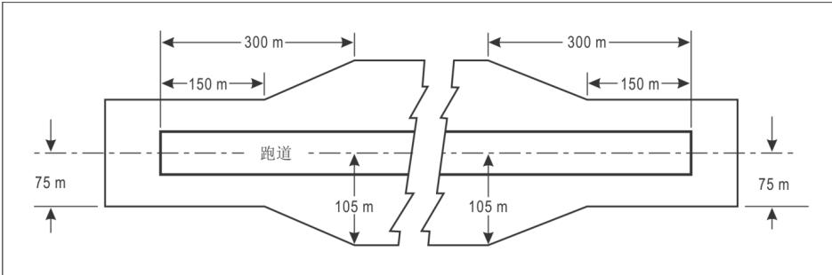

图A-4基准代码为3或4的精密进近跑道升降带的平整范围

## 9 ．跑道端安全区

9.1在按第3章中要求设置跑道端安全区时，应考虑提供一个有足够长度的区域以控制住由于各种不利运行因素极有可能产生的共同作用所导致的飞机冲出跑道或着陆时接地过早的局面。在精密进近跑道上，仪表着陆系统的航向台一般是第一个直立的障碍物，跑道端安全区应延伸到这个设施。在其他情况下，第一个直立的障碍物可能是道路、铁路或其他建造的或自然的物体。在设置跑道端安全区时，应对此类障碍物进行考虑。

9.2如果设置跑道端安全区费用特别高，很难实施，就必须得考虑缩小跑道上某些已经公布的用于设置跑道端安全区和安装拦阻系统的距离长度。

9.3研究方案以及对航空器实际冲入拦阻系统进行的评估证明，一些拦阻系统的性能是可预测的，此类系统可有效地拦阻航空器冲出跑道。

9.4使用可对拦阻系统性能进行预测的经验证的设计方法，能够使经证明的拦阻系统的性能得到实现。设计和性能应基于预计将使用对拦阻系统提出最严格要求的相关跑道的航空器型别。

9.5拦阻系统的设计必须考虑多个航空器参数，其中包括但不限于：允许航空起落架载荷、起落架构形、轮胎接触压力、航空器重心和航空器速度。还必须考虑不会给过早接地的飞机带来危险。此外，设计必须允许满载荷救援与消防车辆的安全运行，包括其安全进出。

9.6关于设置跑道端安全区和拦阻系统的信息，应在航行资料汇编中公布。

9.7更多信息载于《机场设计手册》（Doc9157号文件）第1部分中。

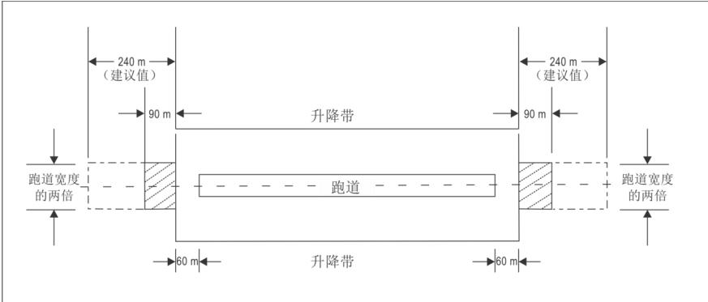

图A-5基准代码为3或4的跑道的跑道端安全区

### 10. 跑道入口的位置

### 10.1 概述

10.1.1如果没有障碍物突出于进近面，跑道入口一般都位于跑道的尽头。但在某些情况下，由于当地条件，可能需要将跑道入口永久内移（见下文）。当研究跑道入口的位置时，还应考虑仪表着陆系统基准点和/或微波着陆系统进近基准点的高度，以及确定超障界限。（关于仪表着陆系统基准点和微波着陆系统进近基准点的高度的规范，见附件10卷1第1部分。）

10.1.2在确定无障碍物突出于进近面时，应考虑进近区域内至少自跑道入口纵向1200m、总宽不小于150m 的范围内的移动物体（道路上的车辆、火车等）。

### 10.2 内移的跑道入口

10.2.1如有物体突出于进近面之上而又不能移除时，应考虑将跑道入口永久内移。

10.2.2为满足第4章的障碍物限制的目标，跑道入口最好应顺跑道向内移动一个使进近面内不再有障碍物的距离。

10.2.3不过，将跑道入口从跑道尽头内移必将造成可用着陆距离的缩短，而这可能比具有标志和照明的障碍物突出于进近面更加影响飞机的运行。因此，决定是否将跑道入口内移以及内移多少，应考虑在无障碍物的进近面和足够的着陆距离两者之间做出最佳的权衡。在决定这个问题时，需要考虑到准备使用该跑道的飞机的类型、使用跑道时的能见度和云高条件、障碍物相对于跑道入口和跑道中线延长线的位置，对于精密进近跑道，还要考虑障碍物对确定超障界限的重要性。

10.2.4尽管要考虑可用着陆距离，但是在选择跑道入口位置时，对基准代码为4的跑道，不得使至跑道入口的无障碍物面坡度超过3.3%：基准代码为3时，不得使上述坡度超过5%。

10.2.5在按照上段无障碍物面的准则确定跑道入口位置时，仍应满足第6章关于内移跑道入口的障碍物标志要求。

10.2.6跑道入口的跑道视程可能与起飞跑道起端的跑道视程不同，这取决于入口内移的长度。使用光度光强低于白色灯标称的10000坎德拉的红色跑道边灯可增加这种现象。有关当局应该就内移的跑道入口对起飞最低标准的影响进行评估。

10.2.7附件14第I卷关于内移的跑道入口标志和照明的规定以及若干运行方面的建议见5.2.4.9，5.2.4.10，5.3.5.5，5.3.8.1，5.3.9.7，5.3.10.3，5.3.10.7和5.3.12.6。

## 11 ．进近灯光系统

### 11.1 类型和特性

11.1.1本卷中对简易和精密进近灯光系统的基本特性作了规定。对这些系统的某些方面，例如中线灯和横排灯之间的间距，允许有一些改动余地。经常采用的进近灯光系统的型式，见图A-7和A-8。Ⅱ类和Ⅲ类精密进近灯光系统内端300m的图示，见图5-14。

11.1.2进近灯光的设置构形与跑道入口的位置无关，即不论跑道入口在跑道尽头还是内移都是一样的。在这两种情况下进近灯光系统都应延伸到跑道入口。但在跑道入口内移的情况下，从跑道端到跑道入口之间要用嵌入灯以获得规定的构形。这些嵌入灯的设计要能满足第5章5.3.1.9规定的结构要求及附录2中图A2-1或A2-2规定的光度要求。

11.1.3设计灯光中所用的飞行轨迹包络面，见图A-6。

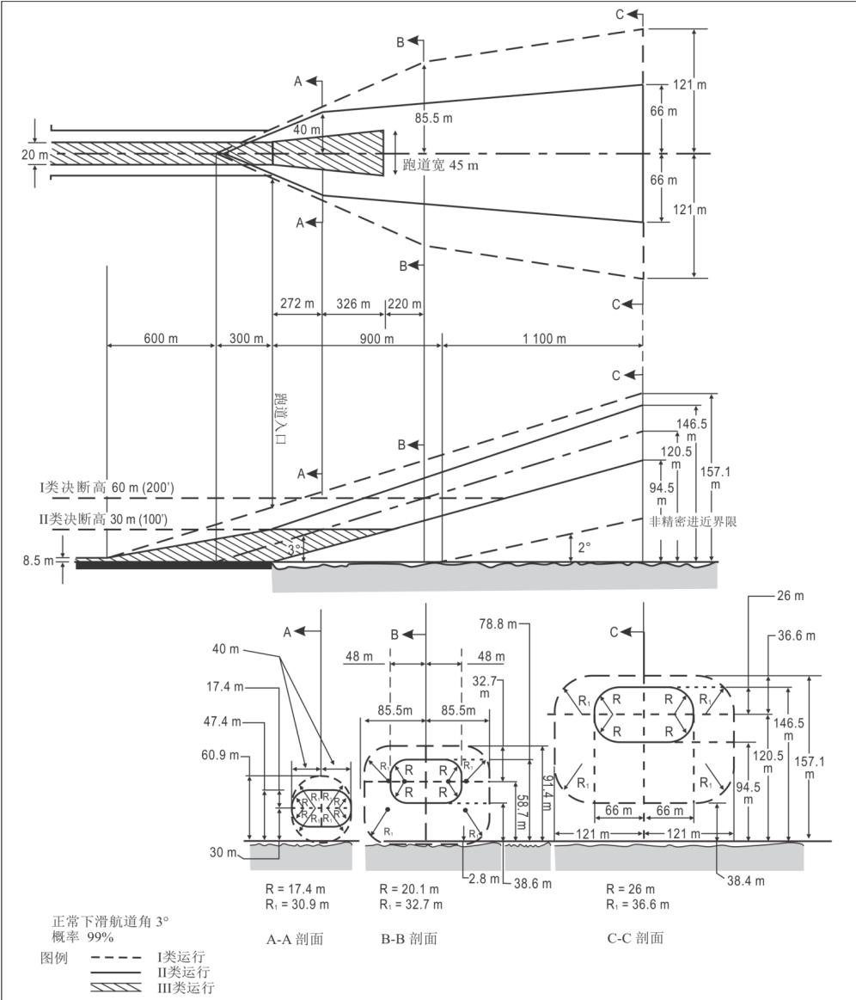

图A-6I、ⅡI、IⅢ类运行的灯光设计中使用的飞行轨迹包络面

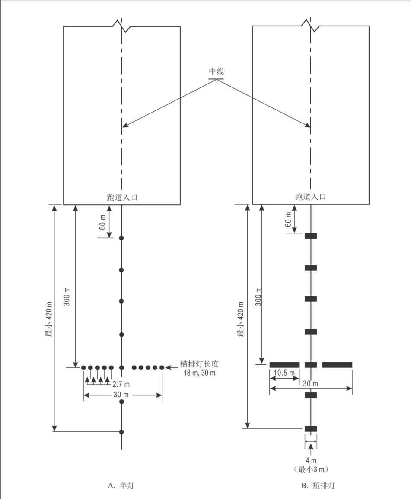

图A-7简易进近灯光系统

### 11.2 安装容差

## 水平方向

11.2.1尺寸容差如图A-8所示。

11.2.2进近灯光系统的中线应尽可能地与跑道中线延长线相吻合，其最大容差为土15′。

11.2.3中线灯的纵向间距应使一个灯（或一组灯）位于每一横排灯的中心：横排灯之间的中线灯应尽可能均匀地布置在两个横排灯之间，或者一个横排灯和跑道入口之间。

11.2.4横排灯和短排灯应与进近灯光系统的中线相垂直。如果采用图A-8(A）的型式，其容差为±30′：如果采用图A-8(B）的型式，其容差为±2°。

11.2.5当某一横排灯必须移离其标准位置时，任何相邻的横排灯应在可能条件下移动适当的距离，以减少横排灯间距之间的差异。

11.2.6当如图A-8（A）所示的系统中的某一横排灯移离其标准位置时，其全长应予调整，使其仍保持为自原点到该横排灯实际距离的二十分之一。不过，没有必要调整横排灯之间2.7m的标准间距，而应保持横排灯对称于进近灯光的中线。

## 垂直方向

11.2.7理想的布置是把所有的进近灯均安装在通过跑道入口的水平面上（见图A-9）。只要当地条件许可，这种布置应当是一般的目标。不过，假如驾驶员位于远距标志物附近的电子下滑道下面1°，其观察灯光的视野不应受到建筑物、树木等的遮挡。

11.2.8在停止道和净空道内，以及在跑道端外150m范围内，应力求在当地条件许可的情况下把灯具安装得接近地面，使飞机在偶尔冲出跑道或过早接地的情况下，飞机遭受损害的危险减至最小。在停止道和净空道以外，并无必要将灯安装得接近地面，因此，地面的高低起伏可以用把灯装在适当高度的柱子上的办法来进行调整。

11.2.9要尽可能将灯安装得使距中线两侧各60m的范围内没有物体突出于进近灯光系统的平面之上。当在精密进近灯光系统的跑道中线两侧60m、距跑道入口1350m范围内，或在简易进近灯光系统的跑道中线两侧60m、距跑道入口900m范围内存在高大物体时，最好使安装的灯光系统外半部的平面超过该物体的顶部。

11.2.10为了避免引起对地平面的错觉，自跑道入口向外至300m处的灯应安装得不低于1:66的降坡，自300m 处以外的灯应不低于1:40的降坡。对Ⅱ类和Ⅲ类精密进近灯光系统，可能需要更加严格的规定，例如自跑道入口向外450m以内不允许有负坡。

11.2.11中线任何部分（包括停止道或净空道）的中线的坡度应尽实际可行地小，其坡度的变化应尽可能安排得少和小，并应不超过1:60。经验表明，按从跑道向外算，在任何一段内的升坡大到1:66、降坡大到1：40是可以被接受的。

11.2.12横排灯横排灯应安排得位于通过所关联的中线灯的直线上，只要可能该线应是水平的。但在停止道或净空道内，当地面有横坡时，如果把横排灯安装在不大于1:80的横坡上能使灯具较为接近地面，则是许可的。

### 11.3 超障

11.3.1出于超障的目的，规定了下文称之为灯光面的一个平面，该系统的所有灯光都在这个平面内。这个平面为长方形，位置对称于进近灯光系统的中线。它从跑道入口开始，延伸到本系统的进近端以外60m，宽度为120m 

11.3.2除此处指定的物体以外，在灯光面范围内不充许有高出灯光面的物体存在。所有道路和公路均被认为是高出其路拱4.8m的障碍物，但所有车辆交通是在机场当局管制之下并与机场交通管制塔台取得协调的机场辅路除外。铁路，不论其运量的多少，均被认为是高出轨顶5.4m的障碍物。

11.3.3一般认为电子着陆系统的某些组成部分，诸如反射器、天线、监视器等，必须安装得高出灯光面。应尽一切努力将这些部件重新装置在灯光面之外。对于反射器和监视器，这些要求在许多情况下是可以做到的。

11.3.4当灯光面范围内装有仪表着陆系统的航向台时，一般认为航向仪或所使用的天线幕，肯定会突出于灯光面之上。在这种情况下，应使这些构筑物的高度降至最小，并使其位于离跑道入口尽可能远的地方。一般来说，关于其允许高度的规则是：每离开跑道入口30m，相应的允许高度增加15cm。例如，若航向台位于距跑道入口300m 处，其天线幕允许突出进近灯光系统面的最大值为$10\times15=150cm$ ，但最好还是保持仪表着陆系统正常运行所需要的尽可能低的高度。

11.3.5在为微波着陆系统方位天线定位时，应遵循载于附件10卷1第1部分附篇G的指导材料。该材料也对微波着陆系统方位天线与仪表着陆系统航向台天线定位在一起提供了指导。它建议当实际上不可能将微波着陆系统的方位天线设置在与进近方向相反的进近灯光系统的外端以外时，可以将其设置在灯光面范围之内。如果微波着陆系统的方位天线设置在跑道中线的延长线上，它应当距离跑道端方向最近的灯尽可能地远。此外，微波陆系统的方位天线的相位中心应至少高于前述跑道端方向距离方位天线最近的灯的灯光中心之上0.3m。（如果场地上没有明显的多径问题，它可以降低到0.15m），遵照上述要求旨在保证微波着陆系统信号的质量不受进近灯光系统的影响，但这可能会导致灯光系统的局部被微波着陆系统的方位天线所遮挡。为了保证所引起的遮挡不会使目视引导降低到所能接受的水平之下，微波着陆系统方位天线应不设置在跑道端300m以内，最好设置在300m处横排灯以外25m的地方（这将使天线位于距跑道端330m灯位之后5m处）。当微波着陆系统的方位天线照这样设置时，只有在进近灯光系统的300m处的横排灯的中部被局部遮挡。尽管如此，保证横排灯中未被遮挡的灯在所有时间内都是可用的仍然十分重要。

11.3.6处于灯光面范围内、需要把灯光面提高才能符合上述标准的物体应当移除、降低高度或迁至他处，如果这样做比提高灯光面更为经济的话。

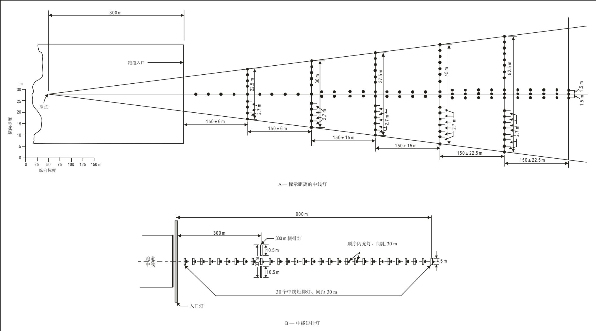

图A-8I类精密进近灯光系统

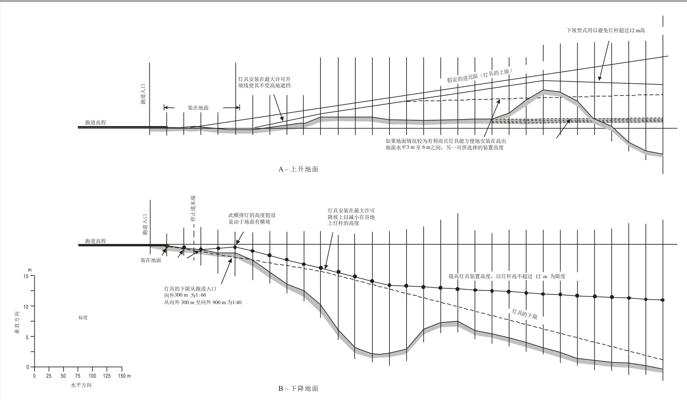

图A-9垂直方向的装置容差

11.3.7在有些情况下，可能存在一些不能经济地将其移除、降低或迁至他处的物体。这些物体可能位于距跑道入口很近的地方以致突出2%的坡度线。在存在这种情况而又别无选择时，为了使进近灯高于这些物体，可以超过2%的坡度线或采用“梯级”方式。这种“梯级”或增大坡度的方式只能在确实无法遵循标准坡度标准时才应采用，而且应保持在绝对的最小限度。根据这一准则，灯光系统的最外面部分不允许用负坡。

### 11.4 对缩短长度的影响的考虑

11.4.1当驾驶员在着陆前要求获得目视参考时必须具备足够的进近灯光系统来配合精密进近，这一点怎么强调也不过分。这类运行的安全性和正常性有赖于这种目视参照的获得。在跑道入口上空一定高度，驾驶员要判断是否有足够的目视参照来继续进行精密进近及着陆。这一高度是会变化的，它取决于进近的类型和其他因素，如气象条件、地面和机载装备等。能够配合这种进近的所有变化所需的进近灯光系统的长度是900m，因而在任何可能情况下必须予以满足。

11.4.2不过，还是有些跑道的位置，没有可能提供配合精密进近所需的900m的进近灯光系统的长度。

11.4.3在这种情况下，应尽最大努力设置尽可能长的进近灯光系统。有关当局可能要对进近灯光系统长度被缩短了的跑道的运行加以限制。有很多因素影响驾驶员在什么高度必须作出是继续进近着陆、还是进行复飞的决断。必须要明白驾驶员不是在某一规定的高度时作出瞬间判断的。继续进近和着陆的实际决断是一个积累过程，只是在规定高度上才作出结论而已。除非在达到决断点之前灯光都是适用的，否则目视评估过程就会受到影响，而使复飞的可能性大为增加。有关当局在决定是否有必要对精密进近加以任何限制时，有许多运行上的问题必须给予考虑。这些问题详见附件6。

## 12 ．设置目视进近坡度指示系统的优先顺序

12.1要制定对在机场的哪条跑道上应最先设置目视进近坡度指示系统作出完全客观分析的指导材料是不现实的。不过，当要作出这一决定时，一定要考虑到的因素是：

a）使用的频率；

b）危险的严重性；

c）是否设有其他目视和非目视助航设施；

d）使用该跑道的飞机类型；和

e）将使用该跑道时的坏天气的频率和类型。

12.2关于危险的严重性，第5章5.3.5.1b）至e）有关目视进近坡度指示系统应用规范中给出的次序可以用来作为一般的指导。这些内容可概括为：

a）不充分的目视引导，其原因在于：

1）进近时经过水域上空或缺乏特征地形的上空，或夜间在进近地区内没有足够的外界灯光；

2）迷惑人的周围地形；

b进近中有严重危险；

c）如果飞机过早接地或冲出跑道有严重危险；和

d）异常的湍流。

12.3是否设有其他目视或非目视助航设施是一个很重要的因素。设有仪表着陆系统或微波着陆系统的跑道一般可以最后考虑安装目视进近坡度指示系统。不过，必须记住，目视进近坡度指示系统其本身就是目视进近助航设施，并能作为电子助航设施的补充。当存在严重的危险和/或有相当数量未装备有仪表着陆系统或微波着陆系统的飞机使用该跑道时，也可以考虑优先在这条跑道上装设目视进近坡度指示系统。

12.4涡轮喷气飞机使用的跑道应优先设置目视进近坡度指示系统。

## 13 ．不适用地区的灯光

当存在暂时不适用地区时，可用恒定发光的红灯予以标示。这些灯应标示出该区最有潜在危险的边缘。除了标示三角形地区最少可用三个灯之外，这类灯应至少用四个。当该地区较大或形状特殊时，灯的数量应予增加。至少应在该地区的周界上每隔7.5m距离安装一个灯。如果灯光是具有方向性的，则光束照射的方向应尽可能地朝着航空器或车辆向该地区进近的方向。如果航空器或车辆一般从几个方向进近该地区，应考虑增加额外的灯或采用无定向灯从这些方向显示该地区。不适用地区的灯应是易折的。这些灯的高度应足够地低，以保持螺旋桨和喷气飞机的发动机吊舱与灯之间的净距。

## 14 ．快速出口滑行道指示灯

14.1快速出口滑行道指示灯（RETIL）由安装在跑道中线附近的一组黄色单向灯组成。这些灯以100m的间距按3-2-1的顺序安装在快速出口滑行道中线切点的前面。这些灯用于为驾驶员指示下一个可用快速出口滑行道的位置。

14.2在低能见度的情况下，快速出口滑行道指示灯在使驾驶员能够集中注意力使航空器保持在跑道中线上的同时，可向驾驶员提供有用的情景意识。

14.3航空器着陆后，跑道占用时间对可达到的跑道容量有很大的影响。快速出口滑行道指示灯使驾驶员能够维持一个良好的着陆滑跑速度，直至有必要减到一个适当速度以转入快速出口脱离跑道之时。在到达第一组快速出口滑行道指示灯（三个短排灯）以前保持60节的着陆滑跑速度被认为是最佳的。

## 15 ．进近灯和跑道灯的光强控制

15.1灯光的明显程度取决于灯光与其背景之间的对比感觉。如果要使灯光对昼间进近的驾驶员有用，其光强必须至少是2000或3000cd，而进近灯光的光强则最好为20000cd左右。在有很亮的白昼雾的情况下，甚至不可能提供光强高到足以有效的灯光。另一方面，在晴朗的夜间，进近灯光强在100cd左右、跑道边灯光强在50cd左右就可能是合适的了。即使如此，由于是在较近的距离内看到它们，驾驶员有时还嫌跑道边灯似乎太亮了。

15.2灯光在雾中扩散较多。在夜间这种扩散的光增加了进近区和跑道上空的雾的亮度，致使即便将灯的光强增加到超过2000cd或3000cd时，也几乎增加不了多少灯光能见距离。在努力增加夜间最初看见的那些灯光的视距时，切勿将其光强增加到会使驾驶员在距离减小时感到过分眩目的程度。

15.3综上所述，根据现场情况来调节机场灯光系统的光强以取得更好的效果，同时又不使驾驶员因过分眩目而感到不适这一重要性，是显而易见的。在任何一个特定情况下的适当的光强调置取决于背景亮度和能见度两者的条件。有关在各种不同情况下选择光强调置的详细指导材料，见《机场设计手册》（Doc9157号文件）第4部分。

### 16. 信号场地

只有当准备采用目视地面信号与飞行中的航空器进行通信时，才需要设信号场地。在没有机场管制塔台或机场飞行情报服务部门的机场或者未装有无线电的飞机使用的机场都需要这种信号场地。在与航空器通信的双向无线电失效的情况下，目视地面信号可能也是有用的。但应承认，在航行资料汇编或航行通告中一般应能获得可能由目视地面信号传送的那种类型的信息。因此，在决定设置信号场地之前，应对是否有目视地面信号的潜在需要加以评估。

## 17 ．救援与消防服务

### 17.1 管理

17.1.1机场的救援与消防服务应置于机场管理部门的行政管理之下，该部门还应负责保证所提供的这些服务在组织、设备配备、人员设置、训练及运行各方面均处于能圆满完成其固有任务的状态。

17.1.2在依据附件12一《搜寻与援救》的4.2.1制定实施搜寻和救援行动的详细计划时，机场管理部门应将其计划与有关的各救援协作中心进行协调，以保证其对机场附近发生航空器事故时各自所负职责的范围有明确的划分。

17.1.3机场救援与消防部门与公共保障机构如地方消防队、警察局、海岸警卫队和医院等之间的协作，应通过事先就协助处理航空器事故的事宜达成协议来实现。

17.1.4应备有机场及其邻近地区的网格图供机场有关服务部门使用。图上应标明有关地形、通道和供水点等资料。这种地图应明显地张贴在管制塔台和消防站内，并随带在救援与消防车以及需要对航空器事故或事故征候作出反应的其他支援车辆上。需要时亦应将这种地图分发给各公共保障机构。

17.1.5应制定出协调细则，详细规定各有关单位的职责和处置紧急事故时所要采取的行动。有关当局应保证这种细则的发布和遵守。

### 17.2 培训

培训课程应包括至少如下方面的初训和复训：

a）熟知机场；

b）熟知航空器；

c)救援与消防人员的安全；

d)机场应急通信系统，包括有关航空器火情警报；

e)符合第9章9.2所要求的消防水龙带、喷嘴、塔梯和其他设施的使用；

f)符合第9章9.2所要求的各种类型灭火剂的使用；

g)协助航空器紧急疏散；

h)消防操作；

i)使供建筑物使用的救援与消防设备适用于航空器的救援与消防；

j)危险物品；

k)熟悉机场应急计划中规定的消防员的职责；和

1)防护服和呼吸保护。

### 17.3 提供保障的水平

17.3.1按照第9章9.2的要求，应为救援与消防目的给机场分级，所提供的保障水平应与该机场消防等级相适应。

17.3.2但是，当正常使用该机场的最高消防等级的飞机在最繁忙的连续三个月中的起降架次少于700次时，第9章9.2.3允许在有限的时期内提供较低的保障水平。必须指出的是，9.2.3中所做出的妥协仅适合于少于700起降架次所含飞机的尺寸之间有较大差异的情况。

### 17.4 困难环境下的救援设施

17.4.1当救援服务所覆盖的区域含有水域、沼泽地带或其他不能充分利用常规轮式车辆的困难环境时，机场应能提供适用的救援设备和服务工具。当有相当数量的进近/起飞运行是在这些区域上空进行的时，这点尤为重要。

17.4.2救援设备应装载在船上或能在相关区域内运行的其他运输工具上，如直升机、两栖或气垫运输工具等。这些运输工具应放置在可对服务所覆盖区域快速驰援的地方。

17.4.3在靠近水域的机场，船只和其他运输工具最好停放在机场内便于下水或停泊的地方。如果这些运输工具停放在机场外面，最好将它们置于机场救援与消防部门的控制之下，如果不实际可行，则应置于与机场救援与消防部门密切协作的另一个能胜任的公共或私人组织（诸如警察、军队、港口巡查队或海岸警卫队）的控制之下。

17.4.4船只或其他运输工具应尽可能具有较高的速度，使其能在最短的时间内到达事故现场。为了减少救援中可能对人员造成的伤害，最好使用喷水艇而不是螺旋桨快艇，除非后者的螺旋桨装有护罩。倘若服务范围内的水域在一年里有相当长的时间结冰，应相应地选择适合的救援设备。救援用的运输工具应配备满足正常使用该机场的大型航空器所需要的救生筏和救生用具，以及双向无线电通信设备和夜间工作用的泛光灯。如果预计会有航空器在低能见度时飞行，可能还有必要对驰援的应急车辆提供引导。

17.4.5被指定操作救援设备的人员应在相应环境中经过充分的救援训练和演习。

### 17.5 设施

17.5.1为救援与消防服务工作提供专用电话、双向无线电通信设备和一般的报警系统十分可取，以便保证可靠地传递重要的紧急情报和日常信息。根据每一机场的各自需求，这些设施可服务于下列目的：

a)执行当局与机场消防站之间的直接通信联络，以保证在发生航空器事故或事故征候时及时报警并派遣救援与消防车辆和人员；

救援与消防服务部门与处于紧急状况的航空器飞行机组的直接通信联络；

c)发出紧急信号，以保证立即召集指定的非值班人员；

d）必要时，召集机场内外的有关重要部门；和

e）用双向无线电与出现在航空器事故或事故征候现场的救援与消防车辆保持通信联络。

17.5.2有关当局应认真考虑如何为撤离和救治航空器事故造成的伤亡人员提供所需的救护车和医疗设备，并将其作为处置这类紧急事件而制定的全面应急计划的组成部分。

### 18. 车辆操纵人员

18.1负责机场活动区地面车辆运行的有关当局应保证操纵人员具备适当资质。根据驾驶员职责的不同，这可包括具有下述方面的知识：

a）机场的地理状况；

b）机场标记牌、标志和灯光；

c）无线电话操作程序；

d）机场管制用词和短语，包括国际民航组织规定的缩写字母；

e）与地面运行有关的空中交通服务规则；

f）机场规则和程序；和

g）必要的专门知识，例如救援与消防。

### 18.2 操作人员应酌情证明其具备下述能力：

a）操纵或使用车上的无线电发送/接收装备；

b）理解并遵守空中交通管制和当地的程序；

在机场驾驶车辆；和

d）掌握特定职能所需的专门技术。

此外，根据任何专门职能的需要，操纵人员应持有国家驾驶员执照、国家无线电操作员执照或其他执照。

18.3以上要求应针对操纵人员的具体职能来运用，而且没有必要把所有的操纵人员都训练到同样的水平，例如其职能只限于机坪上的操纵人员的训练就相对简单。

18.4如果对在低能见度条件下的运行采用了特殊程序，则最好通过定期考核来检验操纵人员对此种程序的掌握情况。

### 19. 通报道面强度的ACN-PCN方法

适用至2024年11月27日

### 19.1 超载运行

19.1.1荷载太大或使用频率大量增加，或两者同时存在，都会导致道面的超载。大于规定的（设计或评定的）荷载会缩短道面设计寿命，而较小的荷载则会延长其寿命。除严重超载之外，道面的结构性能并不会在受到某一个高于特定限制的荷载而突然地或灾难性地产生毁损。道面性能是在其设计使用寿命期间内道面能承受一定预期次数

的限定荷载的反复作用。因此，权宜性的偶尔少量超载是可以接受的，它只会有限地减少道面的预期使用寿命，对道面的损坏也仅有相对较小的加速作用。对那些超载的大小和/或使用的频率不值得去作专门详细分析的超载运行，建议采用下列准则：

a）对柔性道面，ACN不超过所报告的PCN10%的航空器的偶然起降应不会对道面有不利影响；

b)对刚性道面或以刚性道面层作为结构主要组成部分的复合道面，ACN不超过所报告的PCN5%的航空器的偶然起降，应不会对道面有不利影响：

c）如果道面结构为未知，则应采用5%的限度；和

d）年度超载起降架次应不超过年度总的航空器起降架次的约5%。

19.1.2当道面呈现破损或失效迹象时，一般不应再允许上述超载运行。此外，道面在冻融期间或当道面或其土基强度可能因水的影响而减弱时，应避免超载运行。在进行超载运行时，有关当局应定期检查现行道面的情况，还应周期性地检查超载的标准，因为过多的超载运行会大大缩短道面的使用寿命或导致必须对道面进行重大修理。

### 19.2 若干航空器机型的ACN 

为方便起见，已在修筑在第2章2.6.6b）中所列的四种土基强度类型上的刚性和柔性道面上对目前使用的若干航空器机型作出评估，评估结果列表于《机场设计手册》（Doc9157号文件）第3部分。

### 19. 通报道面强度的ACR-PCR方法

## 自2024年11月28日起适用

### 19.1 超载运行

19.1.1荷载太大或使用频率大量增加，或两者同时存在，都会导致道面的超载。大于规定的（设计或评定的）荷载会缩短道面设计寿命，而较小的荷载则会延长其寿命。除严重超载之外，道面的结构性能并不会在受到某一个高于特定限制的荷载而突然地或灾难性地产生毁损。道面性能是在其设计使用寿命期间内道面能承受一定预期次数的限定荷载的反复作用。因此，权宜性的偶尔少量超载是可以接受的，它只会有限地减少道面的预期使用寿命，对道面的损坏也仅有相对较小的加速作用。对那些超载的大小和/或使用的频率不值得去作专门详细分析的超载运行，建议采用下列准则：

对柔性和刚性道面，航空器分类等级不超过所报告的道面分类等级10%的航空器的偶然起降应不会对道面有不利影响；

b）年度超载起降架次应不超过除轻型航空器之外的年度总起降架次的约5%。

19.1.2当道面呈现破损或失效迹象时，一般不应再允许上述超载运行。此外，道面在冻融期间或当道面或其土基强度可能因水的影响而减弱时，应避免超载运行。在进行超载运行时，有关当局应定期检查现行道面的情况，还应周期性地检查超载的标准，因为过多的超载运行会大大缩短道面的使用寿命或导致必须对道面进行重大修理。

### 19.2 若干航空器机型的ACR 

为方便起见，国际民航组织网站上提供了一个专门的软件，用来计算第2章2.6.6b）中详述的四种标准土基强度类型下刚性和柔性道面上任何质量的任何航空器分类等级。

### 20. 跑道侵入自主警告系统（ARIWS）

注1：通常，这些自主系统的设计和运行非常复杂，因此需要行业内从监管当局到最终用户的所有各级认真加以考虑。提供该指导材料是为了：对系统做更加清楚的说明：并提出一些为了在任一国家的机场正确部署这些系统而需采取的建议行动。

注2：《防止跑道侵入手册》（Doc9870号文件）中载有防止跑道侵入的各种做法。

### 20.1 一般说明

20.1.1跑道侵入自主警告系统的运行依靠一个监视系统，该系统对跑道上的实际状况进行监测并将该信息自动返回给跑道（起飞）入口处和滑行道与跑道交叉处所安装的警告灯。如果航空器从某一跑道离场（滑跑）或抵达某一跑道（短五边），滑行道与跑道交叉处的红色光警告灯将开亮，表示进入或穿过跑道均不安全。如果一架航空器在跑道上做好了起飞前的对准，而另一架航空器或车辆进入或者穿越该跑道，跑道入口区域的红色光警告灯将开亮，表示开始起飞滑跑不安全。

20.1.2通常，跑道侵入自主警告系统包括一套独立的监视系统（一次雷达、多点定位、专门相机、专用雷达等）和一套警告系统，它是机场额外安装的、通过一个可独立于空中交通管制直接向飞行机组和车辆驾驶员发出告警的处理器连接起来的灯光系统。

20.1.3跑道侵入自主警告系统不需要电路交错、副电源或与其他目视助航系统进行运行连接。

20.1.4实际上，并非每个进入处或入口处都需要安装警告灯。每个机场须根据机场特点对其自身需求进行单独评估。已开发出几种可提供相同或类似功能的系统。

### 20.2 飞行机组行动

20.2.1飞行机组可理解跑道侵入自主警告系统正在发送的警告，这点至关重要。由于没有时间进行“中继”类型的通信，所以警告儿平以实时方式直接提供给飞行机组。换言之，如果向空中交通服务提供冲突警告，后者肯定会在此之后对警告进行解读、开展情况评估并与相关航空器建立通信，这将导致几秒钟被占用，而每秒钟都决定着能否让航空器安全停下及防止可能发生冲突。必须向驾驶员发送一个全球统一的信号，其意思是“立即停止”，并

且他们必须知道作出相应的反应。同样，如果驾驶员收到空中交通服务所发的准许起飞或穿越跑道的指令，并看到红色光灯具组，则必须停止，并告知空中交通服务：由于看到红色光灯，他们已经取消作业、停止。再强调一次，由于所涉时间非常紧迫，所以不容许对信号产生误解。全世界采用统一的目视信号至关重要。

20.2.2同时，还必须强调，红色光灯熄灭其本身并不表示放行。仍然要求由空中交通管制发出放行指令。红色光警告灯不亮仅表示没有探测到可能有冲突。

20.2.3如果系统不能工作，将出现如下两种情况中的一种。如果系统在熄灭情况下发生故障，则无需进行程序变动。唯一会发生的情况为自动、独立的警告系统不工作。空中交通服务运行和飞行机组程序(针对空中交通服务放行采取的程序)将保持不变。

20.2.4应制定相关程序，以应对系统在开亮的情况下发生故障的情况。将由空中交通服务机构和/或机场运营人根据其自身情况制定这些程序。必须记住，飞行机组应按照指示，一见到红色光灯便“停止”。如果将系统受影响部分或整个系统关闭，则应回到上文20.2.3所述的熄灭情景。

### 20.3 机场

20.3.1不必在所有机场均配备一套跑道侵入自主警告系统。考虑安装此种系统的机场可能会根据交通量水平、机场几何形状、地面滑行模式等因素对其需要单独进行评估。本地跑道安全小组（LRST）等本地用户群能协助执行该过程。同时，并非每条跑道或滑行道均需配备灯具组，且并非每个机场都要求有一个全面的地面监视系统，向冲突探测计算机传输信息。

20.3.2虽然可能有当地的具体要求，但是，一些重要的系统要求仍可适用于所有跑道侵入自主警告系统：

a）系统的控制系统和供电必须独立于机场任何其他在用系统，尤其是灯光系统的其他部分；

b）系统的运行必须独立于空中交通服务通信；

c）系统必须提供一个全球接受的、统一的且机组能立即理解的目视信号；和

d）必须制定当地程序，以应对系统的一部分或整个系统发生故障或失灵的情况。

### 20.4 空中交通服务

20.4.1跑道侵入自主警告系统旨在对空中交通服务的正常运行加以补充，在机场正常运行期间不小心造成或者疏忽掉某种冲突的情况下，向飞行机组和车辆驾驶员提供警告。例如，当地面管制或塔台（本地）管制提供了一个在滑行道等待不准进入跑道的指令，但飞行机组或车辆驾驶员“疏忽掉了”所收放行指令中不准进入跑道这一指令，且塔台对同一跑道发出了一个准许起飞或着陆的指令，同时空中交通管制又疏忽掉了飞行机组或车辆驾驶员未对指令进行回读一事时，跑道侵入自主警告系统将提供直接警告。

20.4.2如果已发出放行指令，而机组报告由于遇到“红色光灯”而未能遵守相关要求，或者由于遇到“红色光灯”而取消作业，则管制员必须对情况进行评估，并于必要时提供其他指示。情况有可能是系统发出了一次误报警，或者侵入的可能性不复存在：但是，这也可能是一次有效的警告。不管怎样，需要提供额外的指示和、或新的放行指令。如果系统发生故障，则需要如上文20.2.3和20.2.4段所述，采用相关程序。任何情况下，如果不对实际上并不存在冲突一事进行确认，就不应对跑道侵入自主警告系统开亮一事置之不理。值得一提的是，在装有此种系统的机场，出现过许多次“避免事故征候”的情况。另外值得一提的是，通常由于警告软件的校准问题，也发生过误报警，但任何情况下，必须对存在或不存在潜在冲突的情况进行确认。

20.4.3虽然许多装置可以向空中交通服务人员提供视频或音频警告，但绝没有打算要求空中交通服务人员对系统进行积极监测。此类警告可以在发生警告时协助空中交通服务人员对冲突进行快速评估，并帮助他们进一步提供适当指示，但跑道侵入自主警告系统不应对任何空中交通服务设施的正常运行发挥积极作用。

20.4.4安装有该系统的每个国家以及或许每个机场，将根据其独特情况拟定替代运行的相关程序。必须再强调一次，任何情况下，如果不采取一些额外的缓解措施（如引导车）或者不对该具体地点的系统故障进行具体确认，则不应指示驾驶员或车辆驾驶员“穿越红色光灯”。如上所述，使用本地跑道安全小组能够大力协助该程序拟定过程。

### 20.5 信息的公布

20.5.1关于机场跑道侵入自主警告系统的特性和状态的信息，在《空中航行服务程序一航空情报管理》（Doc10066号文件）中航行资料汇编这一节的AD2.9节中公布，并根据本附件的2.9.1，通过航行通告或航站自动情报服务对其状态做必要更新。

20.5.2航空器运营人应按照附件6第I部分的规定确保飞行机组文件包括跑道侵入自主警告系统的相关程序及相关指导资料。

20.5.3此外，机场可向可能不得不处理跑道侵入自主警告系统相关事宜的机场人员、航空器运营人、空中交通服务和第三方人员提供关于运行和程序的额外指导。

## 21 ．最大限度地降低潜在的跑道侵入的滑行道设计指导

21.1良好的机场设计措施可以降低潜在的跑道侵入，同时保持运行效率及能力。下述滑行道设计指导可被认为是防止跑道侵入方案的一部分，作为确保在新跑道和滑行道设计阶段解决跑道侵入因素的一种手段。在这个针对性指导之内，主要考虑因素是限制进入或穿越跑道的航空器或车辆数量，为驾驶员提供整个跑道增强的无遮挡视野，并尽可能地纠正被界定为热点的滑行道。

21.2在可能的情况下，入口滑行道的中线应垂直于跑道中心线。这种设计原理可为驾驶员提供整个跑道两个方向无遮挡的视野，在前进到跑道之前，确认跑道和进近没有相互冲突的交通。如果滑行道角度不可能提供两个方向无遮挡的视野，应考虑在紧靠跑道部分提供垂直的滑行道段，以便驾驶员在进入或穿越跑道之前进行充分的扫视。

21.3对于与跑道相交的滑行道，避免将滑行道设计得宽于本附件建议的宽度。这种设计原理可改进对跑道等待位置和相应的标记牌、标志和灯光目视信号位置的识别。

21.4宽度大于本附件建议的现有滑行道，可以通过涂画滑行边线标志线的建议宽度予以纠正。在切实可行范围内，最好是适当地重新设计这些位置，而不是重新涂漆。

21.5多个滑行道入口应是相互平行的，并应由无铺筑面区明确分开。这种设计原理可使每条跑道等待地点的每条跑道等待位置有土地区妥善设置相应的标记牌、标志和灯光目视信号。此外，这种设计原理消除了建造无法使用道面的不必要费用以及滑行道边线标记涂漆以表示道面无法使用的成本。一般情况下，跑道等待位置铺筑面积过大降低了标记牌、标志和灯光目视信号的有效性。

21.6将穿越跑道的滑行道建造成一条单条直线滑行道。避免使滑行道在穿越跑道后分成两条滑行道。这种设计原理避免将滑行道建造成已知会带来跑道侵入风险的“Y形”滑行道。

21.7如果可能的话，避免将进入跑道的滑行道建造在跑道中间位置。这种设计原理有助于降低在最危险的位置（高能量位置）发生碰撞，因为通常起飞航空器此时能量大到不能停住，但却没有足够速度在与另一架错误进入的航空器或车辆相撞之前起飞。

21.8在快速出口滑行道和其他进入或穿越跑道的非快速滑行道之间提供明确的道面间距。这种设计原理避免两条滑行道互相重叠，造成铺筑区过大致使进入跑道的驾驶员产生困惑。

21.9跑道等待位置或其附近应尽实际可能地避免铺设不同的道面材料（沥青和水泥混凝土）。这种设计原理避免导致对于跑道等待位置的实际位置产生视觉混乱。

21.10许多机场有一条以上跑道，特别是并列平行跑道（两条跑道位于终端一侧），对需要穿越跑道的进场或离场航空器均造成一个困难问题。这种构形的安全目标是避免或至少将跑道穿越数量保持在最低水平。这个安全目标可通过建造一条“围界滑行道”来实现。围界滑行道是围绕跑道端的一条滑行路线，能够使进场航空器（在并列跑道的外侧跑道着陆）或离场航空器（在并列跑道的外侧跑道起飞）在不穿越跑道或不与离场和进场航空器发生冲突的情况下到达候机楼或跑道。

### 21.11 围界滑行道将根据以下标准进行设计：

a）着陆入口与在进近航道之下穿越的滑行道中线之间要求有足够空间，能够使临界滑行航空器在不穿透任何进近面的情况下从进近航道下通过。

b)应与航空器制造商协商审议航空器起飞喷流的影响；在确定围界滑行道的位置时，应对起飞推力范围进行评估。

c)还应考虑到跑道端安全区的要求以及对着陆系统和其他助航设施的可能干扰。例如，在使用仪表着陆系统时，围界滑行道应位于航向台天线后方，而不是航向台天线和跑道之间，因为它可能会严重干扰仪表着陆系统，须指出，航向台和跑道之间距离越大越难实现。

d)也应考虑到人的因素问题。应具备适当措施，以帮助驾驶员区别正在穿越跑道和那些安全地位于违界滑行道上的航空器。

## 22 ．机场地图数据

### 22.1 引言

第2章的2.1.2和2.1.3包含了与提供机场地图数据有关的规定。机场地图数据特征是为国家指定的机场航空情报服务部门收集和提供的，并虑及了预计的应用。这些应用与经查明的需求和运行使用密切相联，其中的数据应用将带来安全效益，或者可以用来减缓安全关切。

### 22.2 应用

22.2.1机场地图数据包括支持提高用户情境意识或辅助地面导航应用的机场地理信息，藉以提高安全裕度和运行效率。这些数据集具备适当的数据要素准确性，能支持协同决策、一般情境意识和机场引导的应用。这些数据集预计将用于下述空中航行应用：

a 机上定位和航线意识，包括本航空器位置、地面引导和导航的活动地图；

b）交通意识，包括监视和跑道侵入探测和告警(分别如高级地面活动引导及控制系统的1级和2级)；

c)地面定位和航线意识，包括航空器和车辆位置及滑行路线、地面引导和导航的情境显示（如高级地面活动引导及控制系统的3级和4级）；

d)促进与机场有关的航空情报，包括航行通告；

e)资源和机场设施管理；和

f）航图制作。

22.2.2数据也可用于培训、飞行模拟器和机载或地面增强目视系统（EVS）、合成目视系统（SVS）及组合目视系统（CVS）等其他应用。

### 22.3 确定可考虑收集机场地图数据特征的机场

为了确定哪些机场可以使用要求收集机场地图数据特征的应用，可以考虑机场的以下特点：

-机场的安全风险；

能见度条件；

机场布局；

交通密度。

注：关于机场地图数据的进一步指导材料，见《机场服务手册》第8部分一机场运行服务（Doc9137号文件）。

m篇B 障碍物限制面

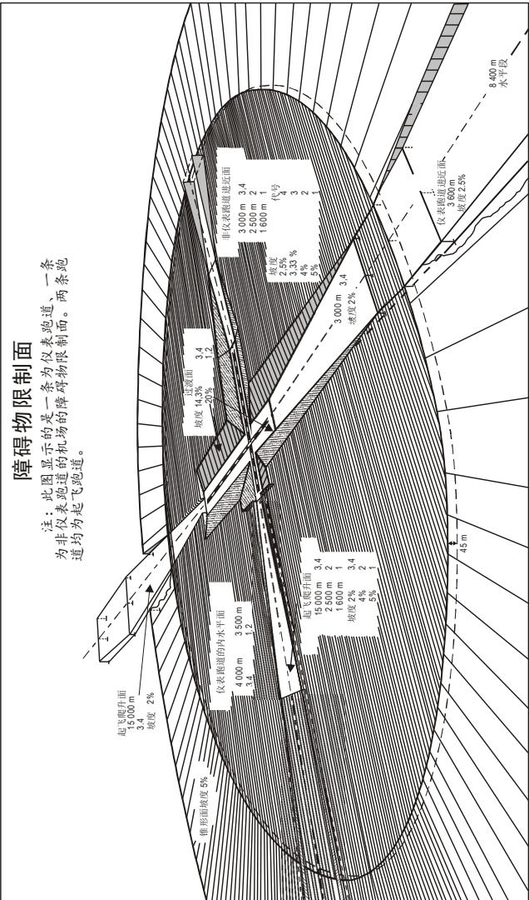

图B-1

## 机场运行*

机坪管理服务9.5

减轻野生动物撞击的危害9.4

标示关闭区域7.1

标示不适用地区7.4

残损航空器的搬移9.3

应急计划9.1

航空器地面服务9.6

光强控制A-15

不适用地区的灯光A-13

维护10

地图数据A-22

车辆和移动物体的标志6.1.6，6.2.2；6.2.14

测量跑道制动作用/摩阻力A-6；A-7

升降带上的移动障碍物3.4.7

目视助航设施的监控8.3

超载运行A-19.1

报告机场数据2

救援与消防9.2；A-17

备用电源8.1

机场运行的具体程序1.7

## 机坪

清除杂物10.2.1

清除雪、冰等10.3.2；10.3.3

定义1.1

物理特性3.13

隔离航空器停放位置3.14

灯光5.3.24

报告要求2.5.1d)

安全线5.2.14

## 机坪管理服务

定义1.1规定9.5

## 附件14第I卷中重要主题提要索引

## 净空道

计入跑道长度的考虑3.1.8

定义1.1

易折性9.9.1b)；9.9.2c 

概述A-2

物理特性3.6

报告要求2.5.1 f)

## 除冰/防冰设施

定义1.1灯光5.3.22位置3.15.2标志5.2.11.2

## 公布的距离

计算A-3定义1.1报告要求2.8

## 残损航空器的搬移

能力9.3报告要求2.10

## 内移跑道入口

定义1.1

灯光5.3.11.1;5.3.11.3位置A-10.2标志5.2.4.9；5.2.4.10

## 易折性

易折物体的定义1.1立式进近灯5.3.1.4；5.3.1.5标志物 5.5.1

运行区上的物体9.9升降带上的物体3.4.7其他立式灯具5.3.1.7PAPI和APAPI 5.3.5.27标记牌5.4.1.3T-VASIS和 AT-VASIS 5.3.5.16

## 平整

无线电高度表操作场地3.8.4跑道端安全区3.5.8升降带3.4.8~3.4.11精密进近跑道的升降带A-9.3滑行道带3.11.4

## 直升机场

定义1.1

规范见附件14卷Ⅱ

## 等待坪

定义1.1物理特性3.12

## 中间等待位置

定义1.1灯光5.3.21位置3.12.4标志5.2.11标记牌5.4.3.9

## 灯光

进近灯光系统5.3.4：附录2：A-11

颜色规范附录1

灯光等的定义1.1

电力系统第8章

光强控制5.3.1.10；5.3.1.11；A-15

灯光5.3

不适用地区的灯光A-13

维护10.1；10.5

监控8.3

障碍灯6.3；附录5

光度测定的特性附录2

设置目视进近坡度指示系统的优先次序A-12

报告要求2.9.2g);2.12

备用电源8.1

安保照明9.11

## 维护

清除杂物10.2.1；10.2.7清除雪、冰等10.3.1~10.3.5概述10.1

道面加覆盖层10.4污染物的清除10.3

跑道的平整度10.2.2；A-5目视助航设施10.5

## 标志物

定义1.1

目视助航标志物5.5

## 标志

颜色规范5.2；附录1定义1.1

物体的标志6.2表面标志的图式5.2

## 监控

活动区和有关设施的状况2.9.1~2.9.3目视助航设施8.3

## 非仪表跑道

进近灯光系统5.3.4.1~5.3.4.9定义1.1

等待坪3.12.6

障碍物限制要求4.2.1~4.2.6跑道等待位置标志5.2.10.2备用电源表8-1跑道入口灯5.3.10.1；5.3.10.4a)

## 非精密进近跑道

进近灯光系统5.3.4.1~5.3.4.9定义1.1

等待坪3.12.6

障碍物限制要求4.2.7~4.2.12跑道入口识别灯5.3.8跑道等待位置标志5.2.10.2备用电源表8-1跑道入口灯5.3.10.1；5.3.10.4a)

## 障碍物/物体

超障A-11.3

障碍物和无障碍物区的定义1.1

灯光6.3；附录5

限制要求4.2

限制面4.1

标志6.2

需要标志和/或照明的物体6.1

净空道上的障碍物/物体3.6.6跑道端安全区上的障碍物/物体3.5.7升降带上的障碍物/物体3.4.6；3.4.7滑行带上的障碍物/物体3.11.3；9.9其他物体4.4

障碍物限制面以外的物体4.3保护面5.3.5.41~5.3.5.45报告障碍物和无障碍物区2.5备用电源8.1

## 道面强度

航空器的ACN值H A-19.2

航空器的ACR值HH A-19.2

机坪3.13.3

超载运行A-19.1

报告要求2.6

跑道3.1.20

道肩A-8.1

停止道3.7.3；A-2.10

滑行道3.9.12

## Ⅰ类精密进近跑道

进近灯光系统5.3.4.10~5.3.4.21

中线灯5.3.12.2：5.3.12.5

定义1.1

飞行轨迹包络面图A-6

易折性9.9

等待坪3.12.6-3.12.9

等待位置标记牌5.4.2.2~5.4.2.5；5.4.2.8；5.4.2.9；5.4.2.11；

5.4.2.14:5.4.2.16：5.4.2.17

目视助航设施的维护10.5.1；10.5.2；10.5.10

升降带上的物体3.4.7

障碍物限制要求4.2.13;4.2.14；4.2.16~4.2.21

跑道灯特性附录2

跑道等待位置标志5.2.10.3

备用电源表8-1

跑道入口灯5.3.10.4b)

## Ⅱ类和IⅢI类精密进近跑道

进近灯光系统5.3.4.22~5.3.4.39定义1.1

飞行轨迹包络面图A-6易折性9.9

等待坪3.12.6~3.12.9

等待位置标记牌5.4.2.2~5.4.2.5；5.4.2.8；5.4.2.9；5.4.2.11；

5.4.2.14;5.4.2.16;5.4.2.17

升降带上的物体3.4.7

障碍物限制要求4.2.15~4.2.21

跑道中线灯5.3.12.1;5.3.12.5

跑道末端灯5.3.11.3

跑道灯特性附录2

跑道等待位置标志5.2.10.3

跑道接地带灯5.3.13

备用电源表8-1

停止排灯5.3.20

滑行道中线灯5.3.17

滑行道灯特性附录2

跑道入口灯 5.3.10.4c)

接地带灯5.3.13

## 救援与消防

通信和报警系统9.2.38：9.2.39应急通道9.2.33~9.2.35灭火剂9.2.8~9.2.21消防站9.2.36：9.2.37概述9.2(引言)

保障水平9.2.3~9.2.7；A-17.3人员9.2.41~9.2.45报告要求2.11

救援设备9.2.25;9.2.40响应时间9.2.26~9.2.32车辆9.2.40

## 跑道

跑道侵入自主警告系统（ARIWS）9.12；A-21

清除杂物10.2.1

清除雪、冰等10.2.8

关闭的跑道标志7.1

定义1.1

灯光5.3.7~5.3.13；附录2

标志物5.5.2；5.5.4

标志5.2.2~5.2.7；5.2.9

跑道的条数、定位和定向A-1

道面加覆盖层10.4

物理特性3.1

报告要求2.3.2;2.5.1a)；2.8；2.9.2；2.9.4~2.9.10;A-6;A-7

跑道表面的平整度A-5

道肩 3.2

坡度3.1.13~3.1.20；A-4

升降带2.5.1b);3.4;9.9.1a)；9.9.3；9.9.5

掉头坪3.3

## 跑道端安全区

定义1.1

尺寸图A-5

易折性9.9.1a);9.9.2b)

概述 A-9

物理特性3.5

报告要求2.5.1b)

## 跑道等待位置

定义1.1

位置3.12.2；3.12.3；3.12.9

标志 5.2.10

跑道警戒灯5.3.23

标记牌5.4.2.2~5.4.2.5；5.4.2.8；5.4.2.9；5.4.2.11；5.4.2.14；

5.4.2.16:5.4.2.17

停止排灯5.3.20

## 起飞跑道

起飞爬升面4.1.25~4.1.29

易折性9.9

目视助航设施维护10.5.1；10.5.2；10.5.11；10.5.12

障碍物限制要求4.2.22~4.2.27

跑道灯光5.3.9.2；5.3.12.3；5.3.12.4

备用电源表8-1

滑行道灯光5.3.17；5.3.18

## 跑道表面摩阻特性

排水性能A-7

维护10.2.1~10.2.5；10.2.7；10.3.3报告要求2.9

跑道设计3.1.22

跑道表面摩阻力2.9.6;2.9.9被冰雪覆盖的铺筑道面一概述A-6

## 安保

机场应急计划9.1.2(注)机场设计和总体计划1.5围栏9.10

隔离航空器停放位置3.14照明9.11

## 停止道

计入跑道长度的考虑3.1.8

定义1.1

概述A-2

灯光5.3.16；附录2

标志物5.5.3

物理特性3.7

报告要求2.5.1 b)

## 滑行道

关闭的滑行道标志7.1

定义1.1

最大限度地降低潜在的跑道侵入的滑行道设计指导A-21

灯光5.3.17：5.3.18：附录2

标志物5.5.5；5.5.6；5.5.7

标志5.2.8:5.2.11；7.2

物理特性3.9

快速出口3.9.16~3.9.19

清除沾污物10.2.7；10.3.2；10.3.4

报告要求2.5.1c 

道肩3.10

升降带3.11；9.9.1a);9.9.3

## 目视进近坡度指示系统

特性5.3.5设置的优先次序A-12报告要求2.12备用电源8.1

一完一