
缩写和符号 （用于附件14第Ⅱ卷）

<html><body><table border="1"><tr><td>APAPI</td><td>Abbreviated precision approach path indicator</td><td></td></tr><tr><td>缩写 ASPSL</td><td>Arrays of segmented point source lighting</td><td>简化精密进近航道指示器 扇形点光源照明阵列</td></tr><tr><td>cd</td><td>Candela</td><td>坎德拉 (烛光)</td></tr><tr><td>cm</td><td>Centimeter</td><td>厘米</td></tr><tr><td>FATO</td><td>Final approach and take-off area</td><td>最后进近和起飞区</td></tr><tr><td>ft</td><td>Foot</td><td>英尺</td></tr><tr><td>GNSS</td><td>Global navigation satellite system</td><td>全球导航卫星系统</td></tr><tr><td>HAPI</td><td>Helicopter approach path indicator</td><td>直升机进近航道指示器</td></tr><tr><td>HFM</td><td>Helicopter flight manual</td><td>直升机飞行手册</td></tr><tr><td>Hz</td><td>Hertz</td><td>赫兹</td></tr><tr><td>kg</td><td>Kilogram</td><td>千克</td></tr><tr><td>km/h</td><td>Kilometre per hour</td><td>千米/时</td></tr><tr><td>kt</td><td>Knot</td><td>海里</td></tr><tr><td>L</td><td>Litre</td><td>升</td></tr><tr><td>lb</td><td>Pounds</td><td>磅</td></tr><tr><td>LDAH</td><td>Landing distance available</td><td>可用着陆距离</td></tr><tr><td>L/min</td><td>Litre per minute</td><td>升/分</td></tr><tr><td>LOA</td><td>Limited obstacle area</td><td>障碍物限制区</td></tr><tr><td>LOS</td><td>Limited obstacle sector</td><td>障碍物限制扇形区</td></tr><tr><td>LP</td><td>Luminescent panel</td><td>发光板</td></tr><tr><td>m</td><td>Metre</td><td>米</td></tr><tr><td>MAPt</td><td>Missed approach point</td><td>复飞点</td></tr><tr><td>MTOM</td><td>Maximum take-off mass</td><td>最大起飞质量</td></tr><tr><td>OFS</td><td>Obstacle-free sector</td><td>无障碍物扇形区</td></tr><tr><td>PAPI</td><td>Precision approach path indicator</td><td>精密进近航道指示器</td></tr><tr><td>PinS</td><td>Point-in-space</td><td>空中定位点</td></tr><tr><td>R/T</td><td>Radiotelephony or radio communications</td><td>无线电话或无线电通信</td></tr><tr><td>RTODAH</td><td>Rejected take-off distance available</td><td>可用中断起飞距离</td></tr><tr><td>S</td><td>Second</td><td>秒</td></tr><tr><td>t</td><td>Tonne (1000 kg)</td><td>吨(1000公斤)</td></tr><tr><td>TLOF</td><td>Touchdown and lift-off area</td><td>接地和离地区</td></tr><tr><td>TODAH</td><td>Take-off distance available</td><td>可用起飞距离</td></tr><tr><td>UCW</td><td>Undercarriage width</td><td>主起落架最大宽度</td></tr><tr><td>VSS</td><td>Visual segment surface</td><td>目视航段面</td></tr><tr><td>符号</td><td></td><td></td></tr><tr><td>O</td><td></td><td></td></tr><tr><td></td><td>Degree Equals</td><td>度 等于</td></tr><tr><td>%</td><td>Percentage</td><td>百分比</td></tr><tr><td></td><td></td><td></td></tr><tr><td>±</td><td>Plus or minus</td><td>加或减</td></tr></table></body></html>

## 手册 （与本附件的规范有关的）

## 《机场设计手册》（Doc9157号文件）

第1部分—跑道

第2部分一滑行道、停机坪和等待坪

第3部分一道面

第4部分一目视助航设备

第5部分一电气系统

第6部分一易碎性

《机场规划手册》（Doc9184号文件）

第1部分一总体规划

第2部分一土地利用和环境控制第3部分一咨询/建设服务指南

## 《机场服务手册》（Doc9137 号文件）

第1部分一救援与消防

第2部分一道面表面条件

第3部分—野生动物的控制与减少

第4部分一雾的消除

第5部分一移去损坏的飞机

第6部分—障碍物的控制

第7部分一机场应急计划

第8部分一机场运行服务

第9部分一机场维护措施

《直升机场手册》（Doc9261号文件）

《地面活动引导及控制系统（SMGCS）手册》（Doc9476号文件）

《国际民航组织鸟害情报系统（IBIS）手册》（Doc9332号文件）

《短距起降机场手册》（Doc9150号文件）

## 前言

## 历史背景

机场标准和建议措施是理事会于1951年5月29日依据《国际民用航空公约》（1944年于芝加哥签署）第三十七条的规定首次通过的，并定为《公约》的附件14。载有这些标准和建议措施的文件现定为《公约》的附件14第I卷。一般来说，第I卷涉及机场的规划、设计和运行，但并不专门适用于直升机场。

因此，现正在推出包括直升机场规定的第Ⅱ卷。在航行委员会目视助航专门小组和航行委员会直升机运行专门小组的帮助下，已经为制定涉及直升机场规划、设计和运行各个方面的全面的标准和建议措施提出各种建议。

表A列出本卷各项规定的出处，连同所涉及的主要内容清单，以及理事会通过附件的日期，及其生效日期和执行日期。

## 缔约国的行动

通知差异提请各缔约国注意《公约》第三十八条所规定的义务。该义务要求各缔约国将其本国的规章和措施与本附件及其任何修订中所载的国际标准之间的任何差异通知本组织。如果通知这种差异对航行安全是重要的，也请各缔约国将这种通知扩大到与本附件及其任何修订中所载的建议措施之间的任何差异。此外，还请各缔约国将随后可能出现的任何差异，或撤销前已通知的任何差异随时通知本组织。本附件的每次修订一经通过，将立即向各缔约国发送一份关于通知差异的专门要求。

除《公约》第三十八条规定的各缔约国的义务外，还请各国注意附件15中关于通过航行情报服务公布其本国的规章和措施与国际民航组织的有关标准和建议措施之间的差异的规定。

情报公布根据本附件规定的标准和建议措施而提供的影响航空器运行的设施、服务和程序，其建立、撤销和变更应根据附件15的规定予以通告和实施。

## 附件各组成部分的地位

附件由以下各部分组成，但并不一定每个附件均具有这些部分；这些部分的地位如下：

## 1 ．组成附件文本的材料：

a)标准和建议措施根据《公约》规定由理事会通过。其定义如下：

标准凡有关物理特性、构形、材料、性能、人员或程序的规范，其统一应用被认为对国际航行的安全和正常是必需的，各缔约国将按照《公约》予以遵守：如不可能遵守时，则根据第三十八条，必须通知理事会。

建议措施凡有关物理特性、构形、材料、性能、人员或程序的规范，其统一应用被认为对国际航行的安全、正常或效率是有利的，各缔约国将力求按照《公约》予以遵守。

b)附录是理事会通过的标准和建议措施的一部分，为了方便起见而单独组成的材料。

c)定义对标准和建议措施中使用的由于在字典中找不到可接受的词义而不能自明其义的术语所做的界定。定义本身并无独立地位，但构成使用该术语的每一标准和建议措施的一个重要部分，因为术语含义的改变会影响规范的内容。

表和图对一项标准或建议措施加以补充或说明并在该标准或建议措施中提及的表和图，它们是有关标准和建议措施的一部分，并与标准或建议措施具有同等地位。

2.经理事会批准的与标准和建议措施一起出版的材料：

a）前言包括根据理事会的行动编写的历史性和解释性材料，其中包括对基于《公约》和通过的决议各国在应用标准和建议措施方面所承担义务的解释。

b）引言由解释性的材料组成，列在附件的各部分、章或节的开头，以帮助理解正文的应用。

c)注在正文的适当地方所加的注释，用以提供与有关标准或建议措施相关的事实资料或参考资料，但不构成标准或建议措施的一部分。

d）附篇包括对标准和建议措施加以补充，或对实施标准和建议措施加以指导的材料。

## 语言文字的选择

本附件是以中文、阿拉伯文、英文、法文、俄文和西班牙文六种文字通过的。要求每一缔约国从中选择一种文本直接使用或译成其本国文字，以便在本国实施和用于《公约》规定的其他用途，并相应地将此通知国际民航组织。

## 编辑上的处理

为了一目了然地表明每条的地位，采用了下述做法：“标准”用细正体字（中文译本中用宋体字一译者注）：“建议措施”用细斜体字（中文译本中用五号楷体字一译者注）并冠以“建议”（黑体）字样以表明其地位：“注”用细斜体字（中文译本中用楷体字一译者注）并冠以“注”字以表明其地位。

在编写各项规范时，采用了以下做法：“标准”使用了关键词“必须/须”，“建议措施”则使用了关键词“应该/应”。

本文件中使用的计量单位与《国际民用航空公约》附件5中规定的国际单位制相一致。在附件5中充许使用的非国际单位制的替代单位置于基本单位之后的括号内。当引用两种计量单位时，切不可认为这一对数值是相等的和可以互换的。但可以推定，不论单独使用哪种计量单位均能达到同等的安全水平。

凡援引本文件中有编号和/或标题的部分时，均包括该部分的所有各分节。

表A附件14第II卷的各次修订

<html><body><table border="1"><tr><td></td><td>根据</td><td>内容</td><td>通过日期 生效日期 执行日期</td></tr><tr><td>修订 第一版</td><td>航行委员会直升机运行专门小 组第四次会议；航行委员会目</td><td>物理特性；障碍物限制面；适用于目视气象条件的目 视助航设备；救援和消防服务。</td><td>1990.03.09 1990.07.30</td></tr><tr><td>1</td><td>视助航专门小组第十一次会议 和秘书处 航行委员会目视助航专门小组</td><td>标准大地测量参照系（WGS-84）；易折性；直升机非</td><td>1990.11.15 1995.03.13</td></tr><tr><td>（第二版）</td><td>第十二次会议和秘书处</td><td>精密进近目视助航设施；目视对准定线引导系统。 航空数据库和世界大地测量系统垂直部分一1984年</td><td>1995.07.24 1995.11.09 1997.03.21</td></tr><tr><td>2</td><td>航行委员会</td><td>(WGS-84)。</td><td>1997.07.21 1997.11.06 2004.02.27</td></tr><tr><td>3 4</td><td>航行委员会目视助航专门小组 第十四次会议和秘书处 机场专家组第一次会议</td><td>日历、基准面、公历和障碍物的定义；共同参照系； 直升机场的尺寸及有关资料：接地和离地区灯光系统； 附录1一航空数据质量要求。 介绍性说明；空中过渡航道的定义；公布的距离；动</td><td>2004.07.12 2004.11.25 2009.03.04 2009.07.20</td></tr><tr><td>（第三版） 5 （第四版）</td><td>机场专家组第二次会议(AP/2)</td><td>态载荷承重面；最后进近和起飞区；直升机空中滑行 道；直升机净空道；直升机地面滑行道；直升机停机 位；直升机甲板；障碍物；中断起飞区；轮船甲板上 的直升机场；静态载荷承重面；滑行路线；接地和离 地区；起货区；适用范围；表面直升机场、高架直升 机场、直升机甲板和轮船甲板上的直升机场的物理特 性；直升机甲板和轮船甲板上的直升机场的障碍物限 制面和扇形区要求；起货区标志；直升机场识别标志； 最大可允许质量标志；最大可允许D一值标志；接 地和离地区标志；接地/定位标志；直升机甲板无障碍 扇形区标志；直升机甲板表面标志；直升机甲板禁止 着陆扇形区标志。 D的定义、直升机滑行路线、直升机甲板、直升机场 标高、完整性分类、空中定位点进近、空中定位点目</td><td>2009.11.19 2013.02.27 2013.07.15 2013.11.14</td></tr><tr><td></td><td>秘书处；航空情报服务向航空 情报管理过渡研究小组 (AIS-AIMSG)</td><td>视航段、跑道型最后进近和起飞区（FATO）和表面直 升机场；适用性；航空数据的完整性；表面直升机场 的物理特性；直升机甲板，船上的直升机场；障碍物 环境，包括障碍物限制面和扇形区和障碍物限制要求； 目视助航设备，包括起货机作业区标志、直升机场识 别标志、最大允许质量标志、D一值标志、最后进 近和起飞区尺寸标志、表面直升机场最后进近和起飞 区边界标志或标志物、瞄准点标志、接地/定位标志、 直升机场名称标志、直升机甲板无障碍物扇形面（V 形）标志、直升机甲板和船上的直升机场表面标志、 直升机甲板禁止着陆扇形区标志、直升机地面滑行道 标志和标志物、直升机空中滑行道标志和标志物；直 升机停机位标志；飞行路径对准定线引导标志、飞行 路径对准定线引导照明系统；附录1：航空数据质量 要求；附录2：用于带有非精准和/或精准进近和仪表 离场的仪表直升机场的国际标准和建议措施。</td><td></td></tr></table></body></html>

## 国际标准和建议措施

## 第1章总则

引言一附件14第Ⅱ卷载有规定直升机场所应具备的物理特性和障碍物限制面，以及直升机场上一般设有的某些设施和技术服务方面的标准和建议措施（规范）。这些规范并没有限制或控制航空器运行的意图。

设计直升机场时，需要考虑到直升机场准备为之服务的具有最大尺寸和最大起飞质量（MTOM）的关键设计直升机。

须予注意，有关直升机飞行操作的规定包含在附件6第部分中。

### 1.1 定义

用于本附件中的下列术语具有如下含义。附件14第I卷中包括了用于两卷中的那些术语的定义。

精确度估计值或测量值与真值相互一致的程度。

注：对于测量的位置数据，精确度通常用偏离所述位置的距离表达，在该距离范围内存在着真实位置点的规定置信度。

日历间隔的时间参照系，按一天划分来表达时间位置（ISO19108*）。

循环冗余校验（CRC）适用于数据的数字表达的一种数学算法，这种算法可确保数据免于丢失或畸变。

D从主旋翼叶尖旋转面的最靠前位置至尾桨翼叶尖旋转面或直升机结构最靠后位置所测得的旋翼旋转时直升机的最大整体尺寸。

注：文中有时在提及“D”时，使用“D值”这一术语。

数据质量提供的数据满足数据使用者在精确度、分辨率和完好性方面要求的置信程度或置信水平。

基准面任何参数或一组参数，可作为计算其他参数的参照或基础（ISO 19104*)。

## 公布的距离一直升机场

a)可用起飞距离（TODAH)公布的可供并适宜直升机完成起飞的最后进近和起飞区的长度加上直升机净空道（如果设置）的长度。

b)可用中断起飞距离（RTODAH）公布的可供并适宜以1级性能运行的直升机完成中断起飞的最后进近和起飞区的长度。

c)可用着陆距离（LDAH）公布的可供并适宜直升机从一个指定高度上完成着陆机动动作的最后进近和起飞区的长度加上任何附加区域的长度。

动态载荷承重面能够支撑直升机在其上面进行紧急着陆时产生载荷的表面。

高架直升机场位于高耸构筑物上的直升机场。

椭球高（大地高）沿椭球外表面垂直量至测量点，相对于参照椭球的高。

最后进近和起飞区（FATO）一个划定的区域，在其上空完成进近机动飞行的最后阶段至悬停或着陆，以及在此处开始起飞机动飞行。如果最后进近和起飞区供以1级性能运行的直升机使用，该划定区域还包括可用中断起飞区。

大地基准为确定本地参照系相对于全球参照系/标准的位置和方位所需要的最低限度的一组参数。

大地水准面与连续延伸至大陆的静止平均海平面（MSL）相一致的地球重力场等位面。

注：由于受局部重力扰动（如风、潮汐、含盐浓度、潮流等）的作用，大地水准面呈不规则曲面，但任一点的重力方向均与大地水准面相垂直。

大地水准面起伏大地水准面高于（正）或低于（负）数学参照椭球的距离。

注：根据世界大地测量系统一1984（WGS-84）定义的椭球，WGS-84椭球高与正高之间的差即为WGS-84大地水准面起伏。

公历1582年开始采用的一种普遍使用的日历，用来表达比儒略历更接近回归年的年份（ISO19108**）。

注：在公历中，平年有365天，闰年有366天，分成十二个连续的月。

直升机空中滑行道在场面上划定的一条通道，供直升机空中滑行时使用。

直升机净空道在陆地或水上划定的区域，经选择或修整适宜供以1级性能运行的直升机在其上空加速并到达规定的高度。

直升机地面滑行道准备供轮式主起落架的直升机地面活动的地面滑行道。

直升机停机位供停放直升机，并在地面滑行结束时，供直升机接地及供空中滑行离地使用的航空器停机位。

直升机滑行路线一划定的通道，供直升机从直升机场的一个部分活动至另外一个部分。滑行路线包括直升机的空中滑行道或位于空中滑行道正中的地面滑行道。

直升机甲板位于开采油气的勘探装置和/或作业装置的近海固定或浮动设施上的直升机场。

直升机场全部或部分供直升机进场、离场及地面活动使用的机场或在建筑物上划定的区域。

直升机场标高最后进近和起飞区的最高点的标高。

完整性（航空数据）确保航空数据及数据值产生或颁布修订后，不发生丢失和畸变的程度。

完整性分类（航空数据）按照使用损坏的数据产生的潜在风险分类。航空数据分类如下：

a）一般数据：使用损坏的一般数据使航空器的持续安全飞行和着陆发生严重危险并导致灾难的概率很低；

b）基本数据：使用损坏的基本数据使航空器的持续安全飞行和着陆发生严重危险并导致灾难的概率低；和

c)关键数据：使用损坏的关键数据使航空器的持续安全飞行和着陆发生严重危险并导致灾难的概率高。

障碍物一切固定（无论是临时还是永久）和活动的物体，或是这些物体的一部分，它们：

a)位于供航空器地面活动地区之上；或

b）突出于为保护飞行中的航空器而规定的限制面；或

c）位于评定为对空中航行有危险的规定限制面之外。

正高相对于大地水准面某一点的高，通常用MSL标高表示。

空中定位点进近（PinS）空中定位点进近以全球导航卫星系统为基础，是一种仅为直升机设计的进近程序。该程序所对正的参考点应能保证过此点后，在足以看到和避开障碍物的目视条件下，可采用目视方式完成后续的飞行动作或进近和着陆。

空中定位点（PinS）目视航段这是直升机空中定位点（PinS）进近程序中以目视方式实施的一个航段，从复飞点开始到着陆地点为止。该目视航段将空中定位点（PinS）与着陆地点连接在了一起。

注：关于空中定位点进近的程序设计标准及目视航段的详细设计要求在《空中航行服务程序一航空器运营》（PANS-OPS，Doc8168号文件）中有规定。

保护区在滑行路线之内和围绕直升机停机位设置的一个区域，为保证直升机安全机动，它与物体、最后进近和起飞区、其他滑行路线及直升机停机位保持间隔。

中断起飞区在直升机场上划定的一个区域，适宜供以1级性能运行的直升机完成中断起飞。

跑道类型的最后进近和起飞区一个在形状上与跑道具有类似特性的最后进近和起飞区。

安全区直升机场上围绕最后进近和起飞区划定的区域，除了航行目的所需的障碍物外没有其他障碍物，旨在减少直升机意外偏离最后进近和起飞区时遭受损坏的危险。

船上直升机场专门或非专门在船舶上建造的直升机场。专门建造的船上直升机场专供直升机使用。非专门建造的船上直升机场是利用船舶上的一个能够支撑直升机，但并非设计专门用于该任务的区域。

静态载荷承重面能够支撑位于其上方直升机质量的表面。

信标台磁偏角校验甚高频全向信标电台时确定的甚高频全向信标零度径向线与真北之间的角度差。

表面直升机场位于地面或水面上某一结构上的直升机场。

接地和离地区（TLOF）直升机接地或离地的一个区域。

起货机作业区供直升机与船舶之间转运人员或物资所设置的区域。

### 1.2 适用范围

注：本附件论述的尺寸是基于对单旋翼直升机的考虑。对于横列式双旋翼直升机，直升机场设计将以对特殊型号的个案审查为基础，并使用本附件中规定的对安全区和保护区的基本要求。本附件的主要章节中的规范适用于可能包括，也可能不包括PinS进近使用的目视直升机场。更多关于使用非精密和/或精密进近和仪表离场的仪表直升机场的规范，详见附录2。本附件中的规范不适用于水上直升机场（在水面上降落或起飞）。

1.2.1本附件中有些规范的解释，明确要求有关当局行使酌处权，作出决定或履行职责。在另一些规范中，虽未出现有关当局字样，但暗含了其义。在上述两种情况下，无论需要作出什么决定或采取什么行动，都必须由对直升机场有管辖权的国家负责。

1.2.2附件14第Ⅱ卷中的规范必须适用于准备为国际民用航空直升机使用的所有直升机场。它们必须同样适用于在主要供飞机使用的机场上专供直升机使用的区域。在相关情况下，附件14第I卷的规定必须适用于在这些机场运行的直升机。

1.2.3除非另有规定，本卷中凡提及颜色的规范必须与附件14第I卷附录1所载的规范相一致。

### 1.3 共同参照系

#### 1.3.1 水平参照系

世界大地测量系统—1984（WGS-84）必须被用做水平（大地测量）参照系。报告的航空地理坐标（指示纬度和经度）必须按照WGS-84大地基准点表示。

注：有关WGS-84的全面指导材料载于《世界大地测量系统一1984（WGS-84）手册》（Doc9674号文件）。

#### 1.3.2 垂直参照系

平均海平面（MSL）基准点给出了与重力相关的高度（标高）与被称为大地水准面的关系，这些基准点必须被用作垂直参照系。

注1：从全球来看，大地水准面最接近于平均海平面。它被界定为地球重力场内与静止的平均海平面相重合并连续向陆地延伸的等势面。

注2：与重力相关的高度（标高）又称为正高，而椭球面上方各点的距离称为椭球高。

#### 1.3.3 时间参照系

1.3.3.1公历和世界协调时（UTC）必须被用做时间参照系。

1.3.3.2当使用一个不同的时间参照系时，必须在《航行资料汇编》概述2.1.2中说明。

## 第2章直升机场数据

### 2.1 航空数据

2.1.1确定和报告与直升机场有关的航空数据必须符合附录1表1至表5所列的精确度和完整性的要求，同时要考虑到既定的质量体系程序。航空数据精确度要求建立在95%的置信度水平上，在这一方面，必须确定三种位置数据：测量点（例如最后进近和起飞区入口）、计算点（根据已知的空间测量点即定位点计算）和公布点（例如飞行情报区边缘点）。

注：有关质量体系的规范，见附件15第3章。

2.1.2缔约国必须确保航空数据从其测量/签发直至传送给下一个预定用户的整个数据过程中始终保持其完整性。根据适用的完整性分类，认证和核证程序必须：

a）对于常规数据：避免数据在整个处理过程中出现损坏；

统架构中的潜在风险，进一步保证这个等级的数据完整性；

对于关键数据：确保整个过程的任何阶段不出现损坏，包括额外的完整性保障程序，以全面缓解对整体系统架构视为数据完整性的潜在风险进行深入分析所确定的故障影响。

注：有关航空数据和航空情报处理方面的指导材料见RTCA的DO-200B号文件和欧洲民用航空设备组织（EUROCAE）ED-76B号文件—航空数据处理标准。

2.1.3电子航空数据在储存或传输中的保护必须由循环冗余检验（CRC）进行全面监控。为保护上述2.1.2中的关键和基本航空数据的完整性程度，必须分别应用32比特或24比特CRC算法。

2.1.4建议：为了保护上述2.1.2中的常规航空数据的完整性程度，应采用16比特CRC算法。

注：关于航空数据质量要求（精确度、分辨率、完整性、保护和可追溯性）的指导材料，见《世界大地测量系统—1984（WGS-84）手册》（Doc9674号文件）。关于附录1有关航空数据精确度和完整性规定的辅助材料，见航空无线电技术委员会文件Do-201A和题为《航空情报的行业要求》的欧洲民用航空设备组织文件ED-77。

2.1.5必须根据世界大地测量系统—1984（WGS-84）大地测量基准点确定指示经、纬度的地理坐标并通报航空情报服务机构，查出那些已通过数学方式转换为WGS-84坐标但其初始实地测量的精确度未达到附录1表A1-1要求的地理坐标。

2.1.6实地测量的精确度等级必须保证根据附录1各表所示的适当参照系，最终产生的供飞行各阶段使用的航行数据在最大允许偏差之内。

2.1.7除了直升机场在特定地面测量点的标高（相对于平均海平面）外，还须确定附录1所示的这些位置的大地水准面起伏（相对于WGS-84椭球面）并通报航空情报服务机构。

注1：适当参照系是指一个能使WGS-84在某直升机场实现，并将所有坐标数据都与之关联起来的参照系。

注2：管理WGS-84坐标发布的规范，见附件4第2章和附件15第3章。

### 2.2 直升机场基准点

2.2.1直升机场不设置在机场内时必须设置一个直升机场基准点。

注：直升机场设置在机场内时，所设立的机场基准点供机场和直升机场共用。

2.2.2直升机场基准点必须位于接近原始的或规划的直升机场的几何中心，在首次设定后一般必须保持不变。

2.2.3直升机场基准点的位置必须以度、分、秒的精度测定并通报航空情报服务机构。

### 2.3 直升机场标高

2.3.1直升机场标高和直升机场标高位置的大地水准面起伏必须以二分之一米或英尺的精度测定，并通报航空情报服务机构。

2.3.2接地和离地区的标高和/或每一最终进近入口和起飞区（在适当情况下）的标高必须以二分之一米或英尺的精度测定，并通报航空情报服务机构。

注：大地水准面起伏必须根据适当的坐标系统测量。

### 2.4 直升机场的尺寸及有关资料

2.4.1对直升机场所具备的每项设施，必须酌情测定或说明下列资料：

a)直升机场类型一表面、高架、船上或直升机甲板：

b）接地和离地区一尺寸（精确到米或英尺）、坡度、表面类型、以吨（1000kg）计的承载强度；

c)最后进近和起飞区一最后进近和起飞区的类型、真向（精确到一度的百分之一）、识别号码（在适用情况下)，长度和宽度（精确到米或英尺）、坡度、表面类型；

d)安全区一长度、宽度和表面类型；

e)直升机地面滑行道和直升机空中滑行道一编号、宽度、表面类型：

f）机坪一表面类型、直升机停机位；

g）净空道一长度、地面纵剖面；和

h）用于进近程序的目视助航设备，最后进近和起飞区、接地和离地区、直升机地面滑行道、直升机空中滑行道和直升机停机位的标志和灯光。

2.4.2接地和离地区和/或每一最终进近的入口和起飞区（在适当情况下）的几何中心的地理坐标必须以度、分、秒和百分之一秒的精度测定，并通报航空情报服务机构。

2.4.3直升机地面滑行道和直升机空中滑行道相应的中线点的地理坐标必须以度、分、秒和百分之一秒的精度测定，并通报航空情报服务机构。

2.4.4每个直升机停机位的地理坐标必须以度、分、秒和百分之一秒的精度测定，并通报航空情报服务机构。

2.4.5地区2（直升机场边界以内的部分）和地区3内的障碍物的地理坐标必须以度、分、秒和十分之一秒的精度测定，并通报航空情报服务机构。此外，障碍物的顶端标高、类型、标志和灯光（如果设有的话）必须通报航空情报服务机构。

注1：障碍物数据采集面的图形说明和用于识别地区2和地区3内障碍物的标准见附件15附录8。

注2：附录5对地区2和地区3内障碍物数据的确定提出了要求。

注3：附件15的10.1.4和10.1.6对自2015年11月12日起根据地区2和地区3的规范提供障碍物数据作出了规定。通过为这些数据的采集和处理预先进行适当的规划将促进这一规定的执行。

### 2.5 公布的距离

在恰当的情况下，必须公布直升机场的下列距离（精确到米或英尺）：

a)可用起飞距离；

b)可用中断起飞距离；

c)可用着陆距离。

### 2.6 航空情报服务部门和直升机场当局间的协调

2.6.1为保证航空情报服务机构取得资料使其能提供最新的飞行前情报并满足飞行中的情报需要，航空情报服务部门和负责直升机场服务的直升机场当局之间必须商定以最短时间向负责的航空情报服务机构通报：

a)直升机场状况资料；

b）其职责范围内的有关各类设施、服务和助航设备的运行状态；

c）认为对运行重要的任何其他资料。

2.6.2在改变空中航行系统之前，负责此类变更的部门必须适当考虑到航空情报服务部门准备、制作及发布相关材料所需的时间。为保证及时把资料提供给航空情报服务部门，要求有关部门之间应紧密协作。

2.6.3特别重要的是，影响航图和/或计算机导航系统航空情报的变化，根据附件15第6章和附录4的规定，计算机导航系统应得到航空情报管理和控制（AIRAC）系统的通知。在将原始资料/数据提交航行情报服务部门时，负责的直升机场服务部门必须遵守除14天邮寄时间外的国际上预先约定的航空情报管理和控制生效日期规定。

2.6.4负责向航空情报服务部门提供原始航空资料/数据的直升机服务部门提供航空资料/数据时必须考虑到本附件附录1规定的航空数据的精确度和完整性要求。

注1：发布航空通告和雪情通告的规范，见附件15第5章附录6和附录2。

注2：航空情报管理和控制情报至少在航空情报管理和控制生效之前42天由航行情报服务机构发布，以便在生效日期前至少28天到达使用者手中。

注3：国际上预先约定的间隔28天的航空情报管理和控制通用生效日期时间表和对使用航空情报管理和控制的指导材料载于《航空情报服务手册》（Doc8126号文件，第2章2.6）。

## 第3章物理特性

### 3.1 表面直升机场

注1：本节中的规定基于这样一个设计假设，即同一时间在最后进近和起飞区的直升机数将不多于一架。

注2：本节中的设计规定假设，当向一个紧邻另外一个最后进近和起飞区的最后进近和起飞区运行时，这些运行将不会同时进行。如果需要直升机同时运行，则需要确定两个最后进近和起飞区之间合适的间隔距，此时要适当考虑到旋翼下吹和空域等问题，并确保第4章中规定的每个最后进近和起飞区的飞行航迹不重迭。

注3：地面滑行路线和空中滑行路线的规范旨在保障直升机做机动飞行时同时运行的安全。然而，必须对旋翼下吹的风速予以考虑。

## 最后进近和起飞区

3.1.1表面直升机场必须至少提供一个最后进近和起飞区。

注：最后进近和起飞区可位于或接近升降带或滑行带上。

3.1.2最后进近和起飞区必须无障碍物。

3.1.3最后进近和起飞区的尺寸必须是：

a)当准备供以1级性能运行的直升机使用时，按照直升机飞行手册（HFM）的规定，除了在没有宽度规定的情况下，其宽度必须不小于最后进近和起飞区准备为之服务的最大直升机的最大全尺寸（D)；

b)当准备供以2级性能或3级性能运行的直升机使用时，有足够的尺寸和形状，以致能在该区域内画出一个直径不小于以下的圆：

1）当最后进近和起飞区准备为之服务的直升机的最大起飞质量（MTOM）超过3175kg时，最大直升机的1D;

直升机的0.83D。

注：《直升机飞行手册》（HFM）未使用最后进近和起飞区这一术语。有必要用HFM为相关的1级性能飞行剖面规定的最小着陆/起飞场地确定最后进近和起飞区的尺寸。但是，对于1级性能垂直起飞程序，《直升机飞行手册》通常未列出所要求的中断起飞区，因此有必要获取包括全封闭在内的信息－这一数字总是大于1D。

3.1.4建议：当准备供以2级性能和3级性能运行，其MTOM为3175kg或小于3175kg的直升机使用时，最后进近和起飞区应该有足够的尺寸和形状，以致能在该区域内画出一个直径不小于1D的圆。

注：当决定最后进近和起飞区的尺寸时，可能需要考虑诸如海拔和温度等当地条件。这方面的指导材料载于《直升机场手册》（Doc9261号文件）中。

3.1.5最后进近和起飞区必须可快速排水，但任何方向的平均坡度不得超过3%。最后进近和起飞区的任何部分的局部坡度不得超过：

a）对准备供以1级性能运行的直升机使用的直升机场，5%；和

b）对准备供以2级性能和3级性能运行的直升机使用的直升机场，7%；

3.1.6最后进近和起飞区的表面必须：

a)能抵抗旋翼下吹气流的影响；

b）没有对直升机的起飞或着陆产生不利影响的不平整现象；

c）具有承受以1级性能运行的直升机中断起飞时的承载强度。

3.1.7对准备供以2级性能和3级性能运行的直升机使用的接地和离地区所环绕的最后进近和起飞区的表面必须能够静态承重。

3.1.8建议：最后进近和起飞区应提供地面效应。

3.1.9建议：最后进近和起飞区的所处位置应能最大程度降低可能给直升机运行造成不利影响的周围环境的影响，包括湍流。

注：关于确定湍流所具影响的指导材料，见《直升机场手册》（Doc9261号文件)。如果证明有必要采取缓解湍流的设计措施，但这些措施并不可行，则在某些风条件下可能需要考虑进行运行限制。

## 直升机净空道

注：如果直升机场准备供以1级性能运行的直升机使用，需要考虑直升机净空道。见《直升机场手册》（Doc9261号文件）。

3.1.10当设置有直升机净空道时，净空道必须位于最后进近和起飞区端之外。

3.1.11建议：直升机净空道的宽度应不小于相应的安全区的宽度（见图3-1）。

3.1.12建议：直升机净空道的地面应不突出于3%升坡的一个平面，该平面底边是一条位于最后进近和起飞区的周围的水平线。

3.1.13建议：位于直升机净空道内可能对空中的直升机造成危险的物体应被认为是障碍物，应予移去。

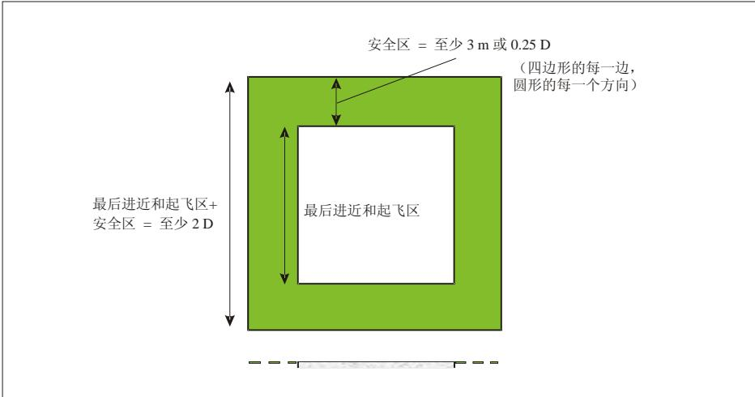

图3-1，最后进近和起飞区和相应的安全区

## 接地和离地区

3.1.14直升机场必须至少提供一个接地和离地区。

3.1.15一个接地和离地区必须位于最后进近和起飞区内，或者一个或多个接地和离地区必须与直升机停机位设在一起。对于跑道类型的最后进近和起飞区，在最后进近和起飞区内设置额外的接地和离地区是可以接受的。

注：更多的指导材料，见《直升机场手册》（Doc9261号文件）。

3.1.16接地和离地区必须有足够的尺寸，以能容纳一个直径至少等于该区域准备为之服务的最大直升机的0.83D的圆。

注：接地和离地区可以是任何形状。

3.1.17接地和离地区必须有足够的坡度，以防止在该区域积水，但在任何方向的坡度不得超过2%。

3.1.18如接地和离地区位于最后进近和起飞区之内，接地和离地区必须动态承重。

3.1.19如接地和离地区与直升机停机位设在一起，接地和离地区必须静态承重并能承受该区准备为之服务的直升机的交通。

3.1.20如一个接地和离地区位于一个能够容纳一个直径大于1D的圆的最后进近和起飞区之内，接地和离地区的中心所处位置距最后进近和起飞区的边缘不得小于0.5D。

## 安全区

3.1.21在最后进近和起飞区周围必须设有一个并非需要密实的安全区。

3.1.22围绕最后进近和起飞区周围的安全区必须从最后进近和起飞区的四周向外延伸至少3m或最后进近和起飞区准备为之服务的最大直升机的0.25D，取较大者，和：

a）最后进近和起飞区为四边形时，安全区的每个外侧边长必须为2D；或

b）最后进近和起飞区为圆形时，安全区的外径必须至少为2D。

（见图3-1)

3.1.23必须有一个受保护的侧坡，自安全区边界呈45°向上向外延伸10米距离，障碍物不得穿透该侧坡的表面；但当障碍物仅位于最后进近和起飞区一侧时，可允许它们穿透该侧坡表面。

注：如果只设置一个进近和爬升面，是否有必要设置特定的受保护的侧坡将在4.2.7中所要求的航空研究中探讨。

3.1.24在安全区内最后进近和起飞区平面上方不充许存在固定物体，但因其功能必须位于该区内的易折物体除外。在直升机运行期间，安全区内不允许有可移动的物体。

3.1.25因其功能必须位于安全区内的物体：

a）如果所处位置距最后进近和起飞区中心不到0.75D，则不得超出位于最后进近和起飞区平面以上5cm高度的平面；和

b）如果所处位置距最后进近和起飞区中心0.75D或以上，则不得超出以最后进近和起飞区平面以上25cm高度为底线、以5%的坡度向上向外倾斜的平面。

3.1.26安全区的表面如属密实，不得超过从最后进近和起飞区的边界向外4%的升坡。

3.1.27适用时，安全区的表面必须加以处理，以防止旋翼下吹产生飘动杂物。

3.1.28与最后进近和起飞区相接的安全区的表面如属密实，必须与最后进近和起飞区的表面相连接。

## 直升机地面滑行道和直升机地面滑行路线

注1：直升机地面滑行道是用以使轮式起落架的直升机在自身动力下进行表面活动。

注2：飞机和直升机准备使用同一条滑行道时，须考虑到飞机滑行道和直升机地面滑行道的规定并采用更严格的要求。

3.1.29直升机地面滑行道的宽度必须不小于直升机地面滑行道准备为之服务的直升机主起落架最大宽度（UCW）的1.5倍（见图3-2)。

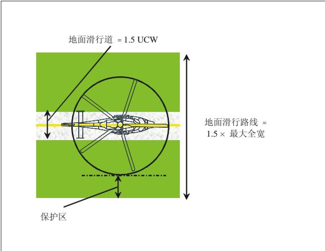

图3-2．直升机地面滑行路线/滑行道

3.1.30直升机地面滑行道的纵坡不得超过3%。

3.1.31直升机地面滑行道必须能静态承重并能承受该直升机地面滑行道准备为之服务的直升机的交通。

3.1.32直升机地面滑行道必须位于地面滑行路线的正中。

3.133直升机地面滑行路线必须从中线对称地向两侧各延展与该直升机地面滑行通道准备为之服务的直升机最大全宽的0.75倍。

注：直升机地面滑行路线从中线对称地向两侧各延展与该直升机地面滑行通道准备为之服务的直升机最大全宽的0.5倍至直升机地面滑行通道最外侧界限的部分是其保护区。

3.1.34直升机地面滑行路线上地表之上不允许存在固定物体，但因其功能必须位于该区内的易折物体除外。在直升机活动期间，地面滑行路线上不允许存在可移动物体。

3.1.35因其功能必须位于直升机地面滑行路线上的物体：

a）所处位置距直升机地面滑行道边缘不得小于50cm；和

b）不得超出以直升机地面滑行道平面以上25cm高度为底线，从距直升机地面滑行道边线50cm处以5%坡度向上向外倾斜的平面。

3.1.36直升机地面滑行道和直升机地面滑行路线必须能迅速排水，但直升机地面滑行道的横坡不得超过2%。

3.1.37直升机地面滑行路线的表面必须能抵抗旋翼下吹的影响。

3.1.38同时运行时，直升机地面滑行路线不得重迭。

## 直升机空中滑行道和直升机空中滑行路线

注：直升机空中滑行道是用以使直升机在地面以上通常与地面效应相联系的高度上并以小于37km/h(20kt）的地速进行活动。

3.1.39直升机空中滑行道的宽度至少必须为该直升机空中滑行道准备为之服务的直升机主起落架最大宽度的2倍。（见图3-3)

3.1.40建议：直升机空中滑行道的表面应该静态承重。

3.1.41建议：直升机空中滑行道表面的坡不应超过直升机空中滑行道准备为之服务的直升机着陆时的坡度限制。在任何情况下，横坡不应超过10%，纵坡不超过7%。

3.1.42直升机空中滑行道必须位于空中滑行路线的正中。

3.1.43直升机空中滑行路线必须从中线对称地向两侧各延展至少与该直升机空中滑行通道准备为之服务的直升机最大全宽相等的距离。

注：直升机空中滑行路线从中线对称地向两侧各延展与该直升机地面滑行通道准备为之服务的直升机最大全宽的0.5倍至直升机地面滑行通道最外侧界限的部分是其保护区。

3.1.44直升机空中滑行路线上地表之上不允许存在固定物体，但因其功能必须位于该区内的易折物体除外。在直升机活动期间，空中滑行路线上不允许存在可移动物体。

3.1.45因其功能必须位于直升机空中滑行路线上的高于地平面的物体：

a)所处位置距直升机空中滑行道的边缘不得小于1m：和

不得超出以直升机滑行道平面以上25cm高度为底线、从距滑行道边线1m处以5%的坡度向上向外倾斜的平面。

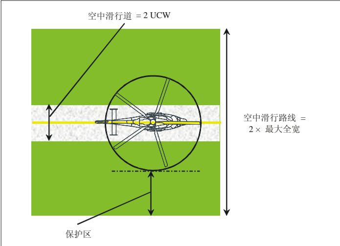

图3-3．直升机空中滑行路线/滑行道

#### 3.1.46 建议：因其功能必须位于直升机空中滑行路线上的高于地平面的物体：

a)所处位置距直升机空中滑行道中线不应小于根据设计可使用该直升机空中滑行路线的直升机最大全宽的0.5倍；和

b)不应超出以直升机滑行道平面以上25cm高度为底线、从距直升机空中滑行道中线的距离等于根据设计可使用该直升机空中滑行路线的直升机最大全宽的0.5倍处以5%的坡度向上向外倾斜的平面。3.1.47直升机空中滑行路线的表面必须能抵抗旋翼下吹的影响。

3.1.48直升机空中滑行路线的表面必须提供地面效应。

3.1.49同时运行时，直升机空中滑行路线不得重迭。

## 直升机停机位

注：本节中的规定没有规定直升机停机位的位置，但允许在直升机场的整体设计中有很高的灵活性。但是，将直升机停机位设在飞行航迹下不被认为是一种好的做法。更多的指导材料，见《直升机场手册》（Doc9261号文件）。

3.1.50当接地和离地区与直升机停机位设在一起时，停机位的保护区不得与任何其他直升机停机位或相应滑行路线的保护区重迭。

3.1.51直升机停机位必须可快速排水，但任何方向的坡度不得超过2%。

注：关于直升机停机位尺寸的要求基于这样一个假设，即直升机将在停机位上空运行时进行悬停转弯。

3.1.52准备供在悬停中转弯的直升机使用的直升机停机位必须有足够的尺寸，使其包含一个直径至少为该停机位准备为之服务的最大直升机1.2D的圆。（见图3-4）

3.1.53如果直升机停机位准备用于滑行穿越，并且如果使用停机位的直升机无需转弯，停机位及相应保护区的最低宽度必须与滑行路线的宽度相同。

3.1.54当直升机停机位准备用于转弯时，停机位及相应保护区的最小尺寸不得小于2D。

3.1.55当直升机停机位准备用于转弯时，周围必须有保护区，该保护区自直升机停机位的边界向外延伸0.4D 的距离。

3.1.56同时运行时，直升机停机位及其相应滑行路线的保护区不得重迭。（见图3-5）

注：如果未计划同时运行，直升机停机位及其相应滑行路线的保护区可以重迭。（见图3-6）

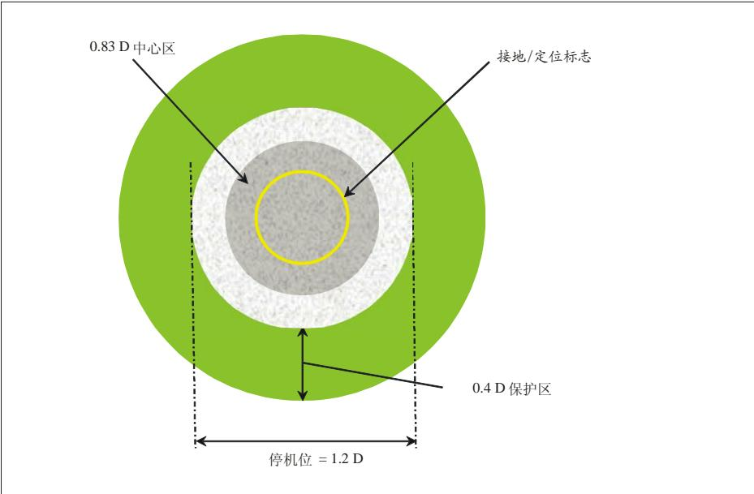

图3-4直升机停机位及相应保护区

3.1.57直升机停机位及相应保护区准备供空中滑行使用时必须提供地面效应。

3.1.58直升机停机位地表之上不允许存在固定物体。

3.1.59在直升机停机位周围的安全区内地表之上不允许有固定物体，但因其功能必须位于该区内的易折物体除外。

3.1.60在直升机活动期间，在直升机停机位和相应的保护区上不允许有可移动物体。

3.1.61因其功能必须位于保护区内的物体：

a)如果所处位置距直升机停机位中心小于0.75D，则不得超出位于中心区平面以上5cm高度的平面；和

如果所处位置距直升机停机位中心0.75D或以上，则不得超出位于中心区平面以上25cm高度，以5%的坡度向上向外倾斜的平面。

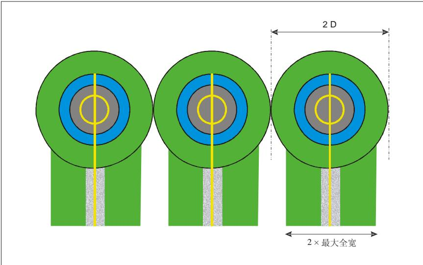

图3-5带空中滑行路线/滑行道的设计用于悬停转弯的

直升机停机位一同时运行

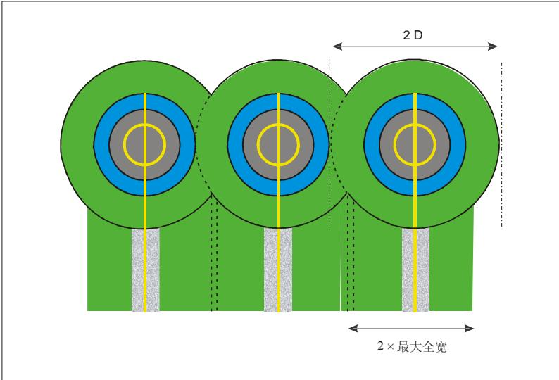

图3-6带空中滑行路线/滑行道的设计用于悬停转弯的直升机停机位一非同时运行

#### 3.1.62 直升机停机位的中心区必须能承受该中心区准备为之服务的直升机交通并有一个下述静态承重区：

a）不小于中心区准备为之服务的最大直升机的0.83D；或

b）直升机停机位准备用于滑行穿越时，以及使用该停机位的直升机无需转弯时，宽度与直升机地面滑行道的宽度相同。

注：直升机停机位准备用于供轮式起落架直升机地面转弯时，直升机停机位的尺寸，包括中心区的尺寸将需要大幅度地扩大。更多的指导材料，见《直升机场手册》（Doc9261号文件）。

## 最后进近和起飞区相对于跑道或滑行道的位置

3.1.63在最后进近和起飞区邻近跑道或滑行道且计划进行同时运行时，跑道或滑行道边缘与最后进近和起飞区边缘之间的间距不得小于表3-1中所列的相应尺寸。

#### 3.1.64 建议：最后进近和起飞区不应：

邻近喷气发动机气流可能产生强湍流的滑行道交叉处或等待位置；或

b）邻近可能存在有机尾涡流的地方。

### 3.2 高架直升机场

注1：滑行路线和直升机停机位的尺寸包括一个保护区。

注2:高架直升机场结构设计的指导材料见《直升机场手册》（Doc9261号文件）。

3.2.1对于高架直升机场，直升机场各个环节设计上的考虑必须考虑到由于人员、积雪、货物、加油和消防设备存在而产生的附加载荷。

表3-1最后进近和起飞区的最小间距

<html><body><table border="1"><tr><td>如果飞机质量和/或直升机质量为</td><td>最后进近和起飞区边线与跑道边线或 滑行道边线之间的距离</td></tr><tr><td><3175 kg</td><td>60 m</td></tr><tr><td>3175kg~<5 760kg</td><td>120 m</td></tr><tr><td>5 760 kg~<100 000 kg</td><td>180 m</td></tr><tr><td>≥100 000 kg</td><td>250 m</td></tr></table></body></html>

## 最后进近和起飞区及接地和离地区

注：在高架直升机场上，假设最后进近和起飞区与一个接地和离地区是相重合的。

3.2.2高架的直升机场必须至少提供一个最后进近和起飞区。

3.2.3最后进近和起飞区必须无障碍物。

#### 3.2.4 最后进近和起飞区的尺寸必须是：

a)当准备供以1级性能运行的直升机使用时，按照直升机飞行手册（HFM）的规定，除了在没有宽度规定的情况下，其宽度必须不小于最后进近和起飞区准备为之服务的最大直升机的1D；

b)当准备供以2级或3级性能运行的直升机使用时，有足够的尺寸和形状，以致能在该区域内画出一个直径不小于以下的圆：

1）最后进近和起飞区准备为之服务的直升机最大起飞质量（MTOM）超过3175kg时，最大直升机的1D;

2)最后进近和起飞区准备为之服务的直升机最大起飞质量为3175kg或小于3175kg时，最大直升机的0.83D。

3.2.5建议：当准备供以2级或3级性能运行的直升机最大起飞质量为3175kg或小于3175kg时，最后进近和起飞区应该有足够的尺寸和形状，以致能在该区域内画出一个直径不小于1D的圆。

注：在确定最后进近和起飞区的尺寸时，需要考虑到标高和温度等当地条件。指导材料见《直升机场手册》（Doc 9261号文件）。

3.2.6高架直升机场的最后进近和起飞区必须有足够的坡度，以防止该区域表面积水，但在任何方向的坡度不得超过2%。

3.2.7最后进近和起飞区必须动态承重。

3.2.8最后进近和起飞区的表面必须：

a)能抵抗旋翼下吹气流的影响；和

b）没有对直升机的起飞或着陆产生不利影响的不平坦现象。

3.2.9建议：最后进近和起飞区必须提供地面效应。

## 直升机净空道

3.2.10设置直升机净空道时，净空道必须位于可用中断起飞区逆风端之外。

3.2.11建议：直升机净空道的宽度应不小于相应安全区的宽度。

3.2.12建议：如属密实，直升机净空道的地面应不突出于3%升坡的一个平面，该平面底边是一条位于最后进近和起飞区周围的水平线。

3.2.13建议：位于直升机净空道上可能对空中的直升机造成危险的物体应被认为是障碍物，应予清除。

## 接地和离地区

3.2.14一个接地和离地区必须与最后进近和起飞区重合。

注：额外的接地和离地区可以和直升机停机位设在一起。

3.2.15与最后进近和起飞区重合的接地和离地区，接地和离地区的尺寸和特性必须与最后进近和起飞区的尺寸和特性相同。

3.2.16当接地和离地区与直升机停机位设在一起时，接地和离地区必须有足够的尺寸，以致能包含一个直径至少为该区域准备为之服务的最大直升机0.83D的圆。

3.2.17与直升机停机位设在一起的接地和离地区必须有足够的坡度，以防止该区域表面积水，但在任何方向的坡度不得超过2%。

3.2.18当接地和离地区与直升机停机位设在一起并准备仅供地面滑行的直升机使用时，接地和离地区必须至少静态承重并能承受该区域准备为之服务的直升机交通。

3.2.19当接地和离地区与直升机停机位设在一起并准备供空中滑行的直升机使用时，接地和离地区必须设有一个动态承重区。

## 安全区

3.2.20在最后进近和起飞区周围必须设有一个并非需要密实的安全区。

3.2.21准备供以1级性能运行的直升机在目视气象条件（VMC）下使用时，围绕最后进近和起飞区的安全区必须从最后进近和起飞区四周向外延伸至少3m的距离或最后进近和起飞区准备为之服务的最大直升机的0.25D，取较大者，和：

a）最后进近和起飞区为四边形时，安全区的每个外侧边长必须至少为2D；或

b）最后进近和起飞区为圆形时，安全区的外径必须至少为2D。

3.2.22准备供以2级和3级性能运行的直升机在目视气象条件（VMC）下使用时，围绕最后进近和起飞区的安全区必须从最后进近和起飞区四周向外延伸至少3m的距离或最后进近和起飞区准备为之服务的最大直升机的0.5D，取较大者，和：

a）最后进近和起飞区为四边形时，安全区的每个外侧边长必须至少为2D；或

b）最后进近和起飞区为圆形时，安全区的外径必须至少为2D。

3.2.23必须有一个受保护的侧坡，自安全区边界呈45°向上向外延伸10米距离，障碍物不得穿透该侧坡的表面；但障碍物仅位于最后进近和起飞区一侧时除外，可允许它们穿透该侧坡表面。

3.2.24在安全区内不允许有固定的物体，但因其功能必须位于该区内的易折物体除外。在直升机运行期间，安全区内不充许有可移动的物体。

3.2.25因其功能必须位于安全区内的物体，当位于最后进近和起飞区的边缘时，其高度不得超过25cm，亦不得超出以最后进近和起飞区边缘25cm高度为底线、从最后进近和起飞区边缘向上向外坡度为5%的平面。

3.2.26建议：如最后进近和起飞区的直径小于1D，因其功能必须位于安全区内的物体，其最高高度不得超过5cm。

3.2.27安全区的表面如属密实，不得超过从最后进近和起飞区的边界向外4%的升坡。

3.2.28适用时，安全区的表面必须加以处理，以防止旋翼下吹产生飘动杂物。

3.2.29与最后进近和起飞区相邻的安全区的表面必须与最后进近和起飞区的表面相连接，并且能够承受该直升机场准备为之服务的直升机，而不致使直升机受到结构损伤。

## 直升机地面滑行道和地面滑行路线

注：下列规范旨在保障直升机机动时同时运行的安全。然而，须对旋翼下吹的风速予以考虑。

3.2.30直升机地面滑行道的宽度必须不小于地面滑行道为之准备服务的直升机主起落架（UCW）最大宽度的2倍。

3.2.31直升机地面滑行道的纵坡不得超过3%。

3.2.32直升机地面滑行道必须能静态承重并能承受该直升机地面滑行道准备为之服务的直升机的交通。

3.2.33直升机地面滑行道必须位于地面滑行路线的正中。

3.2.34直升机地面滑行路线必须从中线对称地向两侧各延展不小于该直升机场准备为之服务的直升机最大全宽的距离。

3.2.35直升机地面滑行路线上不允许存在物体，但因其功能必须位于该区内的易折物体除外。

3.2.36直升机地面滑行道和地面滑行路线必须能迅速排水，但直升机地面滑行道的横坡不得超过2%。

3.2.37直升机地面滑行路线的表面必须能抵抗旋翼下吹的影响。

## 直升机空中滑行道和空中滑行路线

注：直升机空中滑行道是用以使直升机在地面以上通常与地面效应相联系的高度上并以小于37km/h(20kt）的地速进行活动。

3.2.38直升机空中滑行道的宽度至少必须为该空中滑行道准备为之服务的直升机主起落架（UCW）最大宽度的3倍。

3.2.39直升机空中滑行道的表面必须能静态承重。

3.2.40直升机空中滑行道表面的横坡不得超过2%，纵坡不超过7%。在任何情况下，坡度都不应超过空中滑行道准备为之服务的直升机的坡度着陆限制。

3.2.41直升机空中滑行道必须位于空中滑行通道的正中。

3.2.42直升机空中滑行路线必须从中线对称地向两侧各延展至少不小于该直升机场准备为之服务的直升机最大全宽的距离。

3.2.43空中滑行路线上不允许存在物体，但因其功能必须位于该区内的易折物体除外。

3.2.44空中滑行路线的表面必须能抵抗旋翼下吹的影响。

3.2.45空中滑行通道的表面必须提供地面效应。

## 机坪

3.2.46直升机停机位上任何方向的坡度不得超过2%。

3.2.47直升机停机位必须有足够的尺寸，使其包含一个直径至少为该停机位准备为之服务的最大直升机1.2D 的圆。

3.2.48如果直升机停机位被用来滑行穿越，停机位及相应保护区的最低宽度必须与滑行路线的宽度相同。

3.2.49当直升机停机位被用来转弯时，停机位及相应保护区的最小尺寸不得小于2D。

3.2.50当直升机停机位准备用于转弯时，周围必须有保护区，该保护区自直升机停机位的边界向外延展0.4D 的距离。

3.2.51同时运行时，直升机停机位保护区与其相应的滑行路线不得重合。

注：如果未计划同时运行，直升机停机位保护区可以与其相应的滑行路线重合。

3.2.52当准备供轮式起落架直升机地面滑行运行使用时，直升机停机位的尺寸直径必须考虑到停机位准备为之服务的轮式起落架直升机的最小转弯半径。

3.2.53直升机停机位及相应保护区准备供空中滑行使用时必须提供地面效应。

3.2.54直升机停机位及相应保护区不允许存在固定物体。

3.2.55直升机停机位的中心区必须能承受该中心区准备为之服务的直升机交通并有一个下述静态承重区：

a）不小于中心区准备为之服务的最大直升机0.83D的直径；或

b）直升机停机位准备用于地面滑行穿越时，宽度与地面滑行道的宽度相同。

3.2.56准备仅供地面滑行使用的直升机停机位中心区必须能静态承重。

3.2.57准备供空中滑行使用的直升机停机位中心区必须能动态承重。

注：直升机停机位准备用于地面转弯时，中心区的尺寸可能需要扩大。

### 3.3 直升机甲板

注：下列规范适用于位于从事诸如采矿、研究或施工一类活动的结构物上的直升机甲板。船上直升机场的规定见3.4。

## 最后进近和起飞区及接地和离地区

注1：对于具有1D或更大的最后进近和起飞区的直升机甲板，假设最后进近和起飞区与接地和离地区总是占有同样的空间并具有同样的载重特性，从而是相重合的。对于小于1D的直升机甲板，尺寸的减小只适用于具有载重特性的接地和离地区。在这种情况下，最后进近和起飞区仍然是1D，但是超出接地和离地区边缘的部分无需用于直升机载重。可假设最后进近和起飞区与接地和离地区重合。

注2：有关气流方向和湍流、主要风向的风速以及由燃气涡轮发动机排气或火焰辐射热产生的高温对最后进近和起飞区位置的影响，见《直升机场手册》（Doc9261号文件）。

3.3.13.3.14和3.3.15的规范必须适用于2012年1月1日或之后建造的直升机甲板。

3.3.2直升机甲板必须提供一个最后进近和起飞区和一个重合或重叠的接地和离地区。

3.3.3最后进近和起飞区可以是任何形状，但是必须有足够的尺寸以包含一个能容纳直径不小于该直升机甲板准备为之服务的最大直升机1D圆的区域。

3.3.4接地和离地区可以是任何形状，但是必须有足够的尺寸以包含：

a）对于最大起飞质量（MTOM）超过3175kg的直升机，一个能容纳直径不小于该直升机甲板准备为之服务的最大直升机1D圆的区域；和

b)对于最大起飞质量（MTOM）为3175kg或小于3175kg的直升机，一个能容纳直径不小于该直升机甲板准备为之服务的最大直升机0.83D圆的区域。

3.3.5建议：对于最大起飞质量（MTOM）为3175kg或小于3175kg的直升机，接地和离地区必须有足够的尺寸，使其所包含的区域能容纳一个直径不小于该直升机甲板准备为之服务的最大直升机1D圆的区域。

3.3.6直升机甲板的布置必须确保可提供充足、通畅的空隙，照顾到整个最后进近和起飞。

注：关于空隙特性的具体指导材料，见《直升机场手册》（Doc9261号文件)。一般说来，一个充足的空隙将至少为3m，三层或不到三层的低矮的上层建筑除外。

3.3.7建议：最后进近和起飞区的位置应确保尽可能避开可给直升机运行造成不利影响的最后进近和起飞区上方环境效应的影响，包括湍流。

3.3.8接地和离地区必须能动态承重。

3.3.9接地和离地区必须提供地面效应。

3.3.10在接地和离地区的边缘的周围不允许有固定物体，但因其功能必须位于此处的易折物体除外。

3.3.11对于任何设计供直升机之用、D值大于16.0m的接地和离地区，因其功能必须位于接地和离地区边缘的无障碍物扇形区内物体的高度不得超过25cm。

3.3.12对于任何设计供直升机之用、D值为16.0m或以下的接地和离地区，无障碍物扇形区内因其功能必须位于接地和离地区边缘的物体的高度不得超过5cm。

3.3.13对于任何尺寸小于1D的接地和离地区，无障碍物扇形区内因其功能必须位于接地和离地区边缘的此类物体的最大高度不得超过5cm。

注：安装在低于25cm高度的灯具通常要在安装前和安装后对目视信号的充足性进行评估。

3.3.14因其功能必须设在接地和离地区之内的物体（比如灯具或网索）的高度不得超过2.5cm。这些物体只能在不对直升机造成危害时方可存在。

注：潜在危害的范例包括甲板上的网索或突出的装置，它们可能导致装备滑撬的直升机瞬间侧滚翻转。

3.3.15安全网或安全架等安全装置必须安置在直升机甲板的边缘，但不得超过接地和离地区的高度。

3.3.16接地和离地区的表面必须对于直升机和人都是抗滑的，并且有坡度以防积水。

注：有关使接地和离地区的表面抗滑的指导材料载于《直升机场手册》（Doc9261号文件）中。

### 3.4 船上直升机场

3.4.1第3.4.16和3.4.17段中的规范必须适用于分别于2012年1月1日或之后及2015年1月1日或之后建造的船上直升机场。

3.4.2当直升机运行区设置在船头或船尾或者专门建在船体结构之上时，它们必须被视为专门建造的船上直升机场。

## 最后进近和起飞区及接地和离地区

注：除了在3.4.8b)段中所述的布置外，对于船上直升机场，假设最后进近和起飞区及接地和离地区是相重合的。有关气流方向和湍流、主要风向的风速以及由燃气涡轮发动机排气或火焰辐射热产生的高温对最后进近和起飞区位置的影响，见《直升机场手册》（Doc9261号文件）。

3.4.3船上直升机场必须设有一个最后进近和起飞区和一个重合或重叠的接地和离地区。

3.4.4最后进近和起飞区可以是任何形状，但是必须有足够的尺寸以包含一个能容纳直径不小于该直升机甲板准备为之服务的最大直升机1D圆的区域。

3.4.5船上直升机场的接地和离地区必须能动态承重。

3.4.6船上直升机场的接地和离地区必须提供地面效应。

3.4.7对于不设在船头或船尾的专门建造的船上直升机场，接地和离地区必须有足够的尺寸，使其能包含一个直径不小于该船上直升机场准备为之服务的最大直升机1D的圆。

3.4.8对于设在船头或船尾的专门建造的船上直升机场，接地和离地区必须有足够的尺寸以便：

a）包含一个直径不小于该船上直升机场准备为之服务的最大直升机1.0D的圆；或

b）对于限制接地方向的运行，包含一个能够容纳圆的两个对立弧形的区域，其直径在直升机纵向方向上不小于1D。直升机场的最小宽度不得小于0.83D。（见图3-7）

注1：需要操纵船舶以保证相对风与直升机接地方位的方向相对应。

注2：直升机接地方位限制为1D弧方位所对的角度距离，弧的每一端缩进与15度对应的角度距离。

3.4.9对于非专门建造的船上直升机场，接地和离地区必须有足够的尺寸，使其能包含一个直径不小于该船上直升机场准备为之服务的最大直升机1D的圆。

3.4.10船上直升机场的布置必须确保可提供充足、通畅的空隙，并照顾到整个最后进近和起飞区。

注：关于空隙特性的具体指导材料，见《直升机场手册》（Doc9261号文件)。一般说来，除了三层或不到三层的低矮上层建筑的空隙之外，一个充足的空隙将至少为3m。

3.4.11建议：最后进近和起飞区的位置应确保尽可能避开可给直升机运行造成不利影响的最后进近和起飞区上方环境效应的影响，包括湍流。

3.4.12在接地和离地区边界的周围不充许有固定物体，但因其功能必须位于此处的易折物体除外。

3.4.13对于任何设计供直升机之用、D值大于16.0m的接地和离地区，因其功能必须位于无障碍物扇形区内靠近接地和离地区边缘的物体的高度不得超过25cm。

3.4.14对于任何设计供直升机之用、D值为16.0m或以下的接地和离地区，因其功能必须位于无障碍物扇形区内靠近接地和离地区边缘的物体的高度不得超过5cm。

3.4.15对于任何尺寸小于1D的接地和离地区，因其功能必须位于无障碍物扇形区内靠近接地和离地区边缘的此类物体的最大高度不得超过5cm。

注：安装在低于25cm高度的灯具通常要在安装前和安装后对目视信号的充足性进行评估。

3.4.16因其功能必须设在接地和离地区之内的物体（比如灯具或网）的高度不得超过2.5cm。这些物体只能在不对直升机造成危害时方可存在。

3.4.17除非有结构保护，否则必须在船上直升机场边缘周围安装安全网或安全架等安全装置，但不得超过接地和离地区的高度。

3.4.18接地和离地区的表面必须对直升机和人员都是抗滑的。

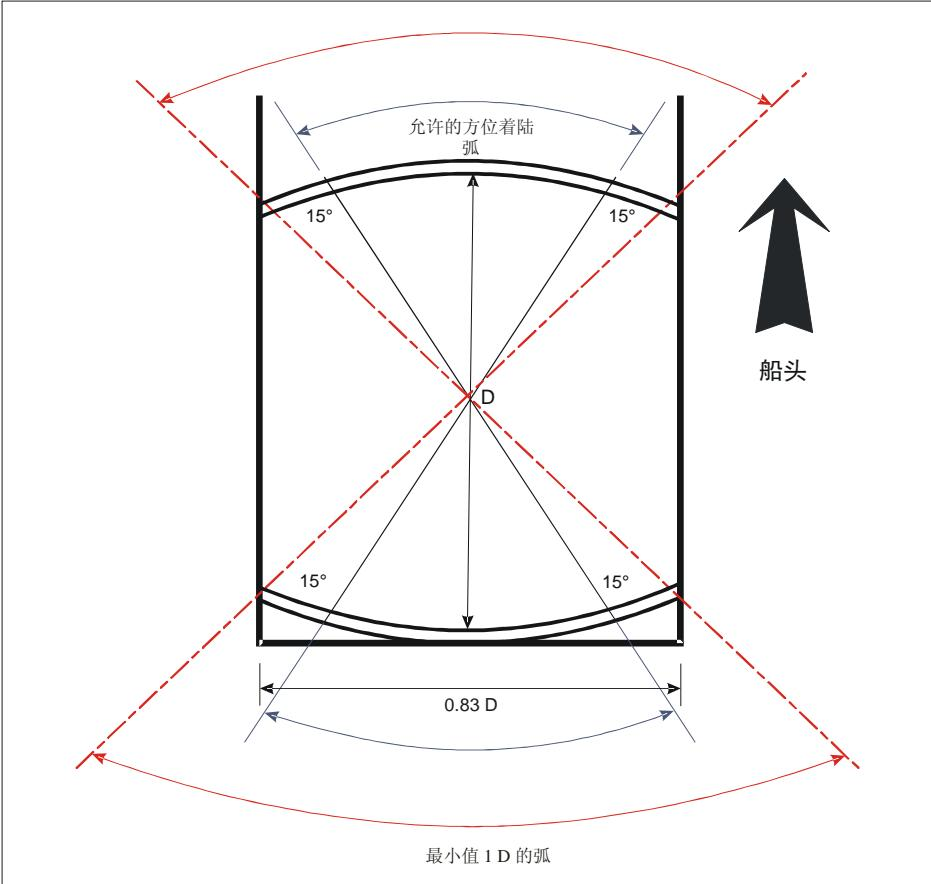

图3-7船上限制方位运行的可允许着陆方位

## 第4章障碍物环境

注：本章中各规范的目的是描述直升机场周围的空域，使预定的直升机运行能安全进行，并在存在适当的国家管控时，防止因机场周围障碍物增多而使直升机场无法使用。其办法是规定一系列障碍物限制面，用以规定物体可以突出空域的限制。

### 4.1 障碍物限制面和扇形区

## 进近面

4.1.1说明一个倾斜的平面或者几个平面的组合或涉及转弯情况下的一个复合面，从安全区的端部以斜坡向上，并以通过最后进近和起飞区的中心的直线为中心。

注：关于表面的说明，见图4-1、4-2、4-3和4-4。表面的尺寸和坡度，见表4-1。

4.1.2特性进近面的界限必须由下列各边组成：

心线并位于安全区外边上；

b)两条侧边：以内边的两端为起点并且从包含最后进近和起飞区的中心线的垂直面按规定的比率均匀地向外散开；和

c）一条外边：水平，垂直于进近面的中心线，位于最后进近和起飞区标高以上152m(500 ft）这样一个规定高度。

4.1.3内边的标高必须是最后进近和起飞区在内边与进近面中心线的交点处的标高。对于准备供1类性能直升机使用的直升机场，经主管当局批准，可直接增高最后进近和起飞区上方的倾斜面的起点。

4.1.4进近面的坡度必须在包含该面中心线的垂直面内度量。

4.1.5在带有转弯的进近面的情况下，则该进近面必须是一个复合面，其中包含一个与其中线垂直的水平面，该中线的坡度必须与直线进近面的坡度相同。

注：见图4-5。

4.1.6在带有转弯的进近面的情况下，则该进近面所包括的曲线段不得多于一个。

4.1.7如果进近面设有曲线段，则界定进近面中线的圆弧的半径与以内边为起点的直线段的长度之和不得小于575m。

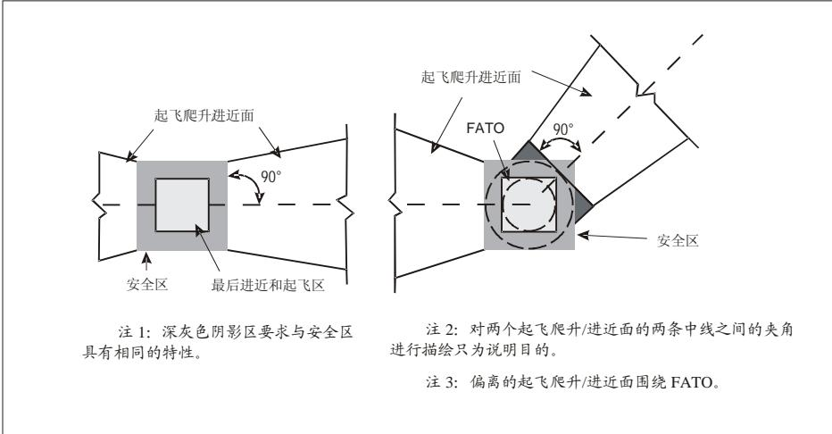

图4-1障碍物限制面一起飞爬升和进近面

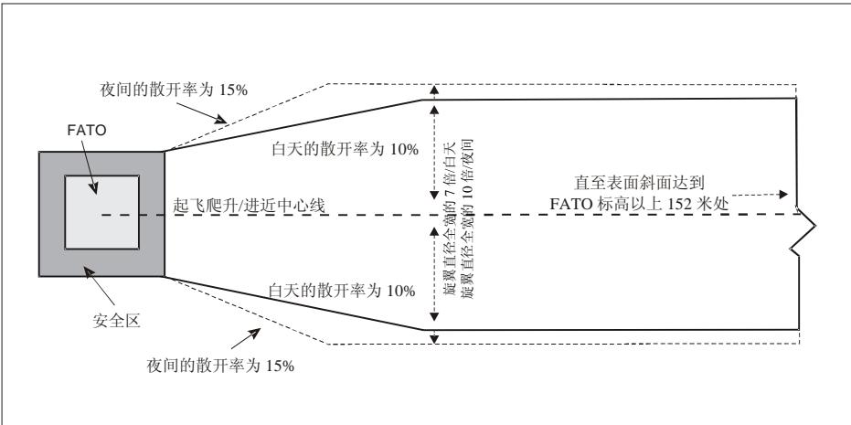

图4-2起飞爬升/进近面宽度

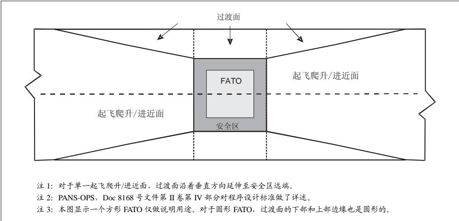

图4-3采用有目视航段面的PinS进近程序的FATO过渡面

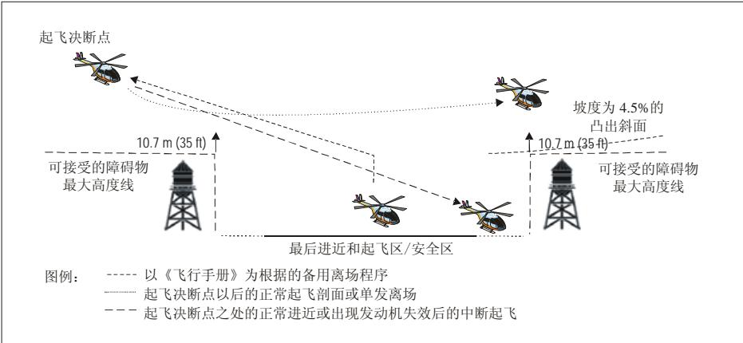

图4-4以1级性能运行期间凸出斜面的示例

注1：这一例图并没有反映任何具体的剖面、技术或直升机类型，意在显示的只是一个一般性例子。它对一个进近剖面和一个离场剖面备用程序做了描述。在具体的《直升机飞行手册》中，可能会以不同的方式表述各制造商生产的直升机以1级性能进行的具体运行。附件6第3部分附篇A中载有可能对以1级性能运行有用的备用程序。

注2：进近/着陆剖面可能并不与起飞剖面正好相反。

注3：在准备使用备用程序的区域，可能需要做额外的障碍物评估。直升机性能和《直升机飞行手册》中的限制将决定所需评估的范围。

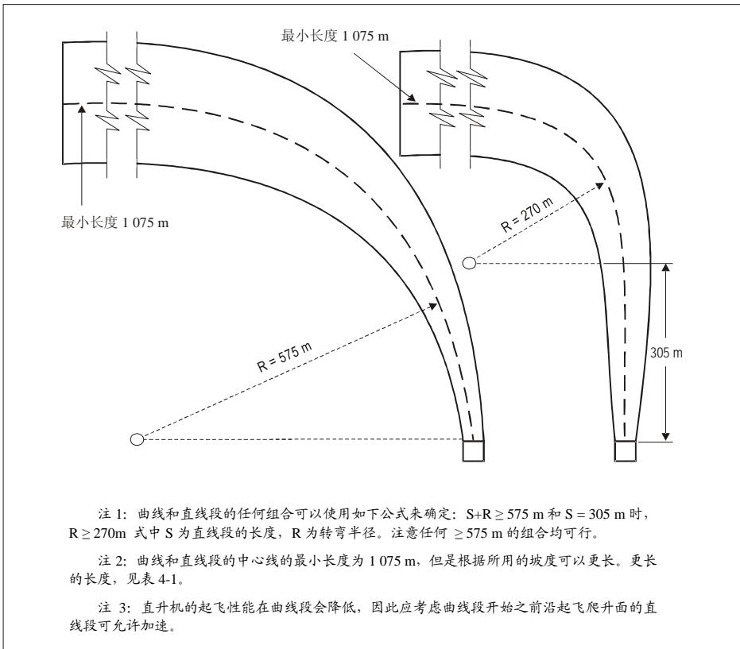

图4-5所有FATO的曲线进近和爬升面

表4-1所有目视最后进近和

起飞区的障碍物限制面的尺寸和坡度

<html><body><table border="1"><tr><td rowspan="2">表面和尺寸</td><td colspan="3">设计坡度类别</td></tr><tr><td>A</td><td>B</td><td>C</td></tr><tr><td>进近和起飞爬升面：</td><td></td><td></td><td></td></tr><tr><td>内边长度</td><td>安全区的宽度</td><td>安全区的宽度</td><td>安全区的宽度</td></tr><tr><td>内边位置</td><td>安全区的边界（如设有净 空道，则为净空道的边界）</td><td>安全区的边界</td><td>安全区的边界</td></tr><tr><td>散开率：（第一和第二航段）</td><td></td><td></td><td></td></tr><tr><td>仅白天使用</td><td>10%</td><td>10%</td><td>10%</td></tr><tr><td>夜间使用</td><td>15%</td><td>15%</td><td>15%</td></tr><tr><td>第一航段</td><td></td><td></td><td></td></tr><tr><td>长度 坡度</td><td>3386 m</td><td>245m</td><td>1220 m</td></tr><tr><td></td><td>4.5% (1:22.2)</td><td>8% (1:12.5)</td><td>12.5% (1:8)</td></tr><tr><td>外侧宽度</td><td>(b)</td><td>N/A</td><td>(b)</td></tr><tr><td>第二航段</td><td></td><td></td><td></td></tr><tr><td>长度</td><td>N/A</td><td>830m</td><td>N/A</td></tr><tr><td>坡度</td><td>N/A</td><td>16% (1:6.25)</td><td>N/A</td></tr><tr><td>外侧宽度</td><td>N/A</td><td>(b)</td><td>N/A</td></tr><tr><td>距内边的总长度 (a)</td><td>3386 m</td><td>1075 m</td><td>1220 m</td></tr><tr><td>过渡面：（采用有目视航段面的PinS 进近的最后进近和起飞区）</td><td></td><td></td><td></td></tr><tr><td>坡度</td><td>50%</td><td>50%</td><td>50%</td></tr><tr><td></td><td>(1:2)</td><td>(1:2)</td><td>(1:2)</td></tr><tr><td>高度</td><td>45m</td><td>45 m</td><td>45m</td></tr></table></body></html>

a)与各自坡度相关的3386m、1075m和1220m的进近和起飞爬升面长度使直升机上升到最后进近和起飞区标高以上152m(500ft)。

b）白天飞行，全宽为旋翼直径的7倍，夜间飞行，全宽为旋翼直径的10倍。

注：表4-1中的坡度类别可能不仅限于某一具体的运行性能级别，并可以适用于一种以上的运行性能级别。表4-1中的坡度类别代表最小的设计坡度角而非运行坡度。坡度类别“A”一般与以1级性能运行的直升机对应；坡度类别“B”一般与以3级性能运行的直升机对应；坡度类别“C”一般与以2级性能运行的直升机对应；与直升机运营人进行协商将有助于根据直升机场环境和直升机场所服务的最关键的直升机机型来确定适用的相关坡度类型。

c)进近和起飞爬升面—“C”坡度剖面一一般为12.5%

图4-6不同坡度设计类别的进近和起飞爬升面。

4.1.8进近面中线方向的任何变动其设计必须确保不需要半径小于270m的转弯。

注：对于准备供2类性能和3类性能直升机使用的直升机场，一个好的做法是对进近航道进行选择，以便能够进行安全迫降或在一发失效的情况下着陆，从而作为一项最低限度要求使对地面或水面上的人员造成的伤害或对财产造成的损失减至最小。直升机场所服务的最关键的直升机机型和环境条件可能是确定这种区域适用性的因素。

## 过渡面

注：对不采用包括目视航段面（VSS）的PinS进近的直升机场的最后进近和起飞区，不要求提供过渡面。

4.1.9说明沿着安全区边缘和部分进近/起飞爬升面边缘向上和向外倾斜到45m(150ft）这一预定高度的一个复合面。

注：见图4-3。关于表面的尺寸和坡度的说明，见表4-1。

4.1.10特性过渡面的界限必须由下列各边组成：

a）一条底边：从进近/起飞爬升面侧边与底边以上一个指定高度的点开始，沿进近/起飞爬升面的侧边向下延伸至进近/起飞爬升面内边，再从该处沿安全区边缘全长，与最后进近和起飞区中心线平行：和

b）一条顶边：位于表4-1中规定的底边以上的一个指定高度上。

4.1.11底边上一点的标高必须是：

a）沿进近/起飞爬升面的侧边—等于该点所在进近/起飞爬升面的标高；

b）沿安全区一等于进近/起飞爬升面内边的标高。

注1：如果经主管当局批准增高进近/起飞爬升面倾斜面的起点，则过渡面起点的标高也要相应提高。

注2：由于b）的规定，如果最后进近和起飞区的纵断面是曲线，则沿安全区的过渡面将是一个曲面；如果最后进近和起飞区的纵断面是直线，则该过渡面将是一个平面。

4.1.12过渡面的坡度必须在与最后进近和起飞区中心线成直角的一个垂直面内度量。

## 起飞爬升面

4.1.13说明从安全区端部起向上倾斜并且以通过最后进近和起飞区中心的一条线为中心的一个倾斜平面或平面组合，或当涉及转弯时是一个复合面。

注：关于表面的说明，见图4-1、4-2、4-3和4-4。关于表面的尺寸和坡度的说明，见表4-1。

4.1.14特性起飞爬升面的界限必须由以下各边组成：

a)一条内边：水平，长度等于最后进近和起飞区的最小规定宽度/直径加上安全区、垂直于起飞爬升面的中线并位于安全区外边；

b)两条侧边：以内边的两端为起点、按规定的比率均匀地从包含最后进近和起飞区中线的垂直面向外散开；

c）一条外边：水平，垂直于起飞爬升面的中线、位于高出最后进近和起飞区标高152m(500 ft)这样一个规定高度。

4.1.15内边的标高必须等于最后进近和起飞区在内边与起飞爬升面中线交点处的标高。对于准备供1类性能直升机使用的直升机场，经主管当局批准，可直接增高最后进近和起飞区上方倾斜面的起点。

4.1.16如果设置净空道，起飞爬升面内边的标高必须为净空道外边基于净空道中线的地面最高点。

4.1.17在直线起飞爬升面的情况下，其坡度必须在包含该面中线的垂直面内进行度量。

4.1.18在带有转弯的起飞爬升面的情况下，则起飞爬升面必须是包含对其中线的水平法线的一个复合面，该中线的坡度必须与直线起飞爬升面的坡度相同。

注：见图4-5。

4.1.19在带有转弯的起飞爬升面的情况下，则该起飞爬升面所包括的曲线段不得多于一个。

4.1.20如果起飞爬升面有曲线段，则界定起飞爬升面中线的这个圆弧的半径与以内边为起点的直线段的长度之和不得小于575m。

4.1.21起飞爬升面的中线方向的任何变动其设计必须确保不需要半径小于270m的转弯。

注1：直升机的起飞性能在曲线段会降低，因此在曲线段开始之前沿起飞爬升面的直线段允许加速。

注2：对干准备供2类性能和3类性能直升机使用的直升机场，一个好的做法是对离场航线进行选择，以便能够进行安全迫降或在一发失效的情况下着陆，从而作为一项最低限度要求使对地面或水面上的人员造成的伤害或对财产造成的损失减至最小。直升机场所服务的最关键的直升机机型和环境条件可能是决定这种区域适用性的因素。

## 无障碍物扇形区/面一直升机甲板

4.1.22说明从直升机甲板最后进近和起飞区边界的一个参考点起延伸并延展的一个复合面。如接地和离地区小于1D时，参考点距接地和离地区中心不得小于0.5D。

4.1.23特性无障碍物扇形区/面必须对着一个规定角度的弧。

4.1.24直升机甲板无障碍物扇形区必须由两部分组成，一部分位于直升机甲板平面之上，一部分位于直升机甲板平面之下：

注：见图4-7。

a）直升机甲板水平面之上：该面必须是其标高与直升机甲板表面标高一致的一个水平面，对着一个至少为210°的弧，其顶点在D圆的周边上，并向外延伸至与直升机甲板准备为之服务的直升机无障碍离场航迹相适应的距离。

b）直升机甲板水平面之下：（在至少）210°弧之内，该表面必须从最后进近和起飞区边界再向下延伸至少180°的弧，低于直升机甲板标高至水面，该表面穿过最后进近和起飞区中心向外延伸至直升机甲板准备为之服务的直升机机型一发失效时能安全飞越直升机甲板下方障碍物的距离。

注：对于以1级或2级性能运行的直升机的无障碍物扇形区，距直升机甲板距离的水平范围必须是与使用的直升机机型一发不工作能力相适应的距离。

## 障碍物限制扇形面—直升机甲板

注：障碍物如需要设在构筑物上时，直升机甲板可以有一个障碍物限制扇形区（LOS）。

4.1.25说明从无障碍物扇形区的参考点起、通过未被无障碍物扇形区覆盖的弧向外延伸的一个复合面，在该复合面内将对高出接地和离地区水平面的障碍物的高度加以规定。

4.1.26特性障碍物限制扇形区不得对着超过150°的弧。与接地和离地区重合的1D最后进近和起飞区及0.83D 接地和离地区的障碍物限制扇形区的尺寸和位置必须分别如图4-8和图4-9所示。

### 4.2 障碍物限制要求

注1：障碍物限制面的要求是根据拟如何使用最后进近和起飞区，即进近飞行至悬停或着陆，或起飞飞行以及进近的类型来规定的，并拟在最后进近和起飞区按所述情况使用时适用该要求。在要从最后进近和起飞区的两个方向运行的情况下，则某些限制面的作用可能由于有另一个更低面的更为严格的要求而变得无用。

注2：如果安装了目视进近坡度指示器（VASI），则有更多的在第5章中详述的障碍物保护面需要加以考虑，并且它们比表4-1中规定的障碍物限制面更严格。

## 表面直升机场

4.2.1采用了使用目视航段面的PinS进近程序的直升机场的最后进近和起飞区必须设置下列障碍物限制面：

a)起飞爬升面；

b）进近面；和

c）过渡面。

注1：见图4-3。

注2：《空中航行服务程序一航空器运营》（PANS-OPS，Doc8168号文件）第Ⅱ卷第IV部分一直升机，进一步详述了程序设计标准。

4.2.2除4.2.1中规定的障碍物限制面之外，直升机场，包括采用了不提供目视航段面的PinS进近程序的直升机场的最后进近和起飞区还必须设置下列障碍物限制面：

a）起飞爬升面；和

b)进近面。

4.2.3障碍物限制面的坡度不得大于、而它们的其他尺寸不得小于表4-1中的规定，并且其所处位置必须如图4-1、4-2和4-6所示。

4.2.4对于进近/起飞爬升面设计为4.5%坡度的直升机场，如果经主管当局批准的航空研究已对相关风险和环境措施进行了审查，则必须允许物体超出障碍物限制面。

注1：所确定的物体可能会限制直升机场的运行

注2：附件6第3部分中载有可能会有助于确定障碍物超出范围的程序。

4.2.5新物体或现有物体的扩展不充许高出4.2.1和4.2.2中所规定的任何限制面，除非被一个已经存在的不能移去的物体所遮蔽，或在进行经主管当局批准的航空研究后，确定该物体将不会使飞行安全受到不良影响或严重地影响直升机飞行的正常性。

注：关于可以合理地运用遮蔽原则的情况，见《机场服务手册》（Doc9137号文件）第6部分。

4.2.6建议：高于4.2.1和4.2.2所规定的任何限制面的现有物体，应尽实际可行地予以移去；除非该物体已被一个现存的不能移去的物体所遮蔽，或在进行经主管当局批准的航空研究后，确定该物体不会使飞行安全受到不良影响或严重地影响直升机飞行的正常性。

注：应用4.1.5或4.1.18中所规定的弯曲的进近或起飞爬升面可以减轻这些超出限制面的物体所造成的问题。

4.2.7表面直升机场必须至少有一个进近和起飞爬升面。如果只提供一个单一的进近和起飞爬升面，则主管当局必须开展一项航空研究，研究至少要考虑如下因素：

a）飞行路线下方的区域/地形；

b）直升机场周围的障碍物环境；

c)准备使用直升机场的直升机的性能和运行限制；和

d)包括盛行风在内的当地气象条件。

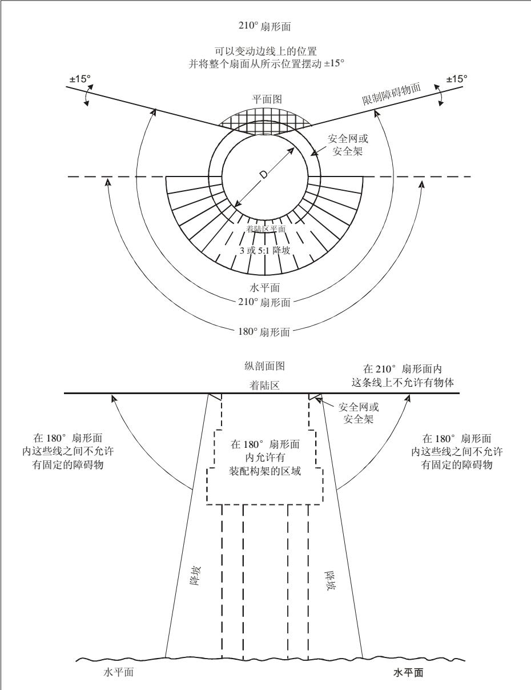

图4-7直升机甲板无障碍物扇形区

图4-81D和更大的最后进近和起飞区重合接地和离地区的直升机甲板无障碍物扇形区和面

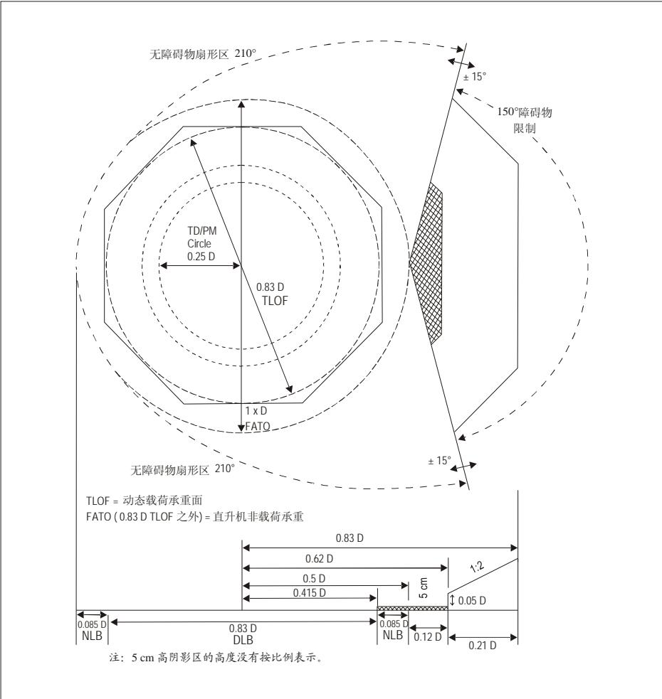

图4-90.83D和更大的接地和离地区的直升机

甲板无障碍物扇形区和面

4.2.8建议：表面直升机场至少应有两个进近和起飞爬升面以避免顺风情况，最大限度减少侧风情况和允许中断着陆。

注：指导材料，见《直升机场手册》（Doc9261号文件）。

## 高架直升机场

4.2.9高架直升机场的障碍物限制面必须符合4.2.1至4.2.6中所规定的对表面直升机场的要求。

4.2.10高架直升机场必须至少有一个进近和起飞爬升面。如果只提供一个单一的进近和起飞爬升面，则主管当局必须开展一项航空研究，研究至少要考虑如下因素：

a)飞行路线下方的区域/地形；

b 直升机场周围的障碍物环境；

c 准备使用直升机场的直升机的性能和运行限制；和

d）包括盛行风在内的当地气象条件。

4.2.11建议：高架直升机场至少应有两个进近和起飞爬升面以避免顺风情况，最大限度减少侧风情况和允许中断着陆。

注：指导材料，见《直升机场手册》（Doc9261号文件）。

## 直升机甲板

4.2.12直升机甲板必须有无障碍物扇形区。

注：直升机甲板可以有一个障碍物限制扇形区（见4.1.26）。

4.2.13在无障碍物扇形区内不允许有高出无障碍物面的固定物体。

4.2.14紧邻直升机甲板的地区，在直升机甲板水平面以下必须为直升机提供障碍物保护。这个保护面必须以最后进近和起飞区中心为起点，延伸至少180°的弧，并在180°扇形区内从最后进近和起飞区的边界起有一个以水平1与垂直5比率的向下坡度。对于以1级或2级性能运行的多发直升机，在180°扇形区内，向下坡度可以降低为水平1单位对垂直3单位的比率。（见图4-7）

注：如果要求在海平面部署一艘或多艘对固定或浮式近海设施的运行必不可少，但却位于固定或浮式近海设施附近的近海支援船（如备用船），则任何近海支援船都需要部署在不危及直升机在起飞离场和/或进近着陆期间运行安全的位置。

4.2.15对于1D和更大的接地和离地区，在150°障碍物限制面/扇形区内，在从障碍物限制扇形区起点量起向外延伸0.12D的距离内，物体超出接地和离地区的高度不得大于25cm。超过该弧，在从第一个扇区的端部量起向外进一步延伸0.21D的总距离内，障碍物限制面从接地和离地区水平面以上0.05D高度开始，以水平方向每上升1个单位垂直方向上升2个单位的比率上升。（见图4-8）

注：如果接地和离地区边界标志所包围区域不是圆形，则障碍物限制扇形区各扇区的范围表示为与接地和离地区的边界平行的直线而非弧线。图4-8是基于直升机甲板的布局为八角形这样一个假设绘制而成的。更多关于最后进近和起飞区及接地和离地区的正方形（四边形）和圆形布置的指导材料，见《直升机手册》（Doc9261号文件）。

4.2.16对于小于1D的接地和离地区，在150°障碍物限制面/扇形区内，在从接地和离地区的中心量起的0.5D 处开始至从该中心量起向外延伸0.62D的距离内，物体超出接地和离地区的高度不得大于5cm。在超过该弧向外延伸至距接地和离地区的中心0.83D的总距离内，障碍物限制面从接地和离地区水平面以上0.05D高度开始，以水平方向每1个单位垂直方向2个单位的比率上升（见图4-9）。

注：如果接地和离地区边界标志所包围区域不是圆形，则障碍物限制扇形区各扇区的范围表示为与接地和离地区的边界平行的直线而非弧线。图4-9是基于直升机甲板的布置为八角形这样一个假设绘制而成的。更多关于最后进近和起飞区及接地和离地区的正方形（四边形）和圆形布置的指导材料，见《直升机手册》（Doc9261号文件）。

## 船上直升机场

4.2.17第4.2.20和第4.2.22中的规范必须适用于2012年1月1日或之后建造的船上直升机场。

位于船前或船后专门建造的直升机场

4.2.18当直升机运行区设置在船头或船尾时，必须适用有关直升机甲板的障碍物准则。

船中位置一专门建造或非专门建造的

4.2.191D及更大的接地和离地区的前后必须有两个对称设置的扇形区，每个对着150°的弧，其顶点在接地和离地区的周边上。被这两个扇形区所包围的区域内不得有高出接地和离地区水平面的物体，但那些为直升机安全运行所必需的助航设备除外，其最大高度为25cm。

4.2.20因其功能必须位于接地和离地区内的物体（比如灯具或网索），其高度不得超过2.5cm。这些物体只能在不对直升机造成危害时方可存在。

注：潜在危害的范例包括网索或突出甲板之上的装置，它们可能导致装备有滑撬的直升机侧滚翻转。

4.2.21为了对接地和离地区前后的障碍物提供进一步保护，必须从两个150°扇形区的边界全长上延伸一个坡度为垂直1与水平5比率的上升平面。这些平面必须延伸至少等于接地和离地区准备为之服务的最大直升机1D的水平距离，并不得被任何障碍物超出。（见图4-10）

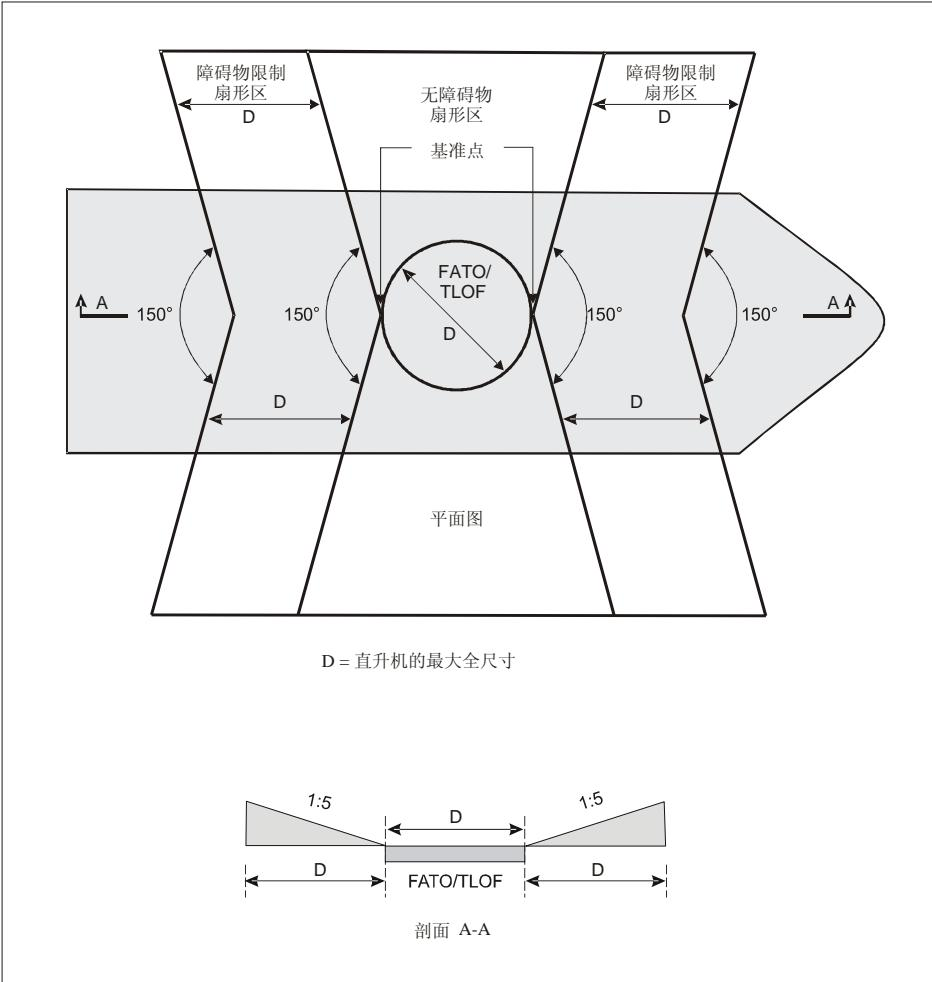

图4-10船中部位置一船上直升机场的障碍物限制面

非专门建造的直升机场

船边位置

4.2.22接地和离地区内不得有任何物体，但那些为直升机安全运行所必需的助航设备（比如网索或灯具)除外，其最大高度为2.5cm。这些物体只能在不对直升机造成危害时方可存在。

4.2.23障碍物限制区必须从D圆的前后两个中点开始，在位于该圆以外的两个区段内向船围栏方向延伸至前后距离达到接地和离地区从前到后尺寸的1.5倍处，对称于与船中线垂直的D圆平分线。在这些区域内，不得有高出接地和离地区水平面以上最大高度为25cm的物体。（见图4-11）此类物体只能在不对直升机造成危害时方可存在。

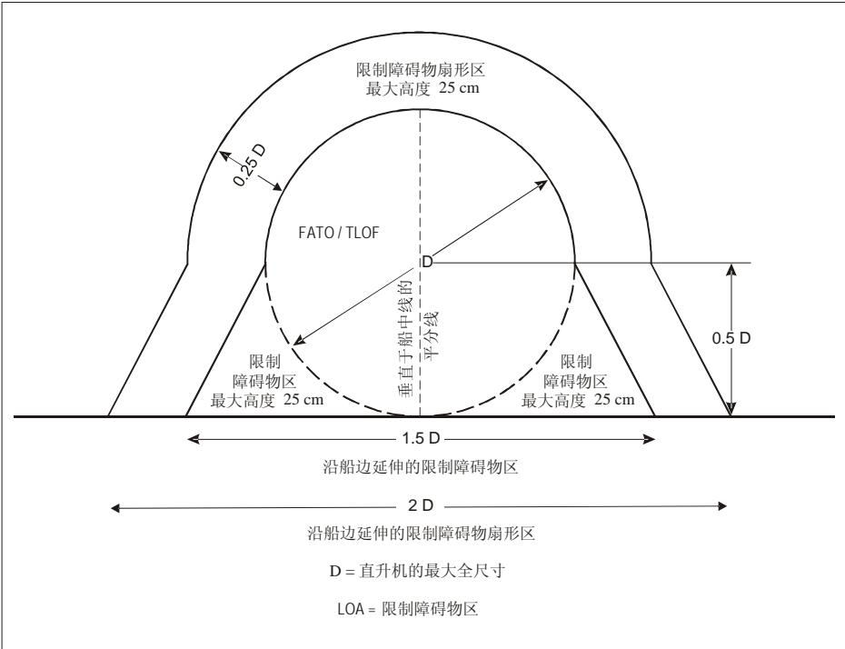

图4-11船边非专门建造的直升机场的障碍物限制扇形区和面

4.2.24必须设置一个将接地和离地区内侧直至D圆前后两个中点包围起来的障碍物限制扇形区水平面，其宽度至少为超出D圆直径以外0.25D。该障碍物限制扇形区必须继续向船围栏方向延伸，接地和离地区从前到后尺寸的2.0倍处，对称于与船中线垂直的D圆平分线。在这个扇形区内，不得有物体超出接地和离地区水平面以上25cm的最大高度。

注：位于4.2.23和4.2.24中所述区域内其高度超出接地和离地区高度的任何物体都要通报给使用船上直升机着陆区计划的直升机运营人。出于通报目的，可能有必要考虑超出4.2.24中所规定的表面限制的不可移动的物体，尤其是在物体大大高出25cm且非常接近障碍物限制扇形区的边界时。指导材料，见《直升机场手册》（Doc9261号文件)。

起货机作业区

4.2.25为船上起货机作业划定的区域必须由一个直径5m的圆形净空带，并从净空带周边向外延伸形成一个直径2D同心轴的作业区组成。（见图4-12）

4.2.26作业区必须由两个区域组成：

a）从净空带周边向外延伸、直径不小于1.5D圆的内作业区；和

b）从内作业区边界向外延伸、直径不小于2D圆的外作业区。

4.2.27划定的起货机作业区净空带内不允许有高出其表面水平面的物体。

4.2.28设在划定为起货机作业区内的物体的高度不得超过3m。

4.2.29设在划定为起货机作业区外的物体的高度不得超过6m。

注：指导材料，见《直升机场手册》（Doc9261号文件）。

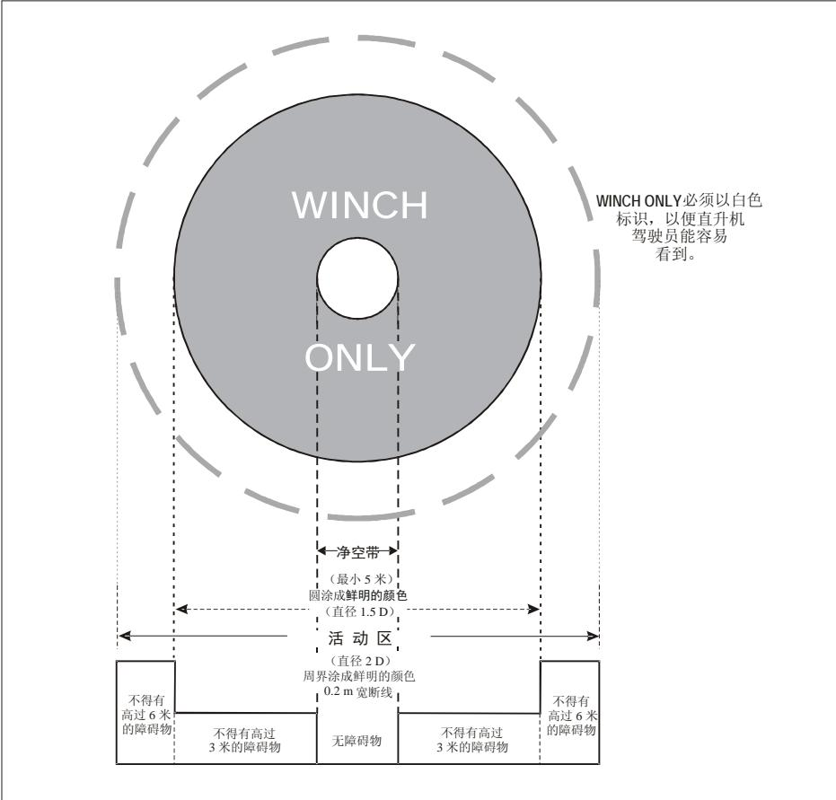

图4-12．船舶起货机作业区

## 第5章目视助航设备

注1：一些直升机所使用的程序要求它们使用与定翼航空器所用跑道具有类似形状特征的最后进近和起飞区。就本章而言，与跑道具有类似形状特征的最后进近和起飞区被认为符合“跑道型最后进近和起飞区”的概念。对于此类布置，有时有必要设置具体的标志，以使驾驶员能够在进近期间辨别出跑道类型最后进近和起飞区。适当的标志载于题为“跑道型最后进近和起飞区”的分节中。适用于所有其他类型最后进近和起飞区的要求载于题为“除跑道型最后进近和起飞区之外的所有最后进近和起飞区”的分节中。

注2：已发现，在浅颜色表面上，白色和黄色标志的鲜明性能够通过用黑色勾出轮廓得到加强。

注3：关于对直升机场表面标示最大允许质量（5.2.3）和D一值（5.2.4），以及在需要时标示实际的最后进近和起飞区尺寸（5.2.5)，以避免使用公制单位的标志和使用英制单位的标志产生混淆的指导材料，见《直升机场手册》（Doc9261号文件）。

注4：对于位于船边的非专门建造的直升机场，主甲板的表面颜色可以因船而异，因此，在直升机场着色方案的颜色选取中，可能需要在某种程度上自行决定；目的是确保标志相对船只表面和运行背景来说是醒目的。

### 5.1 指示标

#### 5.1.1 风向标

应用

5.1.1.1直升机场必须至少设置一个风向标。

位置

5.1.1.2风向标的位置设置必须能指示最后进近和起飞区和接地和离地区上空风的情况，并且不受附近物体或旋翼下吹引起的气流干扰的影响。它必须能被从飞行中、悬停中或在活动区上的直升机看到。

5.1.1.3建议：在接地和离地区和/或最后进近和起飞区易受扰动气流影响时，应在该区附近设置附加的风向标以指示该区的地面风。

注：有关风向标位置的指导材料，见《直升机场手册》（Doc9261号文件）。

特性

5.1.1.4风向标必须装置得能对风的方向作出明确的指示，对风速作出一般的指示。

附件14一第Ⅱ卷

5.1.1.5建议：风向标应用轻质纺织品做成截头的圆锥形，并具有下列最小尺寸：

表面直升机场

高架直升机场和直升机甲板

长度2.4m 1.2 m 

直径（较大端）0.6 m 0.3m 

直径（较小端）0.3 m 0.15m 

5.1.1.6建议：风向标的颜色应选择得使驾驶员从高出直升机场至少200m(650ft）的高度上，在地面背景的衬托下能清楚地看到并理解其指示。在实际可行时，应用单色，以白色或橙色为宜。为了在有变化的背景下使其足够明显而需用两种颜色的组合时，应以选用橙色与白色、红色与白色或黑色与白色为好，并应安排成五个相间的环带，第一个和末一个环带用较深色。

5.1.1.7准备在夜间使用的直升机场，风向标必须被照明。

### 5.2 标志和标志物

注：见附件14第I卷5.2.1.4中关于改善标志的明显性的注1。

#### 5.2.1 起货机作业区标志

应用

5.2.1.1在划定的起货机作业区必须设置起货机作业区标志。（见图4-12）

位置

5.2.1.2起货机作业区标志的位置设置必须使其中心与起货机作业区的净空带的中心相重合（见图4-12)。

特性

5.2.1.3起货机作业区标志必须由一个起货机作业区净空带标志和一个起货机活动区标志组成。

5.2.1.4起货机作业区净空带标志必须以一个直径不小于5m颜色鲜明的实心圆组成。

5.2.1.5起货机活动区的标志必须以一个线宽为30cm的虚线、直径不小于2D并用鲜明颜色标志的圆组成。圆的中央必须设有驾驶员能容易看到的“WINCHONLY"标志。

#### 5.2.2 直升机场识别标志

应用

5.2.2.1直升机场必须设置直升机场识别标志。

## 位置—除跑道型最后进近和起飞区之外的所有最后进近和起飞区

5.2.2.2直升机场识别标志必须设在最后进近和起飞区中心或该中心附近。

注1：如果直升机甲板上的接地/定位标志出现偏离，则将直升机场识别标志设在接地/定位标志的中心。

注2：除医院直升机场之外，在不包括接地和离地区并且用瞄准点标志予以标示(参见5.2.8)的最后进近和起飞区，直升机场识别标志如图5-1所示，设在瞄准点标志的中心。

5.2.2.3在包括接地和离地区的最后进近和起飞区，直升机场识别标志必须位于最后进近和起飞区以内，以使得标志的位置与接地和离地区的中心重合。

## 位置一跑道型最后进近和起飞区

5.2.2.4直升机场识别标志必须位于最后进近和起飞区，当与最后进近和起飞区号码标志连同使用时，则必须如图5-2中所示，显示在最后进近和起飞区的端部。

特性

5.2.2.5直升机场识别标志，除了医院的直升机场外，必须以一个字母H组成，颜色为白色。H标志的尺寸必须不小于图5-3所示的尺寸，而在该标志用于跑道型最后进近和起飞区时，其尺寸必须如图5-2中所示加大2倍。

5.2.2.6医院直升机场的直升机场识别标志必须如图5-3所示，在以五个正方形组成的一个白色十字上包含一个红色字母H。

5.2.2.7直升机场识别标志的定位必须使H的横画与最后进近方向成直角。对于直升机甲板，该横画必须位于或平行于无障碍物扇形区的平分线上。对于位于船边的非专门建造的船上直升机场，横画必须与船的边平行。

5.2.2.8建议：直升机甲板和船上直升机场上的直升机场识别标志H的尺寸高度应该为4m，全宽不超过3m，线条宽不超过0.75m。

#### 5.2.3 最大允许质量标志

应用

5.2.3.1在高架直升机场、直升机甲板和船上直升机场上，必须显示出最大允许质量标志。

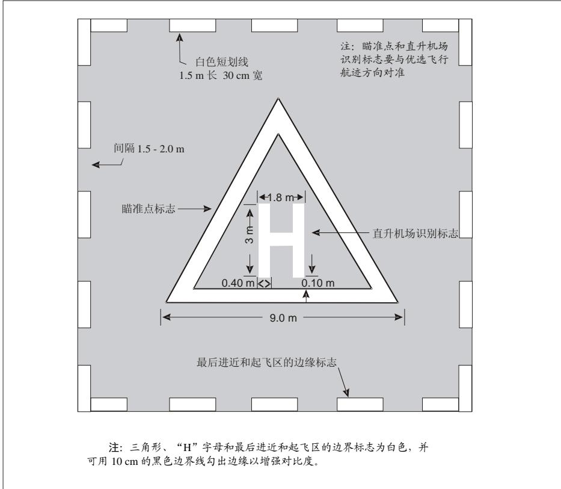

图5-1直升机场识别、瞄准点和最后进近和起飞区边缘标志组合

5.2.3.2建议：在地面直升机场，应显示出最大允许质量标志。

## 位置

5.2.3.3建议：最大允许质量标志应位于接地和离地区或最后进近和起飞区内，并安排得使其易于从优选最后进近方向辨认。

## 特性

5.2.3.4最大允许质量标志必须以一个一位数、两位数或三位数组成。

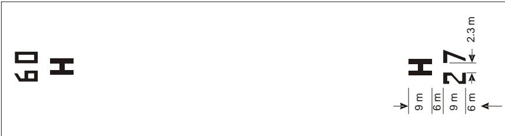

图5-2最后进近和起飞区号码标志和直升机场跑道型最后进近和起飞区识别标志

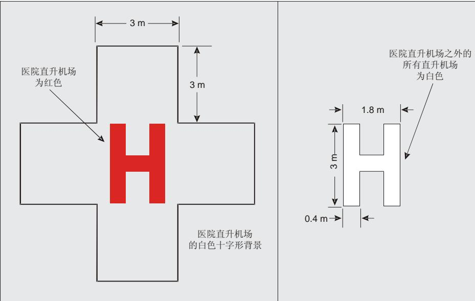

图5-3医院直升机场识别和直升机场识别标志

5.2.3.5标志必须以吨（1000kg）表示，下舍至最接近的1000kg，后面加一个字母“t”。国家使用磅表示质量时，最大允许质量标志必须以千磅表示可允许的直升机质量，下舍至最接近的1000磅。

注：国家以磅表示最大允许质量时，不应加前缀字母“t”，该字母只用来表示公吨。国家使用英制单位表示标志的指南见《直升机手册》（Doc9261号文件）。

5.2.3.6建议：最大允许质量应该用最接近的100kg表示。标志应该表示至一个小数位，四舍五入至最接近的100kg，后面加一个字母“t”。国家使用磅表示质量时，最大允许质量标志应该以百磅表示可允许的直升机质量，四舍五入至最接近的100磅。

5.2.3.7建议：最大允许质量以100kg为单位表示时，在小数位前面应该有一个用30cm正方形标示的小数点。

除跑道型最后进近和起飞区之外的所有最后进近和起飞区

5.2.3.8建议：对于尺寸大于30m的最后进近和起飞区，标志的数字和字母应具有与背景成对比的一种颜色，并且应符合图5-4中所示的形状和比例。对于尺寸在15m至30m之间的最后进近和起飞区，标志的数字和字母的高度至少应为90cm，对于尺寸小于15m的最后进近和起飞区，标志的数字和字母的高度至少应为60cm，这两种情况下的宽度和厚度应按比例减少。

跑道型最后进近和起飞区

5.2.3.9建议：标志的数字和字母应具有与背景成对比的一种颜色，并且应符合图5-4中所示的形状和比例。

#### 5.2.4 D—值标志

应用

除跑道型最后进近和起飞区之外的所有最后进近和起飞区

5.2.4.1在直升机甲板和船上直升机场上，必须显示D一值标志。

跑道型最后进近和起飞区

注：在具有跑道型最后进近和起飞区的直升机场上，无需标志D一值。

5.2.4.2建议：在为以2级或3级性能运行的直升机设计的表面和高架直升机场上，应显示D一值标志。

位置

5.2.4.3D一值标志必须位于接地和离地区或最后进近和起飞区内，并安排得使其易于从优选最后进近方向辨认。

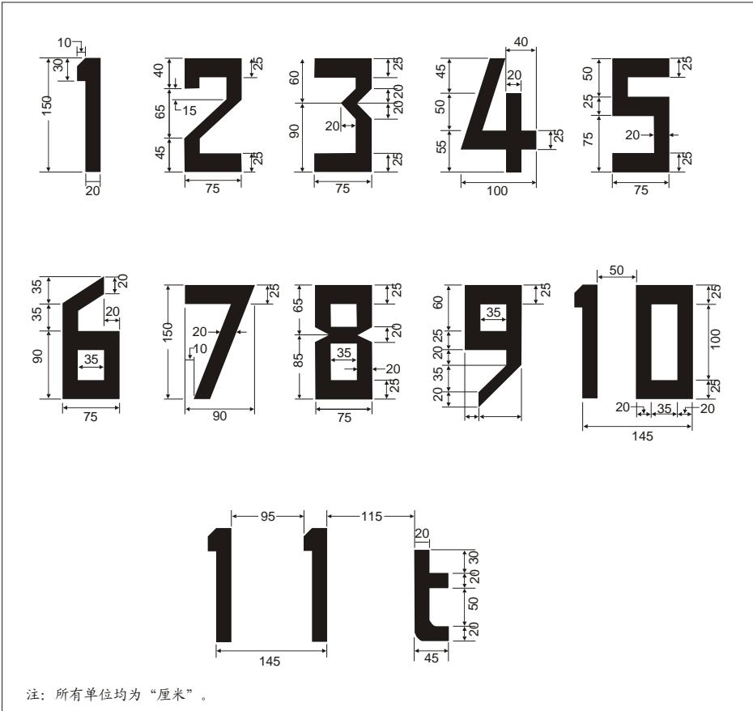

图5-4数字和字母的形状和比例

5.2.4.4建议：如果进近方向不止一个，应设置额外的D一值标志，以便至少有一个D一值标志易于从最后进近方向辨认。对于位于船边的非专门建造的直升机场，应在D圆周长上位于从面朝中心线的船的一侧看分别为2点、10点和12点处设置D值标志。

## 特性

5.2.4.5必须用白色将D一值标出。D一值标志必须舍入取整到最接近的整米或英尺，0.5则舍去。

5.2.4.6建议：标志的数字应具有与背景成对比的一种颜色，并且应符合图5-4中针对尺寸大于30m的最后进近和起飞区所示的形状和比例。对于尺寸在15m至30m之间的最后进近和起飞区，标志数字的高度至少应为90cm，对于尺寸小于15m的最后进近和起飞区，标志数字的高度至少应为60cm，这两种情况下的宽度和厚度应按比例减少。

#### 5.2.5 最后进近和起飞区尺寸标志

应用

5.2.5.1建议：准备供以1级性能运行的直升机使用的最后进近和起飞区的实际尺寸应在最后进近和起飞区上标志。

5.2.5.2建议：如果准备供以2和3级性能运行的直升机使用的最后进近和起飞区的实际尺寸小于1D，这些尺寸应在最后进近和起飞区上标志。

位置

5.2.5.3最后进近和起飞区的尺寸标志必须位于最后进近和起飞区内，并安排得使其易于从优选最后进近方向辨认。

特征

5.2.5.4尺寸必须四舍五入到最接近的米或英尺。

注：如果最后进近和起飞区为长方形，则显示出最后进近和起飞区相对于优选最后进近方向的长度和宽度。

除跑道型最后进近和起飞区之外的所有最后进近和起飞区

5.2.5.5建议：标志的数字应具有与背景成对比的一种颜色，并且应符合图5-4中针对尺寸大于30m的最后进近和起飞区。对于尺寸在15m至30m之间的最后进近和起飞区，标志的数字的高度至少应为90cm，对于尺寸小于15m的最后进近和起飞区，标志的数字的高度至少应为60cm，这两种情况下的宽度和厚度应按比例减少。

跑道型最后进近和起飞区

5.2.5.6建议：标志的数字应具有与背景成对比的一种颜色，并且应符合图5-4中所示的形状和比例。

5.2.6表面直升机场最后进近和起飞区的边界标志或标志物

应用

5.2.6.1当最后进近和起飞区的范围不是自然明显时，必须在地面直升机场上提供最后进近和起飞区的边界标志或标志物。

位置

5.2.6.2最后进近和起飞区的边界标志或标志物必须位于最后进近和起飞区的边缘上。

## 特性一跑道型最后进近和起飞区

5.2.6.3最后进近和起飞区的边界必须用标志或标志物划定，以不大于50m的间隔等距布置，每条边上至少有三个标志或标志物，包括每个角上的标志或标志物在内。

5.2.6.4最后进近和起飞区的边界标志必须是长方形的线条，其长度为9m或其标明的最后进近或起飞区的边长的五分之一，宽度为1m。

5.2.6.5最后进近和起飞区的边界标志必须是白色的。

5.2.6.6最后进近和起飞区的边界标志物必须具有图5-5所示的尺寸特性。

5.2.6.7最后进近和起飞区的边界标志物必须具有可与运行背景形成有效对比的颜色。

5.2.6.8建议：最后进近和起飞区的边界标志物应为单色，即橙色或红色，或者应使用两种形成对比的颜色，即橙白两色或红白两色，除非此类颜色会与背景融合。

## 特性一除跑道型最后进近和起飞区之外的所有最后进近和起飞区

5.2.6.9无铺砌面的最后进近和起飞区的边界必须用与地面齐平的地埋式标志物划定。最后进近和起飞区的边界标志物的宽度和长度必须分别为30cm和1.5m，端与端之间的间隔不小于1.5m，不大于2m。正方形或长方形最后进近和起飞区的拐角必须划定。

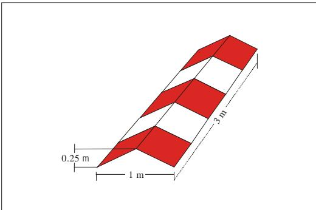

图5-5跑道型最后进近和起飞区的边缘标志物

5.2.6.10有铺砌面的最后进近和起飞区的边界必须用短划线划定。最后进近和起飞区的边界标志线段的宽度和长度必须分别为30cm和1.5m，端与端之间的间隔不小于1.5m，不大于2m。正方形或长方形最后进近和起飞区的拐角必须划定。

5.2.6.11最后进近和起飞区的边界标志和与地面齐平的地埋式标志物必须为白色。

#### 5.2.7 跑道型最后进近和起飞区的最后进近和起飞区号码标志

应用

5.2.7.1建议：在有必要给驾驶员提供最后进近和起飞区号码时，应在直升机场设置最后进近和起飞区号码标志。

位置

5.2.7.2最后进近和起飞区号码标志必须位于最后进近和起飞区的开始处，如图5-2所示。

特性

5.2.7.3最后进近和起飞区号码标志必须由两位数组成。该两位数必须是与从进近方向看磁方位角的1/10最为接近的整数。当上述规则给出的是一个一位数时，必须在该数字前加一个零。图5-2中所示的标志必须用直升机场识别标志加以补充。

#### 5.2.8 瞄准点标志

应用

5.2.8.1建议：当驾驶员有必要在进到接地和离地区之前进近到最后进近和起飞区上方一个特定点时，应在直升机场上设置瞄准点标志。

## 位置一跑道型最后进近和起飞区

5.2.8.2瞄准点标志必须位于最后进近和起飞区内。

## 位置一除跑道型最后进近和起飞区之外的所有最后进近和起飞区

5.2.8.3瞄准点标志必须如图5-1中所示，位于最后进近和起飞区的中心。

特性

5.2.8.4瞄准点标志必须是一个等边三角形，其中一个角的平分线与优选进近方向相一致。该标志必须以连续的白线组成，标志的尺寸必须符合图5-6中所示的尺寸。

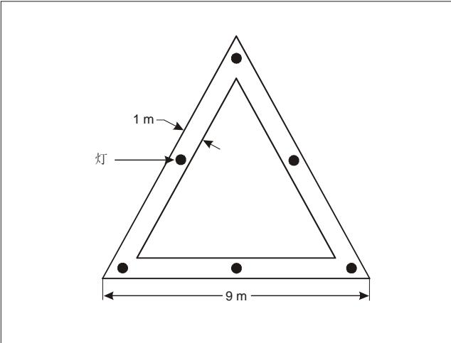

图5-6.瞄准点标志

#### 5.2.9 接地和离地区的边界标志

应用

5.2.9.1在位于表面机场最后进近和起飞区内的接地和离地区上，必须显示接地和离地区的边界标志，如果接地和离地区的边界不是自然明显的话。

5.2.9.2在高架机场、直升机甲板和船上直升机场上，必须显示接地和离地区的边界标志。

5.2.9.3建议：在表面机场与直升机停机位设在一起的接地和离地区上，应设置接地和离地区的边界标志。

位置

5.2.9.4接地和离地区的边界标志必须沿接地和离地区的边缘划设。

特性

5.2.9.5接地和离地区的边界标志必须以线宽至少为30cm的连续白线组成。

#### 5.2.10 接地/定位标志

## 应用

5.2.10.1当直升机需要接地和/或由驾驶员准确定位时，必须提供接地/定位标志。在设计用于转弯的直升机停机位上，必须设置接地/定位标志。

位置

5.2.10.2接地/定位标志的位置设置必须使得当驾驶员座位处于该标志上方时，整个主起落架位于接地和离地区内，直升机的所有部分同任何障碍物都保持一个安全距离。

5.2.10.3在直升机场，接地/定位标志的中心必须位于接地和离地区，除非当航空研究表明一些偏离是必要的，且偏离后的标志对安全不会产生不利影响时，接地/定位标志的中心可以偏离接地和离地区。对于设计用于悬停转弯的直升机停机位，接地/定位标志必须位于中心区的中心。（见图3-4）

5.2.10.4直升机甲板接地标志的中心必须位于最后进近和起飞区的中心，除非当航空研究表明一些偏离是必要的，且偏离后的标志对安全不会产生不利影响时，该标志可以偏离无障碍物扇形区的起点不大于0.1D。

注：指导材料，见《直升机场手册》（Doc9261号文件）。

特性

5.2.10.5接地/定位标志必须是一个黄色圆圈，线的宽度至少为0.5m。对于直升机甲板和专门建造的船上直升机场，线的宽度必须至少为1m。

5.2.10.6接地/定位标志的内径必须是接地和离地区和/或直升机停机位准备为之服务的最大直升机的0.5D。

#### 5.2.11 直升机场名称标志

应用

5.2.11.1建议：当缺乏其他目视识别方法时，直升机场和直升机甲板应提供直升机场的名称标志。

位置

5.2.11.2建议：直升机场名称标志应显示在机场上尽可能地从水平面之上各个角度都能看得见的地方。当直升机甲板上存在有障碍物扇形区时，该标志应位于直升机场识别标志的有障碍物的一侧。对于位于船边的非专门建造的直升机场，该标志应位于直升机场识别标志靠船内的一侧，设置在接地和离地区边界标志与障碍物限制扇形区边界之间的区域内。

特性

5.2.11.3直升机场名称标志必须由无线电（R/T）通信中所使用的直升机场的名称或字母数字代号组成。

5.2.11.4建议：准备在夜间或低能见度条件下使用的直升机场的名称标志应有内部或外部照明。

跑道型最后进近和起飞区

5.2.11.5建议：标志的字母的高度应不小于3m。

除跑道型最后进近和起飞区之外的所有最后进近和起飞区

5.2.11.6建议：标志的字母在表面直升机场上应不小于1.5m，在高架直升机场、直升机甲板和船上直升机场上不小于1.2m。标志的颜色应与背景成对比，最好为白色。

#### 5.2.12 直升机甲板无障碍物扇形区标志（V形标志）

应用

5.2.12.1如果直升机甲板的附近有超过直升机甲板水平面的障碍物，则直升机甲板必须设无障碍物扇形区标志。

位置

5.2.12.2如果实际可行，直升机甲板无障碍物扇形区标志所处位置与接地和离地区中心的距离必须等于接地和离地区内所能画出的最大圆的半径或等于0.5D，两者取较大值。

注：如果起点位于接地和离地区之外，并且对V形标志外表涂漆不可行，可将V形标志移至接地和离地区边缘位干无障碍物扇形区的平分线上。在此情况下，以高度不小干10cm的黑色字在V形标志下方的方框内标示出移位的距离和方向，以及“警告：V形标志已移位"这一可引起人们注意的字样—例图见《直升机场手册》（Doc9261号文件）。

特性

5.2.12.3直升机甲板无障碍物扇形区标志必须标明无障碍物扇形区的位置和扇形区限制的方向。

注：例图见《直升机场手册》（Doc9261号文件）。

5.2.12.4V形标志的高度不得低于30cm。

5.2.12.5V形标志必须以鲜明颜色标出。

5.2.12.6建议：V形标志的颜色应为黑色。

#### 5.2.13 直升机甲板和船上直升机场表面标志

应用

5.2.13.1建议：应设置表面标志，以协助驾驶员在白天进近期间识别直升机甲板或船上直升机场的位置。

位置

5.2.13.2建议：表面标志应适用于接地和离地区边界标志环绕的动态承载区。

特性

5.2.13.3建议：接地和离地区边界标志环绕的直升机甲板或船上直升机场表面应该是深绿色，使用高摩擦性涂层。

注：如果使用表面涂层可能会导致摩擦特性不良，可不对直升机甲板表面涂漆。在这种情况下，加强标志鲜明性的最佳操作措施是用对比色勾出甲板标志的轮廓。

#### 5.2.14 直升机甲板禁止着陆扇形区标志

应用

5.2.14.1建议：为防止直升机在规定航向内着陆，应该设置直升机甲板禁止着陆扇形区标志。

位置

5.2.14.2禁止着陆扇形区标志必须位于接地/定位标志之上，与接地和离地区边界相接，位于相关航向之内。

特性

5.2.14.3禁止着陆扇形区标志必须按照图5-7所示用白红交叉线标志标出。

注：禁止着陆扇形区标志可在认为有必要时使用，以标明直升机着陆时不可使用的各种直升机航向。这是为了确保直升机在机动着陆期间，其机头与交叉线标志保持距离。

#### 5.2.15 直升机地面滑行道标志和标志物

注1：附件14第I卷5.2.10中有关滑行等待位置标志的规范同样适用于准备供直升机地面滑行之用的滑行道。

注2：地面滑行路线无需进行标志。

图5-7直升机甲板禁止着陆扇形区标志

## 应用

5.2.15.1建议：直升机地面滑行道中线应使用标志加以标识，直升机地面滑行道边缘如果不是自然明显，应使用标志物或标志加以标识。

位置

5.2.15.2直升机地面滑行道标志必须沿地面滑行道中线划设，如果需要，还必须沿其边缘划设。

5.2.15.3直升机地面滑行道边缘标志物必须设在超出滑行道边缘0.5m至3m的位置。

5.2.15.4如果设置直升机地面滑行道边缘标志物，其间距在直线段的每一边上不得不大于15m，在弯道段的每一边上不得大于7.5m，每段至少有四个间距相等的标志物。

## 特性

5.2.15.5直升机地面滑行道中线标志必须是一条15cm宽的连续黄线。

5.2.15.6直升机地面滑行道边缘标志必须是一条连续的双黄线，每条线15cm宽，彼此间隔（最近边至最近边)15cm。

注：在有必要指明直升机地面滑行道只适用于直升机使用的机场，可能需要在机场设置标牌。

5.2.15.7直升机地面滑行道边缘标志物必须是易折的。

5.2.15.8直升机地面滑行道边缘标志物不得超过以地面滑行道平面以上25cm高度为底线、从距直升机地面滑行道边缘0.5m处以5%的坡度向上向外倾斜至超过直升机地面滑行道边缘3m的平面。

5.2.15.9直升机地面滑行道边缘标志物必须为蓝色。

注1：有关适当边缘标志物的指导材料，见《直升机手册》（Doc9261号文件）。

注2：如果在机场使用蓝色标志物，可能需要设置标牌，以指明直升机地面滑行道只适用于直升机。

5.2.15.10如果直升机地面滑行道将在夜间使用，则边缘标志物必须有内部照明或者是反光的。

#### 5.2.16 直升机空中滑行道标志和标志物

注：空中滑行路线无需进行标志。

## 应用

5.2.16.1建议：直升机空中滑行道中线或直升机地面滑行道边缘（如果不是自然明显）应使用标志物或标志加以标识。

位置

5.2.16.2直升机空中滑行道中线标志或与地面齐平的地埋中线标志物必须位于沿直升机空中滑行道的中线上。

5.2.16.3必须沿直升机空中滑行道的边缘设置直升机空中滑行道边缘标志物。

5.2.16.4直升机空中滑行道边缘标志物必须设在超出空中滑行道边缘1至3m的位置。

5.2.16.5建议：直升机空中滑行道边缘标志物不应设在距离滑行道中线小于根据设计使用该空中滑行道的直升机最大全宽0.5倍的位置。

特性

5.2.16.6直升机空中滑行道中线划设在有铺砌面的表面上时，必须用15cm宽的连续黄线标示。

5.2.16.7直升机空中滑行道边线划设在有铺砌面的表面上时，必须用连续的双黄线标示，每条线15cm宽，彼此间隔（最近边至最近边）15cm。

注：当直升机空中滑行道有可能与直升机地面滑行道混淆时，可能需要设置标牌，以指明所允许的滑行运行模式。

5.2.16.8直升机空中滑行道中线划设在无法喷涂标志的非铺砌面上时，必须用15cm宽，大约1.5m长的与地面齐平的地埋黄色标志物加以标示，其间距在直线段上不大于30m，在弯道上不大于15m，每段至少有四个间距相等的标志物。

5.2.16.9如果设置直升机空中滑行道边缘标志物，其间距在直线段的每一边上不得不大于30m，在弯道段的每一边上不得大于15m，每段至少有四个间距相等的标志物。

5.2.16.10直升机空中滑行道边缘标志物必须是易折的。

5.2.16.11直升机空中滑行道边缘标志物不得超出以直升机滑行道平面以上25cm高度为底线、从距直升机滑行道边缘1m处以5%的坡度向上向外倾斜至超过直升机空中滑行道边缘3m的平面。

5.2.16.12建议：直升机空中滑行道边缘标志物不应超出以直升机空中滑行道平面以上25cm高度为底线、从距直升机空中滑行道中线的距离等于根据设计使用该空中滑行道的直升机最大全宽的一半处以5%的坡度向上向外倾斜的平面。

5.2.16.13直升机空中滑行道边缘标志物必须使用与运行背景形成有效对比的颜色。标志物不得使用红色。

注：有关适当边缘标志物的指导材料，见《直升机场手册》（Doc9261号文件）。

5.2.16.14如果直升机空中滑行道将在夜间使用，则直升机空中滑行道边缘标志物必须有内部照明或者是反光的。

#### 5.2.17 直升机停机位标志

## 应用

5.2.17.1必须在设计用于转弯的直升机停机位上设置直升机停机位边界线标志。如果设置直升机停机位边界标志不可行，则必须在中心区边界不自然明显时改为设置中心区边界标志。

5.2.17.2对于准备用于滑行穿越且不允许直升机转弯的直升机停机位，必须设置停止线。

5.2.17.3建议：在直升机停机位应设置对准线和引入/引出线。

注1：见图5-8。

注2：当有必要识别单个停机位时，可设置直升机停机位识别标志。

注3:可设置关于停机位尺寸的额外标志。见《直升机场手册》（Doc9261号文件）。

位置

5.2.17.4设计用于转弯的直升机停机位上的直升机停机位边界标志或中心区边界标志，必须与停机位中心区同心。

5.2.17.5对于准备用于滑行穿越且不充许直升机转弯的直升机停机位，停止线必须设置在直升机地面滑行道轴线上，与中线呈直角设置。

5.2.17.6对准线和引入/引出线必须位于图5-8所示的位置。

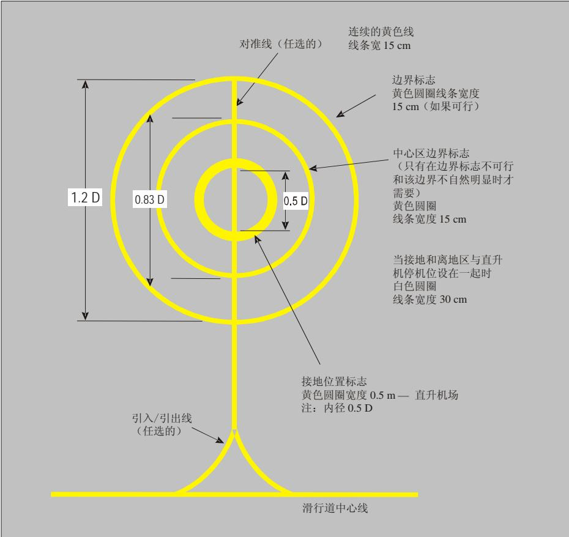

图5-8直升机停机位标志

## 特性

5.2.17.7直升机停机位边界标志必须是一个黄色圆圈，线条宽度为15cm。

5.2.17.8中心区边界标志必须是一个黄色圆圈，线条宽度为15cm，但当接地和离地区与直升机停机位设在一起时，则必须适用接地和离地区边界标志的特性。

5.2.17.9对于准备用于滑行穿越且不允许直升机转弯的直升机停机位，黄色停止线的宽度不得小于直升机地面滑行道的宽度且线条厚度为50cm。

5.2.17.10对准线和引入/引出线必须为连续的黄色线，线条宽度15cm。

5.2.17.11对准线和引入/引出线曲线段的半径必须适合于直升机停机位拟为之服务的要求最高的直升机机型。

5.2.17.12停机位识别标志必须用形成对比的颜色标示，以便易于辨认。

注1：当拟让直升机只向一个方向运行时，可作为对准线的一部分，增加指示所走方向的箭头。

注2：与停机位尺寸及对准线和引入/引出线相关的标志所具特性，见图5-8。

#### 5.2.18 飞行航迹对准定线引导标志

## 应用

5.2.18.1建议：当指示可用进近和/或离场航迹方向为可取和可行时，应在直升机场设置飞行航迹对准定线引导标志。

注：飞行航迹对准定线引导标志可与5.3.4种所述的飞行航迹对准定线引导灯光系统结合在一起。

## 位置

5.2.18.2飞行航迹对准定线引导标志必须以一条沿着进近和/或离场航迹方向的直线位于一个或多个接地和离地区、最后进近和起飞区、安全区或紧邻最后进近和起飞区或安全区的任何适合表面上。

## 特性

5.2.18.3飞行航迹对准定线引导标志必须如图5-9所示，由标示在接地和离地区、最后进近和起飞区和/或安全区表面的一个或多个箭头组成。箭头的直线线条必须50cm宽，至少3m长。当与飞行航迹对准定线引导灯光系统结合在一起时，必须采取图5-9中所示的形式，该图包括一个对不管箭头的直线线条长度如何，箭头尖保持不变的“箭头尖"进行标志的示意图。

注：如果飞行航迹只限干一个单一的进近方向或一个单一的离岗方向，箭头标志可以是单方向的，如果直升机场只有一个单一的进近/离场航迹可供使用，则标示一个双方向箭头。

5.2.18.4建议：标志所用颜色应与标示这些标志的表面所具有的背景颜色形成鲜明对比，最好为白色。

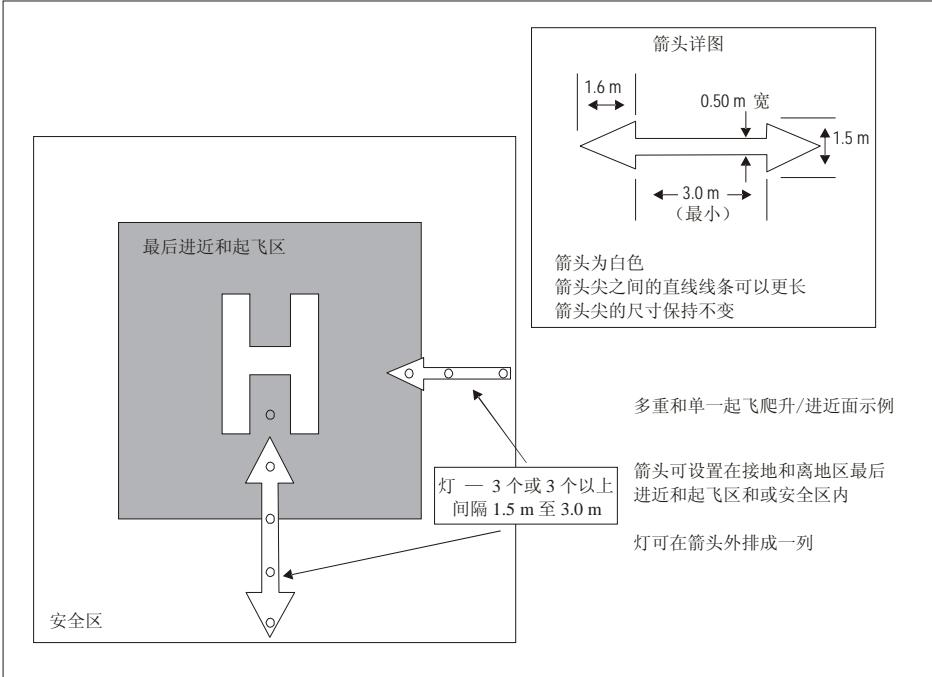

图5-9飞行航迹对准定线引导标志和灯

### 5.3 灯光

#### 5.3.1 概述

注1：有关非航空地面灯遮蔽的规范和立式灯和嵌入灯的设计，见附件14第I卷、5.3.1。

注2：关于位于通航水域附近的直升机甲板和直升机场，需考虑保证航空地面灯不致对海员产生干扰。

注3：由于直升机一般将与外来光源非常接近，特别重要的是，除非这些灯光是依照国际规范而显示的导航灯，否则要保证对它们加以遮蔽或者将其设置在避免产生直接眩光和反射眩光的位置。

注4：第5.3.4、5.3.6、5.3.7和5.3.8节的规范旨在提供基于夜间条件的有效灯光系统。当灯光拟用于非夜间（即日间或曙暮光）条件时，可能有必要通过使用适当的亮度控制器，增加灯光强度，以保持目视信号的有效性。指导材料见《机场设计手册》（Doc9157号文件），第4部分（目视助航设施）。

#### 5.3.2 直升机场灯标

应用

5.3.2.1建议：直升机场在下列情况下应提供直升机场灯标：

a）认为需要远距目视引导，而又无其他目视方法来提供；或

b）由于周围的灯光对直升机场的识别有困难。

位置

5.3.2.2直升机场灯标必须设在直升机场上或其邻近处，最好在高架的位置，并使驾驶员在短距离内不感到眩目。

注：当直升机场灯标可能在短距离内使驾驶员感到眩目时，在进近的最终阶段和着陆过程中可以将其关掉。

特性

5.3.2.3直升机场灯标必须发出等间歇的短时白色闪光重复系列，其模式如图5-10所示。

5.3.2.4灯标发出的灯光必须从所有的方位角均能看到。

5.3.2.5建议：每次闪光的有效光强分布应如图5-11，例示1所示。

注：当需要控制亮度时，调整10%和3%已被认为是令人满意的。此外，为了保证驾驶员在进近最终阶段和着陆过程中不感到眩目，遮蔽可能是必要的。

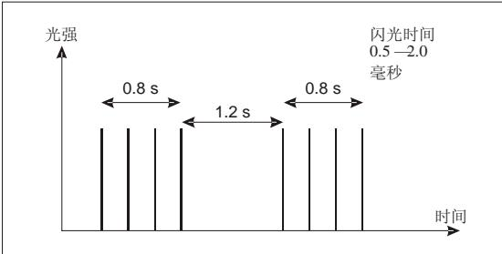

图5-10．直升机场灯标闪光特性

<html><body><table border="1"><tbody><tr><td></td><td rowspan="2"></td><td></td><td></td><td></td><td></td><td></td><td colspan="3"></td></tr><tr><td>仰角 10°} 250 cd* 7° 750 cd* 4° 1 700 cd* 21/2° 2 500 cd* 11/2° 2 500 cd* $0^°}$ 1 700 cd* -180°i 方位角 +180° (白光） *有效光强 例示1—直升机场灯标 9 000 cd 6 375 cd 3 750 cd 仰角 1 875cd 375cd A 方位角 绿色 红色 $12^{\15°}$ 1 $3}$ 6°$ 9 4 。 6° 375cd 8°} 1 875 cd $10\c}$ 3 750 cd 6 375 cd 9 000 cd 例示4—HAPI系统</td><td>仰角</td><td>250 cd*</td><td>仰角</td><td>25 cd</td><td>仰角 15°</td><td>250cd*</td><td></td></tr><tr><td></td><td></td><td></td><td></td><td>7°</td><td>750 cd*</td><td>250 cd</td><td></td><td></td></tr><tr><td></td><td></td><td></td><td></td><td></td><td></td><td></td><td></td><td></td></tr><tr><td>6°</td><td>350 cd</td><td>6^°</td><td>3 500 cd*</td><td>仰角</td><td></td><td>4°</td><td>1 700 cd*</td><td>5°</td></tr><tr><td>21/2°</td><td>2 500 cd*</td><td></td><td></td><td></td><td>2 500 cd*</td><td>$90°}</td><td>55cd/m^{2$</td><td></td></tr><tr><td>11/2°</td><td>2 500 cd*</td><td>$2^°}</td><td>250 cd</td><td>2°\}$</td><td>$0^°}$</td><td>1 700 cd*</td><td>$0^°\}$</td><td>25 cd</td></tr><tr><td>-180°i 方位角</td><td>+180°</td><td>-180°$ 方位角</td><td>+180°</td><td>-180° 方位角</td><td>+180°}</td><td></td><td></td><td></td></tr><tr><td colspan="7">(白光）</td><td>(白光)</td><td>(白光)</td></tr><tr><td colspan="5">*有效光强</td><td></td><td>*有效光强</td><td></td></tr><tr><td>例示1—直升机场灯标</td><td rowspan="15">例示2—进近灯恒定光</td><td>例示3—进近灯闪光</td><td>40\}</td><td>50 cd/m2</td><td></td><td></td><td></td><td></td></tr><tr><td>9 000 cd</td><td></td><td></td><td></td><td></td><td></td><td></td><td></td></tr><tr><td>6 375 cd 3 750 cd</td><td></td><td>仰角</td><td></td><td>仰角</td><td>$20\}$</td><td>30 cd/m2</td><td></td></tr><tr><td>1 875cd 375cd A</td><td>30°</td><td>10 cd</td><td>$20^{°E\≤}0{c$</td><td>3 cd</td><td>$10\}$</td><td>15 cd/m2</td><td></td></tr><tr><td>方位角</td><td>25°}</td><td>50 cd</td><td>$13°<E\≤20{°$</td><td>8 cd</td><td>$0^°}$</td><td>5cd/m^{2</td><td>绿色 1</td></tr><tr><td>红色 $12^{\15°}$ $3}$ 6°$ 9 4 。</td><td></td><td>100 cd</td><td>$5^{°<E\≤ 10{$</td><td>30 cd</td><td>例示7—接地和离地区发光板</td><td>6°</td><td>10^\}$</td></tr><tr><td>375cd 8°}</td><td>$2^{\≤E≤5{$</td><td>15 cd</td><td>1 875 cd $10\c}$</td><td>3°</td><td></td><td>100 cd</td><td>-180°} 方位角 +180°</td></tr><tr><td>6 375 cd</td><td>$0^\}$</td><td>10 cd</td><td></td><td>-180°i 方位角</td><td>+180°</td><td>（绿或白光）</td><td></td></tr><tr><td>9 000 cd</td><td></td><td>注：如果是需要通过仰角小于2°的 灯来识别的装置，可能需要附加值。</td><td></td><td></td><td></td><td></td><td></td></tr><tr><td>例示4—HAPI系统</td><td>例示5—最终进近和起飞 区灯和瞄准点灯</td><td>例示6—接地和离地区边界灯和飞行 航迹对准定线引导灯光系统</td><td></td><td></td><td></td><td></td><td></td></tr><tr><td colspan="2"></td><td></td><td></td><td></td><td></td><td></td><td></td><td></td></tr><tr><td colspan="2"></td><td></td><td></td><td></td><td></td><td></td><td></td><td></td></tr><tr><td colspan="2"></td><td></td><td></td><td></td><td></td><td></td><td></td><td></td></tr><tr><td colspan="2"></td><td></td><td></td><td></td><td></td><td></td><td></td><td></td></tr><tr><td colspan="2"></td><td></td><td></td><td></td><td></td><td></td><td></td><td></td></tr><tr><td colspan="2"></td><td></td><td></td><td></td><td></td><td></td><td></td><td></td></tr><tr><td colspan="2"></td><td></td><td></td><td></td><td></td><td></td><td></td><td></td></tr><tr><td colspan="2"></td><td></td><td></td><td></td><td></td><td></td><td></td><td></td></tr></tbody></table></body></html>

图5-11等照度图

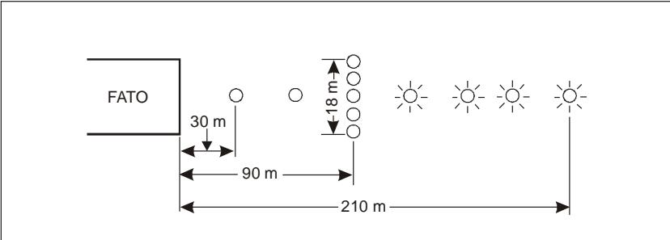

图5-12.进近灯光系统

#### 5.3.3 进近灯光系统

## 应用

5.3.3.1建议：当指示优选进近方向为可取和切实可行时，直升机场应设置进近灯光系统。

位置

5.3.3.2进近灯光系统必须位于沿优选进近方向的一条直线上。

## 特性

5.3.3.3建议：进近灯光系统应以一排等间距为30m的三个灯和一个长度为18m、距最后进近和起飞区周边90m的横排灯组成，如图5-12所示。组成横排灯的灯应尽实际可行地在一条水平直线上，与中线灯成直角并被其平分，其间距为4.5m。当需要使最终进近航线更加明显时，应在横排灯以外以30m的均匀间距增设附加灯。横排灯以外的灯根据周围的环境，可以是恒定光强的，也可以是顺序闪光的。

注：当由于周围的灯光而难于识别进近灯光系统时，顺序闪光灯可能是有用的。

5.3.3.4恒定光强灯必须是全方位的白色灯。

5.3.3.5顺序闪光灯必须是全方位的白色灯。

5.3.3.6建议：闪光灯应具有每秒一次的闪光频率，其光强分布应如图5-11，例示3中所示。闪光顺序应从最外面的灯开始，向横排灯行进。

5.3.3.7建议：应包括有适当的亮度控制器，以调整光强，满足当时的环境条件。

注：下列光强调整被认为是适当的：

a）恒定光强灯—100%、30%和10%;

b）闪光灯—100%、10%和3%。

#### 5.3.4 飞行航迹对准定线引导灯光系统

## 应用

5.3.4.1建议：当指示可用进近和/或离场航迹方向为可取和可行时，应在直升机场设置飞行航迹对准定线引导灯光系统。

注：飞行航迹对准定线引导灯光可与5.2.18中所述的飞行航迹对准定线引导标志结合在一起。

## 位置

5.3.4.2飞行航迹对准定线引导灯光系统必须以一条沿着进近和/或离场航迹方向的直线位于一个或多个接地和离地区、最后进近和起飞区、安全区或紧邻最后进近和起飞区、接地和离地区或安全区的任何适合表面上。

5.3.4.3建议：如果与飞行航迹对准定线引导标志结合在一起，灯应尽可能放置在“箭头”标志以内。

## 特性

5.3.4.4建议：飞行航迹对准定线引导灯光系统应由一排三个或三个以上间隔均匀的灯组成，总的最小距离为6米。灯与灯之间的间隔应不小于1.5米，不超过3米。如果空间允许，应设置5个灯。（见图5-9）

注：灯的数量和彼此间隔可根据可用空间进行调整。如果使用一个以上的飞行航迹对准定线系统来指示可用进近和/或离场航迹的方向，每一系统的特性通常要保持一致。（见图5-9）

5.3.4.5灯必须是恒定光强的全方向嵌入式白色灯。

5.3.4.6建议：灯的分布应如图5-11例示6中所示。

5.3.4.7建议：应安装适当的控制器，以调节光强，从而满足当时的环境条件并使飞行航迹对准定线引导灯光系统与其他直升机场灯光及直升机场周围可能存在的一般灯光取得协调。

#### 5.3.5 目视对准定线引导系统

应用

5.3.5.1建议：当特别是在夜间存在下列一种或几种情况时，应提供目视对准定线引导系统，以用于直升机场进近：

a）障碍物净距、减少噪声或交通管制程序要求遵循一个特定方向时；

b）直升机场的环境提供很少目视地标；

c）安装进近灯光系统不实际可行。

## 位置

5.3.5.2目视对准定线引导系统的位置设置必须能引导直升机沿着规定的航迹飞向最后进近和起飞区。

5.3.5.3建议：该系统应设置在最后进近和起飞区的下风一边，并沿着优选进近方向对准。

5.3.5.4灯具必须是易折的，并安装得尽可能低。

5.3.5.5当该系统的灯光需要被视为单独的光源时，灯具的位置设置必须使在驾驶员看来，在该系统覆盖面的端部灯具之间所对的角度不小于3弧分。

5.3.5.6该系统的灯具和其他类似的或更大光强的灯具之间所对的角度也必须不小于3弧分。

注：如果灯具每公里视程被1m分隔开，一条垂直于视线的灯可满足5.3.5.5和5.3.5.6的要求。

## 信号形式

5.3.5.7对准定线引导系统的信号形式必须最少包括三个独立的信号扇形面，以提供“向右偏离”、“在航迹上”和“向左偏离”的信号。

5.3.5.8该系统“在航迹上”扇形面的散开率必须如图5-13所示。

5.3.5.9信号形式必须使该系统与任何有关联的目视进近坡度指示器或其他目视助航设施之间没有干扰的可能性。

5.3.5.10该系统必须避免与任何有关联的目视进近坡度指示器采用相同的编码。

5.3.5.11信号形式必须使该系统在所有运行环境中是独一无二的和明显的。

5.3.5.12该系统必须不显著增加驾驶员的工作量。

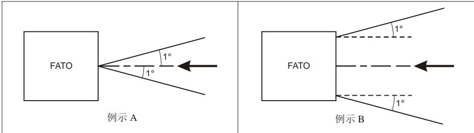

图5-13．“在航迹上”扇形面的散开率

## 光的分布

5.3.5.13目视对准定线引导系统的可用范围必须等于或优于与其有关联的目视进近坡度指示系统。

5.3.5.14必须提供适当的光强控制器，使之能够调整光强以满足当时的条件并避免使驾驶员在进近和着陆时感到眩目。

## 进近航迹和方位的设置

5.3.5.15目视对准定线引导系统必须能在所需的进近航道方位上调整±5弧分的范围。

5.3.5.16方位引导系统的角度必须在进近中使处于“在航迹上”信号范围边缘上的直升机驾驶员与进近区内的所有物体具备一个安全净距。

5.3.5.175.3.6.23、表5-1和图5-14中所规定的障碍物保护面的特性必须同样地适用于该系统。

## 目视对准定线引导系统的特性

5.3.5.18在有影响信号形式的任何元件失效的情况下，该系统必须自动关闭。

5.3.5.19灯具必须设计得使在透光或反光面上聚集的水分、冰、灰尘等对灯光信号的干扰尽可能地小并且不会引起发出假的或错误的信号。

表5-1障碍物保护面的尺寸和坡度

<html><body><table border="1"><tr><td>保护面和尺寸</td><td colspan="2">最后进近和起飞区</td></tr><tr><td>内边的长度</td><td colspan="2">安全区的宽度</td></tr><tr><td>距最后进近和起飞区端的距离</td><td colspan="2">最小3m</td></tr><tr><td>散开率</td><td colspan="2">10%</td></tr><tr><td>全长</td><td colspan="2">2 500 m</td></tr><tr><td rowspan="3">坡度</td><td>PAPI</td><td>A^{}_}0.57°$</td></tr><tr><td>HAPI</td><td>Ab—0.65</td></tr><tr><td>APAPI</td><td>Aa}—0.9{</td></tr><tr><td colspan="3">a. 如附件14第I卷图5-19所示。 b.“低于进近坡”信号上部边界的角度。</td></tr></table></body></html>

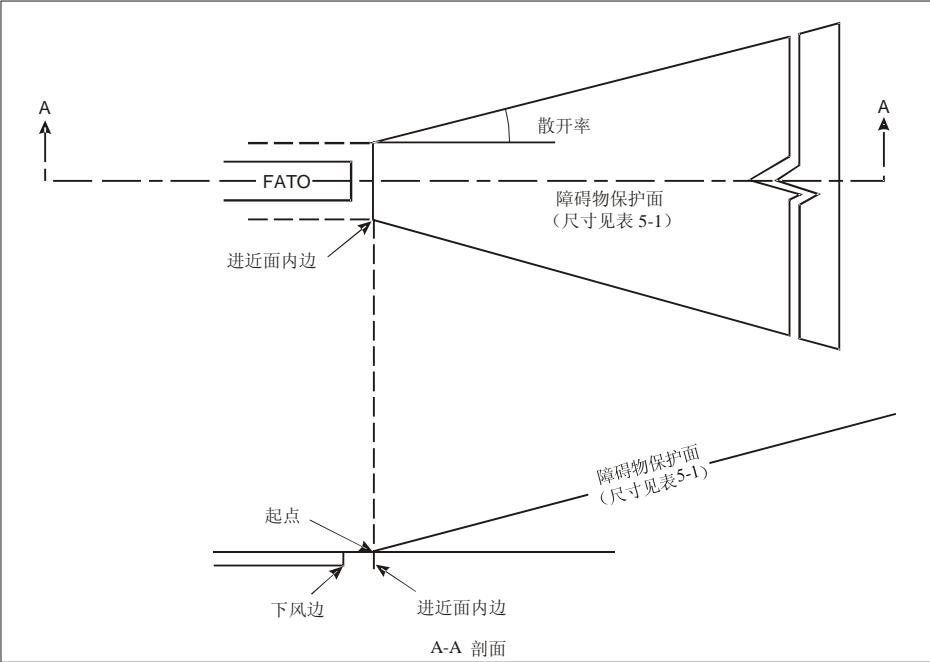

图5-14．直升机进近航道指示器信号格式

#### 5.3.6 目视进近坡度指示器

## 应用

5.3.6.1建议：存在下列一种或几种情况的直升机场，特别是在夜间，不论是否设有其他目视进近助航设备或非目视助航设备，应设置目视进近坡度指示器，以引导直升机进近：

a）障碍物净空、减少噪声或交通管制程序要求有一个飞行的特定坡度；

b）直升机场的环境仅能提供极少的目视地标；

c）直升机的特性要求稳定的进近。

5.3.6.2用于直升机运行的标准目视进近坡度指示器系统必须由下列系统组成：

a）符合附件14第I卷，5.3.5.23至5.3.5.40各节中规定的精密进近航道指示器（PAPI）和简式进近航道指示器（APAPI）系统，除了该系统的“在坡度上”扇形面必须加大到45′；或者

b）符合5.3.6.6至5.3.6.21各节中规定的直升机进近航道指示器（HAPI）系统。

## 位置

5.3.6.3目视进近坡度指示器的位置设置必须能把直升机引导到最后进近和起飞区内所要求的位置，并且能避免在最终进近和着陆过程中使驾驶员感到眩目。

5.3.6.4建议：目视进近坡度指示器应设置得邻近标称的瞄准点，其方位与优选进近方向相一致。

5.3.6.5灯具必须是易折的，并且安装得尽可能低。

## HAPI信号形式

5.3.6.6HAPI的信号形式必须包括四个独立的信号扇形面，提供“高于进近坡”、“在进近坡上”、“略低于进近坡”和“低于进近坡”信号。

5.3.6.7HAPI的信号形式必须如图5-15，示例A和示例B所示。

注：设计灯具时，要求注意最大限度地减少在信号扇形面之间和方位覆盖范围产生的假信号。

5.3.6.8HAPI闪光扇形面的信号重复率必须至少为2Hz。

5.3.6.9建议：HAPI脉冲信号的“开—关”比率应是1:1，调制度至少应为80%。

5.3.6.10HAPI“在进近坡上”扇形面的角度大小必须是45′。

5.3.6.11HAPI“略低于进近坡”扇形面的角度大小必须是15′。

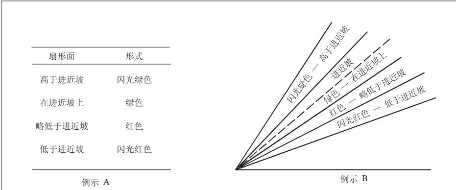

图5-15．对目视进近坡度指示器系统的障碍物保护面

## 灯光分布

5.3.6.12建议：HAPI的红色和绿色光强分布应如图5-11，例示4所示。

注：把HAPI系统安装在转盘上可获得较大的方位覆盖。

5.3.6.13HAPI在垂直面上的变色必须使在距离不小于300m处的观察者看来在不大于3′的垂直角内出现。

5.3.6.14红色或绿色滤色镜的传递系数在最大光强调置下必须不小于15%。

5.3.6.15在全光强时，HAPI红光的Y坐标必须不超过0.320，绿光必须在附件14第I卷，附录1，2.1.3中所规定的界限内。

5.3.6.16必须提供合适的光强控制器，以便调节光强使之满足当时的条件，并避免使驾驶员在进近和着陆过程中感到眩目。

## 进近坡和仰角调置

5.3.6.17HAPI系统必须能在水平线上1°至12°之间所需的任何角度上调整其仰角，精确度为±5′。

5.3.6.18HAPI的仰角调置必须使进近中的直升机驾驶员看到“低于进近坡”信号上限时，该直升机将对进近区内所有物体均保持一个安全净距。

## 灯具的特性

5.3.6.19该系统必须设计得：

a)在灯具的垂直偏差超过±0.5°（±30）的情况下，该系统能自动跳闸；

b）如果闪光机制失效，在失效的闪光扇形面内没有灯光发出。

5.3.6.20HAPI的灯具必须设计得使在透光或反光面上聚集的水分、冰、灰尘等对灯光信号的干扰尽可能地小，并且不会引起产生假的或错误的信号。

5.3.6.21建议：准备设置在浮式直升机甲板上的HAPI系统，在直升机场前后、左右±3°颠簸中应保持光束稳定性的精确度为±1/4°。

## 障碍物保护面

注：下列规范适用于PAPI、APAPI和HAPI。

5.3.6.22当打算提供目视进近坡度指示器系统时必须设立障碍物保护面。

5.3.6.23障碍物保护面的特性，即起点、散开率、长率和坡度必须与表5-1相关的栏以及图5-14中的规定相对应。

5.3.6.24新物体或现有物体的扩展不准许高出障碍物保护面，除非有关当局认为新物体或扩展的物体被一个现有的不能移动的物体所遮蔽。

注：关于可以合理利用遮蔽原则的情况，见《机场服务手册》（Doc9137号文件）第6部分。

5.3.6.25高出障碍物保护面的现有的物体必须移去，除非有关当局认为该物体被一个已经存在的不能移动的物体所遮蔽，或者经过航空研究，确定该物体不会严重地影响直升机运行的安全。

5.3.6.26在航空研究表明，高出障碍物保护面的现有物体严重地影响直升机运行的安全时，必须采取下列一种或几种措施：

a）适当地提高该系统的进近坡度；

b）减小该系统方位角的开度，使物体限制在光束之外；

c)移动该系统与其相关障碍物保护面的轴线不大于5°；

d)适当地移动最后进近和起飞区；

e)按5.3.5的规定设置目视对准定线引导系统。

注：关于本问题的指导材料载于《直升机场手册》Doc9261号文件。

#### 5.3.7 表面直升机场最后进近和起飞区灯光系统

## 应用

5.3.7.1当在准备供夜间使用的地面直升机场设有最后进近和起飞区时，必须设置最后进近和起飞区灯，除非在最后进近和起飞区与接地和离地区几乎是重合的或者最后进近和起飞区的范围是自然明显的情况下，可以不设。

位置

5.3.7.2最后进近和起飞区灯必须沿最后进近和起飞区的边缘设置。灯具必须以均匀的间隔设置如下：

a）对正方形或长方形地区，其间隔不大于50m，每边最少为4个灯，包括每个角上的灯在内；

b）对任何其他形状的地区，包括圆形地区，其间隔不大于5m，最少为10个灯。

特性

5.3.7.3最后进近和起飞区灯必须是显示白光的恒定光强的全向灯。当灯的光强要变动时，灯必须显示可变动的白光。

5.3.7.4建议：最后进近和起飞区灯的光强分布应如图5-11，例示5所示。

5.3.7.5建议：灯的高度不应超过25cm，当高出表面的灯会危及直升机飞行时，灯应是嵌入式的。当最后进近和起飞区不准备用于离地或接地时，灯不应高出地面或雪面25cm。

#### 5.3.8 瞄准点灯

应用

5.3.8.1建议：当准备供夜间使用的直升机场设有瞄准点标志时，应设置瞄准点灯。

位置

5.3.8.2瞄准点灯必须与瞄准点标志设在一起。

## 特性

5.3.8.3瞄准点灯必须构成如图5-6中所示的至少6个全向白色灯的形式。当高出表面的灯会危及直升机运行时，灯必须是嵌入式的。

5.3.8.4建议：瞄准点灯的光强分布应如图5-11，例示5所示。

#### 5.3.9 接地和离地区灯光系统

应用

5.3.9.1在准备供夜间使用的直升机场，必须设置接地和离地区灯光系统。

5.3.9.2表面直升机场的接地和离地区灯光系统必须以下列一种或几种灯具组成：

a）边线灯；或

b）泛光照明；或

c)当a）和b）实际上不可行，并具备最后进近和起飞区灯时，使用扇形点光源照明阵列（ASPSL）或发光板（LP）照明以识别接地和离地区。

5.3.9.3高架直升机场或直升机甲板的接地和离地区灯光系统必须包括：

a）边线灯；

b）使用扇形点光源照明阵列和/或发光板以识别设置的接地标志和/或用泛光照明为接地和离地区照明。

注：在高架直升机场和直升机甲板上，在接地和离地区范围内的表面特征信号，对在最终进近和着陆期间的直升机定位是很必要的。这类信号除使用边线灯以外，可以使用各种形式的照明（扇形点光源照明阵列、发光板、泛光灯或这些灯的组合等）来提供。业已证明，以发光二极管（LED）的密封带的形式组合边线灯和扇形点光源照明阵列用于识别接地区和直升机场识别标志具有最佳的效果。

5.3.9.4建议：在拟供夜间使用的表面直升机场，当需要加强的地面特征信号时，应提供接地和离地区扇形点光源照明阵列和/或发光板以识别接地标志和/或泛光照明。

## 位置

5.3.9.5接地和离地区边线灯必须沿指定用做接地和离地区的边线或在距边线1.5m处设置。当接地和离地区为圆形时，灯必须：

设置在其形式将给驾驶员提供有关偏差的信息的若干直线上；

b）在a）不实际可行时，围绕接地和离地区的周边以适当的间隔均匀地设置，但扇形面大于45°时，灯必须以一半的间距设置。

5.3.9.6接地和离地区的边线灯必须均匀设置，对高架直升机场和直升机甲板，其间隔不大于3m，对表面直升机场，其间隔不大于5m。每边必须至少有4个灯，包括每个角上的灯在内。对于圆形接地和离地区，当灯按照5.3.9.5b）安装时，必须至少有14个。

注：有关这个问题的指导材料载于《直升机场手册》（Doc9261号文件）。

5.3.9.7高架直升机场或固定式直升机甲板上的接地和离地区边线灯，必须安装得使驾驶员不能从接地和离地区标高的下面看见灯的形式。

5.3.9.8浮式直升机甲板上的接地和离地区边线灯，必须安装得当直升机甲板水平时驾驶员不能从接地和离地区标高的下面看见灯的形式。

5.3.9.9表面直升机场上如果设置扇形点光源照明阵列或发光板来识别接地和离地区，必须沿接地和离地区的边线的标志设置。当接地和离地区为圆形时，它们必须设在围绕该地区的直线段上。

5.3.9.10在表面直升机场上，接地和离地区的最少发光板的数量必须是9块，一个形式中的发光板的全长不得小于该形式的长度的50%。接地和离地区的每边上的板必须是奇数并至少为3块板，包括每个角上的一块板，发光板必须均匀地设置在接地和离地区每边上，相邻板端之间的距离不大于5m。

5.3.9.11建议：当在高架直升机场或直升机甲板上使用发光板是为了加强表面特征时，发光板不应靠近边线灯设置。在设有接地标志或者接地标志与直升机场识别标志相重合时，发光板应围绕着接地标志周围设置。

5.3.9.12接地和离地区泛光灯的位置设置必须使飞行中的驾驶员或在该区的工作人员不感到眩目。泛光灯的排列和方向必须使阴影减至最小。

注：已经表明，与低照度泛光灯相比，使用扇形点光源照明阵列和发光板来指明接地标志和/或直升机场识别标志可以加强地面特征信号。由于如果使用泛光灯会有产生偏差的危险，因此有必要对这些灯进行定期的检查以确保它们符合5.3.9所载规范的要求。

## 特性

5.3.9.13接地和离地区的边线灯必须是显示绿光的固定式全向灯。

5.3.9.14在表面直升机场上，当扇形点光源照明阵列或发光板用来划定接地和离地区的边界时，必须发出绿光。

5.3.9.15建议：发光板的颜色色度和照度应符合附件14第I卷，附录1，3.4的要求。

5.3.9.16发光板的宽度必须最小为6cm。板壳的颜色必须与它所限定的标志的颜色相同。

5.3.9.17建议：边线灯高度应不超过25cm，当高出表面的灯危及直升机运行时，边线灯应是嵌入式的。

5.3.9.18建议：当位于直升机场的安全区或直升机甲板的无障碍扇形区之内时，接地和离地区的泛光灯的高度应不超过25cm。

5.3.9.19发光板不得高出表面2.5cm。

5.3.9.20建议：边线灯的光强分布应如图5-11，例示6所示。

5.3.9.21建议：发光板的光强分布应如图5-11，例示7所示。

5.3.9.22接地和离地区泛光灯的光谱分布必须使表面和障碍物标志能正确地加以辨别。

5.3.9.23建议：从接地和离地区表面上量得的泛光照明的平均水平照度至少应为10lux，均匀性比率（平均与最小之比）不大于8：1。

5.3.9.24建议：用于识别接地标志的照明设备应包括一个由发黄光的全向扇形点光源照明阵列带形成的断续圆。各圆弧段应由扇形点光源照明阵列带组成，并且扇形点光源照明阵列带的全长不应小于该圆形区域的圆周长度的50%。

5.3.9.25建议：如果使用直升机场识别标志灯，该灯应为发绿光的全向灯。

#### 5.3.10 起货机作业区的泛光照明

应用

5.3.10.1在准备供夜间使用的起货机作业区必须设置起货机作业区的泛光照明。

位置

5.3.10.2起货机作业区的泛光灯的位置设置必须使飞行中的驾驶员或该区的工作人员不感到眩目。泛光灯的排列和方向必须使阴影减至最小。

特性

5.3.10.3起货机作业区的泛光灯的光谱分布必须使表面和障碍物标志能正确地加以分辨。

5.3.10.4建议：在起货机作业区的表面量得的平均水平照度至少应为10lux。

#### 5.3.11 滑行道灯

注：附件14第I卷，5.3.17和5.3.18中有关滑行道中线灯和滑行道边灯的规范同样适用于准备供直升机地面滑行使用的滑行道。

#### 5.3.12 标明障碍物的目视助航设备

注：附件14第I卷，第6章所包括的有关障碍物的标志和照明的规范同样适用于直升机场和起货机作业区。

#### 5.3.13 障碍物的泛光照明

应用

5.3.13.1在准备供夜间使用的直升机场，如果不可能在障碍物上设置障碍灯，必须对其用泛光照明。

位置

5.3.13.2障碍物泛光灯必须设置得能照亮整个障碍物，并尽实际可行地使直升机驾驶员不感到眩目。

特性

5.3.13.3建议：障碍物的泛光照明应产生的亮度至少为10cd/m2。

## 第6章直升机场服务

### 6.1 救援与消防

## 概述

引言这些规范仅适用于表面直升机场和高架直升机场。该规范是对附件14第I卷，9.2有关机场援救与消防要求的补充。

救援与消防服务的主要目标是挽救生命。因此，提供处理发生在直升机场或其紧邻地区的直升机事故或事故征候的手段是极为重要的，因为正是在这个区域里存在着挽救生命的最大机会。这就必须时时假定，或紧随直升机发生事故或事件之后，或在进行救援的过程中的任何时候，都有可能发生火灾并需要灭火。

在一次能得救的直升机事故中，有效救援的最重要的因素是：所受的训练、设备的有效性和指定的救援和消防人员及设备能够投入使用的速度。

关于高架直升机场，对保护直升机场所在的建筑物或结构物的要求未予考虑。

直升机甲板的救援与消防要求，可见《直升机场手册》（Doc9261号文件）。

## 提供保障的水平

6.1.1建议：为救援与消防提供的保障水平应以通常使用该直升机场的最长直升机的全长为依据，并与依据表6-1所确定的直升机场的消防类别相一致。但起降率低，无人照管的直升机场除外。

注：关于帮助有关当局在表面直升机场和高架直升机场提供救援与消防设备及服务的指导材料，见《直升机场手册》（Doc9261号文件）。

表6-1直升机场的消防类别

<html><body><table border="1"><thead><tr><td>类别</td><td>直升机全长a</td></tr></thead><tbody><tr><td>H1</td><td><15m</td></tr><tr><td>H2</td><td>$15\ m\leq\sim<24\ m$</td></tr><tr><td>H3</td><td>$24\ m\leq\sim<35\ m$</td></tr><tr><td>a.直升机长度，包括尾梁和旋翼。</td><td></td></tr></tbody></table></body></html>

6.1.2建议：在预计直升机场由较小直升机使用期间，直升机场消防类别可以降低到计划在该期间使用该直升机场的最高类别直升机的消防类别。

## 灭火剂

6.1.3建议：主要灭火剂应是达到最低性能水平B的一种泡沫。

注：有关泡沫要达到可接受的性能水平B级别所需的物理性质和灭火性能标准的资料，见《机场服务手册》（Doc 9137号文件）第1部分。

6.1.4建议：对生产泡沫的用水量和要提供的辅助剂应与依照6.1.1和表6-2或表6-3所确定的直升机场消防类别取得一致。。

注：对于高架直升机场，如果附近有能够维持所要求的喷射率的、可用的压力供水系统，则不必在机场或其邻近储存所规定的水量。

表6-2表面直升机场最小可用灭火剂数量

<html><body><table border="1"><tr><td rowspan="2">类别</td><td colspan="2">达到性能水平B的泡沫</td><td colspan="3">辅助剂</td></tr><tr><td>水 (T)</td><td>喷射率 泡沫溶液 (L/min)</td><td>化学干粉 (kg)</td><td>卤化碳 (kg)</td><td>二氧化碳 (kg)</td></tr><tr><td>(1)</td><td>(2)</td><td>(3)</td><td>(4)</td><td>或 (5)</td><td>或 (6)</td></tr><tr><td>H1</td><td>500</td><td>250</td><td>23</td><td>23</td><td>45</td></tr><tr><td>H2</td><td>1 000</td><td>500</td><td>45</td><td>45</td><td>06</td></tr><tr><td>H3</td><td>1 600</td><td>800</td><td>06</td><td>06</td><td>180</td></tr></table></body></html>

表6-3高架直升机场最小可用灭火剂数量

<html><body><table border="1"><tr><td colspan="4">达到性能水平B的泡沫</td><td colspan="3">辅助剂</td></tr><tr><td>类别</td><td>水 (T)</td><td>喷射率 泡沫溶液 (L/min)</td><td>化学干粉 (kg)</td><td>卤化碳 (kg)</td><td></td><td>二氧化碳 (kg)</td></tr><tr><td>(1)</td><td>(2)</td><td>(3)</td><td>(4)</td><td>或 (5)</td><td>或</td><td></td></tr><tr><td>H1</td><td>2 500</td><td>250</td><td>45</td><td>45</td><td></td><td>(6) 06</td></tr><tr><td>H2</td><td>5000</td><td>500</td><td>45</td><td>45</td><td></td><td>90</td></tr><tr><td>H3</td><td>8000</td><td>800</td><td>45</td><td>45</td><td></td><td>06</td></tr><tr><td></td><td></td><td></td><td></td><td></td><td></td><td></td></tr></table></body></html>

6.1.5建议：在表面直升机场，允许用辅助剂代替全部或部分生产泡沫用水量。

6.1.6建议：泡沫溶液的喷射率不应低于表6-2或表6-3中所示的喷射率。辅助剂的喷射率应按所用灭火剂的最佳效果来选择。

6.1.7建议：在高架直升机场，应至少提供一条能以250L/min的喷流输送泡沫的软管。此外，在2类和3类高架直升机场，应至少提供两个消防枪，每个都能达到所要求的喷射率并位于直升机场周围不同的位置，以保证泡沫在任何天气条件下都能喷射到直升机场的任何部位，并使两个消防枪同时都被直升机事故损坏的可能性减至最小。

## 救援设备

6.1.8建议：在高架直升机场，救援设备应储放在直升机场的邻近处。

注：有关直升机场要提供的救援设备的指导材料，见《直升机场手册》（Doc9261号文件）。

## 应答时间

6.1.9建议：在表面直升机场，救援与消防的工作目标应是在最佳能见度和地面情况条件下达到应答驰救时间不超过两分钟。

注：应答时间被认为是从向救援与消防机构的首次呼救到应答驰救的第一辆应答车（服务）到位并以表6-2中规定的喷射率的至少50%喷射泡沫的这一段时间。

6.1.10建议：对于高架直升机场，当直升机活动正在进行时，在机场或其附近应时刻准备提供援救与消防服务。

表A1-1经度和纬度

<html><body><table border="1"><tr><td>经度和纬度</td><td>精确度 数据类型</td><td>分级 完整性</td></tr><tr><td>直升机场基准点</td><td>30m 测量值/计算值</td><td>常规的</td></tr><tr><td>设置在直升机场的助航装置</td><td>3m 测量值</td><td>基本的</td></tr><tr><td>地区3内的障碍物…</td><td>0.5m 测量值</td><td>基本的</td></tr><tr><td>地区2（直升机场边界以内的部分）障碍物…</td><td>5m 测量值</td><td>基本的</td></tr><tr><td>接地和离地区或最后进近和起飞区入口的几何中心</td><td>1m 测量值</td><td>关键的</td></tr><tr><td>直升机地面滑行道中线点和直升机空中滑行道点…</td><td>0.5m 测量值/计算值</td><td>基本的</td></tr><tr><td>直升机地面滑行道相交标志线</td><td>0.5m 测量值</td><td>基本的</td></tr><tr><td>地面出口指引线……</td><td>0.5 m 测量值</td><td>基本的</td></tr><tr><td>机坪边界（多边形）…</td><td>1m 测量值</td><td>常规的</td></tr><tr><td>除冰/防冰设施（多边形）</td><td>1m</td><td></td></tr><tr><td>直升机机位点/惯性导航系统校准点</td><td>测量值 0.5m 测量值</td><td>常规的 常规的</td></tr></table></body></html>

注1：障碍物数据采集面的图示说明和用于识别划定区域内障碍物的标准，见附件15附录8

注2：附件15的10.1.4和10.1.6在2015年11月12日前根据地区2和地区3的规范提供障碍物数据做出了规定。通过对这些数据的采集和处理预先进行适当的规划将会促进这一规定的执行。

表A1-2标高/海拔高度/相对高度

<html><body><table border="1"><tr><td>标高/海拔高度/相对高度</td><td>精确度 数据类型</td><td>分级 完整性</td></tr><tr><td>直升机场标高</td><td>0.5 m 测量值</td><td>基本的</td></tr><tr><td>直升机场标高处WGS-84大地水准面起伏</td><td>0.5m 测量值</td><td>基本的</td></tr><tr><td>有和没有PinS进近的直升机场最后进近和起飞区入口</td><td>0.5m 测量值</td><td>基本的</td></tr><tr><td>有和没有PinS进近的直升机场最后进近和起飞区入口，接地和 离地区几何中心WGS-84大地水准面起伏</td><td>0.5 m</td><td>基本的</td></tr><tr><td>拟根据附录2运营的直升机场最后进近和起飞区入口…</td><td>测量值 0.25 m</td><td>关键的</td></tr><tr><td>拟根据附录2运营的直升机场最后进近和起飞区入口，接地和离</td><td>测量值 0.25m</td><td></td></tr><tr><td>地区几何中心WGS-84大地水准面起伏 直升机地面滑行道中线点和直升机空中滑行道点……</td><td>测量值 1m</td><td>关键的</td></tr><tr><td>地区2（直升机场边界以内的部分）内的障碍物</td><td>测量值 3m</td><td>基本的</td></tr><tr><td>地区3内的障碍物 .·</td><td>测量值 0.5m</td><td>基本的</td></tr><tr><td>测距仪/精密（DME/P）……</td><td>测量值</td><td>基本的</td></tr><tr><td></td><td>3m 测量值</td><td>基本的</td></tr></table></body></html>

注1：障碍物数据采集面的图示说明和用于识别划定区域内障碍物的标准，见附件15附录8。

注2：附件15的10.1.4和10.1.6在2015年11月12日前根据地区2和地区3的规范提供障碍物数据做出了规定。通过对这些数据的采集和处理预先进行适当的规划将会促进这一规定的执行。

表A1-3磁偏角和磁差

<html><body><table border="1"><tr><td>磁偏角/磁差</td><td>精确度 数据类型</td><td>分级 完整性</td></tr><tr><td>直升机场磁差</td><td>1度 测量值</td><td>基本的</td></tr><tr><td>仪表着陆系统航向台天线磁差…</td><td>1度 测量值</td><td>基本的</td></tr><tr><td>微波着陆系统方位天线磁差</td><td>1度 测量值</td><td>基本的</td></tr></table></body></html>

表A1-4方位

<html><body><table border="1"><tr><td>方位</td><td>精确度 数据类型</td><td>分级 完整性</td></tr><tr><td>仪表着陆系统航向台定向</td><td>1/100度 测量值</td><td>基本的</td></tr><tr><td>微波着陆系统零方位定向</td><td>1/100度 测量值</td><td>基本的</td></tr><tr><td>最后进近和起飞区方位(真方位)</td><td>1/100度 测量值</td><td>常规的</td></tr></table></body></html>

表A1-5长度/距离/尺寸

<html><body><table border="1"><tr><td>长度/距离/尺寸</td><td>精确度 数据类型</td><td>分级 完整性</td></tr><tr><td>最后进近和起飞区长度，接地和离地区尺寸…</td><td>1m 测量值</td><td>关键的</td></tr><tr><td>净空道长度和宽度…</td><td>1m 测量值</td><td>基本的</td></tr><tr><td>可用着陆距离…</td><td>1m 测量值</td><td>关键的</td></tr><tr><td>可用起飞距离…</td><td>1m</td><td>关键的</td></tr><tr><td>可用中断起飞距离………</td><td>测量值 1m</td><td>关键的</td></tr><tr><td>直升机地面或空中滑行道/滑行路线宽度……</td><td>测量值 1m</td><td>基本的</td></tr><tr><td>仪表着陆系统航向台天线至最后进近和起飞区端距离…</td><td>测量值 3m</td><td></td></tr><tr><td>仪表着陆系统下滑坡度天线至跑道入口距离（沿中心线）</td><td>计算值 3m</td><td>常规的 常规的</td></tr><tr><td>仪表着陆系统标志物至跑道入口距离…</td><td>计算值 3m</td><td>基本的</td></tr><tr><td>仪表着陆系统测距仪天线至跑道入口距离（沿中心线）</td><td>计算值 3m</td><td>基本的</td></tr><tr><td>微波着陆系统方位天线至最后进近和起飞区端距离…</td><td>计算值 3m</td><td></td></tr><tr><td>微波着陆系统高度天线至跑道入口距离（沿中心线）</td><td>计算值 3m</td><td>常规的</td></tr><tr><td>微波着陆系统精密测距仪天线至跑道入口 距离（沿中心线）</td><td>计算值 3m 计算值</td><td>常规的 基本的</td></tr></table></body></html>

## 附录2

# 用于具有非精密和/或精密进近和 仪表离场的仪表直升机场的国际标准和建议措施

## 1 ．总则

引言1：附件14第Ⅱ卷中载有对直升机场所应具备的物理特性和所应设置的障碍物限制面，以及对直升机场上通常提供的某些设施和技术服务进行规定的标准和建议措施（规范）。这些规范并不是为了对航空器运行加以限制或控制。

引言2：本附录中的规范描述了附件14第Ⅱ卷主要章节中未涉及的，适用于实施非精密和/或精密进近的仪表直升机场的各项附加条件。附件14第Ⅱ卷主要章节中所载的所有规范同样适用于仪表直升机场，但须参照本附录中所述的进一步规定。

### 2. 直升机场数据

### 2.1 直升机场标高

接地和离地区的标高和/或最后进近和起飞区（在适当情况下）每一入口的标高和大地水准面起伏必须以如下精度测定，并通报航空情报服务机构：

a）非精密进近，二分之一米或英尺；和

b）精密进近，四分之一米或英尺。

注：大地水准面起伏必须根据适当的坐标系统测量。

### 2.2 直升机场的尺寸及有关资料

必须酌情对仪表直升机场所提供的每项设施的下列额外数据进行测定或说明：

仪表着陆系统（ILS）航向信标台和下滑航道或微波着陆系统（MLS）方位角和仰角天线相对于有关接地和离地区或最后进近和起飞区端的距离（准确到米或英尺）。

### 3. 物理特性

### 3.1 表面直升机场和高架直升机场

安全区

围绕仪表最后进近和起飞区必须延伸：

a)横向，从中线向两侧至少各45m的距离；和

b 纵向，最后进近和起飞区的端部向外至少60m的距离。

注：见图A2-1。

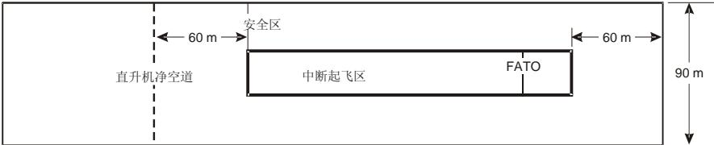

图A2-1仪表最后进近和起飞区的安全区

### 4. 障碍物环境

### 4.1 障碍物限制面和扇形区

进近面

特性进近面的界限必须由下列各边组成：

a)一条内边：水平，长度等于规定的最后进近和起飞区的最小宽度加安全区，垂直于进近面的中线并位于安全区外边上；

b)两条侧边：以内边的两端为起点并且：

i)对非精密进近的仪表最后进近和起飞区，从包含最后进近和起飞区中线的垂直面按规定的比率均匀地向外散开；

ii)对精密进近的仪表最后进近和起飞区，从包含最后进近和起飞区中线的垂直面按规定的比率均匀地向外散开到最后进近和起飞区上的规定高度，然后按规定的比率均匀地向外散开到规定的最终宽度，并以这个宽度延伸到剩下的进近面长度：和

c）一条外边：水平，垂直于进近面的中线，位于最后进近和起飞区标高以上的一个规定高度。

### 4.2 障碍物限制要求

4.2.1非精密和/或精密进近仪表最后进近和起飞区必须设置下列障碍物限制面：

a）起飞爬升面；

b）进近面；和

c)过渡面。

注：见图A2-2至A2-5。

4.2.2障碍物限制面的坡度不得大于、而它们的其他尺寸不得小于表A2-1至表A2-3中规定的数值。

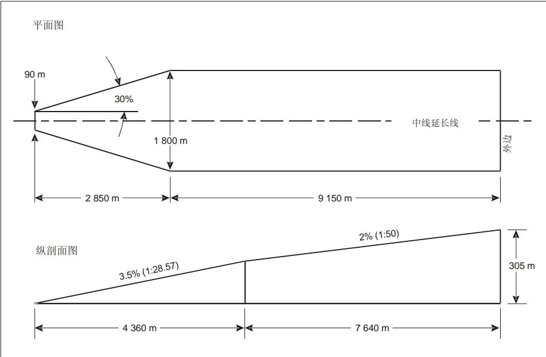

图A2-2仪表最后进近和起飞区的起飞爬升面

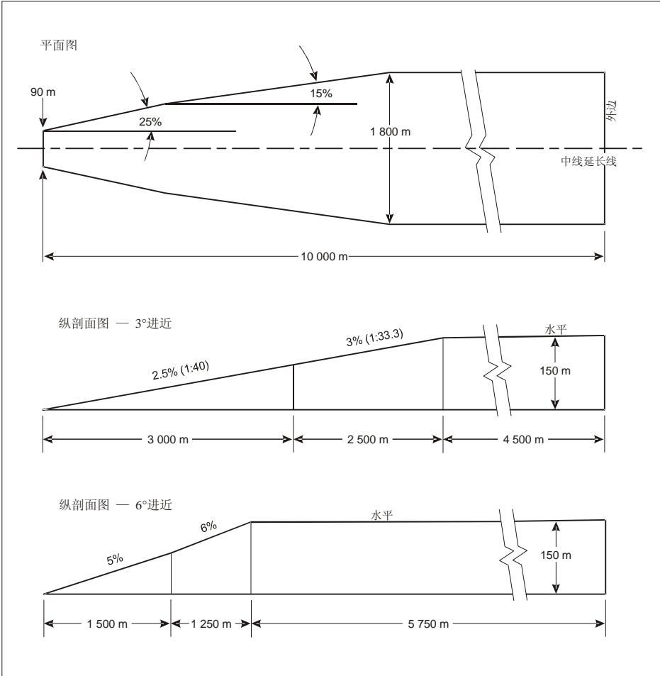

图A2-3精密进近最后进近和起飞区的进近面

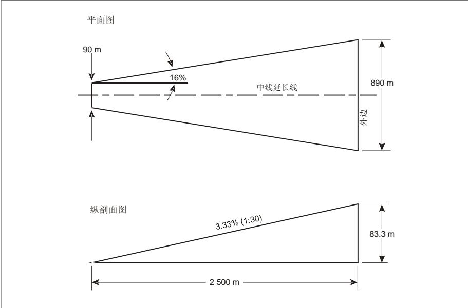

图A2-4非精密进近最后进近和起飞区的进近面

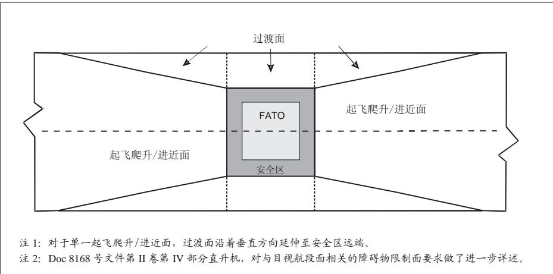

图A2-5非精密和/或精密进近仪表最后进近和起飞区的过渡面

表2-1障碍物限制面的尺寸和坡度仪表（非精密）最后进近和起飞区

<html><body><table border="1"><tr><td>限制面和尺寸</td><td></td></tr><tr><td>进近面</td><td></td></tr><tr><td>内边宽度</td><td>安全区的宽度边线</td></tr><tr><td>内边位置</td><td></td></tr><tr><td>第一航段</td><td>16%</td></tr><tr><td>散开率</td><td>一白天 一夜间</td></tr><tr><td>长度 一白天 一夜间</td><td>2 500m</td></tr><tr><td>外侧宽度</td><td>一白天 890m 一夜间</td></tr><tr><td>坡度 (最大)</td><td>33.3%</td></tr><tr><td>第二航段</td><td></td></tr><tr><td>散开率 一白天 一夜间</td><td></td></tr><tr><td>长度</td><td>一白天 一夜间</td></tr><tr><td>外侧宽度</td><td>一白天 一夜间</td></tr><tr><td>坡度 (最大)</td><td></td></tr><tr><td>第三航段</td><td></td></tr><tr><td>散开率</td><td></td></tr><tr><td>长度 一白天 一夜间</td><td></td></tr><tr><td>外侧宽度</td><td>一白天</td></tr><tr><td>坡度 (最大)</td><td>一夜间</td></tr><tr><td></td><td></td></tr><tr><td>过渡面</td><td></td></tr><tr><td>坡度</td><td>20%</td></tr><tr><td></td><td></td></tr><tr><td>高度</td><td>45m</td></tr></table></body></html>

表2-2障碍物限制面的尺寸和坡度仪表（精密）最后进近和起飞区

<html><body><table border="1"><tr><td rowspan="2"></td><td colspan="4">3°进近 高出最后进近和起飞区的高度</td><td colspan="4">6°进近 高出最后进近和起飞区的高度</td></tr><tr><td>90m (300 ft)</td><td>60m (200 ft)</td><td>45m (150 ft)</td><td>30m (100 ft)</td><td>90m (300 ft)</td><td>60m (200 ft)</td><td>45m (150 ft)</td><td>30m (100 ft)</td></tr><tr><td>限制面和尺寸 进近面</td><td></td><td></td><td></td><td></td><td></td><td></td><td></td><td></td></tr><tr><td>内边长度</td><td>90m</td><td>90m</td><td>90 m</td><td>90m</td><td>90m</td><td>90m</td><td>90m</td><td>90m</td></tr><tr><td>距最后进近和起飞 区端的距离</td><td>60 m</td><td>60 m</td><td>60m</td><td>60m</td><td>60m</td><td>60m</td><td>60m</td><td>60m</td></tr><tr><td>到高出最后进近和 起飞区的高度处的</td><td>25%</td><td>25%</td><td>25%</td><td>25%</td><td>25%</td><td>25%</td><td>25%</td><td>25%</td></tr><tr><td>每边散开率 到高出最后进近和 起飞区的高度处的</td><td>1745m</td><td>1163m</td><td>872 m</td><td>581 m</td><td>870m</td><td>580m</td><td>435m</td><td>290m</td></tr><tr><td>距离 高出最后进近和起 飞区的高度处的宽</td><td>962m</td><td>671 m</td><td>526m</td><td>380m</td><td>521m</td><td>380m</td><td>307.5 m</td><td>235m</td></tr><tr><td>度 到平行航段的散开 率</td><td>15%</td><td>15%</td><td>15%</td><td>15%</td><td>15%</td><td>15%</td><td>15%</td><td>15%</td></tr><tr><td>到平行航段的距离</td><td>2 793m</td><td>3763 m</td><td>4 246m</td><td>4733m</td><td>4 250m</td><td>4 733m</td><td>4 975 m</td><td>5217 m</td></tr><tr><td>平行航段的宽度</td><td>1 800m</td><td>1 800m</td><td>1 800 m</td><td>1 800 m</td><td>1 800 m</td><td>1 800 m</td><td>1 800 m</td><td>1 800 m</td></tr><tr><td>到外边的距离</td><td>5 462 m</td><td>5074m</td><td>4 882 m</td><td>4 686m</td><td>3380m</td><td>3187m</td><td>3 090 m</td><td>2 993m</td></tr><tr><td>外边的宽度</td><td>1 800 m</td><td>1 800 m</td><td>1 800 m</td><td>1 800 m</td><td>1 800 m</td><td>1 800m</td><td>1 800 m</td><td>1 800 m</td></tr><tr><td>第一航段的坡度</td><td>2.5%</td><td>2.5%</td><td>2.5%</td><td>2.5%</td><td>5%</td><td>5%</td><td>5%</td><td>5%</td></tr><tr><td>第一航段的长度</td><td>(1:40) 3000 m</td><td>(1:40) 3000m</td><td>(1:40) 3000 m</td><td>(1:40) 3000 m</td><td>(1:20) 1 500m</td><td>(1:20) 1 500 m</td><td>(1:20) 1 500 m</td><td>(1:20) 1 500m</td></tr><tr><td>第二航段的坡度</td><td>3% (1:33.3)</td><td>3% (1:33.3)</td><td>3%</td><td>3% (1:33.3)</td><td>6%</td><td>6%</td><td>6%</td><td>6%</td></tr><tr><td>第二航段的长度</td><td>2 500m</td><td>2 500 m</td><td>(1:33.3) 2 500 m</td><td>2 500 m</td><td>(1:16.66) 1 250m</td><td>(1:16.66) 1 250 m</td><td>(1:16.66) 1 250 m</td><td>(1:16.66) 1 250m</td></tr><tr><td>限制面的总长度</td><td>10 000 m</td><td>10 000 m</td><td>10 000 m</td><td>10 000 m</td><td>8500 m</td><td>8500 m</td><td>8500 m</td><td>8 500 m</td></tr><tr><td>过渡面</td><td></td><td></td><td></td><td></td><td></td><td></td><td></td><td></td></tr><tr><td>坡度</td><td>14.3%</td><td>14.3%</td><td>14.3%</td><td>14.3%</td><td>14.3%</td><td>14.3%</td><td>14.3%</td><td>14.3%</td></tr><tr><td></td><td></td><td></td><td></td><td></td><td></td><td></td><td></td><td></td></tr><tr><td>高度</td><td>45m</td><td>45m</td><td>45m</td><td>45m</td><td>45m</td><td>45m</td><td>45m</td><td>45m</td></tr></table></body></html>

表A2-3障碍物限制面的尺寸和坡度直线起飞

<html><body><table border="1"><tr><td>限制面和尺寸</td><td>仪表</td></tr><tr><td>起飞爬升面</td><td></td></tr><tr><td>内边宽度</td><td>90 m</td></tr><tr><td>内边位置</td><td>净空道的边线或端部</td></tr><tr><td>第一航段</td><td></td></tr><tr><td>散开率</td><td>一白天 30%</td></tr><tr><td>长度</td><td>一夜间 一白天 2 850 m</td></tr><tr><td>外侧宽度</td><td>一夜间 一白天 1 800 m</td></tr><tr><td>坡度 (最大)</td><td>一夜间 3.5%</td></tr><tr><td></td><td></td></tr><tr><td>第二航段 散开率 一白天</td><td>平行</td></tr><tr><td>长度</td><td>一夜间 一白天 1510m</td></tr><tr><td>外侧宽度</td><td>一夜间</td></tr><tr><td></td><td>一白天 1 800m 一夜间</td></tr><tr><td>坡度 (最大)</td><td>3.5%</td></tr><tr><td>第三航段</td><td></td></tr><tr><td>散开率 一白天</td><td>平行</td></tr><tr><td>长度 一夜间</td><td>7 640 m</td></tr><tr><td>外侧宽度 一白天 一夜间</td><td>1 800m</td></tr><tr><td>坡度 (最大)</td><td>2%</td></tr><tr><td>* 该坡度超过目前正在使用的许多直升机在一发失效情况下以最 大质量爬升时的爬升坡度。</td><td></td></tr></table></body></html>

### 5. 目视助航设备

### 5.1 灯光

进近灯光系统

5.1.1建议：当为非精密最后进近和起飞区设置进近灯光系统时，该系统的长度不应小于210m。

5.1.2建议：恒定光强灯的光强分布应如图5-11例示2中所示，但非精密最后进近和起飞区的光强应增加3倍。

表2-4障碍物保护面的尺寸和坡度

<html><body><table border="1"><tr><td>保护面和尺寸</td><td colspan="2">非精密最后进近和起飞区</td></tr><tr><td>内边的长度</td><td colspan="2">安全区的宽度</td></tr><tr><td>距最后进近和起飞区端的距离</td><td colspan="2">60m</td></tr><tr><td>散开率</td><td colspan="2">15%</td></tr><tr><td>全长</td><td colspan="2">2 500 m</td></tr><tr><td rowspan="3">坡度</td><td>PAPI</td><td>$A_^{2}- 0.5$</td></tr><tr><td>HAPI</td><td>$A_{ - 0.65$</td></tr><tr><td>APAPI</td><td>$A^{ }- 09$</td></tr><tr><td colspan="3">a.如附件14第I卷图5-19 中所示。 b.“低于进近坡”信号上部边界的角度。</td></tr></table></body></html>

